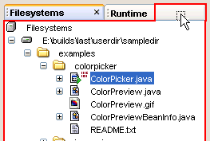
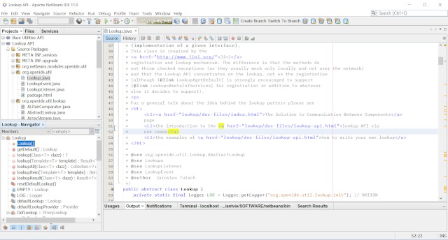

////
     Licensed to the Apache Software Foundation (ASF) under one
     or more contributor license agreements.  See the NOTICE file
     distributed with this work for additional information
     regarding copyright ownership.  The ASF licenses this file
     to you under the Apache License, Version 2.0 (the
     "License"); you may not use this file except in compliance
     with the License.  You may obtain a copy of the License at

       http://www.apache.org/licenses/LICENSE-2.0

     Unless required by applicable law or agreed to in writing,
     software distributed under the License is distributed on an
     "AS IS" BASIS, WITHOUT WARRANTIES OR CONDITIONS OF ANY
     KIND, either express or implied.  See the License for the
     specific language governing permissions and limitations
     under the License.
////
= Apache NetBeans History
:jbake-type: page
:jbake-tags: about
:jbake-status: published
:keywords: Apache NetBeans History
:description: Apache NetBeans History
:toc: left
:toc-title:
:icons: font
include::../inc/database.adoc[]

== The student project

NetBeans started as a student project (originally called Xelfi) in the Czech
Republic, in 1996. The goal was to write a link:{wikipedia}Delphi_%28IDE%29[Delphi]-like Java IDE (Integrated
Development Environment) in Java. 

Xelfi was the first Java IDE written in Java, with its first pre-releases in

[start=1997]
. Xelfi was a fun project to work on, especially since the Java IDE space
was uncharted territory at that time.

image::nb-history-1.png[caption="", title="Here you see the original group of students who constituted the original NetBeans Team"]

The project attracted enough interest that the students, once they graduated,
decided that they could market it as a commercial product selling it as
shareware. Soliciting resources from friends and relatives for a website, they 
tried to form a company around it.

=== Xelfi

Soon after, they were contacted by Roman Stanek, at the time a Director of Operation
in an IT company, that wanted to build his own company and was looking for 
talented programmers. He was looking for a good idea to invest in, and
discovered Xelfi. He met with the founders; they hit it off, and a business was
born. 

=== NetBeans = Network + Java Beans

The original business plan was to develop network-enabled JavaBeans components.
link:http://wiki.apidesign.org/wiki/User:JaroslavTulach[Jaroslav Tulach], who
designed the IDE's basic architecture, came up with the name *NetBeans* (from
Network and Java Beans) to describe what the components would do. The IDE would
be the way to deliver them. 

When the specification for Enterprise Java Beans came out, it made more sense
to work with the standard for such components than to compete with it, but the
name stuck.

In the spring of 1999, NetBeans DeveloperX2 was released, adopting the
`javax.swing.*` package names from the previous `com.sun.swing.*` ones.
NetBeans was the first tool in on the market to support these new package
names, and that increased a lot the awareness of NetBeans.

The performance improvements that came in JDK 1.3, released in the fall of 1999,
made NetBeans a viable choice for development tools. By the summer of 1999, the
team was hard at work re-architecting DeveloperX2 into the more modular
NetBeans that forms the basis of the software today.

=== The First Modular Architecture

Along the way, an interesting thing happened. People began building
applications using the NetBeans IDE's platform, together with their own
plugins, often creating applications that were not development tools at all. In
fact, this turned out to have quite a market. 

Later, in 2000 and 2001, a lot of work went into stripping out pieces that made
the assumption that an application built on NetBeans was an IDE, so that the
platform would be a generic desktop application suitable to any purpose. This
work turned out to be healthy for the codebase of the IDE as well, encouraging
a clean API design and a separation of concerns. This is the reason why
some of the modules of NetBeans are called `org.openide`.

== The Sun era: open source

Something else was afoot in the summer of 1999. Sun Microsystems wanted better
Java development tools, and had become interested in NetBeans. It was a dream
come true for the NetBeans team. NetBeans would become the flagship tool set of
the maker of Java itself! 

By the Fall, with the next generation of NetBeans Developer in beta, a deal was
struck. Sun Microsystems had also acquired another tools company, Forté, at the
same time, and decided to rename NetBeans to Forté for Java. The name NetBeans
was dropped... for a while.

During the acqusition, the young developers who had been involved in
open-source projects for most of their programming careers, mentioned the idea
of open-sourcing NetBeans. Fast forward to less than six months later, the
decision was made that NetBeans would be open sourced. 

While Sun had contributed considerable amounts of code to open source projects
over the years, this was Sun's first sponsored open source project, one in
which Sun would be paying for the site and handling the infrastructure. The
very first decision made was that it sounded logical to call the new site:
NetBeans.org.  

[.feature]
--
image::netbeans-2000-small.png[caption="", title"The NetBeans debugger on Linux in 2000", link="netbeans-2000.png"]
--

In June 2000, the initial netbeans.org web site was launched.
The years that followed focused on continual enhancements from release to
release, as described in the section below.

=== From NetBeans 3.2 to NetBeans 3.6

The first year (through NetBeans 3.2), the project spent trying to find its
feet. The next few years involved learning about what worked in terms of
open-source processes. (In the first two years, the development process was so
open that more time was spent debating than implementing.) 

The growing pains paid off. With NetBeans 3.5, huge strides in performance were
made, and tests and processes put in place to prevent regressions. With 3.6,
the windowing system and property sheet were reimplemented, and the user
interface cleaned up tremendously.

=== NetBeans 4

NetBeans 4, released in December 2004, was a complete change in the way the IDE
worked. A new project system not only revamped the user experience, but also
made it possible to replace infrastructure that had held the NetBeans back. 

The release introduced a project system based on Apache Ant, added JDK 1.5 Support
and had initial support for mobility projects.

[.feature]
--
image::netbeans-40-small.png[caption="", title"NetBeans 4.0 and the Form Editor", link="netbeans-40.png"]
--

The NetBeans 4.1 release (may 2005) was built on top of the new project
infrastructure of 4.0, and added more features and full J2EE support.  

=== NetBeans 5

NetBeans 5 (january, 2006) introduced comprehensive support for developing IDE
modules and rich client applications based on the NetBeans platform; an
intuitive GUI builder (Matisse); new and redesigned CVS support; support for
Sun ApplicationServer 8.2, Weblogic 9 and JBoss 4.

NetBeans 5.5 (october, 2006) and 5.5.1 (may, 2007) supported the Sun Java
System Application Server PE 9 and 9.1 (Glassfish) as well as Java EE 5 API compliance
(JPA, JAX-WS, EJB 3), and through "Enterprise Packs" included enhanced support
for Mobility, C/C++ Projects, SOA applications and BPEL.

=== NetBeans 6

NetBeans 6 (december, 2007) focused on improved developer productivity through a rewritten,
smarter and faster editor, together with the integration of external NetBeans
products into one IDE.

In August, 2010, NetBeans 6.9.1 was released with link:https://www.osgi.org/[OSGi support],
bundling the link:https://felix.apache.org/[Apache Felix OSGi container]. It also
supported link:https://openjfx.io/[JavaFX 1.3.1], was Java EE 6 compliant and
included support for PHP, Ruby, C and C++ and many other features.

== The Oracle era

When Oracle acquired Sun in 2010, NetBeans became part of Oracle. Oracle
actively seeked for new developers to work on the NetBeans team and sees
NetBeans IDE as the official IDE for the Java Platform.

=== NetBeans 7

NetBeans 7 was released together with JDK 7, providing editor tools for working
with new JDK 7 language constructs, together with support for JavaFX 2.0.

NetBeans 7.1 introduced xref:../wiki/OSGiAndNetBeans.adoc[Netigso] from (Net and 
a reversed OSGi). This was reused in Oracle's JDeveloper as well,
with link:http://wiki.apidesign.org/wiki/JDeveloper[important performance enhancements].

Releases from NetBeans 7.2 (january, 2012) to NetBeans 7.4 (october, 2015) continued
introducing important features (HTML5, Cordova application development, enhanced
JavaScript support and more) and improving performance.

=== NetBeans 8

NetBeans 8.0 (march, 2014) introduced full JDK 8 support for working with
Profiles, Lambdas and Streams. Java ME Embedded 8 support and a wide
range of JavaEE compliant application servers (WildFly, WebLogic, GlassFish, TomcatEE).

It also continued improving support for Maven, HTML5, PHP, C/C++ and JavaScript.

The 8 series last release was NetBeans 8.2 (october, 2016) that introduced
ECMAScript 6 enhancements and experimental ECMAScript 7 support, while
improving node.js, Oracle JET and PHP 7 support.

== The Apache Incubator era

In 2016 Oracle donated the source code of NetBeans to the link:https://www.apache.org/[Apache Software Foundation],
and started as a podling in the link:https://incubator.apache.org/[Apache Incubator Project].

During approximately two years and a half many volunteers joined the podling, and work started to
adapt the codebase to comply with the Apache Software Foundation Guidelines. 
The xref:../community/index.adoc[Apache NetBeans Community] started growing, and in april 2019 the
podling became a Top Level Apache Project.

=== NetBeans 9

In July, 2018, the Apache NetBeans Team released
xref:../download/nb90/index.adoc[Apache NetBeans (Incubating) 9],
the first release of the Apache NetBeans (incubating), with the main objectives
of IP clearance from the Oracle code donation and adding Java 10 support.

In October, 2018, link:https://blogs.oracle.com/java/announcing-2018-dukes-choice-award-winners[Apache NetBeans (incubating)] was
honored as a Duke's Choice Award Winner.

=== NetBeans 10

In December, 2018, the Apache NetBeans Team released
xref:../download/nb100/index.adoc[Apache NetBeans (Incubating) 10], the second release of the Apache NetBeans (incubating), 
focusing in adding support for JDK 11, JUnit 5, PHP, JavaScript and Groovy, while solving many issues.

=== NetBeans 11

In March, 2019, xref:../download/nb110/index.adoc[Apache NetBeans (Incubating) 11] was announced as the
  third release of Apache NetBeans, sporting a renewed Gradle Support, a Maven First project wizard,
  Java EE and JDK 12 support, as well as initial versions of NetBeans Maven Plugins the Apache NetBeans Tutorials.

[.feature]
--

--

== The Apache Top Level Project era

In April, 2019, the Apache NetBeans (Incubating) podling became a Top Level Apache Project.

Today, the Apache NetBeans Team couldn't be prouder of how far the NetBeans project
and community has come. It is also worth noting that many of the original
architects are still involved in the project, and can be found participating on
the NetBeans mailing lists. 

Welcome to Apache NetBeans! The Apache NetBeans Community xref:../participate/index.adoc[is inviting you to participate!].

