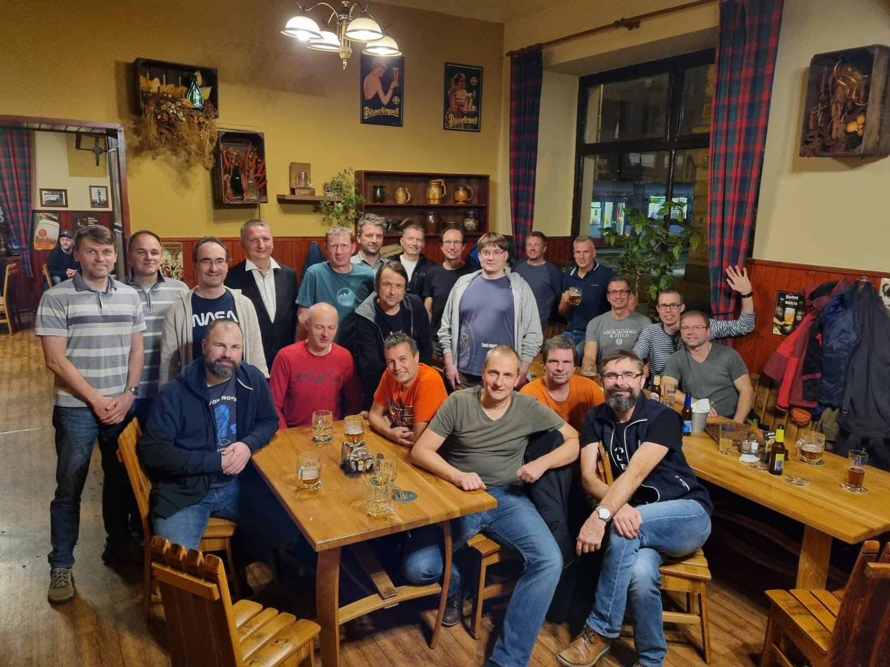

// 
//     Licensed to the Apache Software Foundation (ASF) under one
//     or more contributor license agreements.  See the NOTICE file
//     distributed with this work for additional information
//     regarding copyright ownership.  The ASF licenses this file
//     to you under the Apache License, Version 2.0 (the
//     "License"); you may not use this file except in compliance
//     with the License.  You may obtain a copy of the License at
// 
//       http://www.apache.org/licenses/LICENSE-2.0
// 
//     Unless required by applicable law or agreed to in writing,
//     software distributed under the License is distributed on an
//     "AS IS" BASIS, WITHOUT WARRANTIES OR CONDITIONS OF ANY
//     KIND, either express or implied.  See the License for the
//     specific language governing permissions and limitations
//     under the License.
//

= NetBeans Pub Hangout in Prague
:author: Geertjan Wielenga
:revdate: 2022-10-24
:jbake-type: post
:jbake-tags: blogentry
:jbake-status: published
:keywords: Apache NetBeans 18 release
:description: Apache NetBeans 18 release
:toc: left
:toc-title:
:syntax: true

A group of Java engineers gathered in a pub in Prague last night to celebrate many years 
of their engagement in NetBeans, all having worked in Sun Microsystems or Oracle or both, 
continuing into the Apache world where NetBeans is now found.

This will not be the last of such gatherings, anyone involved in NetBeans over
the years is more than welcome to attend or set up similar get togethers, 
ideally in a pub, which is also where NetBeans started.

