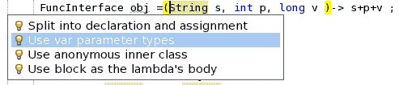
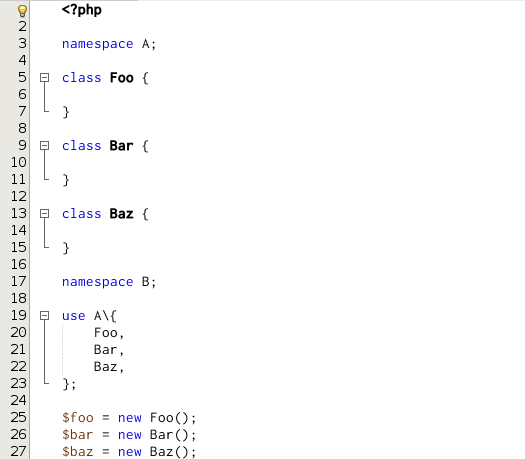
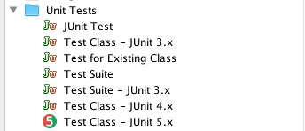

////
     Licensed to the Apache Software Foundation (ASF) under one
     or more contributor license agreements.  See the NOTICE file
     distributed with this work for additional information
     regarding copyright ownership.  The ASF licenses this file
     to you under the Apache License, Version 2.0 (the
     "License"); you may not use this file except in compliance
     with the License.  You may obtain a copy of the License at

       http://www.apache.org/licenses/LICENSE-2.0

     Unless required by applicable law or agreed to in writing,
     software distributed under the License is distributed on an
     "AS IS" BASIS, WITHOUT WARRANTIES OR CONDITIONS OF ANY
     KIND, either express or implied.  See the License for the
     specific language governing permissions and limitations
     under the License.
////
= Apache NetBeans (incubating) 10.0 Features
:jbake-type: page
:jbake-tags: 10.0 features
:jbake-status: published
:keywords: Apache NetBeans 10.0 IDE features
:icons: font
:description: Apache NetBeans 10.0 (incubating) features
:toc: left
:toc-title: 
:toclevels: 4

////

This is the NetBeans 10.0 feature page.

nb100/index.asciidoc -> NetBeans 10.X feature page
nb100/nb100.asciidoc -> NetBeans 10.0 release information (voting links, etc.)
...
nb100/nb101.asciidoc (if any) -> NetBeans 10.1 release information

////

Apache NetBeans (incubating) 10.0 is the second major release of the Apache NetBeans IDE. It was released in December, 2018. xref:nb100.adoc[Click here to download] this release.

This release is focused in adding support for JDK 11, JUnit 5, PHP, JavaScript and Groovy, as well in solving many issues.

////
To display a feature do as follows:

Add a header title, and an anonymous asciidoc block (--) with the ".feature" metadata, and write text inside the block:

== A title here
[.feature]
--
This is a feature
--

You can add images to the feature by adding a png file along with the document, and adding a image: construct to the text.

Use role="left" for left alignment or role="right" for right alignment.

Examples:

== An amazing feature
[.feature]
--
Here goes some text

image:nb90-module-info.png[Adding module-info.java, title="Adding module-info.java", role="left", link="nb90-module-info.png"]

And some more text

image:nb90-module-info-completion.png[Autocompletion in module-info.java, title="Autocompletion in module-info.java", role="right", link="nb90-module-info-completion.png"]

And even some more
--

Note: When rendered into HTML, the images will automatically be wrapped around 'colorbox', so that they're enlarged when clicked.

////

== JDK 11 Support

JDK 11 support has been enhanced in the following ways:

- Integration with the link:https://github.com/oracle/nb-javac[nb-javac] project, adding support for JDK 11.
- Removed the CORBA modules.
- Support for link:https://openjdk.org/jeps/309[JEP 309, Dynamic Class-File Constants].
- Support for link:https://openjdk.org/jeps/323[JEP 323, Local-Variable Syntax for Lambda Parameters].
- Support for link:https://cwiki.apache.org/confluence/display/NETBEANS/LVTI+Support+for+Lamdba+Parameters+in+NetBeans+10[LVTI Support for Lamdba Parameters]

- Code completion for var lambda parameters

image:var-autocomplete-1st-param.png[Code completion support for var type lambda parameters.(JDK 11 and above)]

See the link:https://cwiki.apache.org/confluence/display/NETBEANS/Feature%3A+JDK+11[JDK 11 Confluence Page] for more detailed features.

== PHP Support

All the PHP support for NetBeans 10 was contributed by our NetBeans committer
xref:../../community/who.adoc#_junichi_yamamoto[Junichi Yamamoto]. 

These are some of the new features:

=== PHP 7.3
[.feature]
--

You can now add trailing commas in function calls under PHP 7.3 (link:https://lists.apache.org/thread.html/3f7fee458f5b47d5531ad42350c6e7f619636f0708b6bbc33db2f49a@%3Cdev.netbeans.apache.org%3E[mailing list thread]).

image::nb100-php73-trailing-comma-in-function-calls-small.png["Trailing commas in function calls in PHP 7.3", role="left", link="nb100-php73-trailing-comma-in-function-calls.png"]

And also use the link:https://wiki.php.net/rfc/list_reference_assignment[list reference assignment]

image::nb100-php73-list-reference-assignment.png[role="right"]

The link:https://wiki.php.net/rfc/flexible_heredoc_nowdoc_syntaxes[flexible Heredoc and Nowdoc Syntaxes] are also supported.

image::nb100-php73-flexible-heredoc-and-nowdoc-syntaxes.png[role="left"]

--

=== PHP 7.2
[.feature]
--
For PHP 7.2 we support trailing commas in list syntax, coloring for object types and PHP version in project properties.

--

=== PHP 7.1
[.feature]
--
For PHP 7.1 we have class constant visibility, multi-catch exception handling, nullable types, support for keys in list(), 
coloring for new keywords (void, iterable).

image::nb100_php_editor_class_constant_visibility_01.png[role="left"]
--

=== More PHP features

And more: context sensitive lexer, PHPStan support, debugger, twig, hints, suggestions, code completion... visit link:https://cwiki.apache.org/confluence/display/NETBEANS/Feature%3A+PHP[PHP Features Page] 
and link:https://cwiki.apache.org/confluence/display/NETBEANS/Apache+NetBeans+10.0+New+and+Noteworthy#ApacheNetBeans10.0NewandNoteworthy-OpenJDK[NetBeans 10 New and Noteworthy] 
for more details on PHP support.

== JUnit 5

[.feature]
--

JUnit 5.3.1 has been added as a new Library to NetBeans, so you can quickly add
it to your Java projects. For Maven projects without existing tests, JUnit 5
is now the default JUnit version.

image:nb100-junit5-library-small.png[JUnit 5 Library, role="left", link="nb100-junit5-library.png"]

The JUnit 5 `@Testable` annotation is also supported. Any method that includes
an annotation that inherits from this, will be allowed to be executed with
these action menu items.

Default JUnit 5 Test Template provided out of the box. Note JUnit 5 doesn't
currently support test suite's for its Jupiter engine, so the template provided
will attempt to create a test suite using the Vintage engine. 

--

