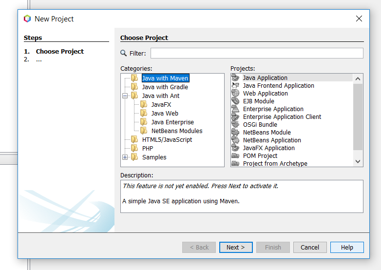

////
     Licensed to the Apache Software Foundation (ASF) under one
     or more contributor license agreements.  See the NOTICE file
     distributed with this work for additional information
     regarding copyright ownership.  The ASF licenses this file
     to you under the Apache License, Version 2.0 (the
     "License"); you may not use this file except in compliance
     with the License.  You may obtain a copy of the License at

       http://www.apache.org/licenses/LICENSE-2.0

     Unless required by applicable law or agreed to in writing,
     software distributed under the License is distributed on an
     "AS IS" BASIS, WITHOUT WARRANTIES OR CONDITIONS OF ANY
     KIND, either express or implied.  See the License for the
     specific language governing permissions and limitations
     under the License.
////
= Apache NetBeans (incubating) 11.0 Features
:jbake-type: page
:jbake-tags: 11.0 features
:jbake-status: published
:keywords: Apache NetBeans 11.0 IDE features
:icons: font
:description: Apache NetBeans 11.0 (incubating) features
:toc: left
:toc-title: 
:toclevels: 4
:syntax: true
:source-highlighter: pygments
:experimental:

////

This is the NetBeans 11.0 feature page.

nb110/index.asciidoc -> NetBeans 11.X feature page
nb110/nb110.asciidoc -> NetBeans 11.0 release information (voting links, etc.)
...
nb110/nb111.asciidoc (if any) -> NetBeans 11.1 release information

////

Apache NetBeans (incubating) 11.0 is the third major release of the Apache NetBeans IDE. It was released in March, 2019. xref:../nb110/nb110.adoc[Click here to download] this release. xref:../../community/who.adoc#_laszlo_kishalmi[Laszlo Kishalmi] has been our Release Manager.

////
To display a feature do as follows:

Add a header title, and an anonymous asciidoc block (--) with the ".feature" metadata, and write text inside the block:

== A title here
[.feature]
--
This is a feature
--

You can add images to the feature by adding a png file along with the document, and adding a image: construct to the text.

Use role="left" for left alignment or role="right" for right alignment.

Examples:

== An amazing feature
[.feature]
--
Here goes some text

image:nb90-module-info.png[Adding module-info.java, title="Adding module-info.java", role="left", link="nb90-module-info.png"]

And some more text

image:nb90-module-info-completion.png[Autocompletion in module-info.java, title="Autocompletion in module-info.java", role="right", link="nb90-module-info-completion.png"]

And even some more
--

Note: When rendered into HTML, the images will automatically be wrapped around 'colorbox', so that they're enlarged when clicked.

////

== Maven First in New Project Wizard

[.feature]
--
There's been lots of discussion in the Apache NetBeans Community about how best
to express the fact that Apache Maven and Gradle are more modern choices
to be aware of than Apache Ant, while at the same time not implying that
there's anything wrong with using Apache Ant.

Discussions link:https://github.com/apache/incubator-netbeans/pull/1038[started back in 2018],
and link:https://github.com/apache/incubator-netbeans/pull/1115[culminated in 2019] 
with the new "New Project" wizard redesign.

We have moved the previous wizard Java options to a subfolder named "Java with Ant", and added
two new options: "Java with Maven" and "Java with Gradle".  We hope this makes it easier for everybody to choose a build system of their liking
(be it Maven, Gradle or Ant) for their projects. 

For more information about the discussion and the rationale behind 
these choices please see link:https://blogs.apache.org/netbeans/entry/restructuring-of-project-templates-in[this blog post].

--

== JDK 12 support

=== nb-javac upgrade

As you may know, the Apache NetBeans IDE can use a special variation of a Java
compiler called link:https://blogs.apache.org/netbeans/entry/what-s-nb-javac-in[nb-javac], that
greatly improves the Java support. This `nb-javac` tool (which is not an Apache
Project as it's released under the GPL license) has been improved to support advanced
JDK 12 features.

Apache NetBeans Team Members
link:https://issues.apache.org/jira/secure/ViewProfile.jspa?name=arunava.sinha[Arunava Sinha],
link:https://issues.apache.org/jira/secure/ViewProfile.jspa?name=sakeshar[Sarvesh Kesharwani], 
and link:https://issues.apache.org/jira/secure/ViewProfile.jspa?name=vikas.prabhakar[Vikas Kumar Prabhakar]
have made a 
link:https://issues.apache.org/jira/issues/?jql=labels%20%3D%20NB-JDK12[heroic effort] to integrate Apache NetBeans
with this latest release of `nb-javac`. 

=== Switch improvements 

The `switch` expression handling has been greatly improved in this release.
Better formatting, better re-indentation, better syntax-highlighting,
better hints and better auto-completion. 

==== Autocompletion

You can now autocomplete enum values in switch statements:

image:switch-autocomplete.png[]

==== JEP-325: Switch Expressions (Preview)

We now have link:https://openjdk.org/jeps/325[JEP-325] support. In order to enable
JEP-325 (and other preview features) follow these instructions:

1. Goto `Project > Properties`
2. Goto `Build > Compiling pane` and  add `--enable-preview` in "Additional Compiler Options".
3. Goto `Run` pane and add `--enable-preview` in VM Options

NOTE: `--enable-preview` does not work in Maven projects in Apache NetBeans 11 as of yet, but the
link:https://github.com/apache/incubator-netbeans/pull/1173[issue is being tracked here].

==== Converting switch-cases to rule kind cases

There's a new hint to convert switch-cases to rule kind classes. For instance, in this scenario:

image:jep-325-hint-1.jpg[]

if you choose the hint the result will be:

image:jep-325-hint-2.jpg[]

That's cleaner, right?

==== And more

See link:https://cwiki.apache.org/confluence/pages/viewpage.action?pageId=103091452[our wiki] for more
improvements to the `switch` expression.

== Java EE support

We have been busy in the last months 
link:https://cwiki.apache.org/confluence/display/NETBEANS/2nd+Donation%3A+List+of+Modules+to+Review[reviewing the licenses of the enterprise cluster],
that was included in the second donation from Oracle. The review has now ended
(after link:https://github.com/apache/incubator-netbeans/pulls?utf8=%E2%9C%93&q=is%3Apr+%22Module+review%22[lots of pull requests])
and we have included this cluster in Apache NetBeans 11.0.

This means that you can now build JavaEE applications with Ant, Maven or Gradle projects. 

NOTE: Explicit support of Java EE 8 is link:https://lists.apache.org/thread.html/f53f087e4aee0f6b52872a9b9789e69d2d6011fce3df7952bcb7223d@%3Cusers.netbeans.apache.org%3E[not currently part] of Apache NetBeans 11.0.  Also, JavaEE 8
only runs on JDK 8, not on later releases, and so if you 're doing development with JavaEE 8 it's
best to run NetBeans itself on JDK 8.

NOTE: In order to comply with the Apache License we had to drop support for JBoss 4,
WebLogic 9 and the module `websvc.switmodellext` had to be dropped as well.

== Gradle Support

[.feature]
--

In late December, 2018, Apache NetBeans Team Member xref:../../community/who.adoc#_laszlo_kishalmi[Laszlo Kishalmi]
kindly donated link:https://mail-archives.apache.org/mod_mbox/netbeans-dev/201812.mbox/%3Cade97a90-84c9-c566-b23a-9c5ccf40ec2f%40gmail.com%3E[his Gradle works to Apache NetBeans]. 

image::gradle-navigator.png[Navigation of Gradle build script, title="Navigating the Gradle build script", role="left"]

Since then he has been steadily link:https://issues.apache.org/jira/issues/?jql=project%20%3D%20NETBEANS%20AND%20component%20%3D%20%22projects%20-%20Gradle%22%20and%20status%20!%3D%20Open[working very hard] 
to solve many issues and doing improvements.

As a result you can now:

- Open Gradle projects out of the box.
- Gradle Task Navigator, run tasks by double-click.
- Gradle supported unit test frameworks (JUnit 4, 5, TestNG) works with Code Coverage with JaCoCo.
- Gradle projects work together with NetBeans JPA and Spring Support.
- Customizable task execution and IDE action binding.
- Run, Debug and Test even single methods.
- Creating new projects with Gradle.

--

== Other enhancements

link:https://github.com/eirikbakke[Eirik Bakke] has link:https://github.com/apache/incubator-netbeans/pull/859[added support for HiDPI icons for window system icons] on Windows and Mac. This introduces vector-drawn icon implementations for the icons used in the window system's Windows 8 and Aqua LAFs. 

Also, for this release the Apache NetBeans Team has been busy
link:https://issues.apache.org/jira/issues/?jql=project%20%3D%20NETBEANS%20AND%20(status%20%3D%20Resolved%20OR%20status%20%3D%20Closed)%20AND%20fixVersion%20%3D%2011.0%20%20[fixing 99 issues].

== Tutorials

The NetBeans tutorials have also been integrated for this release and are available here:

- xref:../../kb/docs/ide/index.adoc[NetBeans IDE tutorials]
- xref:../../kb/docs/web/index.adoc[Web Technologies tutorials]
- xref:../../kb/docs/java/index.adoc[Java tutorials]
- xref:../../kb/docs/javaee/index.adoc[Java EE tutorials]
- xref:../../kb/docs/php/index.adoc[PHP tutorials]

Many of these tutorials are being reviewed. See xref:../../kb/docs/contributing.adoc[these guidelines] if
you want to help with the review.

== Maven plugins

xref:../../community/who.adoc#_eric_barboni[Eric Barboni] has 
done a great job setting up the link:https://github.com/apache/incubator-netbeans-mavenutils[mavenutils] 
repository, that holds different plugins that will make it possible to start
publishing the NetBeans bits in a Maven repository.

See link:https://bits.netbeans.org/mavenutilities/nbm-maven-plugin/index.html[NetBeans m2 plugin] for
more details.

== Javadoc

For this release we have also started publishing our Javadoc:

- link:https://bits.netbeans.org/dev/javadoc/[Latest dev javadoc]
- link:https://bits.netbeans.org/11.0/javadoc/[Release 11.0 javadoc]
- link:https://bits.netbeans.org/10.0/javadoc/[Release 10.0 javadoc]
- link:https://bits.netbeans.org/9.0/javadoc/[Release 9.0 javadoc]

