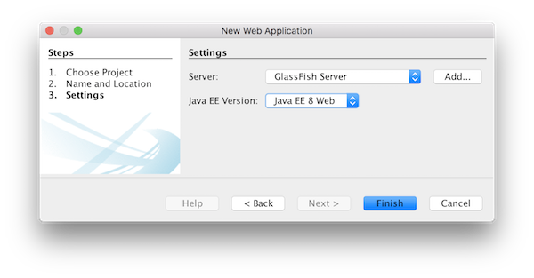
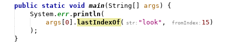
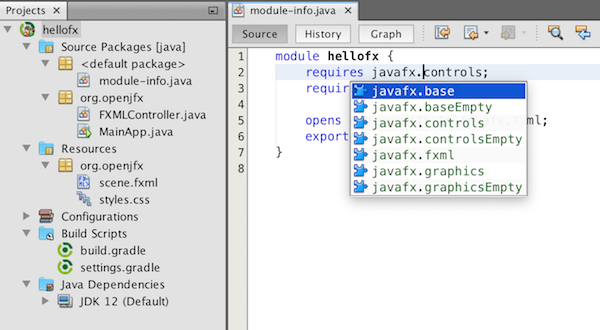

////
     Licensed to the Apache Software Foundation (ASF) under one
     or more contributor license agreements.  See the NOTICE file
     distributed with this work for additional information
     regarding copyright ownership.  The ASF licenses this file
     to you under the Apache License, Version 2.0 (the
     "License"); you may not use this file except in compliance
     with the License.  You may obtain a copy of the License at

       http://www.apache.org/licenses/LICENSE-2.0

     Unless required by applicable law or agreed to in writing,
     software distributed under the License is distributed on an
     "AS IS" BASIS, WITHOUT WARRANTIES OR CONDITIONS OF ANY
     KIND, either express or implied.  See the License for the
     specific language governing permissions and limitations
     under the License.
////
= Apache NetBeans 11.1 Features
:jbake-type: page_noaside
:jbake-tags: 11.1 features
:jbake-status: published
:keywords: Apache NetBeans 11.1 IDE features
:icons: font
:description: Apache NetBeans 11.1 features
:toc: left
:toc-title: 
:toclevels: 4
:syntax: true
:source-highlighter: pygments
:experimental:
:linkattrs:

Apache NetBeans 11.1 is the first Apache NetBeans release outside the Apache Incubator and the link:https://cwiki.apache.org/confluence/display/NETBEANS/Release+Schedule[first release of the new quarterly release cycle].

TIP: The LTS release of the Apache NetBeans 11 cycle is Apache NetBeans 11.0. The 11.1 release has not been tested as heavily as the LTS release and may therefore be less stable. Use 11.1 to use the latest features and to provide feedback for the next LTS release, scheduled for April 2020. Go here to download  xref:../nb110/nb110.adoc[Apache NetBeans 11.0], the current LTS release.

xref:nb111.adoc[Download, role="button success"]

== Java EE

The highlights of enhancements in the Java EE area are the new Java EE 8 support, as well as the new and updated integration with Payara and GlassFish.

- Java EE 8 support, for the first time, for Maven-based and Gradle-based Web applications. The new Java EE 8 support provides the ability to create Java EE 8 applications and deploy to a Java EE 8 container, with new "webapp-javaee8" Maven archetype created for use with Apache NetBeans.

- Payara integration out of the box for the first time, with thanks to the Payara team. 
- Support for GlassFish 5.0.1.

== Java

The highlights of enhancements in the Java area are the support for new Java language features, integration with Gluon OpenJFX samples, together with enhancements and fixes for usage of the Maven and Gradle build systems.

=== Java Editor

The highlights of enhancements specifically in the Java Editor area are the support for new Java language features, including those provided by JEP-325 and JEP-330, as well as the initial support for inline parameters.

- Integration of support for JEP-330: link:https://github.com/apache/netbeans/pull/1171[https://github.com/apache/netbeans/pull/1171]
- Initial support for inline parameter name hints for Java: link:https://github.com/apache/netbeans/pull/1247[https://github.com/apache/netbeans/pull/1247]

- Code completion for JEP-325 preview feature for multiple case labels: link:https://github.com/apache/netbeans/pull/1175[https://github.com/apache/netbeans/pull/1175]

image::code-completion-multiple-case.png[]

- Hint for converting to JEP-325 preview feature for switch expressions: link:https://github.com/apache/netbeans/pull/1193[https://github.com/apache/netbeans/pull/1193]
- Hint to turn on Preview Features in Maven-based Java projects: link:https://github.com/apache/netbeans/pull/1285[https://github.com/apache/netbeans/pull/1285]
- Java Migration profiles: link:https://github.com/apache/netbeans/pull/1212[https://github.com/apache/netbeans/pull/1212]
- "main" is a new shortcut, that does the same as "psvm", i.e., creates 'public static void main': link:https://github.com/apache/netbeans/pull/1176[https://github.com/apache/netbeans/pull/1176]
- Fixing automatic Jigsaw module name generation: link:https://github.com/apache/netbeans/pull/1274[https://github.com/apache/netbeans/pull/1274]

=== OpenJFX

- OpenJFX samples included, with thanks to the Gluon team: link:https://github.com/apache/netbeans/pull/1241[https://github.com/apache/netbeans/pull/1241]

image::openjfx-samples.png[]

=== Maven

- Java compiler args, e.g., "--enable-preview", passed to Java editor from Maven: link:https://github.com/apache/netbeans/pull/1173[https://github.com/apache/netbeans/pull/1173]

[source,xml]
----
<build>
   <plugins>
      <plugin>
          <artifactId>maven-compiler-plugin</artifactId>
          <version>3.8.0</version>
          <configuration>
              <compilerArgs>
                    <arg>--enable-preview</arg>
              </compilerArgs>
         </configuration>
     </plugin>
  </plugins>
</build>
----

- JaCoCo Maven integration is broken in NB 11.0: link:https://github.com/apache/netbeans/pull/1286[https://github.com/apache/netbeans/pull/1286]

[source,xml]
----
<plugin>
    <groupId>org.jacoco</groupId>
    <artifactId>jacoco-maven-plugin</artifactId>
    <version>0.8.3</version>
    <executions>
        <execution>
            <goals>
                <goal>prepare-agent</goal>
            </goals>
        </execution>
        <execution>
            <id>report</id>
            <phase>prepare-package</phase>
            <goals>
                <goal>report</goal>
            </goals>
            <configuration>
               <outputDirectory>${project.reporting.outputDirectory}/jacoco_test</outputDirectory>
            </configuration>
        </execution>
    </executions>
</plugin>
----

- Prevent Maven libraries from being excluded: link:https://github.com/apache/netbeans/pull/1271[https://github.com/apache/netbeans/pull/1271]

=== Gradle

- Gradle JavaEE Support: link:https://github.com/apache/netbeans/pull/1215[https://github.com/apache/netbeans/pull/1215]
- Initial support for modular Java project in Gradle: link:https://github.com/apache/netbeans/pull/1276[https://github.com/apache/netbeans/pull/1276]

- Java Frontend Application wizard for Gradle: link:https://github.com/apache/netbeans/pull/1154[https://github.com/apache/netbeans/pull/1154]
- Add debugger support for Gradle Web Projects: link:https://github.com/apache/netbeans/pull/1289[https://github.com/apache/netbeans/pull/1289]
- Enable Always show Gradle Build output by default: link:https://github.com/apache/netbeans/pull/1220[https://github.com/apache/netbeans/pull/1220]
- Fixes in the Gradle Java action/replace token providers: link:https://github.com/apache/netbeans/pull/1198[https://github.com/apache/netbeans/pull/1198]
- Polishing Gradle HTML UI: link:https://github.com/apache/netbeans/pull/1279[https://github.com/apache/netbeans/pull/1279]
- Update TestSuites in a Gradle Test Run upon completion: link:https://github.com/apache/netbeans/pull/1254[https://github.com/apache/netbeans/pull/1254]
- Fix startup message re Gradle position info: link:https://github.com/apache/netbeans/pull/1227[https://github.com/apache/netbeans/pull/1227] 

=== Other

Other enhancements broadly related to the Java area are listed below.

- Using Graal.js 19.0.0 via Scripting in platform/core.network: link:https://github.com/apache/netbeans/pull/1092[https://github.com/apache/netbeans/pull/1092]
- Separate Truffle source caches between multiple debugging sessions: link:https://github.com/apache/netbeans/pull/1252[https://github.com/apache/netbeans/pull/1252]
- Syntax coloring for Kotlin ".kt" files: link:https://github.com/apache/netbeans/pull/1228[https://github.com/apache/netbeans/pull/1228]
- Correct license information for Kotlin icon/grammar: link:https://github.com/apache/netbeans/pull/1229[https://github.com/apache/netbeans/pull/1229]

== Web Frontend: JavaScript/HTML5/PHP

PHP 7.4 is not supported completely yet.

- PHP 7.4 (Only link:https://wiki.php.net/rfc/null_coalesce_equal_operator[Null Coalescing Assignment Operator]): link:https://github.com/apache/netbeans/pull/1199[https://github.com/apache/netbeans/pull/1199]
- Jade template code completion: link:https://github.com/apache/netbeans/pull/1254[https://github.com/apache/netbeans/pull/1254]
- Update PHP samples: link:https://github.com/apache/netbeans/pull/1183[https://github.com/apache/netbeans/pull/1183]

== NetBeans Platform / NetBeans APIs

- Create Mode from client code: link:https://github.com/apache/netbeans/pull/1135[https://github.com/apache/netbeans/pull/1135]
- Adding Java-level registration for TextMate grammars: link:https://github.com/apache/netbeans/pull/1200[https://github.com/apache/netbeans/pull/1200]
- Missing source level 11 and 12 in a NetBeans module project: link:https://github.com/apache/netbeans/pull/1194[https://github.com/apache/netbeans/pull/1194]
- Fixed "Behavior of BooleanStateAction has changed" issue: link:https://github.com/apache/netbeans/pull/1250[https://github.com/apache/netbeans/pull/1250]

== Appearance

- HiDPI splash screen with product version: link:https://github.com/apache/netbeans/pull/1246[https://github.com/apache/netbeans/pull/1246]
- Improve tabcontrol border appearance (HiDPI): link:https://github.com/apache/netbeans/pull/1284[https://github.com/apache/netbeans/pull/1284]
- Improve icon scaling on HiDPI displays, and prepare ImageUtilities for HiDPI icons: link:https://github.com/apache/netbeans/pull/1273[https://github.com/apache/netbeans/pull/1273]

== Miscellaneous

- Popupswitcher npe fixes: link:https://github.com/apache/netbeans/pull/1219[https://github.com/apache/netbeans/pull/1219]
- Open Recent file not working: link:https://github.com/apache/netbeans/pull/1216[https://github.com/apache/netbeans/pull/1216]
- Added nb.laf.norestart system property to prevent restart on LaF changes: link:https://github.com/apache/netbeans/pull/1056[https://github.com/apache/netbeans/pull/1056]
