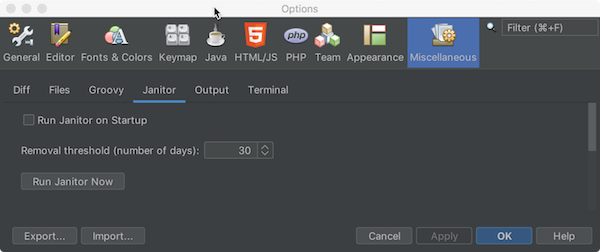

////
     Licensed to the Apache Software Foundation (ASF) under one
     or more contributor license agreements.  See the NOTICE file
     distributed with this work for additional information
     regarding copyright ownership.  The ASF licenses this file
     to you under the Apache License, Version 2.0 (the
     "License"); you may not use this file except in compliance
     with the License.  You may obtain a copy of the License at

       http://www.apache.org/licenses/LICENSE-2.0

     Unless required by applicable law or agreed to in writing,
     software distributed under the License is distributed on an
     "AS IS" BASIS, WITHOUT WARRANTIES OR CONDITIONS OF ANY
     KIND, either express or implied.  See the License for the
     specific language governing permissions and limitations
     under the License.
////
= Apache NetBeans 11.3 Features
:jbake-type: page_noaside
:jbake-tags: 11.3 features
:jbake-status: published
:keywords: Apache NetBeans 11.3 IDE features
:icons: font
:description: Apache NetBeans 11.3 features
:toc: left
:toc-title: 
:toclevels: 4
:syntax: true
:source-highlighter: pygments
:experimental:
:linkattrs:

Apache NetBeans 11.3 is the third Apache NetBeans release outside the Apache Incubator and the link:https://cwiki.apache.org/confluence/display/NETBEANS/Release+Schedule[third release of the new quarterly release cycle].

TIP: The LTS release of the Apache NetBeans 11 cycle is Apache NetBeans 11.0. The 11.1, 11.2, and 11.3 releases have not been tested as heavily as the LTS release and may therefore be less stable. Use 11.3 to use the latest features and to provide feedback for the next LTS release, scheduled for 2020. Go here to download  xref:../nb110/nb110.adoc[Apache NetBeans 11.0], the current LTS release.

xref:nb113.adoc[Download, role="button success"]

Below are the highlights of Apache NetBeans 11.3, for a full list, see the link:https://cwiki.apache.org/confluence/display/NETBEANS/Apache+NetBeans+11.3[Apache NetBeans 11.3 Wiki].

== Release Drivers

=== Java

The highlights of enhancements in the Java area are focused on support for JDK 14.

- link:https://openjdk.org/jeps/359[JEP 359]: Records (Preview Feature) -- syntax coloring for the new "record" keyword; Navigator shows equals, hashCode, toString, etc; and formatting support for records.

[.feature]
--
image::record-keyword.png[role="left", link="record-keyword.png"]
-- 

- link:https://openjdk.org/jeps/305[JEP 305]: Pattern Matching for instanceof (Preview Feature) 

[.feature]
--
image::ezgif.com-video-to-gif.gif[role="left", link="ezgif.com-video-to-gif.gif"]
--  

TIP: link:https://openjdk.org/jeps/12[JEP 12] provides for a preview language or VM feature, which "is a new feature of the Java SE Platform that is fully specified, fully implemented, and yet impermanent. It is available in a JDK feature release to provoke developer feedback based on real world use; this may lead to it becoming permanent in a future Java SE Platform".

Preview features can only be used if the Java compiler's `--enable-preview` flag is set, as shown below for Maven. 

[source,xml]
----
<build>
   <plugins>
      <plugin>
          <artifactId>maven-compiler-plugin</artifactId>
          <version>3.8.0</version>
          <configuration>
              <compilerArgs>
                    <arg>--enable-preview</arg>
              </compilerArgs>
         </configuration>
     </plugin>
  </plugins>
</build>
----

An example to add `--enable-preview` in Gradle:

[source,groovy]
----
tasks.withType(JavaCompile).each {
    it.options.compilerArgs.add('--enable-preview')
}

run.jvmArgs(['--enable-preview'])
----

TIP: To use JDK 14 features, such as the new "record" keyword, in the Java Editor, you'll need to run Apache NetBeans 11.3 itself on JDK 14, so that Apache NetBeans will use the Java compiler from JDK 14 for code recognition, syntax coloring, etc. Also, make sure to uninstall nb-javac, if it is installed, and not to install and use it, when prompted, so that the Java compiler from JDK 14 will be used, rather than nb-javac, which does not support JDK 14.

Other enhancements in the Java area.

- link:https://openjdk.org/jeps/330[JEP 330]: Launch Single-File Source-Code Programs -- single Java source files can be created, outside of projects, in the Favorites window, and they can be run and debugged, if NetBeans is running on JDK 11 or later.
 
- link:https://openjdk.org/jeps/355[JEP 355]: Text Blocks (Preview) -- in addition to the Text Block features introduced to the Java Editor in previous 11.x releases, a new Java editor hint has been introduced in 11.3 for reverting from Text Block to String. 

=== Java EE

In addition to the initial integration of Java EE features into Apache NetBeans in 11.1, JSF 2.3 is now supported for the first time. For example, code completion for "f:websocket" is now supported, as shown below.

[.feature]
--
image::jsf-23-websocket.png[role="left", link="jsf-23-websocket.png"]
-- 

Also, you can take advantage of the ability to inject JSF artifacts with support for JSF 2.3, i.e., support for CDI changes for JSF artifact injection.

[.feature]
--
image::cdi-inject.png[role="left", link="cdi-inject.png"]
-- 

TIP: Currently, Apache NetBeans supports Java EE, though not yet Jakarta EE. The Jakarta EE APIs are identical to Java EE 8, though there are new JARs that are now packaged under the Eclipse Foundation and all APIs have been slightly renamed. Apache NetBeans 12.0 is targeted for the integration of Jakarta EE 8 support.   

=== Appearance

A strong focus of the 11.3 release is around appearance, since the NetBeans dark look and feels support (Dark Metal and Dark Nimbus) has been donated by Oracle to Apache, while FlatLaf, a completely new look and feel link:https://www.formdev.com/flatlaf/[by  Karl Tauber from FormDev Software GmbH], has been integrated. Also, enhancements for HiDPI on Windows have been introduced.

==== FlatLaf Look and Feel Support

image::FlatLaf-11.3.png[role="left", link="FlatLaf-11.3.png"]

==== Dark Metal and Dark Nimbus Look and Feel Support

image::dark-metal-nimbus-11.3.png[role="left", link="dark-metal-nimbus-11.3.png"]

==== HiDPI

- Windows LAF: Fix tiny or huge GUI font size on various HiDPI configurations.
- Windows LAF: Fix incorrectly sized component icons (radio buttons, checkboxes, project tree expansion handles etc.) on various HiDPI configurations.
- Windows LAF: Fix uneven borders on text components on non-integral HiDPI scaling factors, e.g. 150%.
- Windows: Fix broken tab dragging (window rearrangements) on HiDPI displays.
- Make toolbar browser icon take advantage of improved HiDPI scaling.
- Implement simplified HeapView widget.

== Enhancements and Fixes

=== Java Build Systems

==== Gradle

- Upgraded Gradle Tooling API  to 6.0.

- Added Support for Custom Gradle Home.

- Added Support for Gradle Composite Projects.

- Recognize Kotlin based Gradle Projects.

- Gradle Project can be Reloaded Forcibly.

==== Maven

- In the Options window, under Java/Maven, the default JDK can be set, for the first time, for all Maven projects.

=== PHP, JavaScript, and HTML

- TypeScript Editor

image::typescript-11.3.png[role="left", link="typescript-11.3.png"]

- Chrome connector connection with NetBeans has been fixed.

- Prioritize "--standard" parameter of the path of Code Sniffer.

- Autocomplete for PHP property and method without $this→

=== Miscellaneous

- Cleaning up many compiler warnings, for example, relating to linter warning types of deprecation, rawtypes, and unchecked.
- Library updates, for example, to Groovy 2.5.9, junit 5.5.2, and GraalVM 19.3.0.
- Janitor helps to identify and remove old and unused NetBeans user directories.

=== Notes

- The donation of the NetBeans C and C&#x2b;&#x2b; features from Oracle to Apache has been completed in the 11.3 timeframe, though the code has not yet been integrated. This is anticipated to be a large task and may take some time, involving not only license changes and IP clearance in Apache, though also potentially code changes since not everything that was part of these features in Oracle was able to be donated by Oracle to Apache. Until the code integration is complete, go to the Plugin Manager, enable the NetBeans IDE 8.2 Update Center, which lets you install the NetBeans IDE 8.2 modules providing C and C&#x2b;&#x2b; features.
- WildFly integration is supported by means of the link:http://plugins.netbeans.org/plugin/76472/wildfly-application-server[WildFly Application Server] plugin located in the Plugin Portal.

