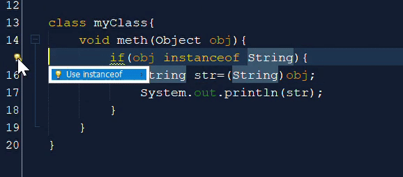

////
     Licensed to the Apache Software Foundation (ASF) under one
     or more contributor license agreements.  See the NOTICE file
     distributed with this work for additional information
     regarding copyright ownership.  The ASF licenses this file
     to you under the Apache License, Version 2.0 (the
     "License"); you may not use this file except in compliance
     with the License.  You may obtain a copy of the License at

       http://www.apache.org/licenses/LICENSE-2.0

     Unless required by applicable law or agreed to in writing,
     software distributed under the License is distributed on an
     "AS IS" BASIS, WITHOUT WARRANTIES OR CONDITIONS OF ANY
     KIND, either express or implied.  See the License for the
     specific language governing permissions and limitations
     under the License.
////
= Apache NetBeans 12.0 Features
:jbake-type: page_noaside
:jbake-tags: 12.0 features
:jbake-status: published
:keywords: Apache NetBeans 12.0 IDE features
:icons: font
:description: Apache NetBeans 12.0 features
:toc: left
:toc-title: 
:toclevels: 4
:syntax: true
:source-highlighter: pygments
:experimental:
:linkattrs:

Welcome to Apache NetBeans 12.0!

xref:nb120.adoc[Download, role="button success"]

Below are the highlights of Apache NetBeans 12.0, for a full list, see the link:https://cwiki.apache.org/confluence/display/NETBEANS/Apache+NetBeans+12.0[Apache NetBeans 12.0 Wiki].

== Overview

Apache NetBeans 12.0 adds support for the latest Java language features, integrates new code donations from Oracle for Java Web development, enhances its best of breed Apache Maven tooling, brings multiple enhancements for users of Gradle, includes built-in features for Payara and WildFly for the first time, introduces new out of the box templates for JavaFX, upgrades and extends its PHP editor, provides new dark look and feel options, and includes a wide range of fixes. 

All features provided by Apache NetBeans are supported out of the box, without additional plugins needing to be installed, and all for free. Apache NetBeans 12.0 is the first LTS release of NetBeans as a top level Apache project. 

We would like to thank all contributors, the community, and the Apache Software Foundation for the great co-operation and enthusiasm enabling this complex and exciting project to continue to inspire and be of use to developers all over the world.

== Java

The highlights of the enhancements in the Java area are focused on support for the latest Java language features.

=== Java Language Features

To use the latest Java language features (listed below) in the Java Editor, run Apache NetBeans on the JDK that provides those features, enabling Apache NetBeans to use the Java compiler from the JDK it runs on for its Java Editor support for those features. 

TIP: In these scenarios, make sure to uninstall the NetBeans "nb-javac" fork, if it is installed, and to not install it when prompted to do so. The "nb-javac" fork does not support the latest Java language features and is mandatory only when you run Apache NetBeans on JDK 8. Over time, Apache NetBeans aims to move away completely from the "nb-javac" fork, except for  when JDK 8 is used to run Apache NetBeans, since JDK 8 does not provide the capabilities enabling Apache NetBeans to use its Java compiler in support of its Java Editor features.

==== Java 14

- link:https://openjdk.org/jeps/359[JEP 359]: Records (Preview Feature) -- syntax coloring for the new "record" keyword; Navigator shows equals, hashCode, toString, etc; and formatting support for records.

[.feature]
--
image::record-keyword.png[role="left", link="record-keyword.png"]
-- 

- link:https://openjdk.org/jeps/305[JEP 305]: Pattern Matching for instanceof (Preview Feature) 

[.feature]
--

--  

==== Java 13

- link:https://openjdk.org/jeps/355[JEP 355]: Text Blocks (Preview) -- Java editor hint has been introduced for converting to/from text blocks.

[.feature]
--
image::jdk13-textblock.png[role="left", link="jdk13-textblock.png"]
-- 

[.feature]
--
image::TextBlockToString.gif[role="left", link="TextBlockToString.gif"]
-- 

==== Java 12

- link:https://openjdk.org/jeps/325[JEP 325]: Switch Expressions (Preview) – code completion for JEP-325 preview feature for multiple case labels, as shown below.

[.feature]
--
image::code-completion-multiple-case-2.png[role="left", link="code-completion-multiple-case-2.png"]
-- 

TIP: link:https://openjdk.org/jeps/12[JEP 12], introduced in JDK 12, provides for a preview language or VM feature, which "is a new feature of the Java SE Platform that is fully specified, fully implemented, and yet impermanent. It is available in a JDK feature release to provoke developer feedback based on real world use; this may lead to it becoming permanent in a future Java SE Platform".

Preview features can only be used if the Java compiler's `--enable-preview` flag is set, as shown below for Maven. 

[source,xml]
----
<build>
   <plugins>
      <plugin>
          <artifactId>maven-compiler-plugin</artifactId>
          <version>3.8.0</version>
          <configuration>
              <compilerArgs>
                    <arg>--enable-preview</arg>
              </compilerArgs>
         </configuration>
     </plugin>
  </plugins>
</build>
----

An example to add `--enable-preview` in Gradle:

[source,groovy]
----
tasks.withType(JavaCompile).each {
    it.options.compilerArgs.add('--enable-preview')
}

run.jvmArgs(['--enable-preview'])
----

==== Java 11
 
- link:https://openjdk.org/jeps/330[JEP 330]: Launch Single-File Source-Code Programs -- single Java source files can be created, outside of projects, in the Favorites window, and they can be run and debugged, if NetBeans is running on JDK 11 or later.

=== JavaFX

Two OpenJFX Gluon Maven artifacts are now registered in the New Project dialog, named "link:https://mvnrepository.com/artifact/org.openjfx/javafx-archetype-fxml[FXML JavaFX Maven Archetype (Gluon)]" and "link:https://mvnrepository.com/artifact/org.openjfx/javafx-archetype-simple[Simple JavaFX Maven Archetype (Gluon)]", with their nbactions.xml files customized so that running and debugging can be done out of the box without any tweaking needed by the user.

[.feature]
--
image::openjfx-gluon-artifacts-600.png[role="left", link="openjfx-gluon-artifacts-600.png"]
-- 

=== Java EE

TIP: Currently, Apache NetBeans supports Java EE, though not yet Jakarta EE. The Jakarta EE APIs are identical to Java EE 8, though there are new JARs that are now packaged under the Eclipse Foundation and all APIs have been slightly renamed. 

==== Support for Java EE Specifications

Java EE 8 support, for the first time in 11.1, for Maven-based and Gradle-based Web applications. The Java EE 8 support provides the ability to create Java EE 8 applications and deploy to a Java EE 8 container, with new "webapp-javaee8" Maven archetype created for use with Apache NetBeans.

[.feature]
--
image::new-java-ee-8.png[role="left", link="new-java-ee-8.png"]
-- 

Support for link:https://github.com/apache/netbeans/pull/1633[JSF 2.3: CDI Changes for JSF Artifact Injection] (introduced in 11.3), e.g., "f:websocket" is now supported.

[.feature]
--
image::javaee-websocket-600.png[role="left", link="javaee-websocket-600.png"]
--  

==== Support for Java EE Servers

 * GlassFish support to 5.0.1.
 * Payara integration out of the box for the first time, from 11.1, including Payara Platform 5.194/5.201 support and Payara Server Hot Deploy support.
 * Tomcat
 * WildFly integration out of the box for the first time, from 12.0.

=== Java Build Systems

==== Maven

The key new feature for Maven users in Apache NetBeans 12.0 is its support for Java language preview features, introduced in 11.1. Java compiler arguments, e.g., "--enable-preview", link:https://github.com/apache/netbeans/pull/1173[are passed to Java editor from Maven].

[source,xml]
----
<build>
   <plugins>
      <plugin>
          <artifactId>maven-compiler-plugin</artifactId>
          <version>3.8.0</version>
          <configuration>
              <compilerArgs>
                    <arg>--enable-preview</arg>
              </compilerArgs>
         </configuration>
     </plugin>
  </plugins>
</build>
----

An important fix has been done to enable link:https://github.com/apache/netbeans/pull/1286[JaCoCo Maven integration], in 11.1.

[source,xml]
----
<plugin>
    <groupId>org.jacoco</groupId>
    <artifactId>jacoco-maven-plugin</artifactId>
    <version>0.8.3</version>
    <executions>
        <execution>
            <goals>
                <goal>prepare-agent</goal>
            </goals>
        </execution>
        <execution>
            <id>report</id>
            <phase>prepare-package</phase>
            <goals>
                <goal>report</goal>
            </goals>
            <configuration>
               <outputDirectory>${project.reporting.outputDirectory}/jacoco_test</outputDirectory>
            </configuration>
        </execution>
    </executions>
</plugin>
----

==== Gradle

The key new feature for Gradle users in Apache NetBeans 12.0 is its support for Java EE.
 
[.feature]
--
image::gradle-12.0.png[role="left", link="gradle-12.0.png"]
-- 

TIP: Currently, Apache NetBeans supports Java EE, though not yet Jakarta EE. The Jakarta EE APIs are identical to Java EE 8, though there are new JARs that are now packaged under the Eclipse Foundation and all APIs have been slightly renamed. 

However, there are multiple other new features, enhancements, and fixes for Gradle users, which together provide comprehensive Gradle tooling for the first time and fills in multiple gaps. These include upgraded Gradle Tooling API to 6.3, new Java Frontend Application wizard for Gradle, debugger support for Gradle Web projects, support for custom Gradle Home, support for composite projects, Kotlin-based Gradle projects, and forceable reloading of Gradle projects.

link:https://issues.apache.org/jira/browse/NETBEANS-4239?jql=project%3DNetBeans%20AND%20component%20in%20(%22projects%20-%20Gradle%22%2C%20%22projects%20-%20Gradle%20Java%20EE%22)%20%20and%20resolution%20in%20(Fixed%2CDone%2CImplemented)%20and%20fixVersion%20in%20(11.1%2C11.2%2C11.3%2C12.0)[Complete list of fixes for Gradle in 12.0.]

== PHP, JavaScript, and HTML

The key new feature for PHP users in Apache NetBeans 12.0 is its support for PHP 7.4.

[.feature]
--
image::php-7.4.png[role="left", link="php-7.4.png"]
-- 

Further details on new support for PHP 7.4 features are provided link:https://cwiki.apache.org/confluence/display/NETBEANS/11.2+Feature%3A+PHP[here] and see all fixes in the PHP area in 12.0 link:https://issues.apache.org/jira/browse/NETBEANS-3968?jql=project%20%3D%20NETBEANS%20AND%20resolution%20in%20(Fixed%2C%20Done%2C%20Implemented)%20AND%20fixVersion%20in%20(11.1%2C%2011.2%2C%2011.3%2C%2012.0)%20AND%20component%20in%20(%22php%20-%20Apache%20Config%20Files%22%2C%20%22php%20-%20Code%22%2C%20%22php%20-%20Code%20Analysis%22%2C%20%22php%20-%20Codeception%22%2C%20%22php%20-%20Composer%22%2C%20%22php%20-%20Debugger%22%2C%20%22php%20-%20Editor%22%2C%20%22php%20-%20Formatting%20%26%20Indentation%22%2C%20%22php%20-%20FTP%20Support%22%2C%20%22php%20-%20Navigation%22%2C%20%22php%20-%20Nette%22%2C%20%22php%20-%20PHPDoc%22%2C%20%22php%20-%20PHPUnit%22%2C%20%22php%20-%20Project%22%2C%20%22php%20-%20Refactoring%22%2C%20%22php%20-%20Smarty%22%2C%20%22php%20-%20Symfony%22%2C%20%22php%20-%20Twig%22%2C%20%22php%20-%20Zend%22)[here].

In addition, Apache NetBeans 12.0 integrates out of the box a TypeScript editor, introduced in 11.3.

[.feature]
--
image::typescript-11.3.png[role="left", link="typescript-11.3.png"]
-- 

For users of the Chrome/NetBeans integration, a fix has been integrated enabling the Chrome connector to work correctly with Apache NetBeans, since 11.3.

== C/C++

The donation of the NetBeans C and C&#x2b;&#x2b; features from Oracle to Apache has been completed in the 11.3 timeframe, though the code has not yet been integrated into Apache NetBeans. This is anticipated to be a large task and may take some time, involving not only license changes and IP clearance in Apache, though also potentially code changes since not everything that was part of these features in Oracle was able to be donated by Oracle to Apache. 

Until the code integration is complete, go to the Plugin Manager, enable the NetBeans IDE 8.2 Update Center, which lets you install the NetBeans IDE 8.2 modules providing C and C&#x2b;&#x2b; features.

== General

== Appearance

A key focus of the 12.0 release is around appearance, since the NetBeans dark look and feels support (Dark Metal and Dark Nimbus) has been donated by Oracle to Apache, while FlatLaf, a completely new look and feel link:https://www.formdev.com/flatlaf/[by  Karl Tauber from FormDev Software GmbH], has been integrated. Also, enhancements for HiDPI on Windows have been introduced.

=== FlatLaf Look and Feel Support

image::FlatLaf-11.3-small.png[role="left", link="FlatLaf-11.3.png", border="1px solid black"]

=== Dark Metal and Dark Nimbus Look and Feel Support

[.feature]
--

image::dark-metal-nimbus-11.3-small.png[role="left", link="dark-metal-nimbus-11.3.png"]

--

=== Miscellaneous

- Windows LAF: Fixed tiny or huge GUI font size on various HiDPI configurations, fixed incorrectly sized component icons (radio buttons, checkboxes, project tree expansion handles etc.) on various HiDPI configurations, fixed uneven borders on text components on non-integral HiDPI scaling factors, e.g., 150%, fixed broken tab dragging (window rearrangements) on HiDPI displays.
- Toolbar browser icon take advantage of improved HiDPI scaling.
- Implemented simplified HeapView widget.
- Fixed link:https://github.com/apache/netbeans/pull/2076[incorrectly positioned line-width marker] (i.e., shown at 82 characters instead of 80 characters), and inaccurate tab alignments. This bug existed at certain editor zoom levels on Windows, Linux, and MacOS, including on non-HiDPI screens.
- Fixed link:https://github.com/apache/netbeans/pull/2025[clipped file names] in Projects window and Files window on Windows on HiDPI screens.

