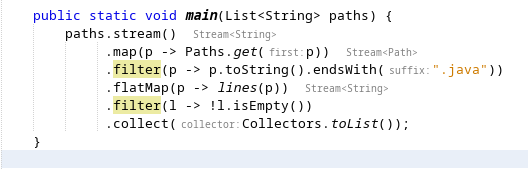

////
     Licensed to the Apache Software Foundation (ASF) under one
     or more contributor license agreements.  See the NOTICE file
     distributed with this work for additional information
     regarding copyright ownership.  The ASF licenses this file
     to you under the Apache License, Version 2.0 (the
     "License"); you may not use this file except in compliance
     with the License.  You may obtain a copy of the License at

       http://www.apache.org/licenses/LICENSE-2.0

     Unless required by applicable law or agreed to in writing,
     software distributed under the License is distributed on an
     "AS IS" BASIS, WITHOUT WARRANTIES OR CONDITIONS OF ANY
     KIND, either express or implied.  See the License for the
     specific language governing permissions and limitations
     under the License.
////
= Apache NetBeans 12.2 Features
:jbake-type: page_noaside
:jbake-tags: 12.1 features
:jbake-status: published
:keywords: Apache NetBeans 12.2 IDE features
:icons: font
:description: Apache NetBeans 12.2 features
:toc: left
:toc-title: 
:toclevels: 4
:syntax: true
:source-highlighter: pygments
:experimental:
:linkattrs:

Welcome to Apache NetBeans 12.2, the second feature release of the Apache NetBeans 12 cycle!

TIP: The LTS release of the Apache NetBeans 12 cycle is Apache NetBeans 12.0. The 12.2 release has not been tested as heavily as the LTS release and may therefore be less stable. Use 12.2 to use the latest features and to provide feedback for the next LTS release, scheduled for 2021. Go here to download  xref:../nb120/nb120.adoc[Apache NetBeans 12.0], the current LTS release.

xref:nb122.adoc[Download, role="button success"]

== Highlights

The full list of pull requests integrated in the 12.2 timeframe link:https://github.com/apache/netbeans/pulls?q=is%3Aclosed+milestone%3A12.2[is found here], while the highlights are listed below.

== Java Language

=== New JDK 14 and 15-Specific Java Language Features
 - *Code coloring.* Keywords "sealed", "non-sealed", and "permits" are highlighted conforming to the existing styles of all other Java keywords.
 - *Code formatting for "sealed" type.* Extended the Java code formatting feature to include "sealed" and "permits" clauses for the first time.
 - *Auto-completion for "sealed" type.* Added keyword "sealed" and "non-sealed" before "class" declaration. Added "permits" only in the allowed location, i.e., the "permits" clause is not allowed to be put before "extends" and "implements" clause, if present.
 - *Enhancement for Record variable.* Invoke code completion for "Record" variable name and the editor will analyze the context and then suggest choices that are reachable from the current caret position.
 - *Fixed Record Formatting issue with use of annotation.* https://github.com/apache/netbeans/pull/2391
 - *Fixed Record Refactoring issue.* refactor record rename & move record file to other package: https://github.com/apache/netbeans/pull/2310 
 - *Fixed Record JavaDoc.* JavaDoc listing for class-type RECORD on auto completion: https://github.com/apache/netbeans/pull/2412
 - *nb-javac fork.* Now supports JDK 15: https://github.com/apache/netbeans/pull/2408
 
=== New Miscellaneous Java Language Features
 - *Show types for chained method invocations.* https://github.com/apache/netbeans/pull/2365
[.feature]
--

-- 
 - *Create new Class/Interface/Enum when copy-paste raw text.* https://github.com/apache/netbeans/pull/2334
 - *Create only one instance of javac.* https://github.com/apache/netbeans/pull/2305
 
=== NetBeans Java Features in VS Code
 - *Java Editor and Java debugger in VS Code.* https://cwiki.apache.org/confluence/display/NETBEANS/Apache+NetBeans+Extension+for+Visual+Studio+Code

== JavaFX
 - *Avoid assertion & NPE in fxml code completion.* https://github.com/apache/netbeans/pull/2399
 - *Disallow FXML controller in default package.* https://github.com/apache/netbeans/pull/2331
 - *Include immutable objects for fxml editor identification.* https://github.com/apache/netbeans/pull/2333

== Java Web
 - *Remove Derby integration from Payara Server modules.* https://github.com/apache/netbeans/pull/2425
 - *Web Project Properties Dialog fails to save Relative URL.* https://github.com/apache/netbeans/pull/2423
 - *JavaServer Faces Catalog fixes.* https://github.com/apache/netbeans/pull/2431
 - *Fix Spring Web MVC 5.2.9 integration.* https://github.com/apache/netbeans/pull/2380

== Java Build Systems
 - Added Gradle wrapper distribution change detection: https://github.com/apache/netbeans/pull/2366
 - Add JAVA_HOME to Gradle build environment variables: https://github.com/apache/netbeans/pull/2320
 - Better way to detect sources and javadocs in Gradle Projects: https://github.com/apache/netbeans/pull/2499
 - Fixed Gradle Java Frontend Application generation: https://github.com/apache/netbeans/pull/2485
 - Enable run/debug single when the suitable task is provided by the Gradle project: https://github.com/apache/netbeans/pull/2458
 - Flush Gradle Standard output in 200ms if it stalled: https://github.com/apache/netbeans/pull/2270
 - Handle source type correctly in GradleSourcesImpl: https://github.com/apache/netbeans/pull/2339
 - Fix missing artifact nodes in Gradle Project Configurations: https://github.com/apache/netbeans/pull/2490
 - Fixing Lombok in Gradle Projects: https://github.com/apache/netbeans/pull/2392
 - Arrange Gradle Source info detail tabs to the right: https://github.com/apache/netbeans/pull/2361
 - Maven project open use no-lock getModuleName: https://github.com/apache/netbeans/pull/2340

== PHP & JavaScript
 - PHP 8.0 support
   * Union Types: https://github.com/apache/netbeans/pull/2319
   * Nullsafe operator: https://github.com/apache/netbeans/pull/2446
   * Match expression: https://github.com/apache/netbeans/pull/2303
   * throw Expression: https://github.com/apache/netbeans/pull/2280
   * Non-capturing catches: https://github.com/apache/netbeans/pull/2265
   * Allow ::class on objects: https://github.com/apache/netbeans/pull/2295
   * Allow trailing comma in parameter list: https://github.com/apache/netbeans/pull/2269
   * Static return type: https://github.com/apache/netbeans/pull/2335
   * Mixed type: https://github.com/apache/netbeans/pull/2342
 - Dependencies and infrastructure of JavaScript and HTML features cleaned up: https://github.com/apache/netbeans/pull/2424
 - html parser dont wait for projects open: https://github.com/apache/netbeans/pull/2341
 - Removed obsolete Oracle JET support: https://github.com/apache/netbeans/pull/2367
 - CSS3 enhancements: https://github.com/apache/netbeans/pull/2299
 - Add Plugin for BootsFaces in order to support <b:dataTable: https://github.com/apache/netbeans/pull/2357
 - Fix broken npm search: https://github.com/apache/netbeans/pull/2286

== Library Upgrades
 - Ant to 1.10.8: https://github.com/apache/netbeans/pull/2315
 - exec-maven-plugin from 1.5.0 to 3.0.0: https://github.com/apache/netbeans/pull/2288
 - Gradle Tooling API to 6.7: https://github.com/apache/netbeans/pull/2479
 - JDBC PostgreSQL from 42.2.10 to 42.2.16: https://github.com/apache/netbeans/pull/2284
 - payara-micro-maven-plugin to v1.3.0: https://github.com/apache/netbeans/pull/2454
 - Spring Framework to version 4.3.29: https://github.com/apache/netbeans/pull/2374
 - Spring Framework to version 5.2.9: https://github.com/apache/netbeans/pull/2373
 - TestNG and upgrade from 6.8.1 to 6.14.3: https://github.com/apache/netbeans/pull/2350

== Miscellaneous
 - *Fix for Mac OS X Big Sur.* Fix call to find jdkhome using /usr/libexec/java_home: https://github.com/apache/netbeans/pull/2547
 - *Detect JDKs.* Installed with SDKMan and Debian: https://github.com/apache/netbeans/pull/2329
 - *Check unpack200.* Warn the user on JDK14+: https://github.com/apache/netbeans/pull/2317
 - *Update to the Mac OS X installer.* As it was failing on Big Sur: https://github.com/apache/netbeans/pull/2353
 - *Avoiding use of Nashorn.* Nashorn was removed in JDK 15, applicable to J2SE multi-module: https://github.com/apache/netbeans/pull/2322
