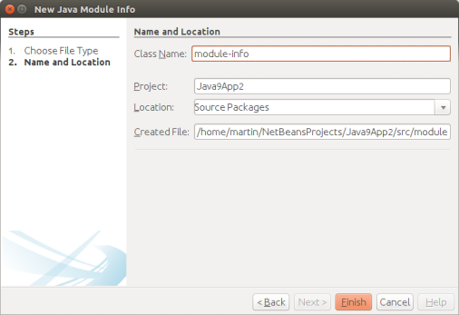
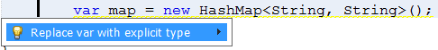
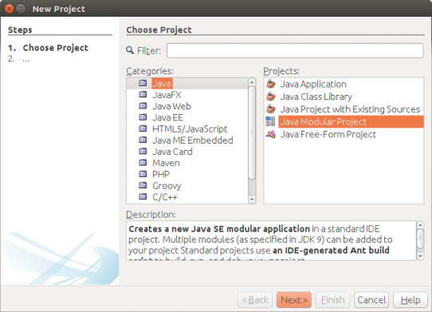

////
     Licensed to the Apache Software Foundation (ASF) under one
     or more contributor license agreements.  See the NOTICE file
     distributed with this work for additional information
     regarding copyright ownership.  The ASF licenses this file
     to you under the Apache License, Version 2.0 (the
     "License"); you may not use this file except in compliance
     with the License.  You may obtain a copy of the License at

       http://www.apache.org/licenses/LICENSE-2.0

     Unless required by applicable law or agreed to in writing,
     software distributed under the License is distributed on an
     "AS IS" BASIS, WITHOUT WARRANTIES OR CONDITIONS OF ANY
     KIND, either express or implied.  See the License for the
     specific language governing permissions and limitations
     under the License.
////
= Apache NetBeans (incubating) 9.0 Features
:jbake-type: page
:jbake-tags: 9.0 features
:jbake-status: published
:keywords: Apache NetBeans 9.0 IDE features
:icons: font
:description: Apache NetBeans 9.0 (incubating) features
:toc: left
:toc-title: 
:toclevels: 4

Apache NetBeans 9.0 is the first release of the Apache NetBeans IDE, it was released
on July 2018. xref:nb90.adoc[Click here to download] this release.

The main goals for this release are IP clearance of the Oracle code donation and Java 9 and Java 10 Support.

Features include:

////
To display a feature do as follows:

Add a header title, and an anonymous asciidoc block (--) with the ".feature" metadata, and write text inside the block:

== A title here
[.feature]
--
This is a feature
--

You can add images to the feature by adding a png file along with the document, and adding a image: construct to the text.

Use role="left" for left alignment or role="right" for right alignment.

Examples:

== An amazing feature
[.feature]
--
Here goes some text

And some more text

image:nb90-module-info-completion.png[Autocompletion in module-info.java, title="Autocompletion in module-info.java", role="right", link="nb90-module-info-completion.png"]

And even some more
--

Note: When rendered into HTML, the images will automatically be wrapped around 'colorbox', so that they're enlarged when clicked.

////

== Supporting Local Variable Type Inference

New hints, error handlers, and refactorings for transforming to/from the new JDK 10 "var" type:

- New Hint to convert explicit variable type to 'var'.

image:image2018-5-30_12-38-55.png[New Hint to convert explicit variable type to 'var', title="New Hint to convert explicit variable type to 'var'", role="left", link="image2018-5-30_12-38-55.png"]

- New Hint to Convert var type back to explicit type.

- New Error hint to split compound 'var' declaration.

Var is not supported in a compound variable declaration. This fix helps correct compilation error by splitting declaration into separate statements. 

image:image2018-5-30_13-34-39.png[New Error hint to split compound 'var' declaration, title="New Error hint to split compound 'var' declaration", role="left", link="image2018-5-30_13-34-39.png"]

- New Error Hint for var Array declaration.

Var type is not supported for array initializer. This hint helps correct compilation errors by converting to explicit type by inferring the type of data in an array. This currently handles arrays of primitive or homogeneous types.

image:invalidArray.png[New Error Hint for var Array declaration, title="New Error Hint for var Array declaration", role="left", link="invalidArray.png"]

== Supporting the Jigsaw Module System
[.feature]
--

NetBeans 9 supports link:https://openjdk.org/projects/jigsaw/spec/[JPMS (Jigsaw)]. 

Modulepath was added as a paradigm to NetBeans in addition to Classpath.

The standard NetBeans Java SE Project Type (Ant based) can be a single JDK 9 module simply by adding a `module-info.java` file into the default package.
--

[.feature]
--
image:nb90-module-info-completion.png[Autocompletion in module-info.java, title="Autocompletion in module-info.java", role="right", link="nb90-module-info-completion.png"]

Of course, we provide full autocompletion for `module-info.java`
--

== A brand new Java Modular Application project type
[.feature]
--

We have added a new *Java Modular project* type. This allows to develop
several JDK9 modules in one NetBeans project (Ant based). 

The advantage of this project type over several Java SE projects (each
containing one module) is that dependencies are simply managed by declaring
appropriate `exports` and `requires` in `module-info.java`, and all modules
in the project will be compiled at once.
--

== Java Shell support
[.feature]
--
image:nb90-javashell.png[Java Shell Support, title="Java Shell Support", role="left", link="nb90-javashell.png"]

Java Shell is a new tool included in JDK9 defined in link:https://openjdk.org/jeps/222[JEP 222] to introduce REPL
(read-eval-print-loop) capabilities to Java. 

NetBeans provides integrated console-like UI for the Java Shell, leveraing NetBeans editor capabilites.

NetBeans can support the tool with the user project configuration, so the Java
Shell is set up to work with project classes and libraries, providing autocompletion out of the box in
the editor.
--

[.feature]
--
image:nb90-shell-agent.png[Shell Agent Configuration, title="JShell acess configuration", role="right", link="nb90-shell-agent.png"]

Also NetBeans greatly extends the capabilities of the commandline tool.
NetBeans can execute the shell *as an agent*, similar to a debugging agent, on the
debugged or run application (currently only J2SE applications are supported,
both Ant and Maven-based).
--

[.feature]
--
image:nb90-shell-save.png[Saving JShell snippets, title="Saving JShell snippets", role="left", link="nb90-shell-save.png"]

Snippets written in JShell can be redefined and tested, even against a running
code. 

When the prototype is ready, it can be saved to a regular Java source file
and integrated with the project.
--

