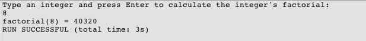
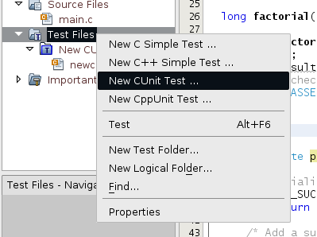
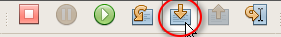
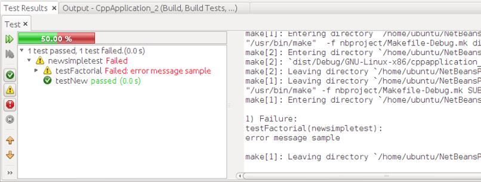

// 
//     Licensed to the Apache Software Foundation (ASF) under one
//     or more contributor license agreements.  See the NOTICE file
//     distributed with this work for additional information
//     regarding copyright ownership.  The ASF licenses this file
//     to you under the Apache License, Version 2.0 (the
//     "License"); you may not use this file except in compliance
//     with the License.  You may obtain a copy of the License at
// 
//       http://www.apache.org/licenses/LICENSE-2.0
// 
//     Unless required by applicable law or agreed to in writing,
//     software distributed under the License is distributed on an
//     "AS IS" BASIS, WITHOUT WARRANTIES OR CONDITIONS OF ANY
//     KIND, either express or implied.  See the License for the
//     specific language governing permissions and limitations
//     under the License.
//

= Adding Unit Tests to a C Project - NetBeans IDE Tutorial
:jbake-type: tutorial
:jbake-tags: tutorials 
:jbake-status: published
:icons: font
:syntax: true
:source-highlighter: pygments
:toc: left
:toc-title:
:description: Adding Unit Tests to a C Project - NetBeans IDE Tutorial - Apache NetBeans
:keywords: Apache NetBeans, Tutorials, Adding Unit Tests to a C Project - NetBeans IDE Tutorial
include::../../../inc/database.adoc[]

//_Contributed by link:mailto:susanm@netbeans.org[+_Susan Morgan_+] 
//March 2014_ [Revision number: V8.0-1]

== Requirements

*To follow this tutorial, you need the following software.*

|===
|Software |Version Required 

|NetBeans IDE (including C/C++/Fortran support) |xref:../../../download/index.adoc[version 7.4 or 8.0 with NetBeans C/C{pp} plugin] 

|Java Development Kit (JDK) |link:{jdkdownload}[Version 7 or 8] 

|CUnit 2.1 test framework |link:http://sourceforge.net/projects/cunit/[C Unit Testing Framework project on sourceforge.] 
|===

See the xref:../../../community/releases/80/install.adoc[NetBeans IDE Installation Instructions] and xref:../../../community/releases/80/cpp-setup-instructions.adoc[Configuring the NetBeans IDE for C/C{pp}/Fortran]
for information about downloading and installing the required NetBeans software.

== Introduction

NetBeans IDE with the C/C{pp}/Fortran plugin supports unit tests in C/C++ projects. You can use the IDE to create, run, debug, and view results of your C and C++ tests. This article shows you how to use unit tests in the IDE with your C/C++ projects.

A managed project is created with a logical folder called Test Files, where you can manage unit tests for the project. You can create tests directly under this Test Files folder or organize them in logical sub folders. A test node in the Test Files folder is a special folder with test-related actions. When a test is built, it will exclude the main file from the project and otherwise use all other project settings.

The IDE supports only CUnit, CppUnit and its own "simple" output format, which means your tests should produce output of one of these types of tests. The IDE provides templates for unit tests:

* C simple test
* C++ simple test
* CUnit test
* CppUnit test
* CppUnit test runner

This tutorial uses the CUnit test framework and NetBeans C Simple Tests on Ubuntu Linux, but the techniques demonstrated can help you with the other types of tests on other platforms as well. The tutorial does not explain the CUnit or CppUnit testing frameworks. You need to consult the documentation for those frameworks for information about how to use them.

== Install the CUnit Testing Framework

To follow this tutorial, you must install CUnit on your system first. See more information about the CUnit framework at the link:http://sourceforge.net/projects/cunit/[C Unit Testing Framework project on sourceforge.]

The CUnit documentation is included in the CUnit download, or you can view it at link:http://cunit.sourceforge.net/doc/index.html[http://cunit.sourceforge.net/doc/index.html].

See the appropriate section for installation instructions for your platform:

* <<linux,How to Install CUnit on Linux or Mac OS>>
* <<solaris,How to Install CUnit on Oracle Solaris 11>>
* <<mingw,How to Install CUnit on Windows and MinGW>>
* <<cygwin,How to Install CUnit on Windows and Cygwin>>

[[linux]]
=== How to Install CUnit on Linux or Mac OS

On Linux systems, you should be able to install libcunitl, libcunitl-doc and libcunitl-dev packages from your package repository.

On Mac OS, or on Linux if the libcunitl* packages are not available, you can download the CUnit source and build it as described here.

The instructions below assume you downloaded the file CUnit-2.1-2-src.tar.bz2 into the directory /tmp. If your download file has a different name be sure to specify your actual CUnit download file and the actual directory where you saved it.

1. Download the CUnit-2.1-2-src.tar.bz2 source from the link:http://sourceforge.net/projects/cunit/files[CUnit files page] and save to temporary directory such as /tmp for example.
2. In a terminal window, unpack the  ``CUnit-2.1-2-src.tar.bz2``  file as follows:

[source,shell]
----

$ cd /tmp
$ bunzip2 CUnit-2.1-2-src.tar.bz2
$ tar -xvf CUnit-2.1-2-src.tar
----

[start=3]
. Configure, build, and install CUinit from /tmp as follows:

[source,shell]
----

$ cd CUnit-2.1-2
$ ./configure --prefix=/usr
$ make
$ sudo make install
----

When the 'make install' finishes, the CUnit test framework is ready to use in the IDE and you can continue on to <<project,Create the Project for the Tutorial>>.

[[solaris]]
=== How to Install CUnit on Oracle Solaris

You must build CUnit with the link:{wikipedia}GNU_build_system[GNU build system] before you can use CUnit tests. On Oracle Solaris 11 systems the GNU build system is not usually installed by default. You can get the GNU build system components from the Oracle Solaris 11 package repository with the following commands:

[source,java]
----

pkg install pkg://solaris/developer/build/gnu-make
pkg install pkg://solaris/developer/build/make
pkg install pkg://solaris/developer/gcc-45
pkg install pkg://solaris/system/header
pkg install pkg://solaris/developer/build/autoconf
pkg install pkg://solaris/developer/build/automake-110
----

The instructions below assume you downloaded the file CUnit-2.1-2-src.tar.bz2 into the directory /tmp. If your download file has a different name be sure to specify your actual CUnit download file and the actual directory where you saved it.

1. Download the CUnit-2.1-2-src.tar.bz2 source from the link:http://sourceforge.net/projects/cunit/files[CUnit files page] and save to temporary directory such as /tmp for example.
2. In a terminal window, unpack the  ``CUnit-2.1-2-src.tar.bz2``  file as follows:

[source,shell]
----

$ cd /tmp
$ bunzip2 CUnit-2.1-2-src.tar.bz2
$ tar -xvf CUnit-2.1-2-src.tar
----

[start=3]
. Configure, build, and install CUinit from /tmp as follows:

[source,shell]
----

$ cd CUnit-2.1-2
$ ./configure --prefix=/usr
$ make
$ make install
----

When the 'make install' finishes, the CUnit test framework is ready to use in the IDE and you can continue on to <<project,Create the Project for the Tutorial>>.

[[mingw]]
=== How to Install CUnit on Windows and MinGW

These instructions assume you downloaded the file CUnit-2.1-2-src.tar.bz2 into the directory C:/distr. If your download file has a different name be sure to specify your actual CUnit download file and the actual directory where you saved it.

1. Download the CUnit-2.1-2-src.tar.bz2 source from the link:http://sourceforge.net/projects/cunit/files[CUnit files page] and save to temporary directory such as the C:/distr example.
2. Start the MinGW shell application in Windows by choosing Start > All Programs > MinGW > MinGW Shell.
3. In the MinGW Shell window, unpack the  ``CUnit-2.1-2-src.tar.bz2``  file as follows:

[source,shell]
----

$ cd c:/distr
$ bunzip2.exe CUnit-2.1-2-src.tar.bz2
$ tar xvf CUnit-2.1-2-src.tar
$ cd /CUnit-2.1-2
----

[start=4]
. Find the Unix path to MinGW using the mount command.

[source,shell]
----

$ mount
----
You see output similar to the following:

[source,java]
----

C:\Users\username\AppData\Local\Temp on /tmp type user (binmode,noumount)
C:\MinGW\msys\1.0 on /usr type user (binmode,noumount)
C:\MinGW\msys\1.0 on / type user (binmode,noumount)
*C:\MinGW on /mingw type user (binmode)*
----
The last line in bold above shows the Unix path is /mingw. Your system may report something different, so make a note of it because you need to specify the path in the next command.

[start=5]
. Configure the Makefile with the following command. 
If your MinGW is not in /mingw, be sure to specify the appropriate Unix location of your MinGW with the --prefix= option.

[source,shell]
----
$ libtoolize
$ automake --add-missing 
$ autoreconf
$ ./configure --prefix=/mingw
_(lots of output about checking and configuring)
..._
config.status: executing depfiles commands
config.status: executing libtool commands

----

[start=6]
. Build the library for CUnit:

[source,shell]
----

$ make
make all-recursive
make[1]: Entering directory 'c/distr/CUnit-2.1-2'
Making all in CUnit
...
_(lots of other output)_
make[1]: Leaving directory 'c/distr/CUnit-2.1-2'
$
----

[start=7]
. Install the CUnit library into C:/MinGW/include/CUnit, C:/MinGW/share/CUnit and C:/MinGW/doc/CUnit by running make install:

[source,shell]
----

$ make install
Making install in CUnit
make[1]: Entering directory 'c/distr/CUnit-2.1-2/CUnit'
Making install in Sources
make[1]: Entering directory 'c/distr/CUnit-2.1-2/Cunit/Sources'
...
 _(lots of other output)_
make[1]: Leaving directory 'c/distr/CUnit-2.1-2'
$
----

[start=8]
. If you use Java 7 update 21, 25, or 40 you must perform the following workaround due to link:https://bz.apache.org/netbeans/show_bug.cgi?id=236867[issue 236867] in order to get CUnit and this tutorial to work.

1. Go to Tools > Options > C/C++ > Build Tools and select the MinGW tool collection.
2. Change the Make Command entry to make.exe without a complete path.
3. Exit the IDE.
4. On Windows 7 and above, type *var* in the Start menu's search box to quickly find a link to Edit the system environment variables.
5. Select the Advanced tab and click Environment Variables.
6. In the System Variables panel of the Environment Variables dialog, select click New.
7. Set the Variable Name to MAKE and the Variable Value to make.exe.
8. Click OK in each dialog to save the change.
9. Start the IDE and continue to the next section.

When the 'make install' finishes, your CUnit is ready to use in the IDE and you can continue on to <<project,Create the Project for the Tutorial>>.

[[cygwin]]
=== How to Install CUnit on Windows and Cygwin

In Cygwin you can install CUnit using the standard Cygwin installer, setup-x86.exe or setup-x86_64.exe, available from link:http://cygwin.com/install.html[http://cygwin.com/install.html]. The CUnit package is located in the "Libs" category and you can install it in the same way you install other packages.

Be sure to use the correct version. You must use 64-bit Cygwin and CUnit if you are running 64-bit NetBeans IDE.

If you have not yet installed Cygwin, see the general Cygwin installation info in xref:../../../community/releases/80/cpp-setup-instructions.adoc#cygwin[Configuring NetBeans IDE for C/C{pp}/Fortran]. You can install CUnit by selecting it in the Libs category in the setup program.

[[project]]
== Create the Project for the Tutorial

To explore the unit test features, you should first create a new C Application:

1. Choose File > New Project.
2. In the project wizard, click C/C++ and then select C/C++ Application.
3. In the New C/C++ Application dialog box, select Create Main file and select the C language. Accept the defaults for all other options.

image::images/c-unit-new-project.png[]

[start=4]
. Click Finish, and the Cpp_Application__x_ project is created.

[start=5]
. In the Projects window, open the Source Files folder and double-click the `main.c` file to open it in the editor. The file's content is similar to that shown here:

image::images/c-unit-mainc-initial.png[]

[start=6]
. To give the program something to do, replace the code in the `main.c` file with the following code to create a simple factorial calculator:

[source,c]
----

#include <stdio.h>
#include <stdlib.h>

long factorial(int arg) {
    long result = 1;
    int i;
    for (i = 2; i <= arg; ++i) {
        result *= i;
     }
    return result;
}

int main(int argc, char** argv) {
    printf("Type an integer and press Enter to calculate the integer's factorial: \n");
    int arg;
    fflush(stdout);
    scanf("%d", &amp;arg);
    
    printf("factorial(%d) = %ld\n", arg, factorial(arg));

    return (EXIT_SUCCESS);
}
 
----

The file should look as follows after editing:

image::images/c-unit-mainc-edited.png[]

[start=7]
. Save the file by pressing Ctrl+S.

[start=8]
. Build and run the project to make sure it works by clicking the Run button in the IDE toolbar.
The output should look similar to the following if you enter 8 as the integer:

You might need to press Enter twice on some platforms.

== Add CUnit Tests to the NetBeans Managed Project

When you are developing an application, it is a good idea to add unit tests as part of your development process.

Each test should contain one `main` function and generate one executable.

1. In the Projects window, right-click the `main.c` source file and select Create Test > New CUnit Test.

image::images/c-unit-create-test.png[]

A wizard opens to help you create the test.

[start=2]
. In the wizard's Select Elements window, click the checkbox for the `main` function. This causes all the functions within `main` to also be selected. In this program, there is only one other function, `factorial()`.

[start=3]
. Click Next.

[start=4]
. Keep the default name New CUnit Test and click Finish.

The New CUnit Test node is displayed under the Test Files folder.

The New CUnit Test folder contains the template files for the test. You can add new files to the folder the same way you add source files to a project, by right-clicking the folder.

[start=5]
. Expand the New CUnit Test folder, and see that it contains a file `newcunittest.c` which should be open in the source editor.

[start=6]
. In the `newcunittest.c` file, notice the `#include "CUnit/Basic.h"` statement to access the CUnit library. The `newcunittest.c` file contains an automatically generated test function, `testFactorial`, for the `factorial()` function of `main.c`.

image::images/c-unit-includes.png[]

If the IDE did not find the `CUnit/Basic.h` file, you can edit the include path to point to the correct location. For example, if you installed CUnit in Windows to `C:\Tools\CUnit-2.1-2` you would edit the path to the following: 

`#include <C:\Tools\CUnit-2.1-2\CUnit\Headers\Basic.h>`

The generated test is a stub that you must edit to make useful tests, but the generated test can be run successfully even without editing.

== Run the C Unit Test

The IDE provides a few ways to run tests. You can right-click the project node, or the Test Files folder, or a test subfolder, and select Test. You can also use the menu bar and select Run > Test Project, or press Alt+F6.

1. Run the test by right-clicking the New CUnit Test folder and selecting Test.

The IDE opens a new Test Results window, and you should see output similar to the following, which shows that the test fails.

If you do not see the Test Results window, open it by choosing Window > IDE Tools > Test Results or by pressing Alt+Shift+R.

image::images/c-unit-run-test-orig.png[]

[start=2]
. Notice that the Test Results window is split into two panels. 
The right panel displays the console output from the tests. The left panel displays a summary of the passed and failed tests and the description of failed tests.

[start=3]
. In the Test Results window, double-click the node `testFactorial caused an ERROR` to jump to the `testFactorial` function in the source editor. 
If you look at the function you can see that it does not actually test anything, but merely asserts that the unit test failed by setting CU_ASSERT(0). The condition evaluates to 0, which is equivalent to FALSE, so the CUnit framework interprets this as a test failure.

[start=4]
. Change the line CU_ASSERT(0) to CU_ASSERT(1) and save the file (Ctrl+S).

[start=5]
. Run the test again by right-clicking the New CUnit Test folder and selecting Test.
The Test Results window should indicate that the test passed.

image::images/c-unit-run-test-pass.png[]

== Add Another CUnit Test

1. Create a generic CUnit test template by right-clicking the Test Files folder and selecting New CUnit Test.

[start=2]
. Name the test My CUnit Test and the test file name `mycunittest` and click Finish.

image::images/c-unit-create-mycunittest.png[]

[start=3]
. A new test folder called My CUnit Test is created and it contains a `mycunittest.c` file, which opens in the editor.

[start=4]
. Examine the `mycunittest.c` test file and see that it contains two tests. test1 will pass because it evaluates to TRUE, and test2 will fail because it evaluates to FALSE since 2*2 does not equal 5.

[source,java]
----

void test1()
{
CU_ASSERT(2*2 == 4);
}
void test2()
{
CU_ASSERT(2*2 == 5);
}    
----

[start=5]
. Run the test as before and you should see:

image::images/c-unit-run-mytest1.png[]

[start=6]
. Run all the tests from the IDE main menu by selecting Run > Test Project (Cpp_Application__x_) and see that both test suites run and display their success and failure in the Test Results window.

[start=7]
. Mouse over the failed test to see more information about the failure.

image::images/c-unit-test-fail-annotation.png[]

[start=8]
. Click the buttons in the left margin of the Test Results window to show and hide tests that pass or fail.

== Debug My CUnit Test

You can debug tests using the same techniques you use to debug your project source files, as described in the xref:debugging.adoc[Debugging C/C{pp} Projects Tutorial].

1. In the Projects window, right-click the My CUnit Test folder and select Step Into Test.

You can also run the debugger by right-clicking a test in the Test Results window and selecting Debug.

The debugger toolbar is displayed.

[start=2]
. Click the Step Into button to execute the program one statement at a time with each click of the button.

[start=3]
. Open the Call Stack window by selecting Window > Debugging > Call Stack so you can watch the function calls as you step through the test.

== Add a Simple Test

The C simple test uses the IDE's own simple test framework. You do not need to download any test framework to use simple tests.

1. In the Projects window, right-click the  ``main.c``  source file and select Create Test > New C Simple Test.

image::images/c-unit-mainc-new-simple-test.png[]

[start=2]
. In the wizard's Select Elements window, click the checkbox for the  ``main``  function, then click Next.

image::images/c-unit-mainc-new-simple-test-select.png[]

[start=3]
. In the Name and Location window, keep the default name New C Simple Test and click Finish.

The New C Simple Test node is displayed under the Test Files folder.

[start=4]
. Expand the New C Simple Test folder, and see that it contains a file `newsimpletest.c`. This file should be open in the source editor.

image::images/c-unit-mainc-new-simple-test-folder.png[]

[start=5]
. Notice the `newsimpletest.c` file contains an automatically generated test function, `testFactorial`, for the `factorial()` function of `main.c`, just as with the CUnit test.

image::images/c-unit-mainc-new-simple-test-code.png[]

The  ``if``  statement should test a condition that, if true, indicates that the test failed. The  ``%%TEST_FAILED%%`` token triggers display of the graphical indicator of test failures in the Test Results window. The  ``if``  statement in the generated test sets the condition to be true by setting it to 1, so the test always fails when you run it unmodified.

The other tokens in the  ``main``  function, such as  ``%%TEST_STARTED%%``  and  ``%%TEST_FINISHED%%``  are to help you read the command line output when running the tests.

The  ``time=0``  option is used to add time measurement to the test.

The  ``message``  option enables you to make the test print out a message about the test failure.

[start=6]
. Run the test to see that it generates a failure shown in the Test Results window.

Next you edit the test file to see tests that pass.

== Edit the C Simple Test

1. Copy and paste a new function below the `testFactorial` function. 
The new function is:

[source,java]
----

void testNew() {
    int arg = 8;
    long result = factorial(arg);
    if(result != 40320) {
        printf("%%TEST_FAILED%% time=0 testname=testNew (newsimpletest) message=Error calculating %d factorial.\n", arg);
    }
}
----

The `main` function must also be modified to call the new test function.

[start=2]
. In the `main` function, copy the lines:

[source,java]
----

printf("%%TEST_STARTED%%  testFactorial (newsimpletest)\n");
    testFactorial();
    printf("%%TEST_FINISHED%% time=0 testFactorial (newsimpletest)\n");
    
----

[start=3]
. Paste the lines immediately below the ones you copied, and change the name `testFactorial` to `testNew` in the pasted lines. There are three occurrences that need to be changed. 
The complete `newsimpletest.c` file should look as follows:

[source,c]
----

#include <stdio.h>
#include <stdlib.h>

/*
 * Simple C Test Suite
 */

long factorial(int arg);

void testFactorial() {
    int arg;
    long result = factorial(arg);
    if(1 /*check result*/) {
        printf("%%TEST_FAILED%% time=0 testname=testFactorial (newsimpletest) message=When value is 1 this statement is executed.\n");
    }
}

void testNew() {
    int arg = 8;
    long result = factorial(arg);
    if(result != 40320) {
        printf("%%TEST_FAILED%% time=0 testname=testNew (newsimpletest) message=Error calculating %d factorial.\n", arg);
    }
}

int main(int argc, char** argv) {
    printf("%%SUITE_STARTING%% newsimpletest\n");
    printf("%%SUITE_STARTED%%\n");

    printf("%%TEST_STARTED%%  testFactorial (newsimpletest)\n");
    testFactorial();
    printf("%%TEST_FINISHED%% time=0 testFactorial (newsimpletest)\n");

    printf("%%TEST_STARTED%%  testNew (newsimpletest)\n");
    testNew();
    printf("%%TEST_FINISHED%% time=0 testNew (newsimpletest)\n");

    printf("%%SUITE_FINISHED%% time=0\n");

    return (EXIT_SUCCESS);
}

----

[start=4]
. In the Projects window, run the test by right-clicking New C Simple Test and choosing Test. 
The Test Results should look as follows:

If you do not see testNew passed, click the green check button in the left margin of the Test Results window to display tests that passed.

The %%TEST_FAILED%% token triggers the display of a test failure in the Test Results window. The if statement should test for a condition that if it is not true, the test fails.

The %%SUITE_STARTING%% and other similar tokens are not shown in the output in the IDE. They are used for console output.

== Run Tests From the Command Line

You can build tests from the command line outside the IDE with `make build-tests` and run them with `make test`. When the project is in ~/NetBeansProjects/Cpp_Application__x_ on a Linux system, the examples in this article would be built and run as shown below.

1. Open a terminal window in the IDE by selecting Window > Output and clicking the Terminal button in the left margin of the Output window. This opens a terminal window at the working directory of the current project.
2. In the terminal, type the commands shown in bold:

[source,java]
----

 *make test*
----

The output of the test build and run should look similar to the following. Note that some `make` output has been deleted.

[source,java]
----

"make" -f nbproject/Makefile-Debug.mk QMAKE= SUBPROJECTS= .build-conf
make[1]: Entering directory `/home/tester/NetBeansProjects/CppApplication_1'
"make"  -f nbproject/Makefile-Debug.mk dist/Debug/GNU-Linux-x86/cppapplication_1
make[2]: Entering directory `/home/tester/NetBeansProjects/CppApplication_1'
make[2]: `dist/Debug/GNU-Linux-x86/cppapplication_1' is up to date.
...

     CUnit - A Unit testing framework for C - Version 2.1-2
     http://cunit.sourceforge.net/

Suite: mycunittest
  Test: test1 ... passed
  Test: test2 ... FAILED
    1. tests/mycunittest.c:33  - 2*2 == 5
  Test: test3 ... passed

--Run Summary: Type      Total     Ran  Passed  Failed
               suites        1       1     n/a       0
               tests         3       3       2       1
               asserts       3       3       2       1
%SUITE_STARTING% newsimpletest
%SUITE_STARTED%
%TEST_STARTED%  testFactorial (newsimpletest)
%TEST_FAILED% time=0 testname=testFactorial (newsimpletest) message=error message sample
%TEST_FINISHED% time=0 testFactorial (newsimpletest)
%SUITE_FINISHED% time=0

     CUnit - A Unit testing framework for C - Version 2.1-2
     http://cunit.sourceforge.net/

Suite: newcunittest
  Test: testFactorial ... passed

--Run Summary: Type      Total     Ran  Passed  Failed
               suites        1       1     n/a       0
               tests         1       1       1       0
               asserts       1       1       1       0
make[1]: Leaving directory `/home/tester/NetBeansProjects/CppApplication_1'

    
----

== Adding Support for Other Test Frameworks

You can add support for your favorite C/C++ test framework by creating a NetBeans module. See the NetBeans developer's xref:../../../wiki/CND69UnitTestsPluginTutotial.adoc[C/C{pp} Unit Test Plugin Tutorial] on the NetBeans wiki.

xref:../../../community/mailing-lists.adoc[Send Us Your Feedback]

