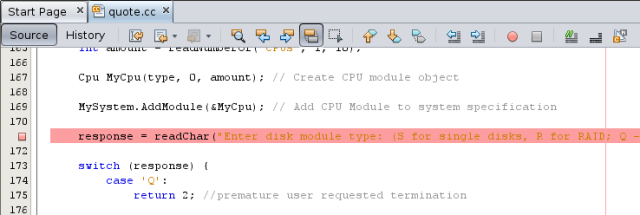
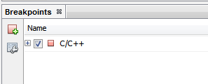
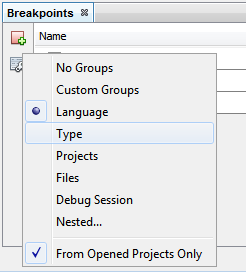

// 
//     Licensed to the Apache Software Foundation (ASF) under one
//     or more contributor license agreements.  See the NOTICE file
//     distributed with this work for additional information
//     regarding copyright ownership.  The ASF licenses this file
//     to you under the Apache License, Version 2.0 (the
//     "License"); you may not use this file except in compliance
//     with the License.  You may obtain a copy of the License at
// 
//       http://www.apache.org/licenses/LICENSE-2.0
// 
//     Unless required by applicable law or agreed to in writing,
//     software distributed under the License is distributed on an
//     "AS IS" BASIS, WITHOUT WARRANTIES OR CONDITIONS OF ANY
//     KIND, either express or implied.  See the License for the
//     specific language governing permissions and limitations
//     under the License.
//

= C/C++プロジェクトのデバッグのチュートリアル
:jbake-type: tutorial
:jbake-tags: tutorials 
:jbake-status: published
:icons: font
:syntax: true
:source-highlighter: pygments
:toc: left
:toc-title:
:description: C/C++プロジェクトのデバッグのチュートリアル - Apache NetBeans
:keywords: Apache NetBeans, Tutorials, C/C++プロジェクトのデバッグのチュートリアル

2013年3月 [リビジョン番号: V8.0-1]

この短いチュートリアルでは、NetBeans IDEのC/C++プロジェクトをデバッグするための機能の一部を学ぶことができます。

== 要件

*このチュートリアルに従うには、次のソフトウェアとリソースが必要です。*

|===
|ソフトウェアまたはリソース |必須バージョン 

|NetBeans IDE |link:https://netbeans.org/downloads/index.html[+バージョン7.4または8.0とNetBeans C/C++プラグイン・モジュール+] 

|Java Developer Kit (JDK) |link:http://www.oracle.com/technetwork/java/javase/downloads/index.html[+バージョン7または8+] 
|===

必要なソフトウェアのダウンロードとインストールについては、link:../../../community/releases/80/install.html[+NetBeans IDEのインストール手順+]およびlink:../../../community/releases/80/cpp-setup-instructions.html[+C/C++/Fortran向けのNetBeans IDEの構成+]を参照してください。

== サンプル・プロジェクトの作成

C/C++を使用するNetBeans IDEでは、 ``gdb`` デバッガが使用され、プロジェクトをデバッグするための多数の機能が提供されています。 ``Quote`` プロジェクトを使用して、これらの機能を確認します。まだこのプロジェクトを作成していない場合は、次の操作を実行します。

1. 「ファイル」>「新規プロジェクト」を選択します。
2. プロジェクトのウィザードで「サンプル」カテゴリ、「C/C++」サブカテゴリを順番に展開します。
3. 「アプリケーション」サブカテゴリを選択して、「 ``Quote`` 」プロジェクトを選択します。「次」をクリックして、「終了」をクリックします。

== ブレークポイントの作成

デバッグ・セッションを開始することなく、いつでもコードにブレークポイントを作成したり、操作したりできます。

=== 行ブレークポイントの作成と除去

1.  ``Quote_1`` プロジェクトの ``quote.cc`` ファイルを開きます。
2. 行171 ( ``response=readChar("Enter disk module type: (S for single disks, R for RAID; Q - exit)", 'S');`` )の横の、「ソース・エディタ」ウィンドウの左マージンをクリックすることによって行ブレークポイントを設定します。赤く強調表示されている行は、ブレークポイントが設定されていることを示します。

[start=3]
. ブレークポイントは、左マージン内のアイコンをクリックすることによって除去できます。

[start=4]
. 「ウィンドウ」>「デバッグ」>「ブレークポイント」を選択し、「ブレークポイント」ウィンドウを開きます。行ブレークポイントがC/C++ノードの下に一覧表示されます。

[start=5]
. 行ブレークポイントを表示するには、C/C++ノードを拡張します。

image::images/line_breakpoint2_expand.png[]

=== 関数ブレークポイントの作成

1. 「ブレークポイント」ウィンドウの左マージンで「新規ブレークポイントを作成」ボタンをクリックするか、「デバッグ」>「新規ブレークポイント」([Ctrl]+[Shift]+[F8])を選択して「新規ブレークポイント」ダイアログ・ボックスを開きます。
2. 「デバッガ・タイプ」リストで、「ネイティブ」を選択します。
3. 「ブレークポイント・タイプ」リストで、「関数」を選択します。
4. 「関数名」テキスト・フィールドに「 ``Customer::GetDiscount`` 」を入力します。「OK」をクリックします。 

image::images/function_breakpoint1.png[]

[start=5]
. 関数ブレークポイントが設定され、「ブレークポイント」ウィンドウの一覧に追加されます。

image::images/function_breakpoint2.png[]

[start=6]
. 左マージンで「ブレークポイント・グループを選択」ボタンをクリックしてブレークポイントを各種グループに編成し、「タイプ」を選択します。

[start=7]
. ブレークポイントを表示するには、「ファイル:行」および「関数」グループを拡張します。

image::images/breakpoint_types.png[]

== デバッグ・セッションの開始

デバッグ・セッションを開始すると、IDEによって ``gdb`` デバッガが起動され、そのデバッガ内でアプリケーションが実行されます。デバッガ・ウィンドウおよびデバッガ・ツールバーが自動的に開き、「出力」ウィンドウにデバッガの出力が出力されます。

1. 「プロジェクトをデバッグ」ボタンimage:images/debugbutton.png[]をクリックして ``Quote_1`` プロジェクトのデバッグ・セッションを開始するか、「デバッグ」>「プロジェクトをデバッグ」を選択します。
デバッガが起動し、アプリケーションが実行されます。デバッグ・ツールバーが表示されます。

image::images/debugger_toolbar.png[]

[start=2]
. 「ウィンドウ」>「デバッグ」>「セッション」を選択して「セッション」ウィンドウを開きます。
開いたウィンドウにデバッグ・セッションが表示されます。

== アプリケーションの状態の検査

1.  ``Quote_1`` アプリケーションは、「出力」(デバッグ)ウィンドウ上に入力を求めるメッセージを出力します。
2. 「Enter customer name:」プロンプトの後に顧客名を入力します。

アプリケーションは、前に設定したCustomer::GetDiscount関数ブレークポイントで停止し、customer.ccファイルがエディタ内の関数が呼び出された行で開かれます。「ブレークポイント」ウィンドウに、前に設定した2つのブレークポイントが表示されます。関数ブレークポイントのブレークポイント・アイコンの上に、緑色のプログラム・カウンタの矢印が表示されます。

image::images/function_breakpoint3.png[]

[start=3]
. 「呼出しスタック」ウィンドウのタブをクリックするか、「ウィンドウ」>「デバッグ」>「呼出しスタック」を選択します。コール・スタックに3つのフレームが表示されます。

image::images/call_stack.png[]

[start=4]
. 「変数」ウィンドウを開いて、変数が1つ表示されていることを確認します。

[start=5]
. 展開アイコンをクリックし、構造を展開します。

image::images/local_variables1.png[]

[start=6]
. ツールバーにある「続行」ボタンをクリックします。
 ``GetDiscount`` 関数が実行され、「出力」(デバッグ)ウィンドウに顧客の割引額が表示されます。その後、入力が求められます。

[start=7]
. このプロンプトに対して入力を行います。

次のブレークポイント、すなわち前に設定した行ブレークポイントでプログラムが停止します。 ``quote.cc`` ファイルでは、プログラムが停止した行を示すブレークポイントのアイコンの上に、緑色のプログラム・カウンタの矢印が表示されます。

image::images/line_breakpoint3.png[]

[start=8]
. 「変数」タブをクリックし、変数の一覧を確認します。 

image::images/local_variables2.png[]

[start=9]
. 「コール・スタック」タブをクリックし、スタック内にフレームが1つあることを確認します。

[start=10]
. 「ウィンドウ」>「デバッグ」>「レジスタ」を選択します。
「レジスタ」ウィンドウが開き、現在のレジスタの内容が表示されます。 

image::images/registers.png[] 

[start=11]
. 「ウィンドウ」>「デバッグ」>「逆アセンブリ」を選択します。
「逆アセンブリ」ウィンドウが開き、現在のソース・ファイルのアセンブリ命令が表示されます。 

image::images/disassembly.png[] 

[start=12]
. ツールバーにある「続行」ボタンをクリックし、プログラムが完了するまで、「出力」ウィンドウのプロンプトに対応して入力を続けます。

[start=13]
. [Enter]を押してプログラムを終了するとデバッグ・セッションが終了します。プログラムの実行が完了する前にデバッグ・セッションを終了するには、ツールバーで「デバッガ・セッションを終了」ボタンをクリックするか、「デバッグ」>「デバッガ・セッションを終了」を選択します。

== 関連項目

NetBeans IDEでのC/C++/Fortranを使用した開発に関する詳細な記事は、link:https://netbeans.org/kb/trails/cnd.html[+C/C++の学習+]を参照してください。

link:mailto:users@cnd.netbeans.org?subject=Feedback:%20Debugging%20C/C++%20Projects%20-%20NetBeans%20IDE%207.4%20Tutorial[+このチュートリアルに関するご意見をお寄せください+]
