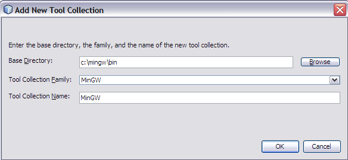

// 
//     Licensed to the Apache Software Foundation (ASF) under one
//     or more contributor license agreements.  See the NOTICE file
//     distributed with this work for additional information
//     regarding copyright ownership.  The ASF licenses this file
//     to you under the Apache License, Version 2.0 (the
//     "License"); you may not use this file except in compliance
//     with the License.  You may obtain a copy of the License at
// 
//       http://www.apache.org/licenses/LICENSE-2.0
// 
//     Unless required by applicable law or agreed to in writing,
//     software distributed under the License is distributed on an
//     "AS IS" BASIS, WITHOUT WARRANTIES OR CONDITIONS OF ANY
//     KIND, either express or implied.  See the License for the
//     specific language governing permissions and limitations
//     under the License.
//

= Defining Your C/C++ Project's Development Environment
:jbake-type: tutorial
:jbake-tags: tutorials 
:jbake-status: published
:icons: font
:syntax: true
:source-highlighter: pygments
:toc: left
:toc-title:
:description: Defining Your C/C++ Project's Development Environment - Apache NetBeans
:keywords: Apache NetBeans, Tutorials, Defining Your C/C++ Project's Development Environment
include::../../../inc/database.adoc[]

//_March 2014_ [Revision number: V8.0-1]

The following short tutorial takes you through the basic steps of selecting the build host and tool collection for building and debugging a C or C++ project in NetBeans IDE.

image::images/netbeans-stamp-80-74-73.png[title="Content on this page applies to the NetBeans IDE 7.3 and more recent"]

== Requirements

*To follow this tutorial, you need the following software and resources.*

|===
|Software or Resource |Version Required 

|NetBeans IDE |xref:../../../download/index.adoc[version 7.3 or more recent with NetBeans C/C{pp} plugin] 

|Java Developer Kit (JDK) |link:{jdkdownload}[version 6, 7, or 8] 
|===

See the xref:../../../community/releases/80/install.adoc[NetBeans IDE Installation Instructions] for information on downloading and installing the required software.

== Installing Tool Collections

The Netbeans C/C{pp} module minimally requires a C compiler, C{pp} compiler, make utility, and gdb debugger. See xref:../../../community/releases/80/cpp-setup-instructions.adoc[Configuring the NetBeans IDE for C/C{pp}/Fortran] for instructions on installing and configuring the required compilers and tools.

== Specifying the Build Host

You can build, run, and debug your project on the local host (the system from which you started the IDE) or on a remote host running a UNIX® operating system. Only the Oracle Solaris and Linux operating systems have been tested as remote build hosts. Initially, the IDE is set up to use the local host only.

You can define remote build hosts in several ways:

* Using the Services window: Choose Window > Services, then right-click C/C++ Build Hosts and select Add New Host.
* Right-click a project, select Set Build Host > Manage Hosts, then click Add in the Build Host Manager dialog box.
* Using the Options window: Choose Tools > Options > C/C++ > Build Tools and click the Edit button next to the Build Host list.

See the xref:remotedev-tutorial.adoc[C/C{pp} Remote Development Tutorial] for more information.

== Using the Tool Collection List

The Tool Collection list shows what tool collections are available to the IDE on the local host and on each remote build host. You can see the Tool Collections in any of the following ways:

* Using the Services window: Choose Window > Services, expand C/C++ Build Hosts and the host you are interested in. The Tool Collections node lists the tool collections available on the host.
* Use the Projects window: Right-click a project, select Properties, and click the Build category. You can select a tool collection to use for the project or click the button next to the Tool Collection list to open the Tool Collection Manager to set the default collection, and add or remove tool collections.
* Using the Options window: Choose Tools > Options > C/C++ > Build Tools. In this property sheet you can manage the tool collections after selecting the host in the Build Host list.

In each case, the Tool Collection list displays the collections found on the host currently selected in the Build Host list. The default collection is listed in bold type, and is selected for any new project you create using the build host. You can change the tool collection for a specific project in the project properties.

=== Changing the Default Tool Collection

To change the default tool collection, select a collection from the Tool Collection list and click Default. The new default tool collection will be selected for any new projects you create using the selected build host.

=== Adding a Tool Collection to a Build Host

When you add a tool collection, you make the compilers available to the IDE. The tools must be installed on the system already.

To add a tool collection associated with a build host:

1. In the Services window, expand the node for the C/C++ Build Host where you want to add the collection.
2. Right-click the Tool Collections node and select Add New Tool Collection.
You can also add collections from the Tools > Options > C/C++ > Build Tools tab by clicking the Add button below the Tool Collection list. 

The Add Tool Collection dialog box opens. 

[start=3]
. In the Add New Tool Collection dialog box, type the directory path for the tool collection's executable files in the Base Directory field, or use the Browse button to navigate to the directory, which is usually called  ``bin`` .

[start=4]
. The Tool Collection Family and Tool Collection Name are filled in automatically for valid paths. You can specify a different name to display in the IDE for the collection. If you change the Tool Collection Family, make sure that the family you specify is correct for the collection or the compiler flags might not be valid.

[start=5]
. Click OK. 

The new tool collection is added to the Tool Collection list.

== Changing the Tool Collection for a Project

When you create a project, the current default tool collection is selected as the tool collection for the project. You can change the tool collection for your project to another collection on the collection list, or you can customize a tool collection especially for the project.

To select a different tool collection for an existing project:

1. Right-click the project node in the Projects window and choose Properties.
2. In the Project Properties dialog box, select the Build node in the Categories list.
3. In the build tools properties, make sure the Build Host is set to the host you want to build on.
4. Select a collection from the Tool Collection dropdown list. 

image::images/select-collection.png[]

[start=5]
. Click OK.

The next time you build the project, the selected tool collection will be used.

== See Also

Please see the xref:../cnd.adoc[C/C{pp} Learning Trail] for more articles about developing with C/C++/Fortran in NetBeans IDE.

xref:../../../community/mailing-lists.adoc[Send Us Your Feedback]
