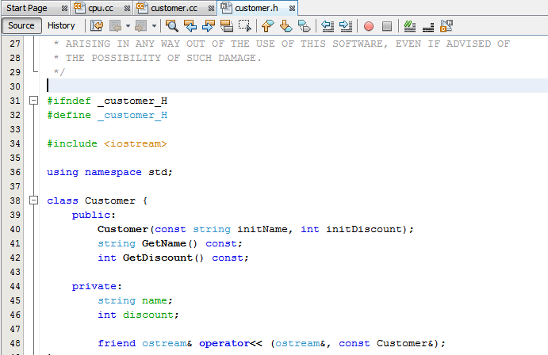
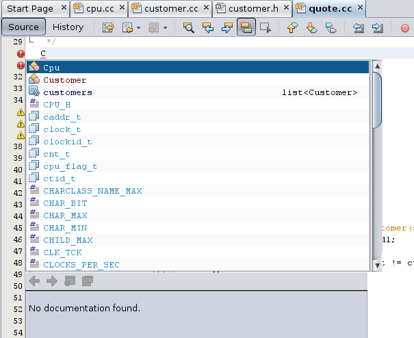
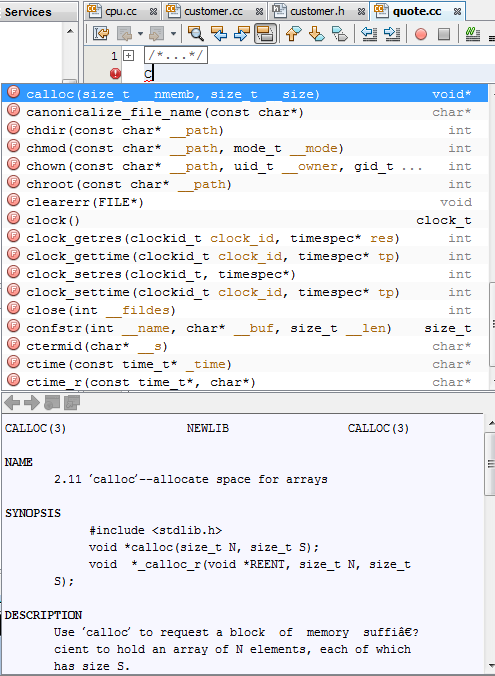
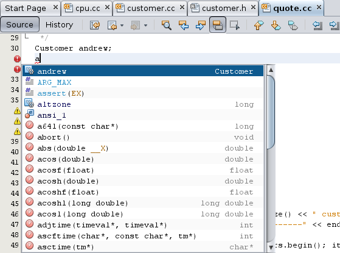
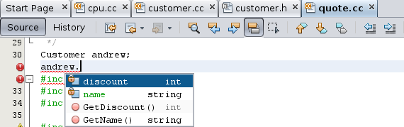
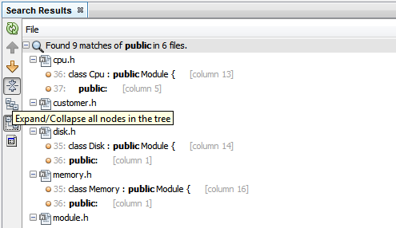
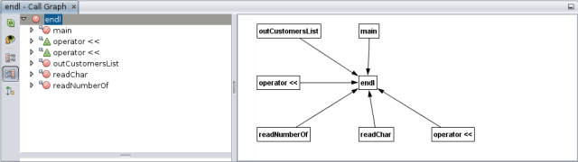
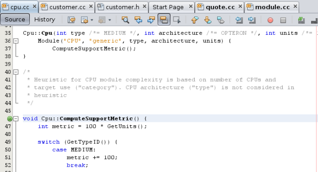
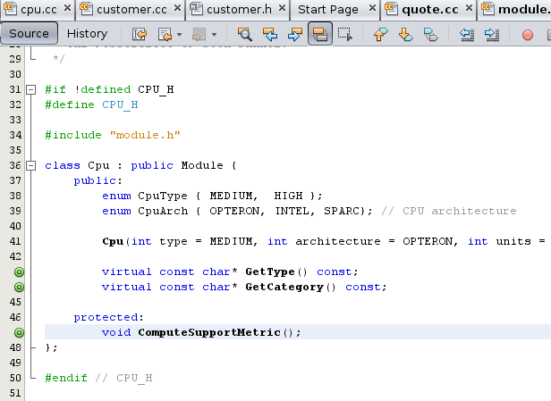

// 
//     Licensed to the Apache Software Foundation (ASF) under one
//     or more contributor license agreements.  See the NOTICE file
//     distributed with this work for additional information
//     regarding copyright ownership.  The ASF licenses this file
//     to you under the Apache License, Version 2.0 (the
//     "License"); you may not use this file except in compliance
//     with the License.  You may obtain a copy of the License at
// 
//       http://www.apache.org/licenses/LICENSE-2.0
// 
//     Unless required by applicable law or agreed to in writing,
//     software distributed under the License is distributed on an
//     "AS IS" BASIS, WITHOUT WARRANTIES OR CONDITIONS OF ANY
//     KIND, either express or implied.  See the License for the
//     specific language governing permissions and limitations
//     under the License.
//

= Editing and Navigating C/C++ Source Files - NetBeans IDE Tutorial
:jbake-type: tutorial
:jbake-tags: tutorials 
:jbake-status: published
:icons: font
:syntax: true
:source-highlighter: pygments
:toc: left
:toc-title:
:description: Editing and Navigating C/C++ Source Files - NetBeans IDE Tutorial - Apache NetBeans
:keywords: Apache NetBeans, Tutorials, Editing and Navigating C/C++ Source Files - NetBeans IDE Tutorial
include::../../../inc/database.adoc[]

//_Contributed by _Ann Rice_ and maintained by _Susan Morgan_
//March 2014_ [Revision number: V8.0]

The following short tutorial takes you through some of the features for navigating and editing the source files in a C or C++ project in NetBeans IDE.

== Requirements

*To follow this tutorial, you need the following software and resources.*

|===
|Software or Resource |Version Required 

|NetBeans IDE |xref../../../download/index.adoc[ version 7.4 or 8.0 with NetBeans C/C{pp} plugin] 

|Java Developer Kit (JDK) |link:{jdkdownload}[version 7 or 8] 
|===

See the xref:../../../community/releases/80/install.adoc[NetBeans IDE 8.0 Installation Instructions] and xref:../../../community/releases/80/cpp-setup-instructions.adoc[Configuring the NetBeans IDE for C/C{pp}/Fortran]
for information about downloading and installing the required software.

*Sample Projects*

Just want to play with some projects? In the IDE, choose File > New Project, then open the Samples category and the C/C{pp} subcategory. The IDE provides several sample C and C++ projects to help you familiarize yourself with the IDE.

== Creating the Sample Project

The NetBeans IDE with the C/C{pp} plugin provides advanced editing features for modifying your source code. To explore these features, we'll use the  ``Quote``  project. If you have not already created this project, do the following:

1. Choose File > New Project.
2. In the project wizard, expand the Samples category and select the C/C++ subcategory.
3. Select the  ``Quote``  project. Click Next, then click Finish.

== Editing C and C++ Source Files

=== Setting the Formatting Style

You can use the Options window to configure default formatting style for your C and C++ projects.

1. Choose Tools > Options.
2. Click Editor in the top pane of the window.
3. Click the Formatting tab.
4. Select the C++ language from the Language drop-down list because the Quote project uses C++.
5. Select the style you want to set from the Style drop-down list.

image::images/formatting_style.png[]

[start=6]
. Modify the style properties as desired.

=== Folding Blocks of Code in C and C++ Files

For some types of files, you can use the code folding feature to collapse blocks of code so that only the first line of the block appears in the Source Editor.

1. In the  ``Quote_1``  application project, open the Source Files folder, then double-click the  ``cpu.cc``  file to open it in the Source Editor.
2. Click the collapse icon (small box with minus sign) in the left margin to fold the code of one of the methods.
3. Mouse over the  ``{...}``  symbol to the right of the folded block to display the code in the block. 

image::images/code_folding.png[]

=== Using Semantic Highlighting

You can set an option so that when you click on a class, function, variable, or macro, all occurrences of that class, function, variable, or macro in the current file are highlighted.

1. Choose Tools > Options.
2. Click Editor in the top pane of the window.
3. Click the Highlighting tab.
4. Make sure that all of the check boxes contain checkmarks.
5. Click OK.
6. In the  ``customer.cc``  file of the  ``Quote_1``  project, notice that the method names are highlighted in bold.
7. Click on an occurrence of the  ``Customer``  class.
8. All of the occurrences of the  ``Customer``  class in the file are highlighted with a yellow background. The right margin also shows markings that indicate points where an occurrence is located in the file. The markings let you see how many occurrences there are without scrolling through the file. You can click the markings to jump to the occurrences that they represent.

image::images/highlighting1.png[]

[start=9]
. To easily navigate between the occurrences, press Alt+Down to go to the next occurrence, and press Alt+Up to go to the previous occurrence.

[start=10]
. Open the  ``customer.h``  file, located in the Headers folder, and notice that class names are again highlighted in bold.

=== Using Code Completion and Documentation

The IDE has a dynamic C and C++ code completion feature that enables you to type one or more characters and then see a list of possible classes, methods, variables, and so on that can be used to complete the expression.

The IDE also dynamically searches for documentation for the classes, functions, methods and so on, and displays the documentation in a popup window.

1. Open the  ``quote.cc``  file in the  ``Quote_1``  project.
2. On the first blank line of the  ``quote.cc`` , type a capital C and press Ctrl-Space. The code completion box displays a short list that includes the  ``Cpu``  and  ``Customer``  classes. A documentation window also opens but displays "No documentation found" because the project source does not include documentation for its code.
3. Expand the list of items by pressing Ctrl-Space again. 

[start=4]
. Use your arrow keys or mouse to highlight a standard library function such as  ``calloc``  from the list, and the documentation window displays the man page for that function if the man page is accessible to the IDE. 

[start=5]
. Select the  ``Customer``  class and press Enter.

[start=6]
. Complete the new instance of the  ``Customer``  class by typing "  ``andrew;`` ". On the next line, type the letter  ``a``  and press Ctrl-Space twice. The code completion box displays a list of choices starting with the letter  ``a`` , such as method arguments, class fields, and global names, that are accessible from the current context.

[start=7]
. Double-click the  ``andrew``  option to accept it and type a period after it. Press Ctrl-Space and you are provided with a list of the public methods and fields of the  ``Customer``  class.

[start=8]
. Delete the code you have added.

=== Adding Source Code Documentation

You can add comments to your code to automatically generate documentation for your functions, classes, and methods. The IDE recognizes comments that use Doxygen syntax and automatically generates documentation. The IDE can also automatically generate a comment block to document the function below the comment.

1. In the  ``quote.cc``  file, place your cursor on line 75, or the line above the line 
 ``int readNumberOf(const char* item, int min, int max) {`` 

[start=2]
. Type a slash and two asterisks and press Enter. The editor inserts a Doxygen-formatted comment for the  ``readNumberOf``  class. 

image::images/doxygen_comment.png[]

[start=3]
. Add some descriptive text to each of the @param lines and save the file. 

image::images/doxygen_comment_edited.png[]

[start=4]
. Click the  ``readNumberOf``  class to highlight it in yellow, and click one of the occurrences marks on the right to jump to a location where the class is used.

[start=5]
. Click the  ``readNumberOf``  class in the line you jumped to, and press Ctrl-Shift-Space to show the documentation that you just added for the parameters.

image::images/doxygen_displayed.png[]

[start=6]
. Click anywhere else in the file to close the documentation window, and click on the  ``readNumberOf``  class again.

[start=7]
. Choose Source > Show Documentation to open the documentation window for the class again.

=== Using Code Templates

The Source Editor has a set of customizable code templates for common snippets of C and C++ code. You can generate the full code snippet by typing its abbreviation and pressing the Tab key. For example, in the  ``quote.cc``  file of the  ``Quote``  project:

1. Type  ``uns``  followed by a tab and  ``uns``  expands to  ``unsigned`` .
2. Type  ``iff``  followed by a tab and  ``iff``  expands to  ``if (exp) {}`` .
3. Type  ``ife``  followed by a tab and  ``ife``  expands to  ``if (exp) {} else {}`` .
4. Type  ``fori``  followed by a tab and  ``fori``  expands to  ``for (int i = 0; i < size; i++) { Object elem = array[i];`` .

To see all the available code templates, modify the code templates, create your own code templates, or select a different key to expand the code templates:

1. Choose Tools > Options.
2. In the Options dialog box, select Editor, and click the Code Templates tab.
3. Select the appropriate language from the Language drop-down list.

image::images/code_templates.png[]

=== Using Pair Completion

When you edit your C and C++ source files, the Source Editor does "smart" matching of pair characters such as brackets, parentheses, and quotation marks. When you type one of these characters, the Source Editor automatically inserts the closing character.

1. In the  ``Quote_1``  project, place the cursor on the blank line 115 of the  ``module.cc``  file and press Return to open a new line.
2. Type  ``enum state {``  and press Return. The closing curly bracket and semi-colon are added automatically and the cursor is placed on the line between the brackets.
3. Type  ``invalid=0, success=1``  on the line between the brackets to complete the enumeration.
4. On the line after the closing  ``};``  of the enumeration, type  ``if (``  and you should see that a closing parenthesis is added automatically and the cursor is placed between the parentheses.
5. Type  ``v==null``  between the parentheses. Then type  `` {``  and newline after the right parenthesis. The closing bracket is added automatically.
6. Delete the code you have added.

=== Finding Text in Project Files

You can use the Find In Projects dialog box to search projects for instances of specified text or a regular expression.

1. Open the Find In Projects dialog box by doing one of the following:
* Choose Edit > Find In Projects.
* Right-click a project in the Projects window and choose Find.
* Press Ctrl+Shift+F.

[start=2]
. In the Find In Projects dialog box, select the Default Search tab or the Grep tab. The Grep tab uses the  ``grep``  utility, which provides a faster search, especially for remote projects. 

image::images/find_in_projects.png[]

[start=3]
. In the Grep tab, type the text or regular expression for which you want to search, specify the search scope and file name pattern, and select the check box Open in New Tab so you can save multiple searches in separate tabs.

[start=4]
. Click Find.
The Search Results tab lists the files in which the text or regular expression is found.

Buttons in the left margin enable you to change your view of the search results.

[start=5]
. Click the Expand/Collapse button to collapse the list of files so only the filenames are shown. Click the other buttons to show the search results as a directory tree or as a list of files. These options are useful when you perform a search across multiple projects.

[start=6]
. Double-click one of the items in the list and the IDE takes you to the corresponding location in the source editor.

== Navigating C and C++ Source Files

The NetBeans IDE with the C/C++ plugin provides advanced navigation features for viewing your source code. To explore these features, continue using the  ``Quote_1``  project.

=== Using the Classes Window

The Classes window lets you see all of the classes in your project, and the members and fields for each class.

1. Click the Classes tab to display the Classes window. If the Classes tab is not displayed, choose Window > Classes
2. Expand the  ``Quote_1``  node in the Classes window. All classes in the project are listed.
3. Expand the  ``Customer``  class. 

image::images/classes_window.png[]

[start=4]
. Double-click the  ``name``  variable to open the  ``customer.h``  header file.

=== Using the Navigator Window

The Navigator window provides a compact view of the file that is currently selected, and simplifies navigation between different parts of the file. If the Navigator window is not displayed, choose Window > Navigating > Navigator to open it.

1. Click anywhere in the  ``quote.cc``  file in the Editor window.
2. A compact view of the file is displayed in the Navigator window.

image::images/navigator_window.png[]

[start=3]
. To navigate to an element of the file, double-click the element in the Navigator window and the cursor in the Editor window moves to that element.

[start=4]
. Right-click in the Navigator to choose a different way to sort the elements, or group the items, or filter them.

To find out what the icons in the Navigator represent, open the IDE online help by choosing Help > Help Contents, and search for "navigator icons" in the help window.

=== Finding Class, Method, and Field Usages

You can use the Usages window to show you everywhere a class (structure), function, variable, macro, or file is used in your project's source code.

1. In the  ``customer.cc``  file, right-click the  ``Customer``  class on line 42, and choose Find Usages.
2. In the Find Usages dialog box, click Find.
3. The Usages window opens and displays all of the usages of the  ``Customer``  class in the source files of the project.

image::images/usages_window.png[]

[start=4]
. Click the arrow buttons in the left margin to step through the occurrences and show them in the Editor, or change between logical and physical view. You can also filter the information using a second column of buttons in the left margin.

=== Using the Call Graph

The Call Graph window displays two views of the calling relationships between functions in the project. A tree view shows the functions called from a selected function, or the functions that call the selected function. A graphical view shows the calling relationships using arrows between the called and calling functions.

1. In the  ``quote.cc``  file, right-click on the  ``main``  function and choose Show Call Graph.
2. The Call Graph window opens and displays a tree and graphical view of all functions called from the  ``main``  function.

image::images/call_graph1.png[]

If you do not see all the functions as shown here, click the third button on the left side of the Call Graph window to show "who is called from this function."

[start=3]
. Expand the  ``endl``  node to display the functions called by that function. Notice the graph is updated to show the functions called by  ``endl``  as well.

[start=4]
. Click the second button, called Bring Into Focus, on the left side of the window to focus on the  ``endl``  function, then click the fourth button Who Calls this Function to view all the functions that call the  ``endl``  function. 

[start=5]
. Expand some of the nodes in the tree to see more functions.

image::images/call_graph3.png[]

=== Using Hyperlinks

Hyperlink navigation lets you jump from the invocation of a class, method, variable, or constant to its declaration, and from its declaration to its definition. Hyperlinks also let you jump from a method that is overridden to the method that overrides it, and vice versa.

1. In the  ``cpu.cc``  file of the  ``Quote_1``  project, mouse over line 37 while pressing Ctrl. The  ``ComputeSupportMetric`` function is highlighted and an annotation displays information about the function.

image::images/hyperlinks1.png[]

[start=2]
. Click the hyperlink and the editor jumps to the definition of the function.

[start=3]
. Mouse over the definition while pressing Ctrl, and click the hyperlink. The editor jumps to the declaration of the function in the  ``cpu.h``  header file.

[start=4]
. Click the left arrow in the editor toolbar (second button from the left) and the editor jumps back to the definition in  ``cpu.cc`` .

[start=5]
. Hover the mouse cursor over the green circle in the left margin and see the annotation that indicates that this method overrides another method.

image::images/overide_annotation.png[]

[start=6]
. Click the green circle to go to the overridden method and you jump to the  ``module.h``  header file, which shows a gray circle in the margin to indicate the method is overridden.

[start=7]
. Click the gray circle and the editor displays a list of methods that override this method.

image::images/overridden_by_list.png[]

[start=8]
. Click the  ``Cpu::ComputeSupportMetric``  item and you jump back to the declaration of the method in the  ``cpu.h``  header file.

=== Using the Includes Hierarchy

The Includes Hierarchy window lets you inspect all header and source files that are directly or indirectly included in a source file, or all source and header files that directly or indirectly include a header file.

1. In the  ``Quote_1``  project, open the  ``module.cc``  file in the Source Editor.
2. Right-click on the  ``#include "module.h"``  line in the file and choose Navigate > View Includes Hierarchy.
3. By default, the Hierarchy window displays a plain list of files that directly include the header file. Click the right-most button at the bottom of the window to change the display to a tree view. Click the second button from the right to change the display to all files that include or are included. Expand the nodes in the tree view to see all of the source files that include the header file.

image::images/includes_hierarchy.png[]

=== Using the Type Hierarchy

The Type Hierarchy window lets you inspect all subtypes or supertypes of a class.

1. In the  ``Quote_1``  project, open the  ``module.h``  file.
2. Right-click on the declaration of the  ``Module``  class and choose Navigate > View Type Hierarchy.
3. The Hierarchy window displays all of the subtypes of the Module class.

image::images/type_hierarchy.png[]

== Next Steps

See xref:debugging.adoc[Debugging C/C{pp} Projects] for a tutorial on using some of the features for debugging a C or C++ project in NetBeans IDE.

xref:../../../community/mailing-lists.adoc[Send Us Your Feedback]
