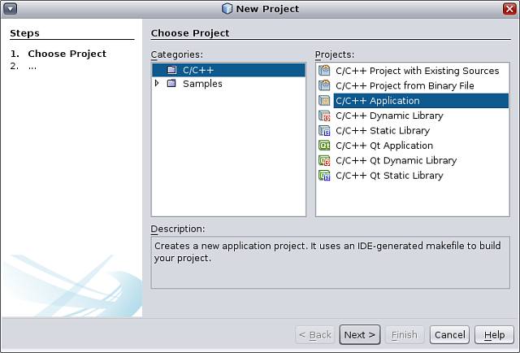
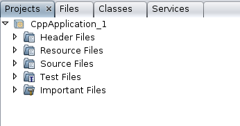
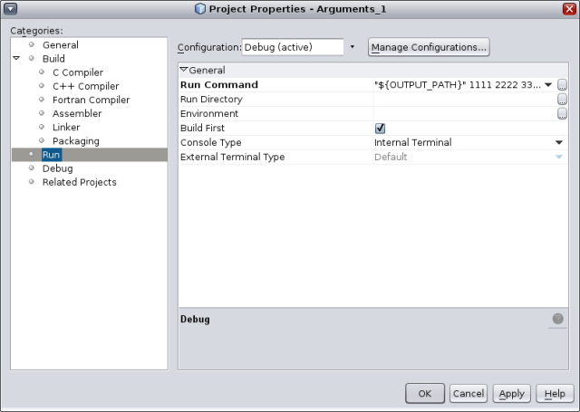

// 
//     Licensed to the Apache Software Foundation (ASF) under one
//     or more contributor license agreements.  See the NOTICE file
//     distributed with this work for additional information
//     regarding copyright ownership.  The ASF licenses this file
//     to you under the Apache License, Version 2.0 (the
//     "License"); you may not use this file except in compliance
//     with the License.  You may obtain a copy of the License at
// 
//       http://www.apache.org/licenses/LICENSE-2.0
// 
//     Unless required by applicable law or agreed to in writing,
//     software distributed under the License is distributed on an
//     "AS IS" BASIS, WITHOUT WARRANTIES OR CONDITIONS OF ANY
//     KIND, either express or implied.  See the License for the
//     specific language governing permissions and limitations
//     under the License.
//

= C/C++ 项目快速入门教程
:jbake-type: tutorial
:jbake-tags: tutorials 
:jbake-status: published
:icons: font
:syntax: true
:source-highlighter: pygments
:toc: left
:toc-title:
:description: C/C++ 项目快速入门教程 - Apache NetBeans
:keywords: Apache NetBeans, Tutorials, C/C++ 项目快速入门教程

撰稿人：_Ann Rice_，维护人：_Susan Morgan_ 
_2014 年 3 月_ [修订版本号：V8.0-1]

本简明教程将介绍在 NetBeans IDE 中创建和配置 C 或 C++ 项目的基本步骤。

image::images/netbeans-stamp-80-74-73.png[title="此页上的内容适用于 NetBeans IDE 7.2 及更高版本"]

== 要求

*要学习本教程，您需要具备以下软件和资源。*

|===
|软件或资源 |要求的版本 

|NetBeans IDE |link:https://netbeans.org/downloads/index.html[+带有 NetBeans C/C++ 插件的版本 7.2 或更新版本+] 

|Java 开发者工具包 (JDK) |link:http://www.oracle.com/technetwork/java/javase/downloads/index.html[+版本 6、7 或 8+] 

|C 和 C++ 编译器、 ``make`` 、 ``gdb``  |link:../../../community/releases/80/cpp-setup-instructions.html[+配置 NetBeans IDE 以使用 C/C++/Fortran+] 
|===

有关下载并安装所需软件的信息，请参见 link:../../../community/releases/80/install.html[+NetBeans IDE 安装说明+]和link:../../../community/releases/80/cpp-setup-instructions.html[+配置 NetBeans IDE 以使用 C/C++/Fortran+]
。

*样例项目*

如果只需使用 IDE 中提供的某些样例项目，请选择 "File"（文件）> "New Project"（新建项目），然后打开 "Sample"（样例）类别和 "C/C++" 子类别。IDE 提供了一些 C 和 C++ 样例项目来帮助您熟悉 IDE。

== 创建 C 和 C++ 项目

NetBeans C/C++ 支持允许您通过生成的 makefile 创建 C 和 C++ 应用程序及库项目，并且还允许创建基于现有源代码的 C 和 C++ 项目。

可以在本地主机（从中启动 IDE 的系统）或运行 UNIX® 操作系统的远程主机上构建、运行和调试项目。有关为项目指定工具集合以及定义和使用远程主机的信息，请参见link:development-environment.html[+定义 C/C++ 项目的开发环境+]。

对于 C/C++ 应用程序、动态库或静态库项目，IDE 控制应用程序如何构建、运行和调试的各个方面。您可在创建项目时，或在 "Project Properties"（项目属性）对话框中指定项目设置。IDE 生成一个 makefile 来存储所有设置。

=== 创建 C/C++ 应用程序项目

1. 选择“文件”>“新建项目”以打开新建项目向导。
2. 在向导中，选择 "C/C++" 类别。
3. 该向导提供了多种类型的新项目供您选择。选择 "C/C++ Application"（C/C++ 应用程序），然后单击 "Next"（下一步）。 

[start=4]
. 通过向导并使用默认设置来创建一个 "C/C++ Application"（C/C++ 应用程序）项目。您可以选择项目的名称和位置。

[start=5]
. 单击 "Finish"（完成）退出向导。

现已创建了一个具有逻辑文件夹的项目。逻辑文件夹不是目录。它是一种组织文件的方式，并不反映文件在磁盘上的物理存储位置。添加到逻辑文件夹的文件将自动成为项目的一部分，并且在构建项目时进行编译。

添加到 "Important Files"（重要文件）文件夹中的文件不是项目的一部分，在构建项目时不会编译。这些文件只是用于参考，并在您用现有 makefile 创建项目时提供方便。

=== 在项目的逻辑视图与物理视图之间切换

一个项目同时具有逻辑和物理视图。您可以在项目的逻辑视图与物理视图之间进行切换。

1. 选择 "Files"（文件）标签。该窗口显示项目的物理视图。它按原样体现磁盘上存储的文件和文件夹。 

image::images/files_tab.png[]

[start=2]
. 选择 "Projects"（项目）标签。该窗口显示项目的逻辑视图。 

对项目运行的多数命令包含在 "Projects"（项目）标签中，而不是包含在 "Files"（文件）标签中。

=== 在项目中添加文件和文件夹

您可以在项目中添加逻辑文件夹。

1. 右键单击应用程序项目的项目节点，选择 "New Logical Folder"（新建逻辑文件夹）。一个新的逻辑文件夹将添加到项目中。
2. 右键单击新逻辑文件夹并选择 "Rename"（重命名）。输入您想要的新文件夹的名称。

您可以在现有文件夹中添加文件和文件夹。逻辑文件夹可以嵌套。

=== 在项目中添加新文件

您可以在项目中添加新文件。

1. 右键单击 "Source Files"（源文件）文件夹，然后选择 "New"（新建）> "C++ Source File"（C++ 源文件）。
2. 在新建文件对话框的 "Name and Location"（名称和位置）页的 "File Name"（文件名）字段中，键入  ``newfile`` 。 

image::images/adding_files.png[] 

[start=3]
. 单击 "Finish"（完成）。

 ``newfile.cpp``  文件随即在向导中指定的磁盘目录下创建，并添加到 "Source Files"（源文件）文件夹中。您可以在此文件夹中添加任何类型的文件，而不仅仅是源文件。

=== 在项目中添加新文件

1. 右键单击 "Header Files"（头文件）文件夹，然后选择 "New"（新建）> "C++ Header File"（C++ 头文件）。
2. 在新建文件对话框的 "Name and Location"（名称和位置）页的 "File Name"（文件名）字段中，键入  ``newfile`` 。
3. 单击 "Finish"（完成）。

 ``newfile.h``  文件随即在向导中指定的磁盘目录下创建，并添加到 Header Files 文件夹中。

=== 在项目中添加现有文件

您可以使用两种方法在项目中添加现有文件：

* 右键单击 "Source Files"（源文件）文件夹，然后选择 "Add Existing Item"（添加现有项）。您可以通过 "Select Item"（选择项）对话框定位到磁盘上的现有文件，并将其添加到项目中。
* 右键单击 "Source Files"（源文件）文件夹，然后选择 "Add Existing Items from Folders"（从文件夹中添加现有项）。使用 "Add Files"（添加文件）对话框添加包含现有文件的文件夹。

请不要使用 "New"（新建）菜单项添加现有项。"Name and Location"（名称和位置）面板会提示您该文件已存在。

=== 设置项目属性

创建项目时，每个项目都具有两项配置："Debug"（调试）和 "Release"（发行）。配置是用于项目的设置集合，在您选择某个配置时，可以轻松地一次切换许多设置。用 "Debug"（调试）配置可以构建含调试信息的应用程序版本。使用 "Release"（发行）配置可以构建优化的版本。

"Project Properties"（项目属性）对话框包含了项目的构建和配置信息。要打开 "Project Properties"（项目属性）对话框：

* 右键单击  ``CppApplication_1``  项目的节点，然后选择 "Properties"（属性）。 

image::images/project_properties.png[]

在 "Project Properties"（项目属性）对话框中，您可以修改编译器的设置和其他配置设置，方法是选择左侧面板中的某个节点，然后在右侧面板中修改相应的属性。请选择一些节点和属性值，并观察可以设置的属性。在设置 "General"（常规）属性时，将在项目的所有配置中对这些属性进行设置。设置 "Build"（构建）、"Run"（运行）或 "Debug"（调试）属性时，将在当前选定的配置中设置属性。

=== 管理配置

在 "Project Properties"（项目属性）窗口中更改的属性将存储在当前配置的 makefile 中。您可以编辑默认配置，或者创建新的配置。要创建一个新的配置：

1. 在 "Project Properties"（项目属性）对话框中，单击 "Manage Configurations"（管理配置）按钮。
2. 在 "Configurations"（配置）对话框中，选择一个最符合需求的配置。对于本例，请选择 "Release" 配置并单击 "Duplicate"（复制）按钮。然后单击 "Rename"（重命名）。
3. 在 "Rename"（重命名）对话框中，将此配置重命名为 "PerformanceRelease"。单击 "OK"（确定）。
4. 在 "Configurations"（配置）对话框中，单击 "OK"（确定）。
5. 在左面板中，选择 "C Compiler"（C 编译器）节点。
6. 请注意，在 "Project Properties"（项目属性）对话框的 "Configuration"（配置）下拉列表中，"PerformanceRelease" 配置已选中。
7. 在右侧面板的属性表单中，将 "Development Mode"（开发模式）由 "Release"（发行）更改为 "PerformanceRelease"。单击 "OK"（确定）。

因为您已经创建了一个新的配置，它将使用一组不同的选项来编译应用程序。

=== 设置源文件属性

为 C 或 C++ 项目设置了项目属性后，相关属性将应用于项目中的所有文件。您也可以针对单个文件设置一些属性。

1. 在 "Projects"（项目）标签中右键单击  ``newfile.cpp``  源文件，然后选择 "Properties"（属性）。
2. 单击 "General"（常规）类别，查看是否可以指定其他编译器或工具来构建此文件。您也可以使用相应的复选框从当前选定项目配置的构建中排除此文件。
3. 单击 "C++ Compiler"（C++ 编译器）类别，看看是否可以覆盖项目编译器设置以及此文件的其他属性。
4. 在 "File Properties"（文件属性）对话框中单击 "Cancel"（取消）。

=== 构建和重新构建项目

要构建项目，请执行以下操作：

1. 右键单击项目节点，然后选择 "Build"（构建），随即便会构建项目。构建的输出显示在 "Output"（输出）窗口中。
2. 在主工具栏的配置下拉列表中，将配置由 "Debug" 切换为 "PerformanceRelease"。现在将使用 "PerformanceRelease" 配置构建项目。
3. 右键单击项目节点，然后选择 "Build"（构建），随即便会构建项目。构建的输出显示在 "Output"（输出）窗口中。

要重新构建项目，请执行以下操作：

* 右键单击项目节点，然后选择 "Clean and Build"（清理并构建），以便在删除之前的构建产品之后执行完整的重新构建。
* 右键单击项目节点，然后选择 "Build"（构建），以便执行增量构建。如果尚未更改之前的构建产品的源文件，则会保留这些产品。

通过选择 "Run"（运行）菜单中的操作或使用工具栏按钮，您可以构建、清理或清理并构建项目。项目会根据不同的配置分别保留目标文件和可执行文件，所以不必担心文件在多个配置中发生混淆。

===  编译单个文件

要编译单个源文件：

* 右键单击  ``main.cpp``  文件，然后选择 "Compile File"（编译文件）。仅该文件被编译。

对于 "C/C++ Project With Existing Sources"（基于现有源代码的 C/C++ 项目）类型，不支持编译单个文件。

== 运行项目

要了解如何运行项目，您将用到 IDE 的 ``参数`` 样例项目。 ``参数`` 程序输出命令行参数。在运行该程序之前，您将在当前配置中设置一些参数。然后，您将运行该程序。

创建 ``参数`` 项目，设置参数并运行项目：

1. 选择 "File"（文件）> "New Project"（新建项目）。
2. 在项目向导中，展开 "Samples"（样例）类别。
3. 选择 "C/C++" 子类别，然后选择  ``Arguments`` （参数）项目。单击 "Next"（下一步），然后单击 "Finish"（完成）。
4. 右键单击  ``Arguments_1``  项目节点，然后选择 "Build"（构建）。将构建项目。
5. 右键单击  ``Arguments_1``  项目节点，然后选择 "Properties"（属性）。
6. 在 "Project Properties"（项目属性）对话框中，选择 "Run"（运行）节点。
7. 在 "Run Command"（运行命令）文本字段中，键入 1111 2222 3333。单击 "OK"（确定）。 

[start=8]
. 右键单击项目节点，然后选择 "Run"（运行）。此时将运行应用程序。参数将显示在 "Output"（输出）窗口中。

== 创建基于现有源代码的 C/C++ 项目

在创建基于现有源代码的 C/C++ 项目时，IDE 将依赖现有的 makefile 来提供如何编译和运行应用程序的指令。

在本练习中，您将下载并安装开源 Loki C++ 库的源文件。Loki 要求构建 Pthreads 库，默认情况下，该库可用于 Linux、Solaris 和 Mac OS X。如果您使用的是 Windows，必须先下载 Pthreads 库，然后才能使用 Loki 源文件创建项目。

=== 创建基于现有源代码的项目

1. 如果在 Windows 上运行 IDE，请从 link:http://sourceware.org/pthreads-win32[+ ``http://sourceware.org/pthreads-win32`` +] 安装 Pthreads 库。

为方便起见，可以link:ftp://sourceware.org/pub/pthreads-win32/pthreads-2005-03-08.exe[+直接从此链接+]下载 pthreads-2005-03-08.exe 安装程序。

将 Pthreads 库解压缩到您的 Windows 用户目录中。

[start=2]
. 从 link:http://sourceforge.net/projects/loki-lib[+ ``http://sourceforge.net/projects/loki-lib`` +] 下载  ``loki-0.1.7``  库。

[start=3]
. 将  ``loki-0.1.7``  解压缩到您所选的目录中。

[start=4]
. 选择“文件”>“新建项目”以打开新建项目向导。

[start=5]
. 选择 "C/C++" 类别。

[start=6]
. 选择 "C/C++ Project With Existing Sources"（基于现有源代码的 C/C++ 项目），然后单击 "Next"（下一步）。

[start=7]
. 在 "Select Mode"（选择模式）页上，单击 "Browse"（浏览）按钮。在 "Select Project Folder"（选择项目文件夹）对话框中，导航至保存  ``loki-0.1.7``  的目录。选择  ``loki-0.1.7``  目录。单击 "Select"（选择）按钮。 

image::images/existing_sources_project1.png[] 

[start=8]
. 使用默认的配置模式（"Automatic"（自动））。单击 "Finish"（完成）。

此时会在 "Projects"（项目）标签中创建并打开该项目，并且 IDE 会自动运行现有 Makefile 中指定的 "Clean and Build"（清理并构建）操作。此外，还将自动配置该项目以获取代码帮助。

image::images/existing_sources_project2.png[]

=== 创建基于二进制文件的 C/C++ 项目

您可以创建基于现有二进制文件的 C/C++ 项目。

1. 选择 "File"（文件）> "New Project"（新建项目）。
2. 选择 "C/C++" 类别。
3. 选择 "C/C++ Project from Binary File"（基于二进制文件的 C/C++ 项目），然后单击 "Next"（下一步）。
4. 
在新建项目向导的 "Select Binary File"（选择二进制文件）页上，单击 "Browse"（浏览）按钮。在 "Select Binary File"（选择二进制文件）对话框中，导航至要创建项目基于的二进制文件。

将会自动填充所构建二进制文件基于的源文件的根目录。默认情况下，项目中仅包含所构建二进制文件基于的源文件。默认情况下，项目中包含依赖关系。将自动列出项目所需的共享库。

image::images/binary_project.png[]

[start=5]
. 单击 "Next"（下一步）。

[start=6]
. 在 "Project Name and Location"（项目名称和位置）页上，可以选择项目的名称和位置。单击 "Finish"（完成）。

=== 构建和重新构建项目

要构建项目，请执行以下操作：

* 右键单击项目的项目节点，然后选择 "Build"（构建）。

要重新构建项目：

* 右键单击项目的项目节点，然后选择 "Clean and Build"（清理并构建）。

== [[后续步骤]] 

请参见link:navigating-editing.html[+编辑和导航 C/C++ 源文件+]，该教程介绍了如何使用 NetBeans IDE 中的高级导航和编辑功能来查看和修改源代码。

有关在 NetBeans IDE 中使用 C/C++/Fortran 进行开发的更多文章，请参阅 link:https://netbeans.org/kb/trails/cnd.html[+C/C++ 学习资源+]。

link:mailto:users@cnd.netbeans.org?subject=Feedback:%20C/C++%20Projects%20Quick%20Start%20-%20NetBeans%20IDE%207.4%20Tutorial[+发送有关此教程的反馈意见+]
