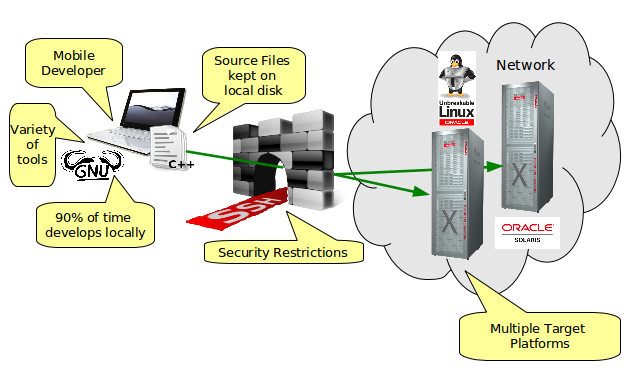

// 
//     Licensed to the Apache Software Foundation (ASF) under one
//     or more contributor license agreements.  See the NOTICE file
//     distributed with this work for additional information
//     regarding copyright ownership.  The ASF licenses this file
//     to you under the Apache License, Version 2.0 (the
//     "License"); you may not use this file except in compliance
//     with the License.  You may obtain a copy of the License at
// 
//       http://www.apache.org/licenses/LICENSE-2.0
// 
//     Unless required by applicable law or agreed to in writing,
//     software distributed under the License is distributed on an
//     "AS IS" BASIS, WITHOUT WARRANTIES OR CONDITIONS OF ANY
//     KIND, either express or implied.  See the License for the
//     specific language governing permissions and limitations
//     under the License.
//

= Modes of C/C++ Remote Development in the IDE
:jbake-type: tutorial
:jbake-tags: tutorials 
:jbake-status: published
:icons: font
:syntax: true
:source-highlighter: pygments
:toc: left
:toc-title:
:description: Modes of C/C++ Remote Development in the IDE - Apache NetBeans
:keywords: Apache NetBeans, Tutorials, Modes of C/C++ Remote Development in the IDE

//March 2014 [Revision number: V8.0-1]

This article describes the remote development features available in the NetBeans IDE when you have the C/C++ module installed, and how to choose the best way to use them in your development environment.

== What Remote Development Is

Remote development is a feature of the NetBeans IDE that allows you to run the IDE on a computer running Microsoft Windows, Mac OS X, Oracle Solaris, or Linux; and build, run, and debug your program on another computer running Oracle Solaris or Linux.

== When to Use Remote Development

You might want to use remote development if some of the following circumstances are true for you:

* Your desktop system is not running Oracle Solaris or Linux.

* You are running the IDE on a shared Solaris system that sometimes experiences high loads.

* Your access to systems running Oracle Solaris or Linux is limited to Secure Shell (SSH) for security reasons.

* Running graphical user interface tools in the Solaris environment is difficult.

* The software you are developing must compile and run on multiple platforms including Solaris or Linux.

== How Remote Development Works

The IDE provides features for managing remote hosts. You can configure a remote host to use for building, running, and debugging your C, C++, and Fortran projects. The remote host must meet the following conditions:

* The remote host operating system must be Oracle Solaris or Linux.

* The remote host must run the SSH daemon, `sshd`.

* At least one tool collection (GNU, Oracle Solaris Studio, or Sun Studio) must be accessible on the remote host.

* You must have a user account on the host.

You can manage your remote hosts in the Services window of the IDE.

image::images/services_window.png[]

Once you have configured the remote host and connected to it, you can build, run, and debug projects just as you do on your local system. Remote IDE commands are executed over SSH.

When you use a remote development host, the local and remote hosts both need to access the project files. This access can be accomplished through file sharing or securely copying the files. Before the IDE can use file sharing between the local and remote systems, the shared filesystem or folder must be set up and accessible to both systems. Remote files are accessed through SFTP or another file sharing mechanism available in the operating system the host is running (for example, Network File System (NFS), Samba, or WebDAV).

If file sharing is not possible, you can use Automatic Copying to copy the files to the server using SSH.

== Benefits of Remote Development

Remote development provides the following benefits:

* You can use the same development environment for all of your projects.

* The resources of your desktop system are better utilized.

* Network traffic is optimized.

* Your IDE response time is better.

* You can browse remote file systems from the IDE.

* You can open a terminal window in the IDE for a remote host.

* You can use it in SSH-only secure environments.

 image::images/modes_diagram.png[]

In simple mode, the source files reside primarily on your local host. When you build your project, the source files are delivered on demand to the remote host using SSH File Transfer Protocol (SFTP).

In mixed or shared mode, the source files reside in a location that is shared between the local host and remote host using NFS, Samba, WebDAV, or another file sharing system.

In full remote mode, the source files reside on the remote host. The IDE accesses the files using SFTP.

== Deciding Which Remote Development Mode to Use

Which development mode is best for your specific situation depends on the development environment in which you work. Each of the following sections describes an example of a development environment in which one development mode provides the most benefits.

=== Simple Mode

Simple mode might be the best remote mode for your needs if the following diagram describes your development environment.

In this environment, simple mode provides these benefits:

* You can use the same IDE for local and remote development.

* You can switch easily between hosts and platforms in the IDE.

* You can use the IDE in an SSH-only environment.

* Your mobility is improved.

=== Mixed (Shared) Mode

Mixed or shared mode might be a good choice if your development environment resembles the one shown in the following diagram.

image::images/mixed_mode_diagram.png[]

The benefits of using mixed mode in this environment are:

* You can easily switch between hosts and platforms in the IDE.

* There is no duplication of files (caching) such as would occur in the other two modes.

* The network throughput will be as good as your file sharing mechanism (for example, NFS, Samba, or WebDAV) can provide.

=== Full Mode

Full mode might be the best mode for you if your development environment resembles the one shown in the following diagram.

image::images/full_mode_diagram.png[]

In this environment, the benefits of using full remote mode are:

* Migration from using X-window forwarding or VNC is virtually seamless.

* Your IDE response time improves.

* You are less dependent on the resources of the development host.

* A smaller load on the development host reduces the load on Oracle Solaris.

* You can create new remote projects from remote binary files.

== Selecting Your Remote Development Mode

The remote development mode that you use is determined by the way you configure a remote build host, but also by the way you access the project in the IDE.

For each mode, you must first configure a remote build host, as described in the xref:remotedev-tutorial.adoc[C/C{pp} Remote Development tutorial] and in the IDE help.

You can select simple mode or mixed mode for your remote host in the IDE using the Host Properties dialog box to specify how project files should be accessed when you use the host.

Open the Services window, expand the C/C++ Build Hosts node, right click a remote host, and select Properties.

image::images/host_properties_dialog.png[]

=== Simple mode

For simple mode, set Access project files via to Automatic copying.

You can right-click a project, select Set Build Host, and select the remote host that you have configured to access project files via automatic copying. Then you are using simple remote development mode. When you build the project, the project files will be copied automatically to your NetBeans user directory on the remote host.

=== Mixed mode

For mixed mode, set Access project files via to System level file sharing.

You can right-click a project, select Set Build Host, and select the remote host that you have configured to access project files via system level file sharing. Then you are using mixed remote development mode. When you build the project, the project files stay where they are because they can be accessed from the local host and the remote build host.

=== Full remote mode

To use full remote mode in the IDE, use the Remote Development tool bar described in the following section.

== Full Remote Development Using the Tool Bar

In full remote mode, you can use the IDE running on your local host to work on projects that are located on a remote host by using the remote development tool bar.

The tool bar is shown in the following figure.

image::images/RemoteToolbar.gif[] 

If you do not see the tool bar in the IDE, you can display it by choosing View > Toolbars > Remote.

You can use the remote tool bar to select a remote host you have already configured and work on projects and files on the remote host the same as if they were local.

Use the icons as described in the following table.

|===
|image:images/connected24.gif[]
 |

Connection status. Click the icon to connect to the server selected in the list next to the icon. If you are already connected, you can click this icon to disconnect from the server.

The icon indicates connection status by turning green when connected and red when not connected.

 

|image:images/newProject24.gif[]
 |

Create remote project. Click the icon to create a new project on the currently connected host.

By default, the project is created in your `~/NetBeansProjects` directory on the remote host.

 

|image:images/openProject24.gif[]
 |

Open remote project. Click the icon to open an existing project on the currently connected host.

You can browse to the project on the remote file system.

 

|
 |

Open remote file. Click the icon to open a file on the currently connected host.

You can browse to the file on the remote file system.

 
|===

== Caches and Security

To provide fast access to remote files, the IDE uses a disk cache on the local system. The cache is located in `_userdir_/var/cache/remote-files` where `_userdir_` is unique to the user and its location varies by the platform where you are running the IDE.

See a description of the `_userdir_` and locations for each platform at xref:../../../wiki/FaqWhatIsUserdir.adoc[FaqWhatIsUserdir].

When using remote development in simple and shared modes, only system headers will be accessed through the local cache so there is no security risk.

In full remote mode, although the files are located on the remote host, the project is parsed on the local computer. As the source files are accessed for parsing, they are cached on the local host in `_userdir_/var/cache/remote-files` and eventually all the source files are in the cache.

On mobile computers this might be considered a security risk. For increased security, the cache directory can be encrypted or can be deleted on a regular basis.

Caches that reside at ` ~/.netbeans/remote` on the remote host are created when you use simple mode and source files are copied automatically on demand from the local host to the remote host when you build the project. These files are as secure as any others on the server, so are not a security concern.

== For More Information

See the following locations for more information:

* The Help menu in the IDE provides access to extensive information about using the IDE.

* The xref:remotedev-tutorial.adoc[C/C{pp} Remote Development tutorial] tells how to do simple remote development step-by-step

* The xref:../cnd.adoc[C/C{pp} Learning Trail] provides several articles and tutorials for developing in C/C++ in the IDE.

xref:../../../community/mailing-lists.adoc[Send Us Your Feedback]

