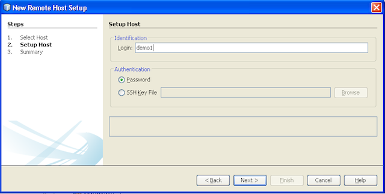
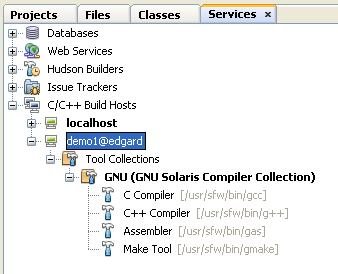
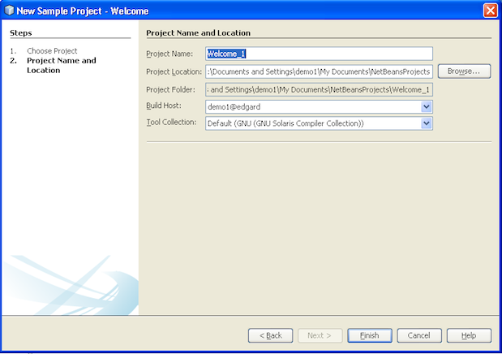
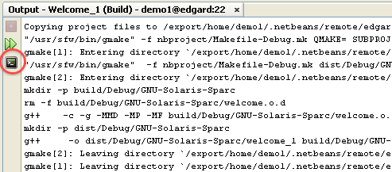
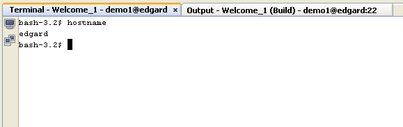
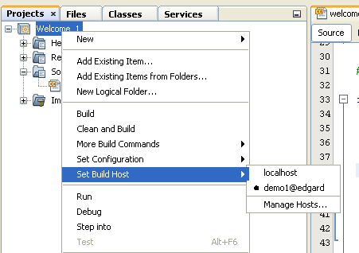

// 
//     Licensed to the Apache Software Foundation (ASF) under one
//     or more contributor license agreements.  See the NOTICE file
//     distributed with this work for additional information
//     regarding copyright ownership.  The ASF licenses this file
//     to you under the Apache License, Version 2.0 (the
//     "License"); you may not use this file except in compliance
//     with the License.  You may obtain a copy of the License at
// 
//       http://www.apache.org/licenses/LICENSE-2.0
// 
//     Unless required by applicable law or agreed to in writing,
//     software distributed under the License is distributed on an
//     "AS IS" BASIS, WITHOUT WARRANTIES OR CONDITIONS OF ANY
//     KIND, either express or implied.  See the License for the
//     specific language governing permissions and limitations
//     under the License.
//

= C/C++ Remote Development - NetBeans IDE Tutorial
:jbake-type: tutorial
:jbake-tags: tutorials 
:jbake-status: published
:icons: font
:syntax: true
:source-highlighter: pygments
:toc: left
:toc-title:
:description: C/C++ Remote Development - NetBeans IDE Tutorial - Apache NetBeans
:keywords: Apache NetBeans, Tutorials, C/C++ Remote Development - NetBeans IDE Tutorial
include::../../../inc/database.adoc[]

//March 2014 [Revision number: V8.0-1]

This document describes how to use remote development features of the NetBeans IDE with C/C++/Fortran projects.

== Requirements

*To follow this tutorial, you need the following software.*

|===
|Software |Version Required 

|NetBeans IDE (including C/C++ support) |xref:../../../download/index.adoc[version 7.3, 7.4, or 8.0 with NetBeans C/C{pp} plugin] 

|Java Development Kit (JDK) |link:{jdkdownload}[Version 7 or 8] 
|===

See the xref:../../../community/releases/80/install.adoc[NetBeans IDE Installation Instructions] and xref:../../../community/releases/80/cpp-setup-instructions.adoc[Configuring the NetBeans IDE for C/C{pp}/Fortran]
for information about downloading and installing the required software.

== Introduction

This tutorial demonstrates how to use remote development of C/C++ projects.

Have you ever wanted to develop a Solaris or Linux application from your laptop running Windows 7 or Mac OS X? To test your application on different operating systems without even leaving the IDE? Or just to compile your large applications on a fast multicore server rather than on your regular workstation. The answer to all these needs is the remote development feature in NetBeans IDE.

== Remote Development Concepts

When you do remote development, you run the NetBeans IDE on your client system and you can create projects, edit files, and use code assistance features the same way as you do for local projects. But when you build, run, or debug your project, the process runs on the remote Solaris or Linux server with output and input transferred to the client system. Ideally, you shouldn't see any difference in workflow between doing local and remote development once you've set up the remote build host.

The IDE supports different modes of remote development, which are described in xref:remote-modes.adoc[C/C{pp} Remote Development Modes]. You can determine how you want to develop on the remote host.

=== Requirements for Remote Development

The elements that must be in place to enable the use of a remote host for running your tools are:

* The local client system where the IDE is installed must be running Windows, Mac OS, Oracle Solaris 10, Oracle Solaris 11, or Linux.
* The remote host must be running Oracle Solaris 10, Oracle Solaris 11, or Linux.
* The local client system and remote system must have access to the project files, either through shared resources, or through use of Secure Shell protocol (SSH).
* The client must be able to connect to the remote system through a secure shell (ssh) even if the project files are on shared folders.
* The remote system must have access to a supported tool collection.
* The remote system must have the supporting system libraries that your project needs to enable code assistance.

=== Sharing sources

Both your client system and your remote server have to know about your source files. The source files can reside on a shared network path, or can be copied securely by the IDE from the local system to the remote system. See <<system,Setting Up the System>> for more details about how to set up shared folders for different systems.

=== Connectivity

All data transfer between client and server is done through the Secure Shell (SSH) protocol. SSH is a common protocol for secure communications between two networked devices. Your server must have the SSH server installed, and SSH connection between the client system and the server must be allowed.

=== Tool Collections

The IDE must be able to find a supported tool collection on the remote host: GNU Compiler Collection or Sun Studio or Oracle Solaris Studio. The tools executables should be on the path of the user account used to connect to the remote host, so the IDE can easily locate the tools. This is especially true if the tools are installed in a non-default location.

=== Code Assistance

For correct operation of editor features like code completion and semantic highlighting, the Classes window, and others, your project has to be used in the correct environment, which means system includes, macro definitions, platform, etc. All of this information is gathered from the remote server and stored locally on your client system, so that when you edit locally the code assistance will work even when the project is set up to use a remote build host.

[system]
== Setting Up the System

Your remote Linux or Solaris server must allow communication through the SSH protocol from the client where you are running the IDE. If you want to use file sharing instead of allowing the IDE to copy files to the remote server, the file sharing must be set up in the network for both systems.

=== SSH protocol

The SSH server is usually included in Linux and Solaris operating systems, and is run by default in most cases. If not, you can find information about installing and managing SSH at link:{wikipedia}Secure_Shell[Secure_Shell]

The IDE provides its own ssh client, so you do not need to install the ssh client on your local machine.

An SSH connection must be allowed between your client and server systems, which usually means port 22 must be open on the server. You may need root access or the help of your system administrator if port 22 is disabled.

SSH must be enabled between the systems even if you are not using the Automatic Copying or SFTP option to transfer the projects files to the remote server.

=== Sharing sources

If you do not already have file sharing set up between your Windows system and a Unix remote host for other uses, it is much simpler to use Automatic Copying or SFTP instead of file sharing for small to medium projects. If you are working on a large project with thousands of files that participate in the build, sharing makes more sense because copying would take a long time.

For Windows to UNIX® configuration there are two major ways of sharing sources:

* Samba server on UNIX system
* Windows Services for UNIX (SFU) package installed on Windows system

==== Organizing Sources Using Samba or SMB

A Samba server (open source version of SMB) allows a Windows user to map shared NFS folders as Windows network drives. The Samba package, or its equivalent SMB or CIFS, is included in most distributions of Linux and Solaris operating systems. If Samba is not included in your distribution, you can download it from link:http://www.samba.org/[www.samba.org].

If you have privileged access on your server, you can set up Samba yourself following the instructions at the following links. Otherwise you have to contact your system administrator.

* Oracle Solaris 11: link:https://blogs.oracle.com/paulie/entry/cifs_sharing_on_solaris_11[https://blogs.oracle.com/paulie/entry/cifs_sharing_on_solaris_11] for brief information. See link:http://docs.oracle.com/cd/E26502_01/html/E29004/smboverview.html[Managing SMB File Sharing and Windows Interoperability in Oracle Solaris 11.1] for full information.
* Oracle Solaris 10: link:http://blogs.oracle.com/timthomas/entry/enabling_and_configuring_samba_as[http://blogs.oracle.com/timthomas/entry/enabling_and_configuring_samba_as]
* Linux: link:http://www.linux.com/articles/58593[http://www.linux.com/articles/58593]

After starting Samba you can map your UNIX server's folders the same way as Windows folders.

==== Windows Services For UNIX (SFU)

Another option is Windows Services For UNIX, a set of utilities provided by Microsoft to access NFS filesystems from Windows. 
You can download them from link:http://www.microsoft.com/downloads/details.aspx?FamilyID=896c9688-601b-44f1-81a4-02878ff11778&displaylang=en[Microsoft Download Center] and read documentation at link:http://technet.microsoft.com/en-us/library/bb496506.aspx[Windows Services for Unix page].

The SFU package is not available for Windows Vista or Windows 7 users. Windows Vista and Windows 7 Enterprise and Ultimate Editions include the Services for Unix components, renamed to the Subsystem for UNIX-based applications (SUA), and Client for NFS v3. For more information, see link:{wikipedia}Microsoft_Windows_Services_for_UNIX#Subsystem_for_UNIX-based_Applications_.28SUA.29[Microsoft_Windows_Services_for_UNIX]

==== Mac OS X configuration

Mac OS X includes support for connecting to Samba servers. Mac OS X can also mount NFS shares from a server.

You can use Finder > Go > Connect to Server and enter a server address.

To connect to SMB/CIFS (Windows) servers and shared folders, enter the server address in one of these forms:

[source, bash]
----
smb://_DNSname/sharename_
smb://_IPaddress/sharename_
----

You are prompted to enter the username and password for the shared folder. See link:http://support.apple.com/kb/ht1568[How to Connect to Windows File Sharing (SMB)] in the Apple knowledge base for more information.

To connect to an NFS server, type the server name and path to the NFS shared folder in one of these forms:

[source,bash]
----
`nfs://_servername/path/to/share/_
nfs://_IPaddress/path/to/share_`
----

For more information, see link:http://support.apple.com/kb/TA22243[Using the Finder to Mount NFS Exports] in the Apple knowledge base.

You are not prompted for your username and password, but authorization is checked against your Mac UID. The UID is a unique integer assigned to your username in Unix-like operating systems such as Mac OS X, Solaris, and Linux. To use NFS, the Mac UID must be the same as the UID of your account on the server.

==== UNIX-UNIX configuration

For file sharing between Solaris or Linux systems, you do not need any special setup. You just need to share a folder from one of the systems or you can use your home directory if it is mounted on a network file server and accessible from both systems.

=== Path Mapping

When using the shared sources model, you may need to map the location of the sources on the local host, to the path used on the remote host to get to the sources.

For example, consider this configuration:

* Solaris server  ``solserver``  with shared folder  ``/export/pub`` 
* Workstation running Windows XP with installed SFU and path  ``\\solserver\export\pub``  is mounted as drive  ``P:`` 
* Project source files located on  ``solserver``  in the folder  ``/export/pub/myproject`` 

In this case from the server point of view your source files are located in the  ``/export/pub/myproject`` . But from the client point of view the location of the source files is  ``P:\myproject`` . You need to let the IDE know that these paths are mapped: 
 ``/export/pub -> P:\`` 

You can edit the properties of the build host to set path mappings.

If you set up shared resources for source files before configuring the remote host in NetBeans IDE, the IDE will automatically find out the required path mappings for you in most cases.

== Setting Up the IDE

In the following example, the client host is a workstation running Windows Vista. The remote host named  ``edgard``  is a server running the Oracle Solaris operating system.

1. Open the Services window by choosing Window > Services.
2. Right-click the C/C++ Build Hosts node and select Add New Host.

image::images/remotedev-add-host.png[]In the New Remote Host Setup dialog box, the IDE discovers your local network's hosts. The host names are added to a table in the dialog box, and a green indicator tells you if they are running the SSH server.

[start=3]
. Double-click the name of the server you want, or type the server name directly in the Hostname field. Click Next.

image::images/remotedev-setup-host.png[]

[start=4]
. On the Setup Host screen, type the username that you use to log in to the remote host, and select an authentication method. For this tutorial, select Password and click Next.

If you want to use ssh keys, you must set them up outside the IDE first. Then you can specify the location to the ssh keys in the IDE, and the IDE can use the keys to make the ssh connection to the remote build host.

[start=5]
. After a connection is made to the server, enter your password in the Authentication dialog box.

[start=6]
. Optionally, click Remember Password to have the IDE encrypt and store the password on your local disk so you do not have to enter it each time the IDE connects to the remote host.

The IDE configures the remote host and looks for tool collections on the remote host.

[start=7]
. When the host is successfully configured, a summary page shows information about the remote host: the platform, hostname, user name to log in, and the tool collections that were found.

image::images/remotedev-setup-host-summary.png[]

[start=8]
. At the bottom of the summary page, two more options are displayed. If more than one tool collection was found, you can select one of the collections to be the Default Tool Collection.

[start=9]
. For the Access project files via option:
* Select Automatic Copying if your client system and the remote build host do not have shared access to the project files. When you select Automatic Copying, the project files will be copied to your home directory on the server using the sftp command. This is known as simple remote development.
* Select System level file sharing if the client and server have access to the same folder. This is known as shared or mixed remote development.
* Select SFTP (on NetBeans 7.4 and 8.0 only) to use secure file transfer protocol to copy the project files to the remote host. Similar to Automatic Copying.

[start=10]
. Click Finish to complete the wizard.

[start=11]
. In the Services window, the new remote host is shown under the C/C++ Build Hosts node. Expand the node for the new host and you should have one or more tool collections in the Tool Collections list.

=== If no tool collection is listed

Try the following tasks if you do not see any tool collections under the remote host node.

* On the remote host, add the tool collection's bin directory to your user path on the host. If no tool collections are available on the remote host, you must install the GNU compiler collection or the Sun Studio or Oracle Solaris Studio software on the remote host.
* When the path to the tool executables is on your remote host user path, you can try to set up the tool collection on the local system again. Right-click the host in the Services window and select Restore Default Tool Collections to have the IDE try to find tool collections on the remote host again.
* Alternatively, right-click the host in the Services window and select Add Tool Collection to specify or browse to the path to a tool collection on the remote host.

When you have a tool collection listed, you are done with creating your new remote build host.

In the next section, you can try simple remote development.

== Building a Local Project on a Remote Host

1. Create a new sample project by choosing File > New Project.
2. Expand Samples > C/C++ and select Welcome. Click Next.

This example does not use shared folders, so you can keep the suggested location for the project in the NetBeansProjects folder in the Windows user directory, which is not shared.

If you want to use shared source files, make sure that the Project Location you specify is a path shared with the remote server.

[start=3]
. Select the new remote host for the Build Host. The Tool Collection list is updated to show the available tools on the remote host.

[start=4]
. Click Finish to create the project. 

The Welcome_1 project opens in the Projects window.

[start=5]
. Place your mouse cursor over the name of the project in the Projects window to see that a tooltip shows the project location and the remote host that it is configured to build on.

[start=6]
. Click the Build button on the toolbar or right-click the Welcome_1 project node and choose Build. The sample project will be built remotely on the selected build host.

[start=7]
. Open the source file  ``welcome.cc`` .

In the following screenshot you can see that code assistance is working when you press Ctrl-Space with the cursor on the  ``argc``  symbol to see.

The Output window displays the name of the host where the application was built and the remote compilers and make utility that were used for building. The project files are in the user's  ``.netbeans/remote/``  directory on the remote host.

image::images/remotedev-built-small.png[]

There is almost no difference in workflow once you set up a remote host. You can use all editor features, build, run, test, and debug as you are used to doing locally.

== Starting a Terminal Session on the Remote Host

You can start a secure shell terminal session from within the IDE to connect to the remote system or the local system. This feature is especially convenient on Windows platforms, which do not support SSH natively.

1. On the left margin of the Output window, click the terminal icon. 

The IDE opens a Terminal tab in the working directory of the current project, whether it is local or remote. If the project is using a remote build host and you are already connected through the IDE, you do not need to login again.

You can use the IDE internal terminal to do anything you might usually do in an SSH session to a remote host.

You can create new local or remote terminal sessions using the icons in the left margin of the Terminal tab, or using the menu option Window > Output > Terminal.

== Remote Development Tips

* You can switch the build host for a project by right-clicking the project node and selecting Set Build Host.

* You can change the properties of a remote build host after initial setup, by right-clicking the host in the Services window and selecting Properties.
* If you are using a remote host to build and run an application with a graphical UI, you can select Enable X11 Forwarding in the hosts properties to that the UI can be seen on your local system while it runs on the remote host.
* If building your project remotely compiles libraries or generates other files in addition to the main build product, the IDE prompts you to download the files to the local system. You can select which changed files to download.
* You can work on projects in full remote mode where the project and the tools are on the remote host. See the IDE's integrated help or the article xref:remote-modes.adoc[C/C{pp} Remote Development Modes] for more information.
* You can access the remote host and tools information from the IDE's Tools menu as well as the Services window. Select Tools > Options > C/C++ > Build Tools and click the Edit button next to the Build Host list.
* When using file sharing for project files, you can map the local and remote paths to the shared folder through the Path Mapping feature. You can set the mapping by doing one of the following:
* In the Services window, open C/C++ Build Hosts, right-click the hostname and select Path Mapper.
* From IDE's Tools menu, choose Options > C/C++ > Build Tools, click Edit button, select the remote host and click the Path Mapping button.

== For More Information

See the following locations for more information:

* The Help menu in the IDE provides access to extensive information about using the IDE.

* The xref:remote-modes.adoc[C/C{pp} Remote Development Modes article] describes different ways to use remote development

* The xref:../cnd.adoc[C/C{pp} Learning Trail] provides several articles and tutorials for developing in C/C++ in the IDE.

xref:../../../community/mailing-lists.adoc[Send Us Your Feedback]

