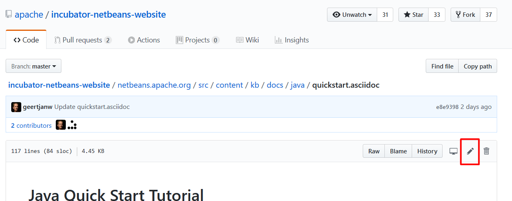

// 
//     Licensed to the Apache Software Foundation (ASF) under one
//     or more contributor license agreements.  See the NOTICE file
//     distributed with this work for additional information
//     regarding copyright ownership.  The ASF licenses this file
//     to you under the Apache License, Version 2.0 (the
//     "License"); you may not use this file except in compliance
//     with the License.  You may obtain a copy of the License at
// 
//       http://www.apache.org/licenses/LICENSE-2.0
// 
//     Unless required by applicable law or agreed to in writing,
//     software distributed under the License is distributed on an
//     "AS IS" BASIS, WITHOUT WARRANTIES OR CONDITIONS OF ANY
//     KIND, either express or implied.  See the License for the
//     specific language governing permissions and limitations
//     under the License.
//

= Tutorial Contribution Guidelines
:jbake-type: tutorial
:jbake-tags: tutorials
:jbake-status: published
:reviewed: 2020-11-22
:toc: left
:icons: font
:toc-title:
:description: Tutorial Contribution Guidelines
:experimental:

The Apache NetBeans Tutorials were included in the third donation from Oracle to the Apache Software Foundation. Many of these tutorials need to be reviewed. Everybody can help out in the review process. All you need is a web browser, a GitHub account and a basic knowledge of link:https://asciidoc.org/[AsciiDoc].

This page describes some tips, tricks and conventions for reviewing tutorials for Apache NetBeans.

== The NetBeans Web Site

The NetBeans website is written mainly in link:https://asciidoc.org/[AsciiDoc], a way of creating technical components using plain text files. 

We then generate HTML for the web using Groovy Server Page templates (these live in link:https://github.com/apache/netbeans-website/tree/master/netbeans.apache.org/src/content/templates[https://github.com/apache/netbeans-website/tree/master/netbeans.apache.org/src/content/templates] ). These templates (and some other stuff like SCSS) are responsible for the layout of the web pages. 

NOTE: The generated HTML is responsive, this is, it can be correctly visualized in mobile phones.

=== Direct editing in GitHub

All web pages can be edited directly in GitHub. To do so follow these instructions:

1. Click the "See this page in GitHub" link at the bottom of any page.

image::images/contributing-link.png[title="Click the 'See this page in GitHub' link to edit a page"]

1. You will then be redirected to GitHub. Once there click the "Edit this file" button.

If you don't have edit permissions you always can clone the link:https://github.com/apache/netbeans-website[website repository in GitHub] and edit the file in your own clone, and then submit that as a Pull Request against the main Apache NetBeans website repository.

You can also watch the following YouTube video for instructions:

video::0ovc902VWMQ[youtube, title="Contributing to Apache NetBeans Documentation"]

== AsciiDoc Conventions in Apache NetBeans

=== License Header

All `.asciidoc` pages must have a license header stating the Apache License and the Apache Software Foundation ownership. The Apache license header is included as an asciidoc comment, like so:

[source, asciidoc]
----
// 
//     Licensed to the Apache Software Foundation (ASF) under one
//     or more contributor license agreements.  See the NOTICE file
//     distributed with this work for additional information
//     regarding copyright ownership.  The ASF licenses this file
//     to you under the Apache License, Version 2.0 (the
//     "License"); you may not use this file except in compliance
//     with the License.  You may obtain a copy of the License at
// 
//       http://www.apache.org/licenses/LICENSE-2.0
// 
//     Unless required by applicable law or agreed to in writing,
//     software distributed under the License is distributed on an
//     "AS IS" BASIS, WITHOUT WARRANTIES OR CONDITIONS OF ANY
//     KIND, either express or implied.  See the License for the
//     specific language governing permissions and limitations
//     under the License.
//
----

=== The title

All tutorials must start with a "Level 0" title with a single equal sign. This will be the title of the page. You write a title like so:

[source, asciidoc]
----
= This is a title
----

It is an error if there is any content _before_ the level 0 title (but for comments). If you see any content above the title then please move it below the title (that's called the "AsciiDoc Preamble").

=== Metadata

Immediately after the level 0 title, we add the metadata of the page, all the "jbake-" entries are mandatory. Some others are commented below:

[source, asciidoc]
----
:jbake-type: tutorial
:jbake-tags: tutorials
:jbake-status: published
:reviewed: 2019-01-25
:syntax: true
:source-highlighter: pygments
:toc: left
:toc-title:
:icons: font
:description: NetBeans IDE Java Quick Start Tutorial - Apache NetBeans
:keywords: Apache NetBeans, Tutorials, NetBeans IDE Java Quick Start Tutorial
:experimental:
:backslash: &#92;
----

This is a small description of the metadata:

- `reviewed`: set this to the date the tutorial was reviewed, for instance, 2019-01-25.
- `jbake-type`: use `tutorial` for tutorial pages, `wiki` for wiki pages, `page` for simple pages.
- `jbake-tags`: use `tutorials` for tutorials, feel free to any tags of your liking (we should formalize this).
- `jbake-status`: always set it to `published`
- Set `syntax` to `true` if this page contains source code that should be syntax-highlighted. Please also add `source-highlighter` set to `pygments`.
- `toc` Set always to left.
- `toc-title` Leave empty.
- `icons` Set to `font` for adding support for FontAwesome icons.
- `description`: set to something that describes the page. This is used for Search Engine Optimisation (SEO).
- `keywords`: keywords describing the page. This is used for SEO.
- `experimental`: enables button, menu paths, keyboard short cut graphics

== The Content

Write the rest of the page using plain AsciiDoc. See the AsciiDoctor Writer's Guide for more information link:https://asciidoctor.org/docs/asciidoc-writers-guide/[https://asciidoctor.org/docs/asciidoc-writers-guide/]

You can structure the content using sections. Start each section with a level 1 header using two equal signs (subsections at level 2 and below just have more equal signs), like so:

[source, asciidoc]
----
== This is a section header

Some content here

=== This is a subsection

Some more stuff here
----

TIP: In general we should make the tutorials be less wordy, less long paragraphs.

== Special Constructs and Best Practices.

=== Inline screenshots and images

Images related to a webpage are usually included in a `images/` subdirectory close to the webpage.

Screenshots should be at least 640px wide?? (what's a good size for retina images?). PNG is preferred.

Images in a table should be inlined, i.e., using the `single colon` image construct, like so:

[source, asciidoc]
----
image:images/image.png[] 
----

=== Block images and screenshots

Block images are inserted using the `image:` AsciiDoc construct, this is, with two colons. These take a
paragraph of their own. Example:

[source, asciidoc]
----

image::images/image.png[title="This is the image caption"] 

----

NOTE: Note the two colons for block images, and a single colon for inlined (in the paragraph) images.

=== Clickable screenshots

Clickable screenshots are generated using a "[.feature]" tag above a paragraph that contains the image. This allows us to have a small image (the focuses on a part of the screenshot) that the user can click to see a larger image. The AsciiDoc construct for these is like so:

[source, asciidoc]
----

[.feature]
--

image::images/the-title-of-the-image-small.png[role="left", title="Click to enlarge", link="images/the-title-of-the-image-big.png"]

--
----

TIP: Be sure to add a newline before the `[.feature]` tag.

=== Youtube videos

Use the "video" asciidoc macro to embed youtube videos, like so:

[source, asciidoc]
----
video::the-youtube-video-identifier[youtube, title="The title"] 
----

where "the-youtube-video-identifier" is the id of the youtube video, for instance `O8cwpEY1OAQ` is the identifier for link:https://www.youtube.com/embed/O8cwpEY1OAQ[https://www.youtube.com/embed/O8cwpEY1OAQ]

=== Source code

Use the plain asciidoc construct for source code excerpts (that is, four slashes). Please set the "lang" attribute accordingly, for instance, for Java:

[source, asciidoc]
----
 [source,java]
 ----
 System.out.println("Hello, world");
 ----
----

Other languages are `html`, `xml`, `javascript`, `php`, `python`, `ruby`. Remember to use the `:syntax: true` attribute in the metadata so that syntax highlighting works.

=== Numbered lists

Numbered lists that have in-between paragraphs often restart numbering. So, for
instance, you have item 1, item 2, then a paragraph and then the next item
starts again at 1

Remember that you can tell asciidoc to start a numbered list on a certain number using the "start" tag, like so:

[source, asciidoc]
----
1. This is the first item
2. This is the second item

Now we have a paragraph here, or an image or whatever

. This is the third item
----

<1>: Note that since we have a `

=== Admonitions (notes, tips)

Use `NOTE:` and `TIP:` for admonitions. These must be in capital letters, without any asterisks around them:

[source, asciidoc]
----
NOTE: This is a note
----

If you use these admonitions be sure to add the

[source, asciidoc]
----
:icons: font
----

on the metadata of the page, so that admonitions have proper icons.

=== Icons

To use font awesome icons in your webpage include the `:icons: font` in the metadata of the page.

Then you can reference an icon using the name of the icon in the asciidoc icon macro, like so:

[source, asciidoc]
----
.icon:users[] 
----

for a list of icons see link:https://fontawesome.com/icons?d=gallery[https://fontawesome.com/icons?d=gallery]

=== Keyboard shortcuts

Keyboard short cuts can be displayed in a graphical way using the *kbd:[]* macro. +
To enable the use of keyboard shortcut graphics, include `:experimental:` in the metadata of the page.

[source, asciidoc]
----
:experimental:
----

_Example Asciidoc text_
----
kbd:[Ctrl+Shift+N] - Create a *New Project*
----

_Produces this result_ +
kbd:[Ctrl+Shift+N] - Create a *New Project*

There is a trick to using things like a backslash. A backslash must be followed by a preceding space.

_Notice the space between the backslash and the closing bracket_ +
----
kbd:[Ctrl+\ ]
----

_Produces this result_ 

kbd:[Ctrl+\ ]

=== New features

If you need to include a new feature in the page then 
please request it using our xref:../../community/mailing-lists.adoc[Dev Mailing List].

