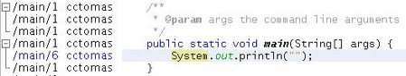
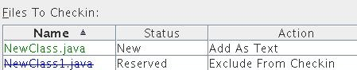
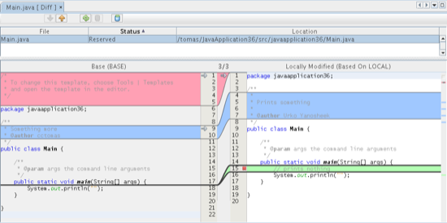
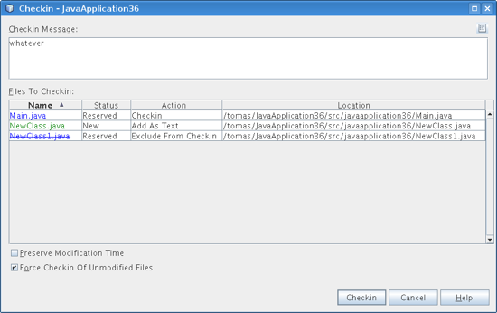

// 
//     Licensed to the Apache Software Foundation (ASF) under one
//     or more contributor license agreements.  See the NOTICE file
//     distributed with this work for additional information
//     regarding copyright ownership.  The ASF licenses this file
//     to you under the Apache License, Version 2.0 (the
//     "License"); you may not use this file except in compliance
//     with the License.  You may obtain a copy of the License at
// 
//       http://www.apache.org/licenses/LICENSE-2.0
// 
//     Unless required by applicable law or agreed to in writing,
//     software distributed under the License is distributed on an
//     "AS IS" BASIS, WITHOUT WARRANTIES OR CONDITIONS OF ANY
//     KIND, either express or implied.  See the License for the
//     specific language governing permissions and limitations
//     under the License.
//

= Использование поддержки ClearCase в IDE NetBeans
:jbake-type: tutorial
:jbake-tags: tutorials 
:jbake-status: published
:icons: font
:syntax: true
:source-highlighter: pygments
:toc: left
:toc-title:
:description: Использование поддержки ClearCase в IDE NetBeans - Apache NetBeans
:keywords: Apache NetBeans, Tutorials, Использование поддержки ClearCase в IDE NetBeans

Поддержка ClearCase в среде IDE рассчитана на помощь пользователю в выполнении задач контроля версий напрямую в проекте при работе в среде IDE.

Настоящий документ содержит пошаговое описание базовых шагов по использованию ClearCase в IDE NetBeans.

Rational ClearCase является программным средством контроля версий, разработанным корпорацией IBM. ClearCase формирует основу контроля версий для проектов на многих крупных и средних предприятиях.

image::images/netbeans-stamp-80-74-73.png[title="Содержимое этой страницы применимо к IDE NetBeans 6.9 и более поздним версиям"]

*Для работы с этим учебным курсом требуются программное обеспечение и ресурсы, перечисленные ниже.*

|===
|Программное обеспечение или материал |Требуемая версия 

|link:https://netbeans.org/downloads/index.html[+IDE NetBeans+] |версия 6.9 и более поздние 

|link:http://www.oracle.com/technetwork/java/javase/downloads/index.html[+Комплект для разработчика на языке Java (JDK)+] |версия 6, 7 или 8 

|Клиентское программное обеспечение ClearCase |Версия 7.0 и более поздние 

|Подключаемый модуль ClearCase для среды IDE NetBeans |Версия 0.9.х и более поздние 
|===

*Примечание. *Чтобы получить подключаемый модуль ClearCase NetBeans, перейдите в диспетчер подключаемых модулей в IDE ('Сервис' > 'Подключаемые модули' из главного меню) и установите подключаемый модуль, как показано ниже:

[.feature]
--

image::images/cc-plugin-small.png[role="left", link="images/cc-plugin.png"]

--

== Установка и настройка ClearCase

Перед тем, как пользоваться поддержкой ClearCase в среде IDE, необходимо установить и запустить на своем компьютере клиентское программное обеспечение ClearCase.

Поддержка ClearCase в среде IDE NetBeans работает как с представлениями _моментальных снимков_, так и с _динамическими_ представлениями. *Представления должны быть настроены за пределами IDE и подключение к серверу ClearCase должна быть правильно настроено.* Для доступа к файлам в представляениях снимков не требуется дополнительная настройка. Но если необходим доступ к файлам из динамического представления, это представление сперва необходимо инициализировать с помощью встроенных средств ClearCase, установленных на компьютере вместе с ним.

*Примечания:*

* Подключение к веб-интерфейсу ClearCase (CCWeb) в настоящий момент невозможно.
* Ограничение *nix-подобных систем состоит в том, что для получения доступа к своим файлам среду IDE необходимо запустить из контекста динамического представления.

Поддержка ClearCase в среде IDE работает посредством взаимодействия с клиентом  ``cleartool``  для выполнения команд управления версиями. В зависимости от системы и того, установлен ли клиент  ``cleartool``  в местоположении, отличающемся от местоположения по умолчанию, может быть необходимо зарегистрировать путь к исполняемому файлу  ``cleartool``  в среде IDE.

=== Указание пути к исполняемому файлу  ``cleartool`` 

IDE NetBeans автоматически выполняет попытку определить местоположение исполняемого файла  ``cleartool``  с помощью системной переменной  ``$PATH``  на компьютере пользователя. Но в зависимости от платформы и того, установлен ли клиент ClearCase в ином местоположении, может быть необходимо указать путь к исполняемому файлу напрямую. Чтобы установить путь к исполняемому файлу ClearCase в среде IDE, выполните следующие действия.

1. Выберите Tools ("Сервис") > Options ("Параметры") (NetBeans > Preferences ("Настройки") на Mac) из главного меню. Откроется диалоговое окно Options ("Параметры").
2. Выберите значок Miscellaneous ("Разное") наверху диалогового окна, затем щелкните вкладку Versioning ("Управление версии"). В левой панели, под Versioning Systems ("Системы управления версиями"), выберите ClearCase. Определенные пользователем параметры ClearCase отобразятся в основном окне диалога:

 [.feature]
--

image::images/cc-options-small.jpg[role="left", link="images/cc-options.jpg"]

--

[start=3]
. В текстовом поле Specify the  ``cleartool``  Executable Path ("Указать путь исполнения cleartool") введите путь к исполняемому файлу, либо нажмите кнопку Browse ("Обзор") для перехода к нему в дереве каталогов.

[start=4]
. Нажмите кнопку "ОК" и перезапустите среду IDE, чтобы изменения вступили в силу.

*Примечание. * Дополнительные сведения приведены в документе link:http://versioncontrol.netbeans.org/clearcase/install.html[+Настройка интеграции ClearCase в среде IDE NetBeans и заметки о выпуске+].

== Начало работы над файлами с контролем версий

При первом использовании ClearCase в среде IDE необходимо начать с открытия существующего проекта с контролем версий или создания нового проекта *внутри представления ClearCase* на компьютере.

* <<opening,Открытие существующего проекта в среде IDE>>
* <<addingSourceControl,Создание нового проекта и внесение его в систему контроля версий>>

=== Открытие существующего проекта в среде IDE

Если уже имеется проект ClearCase с контролем версий, над которым шла работа, его можно открыть в среде IDE, и функции контроля версий автоматически станут доступными. Среда IDE выполняет поиск по открытым проектам, и если они расположены в каталоге представления ClearCase, состояние файла и контекстная поддержка автоматически становятся доступными.

Чтобы открыть проект ClearCase с контролем версий, выполните следующие действия.

1. Выберите File ("Файл") > Open Project ("Открыть проект") из основного меню и пройдите через этапы работы мастера открытия проектов. При указании местоположения проекта перейдите к каталогу местоположения *внутри представления ClearCase*. По завершении работы мастера проект отобразится в окне проектов (Ctrl-1), и поддержка управления версиями станет активной.

*Примечание. *Также можно открыть проект или каталог в окне 'Избранное'. Это может быть необходимо, если каталог ClearCase не является проектом NetBeans. Для этого щелкните правой кнопкой мыши в окне 'Избранное' (Ctrl-3) и выбрав 'Добавить в Избранное'. В появившемся диалоговом окне добавления к избранному перейдите к каталогу представления ClearCase верхнего уровня на своем компьютере и нажмите кнопку Add ("Добавить"). К окну избранного будет добавлено представление каталога в виде дерева.

=== Создание нового проекта и постановка его под контроль версий

Как вариант, можно создать новый проект и поставить его под контроль версий ClearCase, после чего продолжить работу в среде IDE. При создании нового проекта необходимо указать его местоположение *внутри представления ClearCase*. Это позволяет среде IDE обнаружить, что требуется поддержка контроля версий. При создании проекта все файлы первоначально находятся в состоянии _для частного просмотра_). После этого можно добавить проект к серверу ClearCase, используя команду среды IDE Add to Source Control ("Добавить к управлению версиями").

Для создания нового проекта выполните следующие действия.

1. Выберите File ("Файл") > New Project ("Создать проект") из основного меню и пройдите через этапы работы мастера создания проектов.
2. На этапе 2, Name and Location ("Имя и местоположение"), выберите каталог в представлении ClearCase.
3. При нажатии кнопки Finish ("Готово") проект будет создан, и представление дерева его каталога будет добавлено к окну проектов (Ctrl-1). 
При создании проекта среда IDE автоматически распознает, что в представлении находится проект, и все соответствующие действия ClearCase, а также информация о состоянии файлов, становятся доступными.

При открытии проекта с контролем версий в среде IDE все имена файлов и папок показываются зеленым, что обозначает их состояние как вновь созданных. (Файлы, отображаемые серым, являются "игнорируемыми". Дополнительные сведения приведены ниже в разделе <<badges,Метки и условные цвета>>.) Среда IDE автоматически определяет для каждого файла проекта с контролем версий, является ли он кандидатом на постановку под контроль версий или нет (т. е. файлам исходного кода в пакетах обычно требуется контроль версий, тогда как закрытые файлы проекта обычно игнорируются).

Теперь проект создан, и его можно синхронизировать с сервером ClearCase, используя команду среды IDE Add to Source Control ("Добавить под контроль версий"):

1. Щелкните правой кнопкой мыши узел проекта в окне проектов и выберите Add to Source Control ("Добавить под контроль версий"). Откроется диалоговое окно добавления, в котором перечислены все новые файлы для частного просмотра, кроме игнорируемых средой IDE автоматически:

 [.feature]
--

image::images/add-dialog-small.jpg[role="left", link="images/add-dialog.jpg"]

--

[start=2]
. Введите сообщение в текстовую область Describing Message ("Сообщение с описанием"), В качестве альтернативы щелкните значок 'Последние сообщения' ( image:images/recent-msgs.png[] ), расположенный в правом верхнем углу, чтобы просмотреть и выбрать необходимое из ранее использованного списка сообщений.

[start=3]
. После указания действий для отдельных файлов нажмите кнопку Add ("Добавить"). При выполнении действия добавления отобразится строка состояния среды IDE, расположенная в нижнем правом углу интерфейса. После успешного добавления значки контроля версий исчезнут в окнах Projects ("Проекты"), Files ("Файлы") и Favorites ("Избранное"), и цвет возвращенных после изменения файлов изменится на черный.

*Примечание. *В диалоговом окне 'Добавить' можно указать, следует ли исключить отдельные файлы из действия 'Добавить'. Чтобы сделать это, щелкните столбец Action ("Действие") выбранного файла и выберите Do not Add ("Не добавлять") из раскрывающегося списка.

== Взятие файлов исходного кода для изменения

После того, как проект с управлением версиями ClearCase открыт в среде IDE, можно приступить к внесению изменений в файлы исходного кода. Для изменения файлов под управлением версиями ClearCase их сперва нужно взять для изменения или _захватить_. Поддержка ClearCase в среде IDE NetBeans предоставляет два способа сделать это:

* *Вручную*: просто щелкните правой кнопкой мыши узел файла и выберите ClearCase > 'Проверить' (или ClearCase > Hijack).
* *Использование функции взятия для изменения по требованию*: при каждом действии, которое требует от файла доступности для записи, среда IDE автоматически запускает соответствующую команду ClearCase (например изменение содержимого файла в редакторе в первый раз или выполнение команды реорганизации).

Функцию взятия для изменения по требованию можно настроить под свои требования, используя параметр On Demand checkout ("Взятие для изменения по требованию") в диалоговом окне <<ccOptions,Options ("Параметры") ClearCase>>.

== Изменение файлов исходного кода

Как и в случае с любым проектом в IDE NetBeans, пользователи могут открывать файлы в редакторе исходного кода двойным щелчком их узлов, как они отображаются в окнах IDE (например, Проекты (Ctrl-1), файлы (Ctrl-2), Избранное (Ctrl-3) Windows).

При работе с файлами исходного кода в среде IDE можно пользоваться различными компонентами пользовательского интерфейса, помогающими как в просмотре, так и в работе с командами контроля версий:

* <<viewingChanges,Просмотр изменений в редакторе исходного кода>>
* <<viewingFileStatus,Просмотр информации о состоянии файла>>
* <<comparing,Сравнение версий файлов>>

=== Просмотр изменений в редакторе исходного кода

Открыв файл под контролем версий в редакторе исходного кода среды IDE, можно просматривать изменения, происходящие с файлом, в реальном времени по мере внесения изменений в ранее взятую из хранилища для изменения версию. По ходу работы среда IDE использует условные цвета на полях редактора файлов исходного кода для передачи следующей информации:

|===
|*Синий* (       ) |Строки, измененные по сравнению с предыдущей версией. 

|*Зеленый* (       ) |Строки, добавленные к предыдущей версии. 

|*Красный* (       ) |Строки, удаленные из предыдущей версии. 
|===

В левом поле редактора исходного кода отображаются изменения для каждой отдельной строки. При изменении определенной строки изменения немедленно показываются в левом поле.

Щелкнув группировку по цвету на полях, можно отменить недавние изменения. Например, на приведенном ниже снимке экрана показаны элементы оформления, доступные, если щелкнуть красный значок, указывающий, что из взятого для изменения файла удалены строки.

На правом поле редактора исходного кода предоставлен обзор изменений, внесенных в файл в целом, сверху донизу. Условные цвета применяются сразу после внесения изменений в файл.

Обратите внимание, что можно щелкнуть определенную точку внутри поля, чтобы немедленно перенести курсор в строке к этому месту файла. Для просмотра числа затронутых строк наведите мышь на цветные значки в правом поле:

|===
|[.feature]
--

image::images/left-ui-small.png[role="left", link="images/left-ui.png"]

--
 
*Левое поле* |image:images/right-ui.png[title="Цветовая кодировка управления версиями отображается на правой границе редактора"] 
*Правое поле* 
|===

=== Просмотр информации о состоянии файла

При работе в окнах Projects ("Проекты") (Ctrl-1), Files ("Файлы") (Ctrl-2), Favorites ("Избранное") (Ctrl-3) или Versioning ("Управление версиями") среда IDE предоставляет несколько визуальных функций, помогающих в просмотре информации о состоянии файлов. В примере, приведенном ниже, обратите внимание, как метка (например, image:images/blue-badge.png[]), цвет имени файла и смежная метка состояния соответствуют друг другу для предоставления для пользователей простого и эффективного способа отслеживания данных об изменениях версий файлов:

image::images/badge-example.jpg[title="синяя метка управления версиями отображается в окне 'Избранное'"]

Метки, условные цвета, ярлыки состояния файлов и, что, пожалуй, наиболее важно, окно контроля версий вместе дают дополнительные возможности по просмотру и управлению сведениями о версиях в среде IDE.

* <<badges,Метки и условные цвета>>
* <<fileStatus,Ярлыки состояния файлов>>
* <<versioning,Окно управления версиями>>

==== Метки и условные цвета

Метки относятся к узлам проектов, папок и пакетов. Они сообщают о состоянии файлов внутри соответствующего узла:

Ниже в таблице приведена цветовая схема, используемая для меток.

|===
|Элемент пользовательского интерфейса |Описание 

|*Синяя метка* (image:images/blue-badge.png[]) |Указывает на присутствие файлов или папок, которые были взяты для изменения, захвачены или добавлены. Касательно пакетов, данная метка относится только к самому пакету, но не к его подпакетам. Что касается проектов и папок, метка указывает на изменения как внутри самого элемента, так и внутри любых его подпапок. 
|===

Условные цвета применяются к именам файлов, чтобы указать текущее состояние этих файлов:

|===
|Цвет |Пример |Описание 

|*Синий* |image:images/blue-text.png[] |Указывает, что файл взят для изменения. 

|*Зеленый* |image:images/green-text.png[] |Указывает, что файл новый и еще не добавлен под контроль версий. 

|*Серый* |image:images/gray-text.png[] |Указывает, что данный файл игнорируется ClearCase и не будет охвачен командами контроля версий (например, Add to Source Control ("Добавить под контроль версий") или Checkin ("Возврат после изменения")). Файлы можно сделать игнорируемыми, только если они еще не добавлены под контроль версий. 

|*Перечеркивание* |image:images/strike-through-text.png[] |Указывает, что файл не будет затронут операциями возврата после изменения или добавления под контроль версий. Перечеркнутый текст появляется только в определенных местах, таких как диалог возврата после изменения окна контроля версий и диалог добавления под контроль версий, где можно выбрать исключение из действия для отдельных файлов. Подобные файлы затрагиваются прочими командами ClearCase, такими как Update ("Обновление"). 
|===

==== Ярлыки состояния файлов

Ярлыки состояния файлов предоставляют в окнах среды IDE текстовое указание на состояние файлов, включенных в управление версиями. По умолчанию сведения о состоянии отображения среды IDE (новый, зарезервированный, незарезервированный, игнорируемый и т. д.) отображаются серым цветом справа от файлов, перечисленных в окнах. Однако этот формат можно изменить под свои потребности. Например, если к ярлыкам состояния необходимо добавить селекторы версий, сделайте следующее:

1. Выберите Tools ("Сервис") > Options ("Параметры") (NetBeans > Preferences ("Настройки") на Mac) из главного меню. Откроется окно "Options".
2. Выберите кнопку Miscellaneous ("Разное") наверху диалогового окна, затем щелкните вкладку Versioning ("Контроль версий") под ним. Убедитесь, что ClearCase выбран в Versioning Systems ("Системы управления версиями") на левой панели. (Для справки см. <<ccOptions,снимок экрана>> выше).
3. Нажмите кнопку Add Variable ("Добавить переменную") справа от текстового поля строки состояния Format ("Формат"). В отображаемом диалоговом окне Add Variable ("Добавить переменную") выберите переменную  ``{version}``  и нажмите кнопку "ОК". Переменная версии добавляется к текстовому полю Format ярлыка состояния.
4. Для изменения формата ярлыков состояния, чтобы справа от файлов отображались только состояние и селектор версий, измените содержимое текстового поля Status Label Format (формат ярлыка состояния) на следующее:

[source,java]
----

[{status}; {version}]
----
Нажмите кнопку "ОК". В ярлыках состояния теперь приводятся состояние файла и селектор версий (где он есть):

image::images/file-labels.jpg[title="метки файлов, отображаемые рядом с именами файлов"]

Ярлыки состояния файлов можно включать и отключать, выбирая View ("Представление") > Show Versioning Labels ("Показать ярлыки версий") из главного меню.

==== Окно контроля версий

Окно Versioning ("Контроль версий") ClearCase предоставляет обновляемый в реальном времени список всех изменений, внесенных в файлы внутри выбранной папки или локальной рабочей копии. По умолчанию оно открывается в нижней панели среды IDE, в нём отображаются новые, взятые для изменения и захваченные файлы.

Чтобы открыть окно контроля версий, выберите версию файла или каталога (например, из окна "Проекты", "Файлы" или "Избранное") и либо выберите "ClearCase" > "Показать изменения" из контекстного меню, либо "Управление версиями" > "Показать изменения" из главного меню. В нижней панели среды IDE откроется следующее окно:

[.feature]
--

image::images/versioning-window-small.jpg[role="left", link="images/versioning-window.jpg"]

--

По умолчанию в окне контроля версий отображается список всех файлов внутри выбранного пакета или папки, состояние которых заслуживает внимания (т. е. новый, зарезервированный, незарезервированный и т. д.). Щелкая заголовки столбцов над перечисленными файлами, эти файлы можно упорядочить по их именам, состоянию, местоположению или правилу.

На панель инструментов окна управления версиями имеются кнопки, позволяющие вызывать типичные задачи ClearCase для всех файлов, отображаемых в списке. В таблице ниже перечислены все команды ClearCase, доступные через панель инструментов окна Versioning.

|===
|Значок |Имя |Функция 

|image:images/refresh.png[] |*Refresh Status ("Обновить состояние")* |Обновление состояния всех выбранных файлов и папок. Файлы, отображаемые в окне контроля версий, можно обновить для отражения любых изменений, внесенных извне. 

|image:images/diff.png[] |*Diff All ("Сравнить все")* |Открывает окно Diff Viewer ("Просмотр различий"), позволяющее рассмотреть локально измененные версии параллельно с версиями, остающимися в хранилище. 

|image:images/update.png[] |*Update All ("Обновить все")* |Обновление всех выбранных файлов. (Применимо только к представлениям моментального снимка). 

|image:images/commit.png[] |*Сheckin All ("Вернуть все после изменения")* |Позволяет вернуть версию после локальных изменений. 
|===

Для доступа к другим командам ClearCase в окне контроля версий необходимо выбрать строку таблицы, соответствующую файлу, а затем выбрать команду в контекстом меню:

image::images/versioning-right-click.jpg[title="Контекстное меню отображается для выбранного файла в окне 'Управление версиями'"]

Для примера, с файлом можно выполнить следующие действия:

|===
|* *Показать аннотации*: 

Сведения об авторе и номере редакции в левом поле файлов, открытых в редакторе исходных файлов.
 |[.feature]
--

--
 

|* *Исключить из возврата*: 

Пометить файл, чтобы он был исключен при выполнении возврата после изменения.
 | 
|===

=== Сравнение версий файлов

Сравнение версий файлов – обычная задача при работе над проектами под контролем версий. Среда IDE позволяет сравнивать версии, используя команду Diff, доступную в контекстном меню выбранного элемента (ClearCase > Diff), а также в окне контроля версий. В окне 'Управление версиями', вы можете выполнить сравнение либо двойным щелчком указанного файла, либо щелкнув значок 'Сравнить все' (image:images/diff.png[]), расположенный на панели инструментов в верхней части.

При выполнении сравнения в главном окне среды IDE открывается графическое представление различий для выбранного(ых) файла(ов). Средство просмотра различий отображает две копии в расположенных рядом панелях:

[.feature]
--

--

В просмотре различий используются те же <<viewingChanges,условные цвета>>, что используются и в других местах для показа изменений под контролем версий. На показанном выше снимке экрана зеленый блок указывает содержимое, добавленное к более новой версии. Красный блок указывает содержимое предыдущей версии, которое удалено из последующей. Синий указывает, что в выделенных строках произошли изменения.

Также при выполнении сравнения в группе файлов, таких, как проект, пакет или папка, или при щелчке 'Сравнить все' (image:images/diff.png[]), вы можете переключаться между различиями с помощью щелчков файлов, перечисленных в верхней области 'Средства просмотра различий'.

Средство просмотра различий также предоставляет следующие функции:

* <<makeChanges,Внесение изменений в файлы, взятые для изменения>>
* <<navigateDifferences,Переходы между различиями>>

==== Внесение изменений в файлы, взятые для изменения

В случае выполнения сравнения файлов, взятых для изменения, изменения можно вносить напрямую из просмотра различий. Чтобы сделать это, поместите свой курсор внутри правой панели просмотра различий и измените свой файл соответственно, либо используйте значки, отображающиеся в строке рядом с каждым выделенным изменением:

|===
|*Заменить* (image:images/insert.png[]): |вставляет выделенный текст из предыдущих версий во взятую для изменения версию. 

|*Переместить все* (image:images/arrow.png[]): |возвращает взятую для изменения версию файла к состоянию выбранной предыдущей версии. 

|*Удалить * (image:images/remove.png[]): |удаляет выделенный текст из взятой для изменения версии, чтобы она отражала предыдущую версию. 
|===

==== Переходы между различиями в сравниваемых файлах

Если сравнение содержит несколько изменений, между ними можно переходить, используя значки стрелок, отображающиеся на панели инструментов. Значки стрелок позволяют просматривать появляющиеся различия сверху донизу:

|===
|*Предыдущий* (image:images/diff-prev.png[]): |переход к предыдущему различию, отображенному в сравнении. 

|*Далее* (image:images/diff-next.png[]): |переход к следующему различию, отображенному в сравнении. 
|===

== Возврат файлов исходного кода после изменения

После внесения изменений в файлы исходного кода мы возвращаем их в хранилище. Среда IDE позволяет вызвать команду возврата после изменения следующими способами:

* В окне 'Проекты', 'Файлы' или 'Избранное' правой кнопкой мыши щелкните новые или изъятые элементыи выберите 'ClearCase' > 'Проверить'.
* В окне 'Управление версиями' или 'Средства просмотра различий' нажмите кнопку 'Вернуть все после изменения' (image:images/commit.png[]) на панели инструментов.

Откроется диалоговое окно возврата после изменения, в котором выведены:

* все извлеченные файлы;
* все новые файлы, которые будут первыми автоматически добавлены под контроль версий (т. е., файлы для частного просмотра, которые пока не добавлены под контроль версий и не игнорируются средой IDE).

[.feature]
--

--

Из диалогового окна возврата после изменения можно указать, следует ли исключить отдельные файлы из числа возвращаемых. Чтобы сделать это, щелкните столбец Checkin Action ("Действие возврата после изменения") выбранного файла и выберите Exclude from Checkin ("Исключить из возврата") из раскрывающегося списка.

Для возврата после изменения выполните следующие действия.

1. Введите сообщение в текстовую область Checkin Message ("Сообщение возврата") В качестве альтернативы щелкните значок 'Последние сообщения' ( image:images/recent-msgs.png[] ), расположенный в правом верхнем углу, чтобы просмотреть и выбрать необходимое из ранее использованного списка сообщений.
2. После указания действий для отдельных файлов нажмите кнопку Checkin. Среда IDE выполнит возврат после изменения. При выполнении действия возврата отобразится строка состояния среды IDE, расположенная в нижнем правом углу интерфейса. После успешного возврата значки контроля версий исчезнут в окнах Projects ("Проекты"), Files ("Файлы") и Favorites ("Избранное"), и цвет возвращенных файлов вновь станет черным.
link:/about/contact_form.html?to=3&subject=Feedback:%20Using%20ClearCase%20Support%20in%20NetBeans%20IDE[+Отправить отзыв по этому учебному курсу+]

== Дополнительные сведения

На этом завершается обзор возможностей ClearCase для IDE NetBeans. В данном документе показано, как решать основные задачи контроля версий в среде IDE, путем демонстрации стандартной рабочей последовательности действий при использования поддержки ClearCase в среде IDE.

Материалы на связанные темы:

* link:http://wiki.netbeans.org/NetBeansUserFAQ#ClearCase[+Часто задаваемые вопросы по поддержке ClearCase для IDE NetBeans+]
* link:git.html[+Использование поддержки Git в IDE NetBeans+]
* link:mercurial.html[+Использование поддержки Mercurial в IDE NetBeans+]
* link:subversion.html[+Использование поддержки Subversion в IDE NetBeans+]
* link:cvs.html[+Использование поддержки CVS в IDE NetBeans+]
* link:mercurial-queues.html[+Использование поддержки Mercurial Queues в IDE NetBeans+]
* link:http://www.oracle.com/pls/topic/lookup?ctx=nb8000&id=NBDAG234[+Управление версиями приложений с помощью системы контроля версий+] в документе _Разработка приложений в IDE NetBeans_
