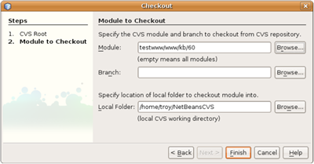
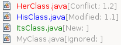
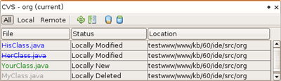
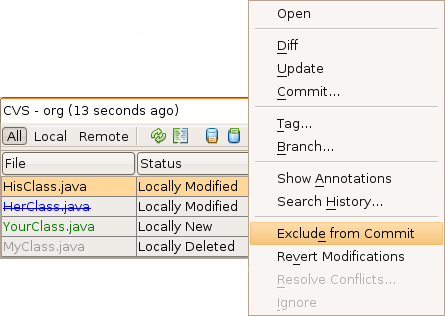
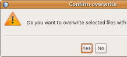
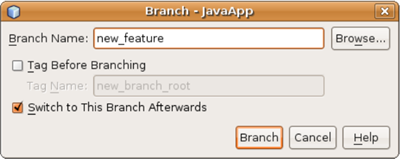
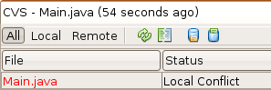

// 
//     Licensed to the Apache Software Foundation (ASF) under one
//     or more contributor license agreements.  See the NOTICE file
//     distributed with this work for additional information
//     regarding copyright ownership.  The ASF licenses this file
//     to you under the Apache License, Version 2.0 (the
//     "License"); you may not use this file except in compliance
//     with the License.  You may obtain a copy of the License at
// 
//       http://www.apache.org/licenses/LICENSE-2.0
// 
//     Unless required by applicable law or agreed to in writing,
//     software distributed under the License is distributed on an
//     "AS IS" BASIS, WITHOUT WARRANTIES OR CONDITIONS OF ANY
//     KIND, either express or implied.  See the License for the
//     specific language governing permissions and limitations
//     under the License.
//

= Using CVS Support in NetBeans IDE
:jbake-type: tutorial
:jbake-tags: tutorials 
:jbake-status: published
:syntax: true
:icons: font
:source-highlighter: pygments
:toc: left
:toc-title:
:description: Using CVS Support in NetBeans IDE - Apache NetBeans
:keywords: Apache NetBeans, Tutorials, Using CVS Support in NetBeans IDE

== Using CVS Support in NetBeans IDE

NetBeans IDE's CVS support is designed to help streamline the development process for groups working from a shared repository, enabling you to perform versioning tasks directly from your project system within the IDE. The CVS client software comes bundled with NetBeans IDE, and no special setup is necessary in order to begin using CVS.

This document demonstrates how to perform basic versioning tasks in the IDE by guiding you through the standard workflow when using versioning software.

CVS, or Concurrent Versions System, is an open-source version control system that keeps track of all work and changes in a set of files. This is typically used during the implementation of a software project, allowing multiple developers to collaborate. For more information about CVS, consult the link:http://ximbiot.com/cvs/[+official documentation+].

=== Synchronizing Local Files with a Repository

When using a version control system, you work by synchronizing local files with a repository, making changes to your local copy, then committing them to the repository. The following list describes various ways you can synchronize a project in NetBeans IDE, depending on your specific situation:

* <<opening,Opening a CVS Project in the IDE>>
* <<checking,Checking out Files from a Repository>>
* <<importing,Importing Files into a Repository>>

==== Opening a CVS Project in the IDE

If you already have a CVS versioned project which you have been working with outside of the IDE, you can open it in the IDE and versioning features will automatically become available to you. The IDE scans your open projects and if they contain `CVS` directories, file status and context-sensitive support automatically becomes active for CVS versioned projects.

==== Checking out Files from a Repository

If you want to connect to a remote repository from the IDE, then check out files and immediately begin working with them, do the following:

1. In NetBeans IDE, choose Team > CVS > Checkout from the main menu. The Checkout wizard opens. 

NOTE: The IDE's drop-down menus are context-sensitive, i.e., the available options depend on the item currently selected. Therefore, if you are already working within a CVS project, you can choose Versioning > Checkout from the main menu.

1. In the first panel of the wizard, enter the location of the repository as can be defined by `CVSROOT`: 

The IDE supports a number of `CVSROOT` formats, depending on whether the CVS repository is local or remote, and what method you are using to connect to it: 

|===
|Method |Description |Example 

|*pserver* |Remote password server |`:pserver:username@hostname:/repository_path` 

|*ext* |Access using Remote Shell (RSH) or Secure Shell (SSH) |`:ext:username@hostname:/repository_path` 

|*local* |Access to a local repository |`:local:/repository_path` 
[float-right]# (requires an external CVS executable)# 

|*fork* |Access to local repository using a remote protocol |`:fork:/repository_path` 
[float-right]# (requires an external CVS executable)# 
|===

Depending on the method you are using you may need to specify other information, such as a password and proxy settings for connecting to a remote repository (e.g. for `pserver`). Click Next. 

NOTE: If you are trying to set up public key SSH authentication, see: xref:../../../wiki/FaqHowToSetUpSSHAuth.adoc[+How to set up public key SSH authentication?+]. 

For more help with accessing local repositories, see: xref:../../../wiki/FaqHowToSetUpSSHAuthFaqHowToAccessLocalCVS.adoc[+How can I access local repositories?+]

1. In the Modules to Checkout panel of the wizard, specify the module that you want to check out in the Module field. If you do not know the name of the module you want to check out, click the Browse button to view the repository's contents. From the Browse CVS Module dialog that appears, select any of the listed modules and click OK. Your selection is then added to the Module field:

[.feature]
--

--

1. In the Branch text field, enter the name of the branch to checkout. You can click the Browse button to open the Browse Tags dialog box to search for available branches and tags. If you do not specify a branch or tag, the _trunk_ is checked out.
2. In the Local Folder field, enter a location on your computer where you want files to be checked out to, then click Finish to initiate the CVS check out. The IDE checks out the specified sources and the IDE's status bar displays in the lower right corner, indicating progress of the files downloading from the repository to your local directory. You can also view files as they are being checked out from the Output window (Ctrl-4). 

NOTE: If the checked out sources contain NetBeans projects, a dialog appears prompting you to open them in the IDE. If the sources do not contain a project, the dialog appears prompting you to create a new project from the sources and then open them in the IDE. If you create a new project for such sources, select the appropriate project category (i.e., in the New Project wizard) and then use the With Existing Sources option within that category.

==== Importing Files into a Repository

Alternately, you can import a project you have been working on in the IDE to a remote repository, then continue to work on it in the IDE after it has become versioned with the CVS repository.

*Note: *While you are actually _exporting_ files from your system, the term 'import' is used in version control systems to signify that files are being _imported into_ a repository.

To import a project to a repository:

1. From the Projects window (Ctrl-1), select an unversioned project and choose Versioning > Import into CVS Repository from the node's right-click menu. The CVS Import wizard opens.
2. In the CVS Root panel of the Import wizard, specify the location of the repository as defined by <<protocolTypes,`CVSROOT`>>. Depending on the method you are using you may need to specify other information, such as a password and proxy settings for connecting to a remote repository (e.g. for `pserver`). Click Next.
3. In the Folder to Import panel, specify the local folder you want to place in the repository. The name of your project is suggested for you in the Folder to Import text field by default:

[.feature]
--

image::images/folder-to-import-small.png[role="left", link="images/folder-to-import.png"]

--

1. In the Import Message text area, enter a description of the project you are importing into the repository.
2. Specify the location in the repository where you want to import the project by typing in the path in the Repository Folder text field. Alternatively, click the Browse button to navigate to a specific location in the repository. Click Finish to initiate the import. The IDE uploads the project files to the repository and the Output window opens to display the progress.

NOTE: The CVS client does not handle binary file imports by default. The best practice for importing binary sources is to create a `cvswrappers` file within the repository. See xref:../../../wiki/FaqCVSHowToImportBinaries.adoc[+How to Import Binary Files Correctly+] for more details.

=== Editing Sources

Once you have a CVS versioned project opened in the IDE, you can begin making changes to sources. As with any project opened in NetBeans IDE, you can open files in the Source Editor by double-clicking on their nodes, as they appear in the IDE's windows (e.g. Projects (Ctrl-1), Files (Ctrl-2), Favorites (Ctrl-3) windows).

When working with sources in the IDE, there are various UI components at your disposal, which aid in both viewing and operating version control commands:

* <<viewingChanges,Viewing Changes in the Source Editor>>
* <<viewingFileStatus,Viewing File Status Information>>
* <<comparing,Comparing File Revisions>>
* <<merging,Merging File Revisions>>

==== Viewing Changes in the Source Editor

When you open a versioned file in the IDE's Source Editor, you can view real-time changes occurring to your file as you modify it against your previously checked-out base version from the repository. As you work, the IDE uses color encoding in the Source Editor's margins to convey the following information:

|===
|*Blue* (       ) |Indicates lines that have been changed since the earlier revision. 

|*Green* (       ) |Indicates lines that have been added since the earlier revision. 

|*Red* (       ) |Indicates lines that have been removed since the earlier revision. 
|===

The Source Editor's left margin shows changes occurring on a line-by-line basis. When you modify a given line, changes are immediately shown in the left margin.

You can click on a color grouping in the margin to call versioning commands. For example, the screen capture below left shows widgets available to you when clicking a red icon, indicating that lines have been removed from your local copy.

The Source Editor's right margin provides you with an overview that displays changes made to your file as a whole, from top to bottom. Color encoding is generated immediately when you make changes to your file.

Note that you can click on a specific point within the margin to bring your inline cursor immediately to that location in the file. To view the number of lines affected, hover your mouse over the colored icons in the right margin:

|===
|[.feature]
--

image::images/left-ui-small.png[role="left", link="images/left-ui.png"]

--
 
*Left margin* |image:images/right-ui.png[title="versioning color encoding displayed in editor's right margin"] 
*Right margin* 
|===

==== Viewing File Status Information

When you are working in the Projects (Ctrl-1), Files (Ctrl-2), Favorites (Ctrl-3), or Versioning windows, the IDE provides several visual features that aid in viewing status information about your files. In the example below, notice how the badge (e.g. ), color of the file name, and adjacent status label, all coincide with each other to provide you with a simple but effective way to keep track of versioning information on your files:

image::images/badge-example.png[]

Badges, color coding, file status labels, and perhaps most importantly, the Versioning window all contribute to your ability to effectively view and manage and versioning information in the IDE.

* <<badges,Badges and Color Coding>>
* <<fileStatus,File Status Labels>>
* <<versioning,The Versioning Window>>

===== Badges and Color Coding

Badges are applied to project, folder, and package nodes and inform you of the status of files contained within that node:

The following table displays the color scheme used for badges:

|===
|UI Component |Description 

|*Blue Badge* () |Indicates the presence of files that have been locally modified, added or deleted. For packages, this badge applies only to the package itself and not its subpackages. For projects or folders, the badge indicates changes within that item, or any of the contained subfolders. 

|*Red Badge* (image:images/red-badge.png[]) |Marks projects, folders or packages that contain _conflicting_ files (i.e., local versions that conflict with versions maintained in the repository). For packages, this badge applies only to the package itself and not its subpackages. For projects or folders, the badge indicates conflicts within that item, or any of the contained subfolders. 
|===

Color coding is applied to file names in order to indicate their current status against the repository:

|===
|Color |Example |Description 

|*Blue* |image:images/blue-text.png[] |Indicates that the file has been locally modified. 

|*Green* |image:images/green-text.png[] |Indicates that the file has been locally added. 

|*Red* |image:images/red-text.png[] |Indicates that the file contains conflicts between your local working copy and the repository's version. 

|*Gray* |image:images/gray-text.png[] |Indicates that the file is ignored by CVS and will not be included in versioning commands (e.g. Update and Commit). Files can only be made to be ignored if they have not yet been versioned. 

|*Strike-Through* | |Indicates that the file is excluded from commit operations. Strike-through text only appears in specific locations, such as the Versioning window or Commit dialog, when you choose to exclude individual files from a commit action. Such files are still affected by other CVS commands, such as Update. 
|===

===== File Status Labels

File status labels provide a textual indication of the status of versioned files in the IDE's windows. By default, the IDE displays status (new, modified, ignored, etc.) and tag information in gray text to the right of files, as they are listed in windows. You can, however, modify this format to suit your own needs. For example, if you want to add revision numbers to status labels, do the following:

1. Choose Tools > Options (NetBeans > Preferences on Mac) from the main menu. The Options window opens.
2. Select the Miscellaneous button along the top of the window, then click the Versioning tab beneath it. Make sure CVS is selected beneath Versioning Systems in the left panel:

[.feature]
--

image::images/cvs-options-small.png[role="left", link="images/cvs-options.png"]

--

1. Click the Add Variable button to the right of the Status Label Format text field. In the Add Variable dialog that displays, select the `{revision}` variable, then click OK. The revision variable is added to the status label Format text field.
2. To reformat status labels so that only status and revision display to the right of files, rearrange the contents of the status label Format text field to the following:

[source,java]
----

[{status}; {revision}]
----
Click OK. Status labels now list file status and revision numbers (where applicable):

File status labels can be toggled on and off by choosing View > Show Versioning Labels from the main menu.

===== The Versioning Window

The CVS Versioning window provides you with a real-time list of all of the changes made to files within a selected folder of your local working copy. It opens by default in the bottom panel of the IDE, listing added, deleted or modified files.

To open the Versioning window, select a versioned file or folder (e.g. from the Projects, Files, or Favorites window) and either choose CVS > Show Changes from the right-click menu, or choose Versioning > Show Changes from the main menu. The following window appears in the bottom of the IDE:

[.feature]
--

--

By default, the Versioning window displays a list of all modified files within the selected package or folder. Using the buttons in the toolbar, you can choose to display all changes or limit the list of displayed files to either locally or remotely modified files. You can also click the column headings above the listed files to sort the files by name, status or location.

The Versioning window toolbar also includes buttons that enable you to invoke the most common CVS tasks on all files displayed in the list. The following table lists the CVS commands available in the toolbar of the Versioning window:

|===
|Icon |Name |Function 

|image:images/refresh.png[] |*Refresh Status* |Refreshes the status of the selected files and folders. Files displayed in the Versioning window can be refreshed to reflect any changes that may have been made externally. 

|image:images/diff.png[] |*Diff All* |Opens the Diff Viewer providing you with a side-by-side comparison of your local copies and the versions maintained in the repository. 

|image:images/update.png[] |*Update All* |Updates all selected files from the repository. 

|image:images/commit.png[] |*Commit All* |Enables you to commit local changes to the repository. 
|===

You can access other CVS commands in the Versioning window by selecting a table row that corresponds to a modified file, and choosing a command from the right-click menu:

For example, you can perform the following actions on a file:

|===
|* *Show Annotations*: 

Displays author and revision number information in the left margin of files opened in the Source Editor.
 |image:images/annotations.png[] 

|* *Search History*: 

Enables you to search for and compare multiple revisions of the selected file in the IDE's History Viewer. From the History Viewer you can also perform a <<comparing,diff>> or roll back your local copy to a selected revision.
 |[.feature]
--

image::images/history-viewer-small.png[role="left", link="images/history-viewer.png"]

--
 

|* *Exclude from Commit*: 

Allows you to mark the file to be excluded when performing a commit.
 |[.feature]
--

image::images/exclude-from-commit-small.png[role="left", link="images/exclude-from-commit.png"]

--
 

|* *Revert Modifications*: 

Opens the Confirm Overwrite dialog, enabling you to revert any actions that you have committed to files in your local working copy.
 |[.feature]
--

--
 
|===

==== Comparing File Revisions

Comparing file revisions is a common task when working with versioned projects. The IDE enables you to compare revisions by using the Diff command, which is available from the right-click menu of a selected item (CVS > Diff), as well as from the Versioning window. In the Versioning window, you can perform diffs by either double-clicking a listed file, otherwise you can click the Diff All icon (image:images/diff.png[]) located in the toolbar at the top.

When you perform a diff, a graphical Diff Viewer opens for the selected file(s) and revisions in the IDE's main window. The Diff Viewer displays two copies in side-by-side panels. The more current copy appears on the right side, so if you are comparing a repository revision against your working copy, the working copy displays in the right panel:

[.feature]
--

image::images/diff-viewer-small.png[role="left", link="images/diff-viewer.png"]

--

The Diff Viewer makes use of the same <<viewingChanges,color encoding>> used elsewhere to display version control changes. In the screen capture displayed above, the green block indicates content that has been added to the more current revision. The red block indicates that content from the earlier revision has been removed from the later. Blue indicates that changes have occurred within the highlighted line(s).

Also, when performing a diff on a group of files, such as on a project, package, or folder, or when clicking Diff All (image:images/diff.png[]), you can switch between diffs by clicking files listed in the upper region of the Diff Viewer.

The Diff Viewer also provides you with the following functionality:

* <<makeChanges,Make Changes to your Local Working Copy>>
* <<navigateDifferences,Navigate Among Differences>>
* <<changeViewCriteria,Change Viewing Criteria>>

===== Make Changes to your Local Working Copy

If you are performing a diff on your local working copy, the IDE enables you to make changes directly from within the Diff Viewer. To do so, you can either place your cursor within the right pane of the Diff Viewer and modify your file accordingly, otherwise make use of the inline icons that display adjacent to each highlighted change:

|===
|*Replace* (image:images/insert.png[]): |Inserts the highlighted text from the previous revision into the current revision 

|*Move All* (image:images/arrow.png[]): |Reverts the file's current revision to the state of the selected previous revision 

|*Remove* (image:images/remove.png[]): |Removes the highlighted text from the current revision so that it mirrors the previous revision 
|===

===== Navigate among Differences between Compared Files

If your diff contains multiple differences, you can navigate among them by using the arrow icons displayed in the toolbar. The arrow icons enable you to view differences as they appear from top to bottom:

|===
|*Previous* (image:images/diff-prev.png[]): |Goes to previous difference displayed in the diff 

|*Next* (image:images/diff-next.png[]): |Goes to next difference displayed in the diff 
|===

===== Change Viewing Criteria

You can choose whether to view files containing changes from the local working copy, the repository, as well as both simultaneously:

|===
|*Local* (  ): |Displays locally modified files only 

|*Remote* ( image:images/remotely-mod.png[] ): |Displays remotely modified files only 

|*Both* ( image:images/both-mod.png[] ): |Displays both locally and remotely modified files 
|===

==== Merging File Revisions

NetBeans IDE enables you to merge changes made on different branches of the repository with your local working copy. Using the CVS Merge dialog, you need only specify criteria indicating which repository sources you want merged with your working copy.

The following simple use-case demonstrates how you can apply the Merge dialog to merge a complete branch into the trunk's head:

|===
|*Use-case:* |There is a request to begin development of a new feature for the project, so a new branch is created from the current state of the project's trunk. After all necessary work is done and the code is stable enough in the branch, you integrate the new feature into the trunk. 
|===

1. Create new branch for the project by right-clicking the project node and choosing CVS > Branch. In the Branch dialog, enter `new_feature` as the Branch name, and make sure the Switch to this Branch Afterwards option is selected:

[.feature]
--

--

Click the Branch button. A new branch is created in the repository, and the IDE switches your target repository location to the new branch. In the Projects window, the new branch name displays in grey text next to versioned files, indicating that you are now working from the branch.

NOTE: Make sure your <<fileStatus,file status labels>> are activated (choose View > Show Versioning Labels from the main menu).

1. Edit files, add files, delete files. Commit all changes.
2. When the new feature is ready, switch back to the trunk. You must be working in the target branch (i.e., trunk in this case) when wanting to perform a merge between two branches. Right-click the project node and choose CVS > Switch to Branch. In the dialog that displays, select Switch to Trunk and click Switch. 

The IDE switches your target repository location to the trunk. In the Projects window, note that file status labels automatically update to reflect your new working location.

1. To perform the merge, right-click the project node and choose CVS > Merge Changes from Branch. In the dialog that displays, note that the Merge Changes Into Working Branch field contains `Trunk`, indicating your current working location. 

In the dialog, specify the following criteria:
* Leave the Starting From option set to Branch Point/Branch Root because you want to merge all changes since the branch's creation.
* For the Until option, select Branch Head and type in the name of the branch you want to merge into the trunk. You can also click Browse to search amongst existing branches in the repository.
* In the event that you want to tag revisions following the merge, select Tag Trunk after Merge and enter a tag name of your choosing.

[.feature]
--

image::images/cvs-merge-branches-small.png[role="left", link="images/cvs-merge-branches.png"]

--

Click Merge. The IDE incorporates the branch into the trunk. If any merge conflicts arise in the process, the project's status is updated to <<resolving,Merge Conflict>> to indicate this.

Note: After merging file changes from a branch to your local working directory, you must still commit changes using the Commit command in order to add them to the repository.

=== Committing Sources to a Repository

After making changes to sources, you commit them to the repository. It is generally a good idea to update any copies you have against the repository prior to performing a commit in order to ensure that conflicts do not arise. Conflicts can occur however, and should be thought of as a natural event when numerous developers are working on a project simultaneously. The IDE provides flexible support that enables you to perform all of these functions. It also provides a Conflict Resolver which allows you to safely deal with any conflicts as they occur.

* <<updating,Updating Local Copies>>
* <<resolving,Resolving Conflicts>>
* <<performing,Performing the Commit>>

==== Updating Local Copies

You can perform updates by choosing CVS > Update from the right-click menu of any versioned item in the Projects, Files, or Favorites windows. When working directly from the Versioning window, you need only right-click a listed file and choose Update.

To perform an update on sources that you have modified, you can click the Update All icon (image:images/update.png[]), which displays in the toolbars located at the top of both the <<versioning,Versioning Window>>, as well as the <<comparing,Diff Viewer>>. Any changes that may have occurred in the repository are displayed in the Versioning Output window.

==== Resolving Conflicts

When you perform an update or a commit, the IDE's CVS support compares your files with repository sources to make sure that other changes have not already occurred in the same locations. When your previous checkout (or update) no longer matches the repository _HEAD_ (i.e., most current revision), _and_ the changes that you applied to your local working copy coincide with areas in the HEAD that have also changed, your update or commit results in a _conflict_.

As indicated in <<badges,Badges and Color Coding>>, conflicts are displayed in the IDE with red text and are accompanied by a red badge (image:images/red-badge.png[]) when viewed in the Projects, Files, or Favorites windows. When working in the Versioning window, conflicts are also indicated by a file's status:

Any conflicts that arise must be resolved before you commit files to the repository. You can resolve conflicts in the IDE using the Merge Conflicts Resolver. The Merge Conflicts Resolver provides an intuitive interface that enables you to address individual conflicts sequentially while viewing merged output as you make changes. You can access the Merge Conflicts Resolver on a file that is in conflict by right-clicking that file and choosing CVS > Resolve Conflicts.

The Merge Conflicts Resolver displays the two conflicting revisions side-by-side in the top pane, with the conflicting areas highlighted. The lower pane depicts the file as it appears while merges for individual conflicts between the two revisions occur:

[.feature]
--

image::images/conflict-resolver-small.png[role="left", link="images/conflict-resolver.png"]

--

You resolve a conflict by accepting one of the two revisions displayed in the top pane. Click the Accept button of the revision you want to accept. The IDE merges the accepted revision with the source file, and you can immediately see the results of the merge in the bottom pane of the Merge Conflicts Resolver. Once all conflicts are resolved, click OK to exit the Merge Conflicts Resolver and save the modified file. The conflict badge is removed and you can now commit the modified file to the repository.

==== Performing the Commit

After editing source files, performing an update and resolving any conflicts, you commit files from your local working copy to the repository. The IDE enables you to call the commit command in the following ways:

* From the Projects, Files or Favorites windows, right-click new or modified items and choose CVS > Commit.
* From the Versioning window or Diff Viewer, click the Commit All (image:images/commit.png[]) button located in the toolbar.

The Commit dialog opens, displaying files that are about to be committed to the repository:

[.feature]
--

image::images/cvs-commit-dialog-small.png[role="left", link="images/cvs-commit-dialog.png"]

--

The Commit dialog lists:

* all locally modified files
* all files that have been deleted locally
* all new files (i.e., files that do not yet exist in the repository)
* all files that you have renamed. CVS handles renamed files by deleting the original file, and creating a duplicate using the new name.

From the Commit dialog, it is possible to specify whether to exclude individual files from the commit. To do so, click the Commit Action column of a selected file and choose Exclude from Commit from the drop-down list.

When new binary files are included, such as image files, they are automatically detected as binary files. You can specify the MIME type of a file by choosing Add as Binary or Add as Text from the drop-down list within the Commit Action column.

To perform the commit:

1. Type in a commit message in the Commit Message text area. Alternatively, click the Recent Messages ( image:images/recent-msgs.png[] ) icon located in the upper right corner to view and select from a list of messages that you have previously used.
2. After specifying actions for individual files, click Commit. The IDE executes the commit and sends your local changes to the repository. The IDE's status bar, located in the bottom right of the interface, displays as the commit action takes place. Upon a successful commit, versioning badges disappear in the Projects, Files and Favorites windows, and the color encoding of committed files returns to black.

xref:../../../community/mailing-lists.adoc[Send Us Your Feedback]

=== Conclusion

This concludes the Guided Tour of CVS for the NetBeans IDE. This document demonstrated how to perform basic versioning tasks in the IDE by guiding you through the standard workflow when using the IDE's CVS support. It has shown how to set up a versioned project and perform basic tasks on versioned files while introducing you to some of the new CVS features included in the IDE.
