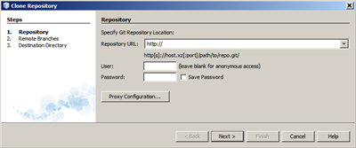
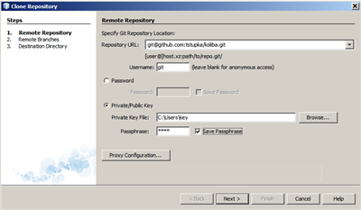
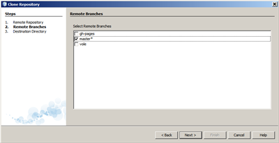
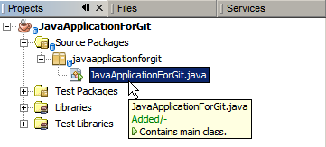
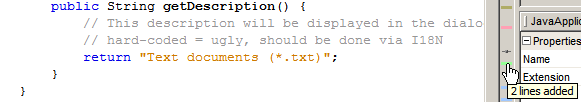
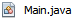
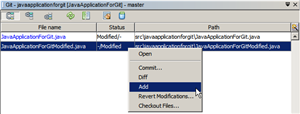
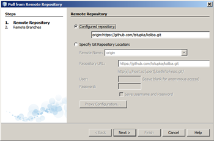

//
//     Licensed to the Apache Software Foundation (ASF) under one
//     or more contributor license agreements.  See the NOTICE file
//     distributed with this work for additional information
//     regarding copyright ownership.  The ASF licenses this file
//     to you under the Apache License, Version 2.0 (the
//     "License"); you may not use this file except in compliance
//     with the License.  You may obtain a copy of the License at
//
//       http://www.apache.org/licenses/LICENSE-2.0
//
//     Unless required by applicable law or agreed to in writing,
//     software distributed under the License is distributed on an
//     "AS IS" BASIS, WITHOUT WARRANTIES OR CONDITIONS OF ANY
//     KIND, either express or implied.  See the License for the
//     specific language governing permissions and limitations
//     under the License.
//

= Using Git in Apache NetBeans
:jbake-type: tutorial
:jbake-tags: tutorials
:jbake-status: published
:syntax: true
:icons: font
:source-highlighter: pygments
:toc: left
:toc-title:
:description: Using Git Support in NetBeans IDE - Apache NetBeans
:keywords: Apache NetBeans, Tutorials, Using Git Support in NetBeans IDE

The Apache NetBeans IDE provides support for the link:https://git-scm.com/[Git version control system]. The IDE's Git features let you perform versioning tasks directly from your projects and code within the IDE. This document demonstrates how to perform versioning tasks in the IDE by guiding you through the standard workflow when using Git.

Git is a free and open source, distributed version control system designed to handle everything from small to very large projects with speed and efficiency. Every Git clone is a full-fledged repository with complete history and full revision tracking capabilities, not dependent on network access or a central server. Branching and merging are fast and easy to do. Git is used for version control of files, much like tools such as Mercurial, Subversion, CVS, and Perforce.

== Initializing a Git Repository

To initialize a Git repository from existing files that are not in source control yet, you need to complete the following steps:

1. In the Projects window, select an unversioned project and right-click the project name.
2. In the context menu, choose  ``Versioning``  >  ``Initialize Git Repository``  (alternatively, in the main menu, choose  ``Team``  >  ``Git``  >  ``Initialize`` ).
[.feature]
--

image::images/initialize-git-repo-small.png[role="left", link="images/initialize-git-repo.png"]

--

1. Specify the path to the repository you are going to store your versioned files in the  ``Initialize a Git Repository ``  dialog box or click Browse and browse for the directory required.
2. Click OK.

A  ``.git``  subfolder is created in the folder you specified in step 3 above (your NetBeans project folder by default), which is your Git repository where all the data of your project snapshots are stored. Git starts versioning all files in the folder you specified.
You can open  ``Window``  >  ``Output``  >  ``Output``  to view the IDE's report about the progress of the repository creation under your local working directory.

image::images/output-init.png[]

All the project files are marked  ``Added``  in your Working Tree. To view a file <<viewFileStatus,status>>, place the cursor over the file name in the Projects window. The status of the file in the Working Tree displays in green to the right of the slash like shown in the following picture.

image::images/new-locally.png[]

After you initialized the Git repository, you either <<add,add>> files or directly <<committing,commit>> them to the Git repository.

== Cloning a Git Repository

To get a copy of an already existing Git repository, you need to clone it. Make sure you know the Git repository URL before starting the Clone Repository wizard in the IDE.

1. Choose  ``Team``  >  ``Git``  >  ``Clone``  from the main menu. The Clone Repository wizard displays.
[.feature]
--

--

1. At the Repository page, specify the path to a Git repository location, user name and password (you can save them for the future if required).
2. (Optional) Click Proxy Configuration to display the Options dialog box and set the proxy server settings. Click OK when finished.
3. Click Next to switch to the next step of the wizard.
4. At the Remote Branches page, select the repository branch(es) to be fetched (downloaded) to your local repository. Click Next.
5. At the Destination Directory page, specify the following:
* In the Parent Directory field, the path to the directory intended for the cloned repository on your hard drive (alternatively, click the Browse button and navigate to the directory).
The Parent Directory field is pre-filled with the path to the default  ``NetBeansProjects``  directory where all NetBeans projects are stored.
* In the Clone Name field, the name of the local folder where the original project will be cloned to.
By default Clone Name is filled out with the actual Git repository name.
* In the Checkout Branch field, select the branch to be checked out into the working tree.
* In the Remote Name field, the name that represents the original repository being cloned.
 ``origin``  is the default alias of the repository being cloned. It is a recommended value.
* Leave the Scan for NetBeans Projects after Clone checkbox selected to activate after-scanning right after the clone finishes. (The plugin searches for NetBeans projects in the cloned resources and offers to open the found projects.)

[start=1]
1. Click Finish.
After a Git repository is cloned, the metadata  ``.git``  folder is created inside the folder you selected in the wizard.

=== Cloning a Repository from GitHub via SSH protocol

To clone a repository from GitHub via the SSH protocol, proceed as follows:

NOTE: You need to have a GitHub account and be a project member in order to clone via SSH.

1. Choose  ``Team``  >  ``Git``  >  ``Clone``  from the main menu. The Clone Repository wizard displays.
2. At the Remote Repository page of the Clone Repository wizard, specify the path to the repository required in the Repository URL field, for example,  ``git@github.com:apache/netbeans.git`` .
3. Verify  ``git``  is specified in the Username text field.
4. Select the Private/public key option.
5. (*Skip if using SSH-agent or Pageant for automated SSH access to the Git server.*) Complete the following steps to access the Git server using your private SSH key and a passphrase:
* Specify the path to the key file, for example ``C:\Users\key``. The OpenSSH private key format is required. Keys generated by PuTTYgen for Microsoft Windows must be converted to the OpenSSH format before using them in the IDE.
* Enter the passphrase for the key file, for example,  ``abcd``.
* (Optional) Select the Save Passphrase option if required.

. (*Applies if using SSH-agent or Pageant for automated SSH access to the Git server.*) Leave the Private Key File and Passphrase fields empty to get authenticated access from the IDE to the Git server via correctly configured SSH-agent or Pageant.
. (Optional) Click Proxy Configuration to display the Options dialog box and set the proxy server settings. Click OK when finished.

[.feature]
--

--

. Click Next.
. At the Remote Branches page, select the repository branch(es) to be fetched (downloaded) to your local repository, for example  ``master`` .

[.feature]
--

--

. Click Next.
. At the Destination Directory page, specify the following:
* In the Parent Directory field, the path to the directory intended for the cloned repository on your hard drive (alternatively, click the Browse button and navigate to the directory).
The Parent Directory field is pre-filled with the path to the default  ``NetBeansProjects``  directory where all NetBeans projects are stored.
* In the Clone Name field, the name of the local folder where the original project will be cloned to.
By default Clone Name is filled out with the actual Git repository name.
* In the Checkout Branch field, select the branch to be checked out into the working tree.
* In the Remote Name field, the name that represents the original repository being cloned.
 ``origin``  is the default alias of the repository being cloned. It is a recommended value.
* Leave the Scan for NetBeans Projects after Clone checkbox selected to activate after-scanning right after the clone finishes. (The plugin searches for NetBeans projects in the cloned resources and offers to open the found projects.)

[.feature]
--

image::images/github-destination-small.png[role="left", link="images/github-destination.png"]

--

1. Click Finish.
After the repository is cloned, the Clone Completed message displays.

image::images/clone-completed.png[]

1. Choose the desired option.

=== Adding Files to a Git Repository

To start tracking a new file and also to stage changes to an already tracked file in the Git repository, you need to add it to the repository.

When adding files to a Git repository, the IDE composes and saves snapshots of your project first in the Index. After you perform the commit, the IDE saves those snapshots in the HEAD. The IDE allows you to choose between the two workflows described in the following table.

|===
|Workflow Description |Explicitly add new or modified files to the Index and then commit only those that are staged in the Index to the HEAD |Skip adding new or modified files to the Index and commit the required files directly to the HEAD

|Steps to Follow the Workflow  |

1. In the Projects window, right-click the file you want to add.

[start=2]
. In the context menu, choose  ``Git``  >  ``Add`` . This adds the file contents to the Index before you commit it.

[start=3]
. In the Projects window, right-click the file you want to commit.

[start=4]
. In the Commit dialog box, select the Changes between HEAD and Index (  ) toggle button. This displays the list of files that are already staged.

[start=5]
. Commit the file(s) as described in the <<committing,Committing Sources to a Repository>> section below.
 |

1. In the Projects window, right-click the file you want to commit.

[start=2]
. In the context menu, choose  ``Git``  >  ``Commit`` .

[start=3]
. In the Commit dialog box, select the Select the Changes between HEAD and Working Tree (image:images/changes-head-wt.png[]) toggle button. This displays the list of files that are not staged.

[start=4]
. Commit the file(s) as described in the <<committing,Committing Sources to a Repository>> section below.

|===

NOTE: The <<viewFileStatus,status>> of the file in the HEAD displays in green to the left of the slash like shown in the following picture.

The action works recursively if invoked on folders while respecting the NetBeans IDE flat folder content structure.

== Editing Files

Once you have a Git versioned project opened in the IDE, you can begin making changes to sources. As with any project opened in NetBeans IDE, you can open files in the Source Editor by double-clicking on their nodes, as they appear in the IDE's windows (e.g., Projects (Ctrl-1), Files (Ctrl-2), Favorites (Ctrl-3) windows).

When working with source files in the IDE, there are various UI components at your disposal, which aid in both viewing and operating version control commands:

* <<_viewing_changes_in_the_source_editor,Viewing Changes in the Source Editor>>
* <<_viewing_file_status_information,Viewing File Status Information>>
* <<_reverting_changes,Reverting Changes>>

=== Viewing Changes in the Source Editor

When you open a versioned file in the IDE's Source Editor, you can view real-time changes occurring to your file as you modify it against the base version from the Git repository. As you work, the IDE uses color coding in the Source Editor's margins to convey the following information:

*  *Blue.* Indicates lines that have been changed since the earlier revision.
*  *Green.* Indicates lines that have been added since the earlier revision.
*  *Red.* Indicates lines that have been removed since the earlier revision.

The Source Editor's left margin shows changes occurring on a line-by-line basis. When you modify a given line, changes are immediately shown in the left margin.

image::images/left-margin.png[]

NOTE: You can click on a color grouping in the margin to call versioning commands. For example, the picture below shows widgets available to you when clicking a red icon which indicates that lines have been removed from your local copy:

image::images/left-widgets.png[]

The Source Editor's right margin provides you with an overview that displays changes made to your file as a whole, from top to bottom. Color coding is generated immediately when you make changes to your file.

image::images/right-margin.png[]

*Note*: You can click on a specific point within the margin to bring your inline cursor immediately to that location in the file. To view the number of lines affected, hover your mouse over the colored icons in the right margin:

=== Viewing File Status Information

When you are working in the Projects (Ctrl-1), Files (Ctrl-2), Favorites (Ctrl-3), or Versioning views, the IDE provides several visual features that aid in viewing status information about your files. In the example below, notice how the badge (e.g. image:images/blue-badge.png[]), color of the file name, and adjacent status label, all coincide with each other to provide you with a simple but effective way to keep track of versioning information on your files:

image::images/file-status.png[]

Badges, color coding, file status labels, and perhaps most importantly, the Git Diff Viewer all contribute to your ability to effectively view and manage versioning information in the IDE.

* <<_badges_and_color_coding,Badges and Color Coding>>
* <<_file_status_labels,File Status Labels>>
* <<_git_versioning_view,Git Versioning View>>

==== Badges and Color Coding

Badges are applied to project, folder, and package nodes and inform you of the status of files contained within that node:

The following table displays the color scheme used for badges:

|===
|UI Component |Description

|*Blue Badge*
image:images/blue-badge.png[]
|Indicates the presence of files that have been modified, added or deleted in your working tree. For packages, this badge applies only to the package itself and not its subpackages. For projects or folders, the badge indicates changes within that item, or any of the contained subfolders.

|*Red Badge*
image:images/red-badge.png[]
|Marks projects, folders or packages that contain _conflicting_ files. For packages, this badge applies only to the package itself and not its subpackages. For projects or folders, the badge indicates conflicts within that item, or any of the contained subfolders.
|===

==== File Status Labels

Color coding is applied to file names in order to indicate their current status against the repository:

|===
|Color |Example |Description

|*No specific color (black)* |

|Indicates that the file has no changes.

|*Blue* |
image:images/blue-text.png[]
|Indicates that the file has been locally modified.

|*Green* |
image:images/green-text.png[]
|Indicates that the file has been locally added.

|*Red* |
image:images/red-text.png[]
|Indicates that the file is in a merge conflict.

|*Gray* |
image:images/gray-text.png[]
|Indicates that the file is ignored by Git and will not be included in versioning commands (e.g. Update and Commit). Files cannot be ignored if they are versioned.
|===

==== Git Versioning View

The Git Versioning view provides you with a real-time list of all of the changes made to files within a selected folder of your local working tree. It opens by default in the bottom panel of the IDE, listing added, deleted or modified files.

To open the Versioning view, select a versioned file or folder (e.g. from the Projects, Files, or Favorites window) and either choose  ``Git``  >  ``Show Changes``  from the right-click menu, or choose  ``Team``  >  ``Show Changes``  from the main menu. The following window appears in the bottom of the IDE:

[.feature]
--

image::images/versioning-view-small.png[role="left", link="images/versioning-view.png"]

--

By default, the Versioning view displays a list of all modified files within the selected package or folder in your Working Tree. Using the buttons in the toolbar, you can choose to display the list of files which have differences either between Index and HEAD, Working Tree and Index or Working Tree and HEAD. You can also click the column headings above the listed files to sort the files by name, status or location.

The Versioning view toolbar also includes buttons that enable you to invoke the most common Git tasks on all files displayed in the list. The following table lists the Git commands available in the toolbar of the Versioning view:

|===
|Icon |Name |Function

|
image:images/changes-head-wt.png[]
|*Changes between HEAD and Working Tree* |Displays a list of files that are either already staged or only modified/created and not staged yet.

|

|*Changes between HEAD and Index* |Displays a list of files that are staged.

|
image:images/changes-index-wt.png[]
|*Changes between Index and Working Tree* |Displays files that have differences between their staged and Working Tree states.

|
image:images/refresh.png[]
|*Refresh Statuses* |Refreshes the status of the selected files and folders. Files displayed in the Versioning view can be refreshed to reflect any changes that may have been made externally.

|
image:images/open-diff.png[]
|*Open Diff* |Opens the Diff Viewer providing you with a side-by-side comparison of your local copies and the versions maintained in the repository.

|
image:images/update.png[]
|*Revert Modifications* |Displays the <<revertdialog,Revert Modifications>> dialog box.

|
image:images/commit-button.png[]
|*Commit Changes* |Displays the <<commitdialog,Commit>> dialog box.
|===

You can access other Git commands in the Versioning view by selecting a table row that corresponds to a modified file, and choosing a command from the right-click menu:

[.feature]
--

--

=== Comparing File Revisions

Comparing file versions is a common task when working with versioned projects. The IDE enables you to compare revisions by using the Diff command:

NOTE: Several comparing modes - Diff To HEAD, Diff To Tracked, and Diff To - are available in the IDE.

1. Select a versioned file or folder (e.g. from the  ``Projects`` ,  ``Files`` , or  ``Favorites``  window).
2. Choose  ``Team``  >  ``Diff``  >  ``Diff to HEAD``  from the main menu.
A graphical Diff Viewer opens for the selected file(s) and revisions in the IDE's main window. The Diff Viewer displays two copies in side-by-side panels. The more current copy appears on the right side, so if you are comparing a repository revision against your working tree, the working tree displays in the right panel:

[.feature]
--

image::images/diff-viewer-small.png[role="left", link="images/diff-viewer.png"]

--

The Diff Viewer makes use of the same <<color-coding-table,color coding>> used elsewhere to display version control changes. In the screen capture displayed above, the green block indicates content that has been added to the more current revision. The red block indicates that content from the earlier revision has been removed from the later. Blue indicates that changes have occurred within the highlighted line(s).

NOTE: Other revisions can be selected from the  ``Diff``  and  ``to``  drop-down lists below the Diff Viewer toolbar.

The Diff Viewer toolbar also includes buttons that enable you to invoke the most common Git tasks on all files displayed in the list. The following table lists the Git commands available in the toolbar of the Diff Viewer:

|===
|Icon |Name |Function

|
image:images/changes-head-wt.png[]
|*Changes between HEAD and Working Tree* |Displays a list of files that are either already staged or only modified/created and not staged yet.

|

|*Changes between HEAD and Index* |Displays a list of files that are staged.

|
image:images/changes-index-wt.png[]
|*Changes between Index and Working Tree* |Displays files that have differences between their staged and working tree states.

|

|*Go to Next Difference* |Displays next difference in the file.

|
image:images/prevdiff.png[]
|*Go to Previous Difference* |Displays previous difference in the file.

|
image:images/refresh.png[]
|*Refresh Statuses* |Refreshes the status of the selected files and folders. Files displayed in the Versioning window can be refreshed to reflect any changes that may have been made externally.

|
image:images/update.png[]
|*Revert Modifications* |Displays the <<revertdialog,Revert Modifications>> dialog box.

|
image:images/commit-button.png[]
|*Commit Changes* |Displays the <<commitdialog,Commit>> dialog box.
|===

If you are performing a diff on your local copy in the Working Tree, the IDE enables you to make changes directly from within the Diff Viewer. To do so, you can either place your cursor within the right pane of the Diff Viewer and modify your file accordingly, otherwise make use of the inline icons that display adjacent to each highlighted change:

|===
|Icon |Name |Function

|
image:images/insert.png[]
|*Replace* |Inserts the highlighted text into your Working Tree copy.

|
image:images/arrow.png[]
|*Move All* |Reverts the whole local Working Tree copy.

|
image:images/remove.png[]
|*Remove* |Removes the highlighted text from the local Working Tree copy.
|===

=== Reverting Changes

To throw away local changes made to selected files in your Working Tree and replace those files with the ones in the Index or HEAD:

1. Select a versioned file or folder (e.g. from the  ``Projects`` ,  ``Files`` , or  ``Favorites``  window).
2. Choose  ``Team``  >  ``Revert Modifications``  from the main menu.
The  ``Revert Modifications``  dialog box displays.

image::images/revert.png[]

1. Specify additional options (e.g.,  ``Revert only Uncommitted Changes in Index to HEAD`` ) .
2. Click Revert.

The IDE replaces the selected files with those specified in <<three,step 3>> above.

== Committing Sources to a Repository

To commit files to the Git repository:

1. In the  ``Projects``  window, right-click the file(s) you want to commit.
2. In the context menu, choose  ``Git``  >  ``Commit`` .

The  ``Commit``  dialog box displays.

[.feature]
--

image::images/commit-small.png[role="left", link="images/commit.png"]

--

The  ``Commit``  dialog box contains the following components:

*  ``Commit Message``  text area intended for describing the change being committed
*  ``Author``  and  ``Commiter``  drop-down lists that allow to differentiate between those who made the change and who physically committed the file if necessary.
*  ``Files to Commit``  section that lists:
* all files modified,
* all files that have been deleted in the Working Tree (locally),
* all new files (i.e. files that do not yet exist in the Git repository),
* all files that you have renamed.

Two toggle buttons that switch the mode in which the actual commit is to be performed are available here:

|===
|UI Component |Name |Description

|
|*Changes between HEAD and Index* |Displays a list of files that are staged.

|image:images/changes-head-wt.png[]
|*Changes between HEAD and Working Tree* |Displays a list of files that are either already staged or only modified/created and not staged yet.
|===

*Note*: To specify here whether to exclude individual files from the commit, either deselect the checkbox in the first column called  ``Commit``  or right-click a file row in the  ``Commit Action``  column and choose  ``Exclude from commit``  from the pop-up menu. To display the Diff Viewer here, right-click a file row in the  ``Commit Action``  column and choose  ``Diff``  from the pop-up menu.

*  ``Update Issue``  section intended for tracking issues related to the change being committed.

NOTE: You need to install the JIRA or Subversion plugin to start tracking issues in the IDE.

1. Type in a commit message in the  ``Commit Message``  text area. Alternatively, you can do any of the following:
* click the  ``Recent Messages``  ( image:images/recent-msgs.png[] ) icon located in the upper right corner to view and select from a list of messages that you have previously used,
* click the  ``Load Template``  (image:images/msg-template.png[]) icon located in the upper right corner to select a message template.

. After specifying actions for individual files, click  ``Commit`` .
The IDE executes the commit and stores your snapshots to the repository. The IDE's status bar, located in the bottom right of the interface, displays as the commit action takes place. Upon a successful commit, versioning badges disappear in the  ``Projects`` ,  ``Files``  and  ``Favorites``  windows, and the color coding of committed files returns to black.

== Working with Branches

The IDE's Git support enables you to maintain different versions of an entire code base using branches.

When working with branches in the IDE, the following actions are supported:

* <<_creating_a_branch,Creating>>
* <<_checking_out,Checking out>>
* <<_merging,Merging>>
* <<_deleting,Deleting>>

=== Creating a Branch

To create a local branch, if you want to work on a separate version of your file system for stabilization or experimentation purposes without disturbing the main trunk, complete the following steps:

1. In the Projects or Files window, choose a project or folder from the repository in which you want to create the branch.
2. In the main menu, choose Team > Branch/Tag > Create Branch.

NOTE: As an alternative right-click the versioned project or folder and choose Git > Branch/Tag > Create Branch in the popup menu.

The Create Branch dialog box displays.

[.feature]
--

image::images/create-branch-small.png[role="left", link="images/create-branch.png"]

--

1. In the Branch Name field, enter the name of the branch being created.
2. Type a specific revision of the selected item by entering a commit ID, existing branch, or tag name in the Revision field or press Select to view the list of revisions maintained in the repository.
3. (Optional) In the Select Revision dialog box, expand Branches and choose the branch required, specify the commit ID in the adjacent list, and press Select.
4. Review the Commit ID, Author, Message fields information specific to the revision being branched from and click Create.
The branch is added to the  ``Branches/Local``  folder of the Git repository.

[.feature]
--

image::images/branch-added-small.png[role="left", link="images/branch-added.png"]

--

=== Checking Out

If you need to edit files on a branch that already exists, you can check out the branch to copy the files to your Working Tree.

To check out a revision, perform the following:

1. Choose Team > Checkout > Checkout Revision from the main menu.
The Checkout Selected Revision dialog box displays.

[.feature]
--

image::images/chkout-rev-small.png[role="left", link="images/chkout-rev.png"]

--

1. Specify the revision required by entering a commit ID, existing branch, or tag name in the Revision field or press Select to view the list of revisions maintained in the repository.
2. Skip if you did not press Select in the previous step. In the Select Revision dialog box, expand Branches and choose the branch required, specify the commit ID in the adjacent list if required, and press Select.

NOTE: If the specified revision refers to a valid commit that is not marked with a branch name, your HEAD becomes detached and you are no longer on any branch.

1. Review the Commit ID, Author, Message fields information specific to the revision being checked out.
2. To create a new branch out of the checked out revision, choose the Checkout as New Branch option and enter the name in the Branch Name field.
3. Press Checkout to check out revision.
Files in the Working Tree and in the Index are updated to match the version in the specified revision.

NOTE: If you want to switch your files to a branch that already exists (e.g., to a commit that is not at the top of one of your branches), you can use the Team > Git > Branch > Switch To Branch command, specify the branch in the Switch to Selected Branch dialog box, check it out as a new branch (optionally), and press Switch.

The IDE supports context-sensitive checkout of the file(s), folder(s), or project(s) currently selected in the IDE. To check out some files (not a branch) from the Index, complete the following steps:

1. Choose Team > Checkout > Checkout Files from the main menu.
The Checkout Selected Paths dialog box displays.

[.feature]
--

image::images/chkout-path-small.png[role="left", link="images/chkout-path.png"]

--

1. Choose the Update Index with Entries from the Selected Revision option.
If selected, the Index is updated with the state in the selected revision prior to the checkout itself (i.e., the selected files both in the Working Tree and Index are updated).

. Specify the revision required by entering a commit ID, existing branch, or tag name in the Revision field or press Select to view the list of revisions maintained in the repository.
. Skip if you did not press Select in the previous step. In the Select Revision dialog box, expand Branches and choose the branch required, specify the revision number in the adjacent list if required, and press Select.
. Press Checkout to complete the checkout.

=== Merging

To port modifications from  a repository revision to the Working Tree, do as follows:

1. Choose Team > Branch/Tag > Merge Revision from the main menu.
The Merge Revision dialog box displays.

[.feature]
--

image::images/merge-small.png[role="left", link="images/merge.png"]

--

1. Specify the revision required by entering a commit ID, existing branch, or tag name in the Revision field or press Select to view the list of revisions maintained in the repository.
2. Skip if you did not press Select in the previous step. In the Select Revision dialog box, expand Branches and choose the branch required, specify the commit ID in the adjacent list if required, and press Select.
3. Press Merge.
A three-way merge between the current branch, your Working Tree contents, and the specified branch is done.

NOTE: If a merge conflict occurs, the conflicting file is marked with <<badges,a red badge>> to indicate this.

NOTE: After merging you must still <<committing,commit>> the changes in order for them to be added to the HEAD.

=== Deleting a Branch

To delete an unnecessary local branch, complete the following steps:

1. Choose Team > Repository Browser from the main menu.
2. In the Git Repository Browser, choose the branch to be deleted.

NOTE: The branch must be inactive, i.e. not currently checked out into the Working Tree.

1. Right-click the selected branch and choose Delete Branch from the popup menu.
2. In the Delete Branch dialog box, press OK to confirm the branch deletion.
The branch is removed from the local repository as well as the Git Repository Browser.

== Working with Remote Repositories

When you work with other developers you need to share your work, which involves fetching, pushing, and pulling data to and from remote repositories hosted on the Internet or network.

* <<fetcingh,Fetching>>
* <<pulling,Pulling>>
* <<pushing,Pushing>>

=== Fetching

Fetching gets the changes from the original remote repository that you do not have yet. It never changes any of your local branches. Fetching gets all the branches from remote repositories, which you can merge into your branch or just inspect at any time.

To fetch the updates, do as follows:

1. Choose Team > Remote > Fetch.
The Fetch from Remote Repository wizard displays.

[.feature]
--

image::images/fetch-small.png[role="left", link="images/fetch.png"]

--

1. At the Remote Repository page of the wizard, select either the Configured repository (to use the path to the repository configured earlier) or Specify Git Repository Location option (to define the path to a remote repository that has not been accessed yet, its name, login, password, and proxy configuration if required) and click Next.
2. At the Remote Branches page of the wizard, choose the branches to fetch changes from and click Finish.
A local copy of a remote branch is created. The selected branch are updated in the  ``Branches``  >  ``Remote``  directory in the Git Repository Browser.
Next the fetched updates can be merged into a local branch.

=== Pulling

When pulling some updates from a remote Git repository, the changes are fetched from it and merged into the current HEAD of your local repository.
To perform pulling, complete the following steps:

1. Choose Team > Remote > Pull.
The Pull from Remote Repository wizard displays.

[.feature]
--

--

1. At the Remote Repository page of the wizard, select either the Configured repository (to use the path to the repository configured earlier) or Specify Git Repository Location option (to define the path to a remote repository that has not been accessed yet, its name, and login and password if required) and click Next.
2. At the Remote Branches page of the wizard, choose the branches to be pulled changes from and click Finish.
Your local repository is synchronized with the origin repository.

=== Pushing

To contribute changes from your local Git repository into a public Git repository, perform the following steps:

NOTE: When you are going to push your commits into a repository and some other changes have been pushed in the meantime, you need to pull and merge those changes first.

1. Choose Team > Remote > Push.
The Push to Remote Repository wizard displays.

[.feature]
--

image::images/push-small.png[role="left", link="images/push.png"]

--

1. At the Remote Repository page of the wizard, select either the Configured repository (to use the path to the repository configured earlier) or Specify Git Repository Location option (to define the path to a remote repository that has not been accessed yet, its name, and login and password if required) and click Next.
2. At the Select Local Branches page, choose the branch(es) to push your edits to and click Next.
3. At the Update Local References page, choose the branch(es) to be updated in the Remotes directory of your local repository and click Finish.
The specified remote repository branch is updated with the latest state of your local branch.

== Summary

This tutorial showed how to perform basic versioning tasks in the IDE by guiding you through the standard workflow when using the IDE's Git support. It demonstrated how to set up a versioned project and perform basic tasks on versioned files while introducing you to some of the Git specific features included in the IDE.
