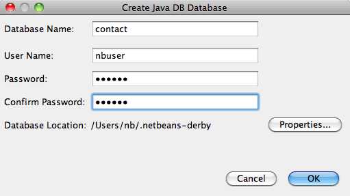
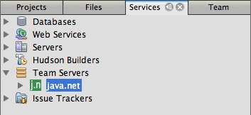
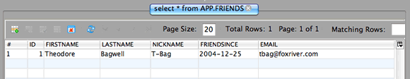

// 
//     Licensed to the Apache Software Foundation (ASF) under one
//     or more contributor license agreements.  See the NOTICE file
//     distributed with this work for additional information
//     regarding copyright ownership.  The ASF licenses this file
//     to you under the Apache License, Version 2.0 (the
//     "License"); you may not use this file except in compliance
//     with the License.  You may obtain a copy of the License at
// 
//       http://www.apache.org/licenses/LICENSE-2.0
// 
//     Unless required by applicable law or agreed to in writing,
//     software distributed under the License is distributed on an
//     "AS IS" BASIS, WITHOUT WARRANTIES OR CONDITIONS OF ANY
//     KIND, either express or implied.  See the License for the
//     specific language governing permissions and limitations
//     under the License.
//

= Trabalhando com o Banco de Dados Java DB (Derby)
:jbake-type: tutorial
:jbake-tags: tutorials 
:jbake-status: published
:icons: font
:syntax: true
:source-highlighter: pygments
:toc: left
:toc-title:
:description: Trabalhando com o Banco de Dados Java DB (Derby) - Apache NetBeans
:keywords: Apache NetBeans, Tutorials, Trabalhando com o Banco de Dados Java DB (Derby)

Este documento demonstra como configurar uma conexão com o banco de dados link:http://www.oracle.com/technetwork/java/javadb/overview/index.html[+Java DB+] no NetBeans IDE. Quando uma conexão for estabelecida, você poderá começar a trabalhar com o banco de dados no IDE, podendo criar tabelas, preenchê-las com dados, executar instruções SQL e consultas e mais.

O banco de dados Java DB é uma distribuição da Sun com suporte do link:http://db.apache.org/derby/[+Apache Derby+]. O Java DB é um servidor de banco de dados com base em padrões, seguro e totalmente transacional, escrito inteiramente em Java, e dá suporte total a SQL, JDBC API e à tecnologia Java EE. O banco de dados Java DB é encapsulado com o servidor de aplicações link:http://glassfish.dev.java.net/[+GlassFish+] e está incluído no link:http://download.oracle.com/javase/6/[+JDK 6+] também. Para obter mais informações sobre o banco de dados Java DB, consulte a link:http://www.oracle.com/technetwork/java/javadb/documentation/index.html[+documentação oficial+].

image::images/netbeans-stamp-80-74-73.png[title="O conteúdo desta página se aplica ao NetBeans IDE 7.2, 7.3, 7.4 e 8.0"]

NOTE: O Java DB é instalado quando o JDK 7 ou JDK 8 é instalado (com exceção do
Mac OS X). Se estiver usando Mac OS X é possível fazer o download e instalar o
link:http://www.oracle.com/technetwork/java/javadb/downloads/index.html[+Java DB+]
manualmente ou usar o Java DB que é instalado pela versão do Java EE do
instalador do NetBeans IDE.

== Configurando o Banco de Dados

Se você tem o GlassFish Server Enterprise registrado na instalação NetBeans IDE, o Java DB já estará registrado. Portanto, é possível pular para <<starting,Iniciando o Servidor e Criando um Banco de Dados>>.

Se fizer download do GlassFish Server separadamente e necessitar de ajuda ao registrar no NetBeans IDE, consulte *Registrando uma Instância do GlassFish Server* no Conteúdo de Ajuda IDE (F1).

Se você tiver submetido o Java DB a download, siga as etapas a seguir.

1. Execute o arquivo de autoextração. Uma pasta denominada 'javadb' será criada no mesmo local do arquivo. Se você tiver apenas submetido o Java DB a download e desejar que o servidor de banco de dados fique em um local diferente de onde ele foi extraído, deverá realocá-lo agora.
2. No sistema, crie um novo diretório para ser utilizado como diretório home para as instâncias individuais do servidor de banco de dados. Por exemplo, é possível criar esta pasta no diretório-raiz Java DB (javadb) ou em qualquer outra localização.

Antes de prosseguir, é importante compreender os componentes encontrados no diretório raiz do Java DB:

* O subdiretório  ``demo``  contém os programas de demonstração.
* O subdiretório  ``bin``  contém os scripts para executar utilitários e configurar o ambiente.
* O subdiretório  ``javadoc``  contém a documentação da API que foi gerada de comentários de código-fonte.
* O subdiretório  ``docs``  contém a documentação do Java DB.
* O subdiretório  ``lib``  contém os arquivos jar do Java DB.

== Registrando o Banco de Dados no NetBeans IDE

Agora que o banco de dados está configurado, execute as etapas a seguir para registrar o Java DB no IDE.

1. Na janela Serviços, clique com o botão direito do mouse no nó do Banco de Dados Java DB e escolha Propriedades para abrir a caixa de diálogo das Definições do Java DB.
2. No campo de texto Instalação de Java DB, insira o caminho para o diretório-raiz de Java DB (javadb) especificado na etapa anterior.
3. Para a Localização do Banco de Dados, use o local default se um local já foi fornecido. Clique em OK

Por exemplo, a localização default pode parecer com  ``C:\Documents and Settings\username\.netbeans-derby``  em um computador Windows.

image::images/javadb-props.png[title="exemplo de definições default do servidor e banco de dados Java DB"]

*Observação.* Se o campo Localização do Banco de Dados estiver vazio será necessário definir o caminho para o diretório que contém seus bancos de dados. Será necessário criar um diretório para os bancos de dados se nenhum diretório existir.

== Iniciando o Servidor e Criando um Banco de Dados

As opções de menu do Banco de Dados Java DB são exibidas quando você clica com o botão direito do mouse no nó Java DB na janela Serviços. Os itens desse menu contextual permitem o início e a interrupção do servidor de banco de dados, a criação de uma nova instância de banco de dados e o registro de servidores de bancos de dados no IDE (como demonstrado na etapa anterior). Para iniciar o servidor de banco de dados:

1. Na janela Serviços, clique com o botão direito do mouse no nó Java DB e escolha Iniciar Servidor. Observe a seguinte saída na janela de Saída, indicando que o servidor foi iniciado:

image::images/output-start-db.png[]

. Clique com o botão direito do mouse no nó do Java DB e escolha Criar Banco de Dados para abrir a caixa de diálogo de criação do Banco de Dados do Java DB.
. Insira  ``contato``  para o Nome do Banco de Dados.
. Digite  ``nbuser``  para o Nome de Usuário e a Senha. Clique em OK.

*Observação.* Localização do Banco de Dados é o local default definido durante a instalação do Java DB do GlassFish. Se você tiver instalado o Java DB separadamente, essa localização pode ser diferente.

Após você criar o Banco de Dados, se você expandir os bancos de dados nó na janela Serviços que você pode ver o IDE criada uma conexão de banco de dados e que o banco de dados foi adicionado à lista sob o nó do BD Java.

== Estabelecendo Conexão com o Banco de Dados

Até agora, você iniciou com êxito o servidor de banco de dados e criou uma instância de banco de dados denominada  ``contact``  no IDE. Na janela Serviços do IDE você pode realizar as seguintes tarefas comuns em estruturas de banco de dados.

* criação, exclusão, modificação de tabelas
* preenchimento de tabelas com dados
* exibição de dados tabulares
* execução de consultas e instruções SQL

Para começar a trabalhar com o banco de dados  ``contact`` , você precisa criar uma conexão com o mesmo. Para estabelecer conexão com o banco de dados  ``contato``  execute as etapas a seguir.

1. Expanda o nó do Bancos de Dados na janela Serviços e localize o novo banco de dados e os nós de conexão de banco de dados.

O nó de conexão do banco de dados( ) é exibido no nó dos Bancos de Dados. O nó do banco de dados é exibido no nó do Java DB.

*Observação.* Você também visualizará a conexão do banco de dados `amostra [app em app]` que é o esquema do banco de dados default.

. Clique com o botão direito do mouse no nó da conexão do banco de dados *contact*( ``jdbc:derby://localhost:1527/contact [nbuser em NBUSER]`` ) e escolha Conectar.

O ícone do nó da conexão aparecerá em todo (), significando que a conexão foi bem-sucedida.

. Crie um nome de exibição conveniente para o banco de dados clicando com o botão direito do mouse no nó da conexão do banco de dados ( ``jdbc:derby://localhost:1527/contact [nbuser on NBUSER]`` ) e selecione Renomear. Digite  ``BD de Contato``  no campo de texto e clique em Ok.

== Criando Tabelas

O banco de dados  ``contact``  recém-criado está vazio no momento. Ele não contém ainda tabelas ou dados. No NetBeans IDE, você pode adicionar uma tabela de banco de dados usando a caixa de diálogo Criar Tabela ou inserindo uma instrução SQL e executando-a diretamente do Editor SQL. É possível explorar ambos os métodos:

* <<createTable,Usando a Caixa de Diálogo Criar Tabela>>
* <<sqlEditor,Usando o Editor SQL>>

=== Usando a Caixa de Diálogo Criar Tabela

1. Expanda o nó de conexão  ``BD de Contato``  e observe que existem vários subnós do esquema. O esquema app é o único esquema que se aplica a este tutorial. Clique com o botão direito do mouse no nó APP e escolha Definir como Esquema Default.

[start=2]
. Expanda o nó APP e observe que existem três subpastas: Tabelas, Views e Procedimentos. Clique com o botão direito no nó Tabelas e escolha Criar Tabela para abrir a caixa de diálogo Criar Tabela.

[start=3]
. No campo de texto Nome da Tabela, digite  ``AMIGOS`` .

[start=4]
. Clique em Adicionar Coluna. A caixa de diálogo Adicionar Coluna é exibida.

[start=5]
. Para Nome de Coluna, insira  ``id`` . Para Tipo de Dados, selecione  ``INTEIRO``  da lista drop-down.

[start=6]
. Em Restrições, marque a caixa de seleção Chave Primária para especificar que essa coluna é a chave primária da tabela. Todas as tabelas de bancos de dados relacionais devem conter uma chave primária. Observe que quando você marca a caixa de seleção Chave Primária, as caixas de seleção Índice e Exclusivo são automaticamente marcadas e a caixa de seleção Nulo é desmarcada. Isso ocorre porque as chaves primárias são usadas para identificar uma linha exclusiva no banco de dados e por default são usadas como o índice da tabela. Como todas as linhas devem ser identificadas, as chaves primárias não podem conter um valor  ``Nulo`` .

image::images/add-column.png[]

. Repita este procedimento agora especificando campos conforme exibido na tabela abaixo:

|===

|Chave |Índice |Nulo |Exclusiva |Nome da coluna |Tipo de dados |Tamanho 

|[marcada] |[marcada] |[marcada] |id |INTEIRO |0 

|[marcada] |firstName |VARCHAR |20 

|[marcada] |lastName |VARCHAR |20 

|[marcada] |nickName |VARCHAR |30 

|[marcada] |friendSince |DATA |0 

|[marcada] |e-mail |VARCHAR |60 
|===

Você está criando uma tabela chamada  ``AMIGOS``  que contém os seguintes dados para cada registro de contato:

* *Nome*
* *Sobrenome*
* *Apelido*
* *Amigo Desde*
* *Endereço de E-mail*

image::images/create-table-friends.png[]

. Quando tiver certeza que a caixa de diálogo Criar Tabela contém as mesmas especificações que as exibidas acima, clique em OK. O IDE gera a tabela  ``AMIGOS``  no banco de dados, e você pode ver um novo nó da tabela  ``AMIGOS``  () são exibidos no nó de Tabelas. Sob o nó da tabela as colunas (campos) são listadas, iniciando com a chave primária ().

image::images/friends-table.png[]

=== Usando o Editor SQL:

1. No janela Serviço, clique com o botão direito no nó de conexão  ``BD de Contato``  ou no nó Tabelas embaixo e escolha o Comando Executar. Uma tela em branco é aberta no Editor SQL na janela principal.
2. Insira a seguinte consulta no Editor SQL. Esta é uma definição da tabela COLEGAS que você irá criar:

[source,sql]
----

CREATE TABLE "COLLEAGUES" (
    "ID" INTEGER not null primary key,
    "FIRSTNAME" VARCHAR(30),
    "LASTNAME" VARCHAR(30),
    "TITLE" VARCHAR(10),
    "DEPARTMENT" VARCHAR(20),
    "EMAIL" VARCHAR(60)
);
----

NOTE: instruções e consultas formadas no Editor SQL faz parse em SQL. A linguagem SQL utiliza regras de sintaxe estritas com as quais você deve estar familiarizado ao trabalhar no editor do IDE. A sintaxe do SQL também pode diferir dependendo do sistema de gerenciamento de banco de dados. Consulte o link:http://www.oracle.com/technetwork/java/javadb/documentation/index.html[+Manual de Referência do JavaDB+] para obter instruções específicas.

. Clique no botão Executar SQL () na barra de tarefas na parte superior do editor (Ctrl-Shift-E) para executar a consulta. Na janela de Saída (Ctrl-4), uma mensagem é exibida indicando que uma instrução foi executada com êxito.

image::images/run-query.png[]

. Para verificar as alterações, clique com o botão direito no nó de conexão  ``BD de Contato ``  na janela Serviços e escolha Atualizar. Isso atualiza o componente UI de Runtime para o status atual do banco de dados especificado. Esta etapa é necessária ao executar consultas do Editor SQL no NetBeans IDE. Observe que o novo nó da tabela COLEGAS () é exibida agora em Tabelas na janela Serviços.

== Adicionando Dados na Tabela

Agora que você criou uma ou mais tabelas no banco de dados  ``contact`` , pode começar a preenchê-lo com dados. Existem várias maneiras que você pode adicionar registros em sua tabela.

* <<sqlstatement,Escreva uma instrução SQL>> no Editor SQL que fornece um valor para cada campo presente no esquema da tabela.
* <<usesqleditor,Utilize o Editor SQL>> para adicionar registros à tabela.
* <<using,Utilize um script SQL externo>> para importar registros para a tabela.

Leia as seções abaixo para aprender como utilizar todos os métodos de preenchimento da tabela  ``AMIGOS``  com dados.

=== Executando uma Instrução SQL

1. Expanda as Tabelas no nó do  ``BD de Contato``  na janela Serviços, clique com o botão direito na tabela  ``AMIGOS``  e escolha executar comando para abrir a janela do Editor SQL.
2. No Editor SQL, insira a seguinte instrução.

[source,sql]
----

INSERT INTO APP.FRIENDS VALUES (1,'Theodore','Bagwell','T-Bag','2004-12-25','tbag@foxriver.com')
----

Enquanto estiver digitando, é possível utilizar a funcionalidade autocompletar código do Editor SQL.

. Clique com o botão direito do mouse no Editor SQL e escolha Executar Instrução. A janela de Saída exibe uma mensagem indicando que uma instrução foi executada com êxito.
. Para verificar se o novo registro foi adicionado à tabela  ``AMIGOS`` , clique com o botão direito do mouse no nó da tabela  ``AMIGOS``  na janela Serviços e escolha Exibir Dados.

Quando você escolhe Exibir Dados, é gerada automaticamente no painel superior do Editor SQL uma consulta para selecionar todos os dados da tabela. Os resultados da instrução são exibidos no painel inferior do Editor de SQL. Nesse caso, a tabela  ``AMIGOS``  é exibida no painel inferior. Observe que uma nova linha foi adicionada com os dados que você acabou de fornecer da instrução SQL.

=== Usando o Editor SQL

1. Clique com o botão direito no nó da tabela  ``AMIGOS``  e escolha Exibir Dados (se não tiver feito isso na última etapa da seção anterior).
2. Clique no botão Inserir Registro(s) ( ``Alt-I`` ) para adicionar uma linha.
A caixa de diálogo Inserir Registros aparece.

[start=3]
. Clique em cada célula e insira registros. Observe que para células com tipo de dados Data, é possível escolher uma data do calendário. Clique em OK quando tiver acabado. 

image::images/insert-records.png[]

No Editor SQL, é possível ordenar os resultados clicando na linha de cabeçalho, modifique e delete registros existentes e veja o script SQL para ações que estão sendo feitas no editor (o comando Exibir Script SQL do menu pop-up).

==  Deletando Tabelas

Na etapa a seguir, use um script SQL externo para criar uma nova tabela  ``COLEGAS`` . Entretanto, uma tabela  ``COLEGAS``  acabou de ser criada na seção <<sqlEditor,Utilizando o Editor SQL>> acima. Para deixar claro que o script SQL realmente cria uma nova tabela, você pode deletar a tabela  ``COLEGAS``  já criada agora. Para deletar uma tabela do banco de dados execute as seguintes etapas.

1. Expanda o nó Tabelas no nó de conexão do banco de dados na janela Serviços.
2. Clique com o botão direito do mouse na tabela que você deseja deletar e escolha Deletar.

== Usando um Script SQL Externo

A emissão de comandos de um script SQL externo é uma forma popular de gerenciar o banco de dados. É possível já ter sido criado um script SQL em outro lugar, e deseja importá-lo para o NetBeans IDE para executá-lo em um banco de dados específico.

Neste exercício, o script criará uma nova tabela denominada  ``COLEGAS``  e a preencherá com dados. Execute as seguintes etapas para executar o script no banco de dados  ``contato`` .

1. Faça download de link:https://netbeans.org/project_downloads/usersguide/colleagues.sql[+colleagues.sql+] em seu sistema local
2. Escolha Arquivo > Abrir Arquivo no menu principal do IDE. No browser de arquivos, vá até o local do arquivo  ``colleagues.sql``  salvo e clique em Abrir. O script se abre automaticamente no Editor SQL.

Se preferir, copie o conteúdo de link:https://netbeans.org/project_downloads/usersguide/colleagues.sql[+colleagues.sql+] e, depois abra o editor SQL e cole o conteúdo do arquivo no editor SQL.

. Certifique-se que sua conexão com  ``BD de Contato``  esteja selecionada na caixa drop-down Conexão na barra de ferramentas na parte superior do editor.

image::images/conn-drop-down.png[]

. Clique no botão Executar SQL () na barra de tarefas do Editor SQL. O script é executado no banco de dados selecionado e qualquer feedback é gerado na janela de Saída.
. Para verificar as alterações, clique com o botão direito no nó de conexão  ``BD de Contato ``  na janela Serviços e escolha Atualizar. Observe que a nova tabela  ``COLEGAS``  do script SQL agora é exibida como um nó de tabela em  ``contact``  na janela Serviços.
. Para exibir os dados contidos nas novas tabelas, clique com o botão direito na tabela  ``COLEGAS``  e escolha Exibir Dados. Dessa maneira, você também pode comparar os dados tabulares com os dados contidos no script SQL para ver se eles coincidem.

==  Recriando Tabelas de um Banco de Dados Diferente

Se você tiver uma tabela de outro banco de dados que deseja recriar no banco de dados em que está trabalhando do NetBeans IDE, o IDE oferece uma ferramenta útil para isso. É necessário primeiro registrar o segundo banco de dados no IDE, de forma similar à que foi descrita no início deste tutorial. Para a finalidade deste tutorial, use o banco de dados de  ``amostra``  incluído com o Java DB. Esse processo é realizado essencialmente em duas partes: primeiro você 'captura' a definição da tabela selecionada, depois pode recriar a tabela no banco de dados escolhido:

1. Estabeleça conexão com o banco de dados de  ``amostra``  clicando com o botão direito no nó de conexão nos Bancos de Dados na janela Serviços e escolhendo Conectar (o usuário e a senha é  ``app`` ).
2. Expanda o nó das Tabelas na conexão do banco de dados  ``amostra`` , clique com o botão direito do mouse na tabela  ``CLIENTE``  e escolha Obter Estrutura.

image::images/grab-structure.png[]

. Na caixa de diálogo Obter Tabela exibida, especifique um local no computador para salvar o arquivo obtido que será criado. Clique em Salvar.

O arquivo obtido registra a definição de tabela da tabela selecionada.

. Expanda o nó do esquema APP na conexão do banco de dados  ``BD de Contato`` , clique no nó Tabelas e escolha Recriar Tabela para abrir a caixa de diálogo Recriar Tabela.
. Na caixa de diálogo Recriar Tabela, navegue até o local no qual você salvou o arquivo de obtenção  ``CLIENTE``  e clique em Abrir para abrir a caixa de diálogo Nome da Tabela.

image::images/recreate-table.png[]

. Neste ponto, é possível alterar o nome da tabela ou editar a definição da tabela. Do contrário, clique em OK para criar imediatamente a tabela no banco de dados  ``contact`` . Um novo nó de tabela  ``CLIENTE``  é exibido abaixo do nó de conexão BD de  ``Contato`` .

image::images/new-customer-node.png[]

Se você exibir os dados na nova tabela  ``CLIENTE``  você verá que não há registros no banco de dados, mas que a estrutura da tabela é idêntica à tabela que você obteve.

link:/about/contact_form.html?to=3&subject=Feedback:%20Working%20With%20Java%20DB[+Envie-nos Seu Feedback+]

== Consulte Também

Isto conclui o tutorial Trabalho com o Banco de Dados Java DB (Derby). Este tutorial demonstrou como configurar uma conexão com o banco de dados Java DB no NetBeans IDE. Em seguida, ele demonstrou como criar, exibir, modificar e deletar tabelas na janela Serviços do IDE. Ele também exibiu como trabalhar com o Editor SQL para adicionar dados em tabelas e usar a funcionalidade do IDE permitindo que você recriasse tabelas usando definições de outros bancos de dados.

Para tutoriais relacionados e mais avançados, consulte os seguintes recursos:

* link:mysql.html[+Estabelecendo Conexão com um Banco de Dados MySQL+]. Demonstra como configurar um banco de dados MySQL e conectar-se a ele no NetBeans IDE.
* link:../web/mysql-webapp.html[+Criando uma Aplicação Web Simples Usando um Banco de Dados MySQL+]. Demonstra como criar uma aplicação Web simples que se conecta com um servidor de banco de dados MySQL.
* link:https://netbeans.apache.org/tutorials/nbm-crud.html[+Tutorial da Aplicação CRUD da Plataforma do NetBeans.+] Demonstra como integrar um banco de dados Java DB com uma aplicação da Plataforma do NetBeans.
