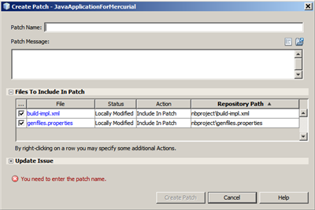
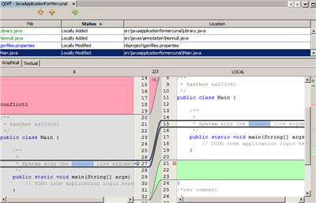

// 
//     Licensed to the Apache Software Foundation (ASF) under one
//     or more contributor license agreements.  See the NOTICE file
//     distributed with this work for additional information
//     regarding copyright ownership.  The ASF licenses this file
//     to you under the Apache License, Version 2.0 (the
//     "License"); you may not use this file except in compliance
//     with the License.  You may obtain a copy of the License at
// 
//       http://www.apache.org/licenses/LICENSE-2.0
// 
//     Unless required by applicable law or agreed to in writing,
//     software distributed under the License is distributed on an
//     "AS IS" BASIS, WITHOUT WARRANTIES OR CONDITIONS OF ANY
//     KIND, either express or implied.  See the License for the
//     specific language governing permissions and limitations
//     under the License.
//

= NetBeans IDEでのMercurial Queuesサポートの使用
:jbake-type: tutorial
:jbake-tags: tutorials 
:jbake-status: published
:icons: font
:syntax: true
:source-highlighter: pygments
:toc: left
:toc-title:
:description: NetBeans IDEでのMercurial Queuesサポートの使用 - Apache NetBeans
:keywords: Apache NetBeans, Tutorials, NetBeans IDEでのMercurial Queuesサポートの使用

NetBeans IDEはMercurial Queues拡張をサポートしています。IDEのMercurial Queuesサポートにより、IDE内でパッチを作成または確認したり、パッチ間を切り替えることができる他、bugを修正したローカル変更でパッチをリフレッシュしたり、新しいベース・リビジョンに更新することもできます。このドキュメントでは、Mercurialバージョン管理ソフトウェアを使用してパッチを管理する場合の標準的なワークフローを説明することによって、IDEの基本的なパッチ固有のタスクの実行方法を示します。

== 内容

image::images/netbeans-stamp-80-74.png[title="このページの内容は、NetBeans IDE 7.4および8.0に適用されます"]

* <<reqs,要件>>
* <<enable,Mercurial Queuesサポートの有効化>>
* <<create,パッチの作成>>
* <<refresh,ローカル変更を使用したパッチのリフレッシュ>>
* <<diff,パッチ・リビジョンの比較>>
* <<switch,パッチ間の切替え>>
* <<finish,適用パッチの終了>>
* <<summary,サマリー>>
* <<seealso,関連項目>>

== 要件

*このチュートリアルを完了するには、次のソフトウェアとリソースが必要です。*

|===
|ソフトウェアまたはリソース |必須バージョン 

|link:https://netbeans.org/downloads/index.html[+NetBeans IDE+] |バージョン7.4または8.0 

|link:http://www.oracle.com/technetwork/java/javase/downloads/index.html[+Java Development Kit+] (JDK) |バージョン7または8 

|link:http://mercurial.selenic.com/downloads/[+Mercurialクライアント・ソフトウェア+] |1.04以降 
|===

*注意:* 使用しているシステムにMercurialクライアント・ソフトウェアをインストールする方法の詳細は、link:mercurial.html#settingUp[+NetBeans IDEでのMercurialサポートの使用+]を参照してください。

== Mercurial Queuesサポートの有効化

Mercurial Queuesは拡張機能であるため、使用する前に明示的に有効化する必要があります。
MercurialリポジトリでMercurial Queuesの実行を開始するには、次の手順を完了する必要があります。

1. システムで、 ``.hgrc`` ファイルを参照します。 ``.hgrc`` ファイルのデフォルトの場所は、OS XおよびLinuxでは ``$HOME/.hgrc`` 、Windowsでは ``%USERPROFILE%\Mercurial.ini`` です。
2. 次の行を ``.hgrc`` ファイルに追加します。

[source,ini]
----
     [extensions]
     hgext.mq =
----

. ファイルを保存します。

== パッチの作成

パッチを作成するには、次の手順を完了する必要があります。

1. 「プロジェクト」ウィンドウで、バージョン管理されたプロジェクトを選択し、「 ``チーム`` 」>「 ``キュー`` 」>「 ``パッチの作成`` 」を選択します(または、プロジェクト名を右クリックし、ポップアップ・メニューから「 ``Mercurial`` 」>「 ``キュー`` 」>「 ``パッチの作成`` 」を選択します)。
「パッチの作成」ダイアログ・ボックスが表示されます。

[.feature]
--

--

. 「パッチ名」テキスト・フィールドにパッチの名前を指定します。
. 「パッチ・メッセージ」フィールドにパッチの説明を入力します。
または、次のオプションのいずれかを選択し、その後に「OK」をクリックします。
* 「最近のメッセージ」ボタン(image:images/recent.png[])をクリックし、最近のコミット・メッセージのリストからメッセージを選択します。
* 「テンプレートをロード」ボタン(image:images/load.png[])をクリックし、コミット・メッセージに対するメッセージ・テンプレートを選択します。

*注意:* 入力したパッチの説明は、<<finish,パッチを永久変更セットに変更>>するときにコミット・メッセージとして使用されます。

. 「パッチに含めるファイル」表で、パッチに含めるファイルを選択します。
. (オプション)「問題を更新」領域のフィールドを使用して、作成したパッチに関連した問題に関する情報を指定します。
. 「パッチの作成」をクリックします。
新しいパッチが作成されて、 ``.hg/patches`` ディレクトリに追加されます。

== ローカル変更を使用したパッチのリフレッシュ

作成中のパッチに進捗内容を保存するには、次の手順を完了する必要があります。

1. メイン・メニューから「 ``チーム`` 」>「 ``キュー`` 」>「 ``パッチのリフレッシュ`` 」を選択します(または、プロジェクト名を右クリックし、ポップアップ・メニューから「 ``Mercurial`` 」>「 ``キュー`` 」>「 ``パッチのリフレッシュ`` 」を選択します)。
「パッチのリフレッシュ」ダイアログ・ボックスが表示されます。

[.feature]
--

image::images/refresh-patch-small.png[role="left", link="images/refresh-patch.png"]

--

. 「パッチ・メッセージ」フィールドにパッチの説明を入力します。
または、次のオプションのいずれかを選択し、その後に「OK」をクリックします。
* 「最近のメッセージ」ボタン(image:images/recent.png[])をクリックし、最近のコミット・メッセージのリストからメッセージを選択します。
* 「テンプレートをロード」ボタン(image:images/load.png[])をクリックし、コミット・メッセージに対するメッセージ・テンプレートを選択します。

*注意:* 入力したパッチの説明は、<<finish,パッチを永久変更セットに変更>>するときにコミット・メッセージとして使用されます。

. 「パッチに含めるファイル」表で、パッチに含めるファイルを選択します。
. (オプション)「問題を更新」領域で、コミットする変更に関連した問題に関する情報を指定します。
. 「パッチのリフレッシュ」をクリックします。
作業中のパッチが更新されます。

== パッチ・リビジョンの比較

パッチを生成して、パッチのリビジョンを並べて確認および比較するには、次の手順を完了する必要があります。

1. メイン・メニューから「 ``チーム`` 」>「 ``キュー`` 」>「 ``差分`` 」を選択します(または、プロジェクト名を右クリックし、ポップアップ・メニューから「 ``Mercurial`` 」>「 ``キュー`` 」>「 ``差分`` 」を選択します)。
差分ビューアには、現在のパッチと、コミットまたはリフレッシュされていないすべてのローカル変更との相違がパネルに並んで表示されます。

[.feature]
--

--

. グラフィカルな差分ビューアまたはテキスト形式の差分ビューアを使用して、比較ファイルで検出された相違を確認および置換します。

*注意:* グラフィカルな差分ビューアは、次の色分けを使用してファイル内の変更を強調表示します。

|===
|*青* (     ) |古いパッチの後で変更された行を示します。 

|*緑* (     ) |古いパッチの後で追加された行を示します。 

|*赤* (     ) |古いパッチの後で除去された行を示します。 
|===

次のアイコンを使用すると、グラフィカルな差分ビューアで直接変更を加えることができます。

|===
|アイコン |名前 |機能 

|image:images/replace.png[] |*置換* |前のパッチから現在のパッチに、強調表示されたテキストを挿入します。 

|image:images/replace-all.png[] |*すべてを置換* |パッチの現在のバージョンを、選択された前のバージョンの状態に戻します。 

|image:images/remove.png[] |*除去* |強調表示されたテキストをパッチの現在のバージョンから除去し、パッチの以前のバージョンが反映されるようにします。 
|===

== パッチ間の切替え

パッチ・キュー・シリーズで特定のパッチに切り替えるには、次の手順を完了する必要があります。

*注意:* パッチ間を切り替えるには、作業コピーに_ローカル変更がない必要があり_、そうでない場合は切替えに失敗します。

1. メイン・メニューから「 ``チーム`` 」>「 ``キュー`` 」>「 ``パッチに移動`` 」を選択します(または、プロジェクト名を右クリックし、ポップアップ・メニューから「 ``Mercurial`` 」>「 ``キュー`` 」>「 ``パッチに移動`` 」を選択します)。
「パッチに移動」ダイアログ・ボックスには、スタックで使用可能なすべてのパッチのリストが表示されます。

image::images/go-patch.png[]

*注意:*

* 適用されているパッチの名前は太字で表示されます。
* スタックの上部から適用済パッチを除去して作業ディレクトリを更新し、適用済パッチが影響しないようにするには、「 ``チーム`` 」>「 ``キュー`` 」>「 ``すべてのパッチのポップ`` 」を選択します。

. 必要なパッチを選択して「移動」をクリックします。
選択したパッチに含まれている変更が、選択したプロジェクト、ファイルまたはフォルダに適用されます。

== 適用パッチの終了

パッチの作業を実行した後は、パッチを永久変更セットに変更できます。
パッチ・キュー・シリーズ内のすべての適用済パッチを通常の変更セットに変更するには、次の手順を完了する必要があります。

*注意:* リポジトリにすべての保存済パッチを適用するには、メイン・メニューから「 ``チーム`` 」>「 ``キュー`` 」>「 ``すべてのパッチのプッシュ`` 」を選択します。

1. メイン・メニューから「 ``チーム`` 」>「 ``キュー`` 」>「 ``パッチの終了`` 」を選択します(または、プロジェクト名を右クリックし、ポップアップ・メニューから「 ``Mercurial`` 」>「 ``キュー`` 」>「 ``パッチの終了`` 」を選択します)。
「パッチの終了」ダイアログ・ボックスが表示されます。

image::images/finish-patches.png[]

. パッチ・フィールドで終了するパッチの名前を選択します。

*注意:* 選択したパッチの前にあるシリーズのすべてのパッチも終了されます。

. 「パッチの終了」をクリックします。
選択したパッチまでのすべての適用済パッチが通常の変更セットに変更されます。

== サマリー

このチュートリアルでは、Mercurialバージョン管理ソフトウェアを使用してパッチを管理する場合の標準的なワークフローを説明することによって、IDEの基本的なパッチ固有のタスクの実行方法を示しました。IDEに含まれるMercurial固有の機能の一部を紹介しながら、NetBeans IDEでのMercurial Queuesサポートの有効化方法、およびパッチに対する基本タスクの実行方法を示しました。

link:/about/contact_form.html?to=3&subject=Feedback:%20Using%20Suport%20For%20Mercurial%20Queues%20in%20NetBeans%20IDE[+このチュートリアルに関するご意見をお寄せください+]

== 関連項目

関連する資料については、次のドキュメントを参照してください。

* link:mercurial.html[+NetBeans IDEでのMercurialサポートの使用+]
* link:http://wiki.netbeans.org/HgNetBeansSources[+IDEでのMercurialを使用したNetBeansソースの操作+]
* link:http://www.oracle.com/pls/topic/lookup?ctx=nb8000&id=NBDAG234[+NetBeans IDEによるアプリケーションの開発+]の_バージョン管理によるアプリケーションのバージョニング_

