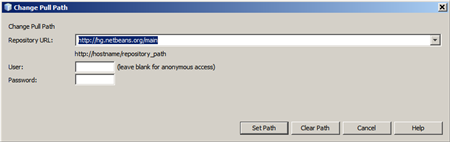
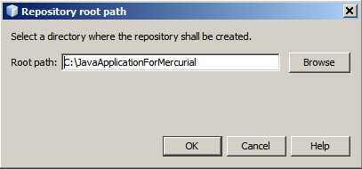
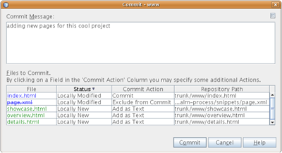
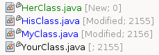
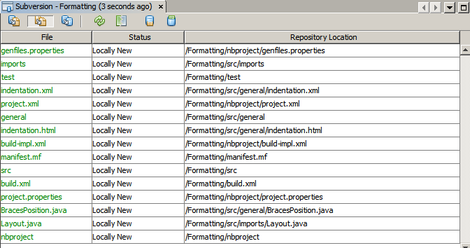
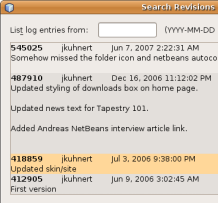

// 
//     Licensed to the Apache Software Foundation (ASF) under one
//     or more contributor license agreements.  See the NOTICE file
//     distributed with this work for additional information
//     regarding copyright ownership.  The ASF licenses this file
//     to you under the Apache License, Version 2.0 (the
//     "License"); you may not use this file except in compliance
//     with the License.  You may obtain a copy of the License at
// 
//       http://www.apache.org/licenses/LICENSE-2.0
// 
//     Unless required by applicable law or agreed to in writing,
//     software distributed under the License is distributed on an
//     "AS IS" BASIS, WITHOUT WARRANTIES OR CONDITIONS OF ANY
//     KIND, either express or implied.  See the License for the
//     specific language governing permissions and limitations
//     under the License.
//

= Using Mercurial in Apache NetBeans
:jbake-type: tutorial
:jbake-tags: tutorials 
:jbake-status: published
:syntax: true
:icons: font
:source-highlighter: pygments
:toc: left
:toc-title:
:description: Using Mercurial Support in NetBeans IDE - Apache NetBeans
:keywords: Apache NetBeans, Tutorials, Using Mercurial Support in NetBeans IDE

NetBeans IDE provides support for the Mercurial version control client versions 1.0.x and higher. The IDE's Mercurial support allows you to perform versioning tasks directly from your project within the IDE. This document demonstrates how to perform basic versioning tasks in the IDE by guiding you through the standard workflow when using versioning software.

link:http://www.selenic.com/mercurial/wiki/[+Mercurial+] is a fast, lightweight source control management system designed for efficient handling of very large distributed projects. Unlike CVS and Subversion, Mercurial works with distributed repositories which are commonly used in many open source projects and supports distributed development without any centralized control. You can use Mercurial commands on both files and directories. The IDE provides a graphical Diff Viewer that enables you to compare file revisions and also supports inline diffs directly in the editor.

The IDE's Mercurial support is similar to the IDE's Subversion support. The main difference is that Mercurial is a distributed revision control system. Users typically begin by _cloning_ an external repository to work with. This clone is a complete copy of the repository including the revision history. You can clone the local copy as often as needed and when ready, push locally made changes back to the original repository if you have permissions, or _export_ the changes and send them to the repository owner if you do not have permissions.

== Setting up Mercurial

Before you can take advantage of the IDE's Mercurial support, you need to have Mercurial client software installed on your system. The IDE supports Mercurial client versions 1.04 and higher. The IDE's Mercurial support works by using the same commands as the Mercurial command line interface.

You can download Mercurial as either sources or as a binary package from link:http://www.selenic.com/mercurial/[+ the Mercurial website+].

To set the path to the Mercurial executable file in the IDE:

1. Choose  ``Tools``  >  ``Options``  ( ``NetBeans``  >  ``Preferences``  on OS X) from the main menu. The Options dialog opens.
2. Select the Team icon along the top of the dialog, then click the Versioning tab. In the left pane under Versioning Systems, select Mercurial. User-defined options for Mercurial display in the main window of the dialog:

[.feature]
--

image::images/options-dialog-small.png[role="left", link="images/options-dialog.png"]

--

. In the Mercurial Executable Path text field, either type in the path to the executable file or click Browse to navigate to it on your system. Note that you need not _include_ the Mercurial executable file in the path.
. Click OK.

You can run Mercurial commands from the IDE's  ``Team``  >  ``Mercurial``  menu after the Mercurial client is set up. To clone an external Mercurial repository, choose  ``Team``  >  ``Mercurial``  >  ``Clone Other`` . In the process of cloning, the IDE automatically imports all of the history and status information for the cloned files.

If you have an existing Mercurial repository, the IDE automatically recognizes them as versioned files if those files are opened in an IDE project or if they are added to the Favorites window. You can use Mercurial commands on the files from the Mercurial menu or by right-clicking a file or folder and choosing from the Mercurial contextual menu.

To create a Mercurial repository on your computer using the command-line, type in the following:

[source,shell]
----
hg clone /path/to/your/repository
----

NOTE: The NetBeans Mercurial repositories (link:http://hg.netbeans.org/[+http://hg.netbeans.org/+]) are used for demonstration purposes in this tutorial.

== Synchronizing Local Files with a Repository

When using a version control system, you work by synchronizing local files with a repository, making changes to your local copy, then committing them to the repository. The following list describes various ways you can synchronize a project in the NetBeans IDE, depending on your specific situation:

* <<opening,Opening a Mercurial Project in the IDE>>
* <<checking,Checking out Files from a Repository>>
* <<importing,Importing Files into a Repository>>

=== Opening a Mercurial Project in the IDE

If you already have a Mercurial versioned project which you have been working with outside of the IDE, you can open it in the IDE and versioning features will automatically become available to you. The IDE scans the open projects, file status and context-sensitive support automatically becomes active for Mercurial versioned projects.

=== Checking out Files from a Repository

If you want to connect to a remote repository from the IDE, then check out files and immediately begin working with them, do the following:

1. In NetBeans IDE, choose  ``Team``  >  ``Mercurial``  >  ``Clone other``  from the main menu. The Clone wizard opens.

[.feature]
--

image::images/clone-repository-small.png[role="left", link="images/clone-repository.png"]

--

NOTE: The IDE's drop-down menus are context-sensitive, i.e. the available options depend on the item currently selected. Therefore, if you are already working within a Mercurial project, you can choose  ``Team``  >  ``Remote``  >  ``Clone Other``  from the main menu.

. In Repository URL, enter the path to the repository (e.g.  ``http://hg.netbeans.org/main`` ).
. In the User and Password fields that the Clone wizard displays, enter your netbeans.org username and password.

[.feature]
--

image::images/clone-username-small.png[role="left", link="images/clone-username.png"]

--

. If you are using a proxy, be sure to click the Proxy Configuration button and enter any required information in the Options dialog box. When you are certain your connection settings to the repository are correct, click Next.
. In the second step, click Change to the right of the Default Push Path field. The Change Push Path dialog box opens.

[.feature]
--

--

. Modify your default push entry by adding your NetBeans username and password and changing the protocol to  ``https`` .
. Click Set Path. The Change Push Path dialog box closes.
. Click Next to pass to the third step of the wizard.
. In the Parent Directory field, enter a location on your computer where you want repository files to be checked out to (alternatively, you can use the Browse button).

[.feature]
--

image::images/clone-destination-small.png[role="left", link="images/clone-destination.png"]

--

NOTE: If you are running Windows, be careful of the path length that you specify; i.e.,  ``C:\Documents and Settings\myName\My Documents\NetBeans\etc\etc``  can cause an unsuccessful clone due to very long file paths. Try using  ``C:\``  instead.

. Leave the Scan for NetBeans Projects after Checkout option selected, then click Finish to initiate the check out action. 
The IDE checks out the specified sources and the IDE's status bar indicates the progress of the files downloading from the repository to your local working directory. You can also view files as they are being checked out from the Output window (Ctrl-4 on Windows/Command-4 on OS X).

NOTE: If the checked out sources contain NetBeans projects, a dialog box appears prompting you to open them in the IDE. If the sources do not contain a project, the dialog appears prompting you to create a new project from the sources and then open them in the IDE. If you create a new project for such sources, select the appropriate project category (in the New Project wizard) and then use the With Existing Sources option within that category.

=== Importing Files into a Repository

Alternately, you can import a project you have been working on in the IDE to a remote repository, then continue to work on it in the IDE after it has become synchronized.

NOTE: While you are actually _exporting_ files from your system, the term 'import' is used in version control systems to signify that files are being _imported into_ a repository.

To import a project to a repository:

1. From the Projects window (Ctrl-1 on Windows/Command-1 on OS X), select an unversioned project and choose  ``Team``  >  ``Mercurial``  >  ``Initialize Repository``  from the node's right-click menu. The Repository root path dialog box opens.

[.feature]
--

--

. Specify the repository folder in which you want to place the project in the repository. A folder containing the name of your project is suggested for you in the Root Path text field by default.
. Click OK to initiate the Mercurial initialize action.
Upon clicking OK, the IDE uploads the project files to the repository.
Choose Window > Output to open the Output window and view the progress.

[.feature]
--

image::images/output-small.png[role="left", link="images/output.png"]

--

NOTE: After the project files are placed under Mercurial version control, they get registered in the repository as  ``Locally New`` . The new files and their status can be viewed by clicking on  ``Mercurial``  >  ``Show changes``  from the right-click menu.

[.feature]
--

image::images/status-small.png[role="left", link="images/status.png"]

--

. Choose  ``Mercurial``  >  ``Commit``  from the project's right-click menu to commit these project files to the Mercurial repository. The Commit - [ProjectName] dialog box opens.

[.feature]
--

--

. Type your message in the Commit Message text area and click Commit.

NOTE: The committed files are placed together with the  ``.hg``  directory in the Mercurial repository directory. The commit details are available in the IDE Output window (Ctrl-4 on Windows/Command-4 on OS X).

== Editing Sources

Once you have a Mercurial versioned project opened in the IDE, you can begin making changes to sources. As with any project opened in NetBeans IDE, you can open files in the Source Editor by double-clicking on their nodes, as they appear in the IDE's windows (e.g. Projects (Ctrl-1 on Windows/Command-1 on OS X), Files (Ctrl-2 on Windows/Command-2 on OS X), Favorites (Ctrl-3 on Windows/Command-3 on OS X) windows).

When working with sources in the IDE, there are various UI components at your disposal, which aid in both viewing and operating version control commands:

* <<viewingChanges,Viewing Changes in the Source Editor>>
* <<viewingFileStatus,Viewing File Status Information>>
* <<comparing,Comparing File Revisions>>
* <<merging,Merging File Revisions>>

=== Viewing Changes in the Source Editor

When you open a versioned file in the IDE's Source Editor, you can view real-time changes occurring to your file as you modify it against your previously checked-out base version from the repository. As you work, the IDE uses color encoding in the Source Editor's margins to convey the following information:

|===
|*Blue* (       ) |Indicates lines that have been changed since the earlier revision. 

|*Green* (       ) |Indicates lines that have been added since the earlier revision. 

|*Red* (       ) |Indicates lines that have been removed since the earlier revision. 
|===

The Source Editor's left margin shows changes occurring on a line-by-line basis. When you modify a given line, changes are immediately shown in the left margin.

You can click on a color grouping in the margin to call versioning commands. For example, the screen capture below left shows widgets available to you when clicking a red icon, indicating that lines have been removed from your local copy.

The Source Editor's right margin provides you with an overview that displays changes made to your file as a whole, from top to bottom. Color encoding is generated immediately when you make changes to your file.

Note that you can click on a specific point within the margin to bring your inline cursor immediately to that location in the file. To view the number of lines affected, hover your mouse over the colored icons in the right margin:

|===
|[.feature]
--

image::images/left-ui-small.png[role="left", link="images/left-ui.png"]

--

*Left margin* |[.feature]
--

image::images/right-ui-small.png[role="left", link="images/right-ui.png"]

--
 
*Right margin* 
|===

=== Viewing File Status Information

When you are working in the Projects (Ctrl-1 on Windows/Command-1 on OS X), Files (Ctrl-2 on Windows/Command-2 on OS X), Favorites (Ctrl-3 on Windows/Command-3 on OS X), or Versioning windows, the IDE provides several visual features that aid in viewing status information about your files. In the example below, notice how the badge (e.g. image:images/blue-badge.png[]), color of the file name, and adjacent status label, all coincide with each other to provide you with a simple but effective way to keep track of versioning information on your files:

image::images/badge-example.png[]

NOTE: Status labels are textual indication of file status in the Versioning, Projects, and Files windows. To display status labels, choose View > Show Versioning Labels from the main toolbar.

Badges, color coding, file status labels, and perhaps most importantly, the Versioning window all contribute to your ability to effectively view and manage and versioning information in the IDE.

* <<badges,Badges and Color Coding>>
* <<fileStatus,File Status Labels>>
* <<versioning,The Versioning Window>>

==== Badges and Color Coding

Badges are applied to project, folder, and package nodes and inform you of the status of files contained within that node:

The following table displays the color scheme used for badges:

|===
|UI Component |Description 

|*Blue Badge* (image:images/blue-badge.png[]) |Indicates the presence of files that have been locally modified, added or deleted. For packages, this badge applies only to the package itself and not its subpackages. For projects or folders, the badge indicates changes within that item, or any of the contained subfolders. 

|*Red Badge* (image:images/red-badge.png[]) |Marks projects, folders or packages that contain _conflicting_ files (i.e. local versions that conflict with versions maintained in the repository). For packages, this badge applies only to the package itself and not its subpackages. For projects or folders, the badge indicates conflicts within that item, or any of the contained subfolders. 
|===

Color coding is applied to file names in order to indicate their current status against the repository:

|===
|Color |Example |Description 

|*Blue* |image:images/blue-text.png[] |Indicates that the file has been locally modified. 

|*Green* |image:images/green-text.png[] |Indicates that the file has been locally added. 

|*Red* |image:images/red-text.png[] |Indicates that the file contains conflicts between your local working copy and the repository's version. 

|*Gray* |image:images/gray-text.png[] |Indicates that the file is ignored by Mercurial and will not be included in versioning commands (e.g. Update and Commit). Files can only be made to be ignored if they have not yet been versioned. 

|*Strike-Through* |image:images/strike-through-text.png[] |Indicates that the file is excluded from commit operations. Strike-through text only appears in specific locations, such as the Versioning window or Commit dialog, when you choose to exclude individual files from a commit action. Such files are still affected by other Mercurial commands, such as Update. 
|===

==== File Status Labels

File status labels provide a textual indication of the status of versioned files in the IDE's windows. By default, the IDE displays status (new, modified, ignored, etc.) and folder information in gray text to the right of files, as they are listed in windows. You can, however, modify this format to suit your own needs. For example, if you want to add revision numbers to status labels, do the following:

1. Choose  ``Tools``  >  ``Options``  ( ``NetBeans``  >  ``Preferences``  on OS X) from the main menu. The Options window opens.
2. Select the Team button along the top of the window, then click the Versioning tab beneath it. Make sure Mercurial is selected beneath Versioning Systems in the left panel.
3. To reformat status labels so that only status and folder display to the right of files, rearrange the contents of the Status Label Format text field to the following:

[source,java]
----

[{status}; {folder}]
----
Click OK. Status labels now list file status and folder (where applicable):

File status labels can be toggled on and off by choosing  ``View``  >  ``Show Versioning Labels``  from the main menu.

==== The Versioning Window

The Mercurial Versioning window provides you with a real-time list of all of the changes made to files within a selected folder of your local working copy. It opens by default in the bottom panel of the IDE, listing added, deleted or modified files.

To open the Versioning window, select a versioned file or folder (e.g. from the Projects, Files, or Favorites window) and either choose  ``Mercurial``  >  ``Show Changes``  from the right-click menu, or choose  ``Team``  >  ``Mercurial``  >  ``Show Changes``  from the main menu. The following window appears in the bottom of the IDE:

By default, the Versioning window displays a list of all modified files within the selected package or folder. Using the buttons in the toolbar, you can choose to display all changes or limit the list of displayed files to either locally or remotely modified files. You can also click the column headings above the listed files to sort the files by name, status or location.

The Versioning window toolbar also includes buttons that enable you to invoke the most common Mercurial tasks on all files displayed in the list. The following table lists the Mercurial commands available in the toolbar of the Versioning window:

|===
|Icon |Name |Function 

|image:images/refresh.png[] |*Refresh Status* |Refreshes the status of the selected files and folders. Files displayed in the Versioning window can be refreshed to reflect any changes that may have been made externally. 

|image:images/diff.png[] |*Diff All* |Opens the Diff Viewer providing you with a side-by-side comparison of your local copies and the versions maintained in the repository. 

|image:images/update.png[] |*Update All* |Updates all selected files from the repository. 

|image:images/commit.png[] |*Commit All* |Enables you to commit local changes to the repository. 
|===

You can access other Mercurial commands in the Versioning window by selecting a table row that corresponds to a modified file, and choosing a command from the right-click menu.

For example, you can perform the following actions on a file:

|===
|* *Show Annotations*: Displays author and revision number information in the left margin of files opened in the Source Editor.
 |image:images/annotations.png[] 

|* *Revert Modifications*: Opens the Revert Modifications dialog which you can use to specify parameters for reverting any local changes to revisions maintained in the repository.
 |[.feature]
--

--
 
|===

=== Comparing File Revisions

Comparing file revisions is a common task when working with versioned projects. The IDE enables you to compare revisions by using the Diff command, which is available from the right-click menu of a selected item ( ``Mercurial``  >  ``Diff``  >  ``Diff To Base``  or  ``Mercurial``  >  ``Diff``  >  ``Diff To Revision`` ), as well as from the Versioning window. In the Versioning window, you can perform diffs by either double-clicking a listed file, otherwise you can click the Diff All icon (image:images/diff.png[]) located in the toolbar at the top.

When you perform a diff, a graphical Diff Viewer opens for the selected file(s) and revisions in the IDE's main window. The Diff Viewer displays two copies in side-by-side panels. The more current copy appears on the right side, so if you are comparing a repository revision against your working copy, the working copy displays in the right panel:

[.feature]
--

image::images/diff-viewer-small.png[role="left", link="images/diff-viewer.png"]

--

The Diff Viewer makes use of the same <<viewingChanges,color encoding>> used elsewhere to display version control changes. In the screen capture displayed above, the green block indicates content that has been added to the more current revision. The red block indicates that content from the earlier revision has been removed from the later. Blue indicates that changes have occurred within the highlighted line(s).

Also, when performing a diff on a group of files, such as on a project, package, or folder, or when clicking Diff All (image:images/diff.png[]), you can switch between diffs by clicking files listed in the upper region of the Diff Viewer.

The Diff Viewer also provides you with the following functionality:

* <<makeChanges,Make Changes to your Local Working Copy>>
* <<navigateDifferences,Navigate Among Differences>>

=== Make Changes to your Local Working Copy

If you are performing a diff on your local working copy, the IDE enables you to make changes directly from within the Diff Viewer. To do so, you can either place your cursor within the right pane of the Diff Viewer and modify your file accordingly, otherwise make use of the inline icons that display adjacent to each highlighted change:

|===
|*Replace* (image:images/insert.png[]): |Inserts the highlighted text from the previous revision into the current revision 

|*Move All* (image:images/arrow.png[]): |Reverts the file's current revision to the state of the selected previous revision 

|*Remove* (image:images/remove.png[]): |Removes the highlighted text from the current revision so that it mirrors the previous revision 
|===

=== Navigate among Differences between Compared Files

If your diff contains multiple differences, you can navigate among them by using the arrow icons displayed in the toolbar. The arrow icons enable you to view differences as they appear from top to bottom:

|===
|*Previous* (image:images/diff-prev.png[]): |Goes to previous difference displayed in the diff 

|*Next* (image:images/diff-next.png[]): |Goes to next difference displayed in the diff 
|===

=== Merging File Revisions

NetBeans IDE enables you to merge changes between repository revisions and your local working copy. Specifically, this combines two separate changesets in a repository into a new changeset that describes how they combine.

1. In the Projects, Files, or Favorites window, right-click the files or folders on which you want to perform the merge operation and choose  ``Mercurial``  >  ``Branch/Tag``  >  ``Merge Changes`` . The Merge with Revision dialog displays.
2. In the Choose From Revisions drop-down list, select the revision. You are porting all changes made on a local working copy file from the time it was created.
3. Ensure the Description, Author, and Date data are correct.

[.feature]
--

image::images/mercurial-merge-small.png[role="left", link="images/mercurial-merge.png"]

--

. Click Merge. The IDE incorporates any differences found between the repository revisions and your local copy of the file. If merge conflicts occur, the file's status is updated to <<resolving,Merge Conflict>> to indicate this.

NOTE: After merging revisions to your local working copy, you must still commit changes using the Commit command in order for them to be added to the repository.

== Committing Sources to a Repository

After making changes to sources, you commit them to the repository. It is generally a good idea to update any copies you have against the repository prior to performing a commit in order to ensure that conflicts do not arise. Conflicts can occur however, and should be thought of as a natural event when numerous developers are working on a project simultaneously. The IDE provides flexible support that enables you to perform all of these functions. It also provides a Conflict Resolver which allows you to safely deal with any conflicts as they occur.

* <<updating,Updating Local Copies>>
* <<performing,Performing the Commit>>
* <<issues,Updating Issues>>
* <<pushing,Pushing Local Changes to the Shared Repository>>

=== Updating Local Copies

You can perform updates by choosing  ``Team``  >  ``Update``  from the main menu.

To perform an update on sources that you have modified, you can click the Update All icon (image:images/update.png[]), which displays in the toolbars located at the top of both the <<versioning,Versioning Window>>, as well as the <<comparing,Diff Viewer>>. Any changes that may have occurred in the repository are displayed in the Versioning Output window.

=== Performing the Commit

After editing source files, performing an update and resolving any conflicts, you commit files from your local working copy to the repository. The IDE enables you to call the commit command in the following ways:

* From the Projects, Files or Favorites windows, right-click new or modified items and choose  ``Mercurial``  >  ``Commit`` .
* From the Versioning window or Diff Viewer, click the Commit All (image:images/commit.png[]) button located in the toolbar.

The Commit dialog opens, displaying files that are about to be committed to the repository:

[.feature]
--

image::images/mercurial-commit-dialog-small.png[role="left", link="images/mercurial-commit-dialog.png"]

--

The Commit dialog lists:

* all locally modified files
* all files that have been deleted locally
* all new files (i.e. files that do not yet exist in the repository)
* all files that you have renamed. Mercurial handles renamed files by deleting the original file, and creating a duplicate using the new name.

From the Commit dialog, it is possible to specify whether to exclude individual files from the commit. To do so, click the Commit Action column of a selected file and choose Exclude from Commit from the drop-down list.

To perform the commit:

1. Type in a commit message in the Commit Message text area. Alternatively, click the Recent Messages ( image:images/recent-msgs.png[] ) icon located in the upper right corner to view and select from a list of messages that you have previously used.
2. After specifying actions for individual files, click Commit. The IDE executes the commit and sends your local changes to the repository. The IDE's status bar, located in the bottom right of the interface, displays as the commit action takes place. Upon a successful commit, versioning badges disappear in the Projects, Files and Favorites windows, and the color encoding of committed files returns to black.

=== Updating Issues

You can update an issue by associating your commit action with an existing issue in your repository's issue tracker. To do so, click on the Update Issue heading in the Commit dialog box to expand it, then specify the following:

* *Issue Tracker:* Specify the issue tracker that your repository uses, by selecting an issue tracker from the drop-down list. The drop-down provides you with a list of all issue trackers registered with the IDE. If your repository's issue tracker is not registered, click the New button to register it.
* *Issue:* Specify the issue ID. You can do this by typing in the ID, or part of the description.

You can also specify the following options:

* *Resolve as FIXED:* When selected, the status of the issue is marked as Resolved.
* *Add Commit Message from Above:* When selected, the commit message is added to the issue.
* *Add Revision Information to the Issue:* When selected, the issue is updated to include the revision information such as the author, date, etc. You can click Change Format to modify the format of the revision information that is added to the issue.
* *Add Issue Information to Commit Message:* When selected, the issue ID and summary are added to the commit message. You can click Change Format to modify the format of the issue information that is added to the message.
* *After Commit:* When selected, the issue is updated after you commit the changes.
* *After Push:* When selected, the issue is updated only after the changes are pushed to the repository.

=== Pushing Local Changes to the Shared Repository

Before pushing changes that you have committed locally to the shared repository, you need to synchronize your local repository with the shared repository. To do this with the Fetch command, choose  ``Team``  > ( ``Mercurial``  >)  ``Remote``  >  ``Fetch``  from the main menu. After you perform a successful Fetch, your local repository becomes synchronized with the shared repository.

To push changes, choose  ``Team``  > ( ``Mercurial``  >)  ``Remote``  >  ``Push Current Branch`` ,  ``Team``  > ( ``Mercurial``  >)  ``Remote``  >  ``Push All Branches`` , or  ``Team``  > ( ``Mercurial``  >)  ``Remote``  >  ``Push``  from the main menu. The output from a successful Push will list any changesets created.

NOTE: Since you maintain a copy of the entire repository on your system, the general practice is to make multiple commits to your local repository and only after the particular task is complete, perform the push to the shared repository.

== Summary

This tutorial showed how to perform basic versioning tasks in the IDE by guiding you through the standard workflow when using the IDE's Mercurial support. It demonstrated how to set up a versioned project and perform basic tasks on versioned files while introducing you to some of the Mercurial specific features included in the IDE.
