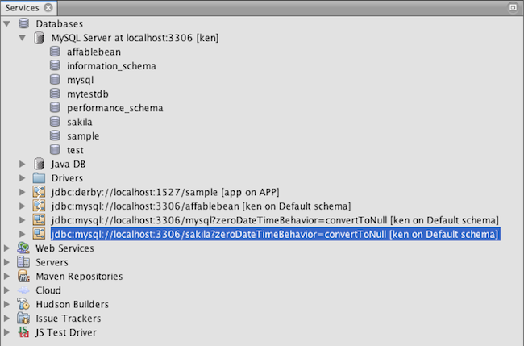

// 
//     Licensed to the Apache Software Foundation (ASF) under one
//     or more contributor license agreements.  See the NOTICE file
//     distributed with this work for additional information
//     regarding copyright ownership.  The ASF licenses this file
//     to you under the Apache License, Version 2.0 (the
//     "License"); you may not use this file except in compliance
//     with the License.  You may obtain a copy of the License at
// 
//       http://www.apache.org/licenses/LICENSE-2.0
// 
//     Unless required by applicable law or agreed to in writing,
//     software distributed under the License is distributed on an
//     "AS IS" BASIS, WITHOUT WARRANTIES OR CONDITIONS OF ANY
//     KIND, either express or implied.  See the License for the
//     specific language governing permissions and limitations
//     under the License.
//

= 连接 MySQL 数据库
:jbake-type: tutorial
:jbake-tags: tutorials 
:jbake-status: published
:icons: font
:syntax: true
:source-highlighter: pygments
:toc: left
:toc-title:
:description: 连接 MySQL 数据库 - Apache NetBeans
:keywords: Apache NetBeans, Tutorials, 连接 MySQL 数据库

本文档说明如何设置从 NetBeans IDE 到 MySQL 数据库的连接。连接后，可通过执行以下操作开始在 IDE 的数据库资源管理器中使用 MySQL：创建新的数据库和表、在表中填充数据，并对数据库结构和内容运行 SQL 查询。本教程是专门为那些对数据库管理有基本了解，并想要运用其知识在 NetBeans IDE 中使用 MySQL 的初学者而设计的。

link:http://www.mysql.com/[+MySQL+] 是一种常见的开源关系数据库管理系统 (RDBMS)，由于其速度、灵活性和可靠性而常用于 Web 应用程序中。MySQL 使用 SQL（即 _Structured Query Language_，结构化查询语言）访问和处理数据库中包含的数据。

*预计时间：_30_ 分钟*

*要学习本教程，您需要具备以下软件和资源。*

|===
|软件或资源 |要求的版本 

|link:https://netbeans.org/downloads/index.html[+NetBeans IDE+] |7.2、7.3、7.4、8.0、Java 

|link:http://www.oracle.com/technetwork/java/javase/downloads/index.html[+Java 开发工具包 (JDK)+] |版本 7 或 8 

|MySQL 数据库服务器 |link:http://dev.mysql.com/downloads/mysql/[+版本 5.x+] 
|===

NOTE: 本教程假设已在计算机上安装并配置了 MySQL RDBMS。如果是首次安装，请查阅正式的 link:http://dev.mysql.com/doc/refman/5.0/en/installing-cs.html[+MySQL 文档+]以寻求帮助。还可以参阅link:install-and-configure-mysql-server.html[+在 Windows 操作系统中设置 MySQL 数据库服务器+]。

== 配置 MySQL 服务器属性

NetBeans IDE 支持 MySQL RDBMS。访问 NetBeans IDE 中的 MySQL 数据库服务器之前，必须先配置 MySQL 服务器属性。

1. 在 "Services"（服务）窗口中，右键单击 "Databases"（数据库）节点，然后选择 "Register MySQL Server"（注册 MySQL 服务器），以打开 "MySQL Server Properties"（MySQL 服务器属性）对话框。

image::images/mysql-props1.png[]

. 确认服务器主机名和端口正确无误。

请注意，IDE 将输入 `localhost` 作为默认服务器主机名，并输入 `3306` 作为默认服务器端口号。

. 输入管理员用户名（如果未显示）。

NOTE: 您需要具备管理访问权限才能创建和删除数据库。

. 输入 Administrator 作为口令。默认值设为空。

NOTE: 空口令也可以是口令。

. 单击该对话框顶部的 "Admin Properties"（管理属性）标签。

随后将显示 "Admin Properties"（管理属性）标签，允许输入用来控制 MySQL 服务器的信息。

. 在 "Path/URL to admin tool"（管理工具的路径/URL）字段中，键入或浏览至 MySQL 管理应用程序（如 MySQL 管理工具、PhpMyAdmin 或其他基于 Web 的管理工具）的位置。

NOTE: `mysqladmin` 是 MySQl 管理工具，可在 MySQL 安装目录的 `bin` 文件夹中找到。它是命令行工具，用在 IDE 中并不理想。

在 "Arguments"（参数）字段中键入管理工具的参数。

. 在 "Path to start command"（启动命令的路径）中，键入或浏览至 MySQL 启动命令的位置。要找到启动命令，请在 MySQL 安装目录的 `bin` 文件夹中查找 `mysqld`。

NOTE: 对于 Unix 和 NetWare，建议使用二进制文件 `mysql_safe`。此外，如果安装 AMP 时已安装了 MySQL，则启动命令可能也会有所不同。

在 "Arguments"（参数）字段中键入启动命令的参数。

. 在 "Path to stop command"（停止命令的路径）字段中，键入或浏览至 MySQL 停止命令的位置。该位置通常是指向 MySQL 安装目录的 `bin` 文件夹中 `mysqladmin` 的路径。如果该命令为 `mysqladmin`，请在 "Arguments"（参数）字段中键入 `-u root stop`，以便授予停止服务器的 `root` 权限。
. 完成后，"Admin Properties"（管理属性）标签应如下图所示。如果您对配置感到满意，请单击 "OK"（确定）。

image::images/mysql-props2.png[]

== 启动 MySQL 服务器

连接 MySQL 数据库服务器之前，必须首先确保您计算机上的 MySQL 数据库服务器处于运行状态。如果未连接数据库服务器，则您将会在 "Service"（服务）窗口 "MySQL Server"（MySQL 服务器）节点中的用户名旁看到 *(disconnected)*（已断开连接），并且您无法展开该节点。

要连接到数据库服务器，请确认 MySQL 数据库服务器运行在计算机上，在 "Services"（服务）窗口中右键单击 "Databases"（数据库）> "MySQL Server"（MySQL 服务器）节点，然后选择 "Connect"（连接）。系统可能会提示您提供口令以连接到服务器。

连接服务器后，您将能够展开 "MySQL Server"（MySQL 服务器）节点并查看所有可用的 MySQL 数据库。

== 创建并连接到数据库实例

与数据库交互的常见方式是通过 SQL 编辑器。NetBeans IDE 具此用途的内置 SQL 编辑器。一般情况下，可以从连接节点（或连接节点的子节点）的右击菜单中通过 "Execute Command"（执行命令）选项来访问 SQL 编辑器。现在您已连接到 MySQL 服务器，接下来可以使用 SQL 编辑器来创建新的数据库实例。就本示例而言，将创建名为  ``MyNewDatabase``  的实例：

1. 在 IDE 的 "Services"（服务）窗口中，右键单击 MySQL 服务器节点并选择 "Create Database"（创建数据库）。
"Create MySQL Database"（创建 MySQL 数据库）对话框打开。

. 在"Create MySQL Database"（创建 MySQL 数据库）对话框中，键入新数据库的名称。对于本教程，我们将使用 `MyNewDatabase`。此时将该复选框保留为取消选中状态。 image:images/create-db-dbx.png[]

NOTE: 您还可以向给定用户授予完全访问权限。默认情况下，只有管理员用户具备执行某些命令的权限。通过该下拉列表，可以将这些权限指定给指定的用户。

. 单击 "OK"（确定）。

新的数据库就会出现在 "Services"（服务）窗口的 MySQL 服务器节点下。

. 右键单击新数据库节点，然后在弹出菜单中选择 "Connect"（连接）以打开与数据库的连接。

打开的数据库连接由 "Services"（服务）窗口中的一个完整连接节点 (image:images/connection-node-icon.png[]) 表示。

== 创建数据库表

现在您已连接到  ``MyNewDatabase`` ，接下来即可开始研究如何创建表、在表中填充数据，以及修改表中保留的数据。这可以使您便更详细地了解数据库资源管理器提供的功能，以及 NetBeans IDE 对 SQL 文件的支持。

 ``MyNewDatabase``  当前为空。在 IDE 中，可以使用 "Create Table"（创建表）对话框或通过输入 SQL 查询并从 SQL 编辑器直接运行该查询，来添加数据库表。在这里，您可以深入了解这两种方法：

1. <<usingSQLEditor,使用 SQL 编辑器>>
2. <<usingCreateTable,使用 "Create Table"（创建表）对话框>>

=== 使用 SQL 编辑器

1. 在数据库资源管理器中，展开  ``MyNewDatabase``  连接节点 (image:images/connection-node-icon.png[])，注意其中有三个子文件夹："Tables"（表）、"Views"（视图）和 "Procedures"（过程）。
2. 右键单击 "Tables"（表）文件夹，然后选择 "Execute Command"（执行命令）。会在 SQL 编辑器的主窗口中打开一个空画布。
3. 在 SQL 编辑器中，键入以下查询。这是与即将创建的  ``Counselor``  表对应的表定义。

[source,sql]
----
CREATE TABLE Counselor (
    id SMALLINT UNSIGNED NOT NULL AUTO_INCREMENT,
    firstName VARCHAR (50),
    nickName VARCHAR (50),
    lastName VARCHAR (50),
    telephone VARCHAR (25),
    email VARCHAR (50),
    memberSince DATE DEFAULT '0000-00-00',
    PRIMARY KEY (id)
            );
----

NOTE: 在 SQL 编辑器中形成的查询采用结构化查询语言 (SQL) 进行解析。SQL 遵循严格的语法规则，在 IDE 的编辑器中工作时应先熟悉一下这些规则。运行查询时，在 "Output"（输出）窗口中生成来自 SQL 引擎的反馈，表明执行是否成功。

. 要执行查询，请单击顶部任务栏中的 "Run SQL"（运行 SQL）(image:images/run-sql-button.png[]) 按钮（Ctrl-Shift-E 组合键），或者在 SQL 编辑器中右键单击并选择 "Run Statement"（运行语句）。IDE 在数据库中生成  ``Counselor``  表，并且您将收到一条与 "Output"（输出）窗口中的以下内容类似的消息。

image::images/create-counselor-query.png[]

. 要验证更改，请右键单击数据库资源管理器中的 "Tables"（表）节点，然后选择 "Refresh"（刷新）。"Refresh"（刷新）选项用于将数据库资源管理器的 UI 组件更新为指定数据库的当前状态。请注意，此时新的  ``Counselor``  表节点 (image:images/table-node.png[]) 将显示在数据库资源管理器中的 "Tables"（表）下。如果展开表节点，则可以看到所创建的列 (字段)，它们以主键开头 (image:images/primary-key-icon.png[])。

image::images/counselor-table.png[]

=== 使用 "Create Table"（创建表）对话框

1. 在数据库资源管理器中，右键单击 "Tables"（表）节点，然后选择 "Create Table"（创建表）。此时将打开 "Create Table"（创建表）对话框。
2. 在 "Table Name"（表名称）文本字段中，键入  ``Subject`` 。
3. 单击 "Add Column"（添加列）。
4. 输入  ``id``  作为列的名称。从 "Type"（类型）下拉列表中选择  ``SMALLINT``  作为数据类型。单击 "OK"（确定）。

image::images/add-column-dialog.png[]

. 在 "Add Column"（添加列）对话框中，选中 "Primary Key"（主键）复选框。这将为表指定主键。关系数据库中的所有表都必须包含主键。请注意，在选中 "Key"（键）复选框时，也将会自动选中 "Index"（索引）和 "Unique"（唯一）复选框，而 "Null"（空值）复选框则会被取消选中。这是因为主键用于标识数据库中的唯一行，且默认情况下主键可以构成表索引。由于需要标识所有行，因此主键不能包含空值。
. 通过添加其余的列来重复此过程，如下表所示。

|===
|Key（键） |Index（索引） |Null（空值） |Unique（唯一） |Column Name（列名） |Data Type（数据类型） |Size（大小） 

|[选中] |[选中] |[选中] |id |SMALLINT |0 

|[选中] |name |VARCHAR |50 

|[选中] |description |VARCHAR |500 

|[选中] |FK_counselorID |SMALLINT |0 
|===

您正在创建名为  ``Subject``  的表，该表包含与以下记录中的每条记录对应的数据。

* *名称：*主题的名称
* *描述：*主题的描述
* *顾问 ID：*与 Counselor 表中的 ID 对应的顾问 ID

image::images/create-table-subject.png[]

确保 "Create Table"（创建表）对话框中的字段与上面显示的字段匹配，然后单击 "OK"（确定）。IDE 在数据库中生成  ``Subject`` （主题）表，此时可以看到新的  ``Subject`` （主题）表节点 (image:images/table-node.png[]) 立即显示在数据库资源管理器的 "Tables"（表）下。

== 使用表数据

为了处理表数据，可以使用 NetBeans IDE 中的 SQL 编辑器。通过对数据库运行 SQL 查询，可以添加、修改和删除数据库结构中保留的数据。要向  ``Counselor``  表中添加新的记录（行），请执行以下操作：

1. 从数据库资源管理器的 "Tables"（表）文件夹中，选择 "Execute Command"（执行命令）。会在 SQL 编辑器的主窗口中打开一个空画布。
2. 在 SQL 编辑器中，键入以下查询。

[source,sql]
----
INSERT INTO Counselor
VALUES (1, 'Ricky', '"The Dragon"', 'Steamboat','334 612-5678', 'r_steamboat@ifpwafcad.com', '1996-01-01')
----

. 要执行该查询，请在 SQL 编辑器中单击鼠标右键，然后选择 "Run Statement"（运行语句）。在 "Output"（输出）窗口中，可以看到一条消息，表明已成功执行该查询。
. 要验证是否已将新记录添加到  ``Counselor``  表中，请在数据库资源管理器中右键单击  ``Counselor``  表节点并选择 "View Data"（查看数据）。一个新的 SQL 编辑器窗格在主窗口中打开。选择 "View Data"（查看数据）时，在 SQL 编辑器上面的区域中自动生成用于从表中选择所有数据的查询。该语句的结果显示在下面区域中的一个表视图中。在此示例中，将显示  ``Counselor``  表。请注意，新行中已经添加了刚刚通过 SQL 查询获得的数据。

image::images/sql-results.png[]

== 运行 SQL 脚本

在 NetBeans IDE 中管理表数据的另一种方式是在 IDE 中直接运行外部 SQL 脚本。如果已在其他位置创建了 SQL 脚本，则只需在 NetBeans IDE 中打开该脚本并在 SQL 编辑器中运行它。

为了进行说明，请下载 link:https://netbeans.org/project_downloads/samples/Samples/Java%20Web/ifpwafcad.sql[+ifpwafcad.sql+] 并将其保存到计算机上的某个位置。此脚本将创建两个与您在上面刚刚创建的表（ ``Counselor``  和  ``Subject`` ）类似的表，并立即在这些表中填充数据。

由于该脚本将覆盖这些表（如果这些表已存在），因此请立即删除  ``Counselor``  和  ``Subject``  表，以便表明在运行该脚本时就会创建新的表。要删除表，请执行以下操作：

1. 在数据库资源管理器中，右键单击  ``Counselor``  和  ``Subject``  表节点，然后选择 "Delete"（删除）。
2. 在 "Confirm Object Deletion"（确认删除对象）对话框中，单击 "Yes"（是）。请注意，该对话框列出了要删除的表。

在 "Confirm Object Deletion"（确认删除对象）对话框中单击 "Yes"（是）后，将从数据库资源管理器中自动删除表节点。

要对  ``MyNewDatabase``  运行 SQL 脚本，请执行以下操作：

1. 从 IDE 的主菜单中选择 "File"（文件）> "Open"（打开）。在文件浏览器中导航至以前保存  ``ifpwafcad.sql``  的位置并单击 "Open"（打开）。将自动在 SQL 编辑器中打开该脚本。
2.  确保从该编辑器顶部的工具栏中的 "Connection"（连接）下拉框中选择到  ``MyNewDatabase``  的连接。

image::images/connection-drop-down.png[]

. 单击 "SQL Editor"（SQL 编辑器）任务栏中的 "Run SQL"（运行 SQL）(image:images/run-sql-button.png[]) 按钮。将对选定的数据库执行该脚本，并在 "Output"（输出）窗口中生成任何反馈。
. 要验证更改，请右键单击 "Runtime"（运行时）窗口中的  ``MyNewDatabase``  连接节点，然后选择 "Refresh"（刷新）。"Refresh"（刷新）选项用于将数据库资源管理器的 UI 组件更新为指定数据库的当前状态。请注意，从 SQL 脚本生成的两个新表现在数据库资源管理器中的  ``MyNewDatabase``  下显示为表节点。
. 从选定表节点的右击菜单中选择 "View Data"（查看数据），以查看新表中包含的数据。可以采用此方式对表格数据与 SQL 脚本中包含的数据进行比较，以便查看它们是否匹配。
link:/about/contact_form.html?to=3&subject=Feedback:%20Connecting%20to%20a%20MySQL%20Database[+请将您的反馈意见发送给我们+]

== 另请参见

“连接 MySQL 数据库”教程到此结束。本文档演示了如何在计算机上配置 MySQL，以及如何设置从 NetBeans IDE 到数据库服务器的连接。此外，还介绍了如何通过执行以下操作在 IDE 的数据库资源管理器中使用 MySQL：创建新的数据库实例和表、在表中填充数据，并运行 SQL 查询。

有关更多相关的高级教程，请参见以下资源：

* link:../../docs/web/mysql-webapp.html[+使用 MySQL 数据库创建简单的 Web 应用程序+]。后续课程，演示如何使用刚刚创建的 MySQL 数据库在 IDE 中创建简单的两层 Web 应用程序。
