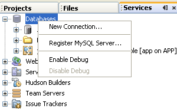
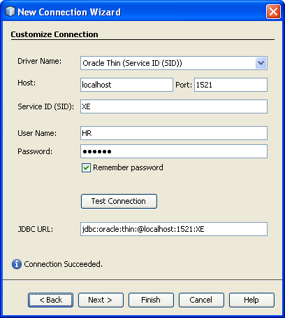
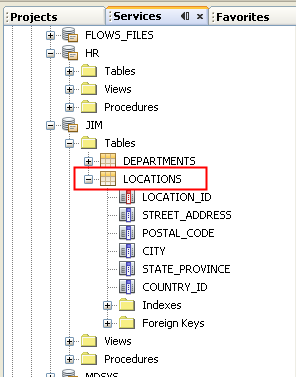
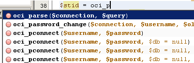

// 
//     Licensed to the Apache Software Foundation (ASF) under one
//     or more contributor license agreements.  See the NOTICE file
//     distributed with this work for additional information
//     regarding copyright ownership.  The ASF licenses this file
//     to you under the Apache License, Version 2.0 (the
//     "License"); you may not use this file except in compliance
//     with the License.  You may obtain a copy of the License at
// 
//       http://www.apache.org/licenses/LICENSE-2.0
// 
//     Unless required by applicable law or agreed to in writing,
//     software distributed under the License is distributed on an
//     "AS IS" BASIS, WITHOUT WARRANTIES OR CONDITIONS OF ANY
//     KIND, either express or implied.  See the License for the
//     specific language governing permissions and limitations
//     under the License.
//

= Connecting to Oracle Database from NetBeans IDE
:jbake-type: tutorial
:jbake-tags: tutorials 
:jbake-status: published
:syntax: true
:icons: font
:source-highlighter: pygments
:toc: left
:toc-title:
:description: Connecting to Oracle Database from NetBeans IDE - Apache NetBeans
:keywords: Apache NetBeans, Tutorials, Connecting to Oracle Database from NetBeans IDE

NetBeans IDE includes built-in support for Oracle Database. You can easily establish a connection from inside the IDE and begin working with the database. This tutorial demonstrates how to use a local installation of Oracle Database 10_g_ Express Edition (Oracle Database XE), a lightweight database that is free to develop, deploy, and distribute.

This document shows how to <<connect,set up a connection to a local installation>> of Oracle Database XE from the NetBeans IDE, use the IDE's built-in SQL editor to <<createuser,handle the database data>>, and how to <<oci8,enable the OCI 8 PHP extension>> to write PHP code that connects to an Oracle database.

*To follow this tutorial, you need the following software and resources.*

|===
|Software or Resource |Version Required 

|link:http://www.oracle.com/technetwork/database/express-edition/overview/index.html[+Oracle Database XE +] |10 _g_ Express Edition 

|link:http://www.oracle.com/technetwork/database/enterprise-edition/jdbc-112010-090769.html[+Oracle JDBC driver+] |link:http://download.oracle.com/otn/utilities_drivers/jdbc/11202/ojdbc6.jar[+ojdbc6.jar+] 
|===

== Before You Begin

Before you start walking through this tutorial, consider the following:

* This tutorial demonstrates how to connect to an Oracle Database XE instance installed on your local system, but the steps can also be applied when you are connecting to a remote instance. If you are connecting to a local instance you need to link:http://www.oracle.com/technetwork/database/express-edition/overview/index.html[+download+] and install Oracle Database XE. The installation process is simple and intuitive, but if you have questions, refer to the link:http://www.oracle.com/pls/xe102/homepage[+Oracle Database XE installation guide+] for your platform.
* There are two categories of Oracle JDBC drivers: OCI and JDBC Thin.
* Oracle's JDBC Thin driver is based on Java and is platform independent. This standalone driver does not require the presence of other Oracle libraries and allows a direct connection to an Oracle Database. This tutorial uses this driver to show how to connect to Oracle Database. Before walking through the tutorial, you need to link:http://www.oracle.com/technetwork/database/enterprise-edition/jdbc-112010-090769.html[+download+] the  ``ojdbc6.jar``  file and save it on your system.

NOTE: Windows may change the extension of the downloaded file from .jar to .zip. It is still a .jar file, however. You can rename the file to .jar.

* Oracle's OCI driver uses Oracle's native client libraries to communicate with databases. These libraries are obtained as part of the Oracle Instant Client. Although the Thin driver is sufficient in most cases, you might also want to use the OCI driver by following the steps in <<oci,Using OCI JDBC Driver with the NetBeans IDE>>. 
A good example of the OCI driver use is accessing a remote Oracle database from a PHP application using the Oracle Instant Client libraries. See the <<oci8,OCI 8 and the NetBeans IDE for PHP>> section in this tutorial for information on how to enable the OCI8 extension for PHP.
* If you have not used Oracle Database XE before, take the Oracle Database XE link:http://download.oracle.com/docs/cd/B25329_01/doc/admin.102/b25610/toc.htm[+Getting Started tutorial+].

WARNING: For Windows users: the Oracle Database XE homepage, which you use to administer the database, uses port 8080 by default. Oracle GlassFish Application Server also uses port 8080 by default. If you run both programs at the same time, Oracle Database XE blocks browsers from accessing GlassFish at localhost:8080. All applications deployed on GlassFish return 404 in this case. The simple solution is to shut down Oracle Database XE if you do not need it when you are running GlassFish. If you need to run both at the same time, change the default port that Oracle Database XE uses. This is easier than changing the GlassFish default port. There are many sets of instructions on the Internet for changing the Oracle Database XE default port, including one in link:https://forums.oracle.com/forums/thread.jspa?threadID=336855[+Oracle forums+].

== Establishing a Connection to Oracle Database

In this exercise you will test and create a new connection to the database.

1. Start the Oracle database.
2. Open the Services window (Window > Services or Ctrl-5;⌘-5 on Mac). In the Services window, right-click the Databases node and choose New Connection. 

. In the New Connection wizard, select Oracle Thin in the Driver dropdown list.
. Click Add and locate the  ``ojdbc6.jar``  file that you previously downloaded. Click Next.
. In the Customize Connection panel of the wizard, enter the following values and click Next. 

|===

|Name |Value 

|Driver Name |Oracle Thin (with Service ID (SID)) 

|Host | ``localhost``  or 127.0.0.1. 
_Note:_ In the case of a remote connection, provide the IP address or resolvable hostname of the machine where the database is installed. 

|Port |1521 (default) 

|Service ID (SID) | ``XE``  (default SID for Oracle Database XE).
_Note_: If you are connecting to a remote database, ask the database administrator to provide you with the database SID. 

|Username |

Enter the username. 
For the purpose of our tutorial, enter  ``system``  (the default database administrator account) and password that you used during database installation.

 

|Password |Enter the password for the selected username. 
|===

. Click Test Connection to confirm that the IDE is able to connect to the database. Click Next.

If the attempt is successful, the message "Connection succeeded" is displayed in the wizard.

. Select  ``HR``  in the Select Schema dropdown list. Click Finish.

NOTE: You need to unlock the HR schema before you can access it in NetBeans. Unlocking the HR database is described in the Oracle Database XE link:http://download.oracle.com/docs/cd/B25329_01/doc/admin.102/b25610/toc.htm[+Getting Started tutorial+].

The new connection will appear under the Databases node in the Services window. You can expand it and start browsing the database object's structure. 
Change the display name for the connection node: choose Properties from the node's popup menu and click the ellipsis button for the Display Name property. Enter OracleDB as the Display Name and click OK.

image::images/connection.png[]

NOTE: Although the steps above demonstrate the case of connecting to a local database instance, the steps for connecting to a _remote_ database are the same. The only difference is that instead of specifying  ``localhost``  as the hostname, enter the IP address or hostname of the remote machine where Oracle Database is installed.

== Manipulating Data in Oracle Database

A common way of interacting with databases is running SQL commands in an SQL editor or by using database management interfaces. For example, Oracle Database XE has a browser-based interface through which you can administer the database, manage database objects, and manipulate data.

Although you can perform most of the database-related tasks through the Oracle Database management interface, in this tutorial we demonstrate how you can make use of the SQL Editor in the NetBeans IDE to perform some of these tasks. The following exercises demonstrate how to create a new user, quickly recreate a table, and copy the table data.

=== Creating a User

Let's create a new database user account to manipulate tables and data in the database. To create a new user, you must be logged in under a database administrator account, in our case, the default  ``system``  account created during database installation.

1. In the Services window, right-click the OracleDB connection node and choose Execute Command. This opens the NetBeans IDE's SQL editor, in which you can enter SQL commands that will be sent to the database.

image::images/execute.png[]

. To create a new user, enter the following command in the SQL Editor window and click the Run SQL button on the toolbar. 

image::images/create-user.png[]

[source,sql]
----
create user jim 
  identified by mypassword 
  default tablespace users 
  temporary tablespace temp 
  quota unlimited on users;
----

This command creates a new user  ``jim``  with the password  ``mypassword`` . The default tablespace is  ``users``  and the allocated space is unlimited.

. The next step is to grant the  ``jim``  user account privileges to do actions in the database. We need to allow the user to connect to the database, create and modify tables in user's default tablespace, and access the  ``Employees``  table in the sample  ``hr``  database.

In real life, a database administrator creates custom roles and fine tunes privileges for each role. However, for the purpose of our tutorial, we can use a predefined role, such as  ``CONNECT`` . For more information about roles and privileges, see link:http://download.oracle.com/docs/cd/E11882_01/network.112/e16543/toc.htm[+Oracle Database Security Guide+].

[source,sql]
----
grant connect to jim;
grant create table to jim;
grant select on hr.departments to jim;
----

=== Tablespaces in Oracle Databases

A tablespace is a logical database storage unit of any Oracle database. In fact, all of the database's data is stored in tablespaces. You create tables within allocated tablespaces. If a default tablespace is not explicitly assigned to a user, the system tablespace is used by default (it is better to avoid this situation)

For more information about the tablespace concept, see link:http://www.orafaq.com/wiki/Tablespace[+Oracle FAQ: Tablespace+]

=== Creating a Table

There are several ways to create a table in the database through the NetBeans IDE. For example, you can run an SQL file (right-click the file and choose Run File), execute an SQL Command (right-click the connection node and choose Execute Command) or use the Create Table dialog box (right-click the Tables node and choose Create Table). In this exercise you will recreate a table by using the structure of another table.

In this example, you want the user  ``jim``  to create a copy of the  ``Departments``  table in his schema by recreating the table from the  ``hr``  database. Before you create the table you will need to disconnect from the server and log in as user  ``jim`` .

1. Right-click the  ``OracleDB``  connection node in the Services window and choose Disconnect.
2. Right-click the  ``OracleDB``  connection node and choose Connect and log in as  ``jim`` .
3. Expand the Tables node under the HR schema and confirm that only the  ``Departments``  table is accessible to user  ``jim`` .

When you created the user  ``jim`` , the Select privilege was limited to the  ``Departments``  table.

image::images/hr-view.png[]

. Right-click the  ``Departments``  table node and select Grab Structure. Save the  ``.grab``  file on your disk.
. Expand the  ``JIM``  schema, right-click the  ``Tables``  node and choose Recreate Table. 
Point to the  ``.grab``  file that you created. 

image::images/recreate.png[]

. Review the SQL script that will be used to create the table. Click OK. 

image::images/nametable.png[]

When you click OK, the new  ``DEPARTMENTS``  table is created and appears under the  ``JIM``  schema node. If you right-click the table node and choose View Data you will see that the table is empty.

If you want to copy the data from the original  ``Departments``  table to the new table, you can enter the data manually in the table editor or run an SQL script on the new table to populate the table.

NOTE: To enter the data manually, perform the following steps.

1. Right-click the  ``DEPARTMENTS``  table under the  ``JIM``  schema and choose View Data.
2. Click the Insert Records icon on the View Data toolbar and to open the Insert Record window. 

image::images/insert-rec.png[]

. Type in the fields to enter the data. Click OK.

For example, you can enter the following values taken from the original  ``DEPARTMENTS``  table.

|===
|Column |Value 

|DEPARTMENT_ID |10 

|DEPARTMENT_NAME |Administration 

|MANAGER_ID |200 

|LOCATION_ID |1700 
|===

To populate the table using an SQL script, perform the following steps.

1. Right-click the  ``DEPARTMENTS``  table under the  ``JIM``  schema and choose Execute Command.
2. Enter the script in the SQL Command tab. Click the Run button in the toolbar.

The following script will populate the first row of the new table with the data from the original table.

[source,sql]
----
INSERT INTO JIM.DEPARTMENTS (DEPARTMENT_ID, DEPARTMENT_NAME, MANAGER_ID, LOCATION_ID) VALUES (10, 'Administration', 200, 1700);
----

You can retrieve the SQL script for populating the table from the original table by performing the following steps.

1. Right-click the  ``DEPARTMENTS``  table under the  ``HR``  schema and choose View Data.
2. Select all rows in the View Data window, then right-click in the table and choose Show SQL Script for INSERT from the popup menu to open the Show SQL dialog that contains the script.

You can then copy the script and modify it as necessary to insert the data in your table.

See <<tips,Tips>> for more information about working in the SQL Editor.

=== Working with Table Data

To work with table data, you can make use of the SQL Editor in NetBeans IDE. By running SQL queries, you can add, modify and delete data maintained in database structures.

At first, create the second table named Locations in the  ``jim``  schema (stay logged under the jim's user account). This time, we will simply run the ready-to-use SQL file in the IDE:

1. Download and save the link:https://netbeans.org/project_downloads/samples/Samples/Java/locations.sql[+locations.sql+] file to the _USER_HOME_ directory on your computer.
2. Open the Favorites window of the IDE and locate the  ``locations.sql``  file.

To open the Favorites window, click Window > Favorites in the main menu (press Ctrl-3). The _USER_HOME_ directory is listed in the Favorites window by default.

. Right-click the  ``locations.sql``  file and choose Run File.

image::images/run-file.png[]

NOTE: If more than one database connection is registered with the IDE, the IDE might prompt you to select the correct connection.

. In the Services window, right-click the Tables node and choose Refresh in the popup menu.

You can see that the  ``Locations``  table with data was added to the  ``JIM``  schema.

. Right-click the Locations table node and choose View Data to see the table contents. You will see the contents of the Locations table.
You can insert new records and modify existing data directly in this view window. 

image::images/view-data1.png[]

. Next, we run a query to display information from two tables: Departments and Locations.

In our case, we will use a simple "natural join", because both tables have the same "location_id" column that holds values of the same data type. This join selects only the rows that have equal values in the matching location_id column.

Open the SQL Command window (right-click the  ``Tables``  node under the  ``JIM``  schema and choose Execute Command), enter the following SQL statement, and click the Run SQL icon.

[source,sql]
----
SELECT DEPARTMENT_NAME, MANAGER_ID, LOCATION_ID, STREET_ADDRESS, POSTAL_CODE, CITY, STATE_PROVINCE 
FROM departments NATURAL JOIN locations
ORDER by DEPARTMENT_NAME;
----

This SQL query returns the rows from the Departments table whose location_id values are equal to the values in the matching column in the Locations table, with the results being ordered by the Department name. Note that you cannot insert new records directly in the results of this query, as you could do in the representation of a single table.

image::images/join.png[]

You can save the SQL join query as a View (right-click the View node and choose Create View) and run it conveniently whenever you want. For this, the database user should be granted the privilege to Create View that our sample user does not have. You can log in under the system account, grant  ``jim``  the Create View privilege (with this SQL statement: "grant create view to jim;") and try creating your own view.

=== Tips for Working in the NetBeans IDE SQL Editor

If you were following this tutorial, you already used the capabilities of the NetBeans IDE SQL Editor. Here we list several other capabilities of the NetBeans IDE SQL Editor that might be useful to you.

1. *GUI View of Database Tables*. When you right-click a table node in the Services window and choose View Data, the IDE displays a visual representation of the table and its data (as shown in the figure above). You can also add, modify, and delete table data directly in this view.
* To add a record, click the Insert Records image:images/row-add.png[] icon and insert new data in the Insert Records window that opens. Click the Show SQL button to see the SQL code for this operation. The table will be automatically updated with the new records.
* To modify a record, double-click directly inside any cell in the GUI View of a table and type the new value. Until the change is committed, the modified text is shown in green. To commit your changes, click the Commit Changes image:images/row-commit.png[] icon. To cancel changes, click the Cancel Edits image:images/row-commit.png[] icon.
* To delete a row, select it and click the Delete Selected Records image:images/row-commit.png[] icon.

[start=2]
. *Keep Prior Tabs*. Click the Keep Prior Tabs image:images/keepoldresulttabs.png[] icon on the SQL Editor toolbar to keep the windows with the results of previous queries open. This can be helpful if you want to compare the results of several queries.

[start=3]
. *SQL History* (Ctrl-Alt-Shift-H). Use the SQL History image:images/sql-history.png[] icon on the SQL Editor toolbar to view all SQL statements that you ran for each of the database connections. Choose the connection from the drop-down list, find the SQL statement that you need and click Insert to place the statement to the SQL Command window.

[start=4]
. *Connection list*. If you have several database connections and you need to quickly switch between them in the SQL Editor, use the Connections drop-down list.

[start=5]
. *Run SQL Statements*. To run the entire statement that is currently in the SQL Command window, click the Run SQL image:images/runsql.png[]icon. If you want to run only a part of SQL, select it in the SQL Command window, right-click the selection and choose Run Selection. In this case, only the selected part will be executed.

== OCI 8 and the NetBeans IDE for PHP

You can use the OCI 8 PHP extension and the NetBeans IDE for PHP to write PHP code that communicates with an Oracle database. To use NetBeans IDE for PHP and an Oracle database:

1. Set up the PHP environment as described in the Configuring Your Environment for PHP Development section of the xref:../php.adoc[+PHP Learning Trail+]. Note that NetBeans IDE supports only PHP 5.2 or 5.3.
2. Open your  ``php.ini``  file in an editor. Make certain that the  ``extension_dir``  property is set to the PHP extensions directory. This directory is usually  ``PHP_HOME/ext`` . For example, with PHP 5.2.9 installed to the root directory of  ``C:`` , the  ``extension_dir``  setting should be  ``extension_dir="C:\php-5.2.9\ext"`` .
3. Locate and uncomment the line  ``extension=php_oci8_11g.dll``  (for Oracle 11g) or  ``extension=php_oci8.dll``  (for Oracle 10.2 or XE). Only one of these extensions can be enabled at one time.

*Important: *If there is no such line in  ``php.ini`` , look in the extensions folder for the OCI 8 extension file. If there is no OCI 8 extension file in your extensions folder, see link:http://www.oracle.com/technetwork/articles/technote-php-instant-084410.html[+Installing PHP and the Oracle Instant Client for Linux and Windows+] for information about downloading and installing OCI 8.

. Restart Apache. (Windows users should restart their computer.)
. Run  ``phpinfo()`` . If you successfully enabled OCI 8, an OCI 8 section appears in  ``phpinfo()``  output.

For more information about enabling OCI 8, and especially for using OCI 8 with a remote Oracle DB server, see link:http://www.oracle.com/technetwork/articles/technote-php-instant-084410.html[+Installing PHP and the Oracle Instant Client for Linux and Windows+].

When OCI 8 is enabled, NetBeans IDE for PHP accesses this extension for code completion and debugging.

== Using OCI JDBC Driver with the NetBeans IDE

OCI driver packages are available in the same JAR file as the JDBC Thin driver ( ``ojdbc6.jar`` ). The selection of which driver to use depends on the interface:  ``oracle.jdbc.OracleDriver``  for the Thin driver and  ``oracle.jdbc.driver.OracleDriver``  for the OCI driver. To use the OCI driver, you must also install the Oracle Database Instant Client, because it contains all the libraries required for the OCI driver to communicate with the database.

*To connect to Oracle Database from the NetBeans IDE by using the Oracle's OCI driver:*

1. link:http://www.oracle.com/technetwork/database/features/instant-client/index-100365.html[+Download+] the "Basic" package of Oracle Database Instant Client for your platform. Follow the installation instructions on link:http://www.oracle.com/technetwork/database/features/instant-client/index-100365.html[+this page+].
2. In the IDE's Services window, right-click the Databases node and choose New Connection.
3. In the Locate Driver step, choose Oracle OCI, click Add and specify the  ``ojdbc6.jar``  file.
4. In the Customize Connection dialog box, provide the connection details: IP address, port, SID, username and password.
Notice the difference in the JDBC URL for the OCI and Thin drivers. 

image::images/oci-connection.png[]

== Troubleshooting

The troubleshooting tips below describe only a few exceptions that we met. If your question is not answered here, make your own search or use the Send Feedback on This Tutorial link to provide constructive feedback.

* You see the error similar to the following:

[source,bash]
----
Shutting down v3 due to startup exception : No free port within range:
>> 8080=com.sun.enterprise.v3.services.impl.monitor.MonitorableSelectorHandler@7dedad
----
This happens because both the GlassFish application server and Oracle Database use port 8080. So, if you want to use both applications at the same time, you need to change this default port of one of them. To reset the default port of the Oracle Database, you can use this command:

[source,bash]
----
CONNECT SYSTEM/passwordEXEC DBMS_XDB.SETHTTPPORT(<new port number>);
----
* You receive the following error:

[source,bash]
----
Listener refused the connection with the following error: ORA-12505, TNS:listener does not currently know of SID given in connect descriptor.
----
This happens when the Service ID (SID) of the database instance provided by the connect descriptor is not known to the listener. There are a number of causes for this exception. For example, it might occur if Oracle Database has not been started (simplest case). Or the SID is incorrect or not known to the listener. If you use a default SID (e.g. for Oracle Database Express Edition, the default SID is XE), this problem is unlikely to appear. The SID is included in the CONNECT DATA parts in the  ``tnsnames.ora``  file (on a Windows machine, the file is at  ``%ORACLE_HOME%\network\admin\tnsnames.ora`` ).
* You receive the following error: 

[source,bash]
----
ORA-12705: Cannot access NLS data files or invalid environment specified.
----

In a general case, this means that the NLS_LANG environment variable contains an invalid value for language, territory, or character set. If this is your case, the invalid NLS_LANG settings should be disabled at your operating system level. For Windows, rename the NLS_LANG subkey in your Windows registry at \HKEY_LOCAL_MACHINE\SOFTWARE\ORACLE. For Linux/Unix, run the command "unset NLS_LANG".

