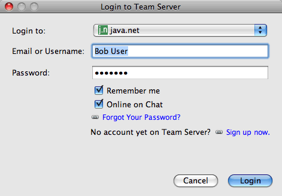
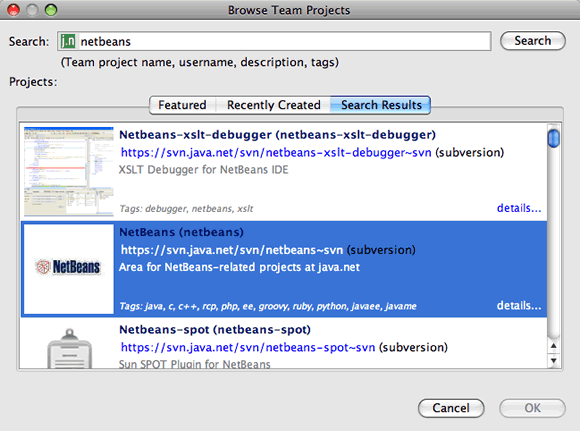

// 
//     Licensed to the Apache Software Foundation (ASF) under one
//     or more contributor license agreements.  See the NOTICE file
//     distributed with this work for additional information
//     regarding copyright ownership.  The ASF licenses this file
//     to you under the Apache License, Version 2.0 (the
//     "License"); you may not use this file except in compliance
//     with the License.  You may obtain a copy of the License at
// 
//       http://www.apache.org/licenses/LICENSE-2.0
// 
//     Unless required by applicable law or agreed to in writing,
//     software distributed under the License is distributed on an
//     "AS IS" BASIS, WITHOUT WARRANTIES OR CONDITIONS OF ANY
//     KIND, either express or implied.  See the License for the
//     specific language governing permissions and limitations
//     under the License.
//

= Working With a Team Server in NetBeans IDE
:jbake-type: tutorial
:jbake-tags: tutorials 
:jbake-status: published
:icons: font
:syntax: true
:source-highlighter: pygments
:toc: left
:toc-title:
:description: Working With a Team Server in NetBeans IDE - Apache NetBeans
:keywords: Apache NetBeans, Tutorials, Working With a Team Server in NetBeans IDE

A Team Server provides various services that are designed to help increase the productivity of developers by providing an infrastructure for developers collaborating on a project. To work with a Team Server, install the Team Server plugin from the NetBeans Update Center. The plugin will automatically register an instance of the link:https://java.net[+java.net+] team server. After you register a Team Server with the IDE, you can take advantage of the services offered by the Team Server for your hosted projects.

== What is a Team Server?

A Team Server can be any online site that uses the Kenai infrastructure to provide project hosting and collaborative tools and services. Each project hosted on a Team Server is represented by a project page that provides a description and details about the project. The project page also enables the project owner to enable and disable the services associated with the project.

For projects hosted on a Team Server, the IDE provides integrated support for the following services.

=== Version Control Systems

A source code management tool is invaluable when a group of developers are working on the same code base. The IDE provides integrated support for version control systems to help developers manage the revisions to the source code in the repository. The NetBeans IDE provides support for working with Mercurial and Subversion repositories hosted on a Team Server. The IDE can automatically create local repositories for hosted projects.

=== Issue Tracking

An issue tracking system enables developers and users to report and track issues associated with a project and provides a valuable feedback mechanism for people involved in the project. The integration of issue tracking systems in the IDE enables developers to find, view and resolve project issues from within the IDE. NetBeans IDE provides integrated support for the Bugzilla and JIRA issue trackers.

=== Instant Messaging and Notifications

If a project on a team server has a chat room enabled, project members can participate in the project's chat room and have private chats with each other. Chat enables members to exchange messages and links from within the IDE. The IDE can receive and display messages, for example, that notify you when there are changes to the project and when there are changes to the repository.

NOTE: The XMPP services for instant messaging and notifications are not currently available for java.net.

== Why Use a Team Server?

Developers who are collaborating on a project require a set of tools and an infrastructure that can help them stay connected to each other and work together as a team. In addition to sharing sources, team members need to be able to share information and communicate with each other, and how they share information depends on the type of information they need to share. Not all team members will use the same tools, but communication between members can be simplified when the infrastructure and tools are integrated. Some members will be developers, but there might also be people responsible for designing the user interface, testing quality, writing documentation, managing the build cycle, etc., each with different requirements and preferences. A Team Server provides a scalable, flexible platform for development that can grow as the project grows.

How a project develops can change over time. In some cases, in particular when starting a project from scratch, you might want to set up the project infrastructure before any coding starts. In other cases, a project might already be started and some code written, but the project has grown in scope and additional people need to be brought in to work on the project. As the size of the team changes, details about the project need to be captured and communicated. Tools such as issue trackers and wiki pages are useful for capturing this type of information.

== Registering a Team Server

To take advantage of Team Server services in the IDE, you need to install the Team Server plugin and then register a Team Server with the IDE. By default, the java.net team server instance is registered when you install the Team Server plugin. To register a new instance of a team server, perform the following steps.

1. Choose Window > Plugins to open the Plugins manager.
2. Select the Available Plugins tab in the Plugins manager and select the Team Server plugin.

image::images/team-plugin.png[title="Team Server plugin selected in Plugins manager"]

. Click Install in the Plugins manager and step through the plugin installation process.

After the Team Server plugin is installed, you can add a new team server instance. The plugin also enabled the Team Dashboard which provides an overview of team projects that you create, open or join.

NOTE: You might need to install additional plugins that are required by the Team Server plugin and restart the IDE.

. Choose Team > Team Server > Add Team Server in the main menu to open the New Team Server dialog box.
. Type the Name and URL of the Team Server. Click Add.

image::images/add-team-server.png[title="Add Team Server dialog"]

NOTE: The IDE will check to confirm that the team server that you are adding is a valid team server instance that is built on the Kenai infrastructure.

In the Services window you can see the new team server is listed under the Team Servers node. The java.net team server is added by default when you install the plugin and is also listed under the Team Servers node.

image::images/services-window.png[title="Team Servers node in Services window"]

You can log in to any registered team server instance by choose Team > Team Server > Login from the main menu. Alternatively, you can right-click the name of the server under the Team Servers node in the Services window and choose Login or click Login in the Team Dashboard.

After you register the Team Server and log in, you can open the Team Dashboard for an overview of your projects and to search for other projects that are hosted on the Team Server. To create projects on a Team Server you must have an account with the Team Server.

[NOTE]
====
* Currently, the only Team Server that is publicly available is *java.net*. The java.net Team Server is registered by default when you install the Team Server plugin. Please see the link:http://java.net[+java.net site+] for details and plans for other Team Server options.
* You need an account at java.net to log in to the java.net team server. However, you can retrieve and open many of the projects that are hosted on java.net without logging in.
====

== Retrieving Sources of a Team Server Project

For many projects that are hosted on the java.net team server you do not need to be a project member or logged in to open the project and retrieve the sources.

1. Choose Team > Team Server > Get Sources from the main menu to open the Get Sources from Team Server wizard.

Alternatively, you can open a Team Server project in the Team Dashboard and then click *get* under the project's Sources node in the Team Dashboard.

. In the Get Sources from Team Server wizard, click Browse to specify the project repository.

image::images/get-sources.png[title="Get Sources from Team Server dialog"]

. In the Browse Team Projects dialog, type a search term and then click Search.

The IDE searches the Team Server instance for projects containing the search terms and displays the results in the dialog box.

. Select a project from the list. Click OK.
. To select a specific folder in the repository, click Browse next to the Folder to Get dropdown list and select a folder in the Browse Repository Folders dialog.

image::images/folder-to-get.png[title="Browse Repository Folders dialog"]

. Specify a location on your local system for the local repository of the sources. Click Get From Team Server.

When you click Get From Team Server, the IDE will create a local repository and retrieve the sources of the project.

After checkout is complete, you will be prompted to open any NetBeans project that were checked out. You can click Open Project in the dialog to select the projects that you would like to open in the IDE. Select Cancel if you do not want to open any of the checked out projects.

xref:../../../community/mailing-lists.adoc[Send Us Your Feedback]

== See Also

For additional information on using NetBeans IDE in a collaborative environment, see the following resources.

* xref:subversion.adoc[+Guided Tour of Subversion+]
* xref:../tools.adoc[+Integration with External Tools and Services Learning Trail+]
* link:http://www.oracle.com/pls/topic/lookup?ctx=nb8000&id=NBDAG348[+Working in a Collaborative Environment+] in _Developing Applications with NetBeans IDE_
