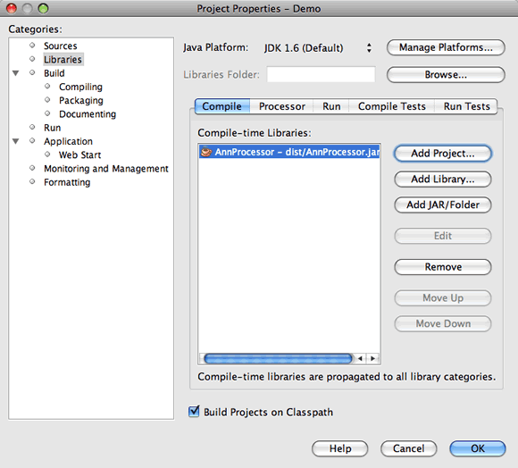
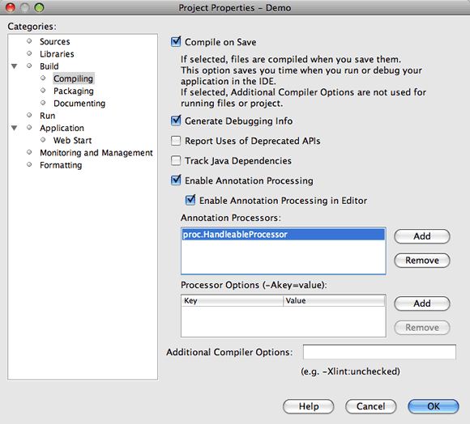

// 
//     Licensed to the Apache Software Foundation (ASF) under one
//     or more contributor license agreements.  See the NOTICE file
//     distributed with this work for additional information
//     regarding copyright ownership.  The ASF licenses this file
//     to you under the Apache License, Version 2.0 (the
//     "License"); you may not use this file except in compliance
//     with the License.  You may obtain a copy of the License at
// 
//       http://www.apache.org/licenses/LICENSE-2.0
// 
//     Unless required by applicable law or agreed to in writing,
//     software distributed under the License is distributed on an
//     "AS IS" BASIS, WITHOUT WARRANTIES OR CONDITIONS OF ANY
//     KIND, either express or implied.  See the License for the
//     specific language governing permissions and limitations
//     under the License.
//

= NetBeans IDEでの注釈プロセッサのサポート、パートII: IDEでの独自のカスタム注釈プロセッサの使用
:jbake-type: tutorial
:jbake-tags: tutorials 
:jbake-status: published
:icons: font
:syntax: true
:source-highlighter: pygments
:toc: left
:toc-title:
:description: NetBeans IDEでの注釈プロセッサのサポート、パートII: IDEでの独自のカスタム注釈プロセッサの使用 - Apache NetBeans
:keywords: Apache NetBeans, Tutorials, NetBeans IDEでの注釈プロセッサのサポート、パートII: IDEでの独自のカスタム注釈プロセッサの使用

_執筆: Jesse Glick、執筆および管理: Irina Filippova_

* *IDEでの独自のカスタム注釈プロセッサの使用*

image::../../../images_www/articles/71/netbeans-stamp-71-72-73.png[title="このページの内容は、NetBeans IDE 7.0、7.1、7.2および7.3に適用されます"]

チュートリアルのこの項では、ユーザーが自身で記述したカスタム注釈プロセッサをIDEのプロジェクトに追加する方法を学習します。このチュートリアルでは注釈プロセッサの記述方法については扱いません。NetBeans IDEプロジェクトに追加する方法を説明します。

この項で使用されているサンプル・アプリケーションはJesse Glick氏によって作成され、以前のIDEリリースのlink:http://wiki.netbeans.org/FaqApt[+FAQエントリ+]として公開されました。

例として使用されている注釈プロセッサは、注釈付きクラスの親クラスを生成します。生成された親クラスには、注釈付きクラスからコールされるメソッドも含まれています。次の手順に従って、カスタム注釈プロセッサを作成し、IDEのプロジェクトに追加します。

*このチュートリアルを完了するには、次のソフトウェアとリソースが必要です。*

|===
|ソフトウェアまたはリソース |必須バージョン 

|link:https://netbeans.org/downloads/index.html[+NetBeans IDE+] |7.0, 7.1, 7.2, 7.3 

|link:http://www.oracle.com/technetwork/java/javase/downloads/index.html[+Java Development Kit (JDK)+] |バージョン6または7 

|link:http://code.google.com/p/projectlombok/downloads/list[+lombok.jar+] |v1.12.4以降 
|===

== 注釈の定義および注釈プロセッサの作成

この課題では、クラス・ライブラリ・プロジェクトを作成します。

1. 「ファイル」>「新規プロジェクト」を選択し、「Java」カテゴリで「Javaクラス・ライブラリ」プロジェクト・タイプを選択します。「次」をクリックします。
2. 「プロジェクト名」として* ``「AnnProcessor」`` *と入力し、プロジェクトの場所を指定します。「終了」をクリックします。

「終了」をクリックすると、IDEによってクラス・ライブラリ・プロジェクトが作成され、そのプロジェクトが「プロジェクト」ウィンドウに表示されます。

. 「プロジェクト」ウィンドウで「AnnProcessor」プロジェクト・ノードを右クリックし、「プロパティ」を選択します。

. 「ソース」カテゴリで、ソース/バイナリ形式としてJDK 6またはJDK 7が指定されていることを確認します。

. 「ライブラリ」タブを選択し、「Javaプラットフォーム」がJDK 1.6またはJDK 1.7またはに設定されていることを確認します。「OK」をクリックして、「プロジェクト・プロパティ」ウィンドウを閉じます。

この課題では、2つのJavaパッケージを作成し、各パッケージ内に1つのJavaクラスを作成します。

1. 「AnnProcessor」プロジェクト・ノードで「ソース・パッケージ」ノードを右クリックし、「新規」>「Javaパッケージ」を選択します。
2. パッケージ名に* ``「ann」`` *と入力して「終了」をクリックし、新しいJavaパッケージを作成します。
3. 前の2つのステップを繰り返して* ``proc`` *という名前のJavaパッケージを作成します。

2つのJavaパッケージを作成すると、プロジェクトの構造は次のイメージのようになるはずです。

image::images/packages.png[title="注釈プロセッサのプロジェクトの構造。"]

. 「 ``ann`` 」Javaパッケージを右クリックし、「新規」>「Javaクラス」を選択します。

. 「クラス名」に「* ``Handleable`` *」と入力します。「終了」をクリックします。

. 新しい ``Handleable.java`` ファイルを編集して、次の変更を加えます。ファイルを保存します。

[source,java]
----

package ann;

public *@interface* Handleable {

}
----

これは注釈を宣言するための方法であり、インタフェースの宣言と非常によく似ています。異なるのは、 ``interface`` キーワードの前に ``at`` 記号(@)が必要であることです。この注釈は ``Handleable`` と呼ばれます。

*追加情報: *注釈宣言では、注釈を付けることができる要素のタイプ(例: クラス、メソッド)などの追加のパラメータを指定することもできます。これを行うには、 ``@Target(value = {ElementType.TYPE})`` (クラスの場合)および ``@Target(value = {ElementType.METHOD})`` を追加します。つまり、注釈宣言は、自身に_meta-annotations_で注釈が付けられます。

ここで、 ``Handleable`` 注釈を処理する注釈プロセッサのコードを追加する必要があります。

. 「* ``proc`` *」Javaパッケージを右クリックし、「新規」>「Javaクラス」を選択します。

. 「クラス名」に「* ``HandleableProcessor`` *」と入力します。「終了」をクリックします。

.  ``HandleableProcessor.java`` クラスを変更して次のコードを追加します。変更を保存します。

*注意:* ``@SupportedSourceVersion``  (*太字*)の値は使用しているJDKのバージョンによって異なり、 ``(SourceVersion.RELEASE_7)`` または ``(SourceVersion.RELEASE_6)`` になります。

[source,java]
----

package proc;

import ann.Handleable;
import java.io.IOException;
import java.io.PrintWriter;
import java.io.Writer;
import java.util.Set;
import javax.annotation.processing.AbstractProcessor;
import javax.annotation.processing.RoundEnvironment;
import javax.annotation.processing.SupportedAnnotationTypes;
import javax.annotation.processing.SupportedSourceVersion;
import javax.lang.model.SourceVersion;
import javax.lang.model.element.Element;
import javax.lang.model.element.ElementKind;
import javax.lang.model.element.TypeElement;
import javax.lang.model.type.TypeMirror;
import javax.tools.Diagnostic;
import javax.tools.JavaFileObject;

@SupportedAnnotationTypes("ann.Handleable")
@SupportedSourceVersion(*SourceVersion.RELEASE_7*)
public class HandleableProcessor extends AbstractProcessor {

    /** public for ServiceLoader */
    public HandleableProcessor() {
    }

    public boolean process(Set<? extends TypeElement> annotations,
            RoundEnvironment roundEnv) {
        for (Element e : roundEnv.getElementsAnnotatedWith(Handleable.class)) {
            if (e.getKind() != ElementKind.FIELD) {
                processingEnv.getMessager().printMessage(
                        Diagnostic.Kind.WARNING,
                        "Not a field", e);
                continue;
            }
            String name = capitalize(e.getSimpleName().toString());
            TypeElement clazz = (TypeElement) e.getEnclosingElement();
            try {
                JavaFileObject f = processingEnv.getFiler().
                        createSourceFile(clazz.getQualifiedName() + "Extras");
                processingEnv.getMessager().printMessage(Diagnostic.Kind.NOTE,
                        "Creating " + f.toUri());
                Writer w = f.openWriter();
                try {
                    PrintWriter pw = new PrintWriter(w);
                    pw.println("package "
                            + clazz.getEnclosingElement().getSimpleName() + ";");
                    pw.println("public abstract class "
                            + clazz.getSimpleName() + "Extras {");
                    pw.println("    protected " + clazz.getSimpleName()
                            + "Extras() {}");
                    TypeMirror type = e.asType();
                    pw.println("    /** Handle something. */");
                    pw.println("    protected final void handle" + name
                            + "(" + type + " value) {");
                    pw.println("        System.out.println(value);");
                    pw.println("    }");
                    pw.println("}");
                    pw.flush();
                } finally {
                    w.close();
                }
            } catch (IOException x) {
                processingEnv.getMessager().printMessage(Diagnostic.Kind.ERROR,
                        x.toString());
            }
        }
        return true;
    }

    private static String capitalize(String name) {
        char[] c = name.toCharArray();
        c[0] = Character.toUpperCase(c[0]);
        return new String(c);
    }
}
----

ここで、注釈プロセッサのコードを構成する主要な部分について少し詳しく見てみます(便宜上、コードの一部しか示されていないことに注意してください)。

最初に、注釈プロセッサでサポートされている注釈型( ``@SupportedAnnotationTypes`` を使用)と、サポートされているソース・ファイルのバージョン( ``@SupportedSourceVersion`` を使用。この場合のバージョンはJDK 6)を指定します。

[source,java]
----

@SupportedAnnotationTypes("ann.Handleable")
@SupportedSourceVersion(SourceVersion.RELEASE_6)
----

次に、 ``javax.annotation.processing`` パッケージの ``AbstractProcessor`` クラスを拡張する、このプロセッサのための公開クラスを宣言します。 ``AbstractProcessor`` は、注釈を処理するために必要なメソッドを含む、具象注釈プロセッサの標準スーパー・クラスです。

[source,java]
----

public class HandleableProcessor extends AbstractProcessor {
...
}
----

ここで、このクラスのpublicコンストラクタを指定する必要があります。

[source,java]
----

public class HandleableProcessor extends AbstractProcessor {
*    public HandleableProcessor() {
    }*
...

}
----

次に、親 ``AbstractProcessor`` クラスの ``process`` ()メソッドをコールします。このメソッドを通して、処理対象の注釈が提供されます。また、このメソッドには、処理のラウンドについての情報も含まれています。

[source,java]
----

public class HandleableProcessor extends AbstractProcessor {*
   *...
*     public boolean process(Set<? extends TypeElement> annotations,
            RoundEnvironment roundEnv) {
     ...
     }
*
}
----

注釈プロセッサのロジックは、 ``AbstractProcessor`` クラスの ``process()`` メソッド内に含まれています。 ``AbstractProcessor`` を通して ``ProcessingEnvironment`` のインタフェースにもアクセスすることにより、注釈プロセッサはFiler(注釈プロセッサが新しいファイルを作成できるようになるファイラ・ハンドラ)やMessager(注釈プロセッサがエラーを報告する手段)のような複数の便利な機能を使用できるようになります。

[source,java]
----

public class HandleableProcessor extends AbstractProcessor {*
   *...
     public boolean process(Set<? extends TypeElement> annotations,
            RoundEnvironment roundEnv) {//For each element annotated with the Handleable annotation
            *for (Element e : roundEnv.getElementsAnnotatedWith(Handleable.class)) {

*//Check if the type of the annotated element is not a field. If yes, return a warning*.
if (e.getKind() != ElementKind.FIELD) {
processingEnv.getMessager().printMessage(
Diagnostic.Kind.WARNING,
"Not a field", e);
continue;
}
            *//Define the following variables: name and clazz*.**
String name = capitalize(e.getSimpleName().toString());
TypeElement clazz = (TypeElement) e.getEnclosingElement();
*//Generate a source file with a specified class name. *
            try {
JavaFileObject f = processingEnv.getFiler().
createSourceFile(clazz.getQualifiedName() + "Extras");
processingEnv.getMessager().printMessage(Diagnostic.Kind.NOTE,
"Creating " + f.toUri());
Writer w = f.openWriter();
*//Add the content to the newly generated file*.
                    try {
PrintWriter pw = new PrintWriter(w);
pw.println("package "
+ clazz.getEnclosingElement().getSimpleName() + ";");
pw.println("public abstract class "
+ clazz.getSimpleName() + "Extras {");
pw.println("    protected " + clazz.getSimpleName()
+ "Extras() {}");
TypeMirror type = e.asType();
pw.println("    /** Handle something. */");
pw.println("    protected final void handle" + name
+ "(" + type + " value) {");
pw.println("        System.out.println(value);");
pw.println("    }");
pw.println("}");
pw.flush();
} finally {
w.close();
}
} catch (IOException x) {
processingEnv.getMessager().printMessage(Diagnostic.Kind.ERROR,
x.toString());
}
}*return true;
    * }*
...
}
----

このコードの最後のブロックでは、注釈付き要素の名前を大文字にするために使用される ``capitalize`` メソッドを宣言しています。

[source,java]
----

public class HandleableProcessor extends AbstractProcessor {*
   *...*

  private static String capitalize(String name) {
char[] c = name.toCharArray();
c[0] = Character.toUpperCase(c[0]);
return new String(c);
}
*}
----

. 「 ``AnnProcessor`` 」プロジェクトを右クリックし、「ビルド」を選択することによってプロジェクトをビルドします。

== IDEでの注釈プロセッサの使用

この項では、注釈プロセッサが使用されるJavaアプリケーション・プロジェクトを作成します。

1. 「ファイル」>「新規プロジェクト」を選択し、「Java」カテゴリで「Javaアプリケーション」プロジェクト・タイプを選択します。「次」をクリックします。
2. 名前と場所ページで、「プロジェクト名」として* ``「Demo」`` *と入力し、プロジェクトの場所を指定します。
3. 「メイン・クラスの作成」フィールドに「* ``demo.Main`` *」と入力します。「終了」をクリックします。

image::images/demo-project-wizard.png[title="新規プロジェクト・ウィザードでのDemoプロジェクトの作成。"]

. 「プロジェクト・プロパティ」ウィンドウを開き、「ソース」パネルでソース/バイナリ形式としてJDK 6またはJDK 7が選択されていること、および「ライブラリ」パネルで「Javaプラットフォーム」がJDK 1.6またはJDK 1.7に設定されていることを確認します。

.  ``Main.java`` クラスを変更して次のコードを追加します。変更を保存します。

[source,java]
----

package demo;

*import ann.Handleable;*

public class Main *extends MainExtras* {

    *@Handleable
    private String stuff;*

    *public static void main(String[] args) {
        new Main().handleStuff("hello");
    }*
}
----

このコードには、次の要素が含まれています。

* カスタム注釈プロセッサ ``ann.Handleable`` のインポート文
*  ``MainExtras`` クラスを拡張する公開クラス ``Main``  ( ``MainExtras`` は、コンパイル中にこの注釈プロセッサによって生成される)
*  ``@Handleable`` 注釈が付いている ``stuff`` という名前のprivateフィールド
* 自動的に生成された ``MainExtras`` クラスで宣言されている、 ``handleStuff`` メソッドをコールする ``main`` メソッド

この単純な例では、 ``handleStuff`` メソッドは現在の値の出力のみを行います。他のタスクを行うように、このメソッドを変更できます。

 ``Main.java`` コードを保存した後、IDEによって複数のコンパイル・エラーが報告されたことが表示されます。これは、まだこのプロジェクトに注釈プロセッサが追加されていないためです。

. 「プロジェクト・プロパティ」ウィンドウで ``「Demo」`` プロジェクト・ノードを右クリックし、「プロパティ」を選択した後、「プロパティ」ウィンドウで「ライブラリ」カテゴリを選択します。

. 「コンパイル」タブで「プロジェクトの追加」をクリックし、「 ``AnnProcessor`` 」プロジェクトを指定します。

「コンパイル」タブは、link:http://download.oracle.com/javase/6/docs/technotes/tools/windows/javac.html#options[+Javaコンパイラ+]の ``-classpath`` オプションに相当します。この注釈プロセッサは、注釈定義と注釈プロセッサの両方を含む単一のJARファイルであるため、これをプロジェクトのクラスパス(つまり「コンパイル」タブ)に追加する必要があります。

. 「プロジェクト・プロパティ」ウィンドウで「コンパイル」カテゴリを選択し、「注釈処理を有効にする」および「エディタでの注釈処理を有効にする」チェックボックスを選択します。

. 「注釈プロセッサ」テキスト領域の横にある「追加」ボタンをクリックし、「注釈プロセッサFQN」フィールドに * ``「proc.HandleableProcessor」`` *と入力することによって、実行する注釈プロセッサを指定します。

image::images/demo-processor-fqn.png[title="「注釈プロセッサFQN」ダイアログ・ボックス"]

「プロジェクト・プロパティ」ウィンドウ内の「コンパイル」カテゴリは、次のイメージのように表示されるはずです。

. 「プロパティ」ウィンドウで「OK」をクリックします。

*注意:* ``Main.java`` ファイルでは、依然としてコンパイル・エラーが表示される場合があります。これは、 ``handleStuff`` メソッドを宣言している ``MainExtras.java`` ファイルを、IDEがまだ認識できていないためです。 ``MainExtras.java`` ファイルは、最初にDemoプロジェクトをビルドした後で生成されます。プロジェクトで「保存時にコンパイル」が有効になっている場合は、 ``Main.java`` を保存したときにIDEがプロジェクトをコンパイルしました。

. 「Demo」プロジェクトを右クリックし、「ビルド」を選択します。

プロジェクトをビルドした後に「プロジェクト」ウィンドウでそのプロジェクトを見ると、新しい ``「生成されたソース」`` ノードが ``demo/MainExtras.java`` ファイルとともに表示されます。

image::images/demo-generated-sources.png[title="生成されたソースが表示された「プロジェクト」ウィンドウ"]

生成された ``MainExtras.java`` ファイルの内容を確認すると、注釈プロセッサが ``handleStuff`` メソッドを使用して ``MainExtras`` クラスを生成したことがわかります。 ``handleStuff`` メソッドは、注釈付きの ``Main.java`` ファイルから呼び出されるメソッドです。

[source,java]
----

package demo;
public abstract class MainExtras {
    protected MainExtras() {}
    /** Handle something. */
    protected final void handleStuff(java.lang.String value) {
        System.out.println(value);
    }
}
----

. 「Demo」プロジェクトを右クリックし、「実行」を選択します。

「実行」をクリックすると、「出力」ウィンドウに次が表示されるはずです。Demoプロジェクトがコンパイルされ、メッセージが出力されます。

image::images/demo-run.png[title="生成されたソースが表示された「プロジェクト」ウィンドウ"]

link:/about/contact_form.html?to=3&subject=Feedback:%20Using%20the%20Annotation%20Processors%20Support%20in%20NetBeans%20IDE[+このチュートリアルに関するご意見をお寄せください+]

== 関連項目

Javaアプリケーションでの注釈の詳細は、次のリソースを参照してください。

* Java SEのドキュメント - link:http://download.oracle.com/javase/6/docs/technotes/guides/language/annotations.html[+注釈+]
* Java SEのチュートリアル - link:http://download.oracle.com/javase/tutorial/java/javaOO/annotations.html[+注釈+]
* link:http://download.oracle.com/javase/6/docs/technotes/tools/windows/javac.html#processing[+Javaコンパイラ: 注釈処理のオプション+]
* link:http://blogs.oracle.com/darcy/[+Joseph D. Darcy氏のブログ+] - JSR-269仕様リードによる役立つヒント
