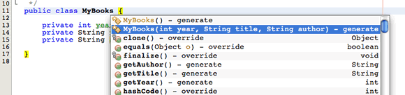
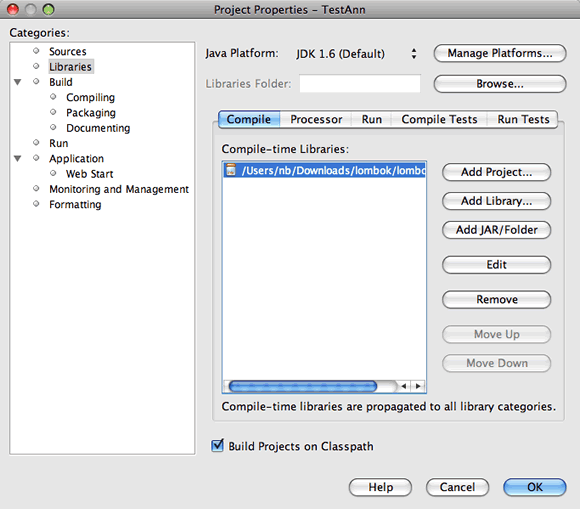
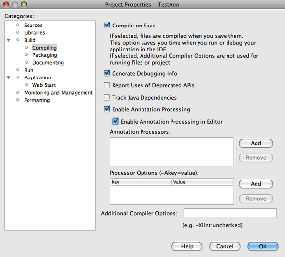
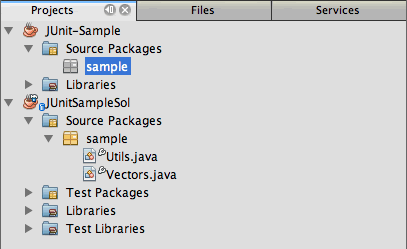
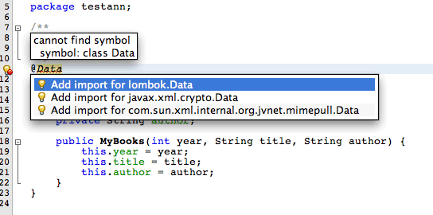
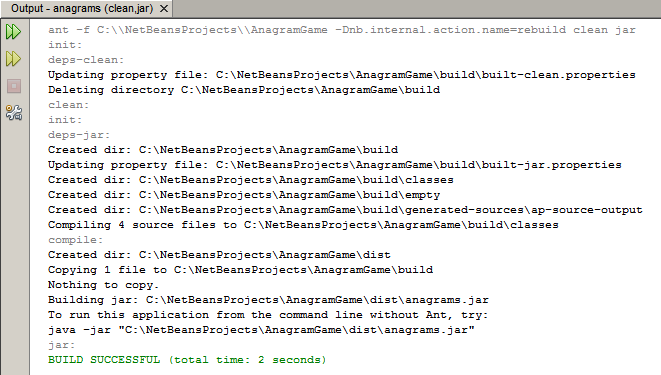

// 
//     Licensed to the Apache Software Foundation (ASF) under one
//     or more contributor license agreements.  See the NOTICE file
//     distributed with this work for additional information
//     regarding copyright ownership.  The ASF licenses this file
//     to you under the Apache License, Version 2.0 (the
//     "License"); you may not use this file except in compliance
//     with the License.  You may obtain a copy of the License at
// 
//       http://www.apache.org/licenses/LICENSE-2.0
// 
//     Unless required by applicable law or agreed to in writing,
//     software distributed under the License is distributed on an
//     "AS IS" BASIS, WITHOUT WARRANTIES OR CONDITIONS OF ANY
//     KIND, either express or implied.  See the License for the
//     specific language governing permissions and limitations
//     under the License.
//

= Annotations, Part I: Using Project Lombok for Custom Annotations
:jbake-type: tutorial
:jbake-tags: tutorials 
:jbake-status: published
:icons: font
:syntax: true
:source-highlighter: pygments
:toc: left
:toc-title:
:description: Annotation Processors Support in the NetBeans IDE, Part I: Using Project Lombok - Apache NetBeans
:keywords: Apache NetBeans, Tutorials, Annotation Processors Support in the NetBeans IDE, Part I: Using Project Lombok

To demonstrate how custom annotations work inside the NetBeans IDE, we will use Project Lombok, which provides a convenient way of automatically generating several Java code elements, such as getters, setters, constructors and others. For more information about its features, visit the link:http://projectlombok.org/[+Project Lombok's website+]. However, keep in mind that Project Lombok includes some features that might not work in all development environments.

== Requirements

To complete this tutorial, you need the following software and resources.

[cols="3,1"]
|===
|Software or Resource |Version Required 

|link:https://netbeans.org/download/index.html[+NetBeans IDE+] | 9.0 or later

|link:http://www.oracle.com/technetwork/java/javase/downloads/index.html[+Java Development Kit (JDK)+] |version 7 or 8 

|link:http://code.google.com/p/projectlombok/downloads/list[+lombok.jar+] |v1.12.4 or newer 
|===

== Creating a New Java project

In this exercise you create a simple Java project and class that is named  ``MyBooks.java``  which will demonstrate annotations in action.

1. Choose _File > New Project_ from the main menu to open the New Project wizard.
2. Select the Java Application project type in the Java category. Click Next.
3. In the Name and Location page of the wizard, type ``TestAnn`` as the project name.
4. Type ``testann.TestBooks`` in the Create Main Class field to replace the default class name. Click Finish.

image::images/newproj.png[title="Creating a new Java project in the NetBeans IDE"]

When you click Finish, the IDE creates the Java application project and opens the  ``TestBooks.java``  class in the editor. You can see that the new project is now visible in the Projects window and that the  ``TestBooks.java``  class is in the  ``testann``  package under the Source Packages node.

. Right-click the  ``testann``  package node in the Projects window and choose New > Java class.

. Type ``MyBooks`` for the Class Name and confirm that the class will be created in the  ``testann``  package. Click Finish.

When you click Finish the IDE opens the new class in the editor.

. In the source editor, add the following three fields to  ``MyBooks.java`` .

[source,java]
----

package testann;

public class MyBooks {   
    *private int year; //fields
    private String title;
    private String author;*

}
----

. Place your insert cursor in the class declaration and press Ctrl-Space to invoke the editor's code completion support.

. Select  ``MyBooks (int year, String title, String author) - generate``  in the code completion list to generate a constructor for  ``MyBooks.java`` .

. Save your changes.

== Enabling Custom Annotations (lombok.jar) for the Project

In this exercise you will modify the project's properties window to add a library to the project's classpath and enable annotation processing in the editor.

1. Download the link:http://code.google.com/p/projectlombok/downloads/list[+lombok.jar+] file and save it on your system.
2. Right-click the  ``TestAnn``  project's node and choose Properties.
3. Select the Libraries category in the Project Properties dialog.
4. Click Add JAR/Folder in the Compile tab and locate the  ``lombok.jar``  file that you downloaded.

The resources added on the Compile tab correspond to the  ``-classpath``  option of the link:http://download.oracle.com/javase/6/docs/technotes/tools/windows/javac.html#options[+Java compiler+]. As  ``lombok.jar``  is a single JAR file that contains both annotation definitions and annotation processors, you should add it to the project's classpath, which is the Compile tab.

. Choose the Compiling category in the Project Properties window.

. Confirm that the Enable Annotation Processing checkbox is selected (it is enabled by default) and select the Enable Annotation Processing in Editor checkbox.

The Enable Annotation Processing checkbox enables annotation processing while building and compiling your project. If the checkbox is not selected, the  ``-proc:none``  option is passed to the Java compiler, and compilation takes places without any annotation processing. So, if you want to process annotations in your code, the Enable Annotation Processing checkbox must be selected.

By selecting the Enable Annotation Processing in Editor checkbox, you make annotation processing results visible in the editor. Any additional artifacts that are generated by annotation processors (classes, methods, fields, etc.) become visible in the IDE Editor and available in code completion, Navigator, GoTo Type, Find usages, and others.

. Click OK in the Project Properties window and return to the  ``MyBooks.java``  file.

If you expand the Libraries node in the Projects window, you can see that  ``lombok.jar``  is now listed as a project library.

== Writing an Application Using Lombok Custom Annotations

1. In  ``MyBooks.java``  file, type  ``@Data``  before the  ``MyBooks``  class declaration.  ``@Data``  is an annotation that generates the boilerplate code for Java classes: getters for all fields, setters for all non-final fields, and appropriate  ``toString`` ,  ``equals`` , and  ``hashCode``  implementations that involve the fields of the class.

To learn more about what annotations are supported by Project Lombok, refer to the Lombok link:http://projectlombok.org/features/index.html[+Features Overview+].

. Click the hint in the editor's left margin and add import for  ``lombok.Data`` .

The resulting code in the Editor should look like the example below.

[source,java]
----

package testann;

import lombok.Data;

@Data
public class MyBooks {

    private int year; //fields
    private String title;
    private String author;

    public MyBooks(int year, String title, String author) {
        this.year = year;
        this.title = title;
        this.author = author;
    }
}
----

Note that necessary code artifacts, such as getters, setters, toString, etc, have been generated and you can see them in the Navigator window. The  ``@Data``  annotation generated all the boilerplate code that is needed for a typical class.

image::images/nav.png[title="Navigator window showing project members"]

You can also invoke the code completion window (Ctrl-Space) and see that the generated artifacts are available for picking them. Now, let's see that the project compiles and the generated artifacts can be called from other parts of the program.

. Open the  ``TestBooks.java``  file with the _main_ method and add the following code (in bold) to create a new object of the  ``MyBooks``  class.

[source,java]
----

package testann;

public class TestBooks {

    public static void main(String[] args) {
        *MyBooks books = new MyBooks(2009, "My Beautiful Dream", "John Smith");*
    }
}
----

. Add the following code to print out the values of the  ``books``  variable.

To return the values, we call the getter methods that were auto-generated by  ``lombok.jar`` . While you are typing, note that the auto-generated artifacts are available from the code completion window.

[source,java]
----

package testann;

public class TestBooks {

    public static void main(String[] args) {
        MyBooks books = new MyBooks(2009, "My Beautiful Dream", "John Smith");
        *System.out.println("Year: " + books.getYear() + ", Title: " + books.getTitle() +  ", Author: " + books.getAuthor());*
    }
}
----

. Save your changes.

. Right-click the project node in the Projects window and choose Run (F6).

When you run the application you should see the following output that shows that the application compiled successfully.

You can see that the artifacts generated by the Lombok annotation processor are accessible from other parts of the program.

== Next Step

* xref:annotations-custom.adoc[+Part II: Using Own Custom Annotation Processor in the IDE+]
* Java SE Documentation - link:http://download.oracle.com/javase/6/docs/technotes/guides/language/annotations.html[+Annotations+]
* Java SE Tutorial - link:http://download.oracle.com/javase/tutorial/java/javaOO/annotations.html[+Annotations+]

