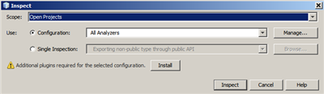
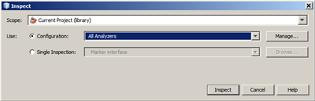
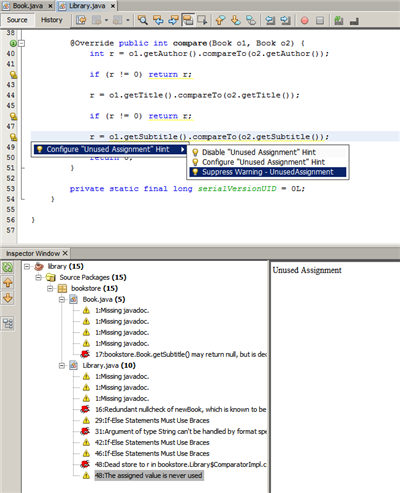
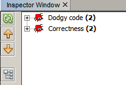
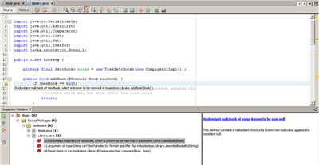
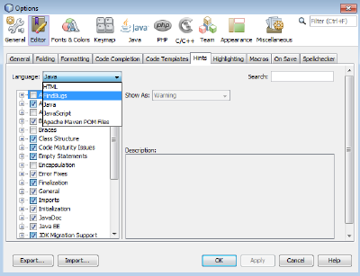
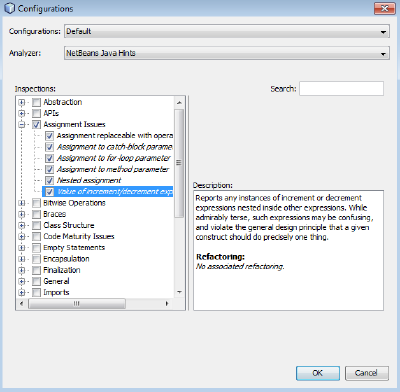
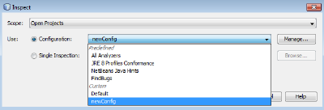
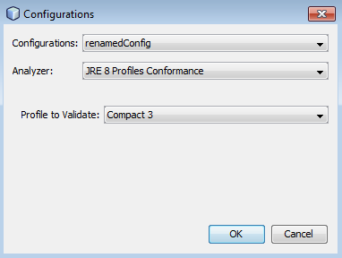

// 
//     Licensed to the Apache Software Foundation (ASF) under one
//     or more contributor license agreements.  See the NOTICE file
//     distributed with this work for additional information
//     regarding copyright ownership.  The ASF licenses this file
//     to you under the Apache License, Version 2.0 (the
//     "License"); you may not use this file except in compliance
//     with the License.  You may obtain a copy of the License at
// 
//       http://www.apache.org/licenses/LICENSE-2.0
// 
//     Unless required by applicable law or agreed to in writing,
//     software distributed under the License is distributed on an
//     "AS IS" BASIS, WITHOUT WARRANTIES OR CONDITIONS OF ANY
//     KIND, either express or implied.  See the License for the
//     specific language governing permissions and limitations
//     under the License.
//

= NetBeans IDE Javaエディタでの静的コード分析
:jbake-type: tutorial
:jbake-tags: tutorials 
:jbake-status: published
:icons: font
:syntax: true
:source-highlighter: pygments
:toc: left
:toc-title:
:description: NetBeans IDE Javaエディタでの静的コード分析 - Apache NetBeans
:keywords: Apache NetBeans, Tutorials, NetBeans IDE Javaエディタでの静的コード分析

Jan Lahoda、Alyona Stashkova

NetBeans IDE Javaエディタには、ソース・コード内の潜在的な問題を検索して不整合を検出するツールとして、静的コード分析機能があります。

このチュートリアルでは、アプリケーションを実際には実行せずに、FindBugsおよびNetBeans Javaヒントを使用してJavaコードの静的分析を実行する方法を学習します。

== 内容

* <<setup,チュートリアルの環境の設定>>
* <<config,構成の使用>>
* <<all,「すべてのアナライザ」の実行>>
* <<hints,NetBeans Javaヒントに対するJavaコードの確認>>
* <<fb,FindBugsによるJavaコード内の潜在的な問題の検索>>
* <<default,「デフォルト」構成のカスタマイズ>>
* <<create,構成の作成と削除>>
* <<inspect,単一の検査の実行>>
* <<summary,サマリー>>
* <<seealso,関連項目>>

== 要件

*このチュートリアルを完了するには、次のソフトウェアとリソースが必要です。*

|===
|ソフトウェアまたはリソース |必須バージョン 

|link:http://netbeans.org/downloads/index.html[+NetBeans IDE+] |バージョン8.0 

|link:http://www.oracle.com/technetwork/java/javase/downloads/index.html[+Java Development Kit+] (JDK) |バージョン7以降 

|link:https://netbeans.org/projects/samples/downloads/download/Samples/Java/library.zip[+library.zip+] |NetBeansプロジェクト 

|link:http://repo1.maven.org/maven2/com/google/code/findbugs/jsr305/2.0.0/jsr305-2.0.0.jar[+jsr305-2.0.0.jar+] |静的分析ツールの効率を向上させるためのJava Specification Request 
|===

*注意:*  ``jsr305-2.0.0.jar`` は、このチュートリアルの目的のために ``library.zip`` 内に含まれています。

別のNetBeansプロジェクトを使用中の場合、link:http://repo1.maven.org/maven2/com/google/code/findbugs/jsr305/2.0.0/jsr305-2.0.0.jar[+jsr305-2.0.0.jar+]をダウンロードし、次の手順に従って、IDEのプロジェクトの「ライブラリ」フォルダに追加します。

1. 「ライブラリ」フォルダを右クリックし、ポップアップ・メニューから「JAR/フォルダの追加」を選択します。
2. 「JAR/フォルダの追加」ダイアログ・ボックスで、ダウンロードされた ``jsr305-2.0.0.jar`` ファイルのパスを指定し、「開く」をクリックします。

image::images/jar.png[]

== チュートリアルの環境の設定

前出の一覧表示された必須ソフトウェアに加え、次のものもコンピュータにインストールしておくようにしてください。

* link:https://netbeans.org/projects/samples/downloads/download/Samples/Java/library.zip[+library.zip+]ファイルをNetBeansプロジェクト・フォルダに解凍し、NetBeans IDEで開きます。
* FindBugsプラグインをダウンロードし、次の手順でNetBeans IDEにインストールする必要があります。
1. IDEのメイン・メニューから「ソース」>「検査」を選択します。
2. 「検査」ダイアログ・ボックスで、「インストール」をクリックします。

[.feature]
--

--

. 「インストーラ」ダイアログ・ボックスで「次」をクリックし、インストールを続行します。

[.feature]
--

image::images/plugin-small.png[role="left", link="images/plugin.png"]

--

. ライセンス契約を確認し、ライセンス契約オプションを選択して、「インストール」をクリックします。

. インストールが完了したら、「終了」をクリックします。

== 事前定義された構成の使用

NetBeans IDEでコードを検査するとき、事前定義された次の構成を使用できます。

* <<all,すべてのアナライザ>>
* <<hints,NetBeans Javaヒント>>
* <<fb,FindBugs>>
* <<default,デフォルト>>

=== 「すべてのアナライザ」の実行

「 ``すべてのアナライザ`` 」構成によって、IDEで使用可能なすべての静的コード分析ツールがデプロイされます。

*「 ``すべてのアナライザ`` 」構成を実行するには:*

1. IDEのメイン・ツールバーから「ソース」>「検査」を選択します。
2. 「検査」ダイアログ・ボックスの「スコープ」ドロップダウン・リストで、「 ``現在のプロジェクト(library)`` 」を選択します。
3. 「構成」ドロップダウン・リストで、「 ``すべてのアナライザ`` 」構成を選択します。

[.feature]
--

--

*注意:* この構成を最初に実行する前に、<<plugin,FindBugs>>プラグインをインストールする必要があります。

. 「検査」をクリックします。
分析の結果が「インスペクタ・ウィンドウ」の左にツリー・ビューとして表示されます。

[.feature]
--

image::images/all-small.png[role="left", link="images/all.png"]

--

右には、ツリー・ビューで現在選択されている項目の説明が表示されます。

[.feature]
--

image::images/alldescription-small.png[role="left", link="images/alldescription.png"]

--

*注意:* コードの一部が問題ありと報告され、そのコードを変更せずにそのまま使用する場合、IDEでは、このコードに対する警告を抑制できます。「インスペクタ・ウィンドウ」のツリー・ビューの警告をダブルクリックし、ソース・エディタに移動します。[Alt]-[Enter]を押し、表示されたヒントの末尾にある黒い右矢印をクリックして、「 ``警告の抑制 - _(警告名)_`` 」を選択します。

[.feature]
--

--

=== NetBeans Javaヒントに対するJavaコードの確認

IDEで使用可能な「 ``NetBeans Javaヒント`` 」構成を使用すると、対象のソース・コードが、事前定義されたコーディング標準ルールを満たしているかどうかを確認できます。つまり、一連のNetBeans Javaヒント(コード検査とも呼ばれます)をJavaソース・ファイルに適用します。

*「 ``NetBeans Javaヒント`` 」構成を実行するには:*

1. IDEのメイン・ツールバーから「ソース」>「検査」を選択します。
2. 「検査」ダイアログ・ボックスの「スコープ」ドロップダウン・リストで、「 ``開いているプロジェクト`` 」(1つの ``library`` プロジェクトのみがIDEで開いている場合)、または「 ``現在のプロジェクト(library)`` 」を選択します。

*注意:* 「 ``NetBeans Javaヒント`` 」構成のスコープ(ファイル、パッケージ、またはプロジェクト)を定義できます。

. 「構成」ラジオ・ボタンを選択し、ドロップダウン・リストで「 ``NetBeans Javaヒント`` 」を選択します。

[.feature]
--

image::images/hints-small.png[role="left", link="images/hints.png"]

--

. 「検査」をクリックします。
IDEでは、「インスペクタ・ウィンドウ」内のツリー・ビューに、「 ``NetBeans Javaヒント`` 」構成を使用した分析の結果が表示されます。

image::images/hintsconfig.png[]

. 「インスペクタ」ウィンドウで、左のツールバーの<<categorize,カテゴリ化>>ボタンをクリックし、カテゴリにグループ化された問題を表示します。

image::images/catview.png[]

次の表に、「インスペクタ・ウィンドウ」で使用可能なコマンドを示します。
|===

|アイコン |名前 |機能 

| |*リフレッシュ* |静的分析結果のリフレッシュされたリストを表示します。 

|image:images/upbutton.png[] |*前の問題* |静的分析結果リスト内の前の問題を表示します。 

|image:images/downbutton.png[] |*次の問題* |静的分析結果リスト内の次の問題を表示します。 

|image:images/categorizebutton.png[] |
*カテゴリ化* |ファイル、プロジェクト、またはパッケージ内で検出された問題の縮小したビューと、検出されたすべての問題をカテゴリ化したビューを切り替えます。 
|===

=== FindBugsによるJavaコード内の潜在的な問題の検索

IDEで使用可能な「 ``FindBugs`` 」構成を使用すると、コード内の潜在的な問題を広範囲に検索できます。これは、Javaでコード分析を行うためのポピュラなオープン・ソースであるFindBugsツールを呼び出します。bug報告が生成され、検出されたすべての問題がカテゴリ化されてNetBeans IDEの「インスペクタ・ウィンドウ」に表示され、報告内のbugから疑いのあるコードに直接移動できます。また、隣接するウィンドウでbugの説明を参照したり、左フレームの最上部にあるポインタを使用してlink:http://findbugs.sourceforge.net/bugDescriptions.html[+FindbugsのBugの説明+]ページでbugを確認できます。

*注意:* この構成を最初に実行する前に、<<plugin,FindBugs>>プラグインをインストールする必要があります。

*「 ``FindBugs`` 」構成を使用してJavaコード内の潜在的なエラーを識別するには、次の手順を行います:*

1. NetBeans IDEで ``library`` プロジェクトを開き、メイン・ツールバーから「ソース」>「検査」を選択します。
2. 「検査」ダイアログ・ボックスの「スコープ」ドロップダウン・リストで、「 ``現在のプロジェクト(library)`` 」を選択します。

*注意:* 「 ``FindBugs`` 」構成を使用して、ファイル、パッケージまたはプロジェクトを検査できます。

. 「検査」ダイアログ・ボックスで、「 ``FindBugs`` 」構成を選択します。

[.feature]
--

image::images/fb-small.png[role="left", link="images/fb.png"]

--

. 「検査」ボタンをクリックして、静的コード分析を開始します。
ソース・エディタの下にある「インスペクタ・ウィンドウ」に、静的コード分析の結果が表示されます。
右のフレームに、選択したbugの説明が表示されます。

[.feature]
--

image::images/inspector-small.png[role="left", link="images/inspector.png"]

--

. または、左のツールバーの<<categorize,カテゴリ化>>ボタンをクリックし、カテゴリにグループ化されたbugを表示します。

*注意:*

* 展開したリストで問題をダブルクリックすると、IDEでは、報告された問題がソース・エディタに表示されます。
[Alt]-[Enter]を押し、ソース・コード内にbugの説明を表示します。

[.feature]
--

--

* 潜在的なエラーがコード内で強調表示され、ソース・エディタの左マージンに感嘆符アイコン(image:images/exclamation.png[])が表示されます。

*JavaエディタでFindBugsを有効にするには:*

1. IDEのメイン・ツールバーから「ツール」>「オプション」を選択します。
2. 「エディタ」タブを選択し、「ヒント」を選択します。
3. 「言語」ドロップダウン・リストで「 ``FindBugs`` 」を選択します。

[.feature]
--

--

. 「エディタ」オプションで「FindBugsの実行」を選択します。

. 「OK」をクリックします。
ここで、bugが報告されたソース・コード内で[Alt]-[Enter]を押し、表示されたヒントの末尾にある黒い右矢印をクリックすると、IDEでは、潜在的なbugに対するいくつかの修正オプションが表示されます。

[.feature]
--

image::images/fbenabled-small.png[role="left", link="images/fbenabled.png"]

--

=== 「デフォルト」構成のカスタマイズ

コードでの作業中に、事前定義された構成に独自のNetBeans JavaヒントやFindbugsのbugが含まれるように、構成のカスタマイズが必要になる場合があります。

*事前定義された「 ``デフォルト`` 」構成を独自のニーズにあわせて調整するには、次の手順を行います:*

1. IDEのメイン・ツールバーから「ソース」>「検査」を選択します。
2. 「検査」ダイアログ・ボックスで「構成」ラジオ・ボタンを選択し、 ``「デフォルト」`` 構成を選択します。
3. 「管理」をクリックします。
IDEで「構成」ダイアログ・ボックスが表示されます。

image::images/configurations-db.png[]

. 「構成」ドロップダウン・リストで「 ``デフォルト`` 」が選択されていることを確認します。

. 「アナライザ」ドロップダウン・リストで ``「JRE 8プロファイル準拠」`` 、 ``「NetBeans Javaヒント」`` または ``「FindBugs」`` アナライザを選択します。

. 前のステップで選択したアナライザに応じて、検証するプロファイル、 ``デフォルト`` 構成に含める検査またはbugを選択します。

[.feature]
--

--

. 「OK」をクリックして「 ``デフォルト`` 」構成を保存します。

== 構成の作成と削除

Javaコードの静的分析で使用する独自の構成を作成および削除できます。

*構成を作成するには、次の手順を行います:*

1. IDEのメイン・ツールバーから「ソース」>「検査」を選択します。
2. 「検査」ダイアログ・ボックスで「構成」ラジオ・ボタンを選択し、 ``「デフォルト」`` 構成を選択します。
3. 「管理」をクリックします。
4. 「構成」ダイアログ・ボックスで、「構成」ドロップダウン・リストの末尾にある黒い矢印をクリックし、「新規」をクリックします。

image::images/newconfig.png[]

「 ``newConfig`` 」構成が作成され、「構成」ドロップダウン・リストに追加されます。

image::images/newconfig-created.png[]

. 「アナライザ」ドロップダウン・リストで ``「JRE 8プロファイル準拠」`` 、 ``「NetBeans Javaヒント」`` または ``「FindBugs」`` 選択します。

. 構成に含めるプロファイル、検査またはbugを指定します。

. 「OK」をクリックして編集内容を保存し、「構成」ダイアログ・ボックスを閉じます。
作成された「 ``newConfig`` 」構成が、「検査」ダイアログ・ボックスの「構成」ドロップダウン・リストで選択可能になります。

[.feature]
--

--

*注意:* 構成を名前変更するには、「構成」ドロップダウン・リストで「 ``newConfig`` 」構成を選択し、「構成」ドロップダウン・リストの末尾にある黒い矢印をクリックして、「名前変更」を選択します。新しい名前(たとえば、 ``renamedConfig`` )を入力し、[Enter]を押して編集内容を保存します。

*構成を削除するには、次の手順を行います:*

1. IDEのメイン・ツールバーから「ソース」>「検査」を選択します。
2. 「検査」ダイアログ・ボックスで「構成」ラジオ・ボタンを選択し、削除する構成(この例では ``renamedConfig`` )を選択します。
3. 「管理」をクリックします。
4. 「構成」ダイアログ・ボックスで、「構成」ドロップダウン・リストの末尾にある黒い矢印をクリックし、「削除」をクリックします。

image::images/delete.png[]

. 「構成の削除」ダイアログ・ボックスで、「はい」をクリックして構成の削除を確認します。

image::images/delete-confirm.png[]

「 ``renamedConfig`` 」構成が「構成」リストから削除されます。

*注意:* 1つ以上のNetBeans Javaヒントを提供するNetBeansモジュールの作成方法については、link:https://netbeans.apache.org/tutorials/nbm-java-hint.html[+NetBeans Javaヒント・モジュールのチュートリアル+]を参照してください。

== 単一の検査の実行

NetBeans IDEで静的コード分析機能を使用すると、ソース・コード内の特定の欠陥についてコードを検査できます。

*単一の検査でJavaソース・コード内の特定の不整合や問題を検出するには、次の手順を行います:*

1. IDEのメイン・メニューから「ソース」>「検査」を選択します。
2. 「検査」ダイアログ・ボックスの「スコープ」ドロップダウン・リストで、検査対象のファイル、パッケージ、またはプロジェクトを選択します。
3. 「単一の検査」を選択し、次のいずれかを実行します。
* 「単一の検査」ドロップダウン・リストで、ソース・コード分析で使用する_単一_のNetBeans JavaヒントまたはFindbugsのbugまでスクロールして選択します。

[.feature]
--

image::images/single-inspection-small.png[role="left", link="images/single-inspection.png"]

--

* 「参照」をクリックして「構成」ダイアログ・ボックスを開き、「アナライザ」ドロップダウン・リストでアナライザを指定し、ソース・コード分析で使用するプロファイル(JRE 8プロファイル準拠アナライザの場合)、_単一_の検査(NetBeans Javaヒント・アナライザの場合)または_単一_のbug (FindBugsアナライザの場合)を指定します。「OK」をクリックして「構成」ダイアログ・ボックスを閉じます。

[.feature]
--

image::images/hint-inspection-small.png[role="left", link="images/hint-inspection.png"]

--

. 「検査」ダイアログ・ボックスで、「検査」をクリックしてソース・コード分析を実行します。
検査操作が完了すると、ソース・エディタの下にある「インスペクタ・ウィンドウ」に、検出されたコードまたはbugに適用可能なヒントが表示されます。

== サマリー

このチュートリアルでは、NetBeans IDEの静的コード分析機能の最も頻繁に使用される方法を説明しています。この静的コード分析機能では、プロジェクト・スコープでカスタム・リファクタリングを実行したり、IDEで開かれている複数のプロジェクトに特定のリファクタリング構成を適用したりすることもできます。

<<top,先頭>>

link:/about/contact_form.html?to=3&subject=Feedback:%20Static%20Code%20Analysis%20in%20NetBeans%20IDE[+このチュートリアルに関するご意見をお寄せください+]

== 関連項目

関連する資料については、次のドキュメントを参照してください。

* link:code-inspect-screencast.html[+NetBeans IDEでの静的コード分析機能のビデオ+]
* link:http://wiki.netbeans.org/Java_Hints[+NetBeans Javaヒントの完全リスト+]
* link:http://wiki.netbeans.org/JavaDeclarativeHintsDescriptionSketch[+NetBeansのJava宣言型のヒントの説明+]
* link:https://netbeans.apache.org/tutorials/nbm-java-hint.html[+NetBeans Javaヒント・モジュールのチュートリアル+]
* _NetBeans IDEによるアプリケーションの開発_のlink:http://www.oracle.com/pls/topic/lookup?ctx=nb8000&id=NBDAG613[+ソース・コード分析およびリファクタリングでのヒントの使用+]

<<top,先頭>>

