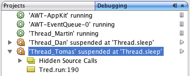
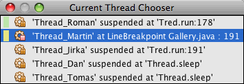

// 
//     Licensed to the Apache Software Foundation (ASF) under one
//     or more contributor license agreements.  See the NOTICE file
//     distributed with this work for additional information
//     regarding copyright ownership.  The ASF licenses this file
//     to you under the Apache License, Version 2.0 (the
//     "License"); you may not use this file except in compliance
//     with the License.  You may obtain a copy of the License at
// 
//       http://www.apache.org/licenses/LICENSE-2.0
// 
//     Unless required by applicable law or agreed to in writing,
//     software distributed under the License is distributed on an
//     "AS IS" BASIS, WITHOUT WARRANTIES OR CONDITIONS OF ANY
//     KIND, either express or implied.  See the License for the
//     specific language governing permissions and limitations
//     under the License.
//

= NetBeans IDEでのマルチスレッド・アプリケーションのデバッグ
:jbake-type: tutorial
:jbake-tags: tutorials 
:jbake-status: published
:icons: font
:syntax: true
:source-highlighter: pygments
:toc: left
:toc-title:
:description: NetBeans IDEでのマルチスレッド・アプリケーションのデバッグ - Apache NetBeans
:keywords: Apache NetBeans, Tutorials, NetBeans IDEでのマルチスレッド・アプリケーションのデバッグ

このドキュメントでは、NetBeans IDEの「デバッグ」ウィンドウを使用してマルチスレッド・アプリケーションをデバッグする方法を説明します。このチュートリアルでは、IDEを使用してアプリケーションのデッドロックを検出する方法も示します。

「デバッグ」ウィンドウは、デバッグ・セッション、アプリケーション・スレッド、およびスレッド・コール・スタックに関する情報を1つのウィンドウにまとめることにより、デバッグ処理を簡素化します。「デバッグ」ウィンドウを使用すると、アプリケーション・スレッドの状態を簡単に確認したり、セッション内の任意のスレッドを一時停止および再開できます。

このチュートリアルでは2つのサンプル・プロジェクトを使用し、「デバッグ」ウィンドウの操作方法を示します。このチュートリアルを完了するには、まずGalleryプロジェクトおよびDeadlockプロジェクトをダウンロードして開きます。

link:debug-multithreaded-screencast.html[+NetBeans IDEでのマルチスレッド・アプリケーションのデバッグのビデオ+]をご覧ください。

image::images/netbeans-stamp-80-74-73.png[title="このページの内容は、NetBeans IDE 7.2、7.3、7.4および8.0に適用されます"]

*このチュートリアルに従うには、次のソフトウェアとリソースが必要です。*

|===
|ソフトウェアまたはリソース |必須バージョン 

|link:https://netbeans.org/downloads/index.html[+NetBeans IDE+] |7.2, 7.3, 7.4, 8.0 

|link:http://www.oracle.com/technetwork/java/javase/downloads/index.html[+Java Development Kit (JDK)+] |バージョン7または8 

|link:https://netbeans.org/projects/samples/downloads/download/Samples/Java/debugging-samples.zip[+GalleryプロジェクトおよびDeadlockプロジェクト+] |  
|===

== サンプル・プロジェクトのダウンロード

このチュートリアルで使用するサンプル・プロジェクトは、次の方法でダウンロードできます。

* link:https://netbeans.org/projects/samples/downloads/download/Samples/Java/debugging-samples.zip[+終了したプロジェクトのZIPアーカイブ+]をダウンロードします。
* 次の手順を実行して、プロジェクト・ソースをNetBeansのサンプルからチェックアウトします。
1. メイン・メニューから「チーム」>「Subversion」>「チェックアウト」を選択します。
2. 「チェックアウト」ダイアログ・ボックスで次のリポジトリURLを入力します。
 ``https://svn.netbeans.org/svn/samples~samples-source-code`` 
「次」をクリックします。

. 「参照」をクリックして「リポジトリ・フォルダを参照」ダイアログ・ボックスを開きます。

. ルート・ノードを展開し、*samples/java/debugging-samples*を選択します。「OK」をクリックします。

. ソースのローカル・フォルダを指定します(ローカル・フォルダは空である必要があります)。

. 「終了」をクリックします。

「終了」をクリックすると、IDEではローカル・フォルダがSubversionリポジトリとして初期化され、プロジェクト・ソースがチェックアウトされます。

. チェックアウトが完了するときに表示されるダイアログで、「プロジェクトを開く」をクリックします。

*注意:*Subversionを使用したソースのチェックアウトの詳細は、link:../ide/subversion.html[+NetBeans IDEでのSubversionガイド+]のlink:../ide/subversion.html#settingUp[+Subversionの設定+]の項を参照してください。

== プロジェクトを開く

このチュートリアルでは、2つのアプリケーションを使用して、マルチスレッド・アプリケーションのデバッグがIDEでどのようにサポートされているかを示します。この課題では、2つのプロジェクトをIDEで開いて、実行します。プロジェクトを実行したら、各プロジェクトのデバッグに進みます。

=== Galleryプロジェクトの実行

Galleryアプリケーションは、アニメーション・イメージを再生する単純なJava Swingアプリケーションです。このアプリケーションには、アニメーション・イメージを追加および除去するための2つのボタンがあります。この課題では、Galleryアプリケーションを実行します。

1. link:https://netbeans.org/projects/samples/downloads/download/Samples/Java/debugging-samples.zip[+ ``debugging-samples.zip`` +]アーカイブをローカル・システムにダウンロードし、展開します。
2. メイン・メニューから「ファイル」>「開く」を選択します。
3. debugging-samplesディレクトリにあるGalleryプロジェクトを検索し、選択します。「開く」をクリックします。

「開く」をクリックすると、IDEによりプロジェクトが「プロジェクト」ウィンドウで開かれ、表示されます。「プロジェクト」ウィンドウでプロジェクト・ノードを展開すると、このプロジェクトが単純なJava Swingアプリケーションであることがわかります。

. プロジェクト・ノードを右クリックし、「実行」を選択してGalleryアプリケーションを起動します。

. Galleryアプリケーションで、「詳細表示」をクリックしてイメージを追加したり、「簡易表示」をクリックしてイメージを除去したりします。

image::images/debugging-gallery-app.png[title="Galleryアプリケーション"]

. Galleryアプリケーションのウィンドウを閉じます。

Galleryプロジェクトは、このチュートリアルでデバッグする単純なマルチスレッド・アプリケーションです。

=== Deadlockプロジェクトの実行

Deadlockアプリケーションには、500000ミリ秒間実行されるスレッドを開始する ``main`` メソッドが含まれています。 ``main`` メソッドは、2つのスレッドを開始し、これらが終了すると「出力」ウィンドウに出力します。

1. メイン・メニューから「ファイル」>「開く」を選択します。
2. debugging-samplesディレクトリにあるDeadlockプロジェクトを検索し、選択します。「開く」をクリックします。

「開く」をクリックすると、IDEによりプロジェクトが「プロジェクト」ウィンドウで開かれ、表示されます。「プロジェクト」ウィンドウでプロジェクト・ノードを展開すると、このプロジェクトが単純なJavaアプリケーションであることがわかります。

. プロジェクト・ノードを右クリックし、「実行」を選択してDeadlockアプリケーションを起動します。

「実行」をクリックすると、「出力」ウィンドウが開き、次の出力が表示されます。

[source,java]
----

run:
Application started
MyThread2 successfully finished.
MyThread1 successfully finished
----

. アプリケーションが通常どおり終了するのを待ちます(5分)。

Deadlockアプリケーションが終了したら、次の内容が「出力」ウィンドウに表示されます。

[source,java]
----

Main thread finished
----

Deadlockプロジェクトは、2つのスレッドを持つ単純なJavaアプリケーションです。アプリケーションをデバッグするとき、IDEがデッドロックの検出にどのように役立つかを示すため、デッドロックを作成します。

== サンプル・プロジェクトのデバッグ

Galleryプロジェクトは、アニメーション・イメージを表示する単純なJava Swingアプリケーションです。アプリケーションのボタンをクリックしてイメージを追加および除去します。「詳細表示」ボタンをクリックすると、イメージを表示してアニメーション化する新しいスレッドが開始されます。「簡易表示」ボタンをクリックすると、直近のスレッドが停止し、アニメーションが停止してイメージが除去されます。

=== スレッドの一時停止

この課題では、Galleryアプリケーションのデバッグを開始してイメージをいくつか追加し、一部のアプリケーション・スレッドを開始します。デバッグ・セッションを開始すると、IDEの左ペインに「デバッグ」ウィンドウが表示されます。「デバッグ」ウィンドウには、セッション内のスレッドが一覧表示されます。

1. 「プロジェクト」ウィンドウでGalleryプロジェクトを右クリックし、「デバッグ」を選択します。

「デバッグ」をクリックすると、IDEでGalleryアプリケーションが起動し、デフォルトのデバッグ用ウィンドウが表示されます。IDEによって、メイン・ウィンドウの左側に「デバッグ」ウィンドウが自動的に表示され、「出力」ウィンドウに「デバッガ・コンソール」が表示されます。

. Galleryアプリケーションで「詳細表示」を3回クリックし、アニメーション・イメージを表示する3つのスレッドを開始します。

「デバッグ」ウィンドウでは、各アニメーションに対して新しいスレッドが開始されたことがわかります。

image::images/debugging-start.png[title="「デバッグ」ウィンドウ"]

. 「デバッグ」ウィンドウのスレッドの右にある「スレッドを一時停止」ボタンをクリックして、スレッドのうち2つを一時停止します。

スレッドが一時停止されると、スレッドのアイコンが新しい状態に変わります。スレッド・ノードを展開してスレッドのコール・スタックを表示できます。デバッグ・コマンドを使用してポップアップ・メニューを開くには、「デバッグ」ウィンドウの項目を右クリックします。

Galleryアプリケーションでは、スレッドを一時停止すると、これらのスレッドのアニメーションが停止することがわかります。

「デバッグ」ウィンドウを使用すると、セッション内のスレッドの状態をすばやく表示および変更できます。デフォルトでは、「デバッグ」ウィンドウの右側に「再開」ボタンと「一時停止」ボタンが表示されます。「デバッグ」ウィンドウの下部にあるツールバーを使用すると、これらのボタンを非表示にし、「デバッグ」ウィンドウの表示をさらにカスタマイズすることができます。複数のデバッグ・セッションを実行している場合、「デバッグ」ウィンドウの上部にあるドロップダウン・リストを使用して、ウィンドウに表示するセッションを選択できます。

image::images/debugging-window-toolbar.png[title="「デバッグ」ウィンドウのツールバー"] 

=== スレッドの切替え

この課題では、アプリケーションをステップ実行した場合、および別のアプリケーション・スレッドがブレークポイントをヒットした場合の動作を説明します。この課題では、メソッド・ブレークポイントを設定し、アプリケーションのステップ実行を開始します。アプリケーションのステップ実行中に、ブレークポイントをヒットする新しいスレッドを開始します。これが発生すると、IDEでは「デバッグ」ウィンドウに通知が表示されます。次にスレッド間を切り替えます。

1. Galleryアプリケーションのウィンドウで、ウィンドウに2つまたは3つのアニメーションしか表示されなくなるまで、「簡易表示」または「詳細表示」をクリックします。
2. IDEの「プロジェクト」ウィンドウで ``gallery`` パッケージを展開し、 ``Gallery.java`` をダブルクリックして、ファイルをエディタで開きます。
3. 「 ``Gallery.java`` 」で、175行目の左マージンをクリックすることで、 ``run`` メソッドの最初にメソッド・ブレークポイントを挿入します。
4. Galleryアプリケーションで「詳細表示」をクリックして、メソッド・ブレークポイントをヒットする新しいスレッドを開始します。
5. 「ステップ・オーバー」([F8])をクリックし、「プログラム・カウンタ」が行191に達するまでメソッドをステップ実行します。

エディタのマージンにある「プログラム・カウンタ」に、メソッドのステップ実行での位置が示されます。

. Galleryアプリケーションで「詳細表示」をクリックして、メソッド・ブレークポイントをヒットする新しいスレッドを開始します。

新しいスレッドがメソッド・ブレークポイントをヒットすると、メソッドのステップ実行中に別のスレッドがブレークポイントをヒットしたことを通知する「新しいブレークポイントのヒット」通知が「デバッグ」ウィンドウに表示されます。

image::images/debugging-newbreakpointhit.png[title="「新しいブレークポイントのヒット」通知"]

スレッドをステップ実行しているときに別のスレッドでブレークポイントがヒットされると、IDEでは、他のスレッドに切り替えるか、または現在のスレッドのステップ実行を続けるかを決めるオプションが提示されます。「新しいブレークポイントのヒット」通知の矢印ボタンをクリックすると、ブレークポイントに遭遇したスレッドに切り替えることができます。通知ウィンドウ内のスレッドを選択すると、いつでも新しいスレッドに切り替えることができます。現在のブレークポイント・スレッドをステップ実行すると、現在のスレッドが再開されますが、他のアプリケーション・スレッドの状態は変わりません。

*注意:*「デバッグ」ウィンドウでは、現在のスレッド(Thread_Jirka)がマージン内の緑色のバーで示されていることがわかります。ブレークポイント(Thread_Roman)のヒットによって通知が呼び出されたスレッドは黄色のバーで示され、ブレークポイントによって一時停止されたスレッドはスレッド・アイコンで示されます。

image::images/debugging-current-suspended.png[title="「新しいブレークポイントのヒット」通知"]

. 「新しいブレークポイントのヒット」通知内の矢印をクリックして、現在のスレッドを新しいスレッド(Thread_Roman)に切り替えます。

新しいスレッドに切り替えるとき、次のことを確認できます。

* 新しい現在のスレッド(Thread_Roman)で、プログラム・カウンタが175行目に移動します。
* 191行目のマージンに一時停止しているスレッドを示す注釈が表示され、スレッド(Thread_Jirka)がその行で一時停止されていることを示します。

image::images/debugging-editor-suspendedannot.png[title="デバッグ注釈が表示されたエディタ"]

. 「ステップ・オーバー」を何回かクリックして、新しい現在のスレッド(Thread_Roman)をステップ実行します。

. 一時停止しているスレッドを示す注釈をエディタのマージンで右クリックし、「現在のスレッドとして設定」>「Thread_Jirka」を選択して、元の一時停止されたスレッドに切り替えます。

image::images/debugging-editor-setcurrent.png[title="「現在のスレッドとして設定」ポップアップが表示されたエディタ"]

または、「現在のスレッド・チューザ」([Alt]+[Shift]+[T]、Macの場合は[Ctrl]+[Shift]+[T])を呼び出して、任意のアプリケーション・スレッドに切り替えることもできます。

元のThread_Jirkaに切り替えると、Thread_Romanが一時停止されている行の横に、一時停止しているスレッドを示す注釈が表示されます。「デバッグ」ウィンドウの「再開」をクリックすると、Thread_Romanを再開できます。

image::images/debugging-editor-suspendedannot2.png[title="デバッグ注釈が表示されたエディタ"]

「デバッグ」ウィンドウを使用すると、スレッドの状態を正確に表示して制御できます。デバッガは、デバッグのワークフローを簡素化し、デバッグ処理でデッドロックが作成されるのを防ぐために、アプリケーション・スレッドを管理します。この課題では、IDEでアプリケーションをデバッグする際に発生する次の動作を確認しました。

* スレッドがブレークポイントをヒットすると、ブレークポイント・スレッドのみが一時停止されます。
* アプリケーションをステップ実行しているとき、他のアプリケーション・スレッドがブレークポイントをヒットしても現在のスレッドには影響しません。
* ステップ実行は現在のスレッドのみを再開します。ステップが完了すると、現在のスレッドのみが一時停止されます。

Galleryアプリケーションを終了できます。次の課題では、Deadlockアプリケーションをデバッグし、IDEを使用してデッドロックの検出に役立てます。

=== デッドロックの検出

IDEは、一時停止されたすべてのスレッドに対してデッドロックを自動的に検索して、潜在的なデッドロックの状況を特定するのに役立ちます。デッドロックが検出されると、IDEでは「デバッグ」ウィンドウに通知が表示され、関連するスレッドが特定されます。

IDEのデッドロック検出を示すために、デバッガにあるサンプルのDeadlockプロジェクトを実行し、デッドロックの状況を作成します。

1.  ``myapplication`` パッケージを展開し、ソース・エディタで ``Thread1.java`` と ``Thread2.java`` を開きます。
2.  ``Thread1.java`` の20行目および ``Thread2.java`` の20行目にブレークポイントを設定します。

ブレークポイントを設定するには、ブレークポイントを設定する行の横で、ソース・エディタ内のマージンをクリックします。ブレークポイント注釈が、行の横の左マージンに表示されます。「ブレークポイント」ウィンドウ([Alt]+[Shift]+[5]、Macの場合は[Ctrl]+[Shift]+[5])を開くと、2つのブレークポイントが設定され、有効になっていることがわかります。

image::images/debug-deadlock-setbkpt.png[title="20行目にブレークポイントが設定されていることを示すエディタ"]

. 「プロジェクト」ウィンドウでDeadlockプロジェクトを右クリックし、「デバッグ」を選択します。

 ``main`` メソッドによって2つのスレッドが実行され、これらのスレッドは、ブレークポイントの1つで両方とも一時停止されます。「デバッグ」ウィンドウでは、スレッドがブレークポイントによって一時停止されたことがわかります。

. 「デバッグ」ウィンドウで、「デバッグ」ウィンドウ内の一時停止されたスレッドの右にある「再開」ボタンをクリックすることによって、一時停止されたスレッド( ``MyThread1`` および ``MyThread2`` )を再開します。

image::images/debug-deadlock-resume.png[title="「デバッグ」ウィンドウでの一時停止されたスレッドの再開"]

 ``MyThread1`` スレッドおよび ``MyThread2`` スレッドを再開すると、デッドロックの状況が作成されます。

. メイン・メニューから「デバッグ」-「デッドロックを確認」を選択して、一時停止されたスレッドにデッドロックがないかを確認します。

image::images/debug-deadlock-detected.png[title="「デバッグ」ウィンドウでの一時停止されたスレッドの再開"]

アプリケーションのデッドロックを確認してデッドロックを検出した場合、デッドロックについて知らせるメッセージが「デバッグ」ウィンドウに表示されます。デッドロックのあるスレッドは、「デバッグ」ウィンドウの左マージンに赤色のバーで示されます。

このチュートリアルでは、IDEのデバッグ機能の一部に関する基本を紹介しました。「デバッグ」ウィンドウを使用すると、アプリケーションをデバッグするときにスレッドを簡単に一時停止および再開できます。これは、マルチスレッド・アプリケーションをデバッグする際に特に便利です。

link:https://netbeans.org/about/contact_form.html?to=3&subject=Feedback:%20Debugging%20Multithreaded%20Applications[+このチュートリアルに関するご意見をお寄せください+]

== 関連項目

NetBeans IDEでのJavaアプリケーションの開発およびテストの詳細は、次のリソースを参照してください。

* デモ: link:debug-multithreaded-screencast.html[+NetBeans IDEでのマルチスレッド・アプリケーションのデバッグ+]
* デモ: link:debug-stepinto-screencast.html[+NetBeansデバッガでの視覚的なステップ・イン・アクション+]
* デモ: link:debug-deadlock-screencast.html[+NetBeansデバッガを使用したデッドロックの検出+]
* デモ: link:debug-evaluator-screencast.html[+NetBeansデバッガのコード・スニペット評価の使用+]
* link:../../trails/java-se.html[+基本的なIDEおよびJavaプログラミングの学習+]
* link:junit-intro.html[+JUnitテストの作成+]
* link:profiler-intro.html[+Javaアプリケーションのプロファイリング入門+]
