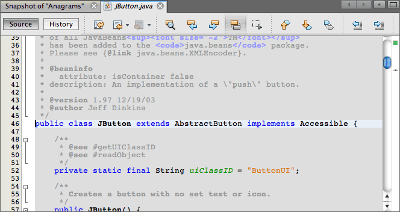
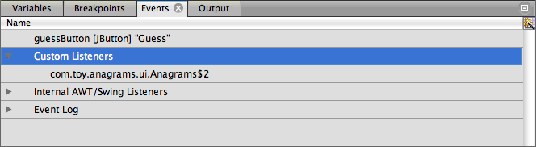
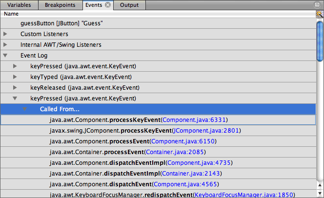

//
//     Licensed to the Apache Software Foundation (ASF) under one
//     or more contributor license agreements.  See the NOTICE file
//     distributed with this work for additional information
//     regarding copyright ownership.  The ASF licenses this file
//     to you under the Apache License, Version 2.0 (the
//     "License"); you may not use this file except in compliance
//     with the License.  You may obtain a copy of the License at
//
//       http://www.apache.org/licenses/LICENSE-2.0
//
//     Unless required by applicable law or agreed to in writing,
//     software distributed under the License is distributed on an
//     "AS IS" BASIS, WITHOUT WARRANTIES OR CONDITIONS OF ANY
//     KIND, either express or implied.  See the License for the
//     specific language governing permissions and limitations
//     under the License.
//

= Using the Visual Debugger in NetBeans IDE
:jbake-type: tutorial
:jbake-tags: tutorials
:jbake-status: published
:icons: font
:syntax: true
:source-highlighter: pygments
:toc: left
:toc-title:
:description: Using the Visual Debugger in NetBeans IDE - Apache NetBeans
:keywords: Apache NetBeans, Tutorials, Using the Visual Debugger in NetBeans IDE
:experimental:

This tutorial describes how to use the Visual Debugger to help you locate and debug the code for visual elements in your Java GUI applications. Specifically, you can use the Visual Debugger in Java Swing and JavaFX GUI applications.

You will use the Visual Debugger to explore the Anagram Game sample project, which is a Java Swing application distributed with NetBeans. This document will demonstrate how to take a GUI snapshot of the application and then work with the snapshot to locate source code, add listeners to events, and view the event log of GUI components.

== Creating the Anagram Game sample project

To open a new Java project, press:

[cols="1,4"]
|===
|*Windows*(TM)/Linux |kbd:[Ctrl+Shift+N]
|*macOS*(TM) |kbd:[Command+Shift+N]
|===

or, select *File > New Project...* from the menu bar. Then *Choose Project* by selecting *Categories: Samples*, *Categories: Java with Ant* and *Projects: Anagram Game*, then click *Next >*.

For *Name and Location*, set *Project Name: MyAnagram*. Change *Project Location:* to any directory on your computer. From now on, this tutorial refers to this directory as `_NetBeansProjects_`.

== Taking a GUI Snapshot

To start a debugging session, press:

[cols="1,4"]
|===
|*Windows*(TM)/Linux |kbd:[Ctrl+F5]
|*macOS*(TM) |kbd:[Command+F5]
|===

or, click the Debug button in the toolbar to start the debugging session. Alternatively, right-click the project node in the Projects window and choose Debug. When you start the session, the IDE will launch the Anagram Game application and open the Debugging window.

Choose Debug > Take GUI Snapshot from the main menu.When you choose Take GUI Snapshot, the IDE will take a snapshot of the GUI and will open the snapshot in the main window, as shown below:

[.feature]
--

image::images/debug-fullscreen.png[role="left", link="images/debug-fullscreen.png"]

--

== Working with the Visual Debugger

The GUI snapshot is a visual debugging tool that can help you locate the source code for GUI components. The source code for GUI components can sometimes be difficult to locate and the snapshot provides a way for you to locate the code based on the GUI instead of searching through the code. You can select components in the snapshot and invoke tasks from the popup menu to view the source code for the component, show the listeners, and set breakpoints on components.

=== Locating the Source Code for Components

This exercise will demonstrate how to use the GUI snapshot to navigate to the lines in the source code where a component is declared and defined. When you select a component in the GUI snapshot, you can use the popup menu to invoke various commands.

The commands can also be invoked from the Navigator window by right-clicking the component and choosing the command in the popup menu.

1. In the GUI snapshot, select the Guess button. When you select a component in the snapshot, the IDE displays details about the selected component in the Properties window. If the Properties window is not visible you can choose Window > Properties from the main menu to open the window.

image::images/debug-snapshot.png[]

The IDE also displays the location of the component in the form hierarchy in the Navigator window. If the Navigator window is not visible you can choose Window > Navigator from the main menu to open the window.

image::images/debug-navigator.png[]

. Right-click the Guess button in the snapshot and choose Go to Component Declaration from the popup menu. When you choose Go to Component Declaration, the IDE opens the source file in the editor and moves the cursor to the line in the code where  ``guessButton``  is declared.

image::images/debug-gotodeclaration.png[]

. Right-click the Guess button in the snapshot again and choose Go to Component Source. When you choose Go to Component Source, the IDE opens the source file in the editor and moves the cursor to the line in the source code for the JButton component.

You can use the Go to Hierarchy Addition command in the GUI snapshot to locate the line in the source code where a component is added to its container. The Go to Hierarchy Addition command is disabled by default. You can enable the command in the Options window.

1. Open the Options window.
2. Click the Java Debugger tab in the Java category in the Options window.
3. Select Visual Debugging in the list of categories and select *Track locations of component hierarchy changes*. Click OK.
4. Stop your debugging session (if one is running). After you enable the command in the Options window, you will need to restart your debugging session and take a new GUI snapshot before you can use the Go to Hierarchy Addition command.
5. Start a new debugging session and take a GUI snapshot.
6. Right-click a component in the GUI snapshot and choose Go to Hierarchy Addition.

The IDE will open the source code in the editor at the line where the component is added, as shown below:

image::images/debug-hierarchy.png[]

=== Exploring Component Events

This exercise will demonstrate how you can use the GUI snapshot and the Events window to explore component events, enabling you to locate component listeners and the events that are triggered by the components.

1. Right-click the Guess button in the snapshot and choose Show Listeners from the popup menu. When you choose Show Listeners, the IDE opens the Events window. You can see that the Custom Listeners node is expanded.

. Right-click *com.toy.anagrams.ui.Anagrams$3* below the Custom Listeners node and choose Go to Component Source in the popup menu. The source code opens in the editor at the line where the listener is defined.

. Select the empty text field in the snapshot. Alternatively, you can select the  ``guessedWord``  text field in the Navigator window. When you select the text field, the items in the Events window will change automatically to display the listeners for the selected component.

. In the Events window, double-click the Event Log node to open the Select Listener window. Alternatively, you can right-click the Event Log node and choose Set Logging Events from the popup menu.

. Select the  ``java.awt.event.KeyListener``  listener from the dialog. Click OK.

image::images/debug-select-listener.png[]

This listener is now listening for keyboard events in the text field.

. In the Anagram Game application, type some characters in the text field. When you type a character in the text field, the event is recorded in the events log. If you expand the Event Log node you can see that each keystroke is now logged. New events appear each time that you type in the Anagram Game application text field. If you expand an individual event, for example  ``keyPressed`` , you can see the properties of that event in the log.

If you expand the "Called From..." node for an event you can see the stack trace for the event.

This tutorial was a basic introduction to the visual debugger in the IDE. The visual debugger enables you to easily locate the source code and log events for GUI components. This can be extremely helpful when you are debugging GUI applications.
