//
//     Licensed to the Apache Software Foundation (ASF) under one
//     or more contributor license agreements.  See the NOTICE file
//     distributed with this work for additional information
//     regarding copyright ownership.  The ASF licenses this file
//     to you under the Apache License, Version 2.0 (the
//     "License"); you may not use this file except in compliance
//     with the License.  You may obtain a copy of the License at
//
//       http://www.apache.org/licenses/LICENSE-2.0
//
//     Unless required by applicable law or agreed to in writing,
//     software distributed under the License is distributed on an
//     "AS IS" BASIS, WITHOUT WARRANTIES OR CONDITIONS OF ANY
//     KIND, either express or implied.  See the License for the
//     specific language governing permissions and limitations
//     under the License.
//

//=============================================== The Title and Metadata (Start)

=  Code Assistance in the NetBeans IDE Java Editor: A Reference Guide
:jbake-type: tutorial
:jbake-tags: tutorials
:jbake-status: published
:reviewed: 2019-02-19
:syntax: true
:source-highlighter: pygments
:toc: left
:toc-title:
:icons: font
:description: Code Assistance in the NetBeans IDE Java Editor: A Reference Guide - Apache NetBeans
:keywords: Apache NetBeans, Tutorials,  Code Assistance in the NetBeans IDE Java Editor: A Reference Guide
:experimental:
:backslash: &#92;

//================================================= The Title and Metadata (End)

//============================================================= Preamble (Start)

The purpose of any integrated development environment (IDE) is to maximize productivity and support seamless development from a single tool. This reference document describes useful code assistance features, customization options, and navigation capabilities of the NetBeans IDE's Java Editor.

//=============================================================== Preamble (End)

//============================================== General Editor Features (Start)

== General Editor Features

//==============================================================================

=== Code Formatting

Code formatting allows you to set up the editor to layout your source code in the way that you find most preferable and comfortable to work with. When you want to format your code simply press:

[cols="1,4"]
|===
|*Windows*(TM)/*Linux* |kbd:[Alt+Shift+F]
|*macOS*(TM) |kbd:[Ctrl+Shift+F]
|===

or, select *Source > Format* from the menu bar or, right-click and select *Format*. Your code will then be formatted according to the rules specified in the Formatting pane.

To customize the formatting behaviour, open the formatting pane by selecting:

[cols="1,4"]
|===
|*Windows*(TM)/*Linux* |Tools > Options > Editor > Formatting
|*macOS*(TM) |NetBeans > Preferences... > Editor > Formatting
|===

then select *Language: Java*. From the *Category:* drop-down list, you can select from a wide range of customizable elements such as: the number of blank lines, the size of tabs and indentation, wrapping style, etc. You can preview your changes as you make them.

//==============================================================================

=== Inserting and Highlighting Braces, Brackets, and Quotes

By default, the editor automatically inserts matching pairs for braces, brackets, parentheses and, quote marks. When you type an opening brace and then press `Enter`, the closing brace is added automatically. However, for  `(`,  `[`,  `"`, and  `'`, the editor inserts the matching pair immediately, and positions the cursor between them.

If, for some reason, this feature is disabled, you can enable it by selecting:

[cols="1,4"]
|===
|*Windows*(TM)/*Linux* |Tools > Options > Editor > Code Completion
|*macOS*(TM) |NetBeans > Preferences... > Editor > Code Completion
|===

then in the *Language: All Languages* pane select the *Insert Closing Brackets Automatically* checkbox.

The editor also highlights matching pairs of braces, brackets and parentheses. If for example, you place the cursor immediately adjacent to any brace, bracket or parenthesis and, it has a matching pair, both will be highlighted in yellow. If there is no matching pair, then the single element is highlighted in red and an error mark is displayed in the left-hand margin.

NOTE: Do not take any notice of the indicated error, because it does not propose an unpaired element and is therefore misleading. The key indicator is the red highlight.

To customize the highlight colors, select:

[cols="1,4"]
|===
|*Windows*(TM)/*Linux* |Tools > Options > Fonts & Colors > Highlighting
|*macOS*(TM) |NetBeans > Preferences... > Fonts & Colors > Highlighting
|===

//==============================================================================

=== Code Folding

In the editor, you can quickly collapse and expand blocks of code, such as method declarations, Javadoc comments, import statements, etc. Collapsible blocks are indicated by a gray line with a minus sign in a box attached to the top of the line in the left-hand margin of the editor. Expandable blocks are indicated by a box with a plus sign in the same margin.

image::images/code-folded2a.png[]

The easiest way to collapse a specific block of code is to double-click the gray line in the left-hand margin, the number of collapsed lines within the  block are then displayed. You can quickly review the collapsed parts of your code by doing a mouse over the folded elements.

More options for collapsing and expanding code blocks can be found by selecting *View > Code Folds* from the menu bar or, right-click select *Code Folds*, where you will also find keyboard shortcuts.

To customize the code folding options select:

[cols="1,4"]
|===
|*Windows*(TM)/*Linux* |Tools > Options > Editor > Folding
|*macOS*(TM) |NetBeans > Preferences... > Editor > Folding
|===

then select *Language: Java*. There you will find various options.

//==============================================================================

=== Customizing Keyboard Shortcuts

To customize keyboard shortcuts, select:

[cols="1,4"]
|===
|*Windows*(TM)/*Linux* |Tools > Options > Keymap
|*macOS*(TM) |NetBeans > Preferences... > Keymap
|===

then select *Manage Profiles...* . Select the profile you want to use as a base for your new profile and click *Duplicate*, rename your profile and click *OK*, then *Close*.

Ensure that your new profile is selected, *Profile: myNewProfileName* and then you can modify the shortcuts you need.

To edit a shortcut, double-click in the *Shortcut* field or, click the ellipsis button ( `...` ) and select *Edit...* As you press a sequence of keys, the syntax for them is added. If you want to add special keys, such as:  `Tab` ,  `Escape` or,  `Enter` etc., click the ellipsis button ( `...` ) again and select the key from the pop-up window. When you have finished editing your shortcuts, click *OK* in the *Keymap* window.

You can save customized sets of your shortcuts as profiles. Then, you can switch from one profile to another to quickly change multiple settings.

To find a shortcut for a specific command, type the command name in the Search field.

//================================================ General Editor Features (End)

//====================================================== Code Completion (Start)

== Smart Code Completion

The editor helps you quickly complete or generate code through the "smart" code completion feature. Code completion is very useful when you want to fill in missing code, it allows you to look at the available options within the context of your application, and generates fragments of code when required. See below for examples of how to use code completion.

//==============================================================================

=== Invoking Code Completion

To invoke code completion press  kbd:[Ctrl+Space] or, choose *Source > Complete Code...* from the menu bar and a list of appropriate suggestions is presented to you. As you continue to type, code completion becomes more focussed and the list shortens. The list includes options imported in your source file and symbols from the  `java.lang`  package.

To customize the code completion settings, select:

[cols="1,4"]
|===
|*Windows* (TM) |Tools > Options > Editor > Code Completion
|*macOS* (TM) |NetBeans > Preferences... > Editor > Code Completion
|===

You can set code completion to pop-up an options list either automatically or, on an as-needed basis. In the Code Completion pane for *Language: All Languages*, select the *Auto Popup Completion Window* checkbox to invoke code completion automatically when you type certain characters. The default character for *Language: Java* is " `.` ", but you can add your own characters.

To add characters that will invoke code completion, select the *Language: Java* pane and type your characters in the *Auto Popup Triggers for Java:* field. The code completion list will pop-up every time you type one of your specified characters, simply select your desired option, hit return or "double-click", for it to be entered into your document.

When the *Auto Popup Completion Window* checkbox is not selected, you need to press kbd:[Ctrl+Space] each time you want to invoke code completion.

Instead of using kbd:[Ctrl+Space]  for code completion, you can use "hippie completion". Hippie completion analyzes text in the visible scope by searching your current document and, if not found, in other documents. Hippie completion then provides suggestions to complete the current word with a keyword, class name, method, or variable. To invoke hippie completion press:

[cols="1,4"]
|===
|*Windows*(TM)/*Linux* |kbd:[Ctrl+K]
|*macOS*(TM) |kbd:[Command+K]
|===

and the editor automatically completes the word you're typing. Repeatedly pressing the appropriate key combination will cycle once through all available options. If you go past your desired option then press the shift key as well as your key combination and you can reverse.

The first time kbd:[Ctrl+Space] is pressed only items matching the type, in this example an  `int`, are shown.

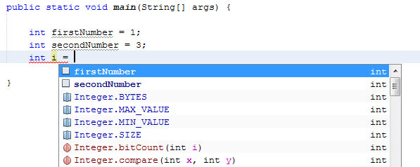

Press kbd:[Ctrl+Space] a second time and _all_ available items are shown, regardless of whether they match the provided type, as shown below.

image::images/codecompletion4.png[]

Also, you can select for *Language: Java* the *Auto Popup on Typing Any Java Identifier Part* checkbox and, as you type keywords etc., code completion automatically presents you with an appropriate list of options.

//==============================================================================

=== Smart Suggestions at the Top

Code completion is "smart", and will present the most  relevant suggestions at the top, above the black line in the code completion list.

In the example below, the editor suggests inserting the  `LinkedHashMap`  constructor from the  `java.util`  package.

image::images/smartcompletion1.png[]

If the "smart" suggestions are not the ones you want to use, press kbd:[Ctrl+Space] again to see the complete list.

//==============================================================================

=== Camel Case Completion

Instead of typing consecutive characters, and then calling code completion, you can type the initial capital letters of the word you're interested in.

For example, type  `IE` , press  kbd:[Ctrl+Space] , and you will see a list of suggestions that match via camel case completion using the letter  `I`  and then the letter  `E` .

image::images/camelcase.png[]

//==============================================================================

=== Completing Keywords

Use code completion to complete keywords in your code. The editor analyzes the context and suggests the most relevant keywords.

In the example below, the  `ColorChooser`  class needs to extend the  `JPanel`  class. You can quickly add the keyword  `extends`  from the suggested items.

image::images/keywords.png[]

//==============================================================================

=== Suggesting Names for Variable and Fields

When you are adding a new field or a variable, use code completion to choose a name that matches its type.

Type a prefix for the new name, press  kbd:[Ctrl+Space]  and select the name you want to use from the list of suggestions.

image::images/names.png[]

//==============================================================================

=== Suggesting Parameters

The editor determines the most likely parameters for variables, methods, or fields and displays the suggestions in a pop-up box.

For example, when you select a method from the code completion window which has one or more arguments, the editor highlights the first argument and displays a tooltip suggesting the format for this argument. To move to the next argument, press the  kbd:[Tab]  or  kbd:[Enter]  keys.

You can invoke the tooltips with method parameters by pressing:

[cols="1,4"]
|===
|*Windows*(TM)/*Linux* |kbd:[Ctrl+P]
|*macOS*(TM) |kbd:[Command+P]
|===

or, selecting *Source > Show Method Parameters* from the menu bar at any time.

image::images/parameter.png[]

//==============================================================================

=== Common Prefix Completion

You can use the  kbd:[Tab] key to quickly fill in the most commonly used prefixes and single suggestions. To check out how this feature works, try typing the following:

Type  `System.out.p`  and wait for code completion to show all fields and methods that start with "p". All the suggestions will be related to "print".

image::images/prefixcompletion.png[]

Press the  kbd:[Tab]  key and the editor automatically fills in the "print". You can continue and type "l" and, after pressing kbd:[Tab] again, "println" will be added.

//==============================================================================

=== Subword Completion

Sometimes you may not remember how an item starts, making it difficult to use code completion. For example, to see all items that relate to listening to property changes, you can use subword completion, so if you type  `prop` you will see all method calls that relate to property change listening.

image::images/subcompletion.png[]

To implement this feature, select:

[cols="1,4"]
|===
|*Windows*(TM)/*Linux* |Tools > Options > Editor > Code Completion
|*macOS*(TM) |NetBeans > Preferences... > Editor > Code Completion
|===

then select in the *Language: Java* pane, the *Subword completion* checkbox.

You can then type part of the method you want to call, in this case `prop`, then invoke code completion, relevant alternatives all applicable to properties on the object, in this example, are displayed.

//==============================================================================

=== Chain Completion

When you need to type a chain of commands, you can use code completion. By  pressing  kbd:[Ctrl+Space]  twice all available chains will be shown. The editor scans: variables, fields, and methods that are in the visible context. It will then suggest a chain that satisfies the expected type.

image::images/chain.png[]

//==============================================================================

=== Completion of Static Imports

When you want to complete a statement and, at the same time, require to make use of a static import statement, use code completion. By pressing  kbd:[Ctrl+Space]  twice, all available static import statements will be shown.

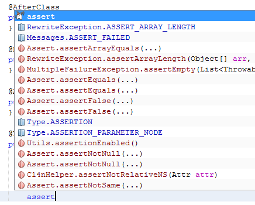

If you would like static import statements to be added automatically, select:

[cols="1,4"]
|===
|*Windows*(TM)/*Linux* |Tools > Options > Editor > Formatting
|*macOS*(TM) |NetBeans > Preferences... > Editor > Formatting
|===

then from the *Language: Java*,  *Category: Imports* pane select the *Prefer Static Imports* checkbox.

//==============================================================================

=== Excluding Items from Completion

Time can be wasted when code completion returns classes that you seldom or never use. When you invoke code completion, a lightbulb within the returned items indicates that you can exclude them from the code completion list.

image::images/exclude2-small.png[]

You can add or modify your exclusion rules either when "Configure excludes" is selected from the code completion list or, by selecting:

[cols="1,4"]
|===
|*Windows*(TM)/*Linux* |Tools > Options > Editor > Code Completion
|*macOS*(TM) |NetBeans > Preferences... > Editor > Code Completion
|===

then in the *Language: Java* pane, make your changes to the *Packages/classes:* list.

image::images/exclude.png[]

//==============================================================================

=== JPA Completion

When you are using the Java Persistence Annotation specification (JPA), you can complete SQL expressions in  `@NamedQuery`  statements via code completion.

image::images/jpacompletion.png[]

In the code completion window, icons are used to distinguish different members of the Java language. See <<Appendix A: Icons in the Code Completion Window>> at the end of this document to see the meanings of these icons.

//======================================================== Code Completion (End)

//==================================================== Managing Imports  (Start)

== Managing Imports

There are several ways of working with import statements. The editor constantly checks your code for the correct use of import statements and immediately warns you when non-imported classes or unused import statements are detected.

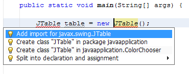

When a non-imported class is found, the image:images/bulberror1.png[] error mark appears in the IDE's left-hand margin (also called the _glyph margin_). Click the error mark and choose whether to: add the missing import, create this class in the current package or, create this class in the current class.

While you are typing, press:

[cols="1,4"]
|===
|*Windows*(TM)/*Linux* |kbd:[Ctrl+Shift+I]
|*macOS*(TM) |kbd:[Command+Shift+I]
|===

or, choose *Source > Fix Imports* from the menu bar or, right-click and choose *Source > Fix Imports*, to add all missing import statements and, remove all unused import statements at once.

To add an import only for the type at which the cursor is located, press:

[cols="1,4"]
|===
|*Windows*(TM)/*Linux* |kbd:[Alt+Shift+I]
|*macOS*(TM) |kbd:[Ctrl+Shift+I]
|===

image::images/imports2.png[]

When you select a class from the code completion window, the editor automatically adds an import statement for it, so you do not need to worry about this.

image::images/imports.png[]

If there are unused import statements in your code, select the  warning mark in the editor left-hand margin. Then choose either: to remove one unused import or, all unused imports.

In the editor, unused imports are underlined in yellow. See the <<Semantic Coloring and Highlighting>> section for details.

//TODO 04-This link doesn't work

To quickly see if your code contains unused or missing imports, watch the error stripes in the righthand margin: orange stripes indicate missing or unused imports.

You can specify that, whenever you save a file, all the unused imports should automatically be removed, select:

[cols="1,4"]
|===
|*Windows*(TM)/*Linux* |Select Tools > Options > Editor > On Save
|*macOS*(TM) |NetBeans > Preferences... > Editor > On Save
|===

then for *Language: Java*, select the *Remove Unused Imports* checkbox.

//======================================================= Managing Imports (End)

//====================================================== Generating Code (Start)

== Generating Code

When working in the Java editor, you can generate pieces of code in one of two ways: by using code completion or from the Code Generation dialog box. Let's take a closer look at simple examples of automatic code generation.

//==============================================================================

=== Using the Code Generation Dialog Box

In the editor, you can automatically generate: various constructs, whole methods, override and delegate methods, add properties and more. To invoke code generation, press:

[cols="1,4"]
|===
|*Windows*(TM)/*Linux* |kbd:[Alt+Insert]
|*macOS*(TM) |kbd:[Ctrl+I]
|===

or, choose *Source > Insert Code...* from the menu bar or, right-click and select *Insert Code...* anywhere in the editor to insert a construct from the Code Generation box. The suggested list is adjusted to the current context.

In the example below, we are going to generate a constructor for the  `ColorChooser`  class. Select Constructor from the Code Generation box, and specify the fields that will be initialized by the constructor. The editor will generate the constructor with the specified parameters.

image::images/codegeneration1.png[]

//==============================================================================

=== Using Code Completion

You can also generate code from the code completion window. In this example, we use the same code fragment as above to demonstrate code generation from the code completion window.

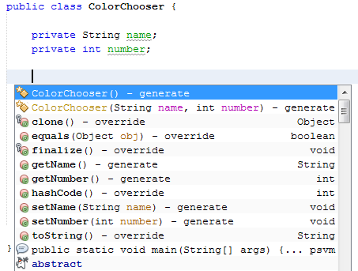

Press kbd:[Ctrl+Space] to open the code completion window and choose the following item:  `ColorChooser(String name, int number) - generate`. The editor generates a constructor with the specified parameters.

In the code completion window, the constructors that can be generated automatically  are marked with the image:images/newconstructor.png[] icon and the " `generate` " note.

For more explanation of the icons and their meanings, see <<Appendix A: Icons in the Code Completion Window>>.

//TODO 05-This link doesn't work

//======================================================== Generating Code (End)

//======================================================= Code Templates (Start)

== Code Templates

A Code Template is a predefined piece of code that has an abbreviation associated with it.

//==============================================================================

=== Using Code Templates

Code templates are marked with the image:images/codetemplateicon.png[] icon in the code completion window.

image::images/livetemplate.png[]

You can use code templates by selecting one from the code completion window or,
by typing its abbreviation, found by selecting:

[cols="1,4"]
|===
|*Windows*(TM)/*Linux* |Tools > Options > Editor > Code Templates
|*macOS*(TM) |NetBeans > Preferences... > Editor > Code Templates
|===

and then *Language: Java* in the *Code Templates* pane.

The template can be expanded by pressing the default expansion key  kbd:[Tab]. In the expanded template, editable parts are displayed as blue boxes. Use the  kbd:[Tab] key again to go through the parts that you need to edit.

//==============================================================================

=== Adding or Editing Code Templates

To add or edit code templates, select:

[cols="1,4"]
|===
|*Windows*(TM)/*Linux* |Tools > Options > Editor > Code Templates
|*macOS*(TM) |NetBeans > Preferences... > Editor > Code Templates
|===

then select *Language: Java*. In the *Templates:* window you will be pesented with a list of abbreviations each with an expanded text and description.

Use the *New* and *Remove* buttons to modify the templates list. To edit an existing template, select the template and edit the code in the *Expanded Text* field. Then ideally, you should add a *Description* as an aid memoir and, if necessary, a *Context*.

Choose your peferred key from the *Expand Template on:* list, to activate your template. The default key is  kbd:[Tab] . Finally, select an action from the *On Template Expansion:* list.

See xref:../php/code-templates.adoc[+Code Templates in NetBeans IDE for PHP+], for more information about templates.

//========================================================= Code Templates (End)

//================================================= Working with Javadoc (Start)

== Working with Javadoc

Use the following features to facilitate working with Javadoc for your code.

//==============================================================================

=== Displaying Javadoc

To display Javadoc, place the cursor on an element in your code and, press:

[cols="1,4"]
|===
|*Windows*(TM)/*Linux* |kbd:[Ctrl+Shift+Space]
|*macOS*(TM) |kbd:[Command+Shift+{backslash}]
|===

or choose *Source > Show Documentation* from the menu bar. The Javadoc for this element is displayed in a popup window.

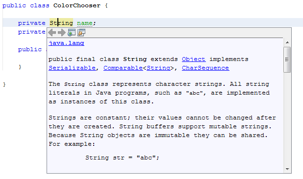

From the menu bar, select *Window > IDE Tools > Javadoc Documentation* to open the Javadoc window, in which the documentation is refreshed automatically for the location of your cursor.

//==============================================================================

=== Creating Javadoc Stubs

Place the cursor above a method or a class that has no Javadoc, type  `"/**` ", and press  kbd:[Enter] .

image::images/javadoc1.png[]

The IDE creates a skeletal structure for a Javadoc comment filled with some content. If you have a Javadoc window open, you will see the changes immediately while you are typing.

//==============================================================================

=== Using Javadoc Hints

The editor displays hints when Javadoc is missing or Javadoc tags are needed by displaying the bulb icon  image:images/bulb.png[] in the left-hand margin, click the bulb icon to fix Javadoc errors.

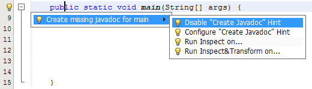

If you do not want to see the hints related to Javadoc, select:

[cols="1,4"]
|===
|*Windows*(TM)/*Linux* |Tools > Options > Editor > Hints
|*macOS*(TM) |NetBeans > Preferences... > Editor > Hints
|===

and clear the *JavaDoc* checkbox in the list of hints that are displayed.

//==============================================================================

=== Using Code Completion for Javadoc Tags

Code completion is available for Javadoc tags.

image::images/javadoc3.png[]

Type the `@` symbol and wait until the code completion window opens, depending on your settings, you may need to press  kbd:[Ctrl+Space]. Then select the required tag from the drop-down list.

//==============================================================================

=== Generating Javadoc

To generate Javadoc for a project, select *Run > Generate Javadoc* from the menu bar or,  right-click the project in the *Projects* window and choose Generate Javadoc. The IDE will generate the Javadoc and open it in a separate browser window.

image::images/generate.png[]

In the example above, you can see a sample output of the Generate Javadoc command. If there are some warnings or errors, they are also displayed in this window.

To customize Javadoc formatting options, right-click the project in the *Projects* window, choose *Properties* and open the *Documenting* panel under the *Build* category. This is only available for Java projects.

//==============================================================================

=== Analyzing Javadoc

To identify the places in your code that need Javadoc comments and quickly insert these comments, you can use the Javadoc Analyzer tool available in the Java editor.

image::images/analyze-javadoc.png[]

To analyze and fix Javadoc comments:

Select a project, a package, or an individual file and choose *Tools > Analyze Javadoc* from the menu bar. The *Analyzer* window displays suggestions for adding or fixing Javadoc comments, depending on the scope of your selection.

Select one or, several checkboxes where you would like to fix Javadoc and click the *Fix Selected* button.

Click *Go Over Fixed Problems* and use the Up and Down arrows to actually add your comments. This might be helpful if you opted to fix several instances at once and now want to revisit the stubs.

//=================================================== Working with Javadoc (End)

//========================================================== Using Hints (Start)

== Using Hints

While you are typing, the Java editor checks your code and provides suggestions of how you can fix errors and navigate through code. The examples below show the types of hints that are available in the editor and how to customize them.

//==============================================================================

=== Using Hints to Fix Code

For the most common coding mistakes, you can see hints in the left-hand margin of the editor. The hints are shown for many types of errors, such as missing field and variable definitions, problems with imports, braces, and other. Click the hint icon and select the fix to add to your code.

Hints are displayed automatically by default. However, if you want to view all hints, choose *Source > Fix Code* from the menu bar or, press:

[cols="1,4"]
|===
|*Windows*(TM)/*Linux* |kbd:[Alt+Enter]
|*macOS*(TM) |kbd:[Ctrl+Enter]
|===

For example, try typing `myBoolean=true`. The editor detects that this variable is not defined. Click the hint icon image:images/bulberror1.png[] and, see the editor suggests that you create a field, a method parameter, or a local variable.

image::images/quickfixes.png[]

//==============================================================================

=== Surround With...

You can easily surround pieces of your code with various statements, such as  `for`,  `while`,  `if`,  `try/catch`, etc.

Select a block in your code that you want to surround with a statement and click the bulb icon image:images/bulb.png[] in the left-hand margin or, choose *Source > Fix Code* from the menu bar or, press:

[cols="1,4"]
|===
|*Windows*(TM)/*Linux* |kbd:[Alt+Enter]
|*macOS*(TM) |kbd:[Ctrl+Enter]
|===

The editor displays a pop-up list of suggestions from which you can select the statement you need.

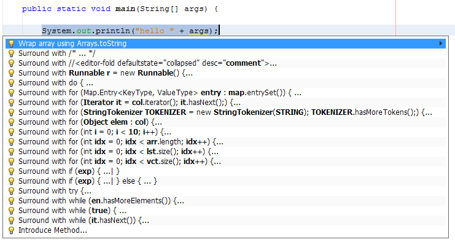

//==============================================================================

=== Customizing Hints

You might want to limit the number of categories for which hints are displayed. To do this, select:

[cols="1,4"]
|===
|*Windows*(TM)/*Linux* |Tools > Options > Editor > Hints
|*macOS*(TM) |NetBeans > Preferences... > Editor > Hints
|===

then select *Language: Java* from the drop-down list. You are presented with a list of elements for which hints can be displayed, select the checkboxes of those that you want and deselect those you don't.

The IDE can detect compilation errors in your Java sources. By locating and recompiling classes that depend on the file that you are modifying, even if these dependencies are in the files that are not open in the editor. When a compilation error is found, red badges are attached to source file, package, or project nodes in the *Projects* window.

Dependency scanning within projects can be resource consuming and degrade performance, especially if you are working with large projects. To improve the IDE's performance, you can do one of the following:

* On the Hints tab, you can disable dependency scans, via the *Dependency Scanning* option.

* For a specific Project, in the *Projects* window select *Properties > Build > Compiling* and deselect the *Track Java Dependencies* option. In this case, the IDE does not scan for dependencies or update the error badges when you modify a file.

//============================================================ Using Hints (End)

//=================================== Semantic Coloring and Highlighting (Start)

== Semantic Coloring and Highlighting

The IDE's Java editor shows code elements in distinct colors, based on the semantics of your code. With semantic coloring, it becomes easier for you to identify various elements in your code. In addition to coloring, the Java editor highlights similar elements with a particular background color. Thus, you can think of the highlighting feature as an alternative to the Search command, because in combination with error stripes, it gives you a quick overview of where the highlighted elements are located within a file.

//==============================================================================

=== Customizing Colors

The IDE provides several preset coloring schemes, which are called profiles. You can create new profiles with custom colors and quickly switch between them.

To customize semantic coloring settings for the Java editor, select:

[cols="1,4"]
|===
|*Windows*(TM)/*Linux* |Tools > Options > Fonts & Colors
|*macOS*(TM) |NetBeans > Preferences... > Fonts & Colors
|===

It is preferable to save custom colors in new profiles, to do this use the  following method:

* In the *Fonts & Colors* window, select a suitable profile from the *Profile:* drop-down list as your starting point.
*  Click *Duplicate* next to the *Profile:* and, enter a name for your new profile and click *OK*.

* Ensure that your new profile is currently selected *Profile: myNewColorProfile* and select *Language: Java*.

* Select a *Category:* and then change the *Font:*, *Foreground:*, *Background:*, and *Effects:* for this category. Use the *Preview:* window to view the results and when satisfied click *OK*.

NOTE: All NetBeans IDE settings and profiles are stored in the _NetBeans userdir_. When upgrading NetBeans, you can export your old settings and import them into the new version.

//==============================================================================

=== Exporting and Importing Settings

To export IDE settings, select:

[cols="1,4"]
|===
|*Windows*(TM)/*Linux* |Tools > Options
|*macOS*(TM) |NetBeans > Preferences...
|===

and click *Export*, specify the location and name of the ZIP file that will be created. Select the settings that you want to export and click *OK*.

To import IDE settings:

Open the *Options/Preferences...* window and click *Import*. Specify the location of the ZIP file to import and then select the settings you want to import and click *OK*.

//==============================================================================

=== Coloring Example

In the figure below, you can see an example of a coloring scheme. Depending upon your custom settings, your colors might look differently from those shown.

image::images/coloring.png[]

* Distinct colors are used for: keywords (blue), variables and fields (green), and parameters (orange).

* References to deprecated methods or classes are shown as strikethrough. This warns you when you are going to write code that relies on deprecated members.

* Unused members are underlined with a gray wavy line.

* Comments are displayed in gray.

//==============================================================================

=== Using Highlights

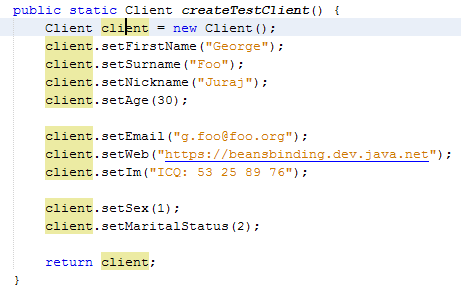

The IDE highlights usages of the same element, matching braces, method exit points, and exception throwing points.

If you place the cursor in an element, such as a field or a variable, all usages of this element are highlighted. Note that error stripes in the editor's righthand margin indicate the usages of this element in the entire source file, see: <<Error Stripes>>. Click the error stripe to quickly navigate to the desired usage location.

If you decide to rename all the highlighted instances, use the Instant Rename command (kbd:[Ctrl+R] or choose Refactor > Rename).

//===================================== Semantic Coloring and Highlighting (End)

//=========================================================== Navigation (Start)

== Navigation

The Java editor provides numerous ways to navigate through code. See below for several examples that show the navigation features of the Java editor.

//==============================================================================

=== Error Stripes

Error stripes in the right-hand margin of the editor provide a quick overview of all: errors, warnings, hints, highlighted occurrences, and annotations in the current file. Note that the error stripe margin represents an entire file, not just the part that is currently displayed in the editor.

By using the error stripes, you can quickly identify whether your file has any errors or warnings, without scrolling through the file. Clicking an error stripe will jump to the corresponding line.

//==============================================================================

=== Navigating From the Editor: Go to...

There are many ways of navigating through your code, use the following the "Go to..." commands located under the *Navigate* menu to quickly jump to target locations:

Select: a class, method or field in your code and then choose your desired action:

*Go to declaration*, press:

[cols="1,4"]
|===
|*Windows*(TM)/*Linux* |kbd:[Ctrl+B]
|*macOS*(TM) |kbd:[Ctrl+Shift+G]
|===

or, select *Navigate > Go to Declaration* from the menu bar or, right-click and select *Navigate > Go To Declaration* from the pop-up menu. The editor then moves the cursor to its declaration within: the current file or, if not there opens the appropriate file and positions the cursor to the declaration of your selected item.

*Go to source*, press:

[cols="1,4"]
|===
|*Windows*(TM)/*Linux* |kbd:[Ctrl+Shift+B]
|*macOS*(TM) |kbd:[Command+Shift+B]
|===

or, select *Navigate > Go to Source* from the menu bar or, right-click and select *Navigate > Go to Source* from the pop-up menu. The result of this action is similar to that of "go to declaration". However, in this case it opens the file of the original "source declaration".

The difference between these two actions is: that both the declaration and source could be in your current file or, the declaration in your current file with the source in another or, that neither are in your current file and that the declaration is in one and the source in another.

If you know the name of the type (class, interface, annotation or enum), file, or symbol to where you want to jump, use these commands and type the name in the new window. Notice that you can use prefixes, camel case, and wildcards.

*Go to type*, press:

[cols="1,4"]
|===
|*Windows*(TM)/*Linux* |kbd:[Ctrl+O]
|*macOS*(TM) |kbd:[Command+O]
|===

or, select *Navigate > Go to Type...* from the menu bar.

image::images/gototype.png[]

*Go to file*, press:

[cols="1,4"]
|===
|*Windows*(TM)/*Linux* |kbd:[Alt+Shift+O]
|*macOS*(TM) |kbd:[Ctrl+Shift+O]
|===

or, select *Navigate > Go to File...* from the menu bar.

*Go to symbol*, press:

[cols="1,4"]
|===
|*Windows*(TM)/*Linux* |kbd:[Ctrl+Alt+Shift+O]
|*macOS*(TM) |kbd:[Ctrl+Shift+Command+O]
|===

or, select *Navigate > Go to Symbol...* from the menu bar.

*Go to line*, press kbd:[Ctrl+G] or, select *Navigate > Go to Line* from the menu bar, and enter the line number to which you want to jump.

image::images/gotoline.png[]

//==============================================================================

=== Jumping to Last Edit

To quickly return to your last edit, even if it is in another file or project, press kbd:[Ctrl+Q] or use the button in the top left corner of the Java editor toolbar. The last edited document opens, and the cursor is at the position, which you edited last.

image::images/jumplastedit.png[]

//==============================================================================

=== Using Breadcrumbs

Breadcrumbs are displayed along the bottom of the editor, the position of the cursor in the document determines the breadcrumbs displayed. To activate breadcrumbs, select *View > Show Breadcrumbs* from the menu bar.

image::images/breadcrumbs.png[]

Click on an arrow associated with a breadcrumb to see all available class members and select to jump to them.

//==============================================================================

=== Switching Between Files

There are several features that allow you to switch between open files:

To go to a previously edited file, press:

[cols="1,4"]
|===
|*Windows*(TM)/*Linux* |kbd:[Alt+Left]
|*macOS*(TM) |kbd:[Ctrl+Left]
|===

or, select *Navigate > Back*, from the menu bar.

To move forward press:

[cols="1,4"]
|===
|*Windows*(TM)/*Linux* |kbd:[Alt+Right]
|*macOS*(TM) |kbd:[Ctrl+Right]
|===

or, select *Navigate > Forward*, from the menu bar.

Alternatively, you can press the corresponding buttons on the editor toolbar, see the figure below. The file opens and the cursor is placed at the location of your last edit. When you click one of these buttons, you can expand the list of the recent files and click to navigate to any of them.

image::images/jumprecentfile.png[]

* You can toggle between files and windows by pressing kbd:[Ctrl+Tab]. After you press kbd:[Ctrl+Tab], a pop-up window opens containg two panes: the left-hand pane shows a list of all open files and, the right-hand pane shows a list of all windows. Hold down the kbd:[Ctrl] key then press and release the kbd:[Tab] key to move forward  through the list. Hold down kbd:[Ctrl+Shift] then press and release the kbd:[Tab] key to move backward through the list. When your required file is highlighted release all keys to switch to that file.

NOTE: If you continue pressing the kbd:[Tab] key you will also cycle through the windows list as well.

image::images/togglefile.png[]

* You can show all open documents by pressing, kbd:[Shift+F4] or, select *Windows > Documents...* from the menu bar. After you have selected the *Documents* window, all open files are shown. Order the files based on your needs and choose the file you would like to open.

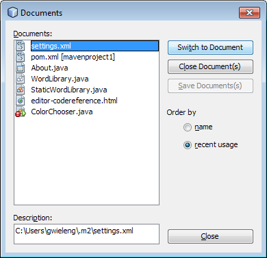

//==============================================================================

=== Using Bookmarks

You can use bookmarks to quickly navigate to specific places in your code. To create a bookmark, place the cursor anywhere in a line of code and, press:

[cols="1,4"]
|===
|*Windows*(TM)/*Linux* |kbd:[Ctrl+Shift+M]
|*macOS*(TM) |kbd:[Command+Shift+M]
|===

or, select *Navigate > Toggle Bookmark* from the menu bar or, right-click the left margin and choose *Bookmark > Toggle Bookmark*.

Alternatively, you can select *View > Show Editor Toolbar* from the menu bar. The new toolbar is positioned at the top of the current document in the editor window. There you will find a variety of icons, specifically, three that relate to bookmarks: *Previous Bookmark*, *Next Bookmark* and *Toggle Boomark*

A bookmarked line is shown with a small blue icon in the left margin, as shown below.

image::images/bookmark.png[]

To remove the bookmark, press the key combination again.

To clear all document bookmarks, you need to customize the Toolbar, to do this select *View > Toolbars > Customize*. In the pop-up window scroll down to category *Edit* and, if necessary expand it, then drag the *Clear Document Bookmarks* icon to your toolbar.

To go to the next bookmark, press:

[cols="1,4"]
|===
|*Windows*(TM)/*Linux* |kbd:[Ctrl+Shift+.]
|*macOS*(TM) |kbd:[Command+Shift+.]
|===

To go to the previous bookmark, press:

[cols="1,4"]
|===
|*Windows*(TM)/*Linux* |kbd:[Ctrl+Shift+,]
|*macOS*(TM) |kbd:[Command+Shift+,]
|===

Automatically a pop-up list of bookmarks appears containing all the bookmarks visited in your current session, including those files that are not currently open in the editor.

image::images/bookmark2.png[]

You can move forward or backward by repeatedly releasing and pressing the kbd:[.] key or kbd:[,] key as appropriate to highlight your chosen bookmark. Then when you release the whole key combination the cursor is moved to the bookmark in your code.

If the file is not the topmost, the editor will switch to that file and move the cursor to the selected bookmark. Selecting a bookmark in a closed file will cause the editor to open that file and position the cursor at the required bookmark.

If you select the *Bookmarks* item in the pop-up list, as shown in the figure above or, when you select *Window > IDE Tools > Bookmarks* from the menu bar, the *Bookmarks* window opens.

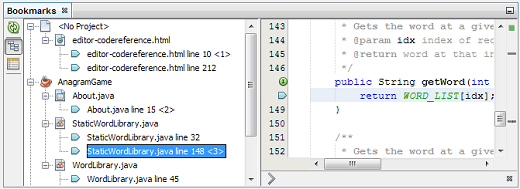

The *Bookmarks* window contains two panes: one showing all visited bookmarks in the current session and, the other a view of the code related to the currently highlighted bookmark. You cannot edit anything in this window, it is there so that you can see if the correct bookmark has been selected in the bookmarks pane.

In the bookmarks pane you can select either a *Tree View* or, a *Table View*. In *Table View* you can assign keys and labels to bookmarks, so that when  kbd:[Ctrl+G]  is pressed, you can quickly jump to a labelled bookmark in your code.

//==============================================================================

=== Using the Navigator

The Navigator window provides structured views of the file you are working with and lets you quickly navigate between different parts of the file.

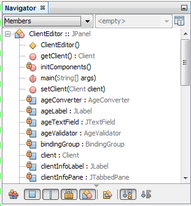

To open the Navigator window, choose *Window > Navigator* or, press:

[cols="1,4"]
|===
|*Windows*(TM)/*Linux* |kbd:[Ctrl+7]
|===

NOTE: There is no keyboard shortcut set for |*macOS*(TM). See *Customizing Keyboard Shortcuts* to learn how to set missing shortcuts.

In the Navigator window, you can do the following:

* Choose between different views: Members, Bean Patterns, Trees, Elements, etc.
* Double-click an element to jump to the line where it is defined.
* Right-click an element and apply commands, such as Go to Source, Find Usages, and Refactor.
* Apply filters to the elements displayed in the *Navigator*, select the buttons at the bottom.
* Type the name of the element that you want to find, the *Navigator* window must be active.

//============================================================= Navigation (End)

//=========================================================== Appendix A (Start)

== Appendix A: Icons in the Code Completion Window

[cols="1,3,1,3"]
|===

|Icon |Meaning |Variants | Meaning

|image:images/annotation_type.png[] |Annotation type |  |

|image:images/class_16.png[] |Class |  |

|image:images/package.png[] |Package |  |

|image:images/enum.png[] |Enum type |  |

|image:images/code_template.png[] |Code Template |  |

|image:images/constructor_16.png[] |Constructor |image:images/new_constructor_16.png[] |New constructor (generate)

|  |  |image:images/constructor_protected_16.png[] |Protected constructor

|  |  |image:images/constructor_private_16.png[] |Private constructor

|  |  |image:images/constructor_package_private_16.png[] |Package private constructor

|image:images/field_16.png[] |Field |image:images/field_protected_16.png[] |Protected field

|  |  |image:images/field_private_16.png[] |Private field

|  |  |image:images/field_package_private_16.png[] |Package private field

|image:images/field_static_16.png[] |Static field |image:images/field_static_protected_16.png[] |Protected static field

|  |  |image:images/field_static_private_16.png[] |Private static field

|  |  |image:images/field_static_package_private_16.png[] |Package private static field

|image:images/interface.png[] |Interface |  |

|image:images/javakw_16.png[] |Java keyword |  |

|image:images/method_16.png[] |Method |image:images/method_protected_16.png[] |Protected method

|  |  |image:images/method_private_16.png[] |Private method

|  |  |image:images/method_package_private_16.png[] |Package private method

|image:images/method_static_16.png[] |Static method |image:images/method_static_protected_16.png[] |Protected static method

|  |  |image:images/method_static_private_16.png[] |Private static method

|  |  |image:images/method_static_package_private_16.png[] |Package private static method

|image:images/localVariable.png[] |Local variable |  |

|image:images/attribute_16.png[] |Attribute |  |
|===

//=============================================================== Appendix (End)
