// 
//     Licensed to the Apache Software Foundation (ASF) under one
//     or more contributor license agreements.  See the NOTICE file
//     distributed with this work for additional information
//     regarding copyright ownership.  The ASF licenses this file
//     to you under the Apache License, Version 2.0 (the
//     "License"); you may not use this file except in compliance
//     with the License.  You may obtain a copy of the License at
// 
//       http://www.apache.org/licenses/LICENSE-2.0
// 
//     Unless required by applicable law or agreed to in writing,
//     software distributed under the License is distributed on an
//     "AS IS" BASIS, WITHOUT WARRANTIES OR CONDITIONS OF ANY
//     KIND, either express or implied.  See the License for the
//     specific language governing permissions and limitations
//     under the License.
//

= Designing an Advanced Java Form Using the GridBag Customizer
:jbake-type: tutorial
:jbake-tags: tutorials 
:jbake-status: published
:syntax: true
:icons: font
:source-highlighter: pygments
:toc: left
:toc-title:
:description: Designing an Advanced Java Form Using the GridBag Customizer - Apache NetBeans
:keywords: Apache NetBeans, Tutorials, Designing an Advanced Java Form Using the GridBag Customizer

This tutorial is the second in a two-part series that demonstrates how to design an advanced Java form using the advanced features of the NetBeans IDE GridBag Customizer.
The series is intended as a guide to show how you can layout your GUI components without manually writing your layout code and then perform additional changes in an existing form to implement a specific target layout that is required by the project.

Each document in this series covers specific set of features.

* Part 1: xref:gbcustomizer-basic.adoc[+Designing a Basic Java Form Using the GridBag Customizer+]
* Part 2: Designing an Advanced Java Form Using the GridBag Customizer

The xref:gbcustomizer-basic.adoc[+first tutorial in the series+] demonstrated how to modify a simple Java form using the basic features of the NetBeans IDE GridBag Customizer. In this tutorial you will learn how to use the GridBag Customizer advanced features to change the existing form layout.

*To follow this tutorial, you need the following software and resources.*

|===
|Software or Resource |Description 

|link:https://netbeans.org/projects/samples/downloads/download/Samples%252FJava%252Fgbcustomizer-advanced-tutorial.zip[+gbcustomizer-advanced-tutorial.zip+] |An archive with the demo project containing the initial and target tutorial layouts. 
|===

*Notes:*

* You can download the project that is used as the starting point for this series as a  ``.zip``  archive.
* This tutorial focuses on designing the layout of the container only. Adding functionality to the GUI is out of its scope.

== Opening Example Project

Before starting to lay out the components with the help of the GridBag Customizer, download the link:https://netbeans.org/projects/samples/downloads/download/Samples%252FJava%252Fgbcustomizer-advanced-tutorial.zip[+gbcustomizer-advanced-tutorial.zip+], extract the  ``GridBagCustomizerAdvancedTutorial``  project on your hard drive and open it in the NetBeans IDE.

1. Download and unzip the link:https://netbeans.org/projects/samples/downloads/download/Samples%252FJava%252Fgbcustomizer-advanced-tutorial.zip[+gbcustomizer-advanced-tutorial.zip+] project to any location on your computer.
2. In the NetBeans IDE Projects tab, click Open Project on the File menu, navigate to the  ``GridBagCustomizerAdvancedTutorial``  project that you extracted in the previous step, and click Open Project. The project folder might be in a containing folder that is also called  ``GridBagCustomizerAdvancedTutorial`` .

NOTE: The  ``GridBagCustomizerAdvancedTutorial``  project uses the  ``JUnit``  and  ``JUnit 4``  class libraries, which are located in the Update Center. You need to click Resolve Problems in the Open project dialog box, then click Resolve in the Resolve Reference Problems dialog box and install the JUnit plugin following the instructions in the NetBeans IDE Installer. When the installation is completed, click Finish to close the NetBeans IDE Installer dialog box, then click Close to close the Resolve Reference Problems dialog box.

. Expand  ``Source Packages > tutorial``  and double-click  ``ContactsAdvancedInitial.java`` . 
The sample form opens in the GUI Builder Design view.

[.feature]
--

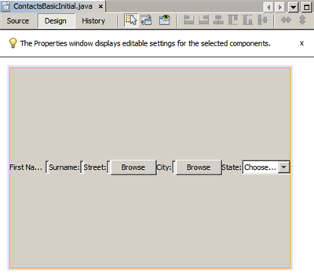

--

== Invoking GridBag Customizer

To display the GridBag Customizer, complete the following steps:

1. In the Design view, select the JFrame form.
2. Right-click the form and choose  ``Customize Layout`` .
The Customize Layout dialog box opens as shown below.

[.feature]
--

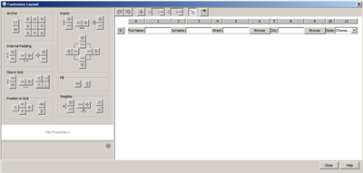

--

NOTE: In this tutorial the GridBagLayout is already set. In case you work with another form, in step 2 above, right-click the form and choose  ``Set Layout``  >  ``Grid Bag Layout``  (this enables the  ``Customize Layout``  menu item) and complete the procedure.

== Advanced Features

In this section you will use the advanced features of the GridBag Customizer to reorganize the  ``ContactsAdvancedInitial``  form components in accordance with the target layout shown below.

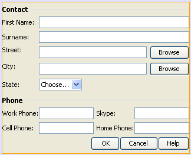

NOTE: To view the target layout in your NetBeans IDE, in the Projects tab, expand  ``Source Packages > tutorial``  and double-click  ``ContactsAdvancedFinal.java`` . 
The  ``ContactsAdvancedFinal``  form with the target layout opens in the GUI Builder Design view.

=== Inserting New Row

The  ``Phone``  section of the existing form features three phone entries. To enhance it and add an additional label and text field (e.g., Skype username between  ``Cell Phone:``  and  ``Home Phone:`` ), make a new row there as follows:

1. In the Customize Layout dialog box, right-click the header of the row that contains  ``Home Phone:``  information.
2. Choose  ``Insert Row Before`` .

image::images/insertrow.png[]

A new row is added as in the following figure.

image::images/rowinserted.png[]

=== Adding New Components

To add a new label and text field to the newly added row, complete the following steps:

1. Right-click the first cell of the newly added row.
2. From the context menu, choose  ``Add Components > Swing Controls > Label``  like shown below.

[.feature]
--

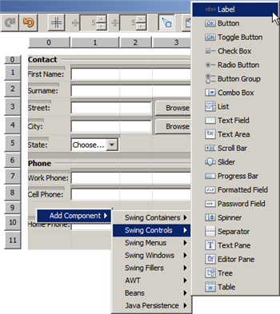

--

Highlighted  ``JLabel1``  displays in the first cell.

. Right-click the second cell of the newly added row.

. From the context menu, choose  ``Add Components > Swing Controls > Text Field`` .
Highlighted  ``JTextField1``  displays in the second cell.

image::images/highlightedtextfield.png[]

After the components are added, their gridbag constraints must be specified to align them with other components.

With the  ``JTextField1``  component selected in the Grid Area, do the following in the Property Sheet:

1. In the Grid Width combobox, enter  ``3``  and press Enter.
2. In the Fill combobox, select  ``horizontal`` .
3. In the Anchor combobox scroll-down and select  ``Baseline`` .
4. In the Weight X text field, enter  ``1.0``  and press Enter.

image::images/textfieldconstraints.png[]

In the Grid Area, select the  ``JLabel1``  component and specify its  ``Anchor``  constraint by scrolling down and selecting  ``Baseline Leading``  in the Property Sheet.

Select both the  ``JLabel1``  and  ``JTextField1``  components in the Grid Area, click the browse button () to the right of the  ``Insets``  text field. The  ``Insets``  dialog box displays. Enter  ``5``  in the  ``Top:``  text field, and click OK.

The form should look like shown below.

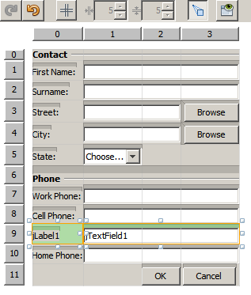

NOTE: The GridBag Customizer helps you to add, remove, and change the position of components in the layout. To change properties of the components in the layout like background or text, use the GUI Builder Design window.

To set the display text for the  ``JLabel1`` , do as follows:

1. Click Close to close the Customize Layout dialog box.
2. In the Design view, select the  ``JLabel1``  component and press F2 (alternatively, select Edit Text from the context menu).
3. Delete the selected text and enter  ``Skype:`` .
4. Press Enter.

To remove the  ``JTextField1``  component's text, complete the following steps:

. In the Design view, select the  ``JTextField1``  component and press F2 (alternatively, select Edit Text from the context menu).
. Delete the selected text and press Enter.

=== Reorganizing Layout

The GridBag Customizer can save you time and effort by quickly repositioning the form components as desired.

To change the layout of the  ``Phone``  section and position of four existing text fields from one column to two columns with two text fields, complete the following steps:

1. Right-click the form and choose  ``Customize Layout``  from the context menu.
2. In the Customize Layout dialog box, control-click the four  ``JTextField``  components to select them.
3. Drag the right edge of the text fields to the left and drop it so that the text fields occupy just the second grid column, in other words, so that they no longer occupy the third and fourth grid columns.

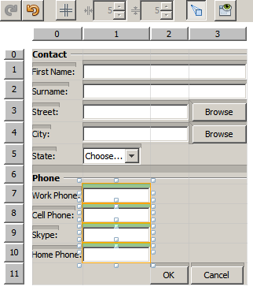

The GridBag Customizer can resize several components together thus making room for the second column of text fields.

. Click outside the form to deselect the resized text fields.

. Control-click to select all the  ``Skype:``  and  ``Home Phone:``   ``JLabel``  and  ``JTextField``  components in the  ``Phone``  section.

. Position the cursor over the selection and drag them to the right of the top two text fields.

image::images/movesecondcolumn.png[]

NOTE: Before dragging make sure the cursor is not changed into a two-way arrow, otherwise you will resize the selection instead.

After you move the components, the form should look like shown below.

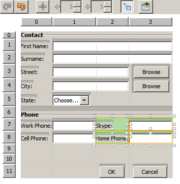

To discard the redundant rows 10 and 11 (row indices 9 and 10 respectively), right-click the row headers and choose  ``Delete Row``  from the context menu.

The  ``Phone``  section became more compact.

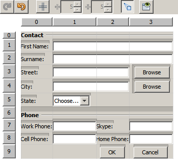

To fix spacing of the second column here, do as follows:

1. Control-click the  ``Skype:``  and  ``Home Phone:``  labels to select them in the Grid Area.
2. Click the browse button () to the right of the  ``Insets``  text field.
The  ``Insets``  dialog box displays.

. Enter  ``5``  in the  ``Left:``  text field, and click OK.

=== Introducing Subcontainers

The grid based layout sometimes introduces unnecessary dependencies that need to be resolved by means of subcontainers.

If you click the Test Layout button in the toolbar (image:images/testlayoutbutton.png[] ) and test horizontal resizeability of the current layout, you will notice that unwanted space is created around the Browse, OK, and Cancel buttons.

[.feature]
--

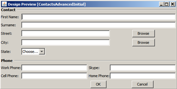

--

This happens because the fourth column comprises both text fields and buttons (the components that should grow and the components that should not grow respectively). You need to modify the layout so that the additional space around the  ``Browse``  buttons is consumed by the  ``Street``  and  ``City:``  text fields. The current layout ensures that the right edge of the  ``Street:``  and  ``City:``  text fields is on the same vertical position as the left edge of the  ``Home Phone:``  text field. To make these positions independent, complete the following steps:

1. Control-click the  ``Street:``  text field and the  ``Browse``  button to the right of it to select them.
2. Right-click the selection and choose  ``Enclose in Container``  from the context menu.

[.feature]
--

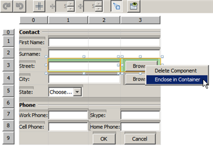

--

After the components are enclosed into a subcontainer, the boundary between the  ``Home Phone:``  label and text field no longer affects the boundary between the  ``Street``  text field and button.

NOTE: The  ``Enclose in Container``  action creates a new subcontainer in the cells occupied by the selected components. It moves the selected components into a newly introduced container but it preserves their relative positions and other layout constraints.

Repeat the two steps listed above for the  ``City:``  text field and the  ``Browse``  button to the right of it, to enclose them into a subcontainer like shown below.

image::images/enclosecity.png[]

Now you want to fix the unwanted space around the  ``OK``  and  ``Cancel``  buttons as follows:

1. Click Close to deselect the enclosed into a subcontainer components, right-click the form, and choose  ``Customize Layout``  from the context menu.
2. Control-click the  ``OK``  and  ``Cancel``  buttons at the bottom of the form to select them.
3. Right-click the selection and choose  ``Enclose in Container``  from the context menu.
A new subcontainer is created for the buttons.

image::images/subcontainerbuttons.png[]

NOTE: None of the components in the subcontainer is resizable. Therefore, they are placed next to each other in the center of the container, which is the default anchoring.

To change the anchoring of the whole subcontainer, complete the following steps:

1. Ensure that the subcontainer with the  ``OK``  and  ``Cancel``  buttons is selected and click the arrow button (image:images/arrowbutton.png[]) to the right of the  ``Anchor``  combobox.
2. Scroll down and choose  ``Line End``  from the list.

image::images/subcontainerlineend.png[]

The layout looks fine but the subcontainer with the  ``OK``  and  ``Cancel``  buttons occupies only the last two cells in the last row.
In case the  ``OK``  and  ``Cancel``  buttons become wider (for example, during the translation into a different language), they will push the right edges of the  ``Work Phone:``  and  ``Cell Phone:``  text fields. 
To avoid this potential issue and let the subcontainer occupy all cells in the bottom row, select the subcontainer and drag its left border to the beginning of the row.

image::images/subcontainerresized.png[]

The subcontainer occupies all cells in the bottom row.

=== Navigating Between Containers

To add a component to a subcontainer (for example, a  ``Help``  button to the existing  ``OK``  and  ``Cancel``  buttons), you need to switch from the main container to the subcontainer before editing the latter's layout.

Complete the steps listed below to add a button to an existing subcontainer:

1. Click the subcontainer with the  ``OK``  and  ``Cancel``  buttons to select it.
2. Right-click the container to display the context menu and choose  ``Design This Container``  from it.

[.feature]
--

image::images/designsubcontainer-small.png[role="left", link="images/designsubcontainer.png"]

--

. Right-click the second column header and choose  ``Insert Column After``  from the context menu.
An empty cell for the new button displays.

[.feature]
--

image::images/emptycell-small.png[role="left", link="images/emptycell.png"]

--

. Right-click inside the newly created cell and choose  ``Add Component``  >  ``Swing Controls``  >  ``Button``  from the context menu.
A new  ``jButton1``  button is added.

[.feature]
--

image::images/newbutton-small.png[role="left", link="images/newbutton.png"]

--

. Click the Baseline-Related Anchor button (image:images/baselineanchor.png[]) in the Property Customizer to align the new button with the two existing ones in the row.

. Click the browse button () to the right of the Insets text field. The Insets dialog box displays. Enter 5 in the Top: text field, and click OK.

. To check how the main container layout looks now, right-click the designed subcontainer and choose  ``Design Parent Container``  from the context menu.

image::images/designparentcontainer.png[]

NOTE: The context menu does not display if you right-click the buttons.

The layout design is completed.
A final change that is not related to layout of the container is left.
To rename the button, complete the following steps:

1. Click Close to close the Customize Layout dialog box.
2. In the Design view, click the  ``jButton1``  component and press F2 (alternatively, select Edit Text from the context menu).
3. Delete the selected text and enter  ``Help`` .
4. Press Enter.

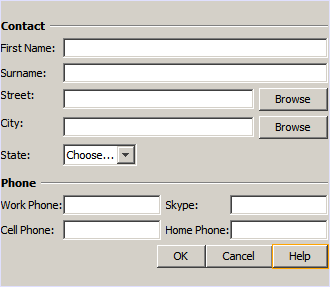

== Summary

In this tutorial, you modified an existing form by adding new components, inserting rows, etc. When designing the layout you learned how to use the advanced features of the GridBag Customizer to reorganize the layout of the form.

Go to xref:gbcustomizer-basic.adoc[+Designing a Basic Java Form Using the GridBag Customizer+]

<<top,top>>

