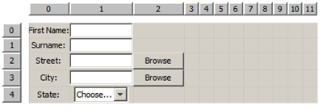
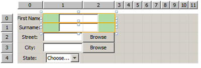
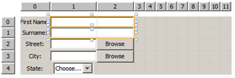
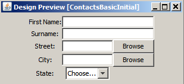
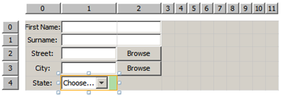
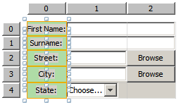

// 
//     Licensed to the Apache Software Foundation (ASF) under one
//     or more contributor license agreements.  See the NOTICE file
//     distributed with this work for additional information
//     regarding copyright ownership.  The ASF licenses this file
//     to you under the Apache License, Version 2.0 (the
//     "License"); you may not use this file except in compliance
//     with the License.  You may obtain a copy of the License at
// 
//       http://www.apache.org/licenses/LICENSE-2.0
// 
//     Unless required by applicable law or agreed to in writing,
//     software distributed under the License is distributed on an
//     "AS IS" BASIS, WITHOUT WARRANTIES OR CONDITIONS OF ANY
//     KIND, either express or implied.  See the License for the
//     specific language governing permissions and limitations
//     under the License.
//

= Designing a Basic Java Form Using the GridBag Customizer
:jbake-type: tutorial
:jbake-tags: tutorials 
:jbake-status: published
:syntax: true
:icons: font
:source-highlighter: pygments
:toc: left
:toc-title:
:description: Designing a Basic Java Form Using the GridBag Customizer - Apache NetBeans
:keywords: Apache NetBeans, Tutorials, Designing a Basic Java Form Using the GridBag Customizer

This tutorial is the first in a two-part series that demonstrates how to design a simple Java form using the basic features of the NetBeans IDE GridBag Customizer.
The series is intended as a guide to show how you can layout your GUI components without manually writing your layout code and then perform additional changes in an existing form to implement a specific target layout that is required by the project.

Each document in this series covers specific set of features.

* Part 1: Designing a Basic Java Form Using the GridBag Customizer
* Part 2: xref:gbcustomizer-advanced.adoc[+Designing an Advanced Java Form Using the GridBag Customizer+]

*To follow this tutorial, you need the software and resources listed below.*

|===
|Software or Resource |Version Required 

|link:https://netbeans.org/projects/samples/downloads/download/Samples%252FJava%252Fgbcustomizer-basic-tutorial.zip[+gbcustomizer-basic-tutorial.zip+] |An archive with the demo project containing the initial and target tutorial layouts. 
|===

*Notes:*

* You can download the project that is used as the starting point for this series as a  ``.zip``  archive.
* This tutorial focuses on designing the layout of the container only. Adding functionality to the GUI is out of its scope.

== Opening Example Project

1. Download and unzip the link:https://netbeans.org/projects/samples/downloads/download/Samples%252FJava%252Fgbcustomizer-basic-tutorial.zip[+gbcustomizer-basic-tutorial.zip+] project to any location on your computer.
2. In the Projects tab, choose  ``File``  >  ``Open Project`` , navigate to the  ``gbcustomizer-basic-tutorial``  project that you extracted in the previous step, and click Open Project. The project folder might be in a containing folder that is also called  ``gbcustomizer-basic-tutorial`` .
3. In the Reference Problem dialog box, click Resolve. The IDE automatically downloads the JUnit and JUnit 4 libraries. Follow the instructions in the NetBeans IDE installer to install the required plugins. When the installation is complete, click Finish.
4. Expand  ``Source Packages``  >  ``Tutorial``  and double-click  ``ContactsBasicInitial.java`` . 
The sample form opens in the GUI Builder Design view.

[.feature]
--

image::images/sampleform-small.png[role="left", link="images/sampleform.png"]

--

== GridBag Customizer Overview

The GridBag Layout Customizer is one of the most flexible and complex layout managers the Java platform provides. The Customizer places components in a grid of rows and columns, allowing specified components to span multiple rows or columns. Not all rows necessarily have the same height. Similarly, not all columns necessarily have the same width. Essentially, the GridBagLayout places components in rectangles (cells) in a grid, and then uses the components' preferred sizes to determine how big the cells should be.

To display the GridBag Customizer, complete the steps below:

1. In the Design view, select the JFrame form.
2. Right-click the form and choose  ``Customize Layout``  from the context menu.
The Customize Layout dialog box opens as shown below.

[.feature]
--

image::images/customizerdialog-small.png[role="left", link="images/customizerdialog.png"]

--

NOTE: In this tutorial the GridBagLayout is already set. In case you work with another form, in step 2 above, right-click the form and choose  ``Set Layout``  >  ``Grid Bag Layout``  from the context menu (this enables the  ``Customize Layout``  menu item.). Then complete the procedure.

=== Grid Area

The Grid area is on the right side of the Customize Layout dialog box. It shows the grid layout of the components.
The components in the sample form are already added but not laid out correctly.

=== Toolbar

A toolbar with five buttons is located above the Grid area. It provides convenient access to common commands, such as undoing, redoing, enabling uniform gaps, hiding empty rows and columns, and testing the layout.

=== Property Customizer

The Property Customizer is positioned in the top left corner of the Customize Layout dialog box. It allows for easy modification of the most common layout constraints such as  ``Anchor`` ,  ``Insets`` , etc.

image::images/propcustomizer.png[]

=== Property Sheet

The Property Sheet is located below the Property Customizer. It displays the layout constraints of the selected components.

image::images/propsheet.png[]

== Laying Out Components

The components for the  ``ContactsBasicInitial``  form are added and laid out in a single row. The GridBagLayout lays out the components like this when no layout constraints are specified.

=== Moving

You can move components using simple drag and drop as desired. The component is highlighted with green when selected. While dragging a component, its  ``Grid X``  and  ``Grid Y``  properties change to reflect its new position. New columns and rows are created automatically when needed.

To create a layout like shown in the picture below, move the components from columns 2 to 11 as follows:

1. Drag the  ``Surname:``  label and the adjacent text field into the first two cells of the second row.
2. Drag the  ``Street:``  label, the adjacent text field, and the adjacent  ``Browse``  button into the first three cells of the third row.
3. Drag the  ``City:``  label, the adjacent text field, and the adjacent  ``Browse``  button into the first three cells of the fourth row.
4. Drag the  ``State:``  label and the adjacent combobox into the first two cells of the fifth row.

The components are now placed in accordance with the target layout.

[.feature]
--

--

NOTE: When a component is moved the target cells are highlighted with green.

=== Resizing

A component can be resized by dragging small square resize handles that appear around its perimeter when it is selected.

To resize the  ``First Name:``  and  ``Surname:``  text fields and make them occupy two adjacent cells, complete the steps below:

1. Control-click the two JTextField components to select them.
2. With both JTextFields selected, position the cursor over the cells right edge, click and drag until the orange highlighted guideline embraces the adjacent cells in column 2 on the right.
3. Release the cursor to resize the components.

The  ``First Name:``  and  ``Surname:``  text fields are extended to span between the two cells as shown in the following illustration. The occupied cells are highlighted.

[.feature]
--

--

=== Specifying Fill Layout Constraint

Though the  ``First Name:``  and  ``Surname:``  text fields occupy two cells, they have the preferred size and are placed in the middle of the display area. Before moving on, we need to fill out the whole area of the cells using the  ``Fill``  layout constraint.

To make the text fields wide enough to fill their display areas horizontally without changing their heights, in the  ``Fill``  combobox in the Property Sheet area, select  ``Horizontal`` .

[.feature]
--

--

=== Previewing

Now that you have successfully completed the  ``ContactsBasicInitial``  form layout, you can try your interface to see the results. You can preview your form as you work by clicking the Test Layout button (image:images/testbutton.png[]) in the Customizer's toolbar. The form opens in its own window, allowing you to test it prior to building and running.

The preview is useful to test dynamic behaviour of the layout, i.e. how the layout behaves when the designed container is resized.

=== Specifying Weight X and Weight Y Constraints

Specifying weights has a significant impact on the appearance of the GridBagLayout components. Weights are used to determine how to distribute space among columns (Weight X) and among rows (Weight Y); this is important for specifying resizing behavior.
Generally weights are specified with 0.0 and 1.0 as the extremes: the numbers in between are used as necessary. Larger numbers indicate that the component's row or column should get more space.

If you try to resize the previewed container horizontally, you can see that the layout components remain the same size and stay clumped in the middle of the container. Even the  ``First Name:``  and  ``Surname:``  fields that have the Fill constraint set to Horizontal do not grow since the Fill constraint refers to the cell inner area but not the cell's size. In other words, a component with the Fill attribute set to a value different from  ``none``  claims that it *"can"* grow, but it does not claim that it *"wants"* to grow. 
The Weight X and Weight Y layout constraints determine whether a component *"wants"* to grow in horizontal and vertical directions. 
When two components in a row (or column) have a non-zero value of Weight X (or Weight Y) constraint the values determine how much the individual components grow. For example, if the values are 0.6 and 0.4 then the first component obtains 60% of the available additional space and the second component obtains 40%.

To make the designed container resize correctly in a horizontal direction, do the following:

1. Select the text field to the right of the  ``First Name:``  label in the Grid Area of the GridBag Customizer.
2. Type  ``1.0``  in the  ``Weight X``  layout constraint value field and press Enter.
3. Select the text field to the right of the  ``Surname:``  label in the Grid Area of the GridBag Customizer.
4. Type  ``1.0``  in the  ``Weight X``  layout constraint value field and press Enter.
5. Select the text field to the right of the  ``Street``  label in the Grid Area of the GridBag Customizer.
6. Select  ``Horizontal``  in the  ``Fill``  combobox and press Enter.
7. Type  ``1.0``  in the  ``Weight X``  layout constraint value field and press Enter.
8. Select the text field to the right of the  ``City``  label in the Grid Area of the GridBag Customizer.
9. Select  ``Horizontal``  in the  ``Fill``  combobox and press Enter.
10. Type  ``1.0``  in the  ``Weight X``  layout constraint value field and press Enter.

To verify that the designed container resizes correctly in horizontal direction, click the Test Layout button (image:images/testbutton.png[]) in the Customizer's toolbar and drag the borders of the  ``ContactsBasicInitial``  form.

image::images/resizedpreview.png[]

=== Anchoring

Anchoring is used when the component is smaller than its display area to determine where (within the area) to place the component.

During horizontal resizing of the  ``ContactsBasicInitial``  form in the previous section you have probably noticed that the  ``State``  combobox moves away from the  ``State``  label. Since the preferred size of the combobox is smaller than the size of the corresponding cell, the GridBagLayout places the component into the center of the cell by default.

To change this behaviour, specify the  ``Anchor``  layout constraint as follows:

1. Select the combo-box to the right of the  ``State``  label and click the arrow button (image:images/arrowbutton.png[]) to the right of the  ``Anchor``  combobox in the <<01d,Property Sheet>> of the Customizer.
2. Choose  ``Line Start``  from the drop-down list.

The  ``State``  combo-box is anchored to the left side of the form when the latter is resized horizontally now.

[.feature]
--

--

To get the labels aligned to the left instead of to the center as they are at the moment, complete the steps below:

1. Select the  ``First name:`` ,  ``Surname:`` ,  ``Street`` ,  ``City`` , and  ``State``  labels.

NOTE: You can select multiple components by pressing the left mouse button on the first component, holding it, and dragging it pressed to the last component as if drawing a rectangle that encloses all the labels. After you release the mouse all the five components are highlighted with orange borders and green background as shown below.

. Change the  ``Anchor``  layout constraint of the labels to  ``Line Start`` .
The labels are anchored to the left.

image::images/linestartanchor.png[]

=== Spacing

By default, each component has no external padding. The  ``Inset``  constraint specifies the external padding of the component - the minimum amount of space between the component and the edges of its display area.

In the current layout, the components are placed too close to each other. To separate them, do the following:

1. Ctrl-click to select all the components.
2. Press the button to the right of the Insets constraint text field.
3. In the displayed dialog box, change  ``Top:``  and  ``Left:``  values to  ``5``  and click OK.

image::images/insets.png[]

Your form should look now like the one from the  ``ContactsBasicFinal.java``  file if you open it.

[.feature]
--

image::images/contactsbasicfinal-small.png[role="left", link="images/contactsbasicfinal.png"]

--

== Summary

In this short tutorial, you designed a simple form. When editing the layout you learned how to use the basic features of the GridBag Customizer.
You can now go to the second in a two-part series tutorial where you will modify the  ``ContactsAdvancedInitial``  form to get familiar with the GridBag Customizer advanced features.

Go to xref:gbcustomizer-advanced.adoc[+Designing an Advanced Java Form Using the GridBag Customizer+]

<<top,top>>

xref:../../../community/mailing-lists.adoc[Send Us Your Feedback]

== Summary

You have now completed the Designing a Basic Java Form Using the GridBag Customizer tutorial. For information on adding functionality to the GUIs that you create, see:

<<top,top>>

