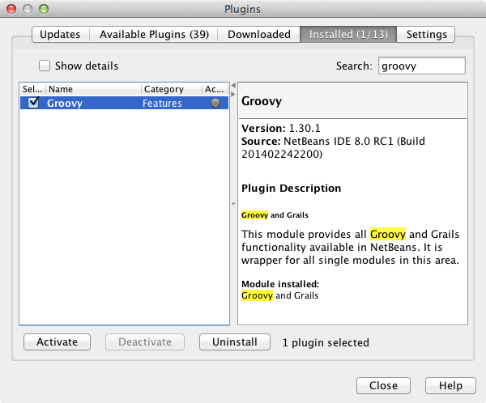

// 
//     Licensed to the Apache Software Foundation (ASF) under one
//     or more contributor license agreements.  See the NOTICE file
//     distributed with this work for additional information
//     regarding copyright ownership.  The ASF licenses this file
//     to you under the Apache License, Version 2.0 (the
//     "License"); you may not use this file except in compliance
//     with the License.  You may obtain a copy of the License at
// 
//       http://www.apache.org/licenses/LICENSE-2.0
// 
//     Unless required by applicable law or agreed to in writing,
//     software distributed under the License is distributed on an
//     "AS IS" BASIS, WITHOUT WARRANTIES OR CONDITIONS OF ANY
//     KIND, either express or implied.  See the License for the
//     specific language governing permissions and limitations
//     under the License.
//

= Введение в Groovy
:jbake-type: tutorial
:jbake-tags: tutorials 
:jbake-status: published
:icons: font
:syntax: true
:source-highlighter: pygments
:toc: left
:toc-title:
:description: Введение в Groovy - Apache NetBeans
:keywords: Apache NetBeans, Tutorials, Введение в Groovy

Этот документ используется для начала работы с link:http://groovy.codehaus.org/[+Groovy+] в IDE NetBeans. В процессе работы будет создано приложение на языке Java, добавлен элемент JFrame, а из файла Groovy будет получено простое сообщение.

image::images/netbeans-stamp-80-74-73.png[title="Содержимое этой страницы применимо к IDE NetBeans 7.2, 7.3, 7.4 и 8.0"]

*Для работы с этим учебным курсом требуется следующее программное обеспечение и ресурсы.*

|===
|Программное обеспечение или материал |Требуемая версия 

|link:https://netbeans.org/downloads/index.html[+IDE NetBeans+] |пакет Java, версии 7.2, 7.3, 7.4, 8.0 

|link:http://www.oracle.com/technetwork/java/javase/downloads/index.html[+Комплект для разработчика на языке Java (JDK)+] |версия 7 или 8 

|Подключаемый модуль Groovy |- 
|===

== Активация подключаемого модуля Groovy

Поддержка Groovy отключена по умолчанию при установке Java-версии среды IDE. Для работы с Groovy в IDE сначала необходимо активировать подключаемый модуль Groovy в диспетчере подключаемых модулей.

1. Выберите *'Сервис'* > *'Подключаемые модули'* в главном меню, чтобы открыть диспетчер подключаемых модулей.
2. Перейдите на вкладку *Установлено* в диспетчере подключаемых модулей.
3. Выберите 'Показать сведения' и найдите подключаемый модуль *Groovy и Grails* в списке подключаемых модулей.

В качестве альтернативы вы можете ввести `groovy` в поле поиска, чтобы отфильтровать список подключаемых модулей.

. Установите подключаемый модуль 'Groovy and Grails' и нажмите 'Активировать'.

. Нажмите кнопку 'Активировать' в окне 'Мастер установки NetBeans IDE', чтобы активировать подключаемый модуль Groovy.

. Нажмите кнопку 'Завершить' в окне 'Мастер установки NetBeans IDE' после завершения установки и затем нажмите 'Закрыть' в диспетчере подключаемых модулей.

== Создание приложения

В этом разделе вы узнаете, как создать новое приложение Java.

1. Выберите 'Файл > Создать проект' (Ctrl-Shift-N; ⌘-Shift-N в Mac) в главном меню, чтобы открыть мастер создания проектов.
2. В категории Java выберите 'Приложение Java'. Нажмите кнопку "Далее".
3. В поле 'Имя проекта' введите *GroovyJavaDemo*, а в поле 'Местоположение проекта' укажите папку, где будет создано приложение.
4. Снимите флажок "Создать главный класс". Нажмите кнопку "Готово".

При нажатии на кнопку 'Готово' IDE создает проект, который отображается в окне 'Проекты'.

== Создание класса Java и файла Groovy

В этом разделе вы узнаете, как создать элемент JFrame и класс Groovy.

1. Щелкните правой кнопкой мыши узел проекта в окне 'Проекты' и выберите 'Создать > Другое'. Откроется диалоговое окно мастера создания файлов.
2. В категории 'Формы Swing GUI' выберите 'Форма JFrame'. Нажмите 'Далее'.

image::images/groovy-newjframe.png[title="Шаблон формы JFrame в мастере создания файлов"]

. В поле 'Имя класса' введите *DisplayJFrame*.

. В поле 'Пакет' введите *org.demo*. Нажмите 'Готово'.

image::images/groovy-newjframe2.png[title="Панель 'Имя и местоположение' в мастере создания форм JFrame"]

При нажатии на кнопку 'Готово' в среде IDE создается форма JFrame, и в редакторе открывается соответствующий файл.

. Щелкните правой кнопкой мыши узел проекта в окне 'Проекты' и выберите 'Создать > Другое'. Откроется диалоговое окно мастера создания файлов.

. В категории Groovy выберите 'Класс Groovy'. Нажмите 'Далее'.

image::images/groovy-newgroovyclass.png[title="Шаблон класса Groovy в мастере создания файлов"]

. В поле 'Имя класса' введите *GreetingProvider*.

. В списке 'Пакеты' выберите пакет  ``org.demo`` . Нажмите кнопку "Завершить".

При нажатии на кнопку 'Готово' IDE создает файл Groovy и открывает его в редакторе.

Если развернуть узел проекта в окне 'Проекты', можно увидеть два только что созданных файла под узлом 'Исходные пакеты'.

== Вызов файла Groovy из класса Java

В этом разделе вы узнаете, как создать код для взаимодействия между файлом Groovy и классом Java.

1. Откройте файл  ``GreetingProvider.groovy``  в редакторе (если он еще не открыт).
2. Задайте переменную приветствия в определении класса, добавив следующий код (выделен полужирным шрифтом). Сохраните изменения.

[source,java]
----

class GreetingProvider {

    *def greeting = "Hello from Groovy"*

}
----

. Откройте файл  ``DisplayJFrame.java``  в редакторе (если он еще не открыт) и перейдите на вкладку 'Конструирование'.

. Откройте палитру (выберите 'Окно > Палитра' в главном меню) и перетащите элемент 'Текстовое поле' ( ``jTextField`` ) и палитры на форму JFrame.

image::images/groovy-jtextfield.png[title="Элемент JTextfield в файле DesignJFrame на вкладке 'Конструирование' в редакторе"]

. Перейдите на вкладку 'Исходный код' и добавьте следующий исходный код в верхнюю часть тела класса, чтобы создать экземпляр класса Groovy и вызвать метод  ``getGreeting()``  в классе Groovy в конструкторе.

[source,java]
----

public class DisplayJFrameForm extends javax.swing.JFrame {*

    GreetingProvider provider = new GreetingProvider();*

    public DisplayJFrame() {
        initComponents();
        *String greeting = provider.getGreeting().toString();
        jTextField1.setText(greeting);*
    }
----

Для поиска в классе Java методов, необходимых для класса Groovy, можно использовать автозавершение кода.

image::images/groovy-codecompletion.png[title="Автозавершение кода в редакторе"]

. Щелкните правой кнопкой мыши узел проекта в окне "Проекты" и выберите "Выполнить".

Если выбрать команду 'Выполнить', IDE выполнит сборку и запуск приложения.

image::images/groovy-runproject.png[title="Окно приложения с текстом из класса Groovy в текстовом поле"]

В текстовом поле в окне приложения отображается текст из класса Groovy.

Теперь читатель может создать базовое приложение на языке Java, взаимодействующее с Groovy.

link:/about/contact_form.html?to=3&subject=Feedback:%20NetBeans%20IDE%20Groovy%20Quick%20Start[+Отправить отзыв по этому учебному курсу+]

== Дополнительные сведения

IDE NetBeans также поддерживает веб-платформу Grails, в которой используется язык Groovy при веб-разработках на Java. Дополнительные сведения об использовании платформы Grails с IDE NetBeans см. в разделе link:../web/grails-quickstart.html[+Введение в платформу Grails+].

