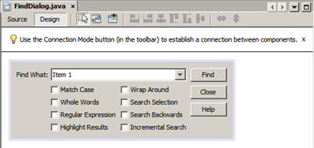
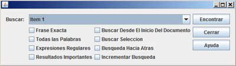
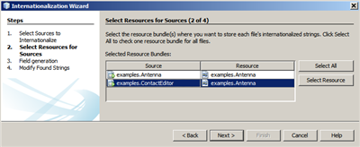

// 
//     Licensed to the Apache Software Foundation (ASF) under one
//     or more contributor license agreements.  See the NOTICE file
//     distributed with this work for additional information
//     regarding copyright ownership.  The ASF licenses this file
//     to you under the Apache License, Version 2.0 (the
//     "License"); you may not use this file except in compliance
//     with the License.  You may obtain a copy of the License at
// 
//       http://www.apache.org/licenses/LICENSE-2.0
// 
//     Unless required by applicable law or agreed to in writing,
//     software distributed under the License is distributed on an
//     "AS IS" BASIS, WITHOUT WARRANTIES OR CONDITIONS OF ANY
//     KIND, either express or implied.  See the License for the
//     specific language governing permissions and limitations
//     under the License.
//

= GUIフォームの国際化
:jbake-type: tutorial
:jbake-tags: tutorials 
:jbake-status: published
:icons: font
:syntax: true
:source-highlighter: pygments
:toc: left
:toc-title:
:description: GUIフォームの国際化 - Apache NetBeans
:keywords: Apache NetBeans, Tutorials, GUIフォームの国際化

次のチュートリアルで、NetBeans IDEでの国際化の基本的な手順の一部を紹介します。フォームの1つに国際化を設定し、後でそのフォームをデザインします。その後、いくつかの異なるパッケージに様々なフォームを含んでいるプロジェクト全体を国際化します。アプリケーションは、自動国際化を指定するか、特別なウィザードを使用して国際化できます。

*予想される所要時間: 30分*

image::images/netbeans-stamp-80-74-73.png[title="このページの内容は、NetBeans IDE 7.0以降に適用されます"]

*このチュートリアルを完了するには、次のソフトウェアとリソースが必要です。*

|===
|ソフトウェアまたはリソース |必須バージョン 

|link:http://netbeans.org/downloads/index.html[+NetBeans IDE+] |バージョン7.0以降 

|link:http://www.oracle.com/technetwork/java/javase/downloads/index.html[+Java Development Kit (JDK)+] |バージョン6、7または8 
|===

== 国際化の原則

国際化によって、技術的な変更や再コンパイルを行わずに、様々な言語や地域にアプリケーションを対応させることができます。プログラムを国際化することによって、プログラム内でハードコーディングすることなく、ステータス・メッセージやGUIコンポーネント・ラベルなどのテキスト要素をソース・コードの外部に保存し、動的に読み出すことができます。

一般的に、国際化した文字列は、キーと値のペアの形式でプロパティ・ファイルに保存します。キーはプログラムがテキストを読み出すために使用する識別子で、値は実際のテキストです。プログラムを変換する各ロケール(または言語)に対して、プロパティ・ファイルを1つ作成します。キーは各ロケールで同じで、文字列のみが異なります。

IDEには、次の各操作を行うためのツールが用意されています。

* GUIフォームまたはJavaプログラムの作成時に国際化文字列を挿入する
* 個別ファイルまたはファイルのグループで、ハードコードされたすべての文字列を国際化された文字列で置換する

== デザイン時のGUIフォームの国際化

この課題では、GUIビルダーを使用して作成された、よく知られている検索ダイアログを含む、デモのJavaアプリケーション・プロジェクトを開きます。次に、フォームFindDialog.javaの自動国際化をオンに切り替えます。国際化されたGUIフォームをテストするために、プロパティ・ファイルに新しいロケールを追加し、デフォルト以外のロケールでフォームを実行します。

=== サンプル・プロジェクトを開く

1. コンピュータ上の任意の場所に、link:https://netbeans.org/files/documents/4/770/InternationalizeDemo.zip[+InternationalizeDemo.zip+]プロジェクトをダウンロードして解凍します。
2. 「ファイル」>「プロジェクトを開く」を選択し、前のステップで抽出した ``InternationalizeDemo`` プロジェクトに移動して「開く」をクリックします。プロジェクト・フォルダは、 ``InternationalizeDemo`` という名前の含まれるフォルダ内にある場合もあります。
3. 「ソース・パッケージ」>「demo」を展開し、 ``FindDialog.java`` をダブルクリックします。サンプル・フォームがGUIビルダーで開きます。

image::images/finddialog_ai18n.png[]

=== 自動国際化をオンに切替え

1. 「ナビゲータ」ウィンドウでルート・ノード( ``Form FindDialog`` )を選択します。

image::images/navigator.png[]

. 「プロパティ」ウィンドウで、「自動国際化」プロパティのチェックボックスを選択します。

image::images/properties.png[]

. 「GUIフォーム形式のアップグレード」ダイアログ・ボックスで「アップグレード」をクリックします。

チェックボックスが選択されると、「 ``プロパティ・バンドル・ファイル`` 」プロパティで設定されているとおりに、IDEが ``demo`` パッケージ内に ``Bundle.properties`` ファイルを作成します。

image::images/bundle_new.png[]

 ``Bundle.properties`` ファイルを別の場所に置く必要がある場合は、「プロパティ・バンドル・ファイル」の右側の省略符号ボタン(...)をクリックして場所を選択するか、プロパティのテキスト・フィールドにパスを直接入力できます。

. 「プロジェクト」ウィンドウで、「プロジェクト」ウィンドウの「 ``Bundle.properties`` 」ノードをダブルクリックするか、またはノードを右クリックして「編集」を選択します。

プロパティ・ファイルがソース・エディタに表示されます。フォーム ``FindDialog.java`` に適切なキーと値がすべて生成されていることがわかります。各キーの名前は、フォームのファイル名とコンポーネントの変数名から派生されます。たとえば、キー ``FindDialog.jLabel1.text`` は、フォーム・ファイル ``FindDialog`` に配置された ``jLabel1`` という変数名を持つコンポーネント用に生成されます。値 ``jLabel1`` は、この例ではコンポーネントの「text」プロパティを表しています。

.  ``Bundle.properties`` ファイルを閉じます。

=== 個別のGUIコンポーネントの国際化

GUIビルダーを使用して、フォームのJLabelsおよびJButtonsの国際化文字列を入力します。

1. デザイン領域で、適切なGUIコンポーネント(例:  ``jLabel1`` )を選択します。
2. 「プロパティ」ウィンドウで、「text」プロパティの省略符号ボタン(...)をクリックします。

*注意:* Mnemonic、Accessible Name、Accessible Descriptor、ToolTipなどの、文字列値を持つその他のプロパティも国際化できます。

. プロパティ・エディタがリソース・バンドル・モードに切り替わります。「バンドル名」フィールドが ``demo.Bundle`` に設定され、「キー」フィールドに文字列 ``FindDialog.jLabel1.text`` が含まれていることを確認します。

. 「値」フィールドに「 ``Find What:`` 」と入力します。

. 「OK」をクリックします。

すべてのコンポーネントで前述の手順を繰り返すと、フォームは次の図のようになります。

[.feature]
--

--

*注意:* ステップ1から5はより単純で、すばやい方法で実行できます。単にデザイン・ビューで「 ``jLabel1`` 」をダブルクリックし、テキストを「 ``jLabel1`` 」から「 ``Find What:`` 」に変更して、[Enter]を押します。結果は前述の手順と同じです。

コンポーネントを同じ幅にするには、次の手順を実行します。

1. フォーム内の8つのjCheckBoxをすべて[Ctrl]を押しながらクリックして選択します。
2. jCheckBoxが選択された状態で、いずれか1つを右クリックし、ポップアップ・メニューから「同じサイズ」>「同じ幅」を選択します。
3. 3つのjButtonに対してステップ1から2を適用します。

=== 新規ロケールの追加

1. 「ナビゲータ」ウィンドウでルート・ノード( ``Form FindDialog`` ノード)を選択します。
2. 「プロパティ」ウィンドウで、「デザイン・ロケール」プロパティの省略符号ボタン(...)をクリックします。
3. 「新規ロケール」ダイアログ・ボックスで、 ``「事前定義ロケール:」`` コンボ・ボックスから ``「es_ES」`` を選択します。
4. 「OK」をクリックします。

次に示すように、「 ``Bundle.properties`` 」ノードの下に新しいロケールが表示されます。

image::images/addlocale_new.png[]

. 「プロジェクト」ウィンドウで、 ``Bundle.properties`` を右クリックして「開く」を選択します。

. 次に示すように、表の対応する列の個々のメッセージを、新しい言語(スペイン語など)に変換します。

[.feature]
--

image::images/bundles_new_small.png[role="left", link="images/bundles_new.png"]

--

. [Ctrl]-[S]を押して編集を保存します。

. 「 ``FindDialog.java`` 」タブを選択して、国際化しているフォームを表示します。

. 「ナビゲータ」ウィンドウのルート・ノードを右クリックし、「フォームの再ロード」を選択します(または[Ctrl]+[R]を押します)。

. 表示される「質問」ダイアログ・ボックスで「保存」をクリックします。
フォームが再度開き、次に示すように、スペイン語ロケールがデザインにロードされます。

[.feature]
--

image::images/finddialog_es_new_small.png[role="left", link="images/finddialog_es_new.png"]

--

=== デフォルト以外のロケールのテスト

1. 「プロジェクト」ウィンドウで、「InternationalizeDemo」プロジェクトを右クリックし、「プロパティ」を選択します。
2. 「カテゴリ」ペインで、「実行」ノードを選択します。
3. 「VMオプション」フィールドに「 ``-Duser.language=es -Duser.country=ES`` 」と入力します。

[.feature]
--

image::images/prjproperties_small.png[role="left", link="images/prjproperties.png"]

--

. 「OK」をクリックします。

. 「InternationalizeDemo」プロジェクトを右クリックし、「実行」を選択します。

次に示すように、IDEによって「 ``FindDialog`` 」ダイアログ・ボックスがスペイン語ロケールで実行されます。

[.feature]
--

--

== プロジェクト全体の国際化

通常、デフォルト・ロケールには複数のファイルがあり、他の言語に変換するためにそれらを適用するように求められます。国際化ウィザードは、このタスクに対する完璧なツールで、一度に複数のファイルを国際化できます。この機能について、GUIフォームのサンプル・プロジェクト(link:quickstart-gui.html[+Swing GUIのデザイン+]のチュートリアルで作成したフォームが含まれる)で説明します。

=== サンプル・プロジェクトの作成

1. 「ファイル」>「新規プロジェクト」を選択するか、IDEツールバーで「新規プロジェクト」アイコンをクリックします。
2. 「カテゴリ」ペインで、「サンプル」>「Java」ノードを選択します。「プロジェクト」ペインで、「GUIフォームの例」を選択します。「次」をクリックします。
3. 「プロジェクト名」フィールドに「 ``GUIFormExamples`` 」と入力し、プロジェクトの場所を指定します(例:  ``/space/projects`` )。
4. 「終了」をクリックします。

image::images/formexamples.png[]

=== プロパティ・ファイルの準備

1. 「ファイル」>「新規ファイル」を選択するか、IDEのツールバーで「新規ファイル」アイコンを選択します。
2. 「カテゴリ」ペインで「その他」ノードを選択し、「ファイル・タイプ」ペインで「プロパティ・ファイル」を選択します。「次」をクリックします。
3. 「ファイル名」フィールドに「 ``ContactEditor`` 」と入力します。
4. 「参照」をクリックし、「フォルダを参照」ダイアログ・ボックスでファイルの場所として ``GUIFormExamples/src/examples`` フォルダを指定します。
5. 「フォルダを選択」をクリックします。
6. 「終了」をクリックします。

IDEによって ``ContactEditor.properties`` ファイルが作成され、ソース・エディタに表示されます。

前述の手順を繰り返し、別の ``Antenna.properties`` ファイルを作成します。

image::images/ceprjprops.png[]

=== 国際化ウィザードの呼出し

1. メイン・メニューで、「ツール」>「国際化」>「国際化ウィザード」を選択します。
2. ウィザードの最初のページで、「ソースを追加」をクリックします。
3. 「ソースを選択」ダイアログ・ボックスで、「 ``ソース・パッケージ`` 」>「 ``examples`` 」ノードを展開し、[Ctrl]を押しながら ``Antenna.java`` 、 ``ContactEditor.java`` 、および ``Find.java`` ファイルをクリックして選択します。
4. 「OK」をクリックします。

次に示すように、ソース・ファイルがウィザードの最初のページに表示されます。

[.feature]
--

image::images/i18nwizardone_small.png[role="left", link="images/i18nwizardone.png"]

--

. デモの目的で、「 ``examples.Find`` 」を選択し、「ソースを除去」ボタンをクリックします。

. 「次」をクリックします。

. 国際化ウィザードが正しいプロパティ・ファイル ``examples.Antenna`` と ``examples.ContactEditor`` を提示するかどうかを確認します。提示しない場合、「リソースを選択」ボタンを使用して正しいプロパティ・ファイルを選択します。

[.feature]
--

--

. 「次」をクリックします。

. フィールドを作成する予定はないため、ウィザードの3ページ目をスキップし、追加の値を変更して「次」をクリックします。

. ハードコードされた文字列は、国際化ウィザードの最後のステップですべて表示されます。それらのうちどれがプロパティ・ファイルからのものかを判断できます(チェックボックスを使用)。文字列の省略符号ボタン(...)をクリックして、個々のキー、値、コメント、および置換した文字列の書式をさらにカスタマイズできます。

[.feature]
--

image::images/i18nwizardthree_small.png[role="left", link="images/i18nwizardthree.png"]

--

. 「終了」をクリックします。

これでソース・コードの国際化は終了し、前述したように、他のロケールも<<newlocale,追加>>したり<<testlocale,テスト>>したりできます。

== 単一フォームの国際化

GUIフォームを国際化するには、自動国際化機能を使用するのが最も簡単な方法です。ただし、更新パックをインストールしていない場合、またはフォーム・エディタによって生成されていないコードも国際化する場合は、国際化ウィンドウを使用することをお薦めします。(この機能は、フォーム・エディタを使用して作成されたファイルのみでなく、任意の ``.java`` ファイルでも機能します)。次の例では、NetBeans IDEのデフォルト・インストールに含まれている国際化ウィンドウを使用します。

この最後の課題では、GUIフォームのサンプル・プロジェクトを再利用して、前の課題で除外したFind.javaフォームを国際化します。「国際化」ダイアログ・ボックスを呼び出して、このファイル内のハードコードされた文字列をすべて置換します。最後に、プログラムの記述時にソース・コードに国際化文字列を挿入する方法の簡単なデモを示します。

=== 「国際化」ダイアログ・ボックスの使用

1. 「プロジェクト」ウィンドウで、「 ``Find.java`` 」を選択し、メイン・メニューから「ツール」>「国際化」>「国際化」を選択します。

IDEは、「国際化」ダイアログ・ボックスと、事前入力済の ``Find.java`` ソース・コードから最初にハードコードされた文字列を表示します。

. 「選択」をクリックして特定のプロパティ・ファイルを選択するか、または新しいプロパティ・ファイルを作成します。

. 「リソース・バンドルを選択」ダイアログ・ボックスで、「ファイル名」テキスト・フィールドに「 ``Find.properties`` 」と入力し、「新規作成」をクリックしてから「OK」をクリックします。

. 必要に応じて、置換された文字列、キー、値、またはコメントの書式を変更できます。デフォルトの値はそのままにします。

. 「置換」をクリックして変更を確認し、フォーカスを次のハードコードされた文字列に移動します。

ハードコードされた文字列を置換する必要がない場合は、「スキップ」ボタンをクリックします。

[.feature]
--

image::images/i18ndialog_small.png[role="left", link="images/i18ndialog.png"]

--

=== 単一国際化文字列の挿入

1. 「プロジェクト」ウィンドウで、 ``Find.java`` を右クリックして「編集」を選択します。

IDEは、ソース・エディタで ``Find.java`` ファイルを開きます。

. ソース・コードをスクロールし、mainメソッドを探します。

. mainメソッドに、次の太字の行を挿入します。

[source,xml]
----

    public static void main(String args[]) {
			   /* Set the Nimbus look and feel */
			   //<editor-fold defaultstate="collapsed" desc=" Look and feel setting code (optional) ">
        /* If Nimbus (introduced in Java SE 6) is not available, stay with the default look and feel.
         * For details see http://download.oracle.com/javase/tutorial/uiswing/lookandfeel/plaf.html 
         */
        try {
            javax.swing.UIManager.LookAndFeelInfo[] installedLookAndFeels=javax.swing.UIManager.getInstalledLookAndFeels();
			for (int idx=0; idx<installedLookAndFeels.length; idx++)
			if ("Nimbus".equals(installedLookAndFeels[idx].getName())) {
			    javax.swing.UIManager.setLookAndFeel(installedLookAndFeels[idx].getClassName());
				break;
			}
        } catch (ClassNotFoundException ex) {
            java.util.logging.Logger.getLogger(Find.class.getName()).log(java.util.logging.Level.SEVERE, null, ex);
        } catch (InstantiationException ex) {
            java.util.logging.Logger.getLogger(Find.class.getName()).log(java.util.logging.Level.SEVERE, null, ex);
        } catch (IllegalAccessException ex) {
            java.util.logging.Logger.getLogger(Find.class.getName()).log(java.util.logging.Level.SEVERE, null, ex);
        } catch (javax.swing.UnsupportedLookAndFeelException ex) {
            java.util.logging.Logger.getLogger(Find.class.getName()).log(java.util.logging.Level.SEVERE, null, ex);
        }
        //</editor-fold>
        *System.out.println();*
		/* Create and display the form */ 
        java.awt.EventQueue.invokeLater(new Runnable() {
            public void run() {
                new Find().setVisible(true);
            }
        });
               }
----

.  ``System.out.println();`` の括弧内にカーソルを移動して、国際化文字列をパラメータとして挿入できるようにします。

. [Ctrl]-[Shift]-[J]を押して「国際化文字列を挿入」ダイアログ・ボックスを起動します(または、メイン・メニューから「ツール」>「国際化」>「国際化文字列を挿入」を選択できます)。

. 「バンドル名」で、「選択」ボタンをクリックし、 ``「ソース・パッケージ」>「examples」`` フォルダを選択して、「ファイル名」テキスト・フィールドにバンドル名として「 ``Find`` 」と入力します。「OK」をクリックします。
「国際化文字列を挿入」ダイアログ・ボックスの「バンドル名」フィールドに、「 ``examples.Find`` 」と表示されます。

. 「キー」ドロップダウン・ボックスに「 ``Start`` 」と入力し、「値」フィールドに「 ``Start Find Dialog`` 」と入力します。「OK」をクリックします。

image::images/insi18nstring.png[]

. 次のように、IDEが国際化文字列を挿入します。

[source,xml]
----

    public static void main(String args[]) {
			   /* Set the Nimbus look and feel */
			   //<editor-fold defaultstate="collapsed" desc=" Look and feel setting code (optional) ">
        /* If Nimbus (introduced in Java SE 6) is not available, stay with the default look and feel.
         * For details see http://download.oracle.com/javase/tutorial/uiswing/lookandfeel/plaf.html 
         */
        try {
            javax.swing.UIManager.LookAndFeelInfo[] installedLookAndFeels=javax.swing.UIManager.getInstalledLookAndFeels();
			for (int idx=0; idx<installedLookAndFeels.length; idx++)
			if ("Nimbus".equals(installedLookAndFeels[idx].getName())) {
			    javax.swing.UIManager.setLookAndFeel(installedLookAndFeels[idx].getClassName());
				break;
			}
        } catch (ClassNotFoundException ex) {
            java.util.logging.Logger.getLogger(Find.class.getName()).log(java.util.logging.Level.SEVERE, null, ex);
        } catch (InstantiationException ex) {
            java.util.logging.Logger.getLogger(Find.class.getName()).log(java.util.logging.Level.SEVERE, null, ex);
        } catch (IllegalAccessException ex) {
            java.util.logging.Logger.getLogger(Find.class.getName()).log(java.util.logging.Level.SEVERE, null, ex);
        } catch (javax.swing.UnsupportedLookAndFeelException ex) {
            java.util.logging.Logger.getLogger(Find.class.getName()).log(java.util.logging.Level.SEVERE, null, ex);
        }
        //</editor-fold>
*        System.out.println(java.util.ResourceBundle.getBundle("examples/Find").getString("Start"));*
        /* Create and display the form */
        java.awt.EventQueue.invokeLater(new Runnable() {
            public void run() {
                new Find().setVisible(true);
                }
            });
               }
----

link:/about/contact_form.html?to=3&subject=Feedback:Internationalizing%20a%20GUI%20Form%20in%20NetBeans%20IDE[+このチュートリアルに関するご意見をお寄せください+]

== 関連項目

詳細は、次のリンクを参照してください。

* _NetBeans IDEによるアプリケーションの開発_のlink:http://www.oracle.com/pls/topic/lookup?ctx=nb8000&id=NBDAG920[+Java GUIの実装+]
* link:../../trails/matisse.html[+Java GUIアプリケーションの学習+]
* link:quickstart-gui.html[+Swing GUIのデザイン+]
* link:http://wiki.netbeans.org/wiki/view/NetBeansUserFAQ[+GUIビルダーのFAQ+]
