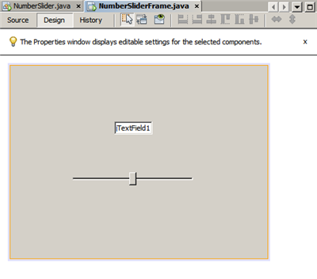
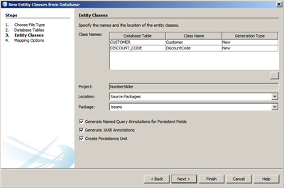

// 
//     Licensed to the Apache Software Foundation (ASF) under one
//     or more contributor license agreements.  See the NOTICE file
//     distributed with this work for additional information
//     regarding copyright ownership.  The ASF licenses this file
//     to you under the Apache License, Version 2.0 (the
//     "License"); you may not use this file except in compliance
//     with the License.  You may obtain a copy of the License at
// 
//       http://www.apache.org/licenses/LICENSE-2.0
// 
//     Unless required by applicable law or agreed to in writing,
//     software distributed under the License is distributed on an
//     "AS IS" BASIS, WITHOUT WARRANTIES OR CONDITIONS OF ANY
//     KIND, either express or implied.  See the License for the
//     specific language governing permissions and limitations
//     under the License.
//

= Binding Beans and Data in a Java Application
:jbake-type: tutorial
:jbake-tags: tutorials 
:jbake-status: published
:syntax: true
:icons: font
:source-highlighter: pygments
:toc: left
:toc-title:
:description: Binding Beans and Data in a Java Application - Apache NetBeans
:keywords: Apache NetBeans, Tutorials, Binding Beans and Data in a Java Application

This guide is an introduction to the support in NetBeans IDE for beans binding and data binding in Java applications.

image::images/netbeans-stamp-80-74-73.png[title="Content on this page applies to NetBeans IDE 7.1, 7.2, 7.3, 7.4 and 8.0"]

*To complete this tutorial, you need the following software and resources.*

|===
|Software or Resource |Version Required 

|xref:../../../download/index.adoc[NetBeans IDE] |version 7.1, 7.2, 7.3, 7.4, or 8.0 

|link:http://www.oracle.com/technetwork/java/javase/downloads/index.html[+Java Development Kit (JDK)+] |version 6 or higher 
|===

== Introduction: Beans Binding in NetBeans IDE

Until the release of the beans binding library, it was somewhat cumbersome to connect UI components to databases or to keep values of component properties in sync. For example, displaying data from a standard database in a JTable required the manual creation of utility classes to handle the connection between the database and the JTable. And keeping values of different bean properties in sync (such as the value of a JTextField with the rendering of a visual bean) required hand-coding of listeners and event handlers.

The beans binding library simplifies and standardizes all of this. You can merely write a few lines of code to establish which properties of which components need to be kept in sync, and the beans binding library handles the rest. In the NetBeans IDE, beans binding features are integrated in the GUI Builder, so you can quickly get the behavior of your application coded soon after you have established the visual design.

This guide is an overview of the main aspects of beans binding in the IDE.

== Binding Properties to Other Properties

At its most basic, beans binding is a way to connect bean properties without using event listening and handling code.

To illustrate the concept of beans binding and how the IDE supports it, we will do a simple example where a user can adjust a slider to change a numerical value in a text field.

*To set up the example:*

1. In the IDE, choose, File > New Project.
2. Select the Java category and select the Java Application template. Click Next.
3. In the Name and Location page of the wizard, perform the following operations:
* Type  ``NumberSlider``  as the project name.
* Leave the Use Dedicated Folder for Storing Libraries checkbox unselected.

[.feature]
--
image:images/numberslider-small.png[role="left", link="images/numberslider.png"]
--

* Clear the Create Main Class checkbox.

. Click Finish to exit the wizard and set up the project.

. In the Projects window, right-click the NumberSlider project node and choose New > JFrame Form.

(If JFrame Form is not available in the New menu, choose Other. Then in the New File wizard, select the Swing GUI Forms category and select the JFrame Form template.)

. In the Name and Location page of the wizard, perform the following operations:
* Type  ``NumberSliderFrame``  for the class name.
* Type  ``numberslider``  for the package name.

[.feature]
--

image::images/numberslider2-small.png[role="left", link="images/numberslider2.png"]

--

. Click Finish to exit the wizard and create the form.

 ``NumberSliderFrame.java``  should open in design mode in the editing area.

. From the Swing Controls section of the Palette, drag a slider component into the design area. (If the Palette window is not open, choose Window > Palette.)

. From the Palette, drag a text field component to the design area.

The resulting form might look something like the screenshot below. However, positioning is not important for purposes of this example.

[.feature]
--

--

=== Source and Target

Now that we have set up the example, we are ready to create the binding. However, first we need to determine which component will be the _source_ of the binding and which will be the _target_. The binding source component is where a value for the property first originates.

When binding in the GUI Editor, you initiate a binding on the target and then you declare the source in the Bind dialog box.

In this case, since the JSlider comes with a default range of values, we will use it as the source.

NOTE: Bindings can be two-way (read/write), so that changes in the target are automatically reflected in the source. However, the direction of the initial binding is always from the source to the target. See the information on Update Mode in the <<prop-advanced,Advanced Binding Configuration>> section.

*To bind the slider to the text field:*

1. Right-click the text field component and choose Bind > text to open the Bind dialog box.
2. From the Binding Source combo box, select  ``jSlider1`` .
3. From the Binding Expression combo box, select  ``value int``  as shown in the image below.

[.feature]
--

image::images/bind-dialog-small.png[role="left", link="images/bind-dialog.png"]

--

. Click OK.

You have just bound the  ``value``  bean property of the slider to the  ``text``  value of the text field.

In the design area, the text field should show the value  ``50`` . This value reflects the fact that the slider is in the middle position and the default range of values for the slider is from 0 to 100.

You can now run the application and see the binding in action.

Choose Run > Run File, to run the file.

The application should start in a separate window. Adjust the slider in the running application and watch the value change in the text field.

image::images/run-numberslider.png[]

== Binding Custom Beans

In the previous section, you bound properties of two standard Swing components that you added to your form from the Palette. You can also bind the properties of other beans. However, to do so, you have to perform a few steps to make the IDE's features for generating the binding code for that bean available. You can take either of the following approaches to making the IDE's binding features available for a bean:

* Add the bean to the Palette so that you can add it to a form just as you would use add a standard Swing component.
* Add the bean class to your project and compile the bean.

To add a bean to the Palette window:

1. Make sure that the bean is compiled.
2. Choose Tools > Palette > Swing/AWT Components.
3. If you want to create a new palette category for the bean, click New Category and enter the desired name before you add the bean.
4. Click Add from JAR, Add from Library, or Add from Project and complete the wizard to add the bean.

To add a bean from your project:

1. In the Project's window, right-click the node for the bean and choose Compile File.
2. Drag the bean to the form.

You should then see the bean in the Inspector window. You can then invoke the Bind dialog for any of the bean's properties.

== Advanced Binding Configuration

The example in the first section of this tutorial shows a straightforward binding with some default behaviors. But sometimes you might want or need to configure your binding differently. If that is the case, you can use the Advanced tab of the Binding dialog box.

The Advanced tab of the dialog box contains the following fields:

* *Name. *Enables you to create a name for the binding, which gives you more flexibility for managing your bindings. The name is added to the constructor of the binding and can be referenced with the binding's  ``getName()``  method.
* *Update Mode. * Specifies the way that the properties are kept synchronized. The possible values are:
* *Always sync (read/write).* Whenever a change is made to either the source or the target, the other is updated.
* *Only read from source (read only).* The target is only updated the first time the source value is set. Changes that are made to the source are updated in the target. Changes made to the target are not updated in the source.
* *Read from source once (read once).* The target is only updated when the target and source are initially bound.
* *Update Source When *(available only to the  ``text``  property of JTextField and JTextArea components). Enables you to select the frequency with which the properties are synchronized.
* *Ignore Adjusting* (available to the  ``value``  property of JSlider; to the  ``selectedElement``  property of JTable and JList; and to the  ``selectedElements``  property of JTable and JList). If this checkbox is selected, any changes made to one property are not propagated to the other property until the user is finished making the change. For example, when the application's user drags a slider, the value of the property to which the slider's  ``value``  property is bound is only updated once the user releases the mouse button.
* *Converter.* If your binding involves properties with different data types, you can specify code that converts values between the types. The beans binding library handles many commonly needed conversions, but you might need to provide your own converters for other combinations of property types. Such converters need to extend the  ``org.jdesktop.beansbinding.Converter``  class.

The Converter drop-down list is populated with any converters that have been added as beans to your form. You can also add the conversion code directly by clicking the ellipsis (...) button, and selecting Custom Code from the Select Converter Property Using drop-down list.

Below is a list of conversions for which you do not need to provide a converter:

* BigDecimal to String, String to BigDecimal
* BigInteger to String, String to BigInteger
* Boolean to String, String to Boolean
* Byte to String, String to Byte
* Char to String, String to Char
* Double to String, String to Double
* Float to String, String to Float
* Int to String, String to Int
* Long to String, String to BigDecimal
* Short to String, String to Short
* Int to Boolean, Boolean to Int
* *Validator. * Enables you to specify code to validate a change in the target property value before propagating that change back to the source property. For example, you can use a validator to make sure that an integer property value is within a specific range.

Validators need to extend the  ``org.jdesktop.beansbinding.Validator``  class. 
The Validator drop-down list is populated with any validators that have been added as beans to your form. You can also add the validation code directly by clicking the ellipsis (...) button, and selecting Custom Code from the Select Validator Property Using drop-down list.

* *Null Source Value. * Enables you to specify a different value to use if the source property has a  ``null``  value when the binding is attempted. This field corresponds with the  ``setSourceNullValue()``  method of the  ``org.jdesktop.beansbinding.Binding``  class.
* *Unreadable Source Value. * Enables you to specify a different value to use if the binding expression cannot be resolved when the binding is attempted. This field corresponds with the  ``setSourceUnreadableValue()``  method of the  ``org.jdesktop.beansbinding.Binding``  class.

NOTE: To better understand the classes and methods mentioned above, you can access the beans binding Javadoc documentation directly from the IDE. Choose Help > Javadoc References > Beans Binding. In the browser window that opens, click the  ``org.jdesktop.beansbinding``  link to access documentation for those classes.

== Binding Data to Components

In addition to synchronizing properties of visual Swing components and other custom beans, you can use beans binding to help you use visual components to interact with a database. Once you have created a new Java form and added components to the form, you can generate code to bind those components to data. This section shows you how to bind data to Swing JTable, JList, and JComboBox components.

Before binding a component to data from a database, you need to have done the following things:

* Connected to a database in the IDE.
* Created classes that represent the database tables to which you want to bind. Steps on creating the entity classes for binding data to a component are given below.

=== Creating Entity Classes

*To create entity classes to represent the database that is to be bound to the JTable:*

1. In the Projects window, right-click your project and choose New > Other, select the Persistence category, and select the Entity Classes from Database template.
2. In the Database Tables page of the wizard, select the database connection.
3. Once the Available Tables column is populated, select the tables that you want to use in your application and click Add to move them to the Selected Tables column. Click Next.

[.feature]
--

image::images/entity-wizard1-small.png[role="left", link="images/entity-wizard1.png"]

--

. In the Entity Classes page of the wizard, make sure the Generate Named Query Annotations for Persistent Fields and Create Persistence Unit checkboxes are selected.

[.feature]
--

--

. Make any customizations that you want to make to the names of the generated classes and their location.

. Click Finish.

You should see nodes for the entity classes in the Projects window.

=== Binding Components to the Beans That Represent the Data

This section shows you how you can bind data to JTable, JList, and JComboBox components.

*To add a database table to a form and automatically generate a JTable to display the database table's contents:*

1. Open the Services window.
2. Connect to the database that contains the table that you want to add to the form. (You can connect to the database by right-clicking the node for the database connection and choosing Connect.)

NOTE: The tutorial uses the  ``sample [app on App]``  database that can be connected to by selecting the Services window, expanding the Databases node, right-clicking the database connection node ( ``jdbc:derby://localhost:1527/sample[app on APP]`` ), and choosing Connect from the context menu.
Specify  ``app``  as a userid and  ``app``  as a password, if you are prompted for a userid and password.

. Expand the node for the connection, and expand its Tables node.

. Drag the node for the table on to the form and press Ctrl as you drop the table.

A JTable is created and its columns are bound to the columns in the database table.

*To bind a database table to an existing JTable component:*

1. Right-click the component in the GUI Builder and choose Bind > elements.

[.feature]
--

image::images/bind-dialog-table-small.png[role="left", link="images/bind-dialog-table.png"]

--

. Click Import Data to Form. From the Import Data to Form dialog box, select the database table to which you want to bind your components. Click OK.

. From the Binding Source combo box, select the item that represents the result list of the entity class. For example, if the entity class is called,  ``Customer.java`` , the list object would be generated as  ``customerList`` .

[.feature]
--

image::images/source-selected-small.png[role="left", link="images/source-selected.png"]

--

. Leave the Binding Expression value as  ``null`` .

. If there are any database columns that you do not want to appear in the JTable, select those columns in the Selected list and move them to the Available list.

. Select the Advanced tab to further configure the binding. For example, you can specify a validator or converter, or you can specify behavior if the binding source is null or unreadable.

. Click OK.

*To bind the data to a JList component:*

1. Right-click the component in the GUI Builder and choose Bind > elements.
2. Click Import Data to Form. From the Import Data to Form dialog box, select the database table to which you want to bind your components. Click OK.
3. From the Binding Source combo box, select the item that represents the result list of the entity class. For example, if the entity class is called,  ``Customer.java`` , the list object would be generated as  ``customerList`` .

[.feature]
--

image::images/jlist-binding-small.png[role="left", link="images/jlist-binding.png"]

--

. Leave the Binding Expression value as  ``null`` .

. In the Display Expression drop-down list, select the property that represents the database column that contains the values that you want to display in the list.

. Select the Advanced tab to further configure the binding.

. Click OK.

*To bind the data to a JComboBox component:*

1. Right-click the combo box and choose Bind > elements.
2. Click Import Data to Form. From the Import Data to Form dialog box, select the database table to which you want to bind your components. Click OK.
3. From the Binding Source combo box, select the item that represents the result list of the entity class. For example, if the entity class is called,  ``Customer.java`` , the list object would be generated as  ``customerList`` .

[.feature]
--

image::images/combo-binding-small.png[role="left", link="images/combo-binding.png"]

--

. Leave the Binding Expression value as  ``null``  and click OK.

. Right-click the combo box again and choose Bind > selectedItem.

. Bind to the property that you want to be affected by the user selection.

image::images/combo-item.png[]

. Click OK to save your edits.

The Beans Binding library (as of version 1.2.1) does not have a DetailBinding class that enables you to specify how to derive the _display_ values for the JComboBox. So you will need to write some custom code. One approach is to write a custom cell renderer, as shown below.

*To render the combo box properly:*

1. Select the combo box.
2. In the Properties tab of the Properties window, select the renderer property.
3. Click the ellipsis (...) button.
4. In the combo box at the top of the property editor, select Custom Code.
5. In the text area, enter code similar to the following (where `jComboBox1` is the name of the JComboBox instance, `MyEntityClass` is the entity class, and `getPropertyFromMyEntityClass()` is the getter for the property in the entity class which you are binding.

[source,java]
----

jComboBox1.setRenderer(new DefaultListCellRenderer() {
           @Override
           public Component getListCellRendererComponent(
                   JList list, Object value, int index, boolean isSelected, boolean cellHasFocus) {
               super.getListCellRendererComponent(list, value, index, isSelected, cellHasFocus);
               if (value instanceof MyEntityClass) {
                   MyEntityClass mec = (MyEntityClass)value;
                   setText(mec.getPropertyFromMyEntityClass());
               }
               return this;
           }
            })
----

[.feature]
--

image::images/custom-small.png[role="left", link="images/custom.png"]

--

NOTE: You can also create a custom renderer in its own source file, compile the file, drag the renderer on to the form, and then set the combo box's renderer property to use this bean.

== Special Binding Properties

Where necessary, the beans binding library provides special synthetic properties for some Swing components that are missing from the components themselves. These properties represent things, such as a table's selected row, that are useful to bind to other properties.

Below is a list of the synthetic properties added by the beans binding libraries:

|===
|Component |Property |Description 

|AbstractButton |selected |The selected state of a button. 

|JComboBox |selectedItem |The selected item of a JComboBox. 

|JSlider |value |The value of a JSlider; notifies of all changes. 

|value_IGNORE_ADJUSTING |Same as "value" but does not notify of change while the slider is adjusting its value. 

|JList |selectedElement |The selected element of a JList; notifies of all changes. If there is a JListBinding with the JList as the target, the selected element is reported as an element from the binding's source list. Otherwise, the selected element is reported as an object from the list's model. If nothing is selected, the property evaluates to  ``null`` . 

|selectedElements |A list containing the selected elements of a JList; notifies of all changes. If there is a JListBinding with the JList as the target, the selected elements are reported as elements from the binding's source list. Otherwise, the selected elements are reported as objects from the list's model. If nothing is selected, the property evaluates to an empty list. 

|selectedElement_IGNORE_ADJUSTING |Same as "selectedElement" but does not notify of change while the list selection is being updated. 

|selectedElements_IGNORE_ADJUSTING |Same as "selectedElements" but does not notify of change while the list selection is being updated. 

|JTable |selectedElement |The selected element of a JTable; notifies of all changes. If there is a JTableBinding with the JTable as the target, the selected element is reported as an element from the binding's source list. Otherwise, the selected element is reported as a map where the keys are composed of the string "column" plus the column index and the values are the model values for that column. Example: {column0=column0value, column1=column1value, ...} If nothing is selected, the property evaluates to  ``null`` . 

|selectedElements |A list containing the selected elements of a JTable; notifies of all changes. If there is a JTableBinding with the JTable as the target, the selected elements are reported as elements from the binding's source list. Otherwise, each selected element is reported as a map where the keys are composed of the string "column" plus the column index and the values are the model values for that column. Example: {column0=column0value, column1=column1value, ...} If nothing is selected, the property evaluates to an empty list. 

|selectedElement_IGNORE_ADJUSTING |Same as "selectedElement" but does notify of change while the table selection is being updated. 

|selectedElements_IGNORE_ADJUSTING |Same as "selectedElements" but does not notify of change while the table selection is being updated. 

|JTextComponent (including its sub-classes JTextField, JTextArea, and JEditorPane) |text |The text property of a JTextComponent; notifies of all changes (including typing). 

|text_ON_FOCUS_LOST |The text property of a JTextComponent; notifies of change only when focus is lost on the component. 

|text_ON_ACTION_OR_FOCUS_LOST |The text property of a JTextComponent; notifies of change only when the component notifies of actionPerformed or when focus is lost on the component. 
|===
xref:../../../community/mailing-lists.adoc[Send Us Your Feedback]

== See Also

* link:http://www.oracle.com/pls/topic/lookup?ctx=nb8000&id=NBDAG2649[+Working with Database Applications and Beans Binding+] in _Developing Applications with NetBeans IDE_
* xref:gui-functionality.adoc[+Introduction to GUI Building+]
* link:http://java.net/projects/beansbinding/[+Beans Binding - Java.net+]
* link:http://docs.oracle.com/javase/tutorial/javabeans/index.html[+JavaBeans™ trail of the Java Tutorial+]
* xref:../../../wiki/NetBeansUserFAQ.adoc#GUI_Editor_.28Matisse.29[+GUI Editor FAQ+]
