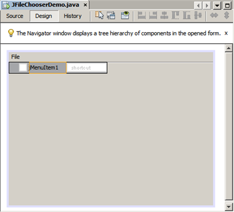
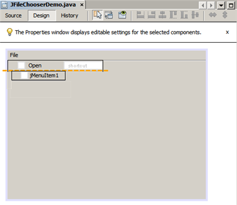
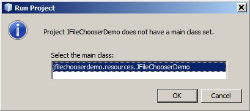

// 
//     Licensed to the Apache Software Foundation (ASF) under one
//     or more contributor license agreements.  See the NOTICE file
//     distributed with this work for additional information
//     regarding copyright ownership.  The ASF licenses this file
//     to you under the Apache License, Version 2.0 (the
//     "License"); you may not use this file except in compliance
//     with the License.  You may obtain a copy of the License at
// 
//       http://www.apache.org/licenses/LICENSE-2.0
// 
//     Unless required by applicable law or agreed to in writing,
//     software distributed under the License is distributed on an
//     "AS IS" BASIS, WITHOUT WARRANTIES OR CONDITIONS OF ANY
//     KIND, either express or implied.  See the License for the
//     specific language governing permissions and limitations
//     under the License.
//

= Javaアプリケーションへのファイル・チューザの追加
:jbake-type: tutorial
:jbake-tags: tutorials 
:jbake-status: published
:icons: font
:syntax: true
:source-highlighter: pygments
:toc: left
:toc-title:
:description: Javaアプリケーションへのファイル・チューザの追加 - Apache NetBeans
:keywords: Apache NetBeans, Tutorials, Javaアプリケーションへのファイル・チューザの追加

_執筆: Petr Dvoraklink:http://blogs.oracle.com/joshis/entry/a_quick_jfilechooser_demo[+(2009年12月)+]、管理: Alyona Stashkova_

このチュートリアルでは、 ``javax.swing.JFileChooser`` コンポーネントを使用してJavaアプリケーションにファイル・チューザを追加する方法を示します。すべてを手書きでコーディングすることもできますが、一部の作業を省略できるNetBeans GUIビルダーを使用する方法をお薦めします。課題の一環として、 ``.txt`` ファイルをテキスト領域にロードする、小さなJavaアプリケーションを作成します。

link:https://netbeans.org/projects/samples/downloads/download/Samples%252FJava%252FJFileChooserDemo.zip[+ファイル・チューザを使用した完成版プロジェクト+]をダウンロードできます。

image::images/netbeans-stamp-80-74-73.png[title="このページの内容は、NetBeans IDE 7.0以降に適用されます"]

*このチュートリアルを完了するには、次のソフトウェアとリソースが必要です。*

|===
|ソフトウェアまたはリソース |必須バージョン 

|link:http://netbeans.org/downloads/[+NetBeans IDE+] |バージョン7.0またはそれ以降 

|link:http://www.oracle.com/technetwork/java/javase/downloads/index.html[+Java Development Kit+] (JDK) |バージョン6、7または8 
|===

== アプリケーションの作成

まず、新しいJavaアプリケーションを作成します。

1. メイン・メニューから「ファイル」>「新規プロジェクト」を選択します。「Java」カテゴリおよび「Javaアプリケーション」のプロジェクト・タイプを選択します。「次」をクリックします。
2. 「プロジェクト名」に「`JFileChooserDemo`」と入力し、プロジェクトの場所を指定します。
3. 「メイン・クラスの作成」チェックボックスを選択解除します。

[.feature]
--

image::images/newproj-small.png[role="left", link="images/newproj.png"]

--

. 「終了」をクリックします。

== アプリケーション・フォームの作成

この項では、 ``JFrame`` コンテナを作成し、そこにいくつかのコンポーネントを追加します。

*JFrameフォームを作成するには:*

1. 「ソース・パッケージ」ノードを右クリックし、「新規」>「その他」を選択します。「Swing GUIフォーム」カテゴリおよび「JFrameフォーム」ファイル・タイプを選択します。「次」をクリックします。
2. 「クラス名」に「`JFileChooserDemo`」と入力します。
3. 「パッケージ」に「`jfilechooserdemo.resources`」と入力します。

[.feature]
--

image::images/newjframeform-small.png[role="left", link="images/newjframeform.png"]

--

. 「終了」をクリックします。

. 「プロパティ」ウィンドウで、「タイトル」プロパティに「`デモ・アプリケーション`」と入力し、[Enter]を押して確認します。

*JFrameフォームにコンポーネントを追加するには:*

1. パレットで「Swingメニュー」カテゴリを開き、「メニュー・バー」コンポーネントを選択して、それをJFrameの左上隅にドラッグします。

*注意:* パレットが表示されない場合は、メイン・メニューから「ウィンドウ」>「パレット」を選択します。

[.feature]
--

image::images/menubaradded-small.png[role="left", link="images/menubaradded.png"]

--

. 「メニュー・バー」コンポーネントの「編集」項目を右クリックし、コンテキスト・メニューの「削除」を選択します。

. 実行中のアプリケーションからFileChooserを開くことができるメニュー項目を追加するには、パレットの「Swingメニュー」カテゴリで新しい「メニュー項目」(JMenuItem1)を選択し、それを「メニュー・バー」にドラッグして「メニュー・バー」の「ファイル」項目にドロップします。

[.feature]
--

--

*注意:* 別の「メニュー項目」をドラッグする場合は、それが「メニュー・バー」に追加されるように、その前に「メニュー・バー」が選択されていることを確認してください。

. 「デザイン」ビューで「jMenuItem1」を右クリックし、コンテキスト・メニューから「変数名を変更」を選択します。項目の名前を「`Open`」に変更し、「OK」をクリックします。

. 「デザイン」ビューで「jMenuItem1」が引続き選択されていることを確認します。[Space]バーを押して、コンポーネントのテキストを編集します。テキストを「`開く`」に変更し、[Enter]を押して確認します。

. 「開く」メニュー項目のアクション・ハンドラを指定します。メニュー項目を右クリックし、コンテキスト・メニューから「イベント」>「アクション」>「actionPerformed」を選択します。GUIビルダーによって自動的に「ソース」ビューに切り替えられ、 ``OpenActionPerformed()`` という名前の新しいイベント・ハンドラ・メソッドが生成されます。「ナビゲータ」ウィンドウは次のようになります。

image::images/openactionperformednavigator.png[]

. 作成されているアプリケーションからFileChooserを終了するためのメニュー項目を追加するには、「デザイン」モードに戻ってパレットの「Swingメニュー」カテゴリで「メニュー項目」(JMenuItem1)を選択し、それを「開く」メニュー項目の下にある「メニュー・バー」にドラッグします。オレンジ色の強調表示は ``JMenuItem1`` が配置される場所を示しています。

[.feature]
--

--

. 「デザイン」ビューで「 ``jMenuItem1`` 」を右クリックし、コンテキスト・メニューから「変数名を変更」を選択します。項目の名前を「`Exit`」に変更し、「OK」をクリックします。

. 「デザイン」ビューで「 ``jMenuItem1`` 」が引続き選択されていることを確認します。[Space]バーを押して、コンポーネントのテキストを編集します。テキストを「 ``終了`` 」に変更し、[Enter]を押して確認します。

. 「終了」メニュー項目のアクション・ハンドラを指定します。メニュー項目を右クリックし、コンテキスト・メニューから「イベント」>「アクション」>「actionPerformed」を選択します。GUIビルダーによって自動的に「ソース」ビューに切り替えられ、`ExitActionPerformed()`という名前の新しいイベント・ハンドラ・メソッドが生成されます。「ナビゲータ」ウィンドウの「`OpenActionPerformed()`」ノードの下に「`ExitActionPerformed`」ノードが表示されます。

. 「終了」メニュー項目を機能させるには、`ExitActionPerformed()`メソッドの本文に次のソースを追加します。

[source,java]
----

			 System.exit(0); 
----

. 「デザイン」モードに戻ります。次の図に示すように、パレットの「Swingコントロール」カテゴリから「テキスト領域」( ``JTextArea`` )をフォームにドラッグします。

[.feature]
--

image::images/textareadded-small.png[role="left", link="images/textareadded.png"]

--

. 追加されたコンポーネントのサイズを変更して、後でファイル・チューザによって表示されるテキストの領域を確保します。変数の名前を「`textarea`」に変更します。フォームは次のスクリーンショットのようにします。

[.feature]
--

image::images/jfilechooserdemoview_final-small.png[role="left", link="images/jfilechooserdemoview_final.png"]

--

これで、このチュートリアルのベースとなる単純なJavaアプリケーションが設定されました。次に、実際のファイル・チューザを追加します。

== ファイル・チューザの追加

1. まだ開いていない場合は、「ウィンドウ」>「ナビゲート」>「ナビゲータ」を選択して「ナビゲータ」ウィンドウを開きます。
2. ナビゲータで、 ``Other Components`` ノードを右クリックします。コンテキスト・メニューから、「パレットから追加」>「Swingウィンドウ」>「ファイル・チューザ」を選択します。

「 ``パレットから追加`` 」コンテキスト・メニューのかわりに、パレットの「Swingウィンドウ」カテゴリから、 ``JFileChooser`` コンポーネントをGUIビルダーの白い領域にドラッグ・アンド・ドロップすることもできます。それでも同じ結果になりますが操作が難しくなり、 ``JFileChooser`` のプレビューが非常に大きいため、ウィンドウを誤ってパネルに挿入して望まない結果になる可能性があります。

. ナビゲータを見ると、 ``JFileChooser`` がフォームに追加されたことを確認できます。

. 「 ``JFileChooser`` 」ノードを右クリックし、変数の名前を「`fileChooser`」に変更します。

image::images/navigator_jframe.png[]

これで、ファイル・チューザが追加されました。次に、目的のタイトルが表示されるようにファイル・チューザを調整し、カスタム・ファイル・フィルタを追加し、さらにファイル・チューザをアプリケーションに統合します。

== ファイル・チューザの構成

=== 「開く」アクションの実装

1. 「ナビゲータ」ウィンドウでクリックして「 ``JFileChooser`` 」を選択してから、そのプロパティを「プロパティ」ダイアログ・ボックスで編集します。「 ``dialogTitle`` 」プロパティを「`This is my open dialog`」に変更し、[Enter]を押して「プロパティ」ダイアログ・ボックスを閉じます。
2. GUIビルダーで「ソース」ボタンをクリックして「ソース」モードに切り替えます。ファイル・チューザをアプリケーションに統合するには、次のコード・スニペットを既存の`OpenActionPerformed()`メソッドに貼り付けます。

[source,java]
----

private void OpenActionPerformed(java.awt.event.ActionEvent evt) {
    int returnVal = fileChooser.showOpenDialog(this);
    if (returnVal == JFileChooser.APPROVE_OPTION) {
        File file = fileChooser.getSelectedFile();
        try {
          // What to do with the file, e.g. display it in a TextArea
          textarea.read( new FileReader( file.getAbsolutePath() ), null );
        } catch (IOException ex) {
          System.out.println("problem accessing file"+file.getAbsolutePath());
        }
    } else {
        System.out.println("File access cancelled by user.");
    }
} 
----

*注意:* このコード・スニペットの最初と最後の行は、ソース・ファイル内の既存の行と重複するため、除去してください。

. エディタによってコード内のエラーが報告された場合は、コード内の任意の場所を右クリックして「インポートを修正」を選択するか、または[Ctrl]+[Shift]+[I]を押します。「すべてのインポートを修正」ダイアログ・ボックスで、デフォルトを受け入れてインポート文を更新し、「OK」をクリックします。

このように、FileChooserの ``getSelectedFile()`` メソッドをコールしてユーザーがクリックしたファイルを判定し、それを処理できます。この例では、ファイルの内容を読み取ってテキスト領域に表示します。

=== ファイル・フィルタの実装

次に、ファイル・チューザに ``*.txt`` ファイルのみが表示されるようにする、カスタム・ファイル・フィルタを追加します。

1. 「デザイン」モードに切り替えて、「ナビゲータ」ウィンドウで「 ``fileChooser`` 」を選択します。
2. 「プロパティ」ウィンドウで、「 ``fileFilter`` 」プロパティの横にある省略符号(...)ボタンをクリックします。
3. 「fileFilter」ダイアログ・ボックスで、コンボ・ボックスから「カスタム・コード」を選択します。

[.feature]
--

image::images/combobox-small.png[role="left", link="images/combobox.png"]

--

. テキスト・フィールドに「 ``new MyCustomFilter()`` 」と入力します。「OK」をクリックします。

. このカスタム・コードを機能させるには、 ``FileFilter`` クラスを拡張する内部(または外部)クラス ``MyCustomFilter`` を記述します。次のコード・スニペットをクラスのソースのインポート文の下にコピーして貼り付け、このフィルタを実装する内部クラスを作成します。

[source,java]
----

    class MyCustomFilter extends javax.swing.filechooser.FileFilter {
        @Override
        public boolean accept(File file) {
            // Allow only directories, or files with ".txt" extension
            return file.isDirectory() || file.getAbsolutePath().endsWith(".txt");
        }
        @Override
        public String getDescription() {
            // This description will be displayed in the dialog,
            // hard-coded = ugly, should be done via I18N
            return "Text documents (*.txt)";
        }
    } 
----

*注意:* より高性能で切替え可能なファイル・フィルタを実装する方法を学習するには、link:http://java.sun.com/javase/7/docs/api/javax/swing/JFileChooser.html#addChoosableFileFilter%28javax.swing.filechooser.FileFilter%29[+addChoosableFileFilter+]メソッドを参照してください。

== アプリケーションの実行

1. 「JFileChooserDemo」プロジェクトを右クリックし、「実行」を選択してサンプル・プロジェクトを開始します。
2. 「プロジェクトの実行」ダイアログ・ボックスで「`jfilechooserdemo.resources.JFileChooserDemo`」メイン・クラスを選択し、「OK」をクリックします。

. 実行中のデモ・アプリケーションで、「ファイル」メニューの「開く」を選択してアクションをトリガーします。結果は次のようになります。

[.feature]
--

image::images/result_jfilechooserdemo-small.png[role="left", link="images/result_jfilechooserdemo.png"]

--

. アプリケーションを終了するには、「ファイル」メニューの「終了」を選択します。

他にも、GUIパレットのColorChooserやOptionPaneなどの便利なSwingウィンドウやダイアログを試してみてください。

link:/about/contact_form.html?to=3&subject=Feedback:%20Adding%20a%20FileChooser[+このチュートリアルに関するご意見をお寄せください+]

== 次の手順

* _NetBeans IDEによるアプリケーションの開発_のlink:http://www.oracle.com/pls/topic/lookup?ctx=nb8000&id=NBDAG920[+Java GUIの実装+]
* link:gui-binding.html[+NetBeans IDEを使用したJavaアプリケーションでのBeansとデータのバインディング+]
* link:gui-automatic-i18n.html[+NetBeans IDEを使用したGUIフォームの国際化+]
* link:http://docs.oracle.com/javase/tutorial/uiswing/components/filechooser.html[+Javaチュートリアル: ファイル・チューザの使用方法+]
