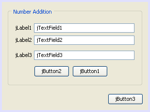

// 
//     Licensed to the Apache Software Foundation (ASF) under one
//     or more contributor license agreements.  See the NOTICE file
//     distributed with this work for additional information
//     regarding copyright ownership.  The ASF licenses this file
//     to you under the Apache License, Version 2.0 (the
//     "License"); you may not use this file except in compliance
//     with the License.  You may obtain a copy of the License at
// 
//       http://www.apache.org/licenses/LICENSE-2.0
// 
//     Unless required by applicable law or agreed to in writing,
//     software distributed under the License is distributed on an
//     "AS IS" BASIS, WITHOUT WARRANTIES OR CONDITIONS OF ANY
//     KIND, either express or implied.  See the License for the
//     specific language governing permissions and limitations
//     under the License.
//

= 构建 GUI 应用程序简介
:jbake-type: tutorial
:jbake-tags: tutorials 
:jbake-status: published
:icons: font
:syntax: true
:source-highlighter: pygments
:toc: left
:toc-title:
:description: 构建 GUI 应用程序简介 - Apache NetBeans
:keywords: Apache NetBeans, Tutorials, 构建 GUI 应用程序简介

撰稿人：Saleem Gul 和 Tomas Pavek

本入门教程讲述如何创建简单图形用户界面以及如何添加简单后端功能。尤其介绍了如何为 Swing 窗体中的按钮和字段行为编写代码。

我们将完成 GUI 布局和设计工作并添加几个按钮和文本字段。这些文本字段用于接收用户输入和显示程序输出。这些按钮用于启动前端的内置功能。我们创建的应用程序是一个非常简单但功能完善的计算器。

有关更全面的 GUI 构建器设计功能指南（包括各种设计功能的视频演示），请参见link:quickstart-gui.html[+在 NetBeans IDE 中设计 Swing GUI+]。

*预计时间：20 分钟*

image::images/netbeans-stamp-80-74-73.png[title="此页上的内容适用于 NetBeans IDE 6.9 及更高版本"]

*要学完本教程，您需要具备以下软件和资源。*

|===
|软件或资源 |要求的版本 

|link:http://netbeans.org/downloads/[+带有 Java SE 的 NetBeans IDE+] |版本 6.9 或更高版本 

|link:http://www.oracle.com/technetwork/java/javase/downloads/index.html[+Java 开发工具包 (JDK)+] |版本 6、7 或 8 
|===

== 练习 1：创建项目

第一步是为要开发的应用程序创建 IDE 项目。我们将项目命名为  ``NumberAddition`` 。

1. 选择 ``文件``  >  ``新建项目`` 。或者，也可以单击 IDE 工具栏中的“新建项目”图标。
2. 在“类别”窗格中，选择 "Java" 节点。在“项目”窗格中，选择“Java 应用程序”。单击“下一步”。
3. 在“项目名称”字段中键入 `NumberAddition`，然后指定路径（例如，在主目录中）作为项目位置。
4. （可选）选中“使用专用文件夹存储库”复选框，并指定库文件夹的位置。有关详细信息，请参见_使用 NetBeans IDE 开发应用程序_中的link:http://www.oracle.com/pls/topic/lookup?ctx=nb8000&id=NBDAG455[+与其他用户共享库+]。
5. 如果已选中“创建主类”复选框，请取消选中该复选框。
6. 单击“完成”。

== 练习 2：构建前端

要继续构建界面，我们需要创建一个 Java 容器，以便放置所需的其他 GUI 组件。在此步骤中，我们将使用 `JFrame` 组件创建一个容器。我们将该容器放在新包中，该包将显示在“源包”节点中。

=== 创建 JFrame 容器

1. 在“项目”窗口中，右键单击  ``NumberAddition``  节点，然后选择 ``新建``  >  ``其他`` 。
2. 在“新建文件”对话框中，选择  ``Swing GUI 窗体`` 类别和  ``JFrame 窗体`` 文件类型。单击“下一步”。
3. 输入  ``NumberAdditionUI``  作为类名。
4. 在“包”中输入 `my.numberaddition`。
5. 单击“完成”。

IDE 将在 `NumberAddition` 应用程序中创建 `NumberAdditionUI` 窗体和 `NumberAdditionUI` 类，然后在 GUI 构建器中打开 `NumberAdditionUI` 窗体。`my.NumberAddition` 包将替代默认包。

=== 添加组件：生成前端

接下来，我们将通过组件面板使用 JPanel 填充应用程序前端。然后，添加三个 JLabel、三个 JTextField 和三个 JButton。如果以前没有用过 GUI 构建器，您可能会发现link:quickstart-gui.html[+在 NetBeans IDE 中设计 Swing GUI+] 教程中有关组件放置的信息非常有用。

在拖动并放置完上述组件后，JFrame 应类似于以下屏幕快照。

如果 IDE 右上角未显示“组件面板”窗口，则选择“窗口”>“组件面板”。

1. 先从“组件面板”的“Swing 容器”类别中选择一个面板，然后将其拖放到 JFrame 上。
2. 在突出显示该 JPanel 时，转至“属性”窗口，然后单击 "Border" 旁边的省略号 (...) 按钮以选择边框样式。
3. 在 "Border" 对话框中，从列表中选择“带标题的边框”，然后在“标题”字段中键入 `Number Addition`。单击“确定”。保存更改并退出该对话框。
4. 现在，将会看到一个标题为 Number Addition 的空 JFrame，它与屏幕快照类似。按照上面的屏幕快照所示，添加三个 JLabel、三个 JTextField 和三个 JButton。

=== 重命名组件

在该步骤中，我们将重命名刚添加到 JFrame 中的这些组件的显示文本。

1. 双击 `jLabel1` 并将文本属性更改为 `First Number`。
2. 双击 `jLabel2` 并将文本更改为 `Second Number`。
3. 双击 `jLabel3` 并将文本更改为 `Result`。
4. 删除 `jTextField1` 中的样例文本。要使显示文本可编辑，可以右键单击文本字段，然后从弹出式菜单中选择“编辑文本”。可能需要将 `jTextField1` 调整为原始大小。对于 `jTextField2` 和 `jTextField3`，重复此步骤。
5. 将 `jButton1` 显示文本重命名为 `Clear`。（可以通过右键单击按钮并选择“编辑文本”来编辑按钮的文本。或者，也可以单击按钮，稍等片刻，然后再次单击按钮。）
6. 将 `jButton2` 显示文本重命名为 `Add`。
7. 将 `jButton3` 显示文本重命名为 `Exit`。

现在，完成的 GUI 应类似于以下屏幕快照：

image::images/Figure2.png[]

== 练习 3：添加功能

在本练习中，我们将为 "Add"、"Clear" 和 "Exit" 按钮添加功能。`jTextField1` 和 `jTextField2` 框用于用户输入，`jTextField3` 用于程序输出；我们要创建的应用程序是一个非常简单的计算器。我们现在就开始吧。

=== 使 "Exit" 按钮正常工作

要为这些按钮添加功能，必须为每个按钮指定事件处理程序以响应事件。在本示例中，我们需要了解何时通过鼠标单击或键盘按下了按钮。因此，我们使用 ActionListener 来响应 ActionEvent。

1. 右键单击 "Exit" 按钮。从弹出式菜单中选择“事件”>“操作”> "actionPerformed"。请注意，该菜单中还包含很多其他可响应的事件！在选择  ``actionPerformed``  事件时，IDE 自动在 "Exit" 按钮中添加 ActionListener，并生成一种处理程序方法，以处理监听程序的 actionPerformed 方法。
2. IDE 将打开源代码窗口并滚动至某一位置，在此将实现按下按钮（通过鼠标单击或键盘）时希望其执行的操作。源代码窗口应包含以下行：

[source,java]
----

private void jButton3ActionPerformed(java.awt.event.ActionEvent evt) {
    //TODO add your handling code here:
                }
----

. 现在，我们将为希望 "Exit" 按钮执行的操作添加代码。将 TODO 行替换为 `System.exit(0);`。完成的 "Exit" 按钮代码应如下所示：

[source,java]
----

private void jButton3ActionPerformed(java.awt.event.ActionEvent evt) {
    System.exit(0);
                } 
----

=== 使 "Clear" 按钮正常工作

1. 单击工作区域顶部的“设计”标签以返回到窗体设计区域。
2. 右键单击 "Clear" 按钮 (`jButton1`)。从弹出式菜单中选择“事件”>“操作”> "actionPerformed"。
3. "Clear" 按钮用于删除 jTextField 中的所有文本。为此，将添加一些与以上代码类似的代码。完成的源代码应如下所示：

[source,java]
----

private void jButton1ActionPerformed(java.awt.event.ActionEvent evt){
    jTextField1.setText("");
    jTextField2.setText("");
    jTextField3.setText("");
                }
----

上面的代码将所有三个 JTextField 中的文本更改为空，实际就是使用空白覆盖现有文本。

=== 使 "Add" 按钮正常工作

"Add" 按钮用于执行三个操作。

1. 它接受 `jTextField1` 和 `jTextField2` 中的用户输入，并将输入类型由字符串转换为浮点。
2. 然后，它将两个数相加。
3. 最后，将相加之和的类型转换为字符串，并将其放在 `jTextField3` 中。
我们现在就开始吧！

[start=1]
1. 单击工作区域顶部的“设计”标签以返回到窗体设计区域。
2. 右键单击 "Add" 按钮 (`jButton2`)。从弹出式菜单中选择“事件”>“操作”> "actionPerformed"。
3. 我们将添加一些代码以使 "Add" 按钮正常工作。完成的源代码应如下所示：

[source,java]
----

private void jButton2ActionPerformed(java.awt.event.ActionEvent evt){
    // First we define float variables.
    float num1, num2, result;
    // We have to parse the text to a type float.
    num1 = Float.parseFloat(jTextField1.getText());
    num2 = Float.parseFloat(jTextField2.getText());
   // Now we can perform the addition.
    result = num1+num2;
    // We will now pass the value of result to jTextField3.
    // At the same time, we are going to
    // change the value of result from a float to a string.
    jTextField3.setText(String.valueOf(result));
                    }
----

程序已创建完毕，我们现在可以构建并运行该程序以查看其运行情况。

== 练习 4：运行程序

*在 IDE 中运行程序：*

1. 选择“运行”>“运行主项目”（或按 F6 键）。

*注：*如果显示的窗口通知您项目 NumberAddition 没有设置主类，则应在同一窗口中选择  ``my.NumberAddition.NumberAdditionUI``  作为主类，然后单击“确定”按钮。

*在 IDE 外部运行程序：*

1. 选择“运行”>“清理并构建主项目”（Shift-F11 组合键）以构建应用程序 JAR 文件。
2. 通过使用系统的文件资源管理器或文件管理器，导航至 `NumberAddition/dist` 目录。

*注：* ``NumberAddition``  项目目录的位置取决于在<<Exercise_1,练习 1：创建项目>>部分中的第 3 步创建项目时指定的路径。

. 双击 `NumberAddition.jar` 文件。

几秒钟后，将会启动应用程序。

*注：*如果在双击 JAR 文件时没有启动应用程序，请参见link:../../articles/javase-deploy.html#troubleshooting[+本文+]以了解在操作系统中设置 JAR 文件关联的相关信息。

也可以通过命令行启动应用程序。

*通过命令行启动应用程序：*

1. 在系统上，打开命令提示符或终端窗口。
2. 在命令提示符中，转至 `NumberAddition/dist` 目录。
3. 在命令行中，键入以下语句：

[source,java]
----

java -jar  NumberAddition.jar
----

*注：*请确保  ``my.NumberAddition.NumberAdditionUI``  设置为主类，然后再运行应用程序。检查方式如下：在“项目”窗格中右键单击 NumberAddition 项目节点，在弹出菜单中选择“属性”，然后在“项目属性”对话框中选择“运行”类别。“主类”字段将显示  ``my.numberaddition.NumberAdditionUI`` 。

== 事件处理的工作方式

本教程已介绍了如何响应简单的按钮事件。还可以让应用程序响应很多其他事件。IDE 可以帮助您查找 GUI 组件可处理的可用事件列表：

1. 返回至编辑器中的 `NumberAdditionUI.java` 文件。单击“设计”标签以在 GUI 构建器中查看 GUI 布局。
2. 右键单击任何 GUI 组件，然后从弹出式菜单中选择“事件”。目前，仅浏览菜单以查看其中的内容，而无需选择任何内容。
3. 或者，也可以从“窗口”菜单中选择“属性”。在“属性”窗口中，单击“事件”标签。在“事件”标签中，可以查看和编辑与当前活动 GUI 组件关联的事件处理程序。
4. 可以让应用程序响应按键、鼠标单击、双击和三击、鼠标移动、窗口大小以及焦点变化。可以从“事件”菜单中为所有这些内容生成事件处理程序。最常用的事件是 Action 事件。（要了解link:http://java.sun.com/docs/books/tutorial/uiswing/events/generalrules.html#twokinds[+事件处理的最佳做法+]，请参见 Sun 的 link:http://java.sun.com/docs/books/tutorial/uiswing/events/index.html[+Java 事件教程+]。）

事件处理是如何工作的呢？每次从“事件”菜单中选择事件时，IDE 都会自动创建一个所谓的事件监听程序，并将其与组件关联。请完成以下步骤以查看事件处理的工作方式。

1. 返回至编辑器中的 `NumberAdditionUI.java` 文件。单击“源”标签以查看 GUI 源代码。
2. 向下滚动并注意刚实现的方法 `jButton1ActionPerformed()`、`jButton2ActionPerformed()` 和 `jButton3ActionPerformed()`。这些方法称为事件处理程序。
3. 现在，滚动至名为 `initComponents()` 的方法。如果未看到该方法，请查找显示 `Generated Code` 的行；单击该行旁边的 + 号以展开折叠的 `initComponents()` 方法。
4. 首先，请注意 `initComponents()` 方法周围的蓝色块。此代码是由 IDE 自动生成的，无法对其进行编辑。
5. 现在，浏览 `initComponents()` 方法。此外，该方法还包含用于初始化 GUI 组件并将其放置在窗体上的代码。在“设计”视图中放置和编辑组件时，将会自动生成和更新该代码。
6. 在 `initComponents()` 中，向下滚动至显示以下内容的位置：

[source,java]
----

jButton3.setText("Exit");
jButton3.addActionListener(new java.awt.event.ActionListener() {
    public void actionPerformed(java.awt.event.ActionEvent evt) {
           jButton3ActionPerformed(evt);
    }
            });
----

这是在 GUI 组件中添加事件监听程序对象的位置；在本示例中，将在 `jButton3` 中注册 ActionListener。ActionListener 接口具有一个 actionPerformed 方法，该方法采用 ActionEvent 对象（只需调用 `jButton3ActionPerformed` 事件处理程序即可实现）作为其参数。现在，该按钮将监听 action 事件。每次按下该按钮时，都会生成 ActionEvent 并将其传递给监听程序的 actionPerformed 方法，而该方法又会执行在该事件的事件处理程序中提供的代码。

一般来说，要能够进行响应，每个交互式 GUI 组件需要在事件监听程序中进行注册，并且需要实现事件处理程序。正如您所看到的一样，NetBeans IDE 可处理关联事件监听程序的工作，因此，您可以集中精力实现应由事件触发的实际业务逻辑。

link:/about/contact_form.html?to=3&subject=Feedback:%20Introduction%20to%20GUI%20Building[+发送有关此教程的反馈意见+]

== 另请参见

* _使用 NetBeans IDE 开发应用程序_中的link:http://www.oracle.com/pls/topic/lookup?ctx=nb8000&id=NBDAG920[+实现 Java GUI+]
* link:quickstart-gui.html[+在 NetBeans IDE 中设计 Swing GUI+]
* link:gui-image-display.html[+在 GUI 应用程序中处理图像+]
* link:hibernate-java-se.html[+在 Java Swing 应用程序中使用 Hibernate+]
* link:../../trails/matisse.html[+Java GUI 应用程序学习资源+]
* link:../../trails/java-se.html[+常规 Java 开发学习资源+]
* link:http://wiki.netbeans.org/wiki/view/NetBeansUserFAQ#section-NetBeansUserFAQ-GUIEditorMatisse[+GUI 构建器 - 常见问题解答+]
* link:http://download.oracle.com/javase/tutorial/index.html[+Java(tm) 教程+]中的link:http://download.oracle.com/javase/tutorial/uiswing/events/index.html[+课程：编写事件监听程序+]。
