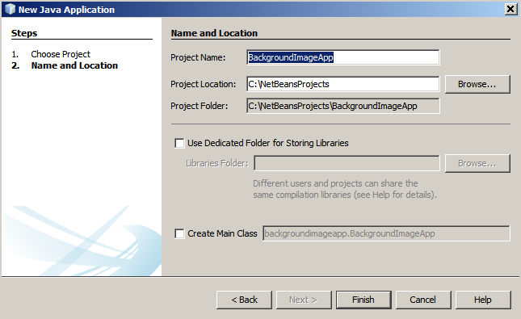
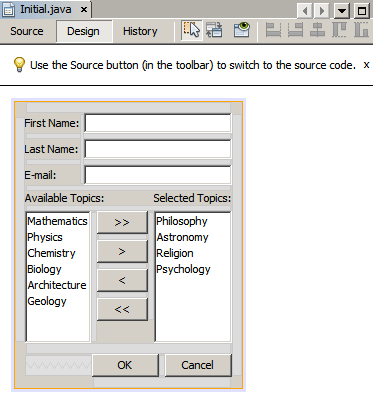
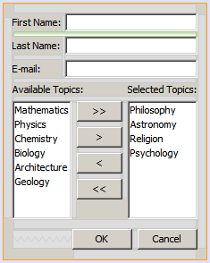
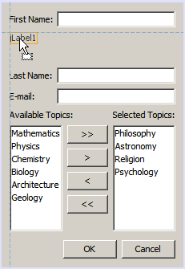
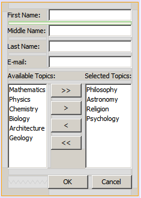
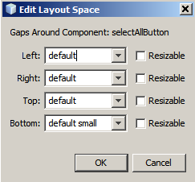
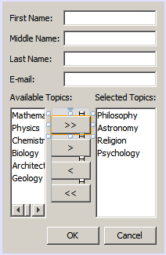

// 
//     Licensed to the Apache Software Foundation (ASF) under one
//     or more contributor license agreements.  See the NOTICE file
//     distributed with this work for additional information
//     regarding copyright ownership.  The ASF licenses this file
//     to you under the Apache License, Version 2.0 (the
//     "License"); you may not use this file except in compliance
//     with the License.  You may obtain a copy of the License at
// 
//       http://www.apache.org/licenses/LICENSE-2.0
// 
//     Unless required by applicable law or agreed to in writing,
//     software distributed under the License is distributed on an
//     "AS IS" BASIS, WITHOUT WARRANTIES OR CONDITIONS OF ANY
//     KIND, either express or implied.  See the License for the
//     specific language governing permissions and limitations
//     under the License.
//

= Gap Editing Support in the NetBeans GUI Builder
:jbake-type: tutorial
:jbake-tags: tutorials 
:jbake-status: published
:syntax: true
:icons: font
:source-highlighter: pygments
:toc: left
:toc-title:
:description: Gap Editing Support in the NetBeans GUI Builder - Apache NetBeans
:keywords: Apache NetBeans, Tutorials, Gap Editing Support in the NetBeans GUI Builder

A layout of a container in the Free Design mode consists of components and gaps between these components. Both the components and gaps are visualized in the Design view of the GUI Builder. The NetBeans IDE enables you to edit gaps directly in the GUI Builder.

This tutorial demonstrates how to utilize gap editing to insert new UI components between other components as well as how to center components easily around a frame in the NetBeans GUI Builder without concern for the underlying layout manager. The tutorial is intended as a guide to show how you can perform changes in an existing form in the Free Design mode to implement a specific target layout that is required by the project.

*To follow this tutorial, you need the software and resources listed below.*

|===
|Software or Resource |Version Required 

|link:https://netbeans.org/projects/samples/downloads/download/Samples%252FJava%252FGapSupport.zip[+GapSupport.zip+] |An archive with the source files containing the initial and target tutorial layouts. 
|===

*Notes:*

* You can download the project that is used as the starting point for this tutorial as a  ``.zip``  archive.
* This tutorial focuses on designing the layout of the container only. Adding functionality to the GUI is out of its scope.
* You can turn on and off visualization of the gaps by using the  ``Visualize Additional Layout Information``  option after choosing  ``Tools``  >  ``Options``  >  ``Java``  >  ``GUI Builder``  in the main IDE's menu.

== Opening Example Project

1. Download and unzip the link:https://netbeans.org/projects/samples/downloads/download/Samples%252FJava%252FGapSupport.zip[+GapSupport.zip+] archive to any location on your computer.
2. In the NetBeans IDE main menu, choose  ``File``  >  ``Open Project`` , navigate to the folder that contains the unzipped files with the  ``GapSupport``  project that you extracted in the previous step.
3. Click Open Project.
The Projects window should look like the following:

. Double-click the  ``Initial.java``  file.
The sample form opens in the GUI Builder Design view.

NOTE: You can view the component hierarchy of the form in the Navigator window by choosing Window > Navigator from the main toolbar.

image::images/navigator.png[]

<<top,top>>

== Resizing a Gap by Dragging and Dropping Its Edge

Let us explore how to edit a gap by dragging and dropping its edge in the Design view of the IDE.

To add a  ``Middle Name``  row between the  ``First Name``  and  ``Last Name``  rows, you need to complete the following steps:

1. Click on the gap between the  ``First Name``  and  ``Last Name``  labels.
The gap is highlighted with green.

. Hover the mouse pointer over the bottom part of the highlighted gap.
The pointer is changed to a vertical resizable one.

image::images/gap-resizable.png[]

. Enlarge the selected gap to 50 by pressing the left mouse button, dragging the pointer downward, and releasing the left mouse button.
The new size of the gap is displayed in a tooltip.

image::images/resizing.png[]

. Add a new label into the created gap by dragging it from the Swing Controls section of the Palette and dropping it so that its left edge is aligned with the left edge of the  ``First Name``  label and its top edge has the suggested preferred gap from the  ``First Name``  row.

. Double-click the label and change the text of the label to  ``Middle Name:`` .

image::images/middle-name.png[]

. Add a new text field to the right of the  ``Middle Name:``  label by dragging it from the Swing Controls section of the Palette and dropping it so that it is baseline-aligned with the  ``Middle Name``  label and its left edge is aligned with the other text fields.

image::images/textfield.png[]

. Drag the right edge of the text field to align it with the right edge of the other text fields.

image::images/textfield-resized.png[]

. Right-click the text inside the text field and choose Edit Text from the popup menu. Remove the text.

The  ``Middle Name``  row is inserted between the form components.

image::images/middle-inserted-gap.png[]

<<top,top>>

== Resizing a Gap Using the Mouse Wheel

The IDE enables you to resize a gap by clicking and then scrolling a mouse wheel to tune the gap size.

To remove the remaining space between the  ``Middle Name``  and  ``Last Name``  rows, click the gap below and decrease the height of the gap by scrolling the mouse wheel downward and setting the new size to  ``default small`` .

NOTE: The NetBeans GUI Builder supports three preferred gaps for component placement -  ``default small`` ,  ``default medium`` , and  ``default large`` .

image::images/default-small.png[]

The gap between the form components is resized by using the mouse wheel and utilizing a preferred gap.

<<top,top>>

== Editing Gaps Around a Component

You can center a component by enclosing it into two identical gaps that have prior been marked as resizable.

NOTE: A container helps specify where the components should be centered. It is possible to center the buttons without enclosing them in a new panel but it is more difficult to accomplish in the GUI Builder and the resulting layout is a bit fragile. Therefore, we suggest to enclose the component being centered in a panel whenever it is possible.

*To enclose the buttons and resizable gaps into a separate container, do as follows:*

1. Select all the four buttons in the form.
2. Right-click the selection and choose  ``Enclose In``  >  ``Panel``  from the popup menu.

image::images/enclose-panel.png[]

The buttons are enclosed into a container.

image::images/buttons-enclosed.png[]

*To remove the newly created gaps on the left and right side of the buttons, complete the following steps:*

1. Right-click one of the buttons and choose Edit Layout Space from the popup menu.
The Edit Layout Space dialog box is displayed.

. Set the size of the Left and Right gaps to 0 and click OK.
The gaps to the left and right of the buttons are removed using the Edit Layout Space dialog box.

*To make the gaps above and below the container resizable, do as follows:*

1. Double-click the gap at the bottom of the last button.
The Edit Layout Space dialog box is displayed.

. In the Edit Layout Space dialog box, select the  ``Resizable``  option and click OK.

[.feature]
--

image::images/bottom-small.png[role="left", link="images/bottom.png"]

--

. Repeat steps 1 and 2 for the gap above the topmost button.
The gaps above and below the container with the buttons are made resizable.

*To center the buttons of the sample form*:

Drag the bottom edge of the container with the buttons to align with the bottom edges of the lists as shown below:

image::images/align.png[]

The container is stretched to match the height of the  ``Available Topics``  and  ``Selected Topics``  lists. The buttons are centered within the space determined by the enclosing container since the surrounding gaps have been marked as resizable.

image::images/buttons-centered.png[]

<<top,top>>

== Summary

In this tutorial you enhanced a simple form. When manipulating gaps you learned how to manage empty spaces in the Free Design mode and design an appealing UI without spending extra time on tweaking every detail of the layout implementation.

<<top,top>>

