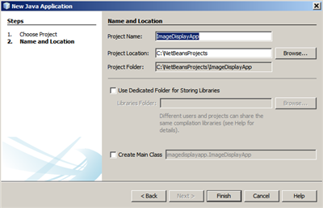
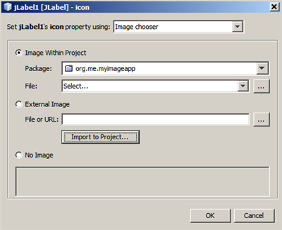
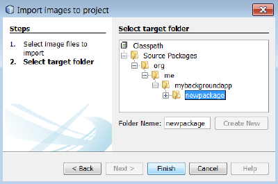
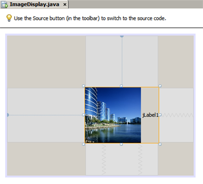
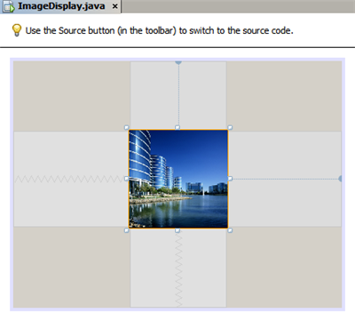
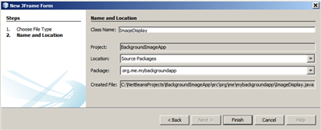
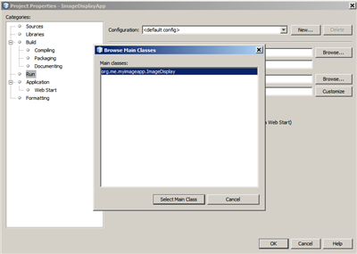
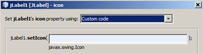

// 
//     Licensed to the Apache Software Foundation (ASF) under one
//     or more contributor license agreements.  See the NOTICE file
//     distributed with this work for additional information
//     regarding copyright ownership.  The ASF licenses this file
//     to you under the Apache License, Version 2.0 (the
//     "License"); you may not use this file except in compliance
//     with the License.  You may obtain a copy of the License at
// 
//       http://www.apache.org/licenses/LICENSE-2.0
// 
//     Unless required by applicable law or agreed to in writing,
//     software distributed under the License is distributed on an
//     "AS IS" BASIS, WITHOUT WARRANTIES OR CONDITIONS OF ANY
//     KIND, either express or implied.  See the License for the
//     specific language governing permissions and limitations
//     under the License.
//

= Обработка изображений в приложении с графическим интерфейсом
:jbake-type: tutorial
:jbake-tags: tutorials 
:jbake-status: published
:icons: font
:syntax: true
:source-highlighter: pygments
:toc: left
:toc-title:
:description: Обработка изображений в приложении с графическим интерфейсом - Apache NetBeans
:keywords: Apache NetBeans, Tutorials, Обработка изображений в приложении с графическим интерфейсом

image::images/netbeans-stamp-80-74.png[title="Содержимое этой страницы применимо к IDE NetBeans 7.4 и 8.0"]

*Для работы с этим учебным курсом требуются программное обеспечение и ресурсы, перечисленные ниже.*

|===
|Программное обеспечение или материал |Требуемая версия 

|link:http://netbeans.org/downloads/[+IDE NetBeans+] |Версия 7.4 или 8.0 

|link:http://www.oracle.com/technetwork/java/javase/downloads/index.html[+Комплект для разработчика на языке Java (JDK)+] |Версия 6, 7 или 8 
|===

== Введение

Для многих начинающих программистов на Java проблемой является обработка изображений в приложении. Обычный способ доступа к изображениям в приложении на Java состоит в применении метода `link:http://download.oracle.com/javase/6/docs/api/java/lang/ClassLoader.html#getResource(java.lang.String)[+getResource()+]`. В данном учебном курсе описывается использование конструктора графических интерфейсов среды IDE для создания кода с добавлением изображений (и других ресурсов) в приложение. Кроме того, пользователь научится настраивать способы создания средой IDE кода для обработки изображений.

Созданное в результате изучения этого учебного курса приложение будет представлять собой простую форму, содержащую одну надпись с одним изображением.

== Создание приложения

1. Выберите команду "Файл" > "Новый проект".
2. В мастере создания проекта выберите "Java" > "Приложение Java", затем нажмите кнопку "Дальше".
3. В качестве имени проекта введите `ImageDisplayApp`.
4. Снимите флажок "Создать главный класс".

[.feature]
--

--

. Нажмите кнопку 'Готово'.

== Создание формы приложения

В примере в этом разделе будет создана форма JFrame, и в нее добавлена метка JLabel.

*Создание формы JFrame:*

1. В окне 'Проекты' разверните узел  ``ImageDisplayApp`` .
2. Щелкните правой кнопкой узел "Исходные файлы" и выберите форму "Создать" > "JFrame".
3. В качестве имени класса введите `ImageDisplay`.
4. В качестве имени пакета введите `org.me.myimageapp`.
5. Нажмите кнопку 'Готово'.

*Добавление надписи:*

* В разделе "Палитра" выберите компонент "Метка" и перетащите его в форму.

Форма должна принять следующий вид:

[.feature]
--

image::images/form-small.png[role="left", link="images/form.png"]

--

== Добавление пакета для изображения

Если в приложении используются изображения или другие ресурсы, то для этих ресурсов обычно следует выбрать отдельный пакет Java. В локальной файловой системе пакет соответствует папке.

*Создание пакета для изображения:*

1. В окне 'Проекты' щелкните правой кнопкой мыши узел `org.me.myimageapp` и выберите 'Создать' > 'Пакет Java'.

[.feature]
--

image::images/package-small.png[role="left", link="images/package.png"]

--

. Нажмите кнопку 'Готово'.

В окне 'Проекты' в папке `Исходные пакеты` отображается новый пакет.

image::images/project-with-imagepack.png[]

== Вывод изображения в качестве метки

В этом приложении изображение будет встроено в компонент JLabel.

*Добавление изображения к метке:*

1. В редакторе GUI Designer выберите метку, добавленную ранее в форму.
2. В окне "Свойства" щелкните категорию "Свойства" и выполните прокрутку до свойства "Значок".
3. Нажмите кнопку со многоточием (...).
Отображается редактор свойств значка.

[.feature]
--

--

. В диалоговом окне свойств значка щелкните Import to Project ("Импорт в проект").

. В окне выбора файлов выберите любое сохраненное в компьютере изображение. Затем нажмите кнопку "Дальше".

. На странице 'Выбор целевой папки' выберите папку `newpackage` и нажмите 'Готово'.

[.feature]
--

--

. Нажмите ОК, чтобы закрыть диалоговое окно свойств значка.

При нажатии на кнопку OK IDE выполняет следующие действия:

* Копирование изображения в проект. В результате при выполнении сборки и распространения приложения это изображение добавляется в распространяемый архив JAR.
* Создание кода, реализующего доступ к изображению, в классе "ImageDisplay".
* Отображение изображения в качестве метки в режиме разработки формы.

[.feature]
--

--

Теперь можно выполнить несколько действий по оптимизации вида формы, например:

* В окне "Свойства" выберите свойство `text` и удалите метку `jLabel1`. Это значение было создано конструктором графического интерфейса в качестве отображаемого текста метки. В данном же случае в качестве метки отображается изображение, а не текст, поэтому вводить текст не требуется.
* Перетащите `jLabel1` в центральную область формы.

[.feature]
--

--

*Просмотр созданного кода:*

1. В средстве проектирования GUI нажмите кнопку 'Исходный код'. (Если кнопка 'Исходный код' скрыта, выберите Вид > Панель редактора исходного кода в главном меню.)
2. Прокрутите вниз до строки "Созданный код".
3. Щелкните значок (+) слева от строки "Созданный код" для просмотра кода, созданного GUI Designer.

Основная строка выглядит следующим образом:

[source,java]
----

jLabel1.setIcon(new javax.swing.ImageIcon(getClass().getResource("/org/me/myimageapp/newpackage/image.png"))); // NOI18N
----

Свойство `Icon` элемента `jLabel1` было изменено в редакторе свойств, поэтому средой IDE был создан метод `setIcon`. В параметре этого метода содержится вызов метода `link:http://download.oracle.com/javase/6/docs/api/java/lang/ClassLoader.html#getResource(java.lang.String)[+getResource()+]` анонимного внутреннего класса в `ImageIcon`. Обратите внимание на то, что созданный путь к изображению связан с его местоположением в структуре пакетов приложения.

*Примечания*

* Если в редакторе свойств значка установить параметр "Внешнее изображение", то средой IDE будет создан абсолютный путь к изображению, т.е. само изображение не будет скопировано в проект. Как следствие, при запуске приложения на этом же компьютере изображение появится, а при запуске на другом компьютере -- скорее всего, нет.
* Метод `getResource` также используется для доступа к другим ресурсам, таким как текстовые файлы с какими-либо данными, используемыми в приложении.

*Чтобы зарегистрировать обработчики для событий мыши на Jlabel:*

В режиме конструирования щелкните правой кнопкой мыши объект JLabel и выберите События > Мышь > mouseClicked/mousePressed/mouseReleased в контекстном меню.
Для выбранного события создается обработчик событий.

*Примечание.* Можно получить координаты мыши (например, местоположение щелчка мыши) в обработчике событий с помощью методов `event.getPoint()`, `event.getX()` и `event.getY()`. Подробности приведены в разделе link:http://docs.oracle.com/javase/1.4.2/docs/api/java/awt/event/MouseEvent.html[+Класс MouseEvent+].

== Показ изображения как фона в кадре

Конструктор графического интерфейса не поддерживает напрямую использование JFrame как фонового изображения, поскольку такой поддержки нет в Swing.
Тем не менее, этой цели можно достигнуть различными непрямыми путями. В этом приложении JLabel с изображением будет внедрен в компонент JFrame, тогда как JPanel будет размещен над JLabel и использован как родительский элемент для всех компонентов.

*Добавление прозрачного компонента JPanel к JFrame внутри изображения:*

1. Выберите команду "Файл" > "Новый проект".
2. В мастере создания проекта выберите "Java" > "Приложение Java", затем нажмите кнопку "Дальше".
3. В качестве имени проекта введите `BackgroundImageApp`.
4. Снимите флажок "Создать главный класс".

[.feature]
--

image::images/prj-small.png[role="left", link="images/prj.png"]

--

. Нажмите кнопку 'Готово'.

. В окне 'Проекты' разверните узел `BackgroundImageApp`.

. Щелкните правой кнопкой узел "Исходные файлы" и выберите форму "Создать" > "JFrame".

. В качестве имени класса введите `ImageDisplay`.

. В качестве имени пакета введите `org.me.mybackgroundapp`.

[.feature]
--

--

. Нажмите кнопку 'Готово'.

. В режиме конструирования щелкните правой кнопкой мыши объект JFrame и выберите 'Выбрать макет > Макет контейнера сетки' в контекстном меню.

. Щелкните правой кнопкой мыши объект JFrame и выберите Добавить из палитры > Контейнеры Swing > Панель в контекстном меню.

. В окне свойств отмените выбор свойства jPanel `opaque`.

. Щелкните правой кнопкой мыши объект JFrame и выберите Добавить из палитры > Элементы управления Swing > Метка в контекстном меню.

. В окне 'Проекты' щелкните правой кнопкой мыши узел `org.me.mybackgroundapp` и выберите 'Создать' > 'Пакет Java'.

. Нажмите кнопку "Готово". В результате будет добавлен новый пакет.

. В редакторе GUI Designer выберите метку, добавленную ранее в форму.

. В окне "Свойства" щелкните категорию "Свойства" и выполните прокрутку до свойства "Значок".

. Нажмите кнопку со многоточием (...).

. В диалоговом окне свойств значка щелкните Import to Project ("Импорт в проект").

. В окне выбора файлов выберите любое сохраненное в компьютере изображение. Затем нажмите кнопку "Дальше".

. На странице 'Выбор целевой папки' в мастере выберите каталог ресурсов `newpackage` и нажмите 'Готово'.

[.feature]
--

--

. Нажмите ОК, чтобы закрыть диалоговое окно свойств значка.

. В навигаторе щелкните правой кнопкой мыши jPanel и выберите 'Свойства' во всплывающем меню.

. В диалоговом окне Properties ("Свойства") установите свойства `Grid X`, `Grid Y`, `Weight X` и `Weight Y` на `1`, а свойство `Fill` на `Both`.

[.feature]
--

image::images/panelprops-small.png[role="left", link="images/panelprops.png"]

--

. Выберите "Close" (Закрыть).

. Повторите шаги 24 и 25 для jLabel.

. В диалоговом окне 'Свойства' выберите свойство `text` и удалите `jLabel1`.

[.feature]
--

image::images/labelprops-small.png[role="left", link="images/labelprops.png"]

--

Фон готов. Теперь можно, например, перетащить jLabel и jTextField в jPanel из Palette. Оба они будут отображены поверх фонового изображения.

image::images/background.png[]

*Примечание.* Преимуществом описанного решения является то, что фоновое изображение показывается как в ходе разработки, так и во время выполнения.

== Сборка и запуск приложения

На данном этапе после создания кода, реализующего доступ к изображению и вывод его на экран, можно выполнить сборку и запуск приложения и проверить правильность вызова изображения.

Сначала необходимо указать главный класс проекта. При назначении главного класса среда IDE получает информацию о том, какой класс следует запускать при запуске проекта. Кроме того, таким образом обеспечивается создание элемента `Main-Class` в архиве JAR приложения при его сборке.

*Для назначения главного класса проекта выполните следующие действия:*

1. Правой кнопкой щелкните узел "ImageDisplayApp" проекта и выберите "Свойства".
2. В диалоговом окне "Свойства проекта" выберите категорию "Выполнение".
3. Нажмите кнопку "Обзор" рядом с полем "Главный класс". Затем выберите класс `org.me.myimageapp.ImageDisplay`.

[.feature]
--

--

. Нажмите кнопку 'Выбрать основной класс'.

. Нажмите кнопку "ОК" для закрытия диалогового окна "Свойства проекта".

*Для сборки проекта:*

* Выберите Запуск > Очистить и собрать проект (_project_name_) на главной панели инструментов.

В окне "Файлы" отображаются объекты, созданные при сборке приложения. Скомпилированный класс находится в папке `build`. В папке `dist` находится исполняемый архив JAR, содержащий скомпилированный класс и изображение.

image::images/files.png[]

*Для запуска проекта выполните следующие действия:*

* Выберите Запуск > Запуск проекта (_project_name_) на главной панели инструментов.

== Создание пользовательского кода

Во многих приложениях выводимое изображение определяется не статически, как в данном примере. К примеру, выводимое изображение может определяться тем, что выбрал пользователь.

Если требуется предоставить возможность выбора изображения в исходном коде, то можно написать пользовательский код для вызова и отображения необходимых ресурсов. В среде IDE не предусмотрена возможность добавления кода в "защищенные блоки", содержащие созданный GUI Builder код, в режиме просмотра исходного кода. Однако существует возможность вставки кода в защищенные блоки с помощью редакторов свойств, которые можно вызвать в окне "Свойства". Если использовать в этих целях редакторы свойств, то пользовательский код не будет потерян при внесении изменений в GUI Builder.

*Например, для вставки пользовательского кода в свойство `icon` метки JLabel выполните следующие действия:*

1. Выберите JLabel в представлении 'Конструирование' или в окне 'Навигатор'.
2. В окне 'Свойства' нажмите кнопку (...) рядом со свойством `icon`.
3. В раскрывающемся списке в верхней области диалогового окна выберите параметр "Пользовательский код".

[.feature]
--
image:images/custom-code-small.png[role="left", link="images/custom-code.png"]
--

С помощью параметра "Пользовательский код" в этом редакторе свойств можно вручную указать метод `setIcon`. Кроме того, в этом параметре можно ввести требуемую логику или указать вызов отдельного метода, для которого вручную был создан код.

[.feature]
--

--

== Заключение

В этом руководстве описывается получение доступа к изображениям из приложения, созданного в IDE NetBeans. Более подробно работа с изображениями рассматривается в учебном курсе по Java.

*Примечание. *Пример в этом учебном курсе очень схож с первым примером в разделе учебного курса по Java link:http://java.sun.com/docs/books/tutorial/uiswing/components/icon.html[+Использование раздела значков+]. Отличие заключается в том, что в коде, создаваемом при работе по этому учебному курсу, для вставки изображения в надпись используется метод `link:http://download.oracle.com/javase/6/docs/api/javax/swing/JLabel.html#setIcon(javax.swing.Icon)[+setIcon+]` элемента `link:http://download.oracle.com/javase/6/docs/api/javax/swing/JLabel.html[+JLabel+]`. В примере, приведенном в учебном курсе по Java, в значок добавляется в метку путем его передачи через конструктор.

link:/about/contact_form.html?to=3&subject=Feedback:%20Handling%20Images%20in%20a%20GUI%20Application[+Отправить отзыв по этому учебному курсу+]

== Дополнительные сведения

* link:gui-functionality.html[+Введение в разработку графического интерфейса +]
* link:quickstart-gui.html[+Разработка Swing GUI в IDE NetBeans+]
* link:../../trails/matisse.html[+Учебная карта по приложениям с графическим интерфейсом Java +]
* link:../../trails/java-se.html[+Учебная карта по общим сведениям о разработке на Java+]
* link:http://wiki.netbeans.org/NetBeansUserFAQ#GUI_Editor_.28Matisse.29[+GUI Builder – часто задаваемые вопросы+]
* link:http://www.oracle.com/pls/topic/lookup?ctx=nb8000&id=NBDAG920[+Реализация Java GUI+] в документе _Разработка приложений в IDE NetBeans_
