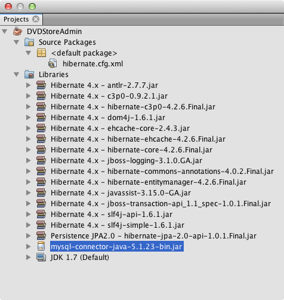
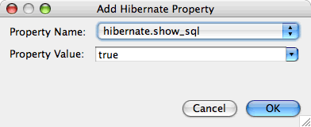
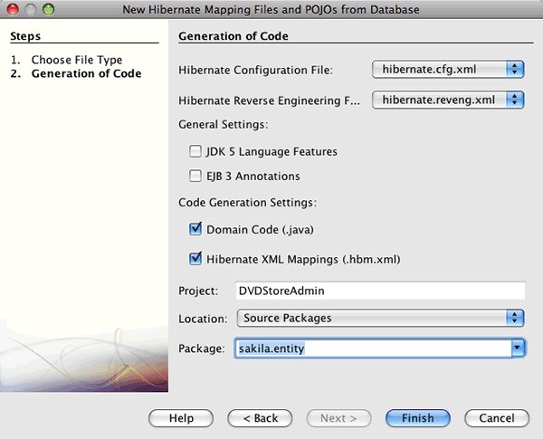
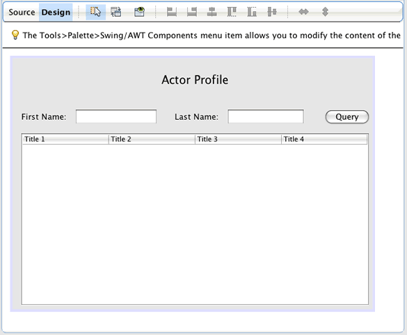
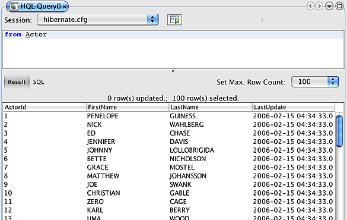
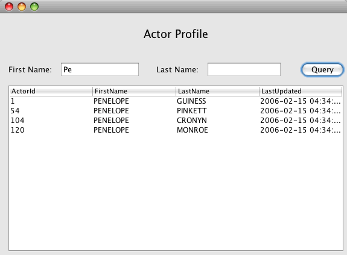

// 
//     Licensed to the Apache Software Foundation (ASF) under one
//     or more contributor license agreements.  See the NOTICE file
//     distributed with this work for additional information
//     regarding copyright ownership.  The ASF licenses this file
//     to you under the Apache License, Version 2.0 (the
//     "License"); you may not use this file except in compliance
//     with the License.  You may obtain a copy of the License at
// 
//       http://www.apache.org/licenses/LICENSE-2.0
// 
//     Unless required by applicable law or agreed to in writing,
//     software distributed under the License is distributed on an
//     "AS IS" BASIS, WITHOUT WARRANTIES OR CONDITIONS OF ANY
//     KIND, either express or implied.  See the License for the
//     specific language governing permissions and limitations
//     under the License.
//

= Использование библиотеки Hibernate в приложении Java на базе Swing
:jbake-type: tutorial
:jbake-tags: tutorials 
:jbake-status: published
:icons: font
:syntax: true
:source-highlighter: pygments
:toc: left
:toc-title:
:description: Использование библиотеки Hibernate в приложении Java на базе Swing - Apache NetBeans
:keywords: Apache NetBeans, Tutorials, Использование библиотеки Hibernate в приложении Java на базе Swing

В этом учебном руководстве IDE NetBeans используется для создания и развертывания приложения Swing Java, в котором отображаются данные из базы данных. Приложение использует библиотеку Hibernate в качестве слоя сохранения состояния для извлечения POJO (простых объектов Java) из реляционной базы данных.

Библиотека Hibernate предоставляет средства для объектно-реляционного сопоставления (ORM). В руководстве демонстрируется поддержка библиотеки Hibernate в среде IDE и использование мастеров для создания необходимых файлов Hibernate. После создания объектов Java и настройки приложения для использования Hibernate создается графический пользовательский интерфейс для поиска и отображения данных.

Приложение, создаваемое в этом курсе, представляет собой средство администрирования, дополняющее link:../web/hibernate-webapp.html[+веб-приложение "DVD Store"+]. В данном руководстве описывается создание приложения, позволяющего запрашивать подробные данные актера на основе соответствия имени или фамилии. При необходимости приложение можно расширить путем добавления функциональных возможностей запроса подробных данных о фильме, а также добавления/обновления/удаления объектов. В рамках руководства используется СУБД MySQL и база данных "Sakila", однако в приложениях Hibernate допускается использование любого поддерживаемого сервера базы данных. База данных "Sakila" представляет собой типовую базу данных, которая может быть загружена с сайта MySQL. Информация о настройке базы данных "Sakila" приведена в следующих разделах.

Перед изучением этого учебного курса можно ознакомиться со следующей документацией:

* Документация по библиотеке Hibernate по адресу link:http://www.hibernate.org/[+hibernate.org+]
* link:gui-functionality.html[+Введение в разработку графического интерфейса +]
* Учебный курс link:../ide/mysql.html[+Подключение к базе данных MySQL+].

Сведения о создании этого приложения с помощью Maven см. в разделе link:maven-hib-java-se.html[+Создание приложения Maven Swing с помощью Hibernate+].

image::images/netbeans-stamp-80-74-73.png[title="Содержимое этой страницы применимо к IDE NetBeans 7.2, 7.3, 7.4 и 8.0"]

*Для работы с этим учебным курсом требуется следующее программное обеспечение и ресурсы.*

|===
|Программное обеспечение или материал |Требуемая версия 

|link:https://netbeans.org/downloads/index.html[+IDE NetBeans+] |7.2, 7.3, 7.4, 8.0, Java 

|link:http://java.sun.com/javase/downloads/index.jsp[+Комплект для разработчика на языке Java (JDK)+] |версия 7 или 8 

|link:http://www.mysql.com/[+Сервер базы данных MySQL+] |версия 5.x 

|База данных "Sakila" |подключаемый модуль, который можно получить в центре обновления 
|===

Можно загрузить link:https://netbeans.org/projects/samples/downloads/download/Samples/Java/DVDStoreAdmin-Ant.zip[+готовый проект в виде архива ZIP+].

== Создание базы данных

В этом учебном курсе используется база данных MySQL с названием  ``sakila`` . Пример базы данных не входит в устанавливаемую в среду IDE, поэтому перед изучением этого учебного курса необходимо создать базу данных.

База данных "Sakila" представляет собой свободно распространяемый пример базы данных, который можно загрузить с сайта MySQL. Для создания базы данных "Sakila" можно загрузить и установить подключаемый модуль "Sakila Sample Database" с использованием диспетчера подключаемых модулей. После установки подключаемого модуля можно создать базу данных "Sakila" в окне "Services". База данных "Sakila" будет добавлена к списку баз данных в диалоговом окне "Create MySQL database".

Для получения дополнительной информации о настройке среды IDE для работы с MySQL см. учебный курс link:../ide/mysql.html[+Подключение к базе данных MySQL+].

1. Откройте диспетчер подключаемых модулей и установите подключаемый модуль "Sakila Sample Database".
2. После установки подключаемого модуля, запустите сервера MySQL базы данных путем расширения узла 'Базы данных' в окне 'Службы', щелкните правой кнопкой мыши узел MySQL Server и выберите 'Запустить'.
3. Щелкните правой кнопкой мыши узел сервера MySQL и выберите Create Database ("Создать базу данных").
4. Выберите базу данных "Sakila"из раскрывающегося списка "New Database Name" в диалоговом окне "Create MySQL Database". Нажмите кнопку "ОК".

image::images/create-sakila-mysql.png[title="Снимок диалогового окна создания базы данных MySQL"]

При нажатии кнопки "OK" узел "Sakila" появится под узлом "MySQL Server".

. Щелкните правой кнопкой мыши узел "Sakila" и выберите "Connect".

После нажатия кнопки "Connect a database" под узлом "Databases" отобразится узел подключения к базе данных "Sakila" ( ``jdbc:mysql://localhost:3306/sakila [_username_ on Default]`` ). При открытом подключении для просмотра данных в базе данных разверните этот узел подключения.

== Создание проекта приложения Java на базе Swing

В этом упражнении будет создан простой проект приложения Java на базе Swing с именем "DVDStoreAdmin".

1. Выберите команду "Файл" > "Создать проект" (CTRL+SHIFT+N). Выберите приложение Java из категории Java и нажмите "Next".
2. Введите *DVDStoreAdmin* в качестве имени проекта и укажите местоположение проекта.
3. Снимите флажок "Использовать отдельную папку", если он установлен.
В рамках этого руководства копирование библиотек проекта в выделенную папку лишено смысла, поскольку совместное использование библиотек с другими пользователями не потребуется.

. Снимите флажок "Create Main Class". Нажмите кнопку "Завершить".

При нажатии кнопки "Finish" в среде IDE будет создан проект приложения Java. В проекте нет главного класса. Следует создать форму и установить ее в качестве главного класса.

== Добавление поддержки библиотеки Hibernate к проекту

Для добавления поддержки библиотеки Hibernate к проекту J2SE необходимо добавить библиотеку Hibernate в проект. Библиотека Hibernate входит в состав IDE и может быть добавлена к любому проекту. Для этого щелкните правой кнопкой мыши узел 'Библиотеки' в окне 'Проекты', выберите 'Добавить библиотеку', а затем выберите библиотеку Hibernate в диалоговом окне 'Добавить библиотеку'.

В среде IDE содержатся мастеры, упрощающие создание файлов библиотеки Hibernate, которые потребуются в проекте. Мастеры, включенные в среду IDE, могут использоваться для создания файла настройки библиотеки Hibernate и вспомогательного служебного класса. Если файл настройки библиотеки Hibernate создан с использованием мастера, библиотеки Hibernate автоматически добавляются к проекту.

=== Создание файла настройки библиотеки Hibernate

Файл настройки библиотеки Hibernate ( ``hibernate.cfg.xml`` ) содержит информацию о подключении к базе данных, сопоставлениях ресурсов и других свойствах подключения. При создании файла настройки Hibernate с использованием мастера подключение к базе данных определяется путем выбора из списка подключений, зарегистрированных в среде IDE. В ходе создания файла настройки подробная информация о подключении и сведения о диалекте добавляются автоматически в соответствии с выбранным подключением к базе данных. В среде IDE библиотека Hibernate также автоматически добавляется в путь класса проекта. После создания файла настройки можно изменить файл с использованием редактора с несколькими представлениями или внести изменения в код XML непосредственно в редакторе XML.

1. Щелкните правой кнопкой мыши узел "Source Packages" в окне "Projects" и выберите "New > Other" для открытия мастера "New File".
2. Выберите элемент "Hibernate Configuration Wizard" из категории "Hibernate". Нажмите кнопку "Далее".
3. Оставьте значения по умолчанию на панели "Имя и местоположение" (создается файл в каталоге  ``src`` ). Нажмите кнопку "Далее".
4. Выберите подключение "sakila" из раскрывающегося списка "Database Connection". Нажмите кнопку "Завершить".

image::images/hib-config.png[title="Диалоговое окно для выбора подключения к базе данных"]

При нажатии кнопки "Finish" файл  ``hibernate.cfg.xml``  откроется в редакторе исходного кода в среде IDE. В среде IDE файл настройки создается в корне контекстного пути к классам приложения (в окне "Files", "WEB-INF/classes"). В окне 'Проекты' файл находится в исходном пакете  ``<пакет, заданный по умолчанию>`` . Файл настройки содержит информацию об отдельной базе данных. Если планируется подключение к нескольким базам данных, в проекте можно создать несколько файлов настройки (по одному для каждого сервера базы данных), но по умолчанию во вспомогательном служебном классе будет использоваться файл  ``hibernate.cfg.xml`` , расположенный в корневом каталоге.

После разворачивания узла "Libraries" в окне "Projects" видно, что к проекту добавлены требуемые архивы JAR библиотеки Hibernate и архив JAR соединителя MySQL.

*Примечание.* В среду NetBeans IDE 8.0 входят библиотеки Hibernate 4. Старые версии IDE, связанные с Hibernate 3.

=== Изменение файла настройки библиотеки Hibernate

В этом упражнении будут изменены свойства по умолчанию, указанные в  ``hibernate.cfg.xml`` , для включения функции протоколирования отладки для операторов SQL.

1. Откройте  ``hibernate.cfg.xml``  на вкладке "Проект". Для открытия файла можно развернуть узел "Configuration Files" в окне "Projects" и дважды щелкнуть  ``hibernate.cfg.xml`` .
2. Разверните узел "Configuration Properties" в области "Optional Properties".
3. Нажмите кнопку "Add" для открытия диалогового окна "Add Hibernate Property".
4. В диалоговом окне выберите свойство  ``hibernate.show_sql``  и установите значение  ``true`` . Нажмите кнопку "ОК". Это приведет ко включению протоколирования отладки операторов SQL.

. Щелкните "Добавить" в узле "Различные свойства" и выберите  ``hibernate.query.factory_class``  в раскрывающемся списке "Имя свойства".

. Введите *org.hibernate.hql.internal.classic.ClassicQueryTranslatorFactory* в качестве значения свойства.

Класс 'translator factory' используется в библиотеке Hibernate 4, связанной с IDE.

Нажмите кнопку "ОК".

image::images/add-property-factoryclass-4.png[title="Диалоговое окно 'Добавить свойство Hibernate', в котором отображаются значения настроек для свойства hibernate.query.factory_class property"]

При использовании NetBeans IDE 7.4 или более ранней версии необходимо выбрать *org.hibernate.hql.classic.ClassicQueryTranslatorFactory* в качестве значения свойства в диалоговом окне. NetBeans IDE 7.4 и более ранние версии, связанные с библиотекой Hibernate 3.

image::images/add-property-factoryclass.png[title="Диалоговое окно 'Добавить свойство Hibernate', в котором отображаются значения настроек для свойства hibernate.query.factory_class property"]

При выборе вкладки "XML" в редакторе можно просмотреть файл в режиме XML. Файл должен выглядеть следующим образом:

[source,xml]
----

<hibernate-configuration>
    <session-factory name="session1">
        <property name="hibernate.dialect">org.hibernate.dialect.MySQLDialect</property>
        <property name="hibernate.connection.driver_class">com.mysql.jdbc.Driver</property>
        <property name="hibernate.connection.url">jdbc:mysql://localhost:3306/sakila</property>
        <property name="hibernate.connection.username">root</property>
        <property name="hibernate.connection.password">######</property>
        <property name="hibernate.show_sql">true</property>
        <property name="hibernate.query.factory_class">org.hibernate.hql.internal.classic.ClassicQueryTranslatorFactory</property>
    </session-factory>
</hibernate-configuration>
----

. Сохраните измененный файл.

После создания формы и настройки ее в качестве основного класса, вы сможете увидеть SQL запросов, выведенные на печать в окне вывода IDE при выполнении проекта.

=== Создание вспомогательного файла  ``HibernateUtil.java`` 

Для использования библиотеки Hibernate необходимо создать вспомогательный класс для обработки запуска и обращения к  ``SessionFactory``  библиотеки Hibernate для получения объекта "Session". Класс обеспечивает вызов метода  ``configure()``  библиотеки Hibernate, загрузку файла настройки  ``hibernate.cfg.xml``  и последующую сборку  ``SessionFactory``  для получения объекта "Session".

В этом разделе для создания вспомогательного класса  ``HibernateUtil.java``  используется мастер создания файла.

1. Щелкните правой кнопкой мыши узел "Source Packages" и выберите "New > Other" для открытия мастера "New File".
2. Выберите "Hibernate" из списка "Categories" и "HibernateUtil.java" из списка "File Types". Нажмите кнопку "Далее".

image::images/hib-util.png[title="Описание создания HibernateUtil с помощью мастера создания файлов"]

. Введите *HibernateUtil* в качестве имени класса и *sakila.util* в качестве имени пакета. Нажмите кнопку "Завершить".

После нажатия кнопки "Finish" в редакторе откроется класс  ``HibernateUtil.java`` . Файл можно закрыть, т.к. необходимость в его изменении отсутствует.

== Создание файлов сопоставления библиотеки Hibernate и классов Java

В этом руководстве для отображения данных в таблице "ACTOR" базы данных используется простой старый объект Java (POJO)  ``Actor.java`` . Класс указывает поля для столбцов в таблицах и использует простые методы установки и получения значений для извлечения и записи данных. Для сопоставления  ``Actor.java``  с таблицей "ACTOR" можно использовать файл сопоставления библиотеки Hibernate или аннотации в классе.

Мастер обратного проектирования, файлы отображения библиотеки Hibernate и объекты POJO могут использоваться в мастере "Database" для создания нескольких объектов POJO и файлов отображения на основе выбранных таблиц базы данных. Кроме того, в среде IDE можно использовать мастеры для упрощения создания отдельных объектов POJO и файлов сопоставления "с нуля".

*Примечания.*

* При создании нескольких таблиц целесообразно использовать мастер. Однако в этом учебном курсе будет создан только один объект POJO и один файл отображения, поэтому можно создать эти файлы по отдельности. Действия по <<10,созданию объектов POJO и файлов сопоставления по отдельности>> приведены в конце данного учебного курса.

=== Создание файла обратного проектирования

Файл обратного проектирования ( ``hibernate.reveng.xml`` ) является файлом XML, который можно использовать для изменения настроек по умолчанию, примененных при создании файлов Hibernate из метаданных базы данных, определенной в  ``hibernate.cfg.xml`` . Мастер создает файл с основными настройками по умолчанию. Можно изменить файл и явным образом указать используемую схему базы данных, отфильтровать таблицы, которые не следует использовать, а также указать, как типы JDBC сопоставляются с типами Hibernate.

1. Щелкните правой кнопкой мыши узел "Source Packages" и выберите "New > Other" для открытия мастера "New File".
2. В списке "Categories" выберите "Hibernate", а в списке "File Types" выберите "Hibernate Reverse Engineering Wizard". Нажмите кнопку "Далее".
3. Введите имя файла *hibernate.reveng*.
4. В качестве местоположения оставьте значение по умолчанию * ``src`` *. Нажмите кнопку "Далее".
5. Выберите элемент *actor* на панели "Available Tables" и нажмите кнопку "Add". Нажмите кнопку "Завершить".

Мастер создает файл обратного проектирования  ``hibernate.reveng.xml`` . Файл обратного проектирования можно закрыть, поскольку его изменение не требуется.

=== Создание файлов сопоставления библиотеки Hibernate и объектов POJO на основе базы данных

Мастер создания файлов сопоставления библиотеки Hibernate и объектов POJO на основе базы данных создает файлы на основе таблиц, содержащихся в базе данных. При использовании этого мастера среда IDE создает объекты POJO и файлы отображения на основе таблиц базы данных, указанных в  ``hibernate.reveng.xml`` , а затем добавляет записи отображения в файл  ``hibernate.cfg.xml`` . При применении мастера можно выбрать файлы, которые должны быть созданы в среде IDE (например, только объекты POJO), и установить свойства создания кода (например, создание кода, использующего аннотации EJB 3).

1. Щелкните правой кнопкой мыши узел "Source Packages" в окне "Projects" и выберите "New > Other" для открытия мастера "New File".
2. Выберите "Hibernate Mapping Files and POJOs from a Database" в категории "Hibernate". Нажмите кнопку "Далее".
3. Выберите файл  ``hibernate.cfg.xml``  из раскрывающегося списка "Hibernate Configuration File", если он еще не выбран.
4. Выберите файл  ``hibernate.cfg.xml``  из раскрывающегося списка "Hibernate Reverse Engineering File", если он еще не выбран.
5. Убедитесь в том, что выбраны пункты *Domain Code* и *Hibernate XML Mappings*.
6. Введите *sakila.entity* в качестве имени пакета в поле "Package". Нажмите кнопку "Завершить".

После нажатия кнопки "Finish" в среде IDE создается объект POJO  ``Actor.java``  со всеми необходимыми полями и файл сопоставления библиотеки Hibernate; кроме того, в файл  ``hibernate.cfg.xml``  добавляется запись сопоставления.

Теперь при наличии объектов POJO и необходимых файлов, связанных с библиотекой Hibernate для приложения можно создать простой внешний графический интерфейс пользователя на Java. Также необходимо создать, а затем добавить запрос HQL, обеспечивающий извлечение данных из базы данных. В рамках этого процесса для построения и тестирования запроса будет использован редактор HQL.

== Создание графического интерфейса пользователя приложения

В этом упражнении будет создана простая форма JFrame с определенными полями для ввода и отображения данных. Также будет добавлена кнопка, инициирующая запрос к базе данных для извлечения данных.

При отсутствии знаний об использовании GUI Builder для создания форм можно ознакомиться с учебным курсом link:gui-functionality.html[+Введение в разработку графического интерфейса+].

=== Создание формы Jframe

1. Щелкните правой кнопкой мыши узел проекта в окне "Projects" и выберите "New > Other" для открытия мастера создания файла.
2. Выберите шаблон "JFrame Form" из категории "Swing GUI Forms". Нажмите кнопку "Далее".
3. Введите *DVDStoreAdmin* в поле "Class Name" и *sakila.ui* в поле "Package". Нажмите кнопку "Завершить".

После нажатия кнопки "Готово" в среде IDE создается класс, а в представлении "Дизайн" редактора открывается форма JFrame.

=== Добавление элементов к форме

Теперь необходимо добавить элементы пользовательского интерфейса к форме. При открытии формы в режиме проектирования в редакторе в левой части рабочей области среды IDE появляется палитра. Для добавления элемента к форме перетащите элемент с палитры в область формы. После добавления элемента к форме необходимо изменить значение по умолчанию свойства "Variable Name" для этого элемента.

1. Перетащите элемент "Label" из палитры и измените текст на *Actor Profile*.
2. Перетащите элемент "Label" с палитры и измените текст на *First Name*.
3. Перетащите элемент "Text Field", поместите его рядом с меткой "First Name" и удалите текст по умолчанию.
4. Перетащите элемент "Label" с палитры и измените текст на *Last Name*.
5. Перетащите элемент "Text Field", поместите его рядом с меткой "Last Name" и удалите текст по умолчанию.
6. Перетащите элемент "Button" с палитры и измените текст на *Query*.
7. Перетащите элемент "Table" с палитры в форму.
8. Измените значения "Variable Name" следующих элементов пользовательского интерфейса в соответствии со значениями, приведенными в следующей таблице.

Вы можете изменить значение 'Имя переменной' для элемента, щелкнув правой кнопкой мыши элемент в представлении конструктора и выбрав 'Изменить имя переменной'. Кроме того, значение "Variable Name" можно изменить непосредственно в окне "Inspector".

Присвоение значений "Variable Name" элементам "Label" не требуется.

|===
|Элемент |Имя переменной 

|Текстовое поле "First Name" | ``firstNameTextField``  

|Текстовое поле "Last Name" | ``lastNameTextField``  

|Кнопка "Query" | ``queryButton``  

|Таблица | ``resultTable``  
|===

. Сохраните изменения.

В режиме проектирования внешний вид формы выглядит так, как показано на следующем рисунке.

На этом этапе уже создана форма, и теперь необходимо создать код, обеспечивающий присваивание событий элементам формы. В следующем упражнении будут созданы запросы для извлечения данных на основе языка Hibernate Query Language. После создания запросов к форме будут добавлены методы, обеспечивающие вызов соответствующего запроса при нажатии кнопки "Query".

== Создание запроса в редакторе запросов HQL Query Editor

В среде IDE создание и тестирование запросов на основе языка Hibernate Query Language (HQL) может осуществляться с использованием редактора запросов HQL Query Editor. После ввода запроса в редакторе отображается эквивалентный (переведенный) запрос SQL. При нажатии кнопки "Run HQL Query" на панели инструментов в среде IDE запрос выполняется, а результаты отображаются в нижней области редактора.

В этом упражнении редактор HQL Editor применяется для создания простых запросов HQL, позволяющих извлекать список подробных данных актеров на основе соответствия имени или фамилии. Перед добавлением запроса к классу редактор HQL Query Editor должен использоваться для проверки правильной работы подключения и корректности результатов запроса. Перед выполнением запроса необходимо скомпилировать приложение.

1. Правой кнопкой мыши щелкните узел проекта и выберите команду "Построить".
2. Разверните исходный узел пакета <default package> в окне "Projects".
3. Щелкните правой кнопкой мыши файл  ``hibernate.cfg.xml``  и выберите "Run HQL Query" для открытия редактора HQL Editor.
4. Протестируйте подключение путем ввода  ``from Actor``  в редакторе запросов HQL Query Editor. Нажмите кнопку 'Выполнить запрос HQL' ( image:images/run_hql_query_16.png[title="Кнопка 'Выполнить запрос HQL'"] ) на панели инструментов.

При нажатии кнопки "Run HQL Query" результаты запроса должны отображаться в нижней области редактора запросов HQL Query Editor.

. Введите следующий запрос в редактор запросов HQL Query Editor и нажмите кнопку "Выполнить запрос HQL" для проверки результатов запроса при вводе значения "PE" в строку поиска.

[source,java]
----

from Actor a where a.firstName like 'PE%'
----

Запрос возвращает список подробных данных тех актеров, чьи имена начинаются с символов "PE".

При нажатии кнопки "SQL", размещенной над результатами, на экране должен отобразиться соответствующий эквивалентный запрос SQL.

[source,java]
----

select actor0_.actor_id as col_0_0_ from sakila.actor actor0_ where (actor0_.first_name like 'PE%' )
----

. Откройте новую вкладку редактора HQL Query Editor и введите следующий запрос на панели редактирования. Нажмите кнопку "Run HQL Query".

[source,java]
----

from Actor a where a.lastName like 'MO%'
----

Запрос возвращает список подробных данных актеров, чьи фамилии начинаются с символов "МО".

Тестирование запросов показывает, что запросы возвращают требуемые результаты. Теперь необходимо внедрить запросы в приложение и обеспечить вызов соответствующего запроса путем нажатия кнопки "Query" в форме.

== Добавление запроса к форме

Теперь необходимо изменить  ``DVDStoreAdmin.java``  для добавления строк запроса и создания методов, позволяющих формировать и вызывать запрос, включающий входные переменные. Также требуется изменить обработчик событий нажатия кнопок для вызова соответствующего запроса и добавить метод, обеспечивающий отображение результатов запроса в таблице.

1. Откройте  ``DVDStoreAdmin.java``  и выберите вкладку "Source".
2. Добавьте следующие строки запроса (выделенные полужирным шрифтом) к классу.

[source,java]
----

public DVDStoreAdmin() {
    initComponents();
}

*private static String QUERY_BASED_ON_FIRST_NAME="from Actor a where a.firstName like '";
private static String QUERY_BASED_ON_LAST_NAME="from Actor a where a.lastName like '";*
----

Запросы можно скопировать из вкладок редактора запросов HQL Query Editor в файл, а затем изменить код.

. Добавьте следующие методы для создания запроса на основе строки со вводимой пользователем информацией.

[source,java]
----

private void runQueryBasedOnFirstName() {
    executeHQLQuery(QUERY_BASED_ON_FIRST_NAME + firstNameTextField.getText() + "%'");
}
    
private void runQueryBasedOnLastName() {
    executeHQLQuery(QUERY_BASED_ON_LAST_NAME + lastNameTextField.getText() + "%'");
}
----

Эти методы обеспечивают вызов метода с именем  ``executeHQLQuery()``  и создание запроса путем объединения строки запроса с информацией пользователя, вводимой в строку поиска.

. Добавьте метод  ``executeHQLQuery()`` .

[source,java]
----

private void executeHQLQuery(String hql) {
    try {
        Session session = HibernateUtil.getSessionFactory().openSession();
        session.beginTransaction();
        Query q = session.createQuery(hql);
        List resultList = q.list();
        displayResult(resultList);
        session.getTransaction().commit();
    } catch (HibernateException he) {
        he.printStackTrace();
    }
}
----

Метод  ``executeHQLQuery()``  обеспечивает вызов библиотеки Hibernate для выполнения выбранного запроса. В этом методе служебный класс  ``HibernateUtil.java``  применяется для получения объекта Hibernate "Session".

. Щелкните правой кнопкой мыши в редакторе и выберите 'Исправить выражения импорта' (Ctrl-Shift-I; ⌘-Shift-I в Mac) для создания операторов импорта для библиотек Hibernate ( ``org.hibernate.Query`` ,  ``org.hibernate.Session`` ) и  ``java.util.List`` . Сохраните изменения.

. Создайте обработчик событий для кнопки "Query", переключившись в режим проектирования и дважды нажав кнопку "Query".

В среде IDE будет создан метод  ``queryButtonActionPerformed`` , который затем отобразится в режиме просмотра исходного кода.

. Измените метод  ``queryButtonActionPerformed``  в режиме просмотра исходного кода путем добавления следующего кода, обеспечивающего выполнение запроса при нажатии кнопки пользователем.

[source,java]
----

private void queryButtonActionPerformed(java.awt.event.ActionEvent evt) {
    *if(!firstNameTextField.getText().trim().equals("")) {
        runQueryBasedOnFirstName();
    } else if(!lastNameTextField.getText().trim().equals("")) {
        runQueryBasedOnLastName();
    }*
}
----

. Добавьте следующий метод для просмотра результатов в "JTable".

[source,java]
----

private void displayResult(List resultList) {
    Vector<String> tableHeaders = new Vector<String>();
    Vector tableData = new Vector();
    tableHeaders.add("ActorId"); 
    tableHeaders.add("FirstName");
    tableHeaders.add("LastName");
    tableHeaders.add("LastUpdated");

    for(Object o : resultList) {
        Actor actor = (Actor)o;
        Vector<Object> oneRow = new Vector<Object>();
        oneRow.add(actor.getActorId());
        oneRow.add(actor.getFirstName());
        oneRow.add(actor.getLastName());
        oneRow.add(actor.getLastUpdate());
        tableData.add(oneRow);
    }
    resultTable.setModel(new DefaultTableModel(tableData, tableHeaders));
}
----

. Щелкните правой кнопкой мыши в редакторе и выберите 'Исправить выражения импорта' (Ctrl-Shift-I; ⌘-Shift-I в Mac) для создания оператора импорта для  ``java.util.Vector``  и  ``java.util.List`` . Сохраните изменения.

После сохранения формы можно запустить проект.

== Выполнение проекта

После завершения создания кода можно запустить приложение. Перед выполнением проекта необходимо указать главный класс приложения в диалоговом окне свойств проекта. Если главный класс не указан, при первом запуске приложения отобразится запрос на его установку.

1. Щелкните правой кнопкой мыши узел проекта в окне "Проекты" и выберите команду "Свойства".
2. Выберите категорию 'Выполнить' в диалоговом окне 'Свойства проекта'.
3. Введите *sakila.ui.DVDStoreAdmin* в поле "Main Class". Нажмите кнопку "ОК".

В качестве альтернативы можно нажать кнопку "Browse" и выбрать главный класс в диалоговом окне.

image::images/browse-main-class.png[title="Установка главного класса в диалоговом окне 'Обзор главных классов'"]

. Нажмите кнопку "Run Project" на главной панели инструментов для запуска приложения.

Введите информацию в строке поиска для текстовых полей "First Name" или "Last Name" и нажмите кнопку "Query" для поиска актера и просмотра подробных данных.

При вызове окна "Output" в среде IDE можно просмотреть запрос SQL, инициировавший извлечение представленных результатов.

=== Загрузка проекта решения

Решение для данного учебного курса в виде проекта можно загрузить несколькими способами.

* Загрузите link:https://netbeans.org/projects/samples/downloads/download/Samples/Java/DVDStoreAdmin-Ant.zip[+архив завершенного проекта в формате zip+].
* Выполните проверку исходных файлов проекта на выходе из примеров NetBeans, выполнив перечисленные ниже действия.
1. Выберите в главном меню "Группа > Subversion > Проверить".
2. В диалоговом окне "Проверка" введите следующий URL-адрес репозитория:
 ``https://svn.netbeans.org/svn/samples~samples-source-code`` 
Нажмите кнопку "Далее".

. Нажмите кнопку "Обзор" для открытия диалогового окна "Обзор папок репозитория".

. Разверните корневой узел и выберите *samples/java/DVDStoreAdmin-Ant*. Нажмите кнопку "ОК".

. Укажите локальную папку для исходных файлов (папка должна быть пустой).

. Нажмите кнопку "Завершить".

После нажатия кнопки "Готово" среда IDE инициализирует локальную папку в качестве репозитория Subversion и выполняет проверку исходных файлов проекта на выходе.

. Щелкните команду "Открыть проект" в диалоговом окне, которое появится после завершения проверки.

*Примечание.* Для получения исходных файлов на редактирование требуется клиент Subversion. Дополнительные сведения об установке Subversion см. в разделе link:../ide/subversion.html#settingUp[+Настройка Subversion+] в link:../ide/subversion.html[+Руководстве по Subversion в IDE NetBeans+].

== Создание объектов POJO и файлов сопоставления по отдельности

Поскольку POJO представляет собой простой класс Java, вы можете использовать мастер создания классов Java, чтобы создать класс, а затем изменить класс в редакторе исходного кода, чтобы добавить необходимые поля и методы получения и установки. После создания объекта POJO мастер также можно использовать для создания файла сопоставления библиотеки Hibernate, обеспечивающего сопоставления класса с таблицей, и добавления информации о сопоставлении в файл  ``hibernate.cfg.xml`` . При создании файла сопоставления "с нуля" необходимо сопоставить поля и столбцы в редакторе XML.

*Примечание.* Это упражнение является необязательным и описывает создание POJO и файла сопоставления, созданных с помощью файлов сопоставления библиотеки Hibernate и POJO из мастера баз данных.

1. Щелкните правой кнопкой мыши узел "Source Packages" в окне "Projects" и выберите "New > Java Class" для открытия мастера создания класса Java.
2. В мастере введите *Actor* в качестве имени класса и *sakila.entity* в качестве имени пакета. Нажмите кнопку "Завершить".
3. Внесите в класс следующие изменения (выделены полужирным шрифтом) для реализации интерфейса "Serializable" и добавьте поля для столбцов таблицы.

[source,java]
----

public class Actor *implements Serializable* {
    *private Short actorId;
    private String firstName;
    private String lastName;
    private Date lastUpdate;*
}
----

. Щелкните правой кнопкой мыши в редакторе и выберите 'Вставить код' (Alt-Insert, Ctrl-I на Mac) и выберите методы получения и установки в контекстном меню для создания методов получения и установки для полей.

. В диалоговом окне "Generate Getters and Setters" выберите все поля и нажмите кнопку "Generate".

image::images/getters-setters.png[title="Диалоговое окно 'Создание методов получения и установки'"]

В диалоговом окне "Generate Getters and Setters" можно использовать стрелку вверх на клавиатуре для перемещения выбранного элемента к узлу "Actor", а затем нажать клавишу "пробел" и выбрать все поля "Actor".

. Исправьте операторы импорта и сохраните измененные данные.

После создания объекта POJO для таблицы необходимо создать файл сопоставления библиотеки Hibernate для класса  ``Actor.java`` .

1. Щелкните правой кнопкой мыши узел исходных файлов  ``sakila.entity``  в окне "Projects" и выберите "New > Other" для открытия мастера создания файла "New File".
2. Выберите "Hibernate Mapping File" в категории "Hibernate". Нажмите кнопку "Далее".
3. Введите *Actor.hbm* в поле "File Name" и убедитесь в том, что выбрана папка *src/sakila/entity*. Нажмите кнопку "Далее".
4. Введите *sakila.entity.Actor* в поле "Class to Map" и выберите *actor* из раскрывающегося списка "Database Table". Нажмите кнопку "Завершить".

image::images/mapping-wizard.png[title="Мастер создания файлов сопоставления Hibernate"]

После выбора 'Готово' файл сопоставления Hibernate  ``Actor.hbm.xml``  открывается в редакторе исходного кода. Также в среде IDE выполняется автоматическое добавление записи для ресурса сопоставления в  ``hibernate.cfg.xml`` . В целях просмотра подробных данных разверните узел "Mapping" в режиме проектирования  ``hibernate.cfg.xml``  или в режиме XML. Запись  ``mapping``  в обзоре XML будет выглядеть следующим образом:

[source,xml]
----

        <mapping resource="sakila/entity/Actor.hbm.xml"/>
    </session-factory>
</hibernate-configuration>
----

. Сопоставьте поля в  ``Actor.java``  со столбцами в таблице "ACTOR" путем внесения следующих изменений (выделены полужирным шрифтом) в  ``Actor.hbm.xml`` .

[source,xml]
----

<hibernate-mapping>
  <class name="sakila.entity.Actor" *table="actor">
    <id name="actorId" type="java.lang.Short">
      <column name="actor_id"/>
      <generator class="identity"/>
    </id>
    <property name="firstName" type="string">
      <column length="45" name="first_name" not-null="true"/>
    </property>
    <property name="lastName" type="string">
      <column length="45" name="last_name" not-null="true"/>
    </property>
    <property name="lastUpdate" type="timestamp">
      <column length="19" name="last_update" not-null="true"/>
    </property>
  </class>*
</hibernate-mapping>
----

Для заполнения значений при изменении файла сопоставления можно использовать функцию автозавершения кода.

*Примечание.* По умолчанию у созданного элемента  ``class``  имеется закрывающий тег. Поскольку элементы свойства необходимо добавить между открывающим и закрывающим тегами элемента  ``class`` , следует внести следующие изменения (выделены полужирным шрифтом). После внесения изменений можно использовать функцию автозавершения кода между тегами  ``class`` .

[source,xml]
----

<hibernate-mapping>
  <class name="sakila.entity.Actor" *table="actor">
  </class>*
</hibernate-mapping>
----

. Нажмите кнопку "Validate XML" на панели инструментов и сохраните изменения.

Создание объектов POJO и файлов сопоставления библиотеки Hibernate может эффективно использоваться для дальнейшей настройки приложения.

link:/about/contact_form.html?to=3&subject=Feedback:%20Using%20Hibernate%20in%20a%20Java%20Swing%20Application[+Отправить отзыв по этому учебному курсу+]

== Дополнительные сведения

Для получения дополнительных сведений о создании приложений с графическим интерфейсом пользователя на базе Swing см. следующие учебные курсы.

* link:quickstart-gui.html[+Разработка Swing GUI в IDE NetBeans+]
* link:gui-functionality.html[+Введение в разработку графического интерфейса +]
* link:../../trails/matisse.html[+Учебная карта по приложениям с графическим интерфейсом Java +]
