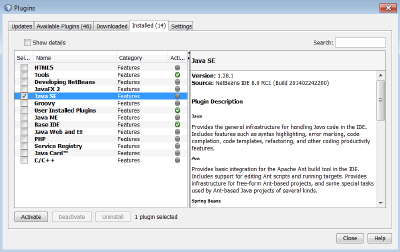
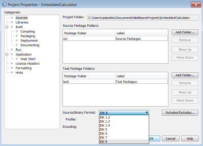
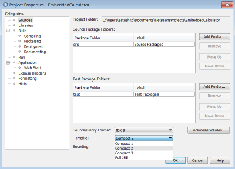
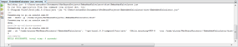

// 
//     Licensed to the Apache Software Foundation (ASF) under one
//     or more contributor license agreements.  See the NOTICE file
//     distributed with this work for additional information
//     regarding copyright ownership.  The ASF licenses this file
//     to you under the Apache License, Version 2.0 (the
//     "License"); you may not use this file except in compliance
//     with the License.  You may obtain a copy of the License at
// 
//       http://www.apache.org/licenses/LICENSE-2.0
// 
//     Unless required by applicable law or agreed to in writing,
//     software distributed under the License is distributed on an
//     "AS IS" BASIS, WITHOUT WARRANTIES OR CONDITIONS OF ANY
//     KIND, either express or implied.  See the License for the
//     specific language governing permissions and limitations
//     under the License.
//

= NetBeans IDEでのOracle Java SE Embeddedのサポートの使用
:jbake-type: tutorial
:jbake-tags: tutorials 
:jbake-status: published
:icons: font
:syntax: true
:source-highlighter: pygments
:toc: left
:toc-title:
:description: NetBeans IDEでのOracle Java SE Embeddedのサポートの使用 - Apache NetBeans
:keywords: Apache NetBeans, Tutorials, NetBeans IDEでのOracle Java SE Embeddedのサポートの使用

執筆: Tomas Zezula、Alyona Stashkova

link:http://www.oracle.com/technetwork/java/embedded/overview/javase/index.html[+Oracle Java Standard Edition Embedded+] (Oracle Java SE Embedded)を使用すると、強力な埋込みシステム向けの、高機能で信頼性の高い移植可能なアプリケーションを開発できます。NetBeans IDEでは、フットプリント、メモリー、電源、プラットフォームのサポートなどのJava SE Embedded機能をサポートしています。

このチュートリアルでは、NetBeans IDEでのJava SE Embeddedの開始方法と、Java SE Embedded機能に対するIDEサポートの使用方法について学習します。

image::images/netbeans-stamp.png[title="このページの内容は、NetBeans IDE 8.0に適用されます"]

*このチュートリアルを完了するには、次の表に示すソフトウェアとリソースが必要です。*

|===
|ソフトウェアまたはリソース |必須バージョン 

|link:http://netbeans.org/downloads/index.html[+NetBeans IDE+] |バージョン8.0 

|link:http://www.oracle.com/technetwork/java/javase/downloads/index.html[+Java Development Kit (JDK)+] |バージョン7または8 
|===

== NetBeans IDEでのリモート・プラットフォームの設定

リモート・マシンにlink:http://www.oracle.com/technetwork/java/embedded/downloads/javase/index.html?ssSourceSiteId=otncn[+Oracle Java SE Embedded+]ランタイムをダウンロードおよびインストールしたら(このチュートリアルではデモ目的でRaspberry Piを使用)、リモート・プラットフォームでNetBeans IDEを次のように設定する必要があります。

* NetBeans IDEでのJava SE機能のアクティブ化
* NetBeans IDEへのリモートJava SEプラットフォームのインストール

*IDEでJava SE機能をアクティブ化するには:*

1. IDEのメイン・ツールバーから「ツール」→「プラグイン」を選択します。
2. 「プラグイン」ダイアログ・ボックスで、「インストール済み」タブをクリックし、使用可能な機能のリストで「Java SE」を選択します。

[.feature]
--

--

. 「アクティブ化」をクリックします。

. 「インストーラ」ダイアログ・ボックスの「ようこそ」パネルで「アクティブ化」をクリックします。

. アクティブ化が正常に完了したら、「終了」をクリックします。

. 「閉じる」をクリックして「プラグイン」ダイアログ・ボックスを閉じます。

*NetBeans IDEへリモートJava SEプラットフォームをインストールするには:*

1. 「ツール」→「Javaプラットフォーム」を選択します。
「Javaプラットフォーム・マネージャ」ダイアログ・ボックスが表示されます。

[.feature]
--

image::images/jpmanager-small.png[role="left", link="images/jpmanager.png"]

--

. 「プラットフォームの追加」をクリックします。

. 「Javaプラットフォームの追加」ウィザードの「プラットフォーム・タイプを選択」で「リモートJava Standard Edition」を選択して、「次」をクリックします。
IDEで「Javaプラットフォームの追加」ダイアログ・ボックスが表示されます。

[.feature]
--

image::images/addjp-small.png[role="left", link="images/addjp.png"]

--

. デバイスの名前、IPアドレスまたはDNS名、ログイン、パスワード、リモート・デバイス上のJREへのパスなど、リモート・プラットフォームの詳細を指定します。

*注意:* ターゲット・オペレーティング・システムはUNIXである必要があります(Windowsはサポートされていません)。

. 「終了」をクリックします。プローブを実行してリモートJREシステム・プロパティをダウンロードすることで、IDEでリモートJREが検証されます。
「Javaプラットフォーム・マネージャ」ダイアログ・ボックスに、新しいリモートJava SEプラットフォームが表示されます。

[.feature]
--

image::images/jpremote-small.png[role="left", link="images/jpremote.png"]

--

これで、NetBeans IDEはリモートJava SE開発用に設定されました。

== IDEでのプロジェクトの作成および実行

次に、まずIDEで実行し、次にリモート・プラットフォームで実行するプロジェクトを作成します。

*プロジェクトを作成するには:*

1. IDEで、「ファイル」>「新規プロジェクト」を選択します。
2. 新規プロジェクト・ウィザードで「Java」カテゴリを選択し、プロジェクト・リストで「Javaアプリケーション」を選択します。「次」をクリックします。
3. ウィザードの名前と場所ページで、次の操作を行います。
* 「プロジェクト名」フィールドに`EmbeddedCalculator`と入力します。
* 「ライブラリの格納用に専用フォルダを使用」チェックボックスは選択されていない状態のままにします。
* 「メイン・クラスの作成」フィールドに`embeddedcalculator.EmbeddedCalculator`と入力します。

[.feature]
--

image::images/wizard-small.png[role="left", link="images/wizard.png"]

--

. 「終了」をクリックします。
Java SEプロジェクトがIDEで作成され、「プロジェクト」ウィンドウで開かれます。

.  ``//TODO code application logic here`` 行を次のコードで置き換えます。

[source,java]
----

    int a = 1;
    int b = 2;
    int c = a + b;
    System.out.println (c);
----

. 「ファイル」>「保存」を選択して、変更内容を保存します。

アプリケーションをテストするには、プロジェクト名を右クリックし、コンテキスト・メニューの「実行」を選択します。計算した出力は、「出力」ウィンドウで確認できます(「ウィンドウ」>「出力」)。

image::images/run-ide.png[]

== リモート・プラットフォームを使用するプロジェクトの構成

link:http://openjdk.java.net/jeps/161[+compact1、compact2またはcompact3ランタイム・プラットフォーム+]を使用してリモート・プラットフォームでJava SE Embeddedアプリケーションを開発するには、JDK 8をIDEに登録する必要があります。

*NetBeans IDEでJDK 8のサポートを有効にするには:*

1. IDEで、メイン・メニューから「ツール」>「Javaプラットフォーム」を選択します。
2. 「Javaプラットフォーム・マネージャ」ダイアログ・ボックスで「プラットフォームの追加」をクリックします。
3. 「Javaプラットフォームの追加」ダイアログ・ボックスでJava Standard Editionを選択して、「次」をクリックします。
4. JDKが含まれているディレクトリを指定して、「次」をクリックします。

[.feature]
--

image::images/jdk8-small.png[role="left", link="images/jdk8.png"]

--

. 「プラットフォームのソース」のzipファイルとAPIドキュメントのデフォルトの場所が有効であることを確認します。「終了」をクリックして「Javaプラットフォームの追加」ダイアログ・ボックスを閉じます。
JDK 8がIDEでプラットフォームとして登録されます。

[.feature]
--

image::images/jdk8registered-small.png[role="left", link="images/jdk8registered.png"]

--

. 「閉じる」をクリックします。

*JDK 8を使用するようにプロジェクトを構成するには:*

1. 「プロジェクト」ウィンドウでEmbeddedCalculatorプロジェクトを右クリックし、コンテキスト・メニューから「プロパティ」を選択します。
2. 「プロジェクト・プロパティ」ダイアログ・ボックスで、「ライブラリ」カテゴリを選択し、JDK 1.8をJavaプラットフォームとして設定します。

[.feature]
--

image::images/prj-jdk8-small.png[role="left", link="images/prj-jdk8.png"]

--

. 「ソース」カテゴリを選択して、「ソース/バイナリ形式」をJDK 8に設定します。

[.feature]
--

--

. リモート・プラットフォームでランタイムとして使用するプロファイルを指定します(Compact 2など)。

[.feature]
--

--

. 「OK」をクリックして変更を保存します。
プロジェクトは、リモート・プラットフォームで特定のランタイムを認識するように設定されます。

== リモート・プラットフォームでのプロジェクトの実行

プロジェクト構成をデフォルトとは異なる構成に設定した後、リモート・デバイスでアプリケーションを実行およびデバッグできます。

*新しい構成を作成するには:*

1. 「プロジェクト」ウィンドウでプロジェクトの名前を右クリックし、コンテキスト・メニューから「プロパティ」を選択します。
2. 「実行」カテゴリを選択します。
3. 「構成」ドロップダウン・リストの右の「新規」をクリックします。
4. 「新規構成を作成」ダイアログ・ボックスで新しい構成の名前を指定して、「OK」をクリックします。
5. 「ランタイム・プラットフォーム」ドロップダウン・リストからランタイム・プラットフォーム名を選択します。

[.feature]
--

image::images/config-runtime-small.png[role="left", link="images/config-runtime.png"]

--

. 「OK」をクリックして編集を保存します。

リモート・プラットフォーム(「実行」>「プロジェクトの実行」(プロジェクト名))でプロジェクトを実行する場合、出力は次の図のようになります。

[.feature]
--

--

*プロジェクト構成間で切り替えるには:*

* 「実行」>「プロジェクトの構成を設定」>「構成名」を選択するか、プロジェクト名を右クリックしてコンテキスト・メニューの「構成を設定」>「構成名」を選択します。

[.feature]
--

image::images/switch-config-small.png[role="left", link="images/switch-config.png"]

--

link:/about/contact_form.html?to=3&subject=Feedback:%20Setting%20Up%20Oracle%20Java%20SE%20Embedded%20in%20NetBeans%20IDE[+このチュートリアルに関するご意見をお寄せください+]

== 関連項目

* link:http://www.oracle.com/technetwork/java/embedded/resources/se-embeddocs/index.html?ssSourceSiteId=null[+Java SE Embeddedドキュメント+]
* link:https://www.youtube.com/watch?v=mAnne3N0d5Y#t=149[+簡単にできるJava SE Embedded開発 - (パート1/2)+]
* link:https://www.youtube.com/watch?v=G8oMx2SJZq8[+簡単にできるJava SE Embedded開発 - (パート2/2)+]
* link:http://www.oracle.com/technetwork/articles/java/raspberrypi-1704896.html[+Raspberry PiでのJava® SE Embeddedの開始+]
