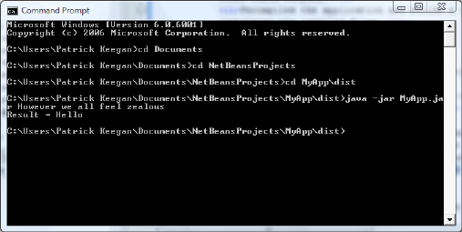

// 
//     Licensed to the Apache Software Foundation (ASF) under one
//     or more contributor license agreements.  See the NOTICE file
//     distributed with this work for additional information
//     regarding copyright ownership.  The ASF licenses this file
//     to you under the Apache License, Version 2.0 (the
//     "License"); you may not use this file except in compliance
//     with the License.  You may obtain a copy of the License at
// 
//       http://www.apache.org/licenses/LICENSE-2.0
// 
//     Unless required by applicable law or agreed to in writing,
//     software distributed under the License is distributed on an
//     "AS IS" BASIS, WITHOUT WARRANTIES OR CONDITIONS OF ANY
//     KIND, either express or implied.  See the License for the
//     specific language governing permissions and limitations
//     under the License.
//

= 开发常规 Java 应用程序
:jbake-type: tutorial
:jbake-tags: tutorials 
:jbake-status: published
:icons: font
:syntax: true
:source-highlighter: pygments
:toc: left
:toc-title:
:description: 开发常规 Java 应用程序 - Apache NetBeans
:keywords: Apache NetBeans, Tutorials, 开发常规 Java 应用程序

下面的简明教程将为您介绍在 NetBeans IDE 中开发 Java SE 应用程序的一些基本步骤。本教程假定您已在一定程度上熟悉了 Java 应用程序的开发。接下来，您将了解一些可简化应用程序开发的 IDE 功能。

您将创建一个应用程序，该应用程序可将多个词转换为一个词，该词包含其他每个词中的一个字母。生成的词称为 _acrostic（离合词）_。

学完本教程大约需要 30 分钟。如果您希望学习历时更短的 "Hello World" 教程，请参见 link:quickstart.html[+NetBeans IDE Java 快速入门教程+]。

image::images/netbeans-stamp-80-74.png[title="此页上的内容适用于 NetBeans IDE 7.4 和 8.0"]

*要学完本教程，您需要具备下表所列的软件和资源。*

|===
|软件或资源 |要求的版本 

|link:https://netbeans.org/downloads/index.html[+NetBeans IDE+] |7.4 或 8.0 

|link:http://www.oracle.com/technetwork/java/javase/downloads/index.html[+Java 开发工具包 (JDK)+] |6、7 或 8 
|===

== 项目设置 

创建的应用程序将包含两个项目：

* Java 类库项目，您将在其中创建实用程序类。
* 包含主类的 Java 应用程序项目，该类用于实现库项目的实用程序类中的方法。

创建这些项目后，您将在应用程序项目的类路径中添加库项目。然后，将对应用程序进行编码。库项目将包含一个带有 `acrostic` 方法的实用程序类。`acrostic` 方法采用一组词作为参数，然后基于这些词生成一个离合词。MyApp 项目将包含一个主类，该类调用 `acrostic` 方法并传递在应用程序运行时作为参数输入的词。

*注：*严格地讲，这类简单应用程序并不需要两个项目。本教程之所以使用两个项目，其目的旨在演示较复杂的应用程序可能需要的功能。

=== [[创建 Java 类库项目]] 

1. 选择 "File"（文件）> "New Project"（新建项目）（Ctrl-Shift-N 组合键）。在 "Categories"（类别）下，选择 "Java"。在“项目”下选择“Java 类库”。单击 "Next"（下一步）。
2. 在“项目名称”下，键入 `MyLib`。将项目位置更改为计算机上的任意目录。从现在起，本教程将此目录称为 `_NetBeansProjects_`。

*注：*上面指定的路径在向导的“项目文件夹”字段中应显示如下：`` /`_NetBeansProjects_`/MyLib/ ``

. （可选）选中“使用专用文件夹存储库”复选框，并指定库文件夹的位置。有关此选项的详细信息，请参见_使用 NetBeans IDE 开发应用程序_中的link:http://www.oracle.com/pls/topic/lookup?ctx=nb8000&id=NBDAG455[+与其他用户共享库+]。

. 单击 "Finish"（完成）。将同时在“项目”窗口和“文件”窗口中打开 MyLib 项目。

=== [[创建 Java 应用程序项目]] 

1. 选择 "File"（文件）> "New Project"（新建项目）。在 "Categories"（类别）下，选择 "Java"。在“项目”下，选择“Java 应用程序”。单击 "Next"（下一步）。
2. 在“项目名称”下，键入 `MyApp`。确保将“项目位置”设置为 `_NetBeansProjects_`。
3. （可选）选中“使用专用文件夹存储库”复选框。
4. 输入 `acrostic.Main` 作为主类。
5. 确保选中 "Create Main Class"（创建主类）复选框。
6. 单击 "Finish"（完成）。在“项目”窗口中显示 MyApp 项目，并在源代码编辑器中打开 `Main.java`。

=== [[配置编译类路径]] 

由于 MyApp 将依赖于 MyLib 中的类，因此您必须在 MyApp 的类路径中添加 MyLib。执行此操作还可确保 MyApp 项目中的类可以引用 MyLib 项目中的类，而不会导致编译错误。此外，您也可以通过此操作在 MyApp 项目中使用代码完成功能填写基于 MyLib 项目的代码。在 IDE 中，类路径由“库”节点直观表示。

*在项目类路径中添加库的实用程序类：*

1. 在 "Projects"（项目）窗口中，右键单击 MyApp 项目的 "Libraries"（库）节点，然后选择 "Add Project"（添加项目），如下图所示。

image::images/addproj.png[]

. 浏览到 `_NetBeansProjects_/`，然后选择 `MyLib` 项目文件夹。“项目 JAR 文件”窗格显示了可以添加到项目中的 JAR 文件。请注意，系统将列出 MyLib 的 JAR 文件，即使您尚未实际构建 JAR 文件也是如此。在构建并运行 MyApp 项目时，将构建此 JAR 文件。

. 单击“添加项目 JAR 文件”。

. 展开“库”节点。MyLib 项目的 JAR 文件将添加到 MyApp 项目的类路径中。

== 创建和编辑 Java 源代码 

现在您需要创建 Java 包并添加将用于构建离合词的方法。之后，您需要在 `Main` 类中实现 `acrostic` 方法。

=== 创建 Java 包和类文件

1. 右键单击 MyLib 项目节点，然后选择“新建”>“Java 类”。键入 `LibClass` 作为新类的名称，在“包”字段中键入 `org.me.mylib`，然后单击“完成”。此时将在源代码编辑器中打开 `LibClass.java`。
2. 在 `LibClass.java` 中，将光标置于类声明 (`public class LibClass {`) 后面的行上。
3. 键入或粘贴以下方法代码： 

[source,java]
----

    public static String acrostic(String[] args) {
        StringBuffer b = new StringBuffer();
        for (int i = 0; i < args.length; i++) {
            if (args[i].length() > i) {
                b.append(args[i].charAt(i));
            } else {
                b.append('?');
            }
        }
        return b.toString();
                }
----

. 如果粘贴的代码格式不正确，请按 Alt-Shift-F 组合键重新设置整个文件的格式。

. 按 Ctrl-S 组合键保存该文件。

=== 编辑 Java 文件

现在您将向 `Main.java` 中添加一些代码。在执行此操作的过程中，您会看到源代码编辑器的代码完成和代码模板（缩写）功能。

1. 在源代码编辑器中选择 `Main.java` 标签。如果尚未打开该标签，请在“项目”窗口中展开 "MyApp" >“源包”> "acrostic"，然后双击 `Main.java`。
2. 删除 `main` 方法中的 `// TODO code application logic here` 注释。
3. 键入下列代码，以代替该注释：

[source,java]
----

String result = Li
----

将光标保留在紧随 `Li` 之后的位置。在下一步中，您将使用代码完成功能来将 `Li` 转换为 `LibClass`。

. 按 Ctrl-空格键打开代码完成框。

将显示一个简短的列表，其中列出了用于完成该词的可能方式。但是，该列表中可能不会列出您所需的类 `LibClass`。

. 再次按 Ctrl-空格键以显示较长的可能匹配项列表。

此列表中应该包含 `LibClass`。

. 选择 `LibClass`，然后按 Enter 键。IDE 将填写该类名的其余部分，并且还将自动为该类创建一个 import 语句。

*注：*IDE 还将在代码完成框的上面打开一个框，该框显示选定类或包的 Javadoc 信息。由于此包没有对应的 Javadoc 信息，因此该框将显示“无法找到 Javadoc”消息。

. 在主方法中 `LibClass` 后面键入句点 (.)。将再次打开代码完成框。

. 选择 `acrostic(String[]args)` 方法，然后按 Enter 键。IDE 将填写 `acrostic` 方法并突出显示 `args` 参数。

. 按 Enter 键以接受 `args` 参数。

. 键入分号 (;)。

最后一行应与以下行类似。

[source,java]
----

String result = LibClass.acrostic(args);
----

. 按 Enter 键以开始一个新行。然后，键入 `sout` 并按 Tab 键。`sout` 缩写将扩展为 `System.out.println("");`，且光标置于引号之间。在引号内键入 `Result =`，并在右引号后面键入 `+ result`。

最后一行应与以下行类似。

[source,java]
----

System.out.println("Result = " + result);
----

. 按 Ctrl-S 组合键保存该文件。

*注：*`sout` 是源代码编辑器中许多可用的代码模板之一。要查找和编辑代码模板的列表，请选择“工具”>“选项”>“编辑器”>“代码模板”。

== 编译并运行应用程序 

现在您需要设置主类和执行参数，以便您可以运行该项目。

*注：*默认情况下，在创建项目时已启用了“在保存时编译”功能，因此无需首先编译代码，即可在 IDE 中运行应用程序。有关详细信息，请参见_使用 NetBeans IDE 开发应用程序_中的link:http://www.oracle.com/pls/topic/lookup?ctx=nb8000&id=NBDAG525[+编译单个 Java 文件+]。

=== 设置主类和执行参数

此程序的输出基于您在运行程序时提供的参数。您将提供五个词作为参数，然后通过这五个词生成离合词 "Hello"。离合词是由第一个词的第一个字母、第二个词的第二个字母、第三个词的第三个字母，依此类推组合而成的。

*添加 IDE 在运行应用程序时使用的参数：*

1. 右键单击 MyApp 项目节点，选择“属性”，然后选择对话框左窗格中的“运行”节点。

主类应该已设置为 `acrostic.Main`。

. 在“参数”字段中键入 `However we all feel zealous`，然后单击“确定”。

=== 运行应用程序

现在您已创建了应用程序并为该应用程序提供了运行时参数，接下来便可以在 IDE 中测试运行应用程序。

*在 IDE 中运行应用程序：*

1. 右键单击 "MyApp" 项目节点，然后选择“清理并构建”。
2. 选择“运行 > 运行项目”（F6 键）。

在“输出”窗口中，您应该看到程序的输出 `Result = Hello`（作为参数传递到程序的短语的离合词）。

== 测试和调试应用程序 

现在您将使用 JUnit 为项目创建并运行测试，然后在 IDE 的调试器中运行应用程序以检查错误。在 JUnit 测试中，您将通过以下方式来测试 LibClass：将短语传递到 `acrostic` 方法，然后使用断言指示您认为应生成的结果。

=== 创建 JUnit 测试

1. 在“项目”窗口中右键单击 `LibClass.java` 节点，然后选择“工具”>“创建 JUnit 测试”（Ctrl-Shift-U 组合键）。

如果这是您首次在 IDE 中创建 JUnit 测试，则系统会显示“选择 JUnit 版本”对话框提示。按 Enter 键以选择 "JUnit 4.x"，然后继续执行“创建测试”对话框中的操作。

. 在“创建测试”对话框中，单击“确定”以使用默认选项运行命令。IDE 在单独的 `test` 文件夹中创建 `org.me.mylib` 包和 `LibClassTest.java` 文件。通过展开“测试包”节点和 `org.me.mylib` 子节点，可以找到此文件。

. 在 `LibClassTest.java` 中，删除 `public void testAcrostic()` 方法的主体。

. 键入或粘贴以下代码，以代替删除的行：

[source,java]
----

System.err.println("Running testAcrostic...");
String result = LibClass.acrostic(new String[]
                  {"fnord", "polly", "tropism"});
                assertEquals("Correct value", "foo", result);
----

. 通过按 Ctrl-S 组合键保存该文件。

=== 运行 JUnit 测试

1. 选择 MyLib 项目节点，然后选择“运行”>“测试项目 (MyLib)”或按 Alt-F6 组合键。`MyLib (test)` 标签在“输出”窗口中打开。同时，将编译并运行 JUnit 测试用例。“JUnit 测试结果”显示测试是否通过。
2. 您还可以运行单个测试文件，而不是测试整个项目。在源代码编辑器中选择 `LibClass.java` 标签，然后选择“运行”>“测试文件”。

可以从 IDE 中获取 JUnit API 文档。选择“帮助”>“Javadoc 参考”>“JUnit `_版本号_`”。

通过访问 link:http://www.junit.org[+http://www.junit.org+]，可以了解有关 JUnit 的详细信息。

=== 调试应用程序

在此部分，您将使用调试器来逐步执行应用程序，并观察在组合离合词时变量值的变化情况。

*在调试器中运行应用程序：*

1. 在 `LibClass.java` 文件中，转至 `acrostic` 方法，并在 `b.append(args[i].charAt(i));` 内部的任何位置放入插入点。然后，按 Ctrl-F8 组合键设置断点。
2. 选择“调试”>“调试项目”（Ctrl-F5 组合键）。IDE 将打开调试器窗口并在调试器中运行该项目，直至到达断点为止。
3. 选择 IDE 底部的“局部变量”窗口，然后展开 `args` 节点。字符串数组包含您输入的作为命令参数的短语。
4. 按 F7 键（或选择“调试”>“步入”）以逐步执行程序，同时观察构建离合词时 `b` 变量的变化情况。

在程序结束时，调试器窗口会关闭。

有关详细信息，请参见link:junit-intro.html[+在 NetBeans IDE 中编写 JUnit 测试+]。

== 构建、运行和分发应用程序

如果您对应用程序正常工作的现状感到满意，可以准备在 IDE 外部署应用程序。在此部分，您将构建应用程序的 JAR 文件，然后从命令行运行 JAR 文件。

=== 构建应用程序

IDE 中的主构建命令是“清理并构建”命令。“清理并构建”命令可以删除以前编译的类和其他构建工件，然后从头开始重新构建整个项目。

*注：*还有一个“构建”命令，该命令不会删除旧的构建工件，但此命令默认情况下处于禁用状态。有关详细信息，请参见_使用 NetBeans IDE 开发应用程序_中的link:http://www.oracle.com/pls/topic/lookup?ctx=nb8000&id=NBDAG512[+关于构建 Java 项目+]。

*构建应用程序：*

* 选择“运行”>“清理并构建项目”（Shift-F11 组合键）。

此时 Ant 构建脚本中的输出会显示在“输出”窗口中。如果未显示“输出”窗口，则可以通过选择“窗口”>“输出”>“输出”手动打开该窗口。

清理并构建项目时，会出现以下情况：

* 删除（“清理”）由以前的构建操作所构建的输出文件夹。（大多数情况下，这些文件夹为 `build` 和 `dist` 文件夹。）
* 将 `build` 和 `dist` 文件夹添加到项目文件夹（以下称为 _PROJECT_HOME_ 文件夹）中。您可以在“文件”窗口中查看这些文件夹。
* 将所有源都编译成 `.class` 文件，并将这些文件放置在 `_PROJECT_HOME_/build` 文件夹中。
* 在 `_PROJECT_HOME_/dist` 文件夹中创建包含项目的 JAR 文件。
* 如果您已为该项目指定了任何库（除了 JDK 之外），则在 `dist` 文件夹中将创建一个 `lib` 文件夹。这些库将被复制到 `dist/lib` 中。
* JAR 中的清单文件更新后将包括用于指定主类的条目以及项目的类路径中的所有库。

*注：*您可以在 IDE 的“文件”窗口中查看清单的内容。构建项目后，请切换到“文件”窗口并导航至 `dist/MyApp.jar`。展开 JAR 文件的节点，展开 `META-INF` 文件夹，然后双击 `MANIFEST.MF` 以便在源代码编辑器中显示清单。

[source,java]
----

Main-Class: acrostic.Main
            Class-Path: lib/MyLib.jar
----

（要查找有关清单文件的详细信息，请参见 Java 教程中的link:http://java.sun.com/docs/books/tutorial/deployment/jar/manifestindex.html[+本章+]。）

=== 在 IDE 外部运行应用程序

*在 IDE 外部运行应用程序：*

1. 在系统上，打开命令提示符或终端窗口。
2. 在命令提示符下，将目录更改为 `MyApp/dist` 目录。
3. 在命令行中，键入以下语句：

[source,java]
----

                java -jar MyApp.jar However we all feel zealous    
----

随后，将执行应用程序并返回以下输出，如下图所示：

[source,java]
----

Result = Hello
            
----
[.feature]
--

--

=== 将应用程序分发给其他用户

现在您已验证了应用程序能够在 IDE 外部运行，接下来便可以分发该应用程序。

*分发应用程序：*

1. 在您的系统上，创建一个 zip 文件，该文件包含应用程序 JAR 文件 (`MyApp.jar`)，并附带包含 `MyLib.jar` 的 `lib` 文件夹。
2. 将该文件发送给要使用该应用程序的人员。指示他们解压缩该 zip 文件，并确保 `MyApp.jar` 文件和 `lib` 文件夹位于同一个文件夹中。
3. 指示用户按照上面的<<running-outside-IDE,在 IDE 外部运行应用程序>>部分中的步骤进行操作。

== 其他常见任务

现在您已学完了该教程的主要部分，但是仍有一些基本的任务尚未介绍。此部分包括其中的几项任务。

=== 使 Javadoc 在 IDE 中可用

要在 NetBeans IDE 中查看 JavaSE API 文档，请使用“源”>“显示文档”命令，或者从主菜单中选择“窗口”>“IDE 工具”>“Javadoc 文档”，以便在单独窗口中查看 API 文档。

不过，对于某些第三方库，则无法使用 API 文档。在这些情况下，必须手动将 Javadoc 资源与 IDE 相关联。

*要使 API 文档可用于“显示 Javadoc”命令，请执行以下操作：*

1. 下载 Javadoc API 文档源（有关其他详细信息，请参见 link:http://wiki.netbeans.org/FaqJavaDoc#Adding_the_JDK_Javadoc_to_the_NetBeans_IDE[+FaqJavaDoc+] 页）。
2. 选择 "Tools"（工具）> "Java Platforms"（Java 平台）。
3. 单击 "Javadoc" 标签。
4. 单击“添加 ZIP/文件夹”按钮，然后导航至系统上包含 Javadoc API 文档的 zip 文件或文件夹。选择该 zip 文件或文件夹，然后单击“添加 ZIP/文件夹”按钮。
5. 单击 "Close"（关闭）。

=== 为项目生成 Javadoc

您可以根据添加到类中的 Javadoc 注释为项目生成已编译的 Javadoc 文档。

*为项目生成 Javadoc 文档：*

1. 选择 MyLib 项目。
2. 从 IDE 主菜单中选择“运行”>“为 "MyLib" 生成 Javadoc”。
生成的 Javadoc 将添加到项目的 `dist` 文件夹中。此外，IDE 还将打开一个 Web 浏览器，用于显示 Javadoc。
link:/about/contact_form.html?to=3&subject=Feedback:%20Developing%20General%20Java%20Applications[+发送有关此教程的反馈意见+]

== 后续步骤

有关使用 NetBeans IDE 开发 Java SE 应用程序的更多信息，请参见以下资源：

* link:javase-deploy.html[+打包和部署桌面 Java 应用程序+]
* link:annotations.html[+NetBeans IDE 中的标注处理程序支持+]
* link:debug-multithreaded.html[+调试多线程应用程序+]
* link:../../trails/java-se.html[+常规 Java 开发学习资源+]
* link:../../trails/matisse.html[+Java 和 JavaFX GUI 学习资源+]
* link:../../index.html[+NetBeans IDE 文档和支持页+]
* _使用 NetBeans IDE 开发应用程序_中的link:http://www.oracle.com/pls/topic/lookup?ctx=nb8000&id=NBDAG366[+创建 Java 项目+]
