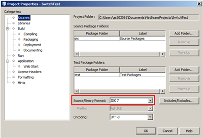

// 
//     Licensed to the Apache Software Foundation (ASF) under one
//     or more contributor license agreements.  See the NOTICE file
//     distributed with this work for additional information
//     regarding copyright ownership.  The ASF licenses this file
//     to you under the Apache License, Version 2.0 (the
//     "License"); you may not use this file except in compliance
//     with the License.  You may obtain a copy of the License at
// 
//       http://www.apache.org/licenses/LICENSE-2.0
// 
//     Unless required by applicable law or agreed to in writing,
//     software distributed under the License is distributed on an
//     "AS IS" BASIS, WITHOUT WARRANTIES OR CONDITIONS OF ANY
//     KIND, either express or implied.  See the License for the
//     specific language governing permissions and limitations
//     under the License.
//

= Overview of JDK 7 Support in NetBeans IDE
:jbake-type: tutorial
:jbake-tags: tutorials 
:jbake-status: published
:icons: font
:syntax: true
:source-highlighter: pygments
:toc: left
:toc-title:
:description: Overview of JDK 7 Support in NetBeans IDE - Apache NetBeans
:keywords: Apache NetBeans, Tutorials, Overview of JDK 7 Support in NetBeans IDE

The NetBeans IDE supports Java 7 language features, such as the diamond operator, strings in switch, multicatch, etc. When you use these constructs in your code, the IDE recognizes them, offers correct classes in code completion, correctly highlights errors, and lets you automatically fix syntax. Thus, the NetBeans IDE helps you write code that is compatible with link:http://docs.oracle.com/javase/specs/jls/se7/html/index.html[+the Java Language Specification, Java SE 7 Edition+].

In this tutorial, you learn how the IDE handles Java 7 language constructs.

image::images/netbeans-stamp-80-74.png[title="Content on this page applies to NetBeans IDE 7.4 and 8.0"]

*To complete this tutorial, you need the software and resources listed in the following table.*

|===
|Software or Resource |Version Required 

|xref:../../../download/index.adoc[NetBeans IDE] |version 7.4 or 8.0 

|link:http://www.oracle.com/technetwork/java/javase/downloads/index.html[+Java Development Kit (JDK)+] |version 7 or 8 
|===

== Ensuring JDK 7 is Registered in the NetBeans IDE

To check JDK 7 is registered in the NetBeans IDE:

1. In the IDE, choose Tools > Java Platforms from the main menu.
2. Ensure JDK 1.7 is chosen in the Platforms list of the Java Platforms Manager dialog box.

[.feature]
--

image::images/platform-small.png[role="left", link="images/platform.png"]

--

. Click Close.

== Checking the Project Configuration

To check your project is configured to use the registered JDK for compilation, running, and debugging:

1. Create a Java project by choosing File > New Project and selecting Java Application as the project type.
2. Click Next.
3. Type  ``SwitchTest``  as the project name and specify its location.
4. Click Finish.
5. In the Projects window, right-click the  ``SwitchTest``  project's node and choose Properties > Libraries. On this tab, ensure JDK 1.7 is selected in the list of Java Platforms.

[.feature]
--

image::images/props-libs-small.png[role="left", link="images/props-libs.png"]

--

. Switch to the Sources tab of the Project Properties window and ensure JDK 7 is chosen as the Source/Binary Format.

[.feature]
--

--

. Click OK to close the Project Properties dialog box. Your project is configured to recognize Java 7 language features.

== Using New JDK 7 Language Constructs: Switch Statement

JDK 7 brings a number of link:https://openjdk.org/projects/jdk7/features[+new features and enhancements+] in different areas, including internationalization, I/O and networking, security, etc. The best way to illustrate the JDK 7 support by the IDE's Java Editor is to demonstrate a few language changes introduced by Project Coin.

One of these changes is a "String in a switch". In the previous versions of Java, the argument of  ``switch``  had to be only of the following primitive data types:  ``byte`` ,  ``short`` ,  ``char`` ,  ``int`` , or  ``enum`` . Starting from JDK 7, you can use arguments of type  ``String``  in the expression of a  ``switch``  statement.

1. Open  ``SwitchTest.java``  and add the following code. This small sample displays RGB codes for several colors. 
With JDK 7, the  ``color``  variable can be a  ``String`` .

[source,java]
----

package switchtest;

    public class SwitchTest {

    public static void main(String[] args) {

        String color = "red";
        String colorRGB;
        switch (color.toLowerCase()) {
            case "black": colorRGB = "000000"; break;
            case "red": colorRGB = "ff0000"; break;
            case "green": colorRGB = "008000"; break;
            case "blue": colorRGB = "0000ff"; break;
            default: colorRGB = "Invalid color"; break;
        }
        System.out.println(colorRGB);
        }
    }

----

If the pasted code is formatted incorrectly in the editor, press Alt-Shift-F to reformat.

. In the Projects window, right-click the project's node and choose Run File. You will see the output of the application, which is the RGB code for the red color. 
You can see that the build is successful and the application works when the target platform and source format is JDK 7.

image::images/output.png[]

. Let's rollback to using JDK 6 and test how the application is complied with the JDK 6 compiler. 
In the Projects window, right-click the project's node and choose Properties. In the Sources category, set the Source/Binary Format to  ``JDK 6``  and click OK.
You can immediately see that the JDK6 parser does not recognize the syntax. The compilation fails because of the incompatible variable type.

[.feature]
--

image::images/error-small.png[role="left", link="images/error.png"]

--

. Now, let's rewrite the code using the  ``if-then-else``  statement instead of  ``switch``  as follows:

[source,java]
----

package switchtest;

    public class SwitchTest {

    public static void main(String[] args) {

        String color = "red";
        String colorRGB;
        if (color.equals("black")) {
            colorRGB = "000000";
        } else if (color.equals("red")) {
            colorRGB = "ff0000";
        } else if (color.equals("green")) {
            colorRGB = "008000";
        } else if (color.equals("blue")) { 
            colorRGB = "0000ff";
        } else {
            colorRGB = "Invalid color";
        }
        System.out.println(colorRGB);
        }
    }

----
With JDK 7 being the Source/Binary Format, the IDE recognizes such cases and offers you to convert them to  ``switch``  as shown in the picture below.

[.feature]
--

image::images/convert-small.png[role="left", link="images/convert.png"]

--

Click the hint and the  ``if-then-else``  construct will be automatically converted to exactly the same  ``switch``  that we had before.

== JDK 7 Support: More Examples

To demonstrate how the IDE's Java Editor recognizes and automatically fixes code to be compliant with the JDK 7 language spec, let's use a dummy code snippet, which is meaningless but contains all the major language improvements.

When walking through this dummy code snippet and applying editor hints, you will see the following examples of how to:

* Take advantage of automatic type inference, when the Java compiler is able to infer the type of a generic instance without the need to explicitly specify it. The so-called _diamond operator_ is used to flag the type inference case.
* Use improved exception handling or _multi-catch_, when one  ``catch``  block can be used for several types of exceptions. 
* Use the new syntax of resource closure statements introduced by the Automatic Resource Management feature.

1. Replace the previous application code in the same  ``SwitchTest.java``  file with the following code:

[source,java]
----

package switchtest;

import java.io.FileInputStream;
import java.lang.reflect.Method;
import java.io.IOException;
import java.lang.reflect.InvocationTargetException;
import java.util.ArrayList;
import java.util.HashMap;
import java.util.List;

public class SwitchTest {

    public void test() throws IOException {
        List<String> list = new ArrayList<String>();
        HashMap<String, Integer> map = new HashMap<String, Integer>();
        HashMap<String, Integer> map2 = new HashMap<String, Integer>();
        String a = "ehlo";

        try {
            Method m = Object.class.getMethod("toString");
            m.invoke(this);
        } catch(NoSuchMethodException e) {
            e.printStackTrace();
        } catch(InvocationTargetException e) {
            e.printStackTrace();
        } catch(IllegalAccessException e) {
            e.printStackTrace();
        }

        FileInputStream in = null;
        try {
            in = new FileInputStream("foo.txt");

            int k;
            while ((k = in.read()) != -1) {
                System.out.write(k);
            }
        } finally {
            if (in != null) {
                in.close();
            }
        }
    }
}
 
----

. Note that the IDE displays several hints, as shown above in this tutorial, of how you can optimize your code for the JDK 7 spec. Simply click on each hint and select the suggested action. 

. Finally, after you accept all the suggestions, you should have the JDK 7 compatible code shown below.

[.feature]
--

image::images/converted-small.png[role="left", link="images/converted.png"]

--

xref:../../../community/mailing-lists.adoc[Send Us Your Feedback]

== See Also

For more information about JDK 7 and the NetBeans IDE, see:

* link:http://www.oracle.com/pls/topic/lookup?ctx=nb7400&id=NBDAG465[+Setting the Target JDK+] in _Developing Applications with NetBeans IDE_
* link:http://download.oracle.com/javase/tutorial/essential/io/fileio.html[+The Java Tutorials: File I/O+] - a section in the Java Tutorials that contains numerous examples of JDK 7 changes in I/O.
* link:http://download.oracle.com/javase/tutorial/essential/concurrency/forkjoin.html[+The Java Tutorials: Fork and Join+] - explanation of the new fork/join framework in JDK7.

For more information about developing Java applications in the NetBeans IDE, see:

* xref:javase-intro.adoc[+Developing General Java Applications+]
* xref:../java-se.adoc[+General Java Development Learning Trail+]
* link:http://www.oracle.com/pls/topic/lookup?ctx=nb8000&id=NBDAG366[+Creating Java Projects+] in _Developing Applications with NetBeans IDE_
