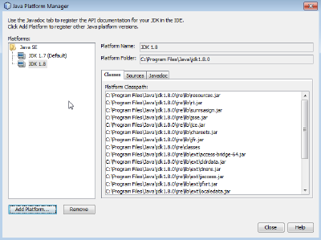
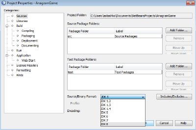
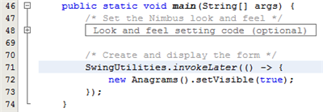
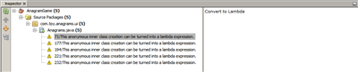

// 
//     Licensed to the Apache Software Foundation (ASF) under one
//     or more contributor license agreements.  See the NOTICE file
//     distributed with this work for additional information
//     regarding copyright ownership.  The ASF licenses this file
//     to you under the Apache License, Version 2.0 (the
//     "License"); you may not use this file except in compliance
//     with the License.  You may obtain a copy of the License at
// 
//       http://www.apache.org/licenses/LICENSE-2.0
// 
//     Unless required by applicable law or agreed to in writing,
//     software distributed under the License is distributed on an
//     "AS IS" BASIS, WITHOUT WARRANTIES OR CONDITIONS OF ANY
//     KIND, either express or implied.  See the License for the
//     specific language governing permissions and limitations
//     under the License.
//

= Overview of JDK 8 Support in NetBeans IDE
:jbake-type: tutorial
:jbake-tags: tutorials 
:jbake-status: published
:syntax: true
:icons: font
:source-highlighter: pygments
:toc: left
:toc-title:
:description: Overview of JDK 8 Support in NetBeans IDE - Apache NetBeans
:keywords: Apache NetBeans, Tutorials, Overview of JDK 8 Support in NetBeans IDE

Written by Tomas Zezula and Alyona Stashkova

NetBeans IDE supports link:https://openjdk.org/projects/jdk8/features[+JDK 8 features+], such as lambda expressions, repeatable annotations, compact profiles, etc. When these constructs are used in your code, the IDE recognizes them, correctly highlights errors, and lets you automatically fix syntax. Thus, NetBeans IDE helps you write code that is compatible with link:http://download.oracle.com/otndocs/jcp/java_se-8-edr-spec/index.html[+Java SE 8 Release Contents Early Draft Review Specification+].

In this tutorial, you will learn how to get started with JDK 8 in NetBeans IDE and how to use the IDE support for such Java SE 8 features as compact profiles, lambda expressions, and repeating annotations.

image::images/netbeans-stamp-80-74.png[title="Content on this page applies to NetBeans IDE 7.4 and 8.0 Beta"]

*To complete this tutorial, you need the software and resources listed in the following table.*

|===
|Software or Resource |Version Required 

|xref:../../../download/index.adoc[NetBeans IDE] |version 7.4 and 8.0 

|link:http://www.oracle.com/technetwork/java/javase/downloads/index.html[+Java Development Kit (JDK)+] |version 8 
|===

== Enabling JDK 8 Support in NetBeans IDE

After JDK 8 is downloaded and installed on your system, it needs to be registered in the IDE as follows:

1. In the IDE, choose Tools > Java Platforms from the main menu.
2. Click Add Platform in the Java Platform Manager dialog.
3. In the Add Java Platform dialog, select Java Standard Edition and click Next.
4. Specify the directory that contains the JDK and click Next.

[.feature]
--

image::images/jdk8_small.png[role="left", link="images/jdk8.png"]

--

. Verify that the default locations of the Platform Sources zip file and API documentation are valid. Click Finish to close the Add Java Platform dialog box.
JDK 8 is registered as a platform in the IDE.

[.feature]
--

--

. Ensure JDK 1.8 is chosen in the Platforms list and click Close.

== Configuring a Project to use JDK 8

After you registered JDK 8 in the IDE, your project needs to be configured to use JDK 8 for compilation, running, and debugging.

We will start by creating a new Java SE project with the Anagram game example which is shipped with NetBeans IDE.

1. In the IDE, choose File > New Project.
2. In the New Project wizard, expand the Samples category and select Java.
3. Choose Anagram Game in the Projects list. Then click Next.
4. In the Name and Location panel, leave the default values for the Project Name and Project Location fields.
5. Click Finish.
The IDE creates and opens the Java SE project in the Projects window.

*To configure your project to use JDK 8:*

1. Right-click the AnagramGame project in the Projects window and select Properties from the context menu.
2. In the Project Properties dialog box, choose the Libraries category and set JDK 1.8 as the Java Platform.

[.feature]
--

image::images/prj_jdk8_small.png[role="left", link="images/prj_jdk8.png"]

--

. Select the Sources category and set Source/Binary Format to JDK 8.

[.feature]
--

--

. Click OK to save the changes. 
Your project is set to recognize new JDK 8 language features.

== Using Compact Profiles Support

Java SE 8 introduces link:https://openjdk.org/jeps/161[+subset profiles of the Java SE platform specification+] that can be used to deploy and run applications that do not require the entire platform.

Three profiles that have been defined so far are named _compact1_, _compact2_, and _compact3_. Each profile specifies a particular set of Java API packages and contains all of the APIs in profiles smaller than itself: _compact1_ is a subset of _compact2_, which is a subset of _compact3_, which in its turn is a subset of the _full JRE_. The table below lists packages that are comprised in each profile.

|===
|Compact1 |Compact2 |Compact3 |Full JRE 

|* java.lang
* java.io
* java.nio
* java.text
* java.math
* java.net
* javax.net
* java.util
* java.util.logging
* java.security
* javax.crypto
* javax.security
 |_compact1_ plus the following:

* java.sql
* javax.sql
* javax.xml
* org.w3c.dom
* org.xml.sax
* java.rmi
* javax.rmi
* javax.transaction
 |_compact2_ plus the following:

* java.lang.management
* javax.management
* javax.naming
* javax.sql.rowset
* javax.security.auth.kerberos
* org.ietf.jgss
* javax.script
* javax.xml.crypto
* java.util.prefs
* javax.security.sasl
* javax.security.acl
* java.lang.instrument
* javax.annotation.processing
* javax.lang.model
* javax.lang.model.element
* javax.lang.model.type
* javax.lang.model.util
* javax.tools
 |_compact3_ plus the following:

* corba
* awt
* swing
 

|===

The IDE allows you to switch between the profiles and the full JRE when needed.

*To set a project profile for a Java SE Project:*

1. Right-cick a project and choose Properties from the context menu.
2. In the Project Properties dialog box, select the Sources category.
3. Use the Profile drop-down list to specify the JDK 8 profile that your application will support.

[.feature]
--

image::images/prj_src_profile_small.png[role="left", link="images/prj_src_profile.png"]

--

. Click OK.

To see how the IDE checks whether classes used in your project belong to the specified profile, select Compact1 as a profile for the AnagramGame project and click OK.
The IDE displays errors to notify that the AnagramGame project is not compliant with the _compact1_ profile.

[.feature]
--

image::images/profile_small.png[role="left", link="images/profile.png"]

--

You can go back and set the AnagramGame project's profile to Full JRE which is supported by the Anagrams application.

== Using Lambda Expressions Support

link:https://openjdk.org/projects/lambda/[+Lambda expressions+] address the bulkiness of anonymous inner classes by expressing the machinery of anonymous inner classes more compactly.

The general syntax of a lambda expression consists of a set of parameters, an arrow token, and a function body (either a single expression or a statement block):

[source,java]
----

(int a, int b) -> a * a + b * b;
----

NetBeans IDE detects pre-lambda expressions and displays the hints in the Editor proposing to turn such constructs into lambda expressions.

For example, the AnagramGame project features a pre-lambda construct in the  ``Anagrams.java``  file as shown in the screenshot below.

[.feature]
--

image::images/lambda_small.png[role="left", link="images/lambda.png"]

--

After you click the light bulb in the margin or press Alt-Enter, the IDE shows the Use Lambda hint with a set of options available:

[.feature]
--

image::images/lambda_clicked_small.png[role="left", link="images/lambda_clicked.png"]

--

If the Use Lambda hint is selected, the IDE converts the anonymous inner class into a lambda expression.

[.feature]
--

--

If you choose the Run Inspect on option, the IDE displays the Inspect dialog box that allows to run a single Convert to Lambda inspection on the specified file.

NOTE: For more information on initiating the Inspect operation in the IDE, see link:http://www.oracle.com/pls/topic/lookup?ctx=nb7400&id=NBDAG613[+Using Hints in Source Code Analysis and Refactoring+] in _Developing Applications with NetBeans IDE_.

[.feature]
--

image::images/inspect_small.png[role="left", link="images/inspect.png"]

--

After you press the Inspect button to launch the inspection, the IDE identifies all the pre-lambda constructs in the file and displays them in the Inspector window.

[.feature]
--

--

If you choose the Run Inspect&amp;Transform on option, the IDE displays the Inspect and Transform dialog box that allows to run a single Convert to Lambda inspection (or a selected configuration) on the specified code and refactor it if needed.

NOTE: For more information on initiating the Inspect and Transform operation, see link:http://www.oracle.com/pls/topic/lookup?ctx=nb7400&id=NBDAG613[+Using Hints in Source Code Analysis and Refactoring+] in _Developing Applications with NetBeans IDE_.

[.feature]
--

image::images/lambda_transform_small.png[role="left", link="images/lambda_transform.png"]

--

== Using Repeating Annotations Support

Java SE 8 features include link:https://openjdk.org/jeps/120[+repeating annotations+] that enable you to apply annotations with the same type to a single program element, as shown in the following code example:

[source,java]
----

@ProjectServiceProvider(service=Foo.class,"org-nebeans-modules-j2seproject")
@ProjectServiceProvider(service=Foo.class,"org-nebeans-modules-j2eeproject")
public class MyService extends Foo {}
 
----

NetBeans IDE support for repeating annotations allows you to write code with the same annotations provided the repeatable and containing annotation types are declared:

* a repeatable annotation type must be marked with  ``@Repeatable ()`` , otherwise you get an error at compilation
* a containing annotation type must have a  ``value``  element with an array type; the component type of the array type must be the repeatable annotation type

xref:../../../community/mailing-lists.adoc[Send Us Your Feedback]

== See Also

For more information about JDK 8, see:

* link:http://jdk8.java.net/[+JDK 8 Project+]
* link:http://download.java.net/jdk8/docs/[+Java Platform Standard Edition 8 Early Access Documentation+]
* link:http://www.oracle.com/webfolder/technetwork/tutorials/obe/java/Lambda-QuickStart/index.html[+Java SE 8: Lambda Quick Start +]
* link:http://docs.oracle.com/javase/tutorial/java/javaOO/lambdaexpressions.html[+The Java Tutorials: Lambda Expressions+]
* link:http://docs.oracle.com/javase/tutorial/java/annotations/repeating.html[+The Java Tutorials: Repeating Annotations+]

For more information about developing Java applications in the NetBeans IDE, see:

* link:http://www.oracle.com/pls/topic/lookup?ctx=nb8000&id=NBDAG366[+Creating Java Projects+] in _Developing Applications with NetBeans IDE_
* xref:javase-intro.adoc[+Developing General Java Applications+]
* xref:../java-se.adoc[+General Java Development Learning Trail+]
