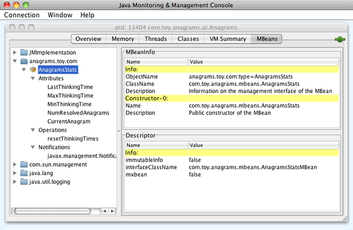
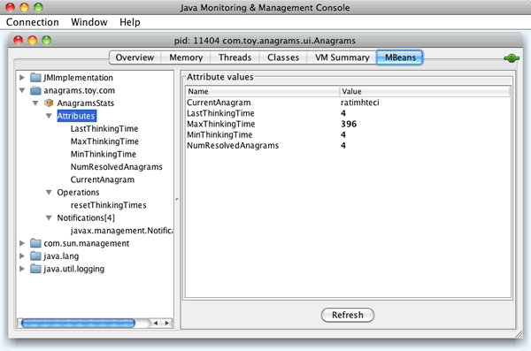

// 
//     Licensed to the Apache Software Foundation (ASF) under one
//     or more contributor license agreements.  See the NOTICE file
//     distributed with this work for additional information
//     regarding copyright ownership.  The ASF licenses this file
//     to you under the Apache License, Version 2.0 (the
//     "License"); you may not use this file except in compliance
//     with the License.  You may obtain a copy of the License at
// 
//       http://www.apache.org/licenses/LICENSE-2.0
// 
//     Unless required by applicable law or agreed to in writing,
//     software distributed under the License is distributed on an
//     "AS IS" BASIS, WITHOUT WARRANTIES OR CONDITIONS OF ANY
//     KIND, either express or implied.  See the License for the
//     specific language governing permissions and limitations
//     under the License.
//

= Getting Started with JMX Monitoring in NetBeans IDE
:jbake-type: tutorial
:jbake-tags: tutorials 
:jbake-status: published
:syntax: true
:icons: font
:source-highlighter: pygments
:toc: left
:toc-title:
:description: Getting Started with JMX Monitoring in NetBeans IDE - Apache NetBeans
:keywords: Apache NetBeans, Tutorials, Getting Started with JMX Monitoring in NetBeans IDE

The NetBeans JMX Module integrates JMX technology right into your workflow in the NetBeans IDE. This module allows you to quickly develop management applications, add management to existing applications, develop manager applications, and monitor the state of the Virtual Machine.

This document has been updated for the JMX Wizard module version 3.0, for NetBeans IDE 6.5 and newer, and running on top of JDK 6 or JDK 7. You can download the JMX module from the Update Center.

NOTE: This document is a short and quick introduction to the JMX module for NetBeans IDE. For more detailed information, complete the JMX Module Tutorial xref:jmx-tutorial.adoc[+Adding JMX Instrumentation to a Java Application+].

This getting started document gives you an overview of the JMX module features:

image::images/netbeans-stamp-80-74-73.png[title="Content on this page applies to the NetBeans IDE 7.2, 7.3, 7.4 and 8.0"]

* Wizards to create JMX MBeans and Managers.
* Actions to update exisiting MBeans by adding attributes and operations, implementing the  ``MBeanRegistration``  interface, or implementing the  ``NotificationEmitter``  interface.
* MBean generation from an existing Java Class.
* Action to register MBeans into the Java Platform MBean Server.
* Ability to launch the Java Platform management console (JConsole).
* Ability to Run and Debug your application using JConsole.
* Sample application based on the Anagram game that shows you how to add JMX power to your application.
* Wizard to generate a management properties file, that allows you to launch a secure manageable JVM.
* Online help.
* Tutorials accessible from the xref:../../index.adoc[+netbeans.org+] site.

== Prerequisites

This tutorial assumes you have some basic knowledge of, or programming experience with, the following technologies.

* JMX technology: link:http://download.oracle.com/javase/6/docs/technotes/guides/jmx/index.html[+ JMX online documentation+]
* Java technology: link:http://www.oracle.com/technetwork/java/javase/tech/index.html[+ Java SE Technologies at a Glance+]
* NetBeans IDE

You will also benefit from having some knowledge on link:http://download.oracle.com/javase/6/docs/technotes/guides/management/index.html[+ Monitoring and Management for the Java Platform+]

== Software Needed for the Tutorial

For this tutorial you need to have the following software installed on your computer:

|===
|Software or Resource |Version Required 

|xref:../../../download/index.adoc[NetBeans IDE] |7.2, 7.3, 7.4, 8.0, Java bundle 

|link:http://www.oracle.com/technetwork/java/javase/downloads/index.html[+Java Development Kit (JDK)+] |version 7 or 8 

|JMX plugin |Available from NetBeans Update Center 

|JConsole plugin |Available from NetBeans Update Center 
|===

To install the *JMX* and *JConsole* plugins, choose Tools > Plugins and download the modules from the NetBeans Update Center.

== Accessing the JMX Wizards

After you have installed the JMX plugin and your project is open, you can access the JMX wizard by choose File > New File (Ctrl-N) and selecting the JMX category. You can then choose among the following:

* *Management Configuration File.* A standard Java properties file to store your configuration for your JMX management, in particular for remote connection and security.
* *Several types of JMX MBeans.* An MBean can represent a device, an application, or any resource that needs to be managed. MBeans expose a management interface: a set of readable and/or writable attributes and a set of invokable operations, along with a self-description. The management interface does not change throughout the life of an MBean instance. MBeans can also emit notifications when certain defined events occur. JMX MBeans need to be registered into an MBean Server.
* *JMX Manager.* A JMX Manager is any application that connects to a remote JMX MBean Server.

image::images/jmx-newfile.png[title="New File Wizards in JMX category"]

== Updating MBeans

You can add attributes and operations to your MBeans with the JMX contextual menu actions, which will popup a dialog box. You can also have your MBeans implement the  ``NotificationEmitter``  interface.

To update an MBean, either select the MBean class Java file in the Project tree and access the JMX popup menu by right-clicking on the node, or simply right-click in the editor's window where your MBean class Java file is opened and access the JMX popup menu.

These actions are demonstrated in Exercise 3 of the xref:jmx-tutorial.adoc#Exercise_3[+ Adding JMX Instrumentation to a Java Application+] tutorial.

== Registering MBeans

To remotely connect to your MBeans and manage your application, your MBeans need to be registered into an MBean Server.

An MBean Server is the main central piece of the JMX technology. It keeps reference of all MBean registered into it, can send notifications of new MBean registration or deletion, and can accept remote connections to expose attributes and operations of its registered MBeans. If you are not familiar with MBean Server role, read the  `` link:http://download.oracle.com/javase/6/docs/api/javax/management/MBeanServer.html[+ javax.management.MBeanServer+]``  API documentation.

Starting with JDK 5, the Java Platform provides a default MBean Server, called the Platform MBean Server. It enables you to monitor the JVM, but you can also use it to register your own MBeans into it. For details on the Java Platform MBean Server, read the  `` link:http://download.oracle.com/javase/6/docs/api/java/lang/management/ManagementFactory.html[+ java.lang.management.ManagementFactory +]``  API documentation.

Depending on its logic, determine where in your application code you want your MBeans to be registered, typically in the initialization phase of your Main class. Right-Click in your editor's window at the location where you want the MBean's registration code to be generated, select the JMX submenu and then the "Generate MBean Registration..." action.

This action is demonstrated in Exercise 5 of the xref:jmx-tutorial.adoc#Exercise_5[+ Adding JMX Instrumentation to a Java Application+] tutorial.

== Implementing and Executing Manageable Applications

JConsole is a JMX-compliant graphical tool for monitoring a Java virtual machine. JConsole can monitor both local and remote JVMs and can be used to monitor and manage JMX applications.

Typically, the work flow of implementing and executing manageable applications is as follows:

1. Generate your MBeans.
2. Add implementation to your MBeans
3. Generate MBean's registration code.
4. Run or debug your project with JConsole.

After you install the JMX and JConsole plugins you will see that the following buttons are added to the toolbar. The actions are also accessible under the Debug menu item in the main menu.

|===
|Button |Description 

|image:images/run-project24.png[title="Run Main Project with Monitoring and Management button"] |Run Main Project with Monitoring and Management 

|image:images/debug-project24.png[title="Debug Main Project with Monitoring and Management button"] |Debug Main Project with Monitoring and Management 

|image:images/console24.png[title="Start JConsole Management Console button"] |Start JConsole Management Console 
|===

*Note.* JConsole is part of the Java Platform and can be used independently from the IDE. For details, refer to the following resources.

* link:http://download.oracle.com/javase/6/docs/technotes/tools/share/jconsole.html[+ ``jconsole``  man page+]
* link:http://download.oracle.com/javase/6/docs/technotes/guides/management/jconsole.html[+Using JConsole document+]

== Running the Sample Application

The JMX module includes a sample application with JMX monitoring built into it.

1. Choose File > New Project.
2. In Samples, select the JMX category.
3. Select the Anagram Game Managed with JMX project. 

image::images/jmx-newproject.png[title="Anagram Game Managed with JMX in New Project wizard"]

. Click Next. There is no need to change the supplied default project name or location values. Confirm that the Set as Main Project checkbox is selected. Click Finish.

*Notes.* The IDE might prompt you to install the JUnit libraries if you did not install the JUnit plugin previously. You can click Resolve in the Resolve Resource Problems dialog box to launch the Installer to install the JUnit plugin. Alternatively, you can install the JUnit plugin in the Plugins manager.

. Once your project is created, and set as the Main Project, Run it with JConsole by clicking the "Run Main Project with Monitoring and Management" JConsole button.

*Notes.* You might see a Connection Failed warning in the Java Monitoring &amp; Management Console when the console attempts to connect to the Anagram Game process. For this tutorial you can click Insecure when you are prompted to authorize the connection.

Clicking this button launches and displays the Anagram Game:

image::images/jmx-anagram.png[title="Anagram Game"]

The JConsole window is also displayed.

. In the JConsole window, select the MBeans tab and in the tree layout on the left open down all nodes under  ``anagrams.toy.com``  as shown below.

. Select the Notifications node and click on the Subscribe button at the bottom so that JConsole will receive a new notification each time an anagram is solved.

. Now go to the Anagrams Game window, and solve the first three or four anagrams (The answers are in the WordLibrary class, but here they are: abstraction, ambiguous, arithmetic, backslash, ...)

. Go back to JConsole, and notice that it received the four notifications.

. Click on the Attributes node and notice the attributes values are updated: 

xref:../../../community/mailing-lists.adoc[Send Us Your Feedback]

== See Also

This document was a short and quick introduction to the JMX module for NetBeans IDE. For more detailed information, see the following JMX module tutorial:

* xref:jmx-tutorial.adoc[+Adding JMX Instrumentation to a Java Application+]
