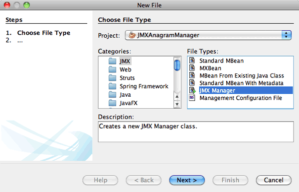
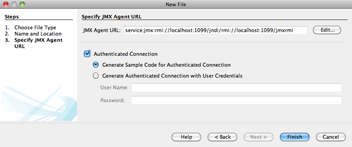

// 
//     Licensed to the Apache Software Foundation (ASF) under one
//     or more contributor license agreements.  See the NOTICE file
//     distributed with this work for additional information
//     regarding copyright ownership.  The ASF licenses this file
//     to you under the Apache License, Version 2.0 (the
//     "License"); you may not use this file except in compliance
//     with the License.  You may obtain a copy of the License at
// 
//       http://www.apache.org/licenses/LICENSE-2.0
// 
//     Unless required by applicable law or agreed to in writing,
//     software distributed under the License is distributed on an
//     "AS IS" BASIS, WITHOUT WARRANTIES OR CONDITIONS OF ANY
//     KIND, either express or implied.  See the License for the
//     specific language governing permissions and limitations
//     under the License.
//

= Desenvolvendo um Gerenciador do Java Management Extensions (JMX) e Conectando-se a um Agente JMX Remoto
:jbake-type: tutorial
:jbake-tags: tutorials 
:jbake-status: published
:icons: font
:syntax: true
:source-highlighter: pygments
:toc: left
:toc-title:
:description: Desenvolvendo um Gerenciador do Java Management Extensions (JMX) e Conectando-se a um Agente JMX Remoto - Apache NetBeans
:keywords: Apache NetBeans, Tutorials, Desenvolvendo um Gerenciador do Java Management Extensions (JMX) e Conectando-se a um Agente JMX Remoto

*Duração esperada: 30 minutos*

O Módulo do Assistente JMX do NetBeans integra a tecnologia do JMX correta para seu workflow no NetBeans IDE. Este módulo permite que você desenvolva aplicações de gerenciamento, adicione o gerenciamento às aplicações existentes, desenvolva aplicações do gerenciador e monitore o estado da Máquina Virtual.

Este tutorial mostra como executar as seguintes ações:

1. Inicie um agente JMX para torná-lo acessível de um gerenciador JMX remoto.
2. Crie um gerenciador JMX.
3. Execute o gerenciador.
4. Atualize o gerenciador para adicionar sua própria lógica de gerenciamento.

== Exercícios do Tutorial

image::images/netbeans-stamp-80-74-73.png[title="O conteúdo desta página se aplica ao NetBeans IDE 7.2, 7.3, 7.4 e 8.0"]

* <<Exercise_1,Criando o Projeto de Anagrama de Amostra de Gerenciamento>>
* <<Exercise_2,Executando o Agente>>
* <<Exercise_3,Criando o Projeto do Gerenciador>>
* <<Exercise_3,Criando o Projeto>>
* <<Exercise_4,Criando a Classe do Gerenciador Executável>>
* <<Exercise_5,Executando o Gerenciador>>

=== Pré-requisitos

Este tutorial pressupõe que você tenha algum conhecimento básico das tecnologias a seguir ou alguma experiência de programação com elas:

* Tecnologia JMX: link:http://download.oracle.com/javase/6/docs/technotes/guides/jmx/index.html[+ Documentação on-line do JMX+]
* Tecnologia Java: link:http://www.oracle.com/technetwork/java/javase/tech/index.html[+ Visão Geral das Tecnologias Java SE+]
* NetBeans IDE

Você também se beneficiará tendo conhecimento sobrelink:http://download.oracle.com/javase/6/docs/technotes/guides/management/index.html[+ Monitoramento e Gerenciamento da Plataforma Java+]

=== Software Necessário para o Tutorial

Para este tutorial, você precisa ter instalado no computador os seguintes softwares:

|===
|Software ou Recurso |Versão Necessária 

|link:https://netbeans.org/downloads/index.html[+NetBeans IDE+] |Versão Java 7.2, 7.3, 7.4, 8.0 

|link:http://www.oracle.com/technetwork/java/javase/downloads/index.html[+JDK (Java Development Kit)+] |versão 7 ou 8 

|Plug-in do JMX |Disponível na Central de Atualização do NetBeans 

|Plug-in de JConsole |Disponível na Central de Atualização do NetBeans 
|===

Para instalar os plug-ins *JMX* e *JConsole*, selecione Ferramentas > Plug-ins e faça download do módulo do Centro de Atualização do NetBeans.

=== Recursos

== Criando o Projeto de Anagrama de Amostra de Gerenciamento

O objetivo deste exercício é criar um agente JMX para o qual a aplicação do gerenciador pode estabelecer conexão. O plug-in do JMX inclui um projeto Java de amostra do agente JMX. Neste exercício você criará este projeto de amostra, em vez de gravar um agente JMX desde o começo.

1. Escolha Arquivo > Novo Projeto.
2. Nestas Amostras, selecione a categoria JMX.
3. Selecione o Jogo de Anagramas Gerenciado com o projeto JMX. 

image::images/jmx-newproject.png[title="Jogo de Anagramas Gerenciado com o JMX no assistente Novo Projeto"]

. Clique em Próximo. Não é necessário alterar o nome do projeto default ou os valores do local. Confirme se a opção Definir como Projeto Principal foi selecionada e clique em Finalizar.

== Executando o Agente

A meta deste exercício é iniciar a aplicação Java com o gerenciamento remoto do JMX ativado. O gerenciamento remoto permite que as aplicações clientes (gerenciadores do JMX) estabeleçam conexão à aplicação (agente JMX) e visualize as informações de gerenciamento e monitoramento.

*Observação.* Qualquer aplicação em execução com base em JDK 1.5, JDK 1.6 ou JDK 1.7 é um agente JMX para o qual você pode ativar o gerenciamento remoto.

1. Confirme se o projeto JMXAnagramGame está selecionado e definido como o projeto principal.
2. Clique com o botão direito do mouse no projeto JMXAnagramGame e selecione Propriedades.
3. Selecione a categoria *Monitoramento e Gerenciamento* na caixa de diálogo Propriedades do Projeto.
4. Desmarque *Anexar JConsole ao Projeto*.
5. Selecione *Ativar Acesso Remoto do RMI*. Clique em OK.

image::images/jmx-properties1.png[title="Categoria Monitoramento e Gerenciamento na caixa de diálogo Propriedades do projeto"]

Você pode fornecer uma porta na qual o agente aguarda pelas solicitações JMX de entrada. Neste tutorial, mantemos a porta default (1099). Se você forneceu outro número de porta, terá que fazer as alterações apropriadas em cada parte deste tutorial. Além disso, neste tutorial, não especificamos um arquivo de propriedades. (Para suas próprias aplicações, fornecemos um assistente para ajudá-lo a criar um arquivo de propriedades de gerenciamento).

. Escolha Depurar > Executar Projeto Principal com Monitoramento e Gerenciamento do menu principal para acionar a aplicação Jogo de Anagramas.

Se preferir, clique no botão Executar Projeto Principal com Monitoramento e Gerenciamento na barra de ferramentas (  image:images/run-project24.png[title="Botão Executar Projeto Principal com Monitoramento e Gerenciamento"]).

Quando você executar a aplicação, a janela Jogo de Anagramas será aberta. A JVM está fazendo listening do acesso de RM na porta 1099 de host local. O agente JMX está em execução e aguardando o gerenciador para enviar solicitações de gerenciamento.

image::images/jmx-anagram.png[title="Jogo de Anagramas"]

Você pode minimizar a janela Anagramas, mas não pode sair da aplicação.

== Criando o Projeto do Gerenciador

Neste exercício, você criará um projeto de aplicação Java chamado  ``JMXAnagramManager``  e, em seguida, usará um assistente para criar uma classe de gerenciador executável.

=== Criando o Projeto

1. Selecione Arquivo > Novo Projeto (Ctrl-Shift-N).
2. Escolha Aplicação Java na categoria Java. Clique em Próximo.

image::images/jmx-newjavaproject.png[title="Assistente Novo Projeto Java"]

. Digite *JMXAnagramManager* como Nome do Projeto.

. Selecione Definir como Projeto Principal (se não estiver selecionado) e desmarque a opção Criar Classe Principal. Clique em Finalizar.

*Observação.* Você usará o assistente Gerenciador JMX para gerar a classe executável principal no próximo exercício.

Quando clicar em Finalizar, o novo projeto será adicionado à árvore Projetos. Observe que um projeto do gerenciador JMX é como qualquer outro projeto de aplicação Java.

=== Criando a Classe do Gerenciador Executável

Neste exercício, você aprenderá a usar o assistente Gerenciador JMX para gerar uma classe do gerenciador executável.

1. Confirme se o projeto JMXAnagramManager está definido como o projeto principal.
2. Escolha Arquivo > Novo Arquivo (Ctrl-N; ⌘-N no Mac) e selecione Gerenciador JMX na categoria JMX. Clique em Próximo.

. Digite *AnagramsManager* como o Nome da Classe.

. Digite *com.toys.anagrams.manager* como o nome do pacote.

. Confirme se Gerar Método Principal, Definir como Classe Principal do Projeto e Gerar Código de Descoberta do MBean de Amostra estão selecionados. Clique em Próximo.

. Clique em Editar para digitar o URL do agente JMX para o qual você deseja estabelecer conexão.

. Aceite os valores default na caixa de diálogo URL do Agente JMX do RMI. Clique em OK.

A caixa de diálogo URL do Agente JMX do RMI ajuda a informar um URL de JMX válido, composto de um Protocolo, um Host, uma Porta e um caminho de URL.

image::images/jmx-jmxagenturl.png[title="valores default na caixa de diálogo URL do Agente JMX do RMI"]

Um elemento único é fornecido na lista drop-down do protocolo. O campo Protocolo é gravável, o que permite a você inserir seu próprio protocolo. O agente JVM do RMI do protocolo default é o protocolo RMI usado para estabelecer conexão ao agente JMX do JDK. O Agente que você iniciou anteriormente neste tutorial desta natureza.

Você deseja usar o host default e o valor da porta porque o Agente está fazendo listening no  ``localhost:1099`` . O campo Caminho do URL é somente leitura e exibe como o caminho é construído para o Agente JVM do RMI. O Caminho do URL é atualizado automaticamente com os valores de host e porta.

Quando você clicar em OK, o campo URL do Agente JMX é atualizado com o URL completo, de acordo com os detalhes especificados na caixa de diálogo URL do Agente JMX do RMI.

. Confirme se Conexão Autenticada e Gerar Código de Amostra para Conexão Autenticada estão selecionados. Clique em Finalizar.
[.feature]
--

--

A conexão ao Agente não é autenticada porque você não forneceu nenhuma configuração de autenticação quando o agente foi acionado.

Quando você clicar em Finalizar, o IDE gerará a classe do gerenciador e abrirá o arquivo no editor. Você pode ver se o IDE gerou algum código de amostra para ativar uma conexão autenticada gerada.

== Executando o Gerenciador

Neste exercício, você aprenderá a executar o gerenciador e descobrir os MBeans.

1. No arquivo AnagramsManager.java, remova o comentário do código de descoberta do MBean localizado no método principal, de forma que ele seja lido:

[source,java]
----

    public static void main(String[] args) throws Exception {
        
        //Manager instantiation and connection to the remote agent
        AnagramsManager manager = AnagramsManager.getDefault();

        // SAMPLE MBEAN NAME DISCOVERY. Uncomment following code:
          Set resultSet =
          manager.getMBeanServerConnection().queryNames(null, null);
          for(Iterator i = resultSet.iterator(); i.hasNext();) {
          System.out.println("MBean name: " + i.next());
          } 

        // Close connection
        manager.close();
        System.out.println("Connection closed.");
    }
      
----

. Clique com o botão direito do mouse no editor e escolha Corrigir Importações (Alt-Shift-I; ⌘-Shift-I no Mac) para gerar quaisquer instruções de importação necessárias ( ``java.util.Set``  e  ``java.util.Iterator`` ). Salve as alterações.

. Escolha Executar > Executar Projeto Principal no menu principal.

Alternativamente, clique com o botão direito do mouse no nó do projeto JMXAnagramManager na janela Projetos e escolha Executar.

Quando você escolhe Executar, a aplicação JMXAnagramManager será iniciada e estabelecerá conexão ao agente remoto, exibirá os nomes do MBean descoberto na janela de Saída e, em seguida, encerará a conexão:

O projeto é compilado, e o gerenciador é iniciado. Os  ``ObejctNames``  descobertos são exibidos na janela de Saída. Você pode observar o nome do MBean  ``AnagramsStats``  e também o MBeans da Java VM. Todos os MBeans padrão da VM estão localizados no domínio  ``java.lang``  do JMX.

Veja o que você deverá visualizar na Janela de Saída do NetBeans de execução do JMXAnagramManager:

[source,java]
----

init:
deps-jar:
compile:
run:
MBean name: java.lang:type=MemoryManager,name=CodeCacheManager
MBean name: java.lang:type=Compilation
MBean name: java.lang:type=MemoryPool,name=PS Perm Gen
MBean name: com.sun.management:type=HotSpotDiagnostic
MBean name: java.lang:type=Runtime
MBean name: com.toy.anagrams.mbeans:type=AnagramsStats
MBean name: java.lang:type=ClassLoading
MBean name: java.lang:type=Threading
MBean name: java.lang:type=MemoryPool,name=PS Survivor Space
MBean name: java.util.logging:type=Logging
MBean name: java.lang:type=OperatingSystem
MBean name: java.lang:type=Memory
MBean name: java.lang:type=MemoryPool,name=Code Cache
MBean name: java.lang:type=GarbageCollector,name=PS Scavenge
MBean name: java.lang:type=MemoryPool,name=PS Eden Space
MBean name: JMImplementation:type=MBeanServerDelegate
MBean name: java.lang:type=GarbageCollector,name=PS MarkSweep
MBean name: java.lang:type=MemoryPool,name=PS Old Gen
Connection closed.
BUILD SUCCESSFUL (total time: 1 second)

----

*Você concluiu! Bom trabalho!*
Esperamos que este tutorial tenha ajudado a entender como desenvolver aplicações do gerenciador para acessar informações exportadas devido ao JMX.

link:/about/contact_form.html?to=3&subject=Feedback:%20Developing%20a%20Java%20Management%20Extensions%20Manager[+Enviar Feedback neste Tutorial+]

== Consulte Também

Para obter mais informações, consulte os seguintes tópicos:

* link:jmx-getstart.html[+Conceitos Básicos sobre Monitoramento do JMX no NetBeans IDE+]
* link:jmx-tutorial.html[+Adicionando Instrumentação do JMX (Java Management Extensions) à Aplicação Java+]
