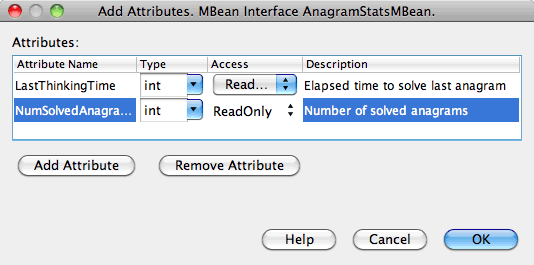
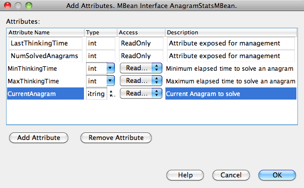
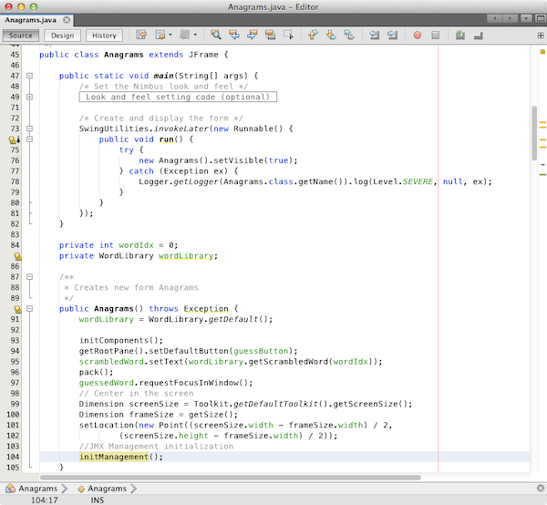
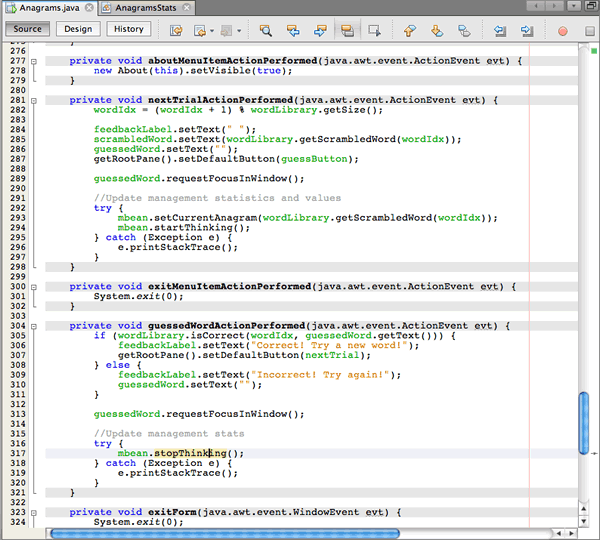
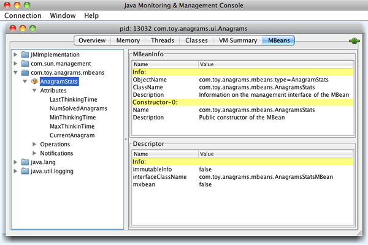

// 
//     Licensed to the Apache Software Foundation (ASF) under one
//     or more contributor license agreements.  See the NOTICE file
//     distributed with this work for additional information
//     regarding copyright ownership.  The ASF licenses this file
//     to you under the Apache License, Version 2.0 (the
//     "License"); you may not use this file except in compliance
//     with the License.  You may obtain a copy of the License at
// 
//       http://www.apache.org/licenses/LICENSE-2.0
// 
//     Unless required by applicable law or agreed to in writing,
//     software distributed under the License is distributed on an
//     "AS IS" BASIS, WITHOUT WARRANTIES OR CONDITIONS OF ANY
//     KIND, either express or implied.  See the License for the
//     specific language governing permissions and limitations
//     under the License.
//

= JavaアプリケーションへのJava Management Extensions (JMX)インストゥルメントの追加
:jbake-type: tutorial
:jbake-tags: tutorials 
:jbake-status: published
:icons: font
:syntax: true
:source-highlighter: pygments
:toc: left
:toc-title:
:description: JavaアプリケーションへのJava Management Extensions (JMX)インストゥルメントの追加 - Apache NetBeans
:keywords: Apache NetBeans, Tutorials, JavaアプリケーションへのJava Management Extensions (JMX)インストゥルメントの追加

*予想される所要時間: 60分*

NetBeans JMXウィザード・モジュールは、NetBeans IDEでJMXテクノロジとワークフローを統合します。このモジュールを使用すると、管理アプリケーションの迅速な開発、既存アプリケーションへの管理の追加、マネージャ・アプリケーションの開発、仮想マシンの状態のモニターが可能になります。

このチュートリアルでは、既存のアプリケーション(NetBeansサンプルAnagrams Gameアプリケーション)に管理を追加する方法を示します。まず、非管理可能Anagram Javaプロジェクトを作成します。JMXウィザードを使用して管理の90%を生成します。次に、アプリケーションに固有の管理動作を実装します。最後に、JConsoleでプロジェクトの実行/デバッグを使用して、Anagram MBeanを視覚化します。

== チュートリアルの課題

image::images/netbeans-stamp-80-74-73.png[title="このページの内容は、NetBeans IDE 7.2、7.3、7.4および8.0に適用されます"]

* <<Exercise_1,課題1: NetBeansサンプルAnagram Gameプロジェクトの作成>>
* <<Exercise_2,課題2: AnagramsStats JMX標準MBeanとその管理インタフェースの作成>>
* <<Exercise_3,課題3: AnagramsStats JMX標準MBeanへの属性、操作および通知の追加>>
* <<Exercise_4,課題4: AnagramsStats JMX標準MBeanへの実装コードの追加>>
* <<Exercise_5,課題5: 管理とアプリケーションの接続>>
* <<Exercise_6,課題6: JConsoleを使用したAnagram Gameの実行>>

=== 前提条件

このチュートリアルは、次のテクノロジについて基本的な知識またはプログラミング経験を持つ読者を想定して書かれています。

* JMXテクノロジ: link:http://download.oracle.com/javase/6/docs/technotes/guides/jmx/index.html[+JMXオンライン・ドキュメント+]
* Javaテクノロジ: link:http://www.oracle.com/technetwork/java/javase/tech/index.html[+Java SEテクノロジ早見表+]
* NetBeans IDE

link:http://download.oracle.com/javase/6/docs/technotes/guides/management/index.html[+Javaプラットフォームのモニタリングおよび管理+]の内容が参考になる場合もあります。

=== チュートリアルに必要なソフトウェア

このチュートリアルでは、コンピュータに次のソフトウェアをインストールしておく必要があります。

|===
|ソフトウェアまたはリソース |必須バージョン 

|link:https://netbeans.org/downloads/index.html[+NetBeans IDE+] |7.2、7.3、7.4、8.0、Javaバージョン 

|link:http://www.oracle.com/technetwork/java/javase/downloads/index.html[+Java Development Kit (JDK)+] |バージョン7または8 

|JMXプラグイン |NetBeans更新センターから入手可能 

|JConsoleプラグイン |NetBeans更新センターから入手可能 
|===

*JMX*および*JConsole*のプラグインをインストールするには、「ツール」>「プラグイン」を選択し、NetBeansアップデート・センターからモジュールをダウンロードします。

=== リソース

== 課題1: NetBeansサンプルAnagram Gameプロジェクトの作成

この課題の目標は、実行可能なJavaプロジェクトを作成することです。Anagramゲームは、単語内の文字を並べ替えてユーザーに表示し、ユーザーがアナグラムを解くのを待つSwingアプリケーションです。

1. 「ファイル」>「新規プロジェクト」([Ctrl]-[Shift]-[N])を選択します。
2. 「サンプル」>「Java」カテゴリを選択します。
3. Anagram Gameプロジェクトを選択します。「次」をクリックします。
4. 「プロジェクトの名前と場所」パネルでプロジェクトの場所を設定するか、デフォルト値で問題なければそのままにします。「メイン・プロジェクトとして設定」チェックボックスが選択されていない場合は選択します。これによって、後続の処理が簡単になります。「終了」をクリックします。

「終了」をクリックすると、IDEによってAnagram Gameプロジェクトが作成され、そのプロジェクトが「プロジェクト」ウィンドウに表示されます。

. AnagramGameプロジェクトを右クリックし、「プロパティ」を選択します。

. 「ソース」カテゴリを選択し、「ソース/バイナリ形式」がJDK 7またはJDK 8に設定されていることを確認します。「OK」をクリックします。

*注意:*「JDK 7」または「JDK 8」を選択するには、AnagramGameプロジェクトのJavaプラットフォームもそれぞれJDK 7またはJDK 8以上である必要があります。AnagramGameのJavaプラットフォームは、「プロパティ」ウィンドウの「ライブラリ」カテゴリで変更できます。

. Anagram Gameプロジェクト・ノードを右クリックし、「実行」を選択します。

「実行」をクリックすると、IDEによってAnagram Gameアプリケーションがビルドおよび起動されます。

== 課題2: AnagramsStats JMX標準MBeanとその管理インタフェースの作成

この課題の目標は、実装クラスと管理インタフェースで構成されるスケルトンJMX標準MBeanを作成することです。

次の手順を実行して、JMX標準MBeanを作成します。

1. Anagram Gameプロジェクトがメイン・プロジェクトとして設定されていることを確認します。
2. 「ファイル」>「新規ファイル」([Ctrl]-[N])を選択します。
3. 「JMX」カテゴリから、「標準MBean」を選択します。「次」をクリックします。

image::images/jmx-newfile.png[title="新規ファイル・ウィザードの標準MBeanファイル・タイプ"]

. 「名前と場所」パネルで次の情報を入力します。
* クラス名:  ``AnagramsStats`` 
* 場所: ソース・パッケージ(デフォルト)
* パッケージ:  ``com.toy.anagrams.mbeans`` 
* 説明:  ``Monitoring and Management of the Anagrams Game`` 

image::images/jmx-newmbean.png[]

. 「終了」をクリックします。

「終了」をクリックすると、 ``AnagramsStats``  MBeanクラスおよび ``AnagramsStatsMBean``  MBeanインタフェースがAnagramGameプロジェクトの ``com.toy.anagrams.mbeans`` パッケージに作成されます。これらは、次の課題で移入されるの空のスケルトンです。

== 課題3: AnagramsStats JMX標準MBeanへの属性、操作および通知の追加

この課題の目標は、ユーザーが新しいアナグラムを解くのにかかった時間をモニターし、アナグラムが解かれるたびにJMX通知が送信されるよう、生成されたMBeanスケルトンに移入することです。

MBeanには、次が含まれます。

*  ``LastThinkingTime`` および ``NumResolvedAnagrams`` という名前の2つの属性
*  ``resetAll`` という名前の操作。
* タイプ ``AttributeChangeNotification`` の通知。この通知は ``LastThinkingTime`` が更新されると送信されます。

次の手順を実行して、MBeanスケルトンに移入します。

1. NetBeansエディタで ``AnagramsStats.java``  MBean実装ファイルを開きます。
2. ソース・エディタで右クリックし、ポップアップ・メニューで*「JMX」>「MBean属性の追加」*を選択します。
3. 「属性の追加」ボタンをクリックして次の情報を指定し、 ``LastThinkingTime`` 属性を追加します。
* 属性名:  ``LastThinkingTime`` 
* 型: int
* アクセス: 読取り専用
* 説明:  ``Elapsed time to solve last anagram`` 

*注意:*まだ「OK」をクリックしないでください。

. 「属性の追加」を再度クリックし、次の ``NumSolvedAnagrams`` 属性を追加します。「OK」をクリックします。
* 属性名:  ``NumSolvedAnagrams`` 
* 型: int
* アクセス: 読取り専用
* 説明:  ``Number of solved anagrams`` 

読取り専用の ``LastThinkingTime`` および ``NumSolvedAnagrams`` 属性を公開するために必要なコードが、 ``AnagramsStats``  MBeanクラスとそのインタフェースの両方に生成されます。

プライベート・フィールド宣言およびパブリック取得メソッドを確認できます。正確には、メンバー・ビューおよび生成されたコードを確認すると、 ``getLastThinkingTime`` および ``getNumSolvedAnagrams`` メソッドが ``AnagramsStats`` クラスとその ``AnagramsStatsMBean`` インタフェースの両方に生成されていることが確認できます。 ``int`` 型のプライベート・フィールド ``lastThinkingTime`` および ``numSolvedAnagrams`` も生成されており、実際の属性値の格納に使用されます。

次に、ユーザーが解答までにかかった最小と最大の思考時間および現在ユーザーに表示されているアナグラムを追跡するために、属性をさらに3個追加します。

. ソース・エディタで右クリックし、ポップアップ・メニューで*「JMX」>「MBean属性の追加」*を選択します。

. 「属性の追加」ボタンをクリックし、次の属性を追加します。
|===

|属性名 |型 |アクセス |説明 

|MinThinkingTime |int |読取り専用 |アナグラムを解くのにかかった最小時間 

|MaxThinkingTime |int |読取り専用 |アナグラムを解くのにかかった最大時間 

|CurrentAnagram |文字列 |読取り専用 |現在解いているアナグラム 
|===

ダイアログ・ボックスは次のイメージのような表示になります。

*注意:*作成した属性がダイアログ・ボックスにリストされていることに注意してください。

. 「OK」をクリックして変更内容を保存します。

. ソース・エディタで右クリックし、ポップアップ・メニューで*「JMX」>「MBean操作の追加」*を選択します。

. 「操作の追加」をクリックし、 ``resetAll()`` 操作を追加して次の詳細を指定します。「OK」をクリックします。
* 操作名:  ``resetAll`` 
* 戻り型:  ``void`` 
* パラメータ: (空のままにします)
* 例外: (空のままにします)
* 説明:  ``Reset MBean state`` 

image::images/jmx-addoperation.png[title="「操作の追加」ダイアログでのresetAll操作の追加"]

「OK」をクリックすると、 ``resetAll`` 操作を公開するために必要なコードが ``AnagramsStats``  MBeanクラスとそのインタフェースの両方に生成されていることが確認できます。

. ソース・エディタで右クリックし、ポップアップ・メニューで*「JMX」>「NotificationEmitterインタフェースの実装」*を選択します。

. 「NotificationEmitterインタフェースの実装」ダイアログで次の詳細を指定します。
* *「ブロードキャスタへの委任の生成」を選択します。* ``NotificationEmitter`` インタフェースによって宣言されているすべてのメソッドは、通知ブロードキャスタに委任することで実装されます。通知ブロードキャスタは、MBeanが通知を送信する方法を簡略化します。
* *「プライベート順序番号とアクセッサの生成」を選択します。*送信される各通知に追加される一意の順序番号値を処理するためのコードが生成されます。
* *「通知の追加」をクリックします。*通知表で次の詳細を指定します。
* 通知クラス:  ``javax.management.AttributeChangeNotification`` 
* 通知タイプ: (自動的に ``ATTRIBUTE_CHANGE`` に設定されます)
* 説明:  ``Anagram is Solved`` 

image::images/jmx-changenotification.png[title="「NotificationEmitterの実装」ダイアログでの変更通知の追加"]

「OK」をクリックします。

 ``NotificationEmitter`` インタフェースを実装するために必要なコードが ``AnagramsStats``  MBeanクラスに生成されていることが確認できます。生成された実装によって通知の処理が ``NotificationBroadcasterSupport`` クラスに委任されたことが確認できます。

. 変更を保存します。

この課題では、JMXウィザード・モジュールを使用して、属性、操作および通知の送信をMBeanに追加する方法を学習しました。これで、管理情報を公開するために必要なインフラストラクチャをMBeanに移入するために必要な手順が終了しました。 ``AnagramsStats``  MBeanクラスの実装に内部ロジックを追加し、MBeanとAnagram Gameアプリケーションの間にブリッジを作成する必要があります。

== 課題4: AnagramsStats JMX標準MBeanへの実装コードの追加

この課題では、 ``AnagramsStats``  MBeanクラスの実装に内部ロジックを追加します。

次の手順を実行して、実装コードを追加します。

1. 属性にはすでにプライベート・フィールドが宣言されており、取得メソッドには何も追加する必要がありません。
2.  ``resetAll()``  メソッドを実装する必要があります。生成された本体は空です。 ``resetAll()`` がコールされたら、単にすべてのカウンタを0に設定します。次(太字部分)のコード行を ``resetAll()`` メソッド本体に追加します。

[source,java]
----

public void resetAll() {
    *minThinkingTime = 0;
    maxThinkingTime = 0;
    lastThinkingTime = 0;
    numSolvedAnagrams = 0;*
}
----

. 次の処理を行う実装コードも追加する必要があります。
* ユーザーが最後のアナグラムを解くのにかかった思考時間の計算
* 最小および最大の思考時間の計算
* 解かれたアナグラムのカウンタの増分
* 現在のアナグラムの把握
* アナグラムが解かれた時の通知の作成と送信

その目的で、最後のアナグラムがユーザーに表示された時間を格納するためのプライベート・フィールド ``startTime`` 、前述の操作を実行するための ``startThinking()`` および ``stopThinking()`` の2つのメソッドおよび ``setCurrentAnagram()`` メソッドを追加します。

次のコードを ``AnagramsStats.java`` (たとえば、クラスの実装の最後など)に追加します。

[source,java]
----

/*
 * Methods exposed to Anagrams application to feed management with data.
 */

//Stores the time at which a new anagram is proposed to the user.
private long startTime;

/**
 * A new Anagram is proposed to the user: store current time.
 */
public void startThinking() {
    startTime = System.currentTimeMillis();
}

/**
 * An Anagram has been resolved.
 */
public void stopThinking() {

    //Update the number of resolved anagrams
    numSolvedAnagrams++;

    // Compute last, min and max thinking times
    lastThinkingTime = (int) (System.currentTimeMillis() - startTime) / 1000 ;
    minThinkingTime = (lastThinkingTime < minThinkingTime || minThinkingTime == 0) ?
                      lastThinkingTime :
                      minThinkingTime;
    maxThinkingTime = (lastThinkingTime > maxThinkingTime) ?
                      lastThinkingTime :
                      maxThinkingTime;

    //Create a JMX Notification
    Notification notification = new Notification(AttributeChangeNotification.ATTRIBUTE_CHANGE,
            this,
            getNextSeqNumber(),
            "Anagram solved: " + currentAnagram);

    // Send a JMX notification.
    broadcaster.sendNotification(notification);
}

/**
 * Set latest anagram which has been computed by the Anagram application
 */
public void setCurrentAnagram(String currentAnagram) {
    this.currentAnagram = currentAnagram;
}
----

 ``startThinking()`` 、 ``stopThinking()`` および ``setCurrentAnagram()`` の3つのメソッドは ``AnagramsStatsMBean`` インタフェースで宣言されていないため、MBean管理インタフェースの一部ではないことに注意してください。ただし、アナグラムがユーザーに表示された時間、アナグラムが解かれた時間および現在のアナグラムをMBeanに示すためにAnagram Gameアプリケーションによってコールされるため、パブリックです。つまり、アプリケーションとMBeanの間のブリッジという必須部分です。

アナグラムが解かれるたびに ``ATTRIBUTE_CHANGE`` タイプのJMX通知が送信されることにも注意してください。

これで、MBeanの実装が終了しました。この項では、次の処理を可能にするためのコードおよびメソッドを追加しました。

* 内部MBean状態の更新
* アプリケーションからのコール
* JMX通知の送信

== 課題5: 管理とアプリケーションの接続

この課題では、MBeanにアクセスして管理情報を渡すためのコードをAnagram Gameアプリケーションに追加します。

次の手順を実行します。

1. エディタで ``Anagrams.java`` を開きます。

 ``com.toy.anagrams.ui`` パッケージの ``Anagrams`` クラスは、Anagram Gameアプリケーションの ``main`` クラスです。 ``Anagrams`` クラスはユーザー・インタフェース・クラスでもあるため、ファイルはエディタの「デザイン」ビューで開きます。

. エディタ・ウィンドウの上部にある「ソース」ボタンをクリックして、「ソース」ビューでクラスを編集します。

. 次の空の ``initManagement()`` プライベート・メソッドを ``Anagrams`` クラス( ``Anagrams`` コンストラクタの後)に追加します。

[source,java]
----

/**
 * JMX initialization:
 * Create and register Anagrams MBean in Platform MBeanServer.
 * Initialize thinking time and current anagram.
 */
private void initManagement() throws Exception {

}
----

. 次の ``initManagement()`` メソッドへのコールを ``Anagrams`` クラス・コンストラクタの最後、コンストラクタの終わりを表す終了の波括弧の前に追加します。

[source,java]
----

//JMX Management initialization
initManagement();
          
----

また、コンパイルするには、 ``throws Exception`` 句を ``Anagrams()`` コンストラクタに追加し、 ``Main()`` メソッド内の ``new Anagrams().setVisible(true);`` 文をtryとcatchで囲む必要があります。エディタの左マージンに提案グリフが表示されます。コードの行に挿入カーソルを置いて「Alt-Enter」と入力し、ソース・エディタにコードのヒントを呼び出すことができます。

image::images/jmx-initmanagement-try.png[title="tryとcatchを追加するためのコードのヒント"]

この段階では次のようになっているはずです[図をクリックして拡大]。

[.feature]
--

--

. ここで、JMXモジュールMBean登録ウィザードを使用して、MBean登録コードを ``initManagement()`` メソッドに追加します。

 ``Anagrams.java`` ソース・エディタ・ウィンドウで、 ``initManagement()`` メソッド本体*内*を右クリックし、「JMX」サブメニュー、「MBean登録の生成」アクションの順に選択します。表示された「MBeanのインスタンス化と登録」パネルで、「既存のMBeanの登録」ラジオ・ボタンを選択されたままにし、「参照」ボタンをクリックします。「参照」パネルで「 ``AnagramsStats`` 」MBeanクラスを選択し、「OK」をクリックします。表示は次のようになります。

image::images/jmx-registermbeandialog.png[]

自動的に指定されたMBeanオブジェクト名とコンストラクタを変更する必要はありません。「OK」をクリックすると、 ``initManagement()`` メソッド本体にMBean登録コードが生成されます。

=== MBeanの命名のベスト・プラクティス

* MBeanに命名する際、オブジェクト名に" ``type=`` "キーを使用します。このキーの値は、MBeanクラス(ここでは、 ``AnagramsStats`` )です。
* シングルトンMBean(アプリケーション内に1つのインスタンスを持つMBean)の場合、命名目的ではこの一意キーで十分です。
* 多くのドメイン名を作成しないようにします。アプリケーションJavaパッケージ名を使用します。デフォルトのドメイン名を使用することもできます。 ``ObjectName``  " ``:`` "セパレータの前にドメインを指定しないと、暗黙的にデフォルトのドメインが参照されます。

ベスト・プラクティスを適用すると、MBeanの命名方法がより正式なものになります。

前述の場合にデフォルトで作成される ``ObjectName`` は、 ``com.toy.anagrams.mbeans:type=AnagramsStats`` です。

このチュートリアルのコンテキストでは、追加の手順が必要です。アプリケーションで管理インタフェースを実装するクラス( ``AnagramsStats`` )にアクセスします。これは一般的なルールではありませんが、アプリケーションでMBeanにデータをプッシュする必要がある場合に有用です。ここでは、 ``startThinking()`` 、 ``stopThinking()`` および ``setCurrentAnagram()`` メソッドは管理メソッドではありませんが、イベントが発生したことをMBeanに通知するためにAnagrams Gameアプリケーションによって使用されます。すると、MBeanが状態を更新します。 ``AnagramsStats`` を ``Anagrams``  UIクラスからアクセスできるようにするには、 ``AnagramsStats``  MBeanのインスタンスへの直接参照を保持するための ``Anagrams`` クラスが必要です。

したがって、 ``Anagrams.java`` ファイルのコードに次の変更を行う必要があります。

. 次のプライベート・フィールドを ``Anagrams`` クラスに追加します。

[source,java]
----

    // Reference to the AnagramsStats MBean
    private AnagramsStats mbean;
    
----

. 生成されたMBean登録コードを次のように変更して、 ``initManagement()`` メソッド内の ``AnagramsStats``  MBeanへの参照を初期化します。

[source,java]
----

private void initManagement() throws Exception {
    try { // Register MBean in Platform MBeanServer
         *mbean = new AnagramsStats();*
         ManagementFactory.getPlatformMBeanServer().
                registerMBean(*mbean*,
                new ObjectName("com.toy.anagrams.mbeans:type=AnagramsStats"));
    } catch (JMException ex) {
        *ex.printStackTrace();*
}
----

.  ``AnagramsStats``  MBeanの状態を初期化します。Anagrams Gameアプリケーションが起動されると、アナグラムがすぐに表示されます。MBeanにアナグラム文字列値を渡し、思考時間の計算を開始する必要があります。次の行をコピーして ``initManagement()`` メソッドの最後に貼り付けます。

[source,java]
----

       // When the Anagrams game is first displayed, a word is proposed to the user.
       // We must start time computing and set the current anagram
       mbean.startThinking();
       mbean.setCurrentAnagram(wordLibrary.getScrambledWord(wordIdx));
      
----

この段階では次のようになっているはずです[図をクリックして拡大]。

[.feature]
--
image:images/jmx-initmanagement2-sm.png[role="left", link="images/jmx-initmanagement2.png"]
--

ユーザーのアナグラムの解答の実績を追跡するコードを追加する必要があります。

.  ``nextTrialActionPerformed()`` メソッドを見つけて、次のコードを ``nextTrialActionPerformed()`` メソッドの最後に貼り付けます。

[source,java]
----

    //Update management statistics and values
    try {
        mbean.setCurrentAnagram(wordLibrary.getScrambledWord(wordIdx));
        mbean.startThinking();
        } catch (Exception e) {e.printStackTrace();}
----

新しいアナグラムがユーザーに表示されるたびに、MBeanにそのアナグラムが示され、ユーザーの思考時間のカウントを開始するよう指示されます。

.  ``guessedWordActionPerformed()`` メソッドを見つけ、次の行をコードに追加します。変更を保存します。

[source,java]
----

    //Update management stats
    try {
        mbean.stopThinking();
    } catch(Exception e) {e.printStackTrace();}
----

アナグラムが正しく解かれるたびに、MBeanで ``stopThinking()`` メソッドがコールされます。

エディタの表示は次のようになります[図をクリックして拡大]。

[.feature]
--

--

これで、JMX管理レイヤーとアプリケーション・レイヤーのリンクが終了しました。次の項では、Anagrams Gameアプリケーションをビルドして実行し、公開された管理情報をJConsole GUIを介して確認します。

== 課題6: JConsoleを使用したアプリケーションの実行

この課題では、プロジェクトをビルドおよび実行し、JConsoleに接続してJVMの状態とアプリケーションのMBeanを視覚化する方法を学習します。

次の手順を実行して、アプリケーションを実行し、管理情報を表示します。

1. 1つの手順でこれらの3つのタスクを実行します。ツールバーの「モニタリングと管理付きでメイン・プロジェクトを実行」ボタン(image:images/run-project24.png[title="モニタリングおよび管理によるメイン・プロジェクトの実行のボタン"])をクリックします。

メイン・メニューの「実行」メニューからアクションを起動することもできます。

*注意:*アプリケーションを初めてビルドして実行する場合、 ``build.xml`` ファイルが更新されることを示す警告ダイアログが表示されます。ダイアログで「OK」をクリックします。

image::images/jmx-firsttime.png[title="初めてアプリケーションをモニタリングする場合の警告ダイアログ"]

「出力」ウィンドウで実行を追跡できます。

image::images/jmx-compiling.png[title="処理を表示している「出力」ウィンドウ"]

IDEでAnagramゲームがビルドされて起動され、自動的にJConsoleウィンドウが開きます。

image::images/jmx-anagram.png[title="アナグラム・ゲーム"]

*注意:*コンソールからアナグラム・ゲーム・プロセスに接続しようとすると、Java Monitoring &amp; Management Consoleに「接続に失敗しました。」という警告が表示されることがあります。このチュートリアルでは、接続の認証を求めるメッセージが表示されたら、「非セキュア」をクリックできます。

. JConsoleウィンドウで「MBeans」タブを選択します。

. 左ペインのツリー・レイアウトで、 ``com.toy.anagrams.mbeans`` の下のノードをすべて展開します。

. 「通知」ノードを選択し、下にある「サブスクライブ」ボタンをクリックして、アナグラムが解決されるたびにJConsoleが新規通知を受け取れるようにします。

. 「Anagrams Game」ウィンドウで最初の3、4個のアナグラムを解きます。

アナグラムの解答(abstraction、ambiguous、arithmetic、backslash、...)は、 ``WordLibrary`` クラスに含まれます。

. JConsoleウィンドウで、解答のたびに通知を受信していることを確認します。
[.feature]
--

image::images/jmx-jconsole-mbeans2-sm.png[role="left", link="images/jmx-jconsole-mbeans2.png"]

--

. 「属性」ノードをクリックし、属性値が更新されていることを確認します。

image::images/jmx-jconsole-mbeans3.png[title="AnagramsStatsノードを表示した「MBeans」タブ"]

JConsoleインタフェースとAnagrams Gameを試すことができます。たとえば、管理操作 ``resetAll()`` を起動すると、MBeanの属性値が0にリセットされることがわかります。

*これで終了です。よくできました。おめでとうございます。*

link:/about/contact_form.html?to=3&subject=Feedback:%20Adding%20Java%20Management%20Extensions%20(JMX)%20Instrumentation[+このチュートリアルに関するご意見をお寄せください+]

== 関連項目

詳細は、次を参照してください:

* link:jmx-getstart.html[+NetBeans IDEでのJMXモニタリングの開始+]
