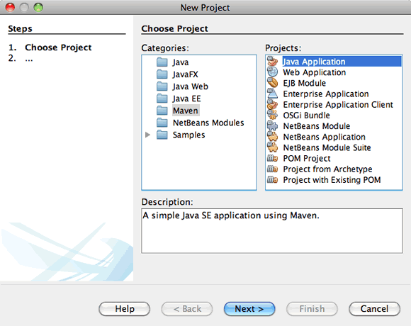
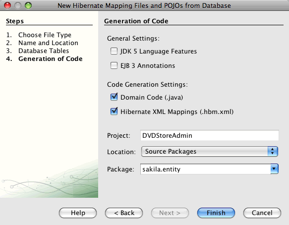
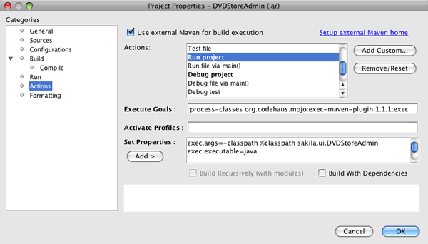

// 
//     Licensed to the Apache Software Foundation (ASF) under one
//     or more contributor license agreements.  See the NOTICE file
//     distributed with this work for additional information
//     regarding copyright ownership.  The ASF licenses this file
//     to you under the Apache License, Version 2.0 (the
//     "License"); you may not use this file except in compliance
//     with the License.  You may obtain a copy of the License at
// 
//       http://www.apache.org/licenses/LICENSE-2.0
// 
//     Unless required by applicable law or agreed to in writing,
//     software distributed under the License is distributed on an
//     "AS IS" BASIS, WITHOUT WARRANTIES OR CONDITIONS OF ANY
//     KIND, either express or implied.  See the License for the
//     specific language governing permissions and limitations
//     under the License.
//

= Hibernateを使用したMaven Swingアプリケーションの作成 - NetBeans IDEチュートリアル
:jbake-type: tutorial
:jbake-tags: tutorials 
:jbake-status: published
:icons: font
:syntax: true
:source-highlighter: pygments
:toc: left
:toc-title:
:description: Hibernateを使用したMaven Swingアプリケーションの作成 - NetBeans IDEチュートリアル - Apache NetBeans
:keywords: Apache NetBeans, Tutorials, Hibernateを使用したMaven Swingアプリケーションの作成 - NetBeans IDEチュートリアル

このチュートリアルでは、NetBeans IDEを使用して、Mavenの原型からJava Swingアプリケーションを作成します。このアプリケーションではHibernateフレームワークを持続性レイヤーとして使用し、リレーショナル・データベースからPOJO (plain old Java objects)を取得します。このチュートリアルでは、IDEのウィザードを使用して必要なHibernateファイルを作成し、Hibernateの依存性をPOMに追加する方法をデモンストレーションします。Javaオブジェクトを作成し、Hibernateを使用するようにアプリケーションを構成した後、データを検索および表示するGUIインタフェースを作成します。

MavenのサポートはNetBeans IDEに完全に統合され、Maven 3がIDEにバンドルされています。バンドルされたMavenの原型から、または新規プロジェクト・ウィザード内のリモート・リポジトリの原型からアプリケーションを作成できます。「Mavenリポジトリ・ブラウザ」では、ローカルおよびリモートのMavenリポジトリの操作、アーティファクトの調査、プロジェクトのPOMへのプロジェクトの依存性の追加を実行できます。

Antを使用してこのアプリケーションをビルドするには、link:hibernate-java-se.html[+Java SwingアプリケーションでのHibernateの使用+]を参照してください。

Maven Java EEアプリケーションをビルドするには、link:../javaee/maven-entapp.html[+Mavenを使用したエンタープライズ・アプリケーションの作成+]を参照してください。

image::images/netbeans-stamp-80-74-73.png[title="このページの内容は、NetBeans IDE 7.2、7.3、7.4および8.0に適用されます"]

*このチュートリアルに従うには、次のソフトウェアとリソースが必要です。*

|===
|ソフトウェアまたはリソース |必須バージョン 

|link:http://download.netbeans.org/[+NetBeans IDE+] |7.2、7.3、7.4、8.0、Javaバンドル 

|link:http://www.oracle.com/technetwork/java/javase/downloads/index.html[+Java Development Kit (JDK)+] |バージョン7または8 

|link:http://maven.apache.org/[+Maven+] |バージョン2.09以降 

|link:http://www.mysql.com/[+MySQLデータベース・サーバー+] |バージョン5.x 

|Sakilaデータベース |更新センターから入手できるプラグイン 
|===

このチュートリアルを開始する前に、必要に応じて次のドキュメントをお読みください。

link:https://netbeans.org/projects/samples/downloads/download/Samples/Java/DVDStoreAdmin-Maven.zip[+終了したプロジェクトのZIPアーカイブ+]はダウンロードできます。

== データベースの作成

このチュートリアルでは、 ``sakila`` という名前のMySQLデータベースを使用します。IDEのインストールにはサンプル・データベースが含まれていないため、このチュートリアルを開始する前に、まずデータベースを作成する必要があります。

Sakilaデータベースは、MySQLのサイトから入手できる、無料のMySQLサンプル・データベースです。sakilaデータベースを作成するには、プラグイン・マネージャを使用してSakilaサンプル・データベース・プラグインをダウンロードしてインストールできます。プラグインのインストール後、「サービス」ウィンドウからSakilaデータベースを作成できます。Sakilaデータベースは、「MySQLデータベースの作成」ダイアログ・ボックスのデータベース一覧に追加されます。

MySQLを操作するためのIDEの構成については、link:../ide/mysql.html[+MySQLデータベースへの接続+]のチュートリアルを参照してください。

1. プラグイン・マネージャを開き、Sakilaサンプル・データベース・プラグインをインストールします。
2. プラグインをインストールした後、「サービス」ウィンドウで「データベース」ノードを展開し、「MySQLサーバー」ノードを右クリックして「起動」を選択して、MySQLデータベース・サーバーを起動します。
3. 「MySQLサーバー」ノードを右クリックし、「データベースを作成」を選択します。
4. 「MySQLデータベースの作成」ダイアログ・ボックスで「新規データベース名」ドロップダウン・リストから「Sakilaデータベース」を選択します。「OK」をクリックします。

image::images/create-sakila-mysql.png[title="「MySQLデータベースの作成」ダイアログのスクリーンショット"]

「OK」をクリックすると、Sakilaデータベースを作成し、データベース表を生成するためのスクリプトがIDEによって実行されます。スクリプトを実行した結果は、「出力」ウィンドウで確認できます。「MySQLサーバー」ノードの下にSakilaデータベースのノードも追加されます。

. 「Sakila」ノードを右クリックし、「接続」を選択します。

「接続」をクリックすると、Sakilaデータベースのデータベース接続ノード( ``jdbc:mysql://localhost:3306/sakila [デフォルトの_ユーザー名_]`` )が「データベース」ノードの下に一覧表示されます。接続が開いたら、接続ノードを展開してデータベースのデータを表示できます。

== Mavenの構成

MavenはIDEにバンドルされており、IDEをインストールするとインストールされますが、これが初めてのMavenプロジェクトの場合、「オプション」ウィンドウでMavenの構成設定を確認します。

1. IDEで「オプション」ウィンドウを開きます(「ツール」→「オプション」、Macの場合は「NetBeans」→プリファレンス)。
2. 「オプション」ウィンドウで「Java」カテゴリを選択し、「Maven」タブをクリックします。
3. 「Mavenのホーム」が指定されていることを確認します。

IDEにバンドルされているMavenバージョンを使用することも、ローカルのMavenインストール(2.0.9以降が必要)の場所を指定することもできます。

. 「OK」をクリックして「オプション」ウィンドウを閉じます。

*注意:*

* Mavenサポートは、IDEでJavaが有効になっている場合に自動的に有効になります。Java EEプラグインが有効になっていない場合は、有効にする必要があります。
* NetBeans IDE 7.1およびIDEの以前のバージョンでは、「オプション」ウィンドウの「Maven」タブは「その他」カテゴリ内にあります。

=== Mavenリポジトリの表示

Mavenですべてのプロジェクトをビルドするために使用されるアーティファクトは、ローカルMavenリポジトリに格納されます。アーティファクトがプロジェクトの依存性として宣言されると、そのアーティファクトは登録されたリモート・リポジトリの1つからローカル・リポジトリにダウンロードされます。

デフォルトで、よく知られている索引付きのMavenリポジトリがいくつか登録され、リポジトリ・ブラウザに一覧表示されます。登録されたリポジトリには、プロジェクトのビルドに必要な、ほとんどの公開アーティファクトが含まれています。ほとんどの場合、プライベート・リポジトリにのみに存在するアーティファクトがプロジェクトで必要にならないかぎり、追加のリポジトリを登録する必要はありません。

ローカルおよびリモートのMavenリポジトリを調べて、「サービス」ウィンドウで更新の即時確認を実行できます。ローカル・リポジトリまたはリモート・リポジトリにあるアーティファクトは、プロジェクトの依存性として追加することができます。「サービス」ウィンドウで「ローカル」リポジトリ・ノードを展開すると、ローカルに存在するアーティファクトを表示できます。リモート・リポジトリ・ノードの下に一覧表示されているアーティファクトは、プロジェクトの依存性として追加することができますが、すべてのアーティファクトがローカルにあるわけではありません。これらはプロジェクトの依存性として宣言されたときのみ、ローカル・リポジトリに追加されます。

Mavenリポジトリを参照して更新するには:

1. 「ウィンドウ」>「サービス」を選択し、「サービス」ウィンドウを開きます。
2. 「サービス」ウィンドウで「Mavenリポジトリ」ノードを展開し、リポジトリを表示します。
3. リポジトリ・ノードを展開してアーティファクトを表示します。
4. リポジトリ・ノードを右クリックし、ポップアップ・メニューで「索引の更新」を選択して、リポジトリを更新します。

image::images/maven-repositories.png[title="「サービス」ウィンドウの「Mavenリポジトリ」"]

カーソルをアーティファクトの上に置くと、アーティファクトのコーディネートとともにツールチップが表示されます。アーティファクトのJARファイルをダブルクリックすると、アーティファクトについての追加詳細を表示できます。

アーティファクトを検索するには、「サービス」ウィンドウで「Mavenリポジトリ」ノードを右クリックし、「検索」を選択します。

IDEでのMavenのクラスパス依存性の管理、およびMavenリポジトリの操作の詳細は、link:http://wiki.netbeans.org/MavenBestPractices[+NetBeans IDEでのApache Mavenのベスト・プラクティス+]のlink:http://wiki.netbeans.org/MavenBestPractices#section-MavenBestPractices-DependencyManagement[+依存性管理+]の項を参照してください。

*NetBeans IDE 7.1、およびIDEの以前のバージョンに関するノート*

* Mavenリポジトリを表示するには、「ウィンドウ」>「その他」>「Mavenリポジトリ・ブラウザ」を選択します。
* 「Mavenリポジトリ・ブラウザ」のツールバーのボタンを使用して、索引を更新したり、アーティファクトを検索できます。

== Mavenアプリケーションの作成

このチュートリアルでは、DVDStoreAdminという名前の単純なJava Swingアプリケーション・プロジェクトを作成します。バンドルされたMavenの原型の1つからプロジェクトを作成し、デフォルトのプロジェクト設定を変更します。

=== 原型の選択

新規プロジェクト・ウィザードを使用すると、Maven原型からMavenプロジェクトを作成できます。IDEには、一般的なNetBeansプロジェクト・タイプ用のいくつかの原型が含まれていますが、ウィザードでリモート・リポジトリにある原型を検索して選択することもできます。

1. メイン・メニューから「ファイル」>「新規プロジェクト」([Ctrl]-[Shift]-[N]、Macの場合は[⌘]-[Shift]-[N])を選択して新規プロジェクト・ウィザードを開きます。
2. 「Maven」カテゴリから「Javaアプリケーション」を選択します。「次」をクリックします。

. プロジェクト名に「*DVDStoreAdmin*」と入力し、プロジェクトの場所を設定します。

. デフォルトの「グループID」と「バージョン」を変更します(オプション)。

プロジェクトのビルド時に、ローカル・リポジトリのアーティファクトのコーディネートとして「グループID」と「バージョン」が使用されます。

. 「終了」をクリックします。

「終了」をクリックすると、IDEがMavenプロジェクトを作成し、そのプロジェクトが「プロジェクト」ウィンドウで開きます。IDEでは、 ``com.mycompany.dvdstoreadmin`` パッケージに ``App.java`` クラスが自動的に作成されます。アプリケーションでは必要ないため、 ``App.java`` は削除してかまいません。

*注意:*初めてMavenプロジェクトを作成する場合は、いくつかの必要なプラグインとアーティファクトをローカル・リポジトリにダウンロードする必要があります。これにはある程度の時間がかかります。

=== プロジェクト・プロパティの変更

ウィザードを使用してMavenプロジェクトを作成する場合、デフォルトのプロジェクト・プロパティは原型に基づいています。場合によっては、システム要件やプロジェクト要件にあわせて、デフォルトのプロパティの変更が必要になることがあります。たとえば、このプロジェクトの場合は、プロジェクトで注釈が使用されるため、ソース・レベルが1.5以上に設定されていることを確認する必要があります。

1. プロジェクト・ノードを右クリックし、「プロパティ」を選択します。
2. 「プロパティ」ウィンドウで「ソース」カテゴリを選択します。
3. ドロップダウン・リストから選択されたソース/バイナリ形式が1.5以上であることを確認します。
4. 「エンコーディング」プロパティには、ドロップダウン・リストから「UTF-8」を選択します。「OK」をクリックします。

== Hibernateのファイルと依存性の追加

Hibernateに対するサポートを追加するには、必要なアーティファクトをPOMで依存性として宣言することで、Hibernateライブラリを使用可能にする必要があります。IDEには、プロジェクトに必要なHibernateファイルの作成に役立つウィザードが複数用意されています。IDEのウィザードを使用し、Hibernate構成ファイルとユーティリティ・ヘルパー・クラスを作成できます。ウィザードを使用してHibernate構成ファイルを作成すると、IDEによって自動的にPOMが更新され、Hibernateの依存性がプロジェクトに追加されます。

プロジェクトへの依存性の追加は、「プロジェクト」ウィンドウで行うか、または ``pom.xml`` を直接編集して行います。「プロジェクト」ウィンドウで依存性を追加するには、「プロジェクト」ウィンドウの「依存性」ノードを右クリックし、ポップアップ・メニューから「依存性の追加」を選択して「依存性の追加」ダイアログ・ボックスを開きます。依存性を追加すると、IDEによってPOMが更新され、まだローカルにない必須のアーティファクトがローカル・リポジトリにダウンロードされます。

 ``pom.xml`` を直接編集するには、「プロジェクト」ウィンドウで「プロジェクト・ファイル」ノードを展開し、 ``pom.xml`` をダブルクリックしてファイルを開きます。

=== Hibernate構成ファイルの作成

Hibernate構成ファイル( ``hibernate.cfg.xml`` )には、データベース接続、リソース・マッピング、およびその他の接続プロパティに関する情報が格納されます。ウィザードを使用してHibernate構成ファイルを作成する場合、IDEに登録されているデータベース接続のリストからデータベース接続を指定します。構成ファイルを生成すると、IDEでは接続の詳細および選択したデータベース接続に基づくダイアレクト情報が自動的に追加されます。さらに、必須のHibernate依存性を追加するようにPOMが自動的に変更されます。構成ファイルの作成後、ファイルはマルチビュー・エディタを使用して編集するか、またはXMLエディタで直接XMLを編集できます。

1. 「サービス」ウィンドウでSakilaデータベース接続を右クリックし、「接続」を選択します。
2. 「プロジェクト」ウィンドウで「ソース・パッケージ」ノードを右クリックし、「新規」>「その他」を選択して新規ファイル・ウィザードを開きます。
3. 「Hibernate」カテゴリから「Hibernate構成ウィザード」を選択します。「次」をクリックします。
4. デフォルトのファイル名( ``hibernate.cfg`` )をそのまま使用します。
5. 「参照」をクリックし、「場所」として ``src/main/resources`` ディレクトリを指定します(まだ指定されていない場合)。「次」をクリックします。
6. Sakila接続を「データベース接続」ドロップダウン・リストから選択します。「終了」をクリックします。

image::images/hib-config.png[title="データベース接続を選択するダイアログ"]

「終了」をクリックすると、エディタに ``hibernate.cfg.xml`` が表示されます。構成ファイルには、単一のデータベースに関する情報が含まれます。

「プロジェクト」ウィンドウで「依存性」ノードを展開すると、必要なHibernateアーティファクトがIDEによって追加されたことがわかります。IDEによって、プロジェクトをコンパイルするために必要な直接および推移的な依存性が、「依存性」ノードの下にすべて一覧表示されます。直接依存性であるアーティファクト(プロジェクトのPOMで指定された依存性)は、色付きのJARアイコンで示されます。アーティファクトが推移的な依存性(1つまたは複数の直接依存性の依存性であるアーティファクト)の場合は灰色で表示されます。

image::images/maven-project-libs.png[title="「プロジェクト」ウィンドウ内の「ライブラリ」ノードの下にある依存性"]

JARを右クリックし、「アーティファクトの詳細を表示」を選択すると、アーティファクトの詳細を確認できます。Artifact Viewerには、選択されたアーティファクトに関する詳細情報を示すタブが含まれています。たとえば、「基本」タブは、アーティファクトのコーディネートと使用可能なバージョンに関する詳細を示します。「グラフ」タブは、選択したアーティファクトの依存性を視覚的に表現します。

image::images/maven-artifacts-viewer.png[title="依存性を示す「グラフ」タブまたはアーティファクト・ビューア"]

「グラフ」タブを使用して、依存性間のバージョンの競合を検出し、解決することもできます。

=== Hibernate構成ファイルの変更

この課題では、 ``hibernate.cfg.xml`` で指定されたデフォルト・プロパティを、SQL文のデバッグ・ロギングが有効になるように編集します。この課題はオプションです。

1. 「デザイン」タブで ``hibernate.cfg.xml`` を開きます。このファイルを開くには、「プロジェクト」ウィンドウでプロジェクトの「構成ファイル」ノードを展開し、 ``hibernate.cfg.xml`` をダブルクリックします。
2. 「オプションのプロパティ」の下の「構成プロパティ」ノードを展開します。
3. 「追加」をクリックして「Hibernateのプロパティの追加」ダイアログ・ボックスを開きます。
4. このダイアログ・ボックスで、「 ``hibernate.show_sql`` 」プロパティを選択し、値を「 ``true`` 」に設定します。「OK」をクリックします。これにより、SQL文のデバッグ・ロギングが有効になります。

image::images/add-property-showsql.png[title="hibernate.show_sqlプロパティの設定値が表示された「Hibernateのプロパティの追加」ダイアログ・ボックス"]

. 「その他のプロパティ」ノードの下にある「追加」をクリックし、「プロパティ名」ドロップダウン・リストで「 ``hibernate.query.factory_class`` 」を選択します。

. テキスト・フィールドに*org.hibernate.hql.internal.classic.ClassicQueryTranslatorFactory*を入力します。「OK」をクリックします。

*注意:*ドロップダウン・リストから値を選択しないでください。

image::images/add-property-factoryclass-4.png[title="hibernate.query.factory_classプロパティの設定値が表示された「Hibernateのプロパティの追加」ダイアログ・ボックス"]

エディタの「XML」タブをクリックすると、ファイルがXMLビューに表示されます。ファイルの内容は次のようになります。

[source,xml]
----

<hibernate-configuration>
    <session-factory name="session1">
        <property name="hibernate.dialect">org.hibernate.dialect.MySQLDialect</property>
        <property name="hibernate.connection.driver_class">com.mysql.jdbc.Driver</property>
        <property name="hibernate.connection.url">jdbc:mysql://localhost:3306/sakila</property>
        <property name="hibernate.connection.username">root</property>
        <property name="hibernate.connection.password">######</property>
        <property name="hibernate.show_sql">true</property>
        <property name="hibernate.query.factory_class">org.hibernate.hql.internal.classic.ClassicQueryTranslatorFactory</property>
    </session-factory>
</hibernate-configuration>
----

. 変更内容をファイルに保存します。

プロジェクトを実行すると、IDEの出力ウィンドウにSQL問合せが表示されます。

===  ``HibernateUtil.java`` ヘルパー・ファイルの作成

Hibernateを使用するには、起動を処理し、Hibernateの ``SessionFactory`` にアクセスしてセッション・オブジェクトを取得するヘルパー・クラスを作成する必要があります。このクラスは、Hibernateの ``configure()`` メソッドをコールし、 ``hibernate.cfg.xml`` 構成ファイルをロードし、次に ``SessionFactory`` をビルドしてセッション・オブジェクトを取得します。

この項では、新規ファイル・ウィザードを使用してヘルパー・クラスである ``HibernateUtil.java`` を作成します。

1. 「ソース・パッケージ」ノードを右クリックし、「新規」>「その他」を選択して新規ファイル・ウィザードを開きます。
2. 「カテゴリ」の一覧から「Hibernate」を選択し、「ファイル・タイプ」の一覧から「HibernateUtil.java」を選択します。「次」をクリックします。
3. クラス名として「*HibernateUtil*」を入力し、パッケージ名として「*sakila.util*」を入力します。「終了」をクリックします。

image::images/maven-hibutil-wizard.png[title="Hibernate Utilウィザード"]

「終了」をクリックすると、 ``HibernateUtil.java`` がエディタに表示されます。このファイルは、編集する必要がないため閉じてかまいません。

== Hibernateのマッピング・ファイルおよびJavaクラスの生成

このチュートリアルでは、POJO (Plain Old Java Object)である ``Actor.java`` を使用してデータベース内のACTOR表のデータを表示します。このクラスは、表内の列のフィールドを指定し、データを取得および書込みするための単純な取得メソッドおよび設定メソッドを使用します。 ``Actor.java`` をACTOR表にマップするには、Hibernateのマッピング・ファイルを使用するか、クラスの注釈を使用します。

リバース・エンジニアリング・ウィザード、およびデータベースからのHibernateのマッピング・ファイルとPOJOウィザードを使用して、選択するデータベース表に基づいて複数のPOJOとマッピング・ファイルを作成できます。かわりに、IDEのウィザードを使用して個別のPOJOとマッピング・ファイルを最初から作成することもできます。

*注意:*複数の表に対するファイルを作成する場合は、このウィザードを使用すると便利です。このチュートリアルでは、POJOを1つとマッピング・ファイルを1つのみ作成する必要があるため、ファイルを個々に作成する方法が簡単です。<<10,POJOとマッピング・ファイルを個別に作成する>>手順については、このチュートリアルの最後に紹介します。

=== リバース・エンジニアリング・ファイルの作成

データベースからのPOJOおよびマッピング・ファイル・ウィザードを使用するには、まず、 ``hibernate.cfg.xml`` を作成した ``src/main/resources`` ディレクトリに ``reveng.xml`` リバース・エンジニアリング・ファイルを作成する必要があります。

1. 「ソース・パッケージ」ノードを右クリックし、「新規」>「その他」を選択して新規ファイル・ウィザードを開きます。
2. 「カテゴリ」の一覧から「Hibernate」を選択し、「ファイル・タイプ」の一覧から「Hibernateリバース・エンジニアリング・ウィザード」を選択します。「次」をクリックします。
3. ファイル名に「*hibernate.reveng*」と入力します。
4. 場所として* ``src/main/resources`` *を指定します。「次」をクリックします。
5. 「使用可能な表」ペインで*actor*を選択し、「追加」をクリックします。「終了」をクリックします。

このウィザードにより ``hibernate.reveng.xml`` リバース・エンジニアリング・ファイルが生成されます。リバース・エンジニアリング・ファイルは、編集する必要がないため閉じてかまいません。

*注意:*このプロジェクトには、MySQLコネクタjarライブラリ(たとえば、 ``mysql-connector-jar-5.1.13.jar`` )が必要です。「依存性」ノードの下にプロジェクトの依存性として適切なJARが一覧表示されていない場合は、「依存性」ノードを右クリックし、「依存性の追加」を選択することによって依存性を追加できます。

=== データベースからのHibernateのマッピング・ファイルとPOJOの作成

データベースからのHibernateのマッピング・ファイルとPOJOウィザードでデータベース内の表に基づいてファイルを生成します。ウィザードを使用すると、IDEにより、 ``hibernate.reveng.xml`` で指定されたデータベース表に基づいてPOJOとマッピング・ファイルが生成され、マッピング・エントリが ``hibernate.cfg.xml`` に追加されます。ウィザードを使用する場合、たとえばPOJOのみにするなど、IDEで生成するファイルを選択でき、また、たとえばEJB 3注釈を使用するコードの生成するなど、コード生成オプションを選択できます。

1. 「プロジェクト」ウィンドウで「ソース・パッケージ」ノードを右クリックし、「新規」>「その他」を選択して新規ファイル・ウィザードを開きます。
2. 「データベースからのHibernateのマッピング・ファイルとPOJO」を「Hibernate」カテゴリから選択します。「次」をクリックします。
3. 選択されていない場合、 ``hibernate.cfg.xml`` を「Hibernate構成ファイル」ドロップダウン・リストから選択します。
4. 選択されていない場合、 ``hibernate.reveng.xml`` を「Hibernateリバース・エンジニアリング・ファイル」ドロップダウン・リストから選択します。
5. 「*ドメイン・コード*」および「*Hibernate XMLのマッピング*」オプションが選択されていることを確認します。
6. パッケージ名に「*sakila.entity*」と入力します。「終了」をクリックします。

「終了」をクリックすると、IDEでPOJOの ``Actor.java`` がすべての必須フィールドともに ``src/main/java/sakila/entity`` ディレクトリに生成されます。また、Hibernateマッピング・ファイルも ``src/main/resources/sakila/entity`` ディレクトリに作成され、マッピング・エントリが ``hibernate.cfg.xml`` に追加されます。

これで、POJOと必要なHibernate関連ファイルが準備できたので、アプリケーションの単純なJava GUIフロント・エンドを作成できます。また、データベースを問い合せてデータを取得するHQL問合せを作成し、追加できます。また、このプロセスで、HQLエディタを使用して問合せをビルドおよびテストします。

== アプリケーションGUIの作成

この課題では、データを入力および表示するためのフィールドを含む、単純なJFrameフォームを作成します。また、データを取得するためのデータベース問合せをトリガーするボタンを追加します。

GUIビルダーを使用したフォームの作成に慣れていない場合は、link:gui-functionality.html[+GUIビルドの概要+]のチュートリアルを見直すことをお薦めします。

=== JFrameフォームの作成

1. 「プロジェクト」ウィンドウでプロジェクト・ノードを右クリックし、「新規」>「その他」を選択して新規ファイル・ウィザードを開きます。
2. JFrameフォームを「Swing GUIフォーム」カテゴリから選択します。「次」をクリックします。
3. クラス名に「*DVDStoreAdmin*」と入力し、パッケージ名に「*sakila.ui*」と入力します。「終了」をクリックします。

「終了」をクリックすると、IDEでクラスが作成され、JFrameフォームがエディタの「デザイン」ビューに開きます。

=== 要素のフォームへの追加

次に、UI要素をフォームに追加する必要があります。エディタの「デザイン」ビューにフォームが表示されると、IDEの右側に「パレット」が表示されます。要素をフォームに追加するには、要素をパレットからフォーム領域にドラッグします。要素をフォームに追加した後、その要素の「変数名」プロパティのデフォルト値を変更する必要があります。

1. 「ラベル」要素をパレットからドラッグし、テキストを「*俳優のプロ・フィール*」に変更します。
2. 「ラベル」要素をパレットからドラッグし、「*名*」のテキストを変更します。
3. 「テキスト・フィールド」要素を「名」ラベルの隣にドラッグし、デフォルトのテキストを削除します。

デフォルトのテキストを削除すると、テキスト・フィールドが縮小されます。テキスト・フィールドは、フォーム要素の位置を調整するために、後でサイズ変更できます。

. 「ラベル」要素をパレットからドラッグし、「*姓*」のテキストを変更します。

. 「テキスト・フィールド」要素を「姓」ラベルの隣にドラッグし、デフォルトのテキストを削除します。

. 「ボタン」要素をパレットからドラッグし、テキストを「*問合せ*」に変更します。

. 「表」要素をパレットからフォームにドラッグします。

. 次のUI要素の「変数名」の値を、次の表の値に従って変更します。

要素の「変数名」の値は、その要素を「デザイン」ビューの中で右クリックし、「変数名を変更」を選択することで変更できます。または、「変数名」を「インスペクタ」ウィンドウで直接変更することもできます。

「変数名」値を「ラベル」要素に割り当てる必要はありません。

|===
|要素 |変数名 

|「名」テキスト・フィールド | ``firstNameTextField``  

|「姓」テキスト・フィールド | ``lastNameTextField``  

|「問合せ」ボタン | ``queryButton``  

|表 | ``resultTable``  
|===

. テキスト・フィールドのサイズを変更し、フォーム要素の位置揃えを行います。

テキスト・フィールドの「水平方向にサイズ変更可能」プロパティを有効にして、要素間のスペースを維持したまま、テキスト・フィールドをウィンドウにあわせてサイズ変更することができます。

. 変更を保存します。

デザイン・ビューのフォームは、次のイメージのような外観になります。

image::images/hib-jframe-form.png[title="エディタの「デザイン」ビューのGUIフォーム"]

これで、フォーム要素にイベントを割り当てるためのコードを作成するフォームが準備できました。次の課題では、Hibernate問合せ言語に基づいて、データを取得する問合せを構築します。問合せの構築後、「問合せ」ボタンを押したときに適切な問合せを呼び出すメソッドをフォームに追加します。

== HQL問合せエディタでの問合せの作成

IDEで、HQL問合せエディタを使用してHibernate問合せ言語(HQL)に基づく問合せを構築およびテストできます。問合せを入力すると、それに相当する(変換された) SQL問合せがエディタに表示されます。ツールバーの「HQL問合せの実行」ボタンをクリックすると、IDEが問合せを実行し、エディタ下部に結果が表示されます。

この課題では、HQLエディタを使用して、姓または名の一致に基づいて俳優の詳細リストを取得する、単純なHQL問合せを構築します。問合せをクラスに追加する前に、HQL問合せエディタを使用して、接続が正しく動作し、問合せで目的の結果が生成されることをテストします。この問合せを実行するには、まずアプリケーションをコンパイルする必要があります。

1. プロジェクト・ノードを右クリックし、「ビルド」を選択します。

「ビルド」をクリックすると、IDEによって、必要なアーティファクトがローカルMavenリポジトリにダウンロードされます。

. 「プロジェクト」ウィンドウの「その他のソース」ノードの下にある、 ``<デフォルト・パッケージ>`` ソース・パッケージ・ノードを展開します。

. 「 ``hibernate.cfg.xml`` 」を右クリックし、「HQL問合せの実行」を選択してHQL問合せエディタを開きます。

. HQL問合せエディタに「 ``from Actor`` 」と入力して、接続をテストします。ツールバーの「HQL問合せの実行」ボタン(image:images/run_hql_query_16.png[title="「HQL問合せの実行」ボタン"])をクリックします。

「HQL問合せの実行」をクリックすると、問合せ結果がHQL問合せエディタの下のペインに表示されるはずです。

image::images/hib-query-hqlresults.png[title="HQL問合せ結果が表示されたHQL問合せエディタ"]

. 検索文字列が「PE」の場合、次の問合せをHQL問合せエディタに入力して「HQL問合せの実行」をクリックし、問合せ結果を確認します。

[source,java]
----

from Actor a where a.firstName like 'PE%'
----

問合せによって名前が「PE」で始まる俳優の詳細リストが返されます。

結果の上にある「SQL」ボタンをクリックすると、次のようなSQL問合せが表示されるはずです。

[source,java]
----

select actor0_.actor_id as col_0_0_ from sakila.actor actor0_ where (actor0_.first_name like 'PE%' )
----

. 新しいHQL問合せエディタのタブを開き、次の問合せをエディタ・ペインに入力します。「HQL問合せの実行」をクリックします。

[source,java]
----

from Actor a where a.lastName like 'MO%'
----

問合せによって姓が「MO」で始まる俳優の詳細リストが返されます。

問合せをテストすると、その問合せが目的の結果を返すことがわかります。次の手順では、フォームで「問合せ」ボタンをクリックすると適切な問合せが呼び出されるように、問合せをアプリケーションに実装します。

== 問合せのフォームへの追加

 ``DVDStoreAdmin.java`` を変更して、問合せ文字列を追加し、入力変数を組み込む問合せを構築して呼び出すメソッドを作成する必要があります。また、ボタン・イベント・ハンドラを変更して、正しい問合せを呼び出し、問合せ結果を表に表示するメソッドを追加する必要があります。

1.  ``DVDStoreAdmin.java`` を開き、「ソース」タブをクリックします。
2. このクラスに、次の問合せ文字列(太字部分)を追加します。

[source,java]
----

public DVDStoreAdmin() {
    initComponents();
}

*private static String QUERY_BASED_ON_FIRST_NAME="from Actor a where a.firstName like '";
private static String QUERY_BASED_ON_LAST_NAME="from Actor a where a.lastName like '";*
----

問合せをHQL問合せエディタのタブからファイルにコピーし、コードを変更できます。

. 次のメソッドを追加し、ユーザー入力文字列に基づく問合せを作成します。

[source,java]
----

private void runQueryBasedOnFirstName() {
    executeHQLQuery(QUERY_BASED_ON_FIRST_NAME + firstNameTextField.getText() + "%'");
}
    
private void runQueryBasedOnLastName() {
    executeHQLQuery(QUERY_BASED_ON_LAST_NAME + lastNameTextField.getText() + "%'");
}
----

このメソッドは、 ``executeHQLQuery()`` というメソッドをコールし、問合せ文字列をユーザーが入力した検索文字列と組み合せて問合せを作成します。

.  ``executeHQLQuery()`` メソッドを追加します。

[source,java]
----

private void executeHQLQuery(String hql) {
    try {
        Session session = HibernateUtil.getSessionFactory().openSession();
        session.beginTransaction();
        Query q = session.createQuery(hql);
        List resultList = q.list();
        displayResult(resultList);
        session.getTransaction().commit();
    } catch (HibernateException he) {
        he.printStackTrace();
    }
}
----

 ``executeHQLQuery()`` メソッドは、Hibernateをコールして、選択した問合せを実行します。このメソッドは、 ``HibernateUtil.java`` ユーティリティ・クラスを使用してHibernateセッションを取得します。

. Hibernateライブラリ( ``org.hibernate.Query`` 、 ``org.hibernate.Session`` )と ``java.util.List`` に対するインポート文を追加するように、インポートを修正します。

. デザイン・ビューに切り替えて「問合せ」ボタンをダブルクリックすることで、「問合せ」ボタン・イベント・ハンドラを作成します。

IDEで ``queryButtonActionPerformed`` メソッドが作成され、このメソッドがソース・ビューに表示されます。

. ユーザーがボタンをクリックすると問合せが実行されるように、ソース・ビューの ``queryButtonActionPerformed`` メソッドに次のコードを追加して変更します。

[source,java]
----

private void queryButtonActionPerformed(java.awt.event.ActionEvent evt) {
    *if(!firstNameTextField.getText().trim().equals("")) {
        runQueryBasedOnFirstName();
    } else if(!lastNameTextField.getText().trim().equals("")) {
        runQueryBasedOnLastName();
    }*
}
----

. 次のメソッドを追加し、結果がJTableに表示されるようにします。

[source,java]
----

private void displayResult(List resultList) {
    Vector<String> tableHeaders = new Vector<String>();
    Vector tableData = new Vector();
    tableHeaders.add("ActorId"); 
    tableHeaders.add("FirstName");
    tableHeaders.add("LastName");
    tableHeaders.add("LastUpdated");

    for(Object o : resultList) {
        Actor actor = (Actor)o;
        Vector<Object> oneRow = new Vector<Object>();
        oneRow.add(actor.getActorId());
        oneRow.add(actor.getFirstName());
        oneRow.add(actor.getLastName());
        oneRow.add(actor.getLastUpdate());
        tableData.add(oneRow);
    }
    resultTable.setModel(new DefaultTableModel(tableData, tableHeaders));
}
----

.  ``java.util.Vector`` を追加するようにインポートを修正し([Ctrl]-[Shift]-[I])、変更内容を保存します。

フォームの保存後、プロジェクトを実行できます。

== Mavenプロジェクトの実行

これでコーディングが終了したので、プロジェクトをビルドしてアプリケーションを起動できます。IDEでMavenプロジェクトをビルドすると、MavenはプロジェクトのPOMを読み取ってプロジェクトの依存性を特定します。依存性として指定されたすべてのアーティファクトは、プロジェクトをビルドするために、ローカルMavenリポジトリ内にある必要があります。必須のアーティファクトがローカル・リポジトリにない場合、Mavenは、プロジェクトをビルドおよび実行する前に、アーティファクトをリモート・リポジトリからチェックアウトします。プロジェクトのビルド後、Mavenは結果のバイナリをアーティファクトとしてローカル・リポジトリにインストールします。

*注意:*

* プロジェクトを初めてビルドおよび実行する際に、IDEで任意のプロジェクトの依存性をチェックアウトする必要がある場合は、時間がかかることがあります。それ以降のビルドは、より高速に処理されます。
* このアプリケーションを実行するには、メイン・クラスを指定する必要があります。

このアプリケーションをコンパイルして起動するには、次のタスクを実行します。

1. 「プロジェクト」ウィンドウでプロジェクトのノードを右クリックし、「プロパティ」を選択します。
2. 「プロジェクト・プロパティ」ダイアログ・ボックスで「実行」カテゴリを選択します。
3. 「メイン・クラス」に「*sakila.ui.DVDStoreAdmin*」と入力します。「OK」をクリックします。

または、「参照」ボタンをクリックし、ダイアログ・ボックスでメイン・クラスを選択できます。

image::images/browse-main-class.png[title="「メイン・クラスの参照」ダイアログでのメイン・クラスの設定"]

. メイン・ツールバーの「プロジェクトの実行」をクリックし、アプリケーションを起動します。

IDEのMavenプロジェクトで「実行」アクションを呼び出すと、IDEは「実行」アクションに関連付けられたMavenゴールを実行します。IDEには、プロジェクトのパッケージに応じてIDEのアクションにバインドされたデフォルトのゴールがあります。プロジェクトの「プロパティ」ウィンドウの「アクション」ペインで、「実行」アクションにバインドされたゴールを表示できます。

アクションに対するゴールのバインディングは、プロジェクトの「プロパティ」ウィンドウにある「アクション」ペインでカスタマイズできます。

アプリケーションを起動すると、GUIフォームが表示されます。検索文字列を「名」または「姓」テキスト・フィールドに入力し、「問合せ」をクリックして俳優を検索し、詳細を確認します。

image::images/application-run.png[title="結果が表示されたDVDStoreAdminアプリケーション"]

IDEの「出力」ウィンドウを見ると、表示された結果を取得したSQL問合せを確認できます。

=== ソリューション・プロジェクトのダウンロード

次の方法で、このチュートリアルにソリューションをプロジェクトとしてダウンロードできます。

* link:https://netbeans.org/projects/samples/downloads/download/Samples/Java/DVDStoreAdmin-Maven.zip[+終了したプロジェクトのZIPアーカイブ+]をダウンロードします。
* 次の手順を実行して、プロジェクト・ソースをNetBeansのサンプルからチェックアウトします。
1. メイン・メニューから「チーム」>「Subversion」>「チェックアウト」を選択します。
2. 「チェックアウト」ダイアログ・ボックスで次のリポジトリURLを入力します。
 ``https://svn.netbeans.org/svn/samples~samples-source-code`` 
「次」をクリックします。

. 「参照」をクリックして「リポジトリ・フォルダを参照」ダイアログ・ボックスを開きます。

. ルート・ノードを展開し、*samples/java/DVDStoreAdmin-Maven*を選択します。「OK」をクリックします。

. ソースのローカル・フォルダを指定します(ローカル・フォルダは空である必要があります)。

. 「終了」をクリックします。

「終了」をクリックすると、IDEではローカル・フォルダがSubversionリポジトリとして初期化され、プロジェクト・ソースがチェックアウトされます。

. チェックアウトが完了するときに表示されるダイアログで、「プロジェクトを開く」をクリックします。

*注意:*

* Kenaiからソースをチェックアウトする手順は、NetBeans IDE 6.7および6.8にのみ適用されます。
* Kenaiからソースをチェックアウトするには、Subversionクライアントが必要です。Subversionのインストールの詳細は、link:../ide/subversion.html[+NetBeans IDEでのSubversionガイド+]のlink:../ide/subversion.html#settingUp[+Subversionの設定+]の項を参照してください。

== 個別のPOJOおよびマッピング・ファイルの作成

POJOは単純なJavaクラスのため、新規Javaクラス・ウィザードを使用してクラスを作成し、そのクラスをソース・エディタで編集して、必要なフィールド、取得メソッドおよび設定メソッドを追加できます。POJOの作成後、ウィザードを使用してHibernateマッピング・ファイルを作成し、そのクラスを表にマップしてマッピング情報を ``hibernate.cfg.xml`` に追加します。マッピング・ファイルを最初から作成する場合、XMLエディタでフィールドを列にマップする必要があります。

*注意:*この課題はオプションで、「データベースからのHibernateのマッピング・ファイルとPOJO」ウィザードを使用して作成したPOJOおよびマッピング・ファイルの作成方法を説明します。

1. 「プロジェクト」ウィンドウの「ソース・パッケージ」ノードを右クリックし、「新規」>「Javaクラス」を選択して新規Javaクラス・ウィザードを開きます。
2. このウィザードで、クラス名に「*Actor*」と入力し、パッケージに「*sakila.entity*」と入力します。「終了」をクリックします。
3. 次の太字で表示されている変更をクラスに加え、シリアライズ可能なインタフェースを実装して、表の列のフィールドを追加します。

[source,java]
----

public class Actor *implements Serializable* {
    *private Short actorId;
    private String firstName;
    private String lastName;
    private Date lastUpdate;*
}
----

. フィールドに対する取得メソッドと設定メソッドは、挿入カーソルをソース・エディタに置き、[Alt]-[Insert]を押して「取得メソッドおよび設定メソッド」を選択することで生成します。

. 「取得メソッドおよび設定メソッドの生成」ダイアログ・ボックスですべてのフィールドを選択し、「生成」をクリックします。

image::images/getters-setters.png[title="「取得メソッドおよび設定メソッドの生成」ダイアログ・ボックス"]

「取得メソッドおよび設定メソッドの生成」ダイアログ・ボックスでは、キーボードの[↑]を使用して、選択した項目を「Actor」ノードまで移動してから、[Space]バーを押してActor内のすべてのフィールドを選択できます。

. インポートを修正して変更内容を保存します。

表のためのPOJOの作成後、 ``Actor.java`` のHibernateマッピング・ファイルを作成します。

1. 「プロジェクト」ウィンドウで「 ``sakila.entity`` 」ノードを右クリックし、「新規」>「その他」を選択して新規ファイル・ウィザードを開きます。
2. 「Hibernate」カテゴリの「Hibernateマッピング・ウィザード」を選択します。「次」をクリックします。
3. 「ファイル名」に「*Actor.hbm*」と入力し、「フォルダ」を*src/main/resources/sakila/entity*に設定します。「次」をクリックします。
4. 「マップするクラス」に「*sakila.entity.Actor*」と入力します。
5. 選択されていない場合、*actor*を「データベース表」ドロップダウン・リストから選択します。「終了」をクリックします。

image::images/mapping-wizard.png[title="「Hibernateのマッピング・ファイルの生成」ウィザード"]

「終了」をクリックすると、 ``Actor.hbm.xml``  Hibernateのマッピング・ファイルがソース・エディタで開きます。また、IDEでマッピング・リソースに対するエントリが ``hibernate.cfg.xml`` に自動的に追加されます。このエントリの詳細は、 ``hibernate.cfg.xml`` のデザイン・ビューで「マッピング」ノードを展開するか、またはXMLビューで表示できます。XMLビューの ``mapping`` エントリは、次のようになります。

[source,xml]
----

        <mapping resource="sakila/entity/Actor.hbm.xml"/>
    </session-factory>
</hibernate-configuration>
----

. 次の太字部分の変更を ``Actor.hbm.xml`` に加えて、 ``Actor.java`` のフィールドをACTOR表の列にマップします。

[source,xml]
----

<hibernate-mapping>
  <class name="sakila.entity.Actor" *table="actor">
    <id name="actorId" type="java.lang.Short">
      <column name="actor_id"/>
      <generator class="identity"/>
    </id>
    <property name="firstName" type="string">
      <column length="45" name="first_name" not-null="true"/>
    </property>
    <property name="lastName" type="string">
      <column length="45" name="last_name" not-null="true"/>
    </property>
    <property name="lastUpdate" type="timestamp">
      <column length="19" name="last_update" not-null="true"/>
    </property>
  </class>*
</hibernate-mapping>
----

エディタでコード補完を使用すると、マッピング・ファイルの変更時に値を補完できます。

*注意:* デフォルトでは、生成される ``class`` 要素には終了タグがあります。開始と終了の ``class`` 要素タグの間にプロパティ要素を追加する必要があるため、次の変更(太字で表示)を加えます。変更後、 ``class`` タグの間でコード補完を使用できます。

[source,xml]
----

<hibernate-mapping>
  <class name="sakila.entity.Actor" *table="actor">
  </class>*
</hibernate-mapping>
----

. ツールバーの「XMLの検証」ボタンをクリックし、変更内容を保存します。

POJOとHibernateのマッピング・ファイルを個別に作成すると、アプリケーションをさらにカスタマイズするときに役立つ場合があります。

link:/about/contact_form.html?to=3&subject=Feedback:%20Creating%20a%20Maven%20Project[+このチュートリアルに関するご意見をお寄せください+]

== 関連項目

Swing GUIアプリケーションの作成に関する追加情報は、次のチュートリアルを参照してください。

* link:quickstart-gui.html[+NetBeans IDEでのSwing GUIのデザイン+]
* link:gui-functionality.html[+GUIビルドの概要+]
* link:../../trails/matisse.html[+Java GUIアプリケーションの学習+]
